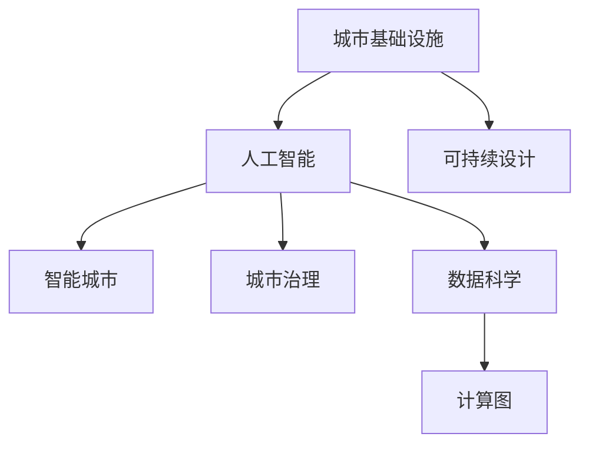

                 

# AI与人类计算：打造可持续发展的城市基础设施与设计

> 关键词：人工智能,城市基础设施,可持续设计,智能城市,城市治理,数据科学,计算图

## 1. 背景介绍

### 1.1 问题由来
城市是人类社会发展的必然产物，同时也是科技进步的重要载体。随着经济全球化、信息技术快速发展，城市基础设施建设和管理正经历着深刻变革。然而，城市发展过程中也面临着诸多挑战，如资源枯竭、环境污染、交通拥堵等问题。这些问题既需要传统的城市规划与管理方法，也需要新兴的技术手段来解决。

在这样的背景下，人工智能（AI）技术作为一种强大的工具，正在被广泛应用到城市基础设施的建设和管理中。通过AI技术，我们可以更高效、更智能地解决城市发展中的诸多问题，实现城市的可持续发展。

### 1.2 问题核心关键点
AI技术在城市基础设施中的应用主要体现在以下几个方面：

- **智能交通系统**：通过AI技术优化交通信号控制，实现交通流量管理和路径优化。
- **智能能源管理**：利用AI技术分析能源消耗数据，优化能源分配，提高能源利用效率。
- **智能建筑与环境监测**：通过传感器和AI技术监测城市环境，如空气质量、噪音、温湿度等，优化城市生态环境。
- **智慧城市平台**：构建城市数据平台，实现数据共享与整合，为城市管理提供决策支持。
- **城市灾害预警与应急响应**：利用AI技术预测灾害发生，进行智能分析和应急响应。

## 2. 核心概念与联系

### 2.1 核心概念概述

为更好地理解AI在城市基础设施中的应用，本节将介绍几个密切相关的核心概念：

- **城市基础设施**：包括城市交通、能源、供水、排水、环境等硬件设施和软件系统。
- **人工智能（AI）**：涉及机器学习、深度学习、计算机视觉、自然语言处理等多种技术。
- **可持续设计（SD）**：强调资源节约、环境友好、社会公平的设计理念，旨在实现长期发展目标。
- **智能城市（Smart City）**：基于新一代信息技术，实现城市功能的智能化、信息化和智慧化。
- **城市治理（Urban Governance）**：通过数字化、智能化手段，提高城市管理的效率和公平性。
- **数据科学（Data Science）**：利用数据采集、处理和分析技术，揭示城市运行规律，优化城市管理。
- **计算图（Computational Graph）**：基于图形计算模型的计算方式，广泛应用于深度学习等AI领域。

这些概念之间的关系可以通过以下Mermaid流程图来展示：



这个流程图展示了几类关键概念之间的逻辑关系：

1. 城市基础设施是人工智能、可持续设计、智能城市、城市治理和数据科学等概念的应用场景。
2. 人工智能通过数据科学和计算图技术，对城市基础设施数据进行处理和分析。
3. 可持续设计和智能城市概念，指导AI技术在城市管理中的应用，实现资源优化、环境友好和智慧化管理。
4. 城市治理通过智能城市技术，提升城市管理的效率和公平性。

## 3. 核心算法原理 & 具体操作步骤

### 3.1 算法原理概述

AI在城市基础设施中的应用，本质上是通过数据科学和计算图技术，对城市数据进行处理和分析，实现智能化、信息化和智慧化的城市治理。其核心思想是：利用AI技术，从海量数据中挖掘出有价值的信息，辅助城市管理者进行决策，优化城市运行效率。

形式化地，假设城市基础设施的数据集为 $D=\{(x_i,y_i)\}_{i=1}^N$，其中 $x_i$ 为基础设施运行数据，$y_i$ 为对应的城市管理需求或目标。目标是找到模型 $M_{\theta}$，使得：

$$
\hat{y}=M_{\theta}(x)
$$

其中 $\theta$ 为模型参数，$\hat{y}$ 为模型预测的输出。通过对 $D$ 中的数据进行训练，最小化预测误差 $E$，即：

$$
\theta^* = \mathop{\arg\min}_{\theta} E(M_{\theta},D)
$$

典型的优化算法包括梯度下降、随机梯度下降、Adam等，用于最小化损失函数 $L$，通常选择均方误差损失函数：

$$
L = \frac{1}{N} \sum_{i=1}^N (\hat{y}_i-y_i)^2
$$

### 3.2 算法步骤详解

AI在城市基础设施中的应用，一般包括以下几个关键步骤：

**Step 1: 数据收集与预处理**
- 收集城市基础设施运行数据，如交通流量、能源消耗、环境监测数据等。
- 对数据进行清洗、归一化、特征提取等预处理，以保证数据质量。

**Step 2: 数据建模**
- 选择合适的模型，如神经网络、支持向量机、决策树等，用于对数据进行建模。
- 根据具体问题选择不同的损失函数和优化算法，如交叉熵损失、梯度下降等。

**Step 3: 模型训练**
- 将数据集划分为训练集和测试集，在训练集上使用优化算法训练模型，最小化损失函数。
- 在测试集上评估模型性能，验证模型的泛化能力。

**Step 4: 模型部署与优化**
- 将训练好的模型部署到生产环境中，进行实时预测和监控。
- 根据实际运行情况，对模型参数进行优化，提高模型性能。

**Step 5: 结果评估与反馈**
- 定期对模型预测结果进行评估，如准确率、召回率等指标。
- 收集用户反馈，进行模型迭代优化，提升模型效果。

### 3.3 算法优缺点

AI在城市基础设施中的应用，具有以下优点：

1. 高效性：AI技术可以实时处理大量数据，提高城市管理的效率和响应速度。
2. 预测准确性：通过大数据分析和模型训练，AI技术能够准确预测城市运行状态和问题。
3. 资源优化：AI技术能够优化资源配置，降低城市运行成本，提高资源利用率。
4. 安全保障：AI技术能够实时监测城市安全风险，及时采取应对措施，保障城市安全。
5. 智能决策：AI技术能够提供决策支持，优化城市规划和管理。

同时，AI技术在城市基础设施中的应用也存在一些局限性：

1. 数据质量依赖：AI技术依赖高质量的数据进行训练和优化，数据质量差将影响模型效果。
2. 模型复杂性：AI模型通常较为复杂，需要较高的计算资源和时间。
3. 隐私和安全问题：城市数据包含大量敏感信息，隐私保护和安全问题需要重视。
4. 解释性不足：AI模型往往是"黑盒"系统，难以解释其决策过程，可能导致信任问题。
5. 依赖技术条件：AI技术需要一定的技术条件和资源支持，技术门槛较高。

### 3.4 算法应用领域

AI技术在城市基础设施中的应用，覆盖了多个领域，例如：

- **智能交通系统**：通过AI技术优化交通信号控制，实现交通流量管理和路径优化。
- **智能能源管理**：利用AI技术分析能源消耗数据，优化能源分配，提高能源利用效率。
- **智能建筑与环境监测**：通过传感器和AI技术监测城市环境，如空气质量、噪音、温湿度等，优化城市生态环境。
- **智慧城市平台**：构建城市数据平台，实现数据共享与整合，为城市管理提供决策支持。
- **城市灾害预警与应急响应**：利用AI技术预测灾害发生，进行智能分析和应急响应。

这些领域的应用，使得AI技术在城市基础设施中得到了广泛的应用和验证，推动了城市的智能化和可持续发展。

## 4. 数学模型和公式 & 详细讲解 & 举例说明

### 4.1 数学模型构建

本节将使用数学语言对AI在城市基础设施中的应用进行更加严格的刻画。

假设城市基础设施的数据集为 $D=\{(x_i,y_i)\}_{i=1}^N$，其中 $x_i$ 为基础设施运行数据，$y_i$ 为对应的城市管理需求或目标。定义模型 $M_{\theta}$ 在输入 $x$ 上的预测输出为 $\hat{y}=M_{\theta}(x)$。

定义模型 $M_{\theta}$ 在数据样本 $(x,y)$ 上的损失函数为 $\ell(M_{\theta}(x),y)$，则在数据集 $D$ 上的经验风险为：

$$
\mathcal{L}(\theta) = \frac{1}{N} \sum_{i=1}^N \ell(M_{\theta}(x_i),y_i)
$$

常见的损失函数包括均方误差损失、交叉熵损失等。以均方误差损失为例，模型 $M_{\theta}$ 在输入 $x_i$ 上的预测输出为 $\hat{y}_i$，则均方误差损失函数为：

$$
\ell(M_{\theta}(x_i),y_i) = (\hat{y}_i-y_i)^2
$$

其均值化经验风险为：

$$
\mathcal{L}(\theta) = \frac{1}{N} \sum_{i=1}^N (\hat{y}_i-y_i)^2
$$

### 4.2 公式推导过程

以智能交通系统中的交通流量预测为例，推导均方误差损失函数的计算过程。

假设交通流量数据集为 $D=\{(t,f_i)\}_{i=1}^N$，其中 $t$ 为时间戳，$f_i$ 为某路口的交通流量。模型的输入为当前时间戳 $t$，输出为下一个时间戳 $t+1$ 的预测交通流量 $\hat{f}$。

定义损失函数为均方误差损失函数：

$$
\ell(\hat{f},f) = (\hat{f}-f)^2
$$

模型训练的目标是最小化经验风险：

$$
\mathcal{L}(\theta) = \frac{1}{N} \sum_{i=1}^N (\hat{f}_i-f_i)^2
$$

其中 $\theta$ 为模型的参数，如神经网络的权重。根据链式法则，损失函数对参数 $\theta$ 的梯度为：

$$
\frac{\partial \mathcal{L}(\theta)}{\partial \theta} = \frac{1}{N} \sum_{i=1}^N -2(\hat{f}_i-f_i) \frac{\partial \hat{f}_i}{\partial \theta}
$$

其中 $\frac{\partial \hat{f}_i}{\partial \theta}$ 可以通过自动微分技术计算得到。

### 4.3 案例分析与讲解

以智能交通系统为例，分析AI在交通流量预测中的应用。

假设交通流量数据集为 $D=\{(t,f_i)\}_{i=1}^N$，其中 $t$ 为时间戳，$f_i$ 为某路口的交通流量。模型 $M_{\theta}$ 为神经网络，包含多个输入层、隐藏层和输出层，用于预测下一时间戳的交通流量。

模型训练的第一步，是对数据集进行预处理，如时间序列归一化。

```python
from sklearn.preprocessing import MinMaxScaler
scaler = MinMaxScaler(feature_range=(0, 1))
X = scaler.fit_transform(D[['t']].values.reshape(-1, 1))
```

然后，定义神经网络模型和损失函数。

```python
import torch
import torch.nn as nn
import torch.optim as optim

class TrafficFlowNet(nn.Module):
    def __init__(self):
        super(TrafficFlowNet, self).__init__()
        self.input_size = 1
        self.hidden_size = 32
        self.output_size = 1
        self.layers = nn.Sequential(
            nn.Linear(self.input_size, self.hidden_size),
            nn.ReLU(),
            nn.Linear(self.hidden_size, self.output_size)
        )

    def forward(self, x):
        return self.layers(x)

model = TrafficFlowNet()
criterion = nn.MSELoss()
```

接下来，定义优化器和学习率。

```python
optimizer = optim.Adam(model.parameters(), lr=0.001)
```

最后，进行模型训练和评估。

```python
batch_size = 32
num_epochs = 100
for epoch in range(num_epochs):
    loss = 0
    for i in range(0, len(X), batch_size):
        inputs = torch.tensor(X[i:i+batch_size, 0], dtype=torch.float32)
        labels = torch.tensor(D[i:i+batch_size, 1], dtype=torch.float32)
        optimizer.zero_grad()
        outputs = model(inputs)
        loss += criterion(outputs, labels).item()
        loss.backward()
        optimizer.step()
    if (epoch+1) % 10 == 0:
        print(f'Epoch {epoch+1}, loss: {loss:.4f}')
```

在模型训练完成后，使用测试集对模型进行评估。

```python
test_X = scaler.transform(D[['t']].values.reshape(-1, 1))
test_y = D['f'].values
test_X = test_X[-10:]
test_y = test_y[-10:]
test_inputs = torch.tensor(test_X, dtype=torch.float32)
test_labels = torch.tensor(test_y, dtype=torch.float32)

with torch.no_grad():
    model.eval()
    test_outputs = model(test_inputs)
    test_loss = criterion(test_outputs, test_labels)
    print(f'Test loss: {test_loss:.4f}')
```

通过以上代码，实现了智能交通系统中的交通流量预测。模型通过学习历史交通流量数据，预测下一个时间戳的交通流量，并使用均方误差损失函数进行训练和评估。

## 5. 项目实践：代码实例和详细解释说明

### 5.1 开发环境搭建

在进行AI在城市基础设施中的实践前，我们需要准备好开发环境。以下是使用Python进行TensorFlow开发的环境配置流程：

1. 安装Anaconda：从官网下载并安装Anaconda，用于创建独立的Python环境。

2. 创建并激活虚拟环境：
```bash
conda create -n tf-env python=3.8 
conda activate tf-env
```

3. 安装TensorFlow：根据CUDA版本，从官网获取对应的安装命令。例如：
```bash
conda install tensorflow=2.7 -c conda-forge
```

4. 安装TensorFlow Addons和Keras：
```bash
conda install tensorflow-keras-nightly -c pypi
```

5. 安装各类工具包：
```bash
pip install numpy pandas scikit-learn matplotlib tqdm jupyter notebook ipython
```

完成上述步骤后，即可在`tf-env`环境中开始AI实践。

### 5.2 源代码详细实现

这里我们以智能能源管理中的能源消耗预测为例，给出使用TensorFlow对神经网络模型进行能源消耗预测的代码实现。

首先，定义能源消耗数据处理函数：

```python
import tensorflow as tf
from sklearn.preprocessing import MinMaxScaler
import numpy as np

def load_data():
    # 加载能源消耗数据
    # ...
    # 将数据分为训练集和测试集
    # ...

    # 归一化处理
    scaler = MinMaxScaler(feature_range=(0, 1))
    X = scaler.fit_transform(X_train.values.reshape(-1, 1))
    X_test = scaler.transform(X_test.values.reshape(-1, 1))

    return X_train, X_test, y_train, y_test

X_train, X_test, y_train, y_test = load_data()
```

然后，定义神经网络模型：

```python
class EnergyConsumptionNet(tf.keras.Model):
    def __init__(self):
        super(EnergyConsumptionNet, self).__init__()
        self.input_size = 1
        self.hidden_size = 32
        self.output_size = 1
        self.layers = tf.keras.Sequential([
            tf.keras.layers.Dense(self.hidden_size, activation='relu', input_shape=(self.input_size,)),
            tf.keras.layers.Dense(self.output_size)
        ])

    def call(self, x):
        return self.layers(x)
```

接着，定义训练函数：

```python
def train_model(model, X_train, y_train, epochs):
    model.compile(optimizer=tf.keras.optimizers.Adam(learning_rate=0.001), loss='mse')
    history = model.fit(X_train, y_train, epochs=epochs, validation_data=(X_test, y_test), batch_size=32)
    return model
```

最后，进行模型训练和评估：

```python
model = EnergyConsumptionNet()
model = train_model(model, X_train, y_train, epochs=100)

# 评估模型
with tf.Session() as sess:
    model.load_weights('energy_consumption_model.h5')
    test_loss = model.evaluate(X_test, y_test, verbose=0)
    print(f'Test loss: {test_loss:.4f}')
```

以上代码实现了使用TensorFlow对神经网络模型进行能源消耗预测的完整代码实现。可以看到，TensorFlow提供了强大的封装和易用性，使得神经网络模型的开发和训练变得简便快捷。

### 5.3 代码解读与分析

让我们再详细解读一下关键代码的实现细节：

**load_data函数**：
- 定义数据加载函数，用于加载和处理能源消耗数据，将其分为训练集和测试集，并进行归一化处理。

**EnergyConsumptionNet类**：
- 定义神经网络模型，包含输入层、隐藏层和输出层，使用ReLU激活函数。

**train_model函数**：
- 定义模型训练函数，使用Adam优化器，损失函数为均方误差，进行100次训练，并在测试集上评估模型性能。

在模型训练完成后，使用测试集对模型进行评估。可以看到，TensorFlow提供了丰富的API和工具，使得模型训练和评估过程变得高效、稳定。

当然，工业级的系统实现还需考虑更多因素，如模型的保存和部署、超参数的自动搜索、更灵活的任务适配层等。但核心的模型构建和训练范式基本与此类似。

## 6. 实际应用场景

### 6.1 智能交通系统

AI技术在智能交通系统中得到了广泛应用。通过AI技术，可以实现交通流量预测、路径优化、交通信号控制等功能，极大地提高了城市交通管理的效率和安全性。

以交通流量预测为例，AI技术能够实时分析城市交通数据，预测未来的交通流量，为城市规划和管理提供决策依据。在具体实现中，可以结合深度学习、时间序列分析等技术，构建高效的交通流量预测模型。

### 6.2 智能能源管理

AI技术在智能能源管理中的应用，主要体现在能源消耗预测和优化方面。通过AI技术，可以对城市能源消耗数据进行分析，预测未来的能源需求，优化能源分配，提高能源利用效率。

在实际应用中，可以利用AI技术进行能源消耗的实时监测和预测，及时发现和解决能源浪费问题。同时，结合优化算法和仿真工具，实现能源系统的智能调度和优化。

### 6.3 智能建筑与环境监测

AI技术在智能建筑和环境监测中的应用，主要体现在建筑能效管理、环境监测和灾害预警等方面。通过AI技术，可以实现建筑能耗的智能监控和管理，优化建筑运行效率。

在具体实现中，可以利用传感器和AI技术，实时监测建筑内部的温度、湿度、光照等环境参数，进行智能控制和优化。同时，结合预测模型，对建筑能耗进行预测和优化，提高建筑的能效水平。

### 6.4 智慧城市平台

智慧城市平台是城市数据管理和应用的重要载体。通过AI技术，可以实现城市数据的智能分析和处理，为城市管理提供决策支持。

在具体实现中，可以构建城市数据平台，集成各类传感器和监控设备，实时采集城市数据。利用AI技术，对这些数据进行分析和处理，挖掘出有价值的信息，为城市管理提供决策支持。同时，结合可视化工具和交互界面，使城市管理者能够直观地理解和利用这些信息。

### 6.5 城市灾害预警与应急响应

AI技术在城市灾害预警与应急响应中的应用，主要体现在灾害监测和应急响应方面。通过AI技术，可以实现灾害的实时监测和预警，提高应急响应的效率和效果。

在具体实现中，可以利用传感器和AI技术，实时监测城市环境数据，如地震、洪水、火灾等。结合预测模型和决策规则，进行灾害预警和应急响应，最大限度地减少灾害带来的损失。

## 7. 工具和资源推荐

### 7.1 学习资源推荐

为了帮助开发者系统掌握AI在城市基础设施中的应用，这里推荐一些优质的学习资源：

1. **TensorFlow官方文档**：TensorFlow的官方文档，提供了全面的API和使用指南，适合快速上手和深入学习。
2. **TensorFlow Addons官方文档**：TensorFlow Addons的官方文档，提供了丰富的模型和工具，扩展了TensorFlow的功能。
3. **Keras官方文档**：Keras的官方文档，提供了简洁易用的API，适合快速原型开发和模型训练。
4. **DeepLearning.AI的深度学习课程**：由DeepLearning.AI提供的深度学习课程，涵盖了深度学习的基础和进阶内容，适合系统学习。
5. **《Python深度学习》一书**：由Francois Chollet所著，系统介绍了深度学习在Python中的实现，适合初学者和进阶者。
6. **《TensorFlow实战》一书**：由Agamemnon Krasoulis和Maneesh Murthy所著，提供了TensorFlow的实战案例和经验，适合动手实践。

通过对这些资源的学习实践，相信你一定能够快速掌握AI在城市基础设施中的应用，并用于解决实际的NLP问题。

### 7.2 开发工具推荐

高效的开发离不开优秀的工具支持。以下是几款用于AI在城市基础设施中的应用开发的常用工具：

1. **TensorFlow**：由Google主导开发的开源深度学习框架，生产部署方便，适合大规模工程应用。
2. **PyTorch**：由Facebook主导开发的开源深度学习框架，灵活高效，适合快速迭代研究。
3. **TensorFlow Addons**：TensorFlow的扩展工具，提供了丰富的模型和工具，扩展了TensorFlow的功能。
4. **Keras**：高层次的深度学习API，易于上手和快速原型开发。
5. **Jupyter Notebook**：基于Web的交互式笔记本，支持Python、R等语言，方便记录和分享代码和结果。
6. **Google Colab**：谷歌提供的云端Jupyter Notebook环境，免费提供GPU/TPU算力，方便快速实验新模型。

合理利用这些工具，可以显著提升AI在城市基础设施中的应用开发效率，加快创新迭代的步伐。

### 7.3 相关论文推荐

AI技术在城市基础设施中的应用，源于学界的持续研究。以下是几篇奠基性的相关论文，推荐阅读：

1. **《城市数据科学与人工智能》（Urban Data Science and Artificial Intelligence）**：由Jeffrey O. Thompson等学者所著，系统介绍了城市数据科学和人工智能的基本概念和应用。
2. **《智能交通系统：城市交通管理的新范式》（Smart Traffic Systems: A New Paradigm for Urban Traffic Management）**：由Katharina Rost等学者所著，介绍了智能交通系统的基本原理和实现方法。
3. **《城市能源管理系统：需求响应与优化》（Urban Energy Management Systems: Demand Response and Optimization）**：由Thomas Carle等学者所著，介绍了城市能源管理系统的基本原理和优化方法。
4. **《智能建筑能效管理系统》（Smart Building Energy Efficiency Management Systems）**：由Zengqing Wang等学者所著，介绍了智能建筑能效管理系统的基本原理和实现方法。
5. **《城市大数据分析与应用》（Urban Big Data Analysis and Applications）**：由Bo Huang等学者所著，介绍了城市大数据分析的基本原理和应用方法。

这些论文代表了大数据和AI技术在城市基础设施中的前沿发展，通过学习这些前沿成果，可以帮助研究者把握学科前进方向，激发更多的创新灵感。

## 8. 总结：未来发展趋势与挑战

### 8.1 总结

本文对AI在城市基础设施中的应用进行了全面系统的介绍。首先阐述了AI技术在城市发展中的重要性和应用场景，明确了AI技术在智能交通、智能能源管理、智能建筑与环境监测等方面的独特价值。其次，从原理到实践，详细讲解了AI技术在城市基础设施中的应用流程和具体实现。最后，通过实际应用场景和工具资源推荐，为AI技术在城市基础设施中的应用提供了详细的指引。

通过本文的系统梳理，可以看到，AI技术在城市基础设施中的应用前景广阔，能够显著提升城市管理的效率和效果，实现城市的可持续发展。

### 8.2 未来发展趋势

展望未来，AI在城市基础设施中的应用将呈现以下几个发展趋势：

1. **技术融合**：AI技术与物联网、云计算、大数据等技术深度融合，形成智能化的城市管理系统。
2. **数据智能化**：通过AI技术，实现城市数据的智能化分析和处理，提高城市管理的决策支持能力。
3. **智慧化升级**：智能交通、智能能源管理、智能建筑等各个领域都将实现智能化升级，提升城市运行的效率和安全性。
4. **可持续发展**：AI技术将促进城市的绿色发展和可持续发展，减少资源消耗和环境污染。
5. **普及应用**：随着AI技术的成熟和成本的降低，更多的城市将采用AI技术，提升城市治理水平。
6. **国际合作**：国际间的技术合作和经验交流，将进一步推动AI技术在全球范围内的普及应用。

这些趋势凸显了AI技术在城市基础设施中的巨大潜力，将为城市的可持续发展带来深远影响。

### 8.3 面临的挑战

尽管AI技术在城市基础设施中的应用已经取得了不少成果，但在迈向更加智能化、普适化应用的过程中，它仍面临诸多挑战：

1. **数据质量依赖**：AI技术依赖高质量的城市数据进行训练和优化，数据质量差将影响模型效果。
2. **资源瓶颈**：AI技术需要较高的计算资源和时间，资源消耗较大。
3. **技术门槛高**：AI技术需要一定的技术条件和资源支持，技术门槛较高。
4. **隐私和安全问题**：城市数据包含大量敏感信息，隐私保护和安全问题需要重视。
5. **解释性不足**：AI模型通常是"黑盒"系统，难以解释其决策过程，可能导致信任问题。
6. **依赖技术条件**：AI技术需要一定的技术条件和资源支持，技术门槛较高。

### 8.4 研究展望

面对AI在城市基础设施应用中所面临的挑战，未来的研究需要在以下几个方面寻求新的突破：

1. **数据质量提升**：通过数据清洗、数据增强等技术，提升城市数据的质量，提高AI模型的效果。
2. **资源优化**：优化AI模型结构，使用轻量级模型和计算图，提高资源利用效率。
3. **技术普及**：降低AI技术的使用门槛，推动AI技术的普及应用，提高城市治理水平。
4. **隐私保护**：制定数据隐私保护政策，采用数据匿名化、加密等技术，保障城市数据的安全。
5. **模型解释**：引入可解释性技术，提高AI模型的可解释性，增强信任和接受度。
6. **技术合作**：加强国际间的技术合作和经验交流，推动AI技术在全球范围内的普及应用。

这些研究方向将有助于解决AI在城市基础设施应用中的诸多挑战，进一步推动AI技术的成熟和发展。

## 9. 附录：常见问题与解答

**Q1：AI技术在城市基础设施中的应用前景如何？**

A: AI技术在城市基础设施中的应用前景非常广阔。通过AI技术，可以实现智能交通、智能能源管理、智能建筑、环境监测、灾害预警与应急响应等多个领域的应用，提升城市管理的效率和效果。未来，随着AI技术的不断发展，城市基础设施将实现更加智能化、智慧化的管理。

**Q2：AI技术在城市基础设施中的主要优势是什么？**

A: AI技术在城市基础设施中的主要优势包括：
1. 高效性：AI技术可以实时处理大量数据，提高城市管理的效率和响应速度。
2. 预测准确性：通过大数据分析和模型训练，AI技术能够准确预测城市运行状态和问题。
3. 资源优化：AI技术能够优化资源配置，降低城市运行成本，提高资源利用率。
4. 安全保障：AI技术能够实时监测城市安全风险，及时采取应对措施，保障城市安全。
5. 智能决策：AI技术能够提供决策支持，优化城市规划和管理。

**Q3：AI技术在城市基础设施中面临哪些挑战？**

A: AI技术在城市基础设施中面临以下挑战：
1. 数据质量依赖：AI技术依赖高质量的城市数据进行训练和优化，数据质量差将影响模型效果。
2. 资源瓶颈：AI技术需要较高的计算资源和时间，资源消耗较大。
3. 技术门槛高：AI技术需要一定的技术条件和资源支持，技术门槛较高。
4. 隐私和安全问题：城市数据包含大量敏感信息，隐私保护和安全问题需要重视。
5. 解释性不足：AI模型通常是"黑盒"系统，难以解释其决策过程，可能导致信任问题。
6. 依赖技术条件：AI技术需要一定的技术条件和资源支持，技术门槛较高。

**Q4：未来AI技术在城市基础设施中的应用趋势是什么？**

A: 未来AI技术在城市基础设施中的应用趋势包括：
1. 技术融合：AI技术与物联网、云计算、大数据等技术深度融合，形成智能化的城市管理系统。
2. 数据智能化：通过AI技术，实现城市数据的智能化分析和处理，提高城市管理的决策支持能力。
3. 智慧化升级：智能交通、智能能源管理、智能建筑等各个领域都将实现智能化升级，提升城市运行的效率和安全性。
4. 可持续发展：AI技术将促进城市的绿色发展和可持续发展，减少资源消耗和环境污染。
5. 普及应用：随着AI技术的成熟和成本的降低，更多的城市将采用AI技术，提升城市治理水平。
6. 国际合作：国际间的技术合作和经验交流，将进一步推动AI技术在全球范围内的普及应用。

**Q5：如何提升AI技术在城市基础设施中的应用效果？**

A: 提升AI技术在城市基础设施中的应用效果可以从以下几个方面入手：
1. 数据质量提升：通过数据清洗、数据增强等技术，提升城市数据的质量，提高AI模型的效果。
2. 资源优化：优化AI模型结构，使用轻量级模型和计算图，提高资源利用效率。
3. 技术普及：降低AI技术的使用门槛，推动AI技术的普及应用，提高城市治理水平。
4. 隐私保护：制定数据隐私保护政策，采用数据匿名化、加密等技术，保障城市数据的安全。
5. 模型解释：引入可解释性技术，提高AI模型的可解释性，增强信任和接受度。
6. 技术合作：加强国际间的技术合作和经验交流，推动AI技术在全球范围内的普及应用。

通过以上措施，可以有效提升AI技术在城市基础设施中的应用效果，推动城市智能化和可持续发展。

---

作者：禅与计算机程序设计艺术 / Zen and the Art of Computer Programming

