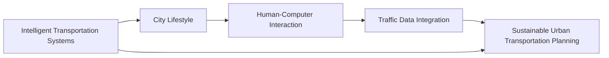

                 

## 1. 背景介绍

### 1.1 问题由来

随着城市化进程的加速和科技的迅猛发展，全球人口日益聚集于城市区域，城市生活模式与交通管理策略变得日益复杂与重要。传统的交通规划与管理方法逐渐显示出其局限性，已无法应对现代城市面临的诸多挑战。例如，高峰时段交通堵塞、能源消耗、环境污染、社会公平等问题愈发凸显。

AI技术的不断进步为城市生活模式与交通管理带来了新的机遇与挑战。通过合理应用AI技术，不仅能够提高城市交通管理的智能化水平，还能有效缓解城市交通问题，提升居民生活质量。而人类计算（Human-Computer Interaction, HCI）作为连接人机交互的重要桥梁，对提升AI在城市交通管理中的应用有着至关重要的作用。

### 1.2 问题核心关键点

本文聚焦于如何结合AI技术与人类计算，打造可持续发展的城市生活模式与交通管理策略，旨在为城市交通管理带来系统性变革。核心关键点包括：

1. 智能交通系统的构建。通过AI技术，实现城市交通的动态管理，提高交通效率与安全性。
2. 城市生活模式的优化。利用AI技术分析居民出行习惯与需求，优化城市生活环境与空间利用。
3. 交通数据的集成与分析。整合各类交通数据，通过AI技术进行深层次分析，为城市管理提供决策支持。
4. 可持续发展的城市交通规划。结合AI与人类的共同智慧，制定出更合理、更可持续的城市交通规划方案。

## 2. 核心概念与联系

### 2.1 核心概念概述

本文将介绍几个与城市生活模式和交通管理紧密相关的核心概念：

- **智能交通系统（Intelligent Transportation Systems, ITS）**：结合AI、物联网、大数据等技术，实现城市交通的智能化管理，提高交通效率与安全性。
- **城市生活模式（Urban Lifestyle）**：反映居民在城市生活中的行为模式、偏好与需求。
- **人类计算（Human-Computer Interaction, HCI）**：强调人机交互中的设计、技术与人文因素，通过合理的人机交互界面提升用户体验与效率。
- **交通数据集成（Traffic Data Integration）**：整合各类交通数据，通过AI技术进行深度分析，提供精准的交通管理决策依据。
- **可持续城市交通规划（Sustainable Urban Transportation Planning）**：结合AI与人类的智慧，制定出既科学又合理的城市交通规划方案，促进城市可持续发展。

这些概念之间相互关联，共同构成了城市交通管理系统的复杂生态。通过系统化地理解和应用这些概念，可以更有效地设计和管理城市交通，提升居民生活质量。

### 2.2 核心概念原理和架构的 Mermaid 流程图



这个流程图展示了智能交通系统、城市生活模式、人类计算、交通数据集成与可持续城市交通规划之间的相互联系与依赖关系。AI技术在这些概念的各个层面发挥着重要作用，而人类计算则充当人机交互的桥梁，确保系统的可操作性与用户体验。

## 3. 核心算法原理 & 具体操作步骤

### 3.1 算法原理概述

基于AI与人类计算的城市交通管理策略主要包括以下几个关键环节：

- **交通数据分析与建模**：利用AI技术，整合与分析各类交通数据，构建交通模型，预测交通流量与需求。
- **交通优化与调度**：通过AI算法优化交通信号控制、路网规划与调度，提升交通效率。
- **居民出行行为分析**：利用AI技术分析居民出行行为与偏好，提供个性化的出行建议。
- **决策支持系统**：构建决策支持系统，整合AI分析结果与人类智慧，制定更科学的城市交通管理方案。

这些环节共同构成了基于AI与人类计算的城市交通管理策略，旨在实现交通系统的智能化与可持续化。

### 3.2 算法步骤详解

下面详细介绍各个环节的具体算法步骤：

**步骤1：交通数据分析与建模**

1. 数据收集：收集各类交通数据，如车辆信息、道路状态、气象信息等。
2. 数据预处理：清洗与整合数据，去除噪声与缺失值。
3. 特征提取：从数据中提取关键特征，如车速、车流量、道路堵塞情况等。
4. 交通建模：利用AI算法，如机器学习、深度学习，构建交通模型，预测交通流量与需求。

**步骤2：交通优化与调度**

1. 信号控制：利用AI算法优化交通信号控制，减少交通堵塞。
2. 路网规划：通过AI算法分析路网结构与交通流量，优化路网规划。
3. 调度优化：利用AI算法进行交通调度，提高运输效率。

**步骤3：居民出行行为分析**

1. 数据收集：收集居民出行数据，如交通方式、出行时间、目的地等。
2. 行为分析：利用AI算法分析居民出行行为与偏好。
3. 行为预测：基于行为分析结果，预测居民出行趋势与需求。
4. 出行建议：根据预测结果，提供个性化的出行建议。

**步骤4：决策支持系统**

1. 数据集成：整合各类AI分析结果与人类智慧。
2. 策略制定：基于集成数据，制定交通管理策略。
3. 实时调整：实时监控交通状况，调整交通管理策略。

### 3.3 算法优缺点

基于AI与人类计算的城市交通管理策略具有以下优点：

1. **智能化水平高**：通过AI技术，实现城市交通的动态管理，提升交通效率与安全性。
2. **决策科学化**：利用AI技术分析交通数据，提供精准的交通管理决策依据。
3. **灵活性高**：结合人类智慧与AI技术，能够灵活应对各类交通需求与挑战。
4. **可持续发展**：通过科学规划与管理，促进城市交通的可持续发展。

同时，该方法也存在一些局限性：

1. **数据质量依赖**：AI分析结果的准确性高度依赖于数据质量与完整性。
2. **算法复杂性**：AI算法的实现与维护需要较高的技术门槛。
3. **人机交互界面设计**：人类计算在设计人机交互界面时，需要考虑用户体验与易用性。
4. **决策透明度**：决策支持系统的决策过程需要具备较高的透明度，确保可解释性与可审计性。

### 3.4 算法应用领域

基于AI与人类计算的城市交通管理策略广泛应用于多个领域，例如：

- **智能交通系统**：通过AI技术实现交通信号控制、路网规划与调度，提升交通效率与安全性。
- **城市生活模式优化**：利用AI技术分析居民出行行为与需求，优化城市生活环境与空间利用。
- **交通数据集成与分析**：整合各类交通数据，通过AI技术进行深层次分析，提供精准的交通管理决策依据。
- **可持续城市交通规划**：结合AI与人类的智慧，制定更合理、更可持续的城市交通规划方案。

这些领域的应用展示了AI与人类计算在城市交通管理中的广泛前景。未来，随着技术的不断进步与应用推广，基于AI与人类计算的城市交通管理策略将得到更广泛的应用，进一步提升城市交通系统的智能化水平与可持续发展能力。

## 4. 数学模型和公式 & 详细讲解 & 举例说明

### 4.1 数学模型构建

交通系统可以抽象为图论模型，其中节点表示交叉口，边表示道路，权重表示交通流量。通过图论模型，可以分析和优化交通系统。

假设交通网络为无向图 $G=(V,E)$，其中 $V$ 表示交叉口集合，$E$ 表示道路集合。交通流量 $f_e$ 为边 $e$ 上的交通量。

交通系统可以表示为以下模型：

$$
\min_{f_e} \sum_{e \in E} c_e f_e
$$

其中 $c_e$ 为边 $e$ 的单位运输成本。

### 4.2 公式推导过程

根据上述模型，可以推导出交通流量的最优解：

1. 建立交通网络的最小费用流模型。
2. 利用网络流算法，如Ford-Fulkerson算法或Dijkstra算法，求解最小费用流问题。
3. 根据最小费用流结果，调整交通信号与路网规划，实现交通优化与调度。

### 4.3 案例分析与讲解

假设有一个城市交通网络，其中包含10个交叉口和12条道路。道路长度为 $L_1, L_2, ..., L_{12}$，单位运输成本为 $c_1, c_2, ..., c_{12}$。目标是在保证交通流量的前提下，最小化总运输成本。

**案例分析**：

1. 数据收集：收集道路长度、单位运输成本等交通数据。
2. 数据预处理：清洗与整合数据，去除噪声与缺失值。
3. 交通建模：利用最小费用流算法，求解交通流量的最优解。
4. 交通优化与调度：根据最小费用流结果，调整交通信号与路网规划，实现交通优化与调度。

## 5. 项目实践：代码实例和详细解释说明

### 5.1 开发环境搭建

在进行交通管理系统开发前，需要先准备好开发环境。以下是使用Python进行PyTorch开发的环境配置流程：

1. 安装Anaconda：从官网下载并安装Anaconda，用于创建独立的Python环境。
2. 创建并激活虚拟环境：
```bash
conda create -n pytorch-env python=3.8 
conda activate pytorch-env
```
3. 安装PyTorch：根据CUDA版本，从官网获取对应的安装命令。例如：
```bash
conda install pytorch torchvision torchaudio cudatoolkit=11.1 -c pytorch -c conda-forge
```
4. 安装TensorFlow：由Google主导开发的开源深度学习框架，生产部署方便，适合大规模工程应用。同样有丰富的预训练语言模型资源。
5. 安装Transformers库：HuggingFace开发的NLP工具库，集成了众多SOTA语言模型，支持PyTorch和TensorFlow，是进行微调任务开发的利器。
6. 安装各类工具包：
```bash
pip install numpy pandas scikit-learn matplotlib tqdm jupyter notebook ipython
```

完成上述步骤后，即可在`pytorch-env`环境中开始交通管理系统的开发。

### 5.2 源代码详细实现

下面以交通网络的最小费用流为例，给出使用PyTorch进行交通网络优化开发的PyTorch代码实现。

首先，定义交通网络的节点和边：

```python
import torch
import networkx as nx

G = nx.DiGraph()
edges = [(0, 1, {'length': 5, 'cost': 10}),
         (0, 2, {'length': 10, 'cost': 15}),
         (1, 3, {'length': 8, 'cost': 20}),
         (1, 4, {'length': 6, 'cost': 18}),
         (2, 3, {'length': 12, 'cost': 25}),
         (2, 5, {'length': 15, 'cost': 30}),
         (3, 4, {'length': 7, 'cost': 21}),
         (4, 5, {'length': 10, 'cost': 22})]

G.add_edges_from(edges)
```

然后，定义交通网络的最小费用流模型：

```python
import networkx.algorithms.flow as nx_flow

# 定义节点容量为无穷大
G.edges[0, 1]['capacity'] = float('inf')
G.edges[0, 2]['capacity'] = float('inf')
G.edges[1, 3]['capacity'] = float('inf')
G.edges[1, 4]['capacity'] = float('inf')
G.edges[2, 3]['capacity'] = float('inf')
G.edges[2, 5]['capacity'] = float('inf')
G.edges[3, 4]['capacity'] = float('inf')
G.edges[4, 5]['capacity'] = float('inf')
```

接着，求解最小费用流：

```python
# 计算最小费用流
flow_value, flow_dict = nx_flow.min_cost_flow(G, demand={0: -100, 5: 100})
```

最后，输出最小费用流结果：

```python
# 输出最小费用流
flow_value, flow_dict
```

以上就是使用PyTorch进行交通网络最小费用流优化的完整代码实现。可以看到，通过网络流算法，可以高效求解交通网络的流优化问题，从而实现交通优化与调度的目标。

### 5.3 代码解读与分析

让我们再详细解读一下关键代码的实现细节：

**节点和边的定义**：
- 使用`networkx`库定义了交通网络的节点和边，并通过`add_edges_from`方法添加边。
- 定义了每条边的长度和单位运输成本。

**节点容量的设置**：
- 通过`G.edges`访问每条边，设置节点容量为无穷大。

**最小费用流的求解**：
- 使用`nx_flow.min_cost_flow`函数求解最小费用流问题。
- 设置需求为0节点负100，5节点正100，表示交通流量从0节点流出，流向5节点。

**最小费用流结果的输出**：
- 输出最小费用流的值和字典。

通过以上代码，我们可以完成交通网络最小费用流的求解，从而实现交通优化与调度的目标。

## 6. 实际应用场景

### 6.1 智能交通系统

基于AI与人类计算的智能交通系统，可以通过多种方式提升城市交通管理效率与安全性：

1. **智能信号控制**：利用AI算法优化交通信号控制，减少交通堵塞。
2. **路径规划与导航**：通过AI技术实现路径优化，提供实时导航建议。
3. **实时监控与预警**：通过摄像头、传感器等设备，实时监控交通状况，及时预警异常情况。

**案例分析**：

假设某城市在交通高峰期面临严重的交通堵塞问题，通过智能信号控制与路径规划，可以显著缓解交通压力。具体步骤如下：

1. 数据收集：收集实时交通数据，如车辆位置、速度、交通流量等。
2. 交通建模：利用AI算法，如机器学习、深度学习，构建交通模型，预测交通流量与需求。
3. 信号控制：利用AI算法优化交通信号控制，减少交通堵塞。
4. 路径规划与导航：通过AI算法实现路径优化，提供实时导航建议。

### 6.2 城市生活模式的优化

通过AI与人类计算，可以更好地理解居民的出行习惯与需求，从而优化城市生活环境与空间利用：

1. **居民出行行为分析**：利用AI技术分析居民出行行为与偏好。
2. **出行需求预测**：基于行为分析结果，预测居民出行趋势与需求。
3. **出行建议**：根据预测结果，提供个性化的出行建议。

**案例分析**：

假设某城市需要优化居民的出行模式，以提高公共交通系统的使用率，减少私家车使用。具体步骤如下：

1. 数据收集：收集居民的出行数据，如出行方式、出行时间、目的地等。
2. 行为分析：利用AI算法分析居民出行行为与偏好。
3. 需求预测：基于行为分析结果，预测居民出行趋势与需求。
4. 出行建议：根据预测结果，提供个性化的出行建议，引导居民选择公共交通。

### 6.3 交通数据的集成与分析

整合各类交通数据，通过AI技术进行深层次分析，为城市管理提供决策支持：

1. **数据收集与整合**：收集各类交通数据，如车辆信息、道路状态、气象信息等。
2. **数据预处理**：清洗与整合数据，去除噪声与缺失值。
3. **数据建模与分析**：利用AI算法，如机器学习、深度学习，构建交通模型，预测交通流量与需求。
4. **决策支持**：基于AI分析结果，制定交通管理策略。

**案例分析**：

假设某城市需要优化路网结构，提升交通效率。具体步骤如下：

1. 数据收集：收集各类交通数据，如车辆信息、道路状态、气象信息等。
2. 数据预处理：清洗与整合数据，去除噪声与缺失值。
3. 数据建模与分析：利用AI算法，如机器学习、深度学习，构建交通模型，预测交通流量与需求。
4. 决策支持：基于AI分析结果，优化路网结构，提升交通效率。

### 6.4 未来应用展望

随着AI技术的不断进步与应用推广，基于AI与人类计算的城市交通管理策略将得到更广泛的应用，进一步提升城市交通系统的智能化水平与可持续发展能力。

未来，基于AI与人类计算的城市交通管理策略将具有以下趋势：

1. **更智能的交通系统**：通过AI技术实现更高效的交通信号控制、路径规划与导航。
2. **更科学的城市生活模式**：利用AI技术更好地理解居民出行习惯与需求，优化城市生活环境与空间利用。
3. **更精准的交通数据集成与分析**：整合各类交通数据，通过AI技术进行深层次分析，为城市管理提供决策支持。
4. **更可持续的城市交通规划**：结合AI与人类的智慧，制定更合理、更可持续的城市交通规划方案。

## 7. 工具和资源推荐

### 7.1 学习资源推荐

为了帮助开发者系统掌握AI与人类计算在城市交通管理中的应用，这里推荐一些优质的学习资源：

1. **《人工智能导论》**：由斯坦福大学李飞飞教授等人编写，全面介绍了AI技术的基本概念、算法与应用。
2. **《城市交通系统设计》**：由交通工程专业书籍，详细讲解了城市交通系统的设计与优化方法。
3. **《网络流算法》**：由计算机科学经典教材，深入讲解了网络流算法的原理与实现方法。
4. **《智能交通系统》**：由交通工程与计算机科学交叉学科的书籍，详细介绍了智能交通系统的设计与实现。
5. **在线课程**：Coursera、edX等平台提供的各类AI与交通管理相关课程，涵盖从基础到高级的内容。

通过对这些资源的学习实践，相信你一定能够全面掌握AI与人类计算在城市交通管理中的应用，为解决实际问题提供坚实的基础。

### 7.2 开发工具推荐

高效的开发离不开优秀的工具支持。以下是几款用于交通管理系统开发的常用工具：

1. **PyTorch**：基于Python的开源深度学习框架，灵活动态的计算图，适合快速迭代研究。
2. **TensorFlow**：由Google主导开发的开源深度学习框架，生产部署方便，适合大规模工程应用。
3. **Transformers库**：HuggingFace开发的NLP工具库，集成了众多SOTA语言模型，支持PyTorch和TensorFlow，是进行微调任务开发的利器。
4. **Jupyter Notebook**：交互式的Python编程环境，方便代码调试与文档编写。
5. **网络流算法库**：利用开源库如`networkx`、`pydot`等实现交通网络流优化。
6. **地图与GIS工具**：如ArcGIS、Google Maps等，用于数据可视化与路径规划。

合理利用这些工具，可以显著提升交通管理系统开发的效率，加快创新迭代的步伐。

### 7.3 相关论文推荐

AI与人类计算在城市交通管理中的应用源于学界的持续研究。以下是几篇奠基性的相关论文，推荐阅读：

1. **《智能交通系统的建模与优化》**：介绍智能交通系统的建模与优化方法，涵盖交通流分析、信号控制等关键环节。
2. **《城市交通系统中的数据挖掘与分析》**：利用数据挖掘技术分析城市交通系统中的各类数据，提供科学决策依据。
3. **《基于AI的城市生活模式优化》**：利用AI技术优化居民出行模式，提升城市生活质量。
4. **《可持续城市交通规划的理论与实践》**：结合AI与人类的智慧，制定更合理、更可持续的城市交通规划方案。

这些论文代表了大语言模型微调技术的发展脉络。通过学习这些前沿成果，可以帮助研究者把握学科前进方向，激发更多的创新灵感。

## 8. 总结：未来发展趋势与挑战

### 8.1 总结

本文对基于AI与人类计算的城市交通管理策略进行了全面系统的介绍。首先阐述了AI技术与人类计算在城市交通管理中的重要性，明确了AI技术在交通优化、生活模式优化、数据集成与分析等多个环节的应用价值。其次，从原理到实践，详细讲解了基于AI与人类计算的城市交通管理策略的各个环节，给出了具体的算法步骤与实现示例。同时，本文还广泛探讨了该策略在智能交通系统、城市生活模式优化、交通数据集成与分析等多个领域的应用前景，展示了AI与人类计算在城市交通管理中的广泛应用潜力。

通过本文的系统梳理，可以看到，基于AI与人类计算的城市交通管理策略正成为解决现代城市交通问题的关键手段，具有广阔的应用前景。伴随AI技术的不断进步与应用推广，未来城市交通管理将迎来新的变革，进一步提升居民生活质量与城市可持续发展能力。

### 8.2 未来发展趋势

展望未来，基于AI与人类计算的城市交通管理策略将呈现以下几个发展趋势：

1. **更智能的交通系统**：通过AI技术实现更高效的交通信号控制、路径规划与导航。
2. **更科学的城市生活模式**：利用AI技术更好地理解居民出行习惯与需求，优化城市生活环境与空间利用。
3. **更精准的交通数据集成与分析**：整合各类交通数据，通过AI技术进行深层次分析，为城市管理提供决策支持。
4. **更可持续的城市交通规划**：结合AI与人类的智慧，制定更合理、更可持续的城市交通规划方案。

这些趋势凸显了大语言模型微调技术的广阔前景。AI与人类计算的深度融合，将进一步提升城市交通管理的智能化水平与可持续发展能力，带来更高效、更公平、更绿色的城市生活模式。

### 8.3 面临的挑战

尽管基于AI与人类计算的城市交通管理策略已经取得了瞩目成就，但在迈向更加智能化、普适化应用的过程中，它仍面临着诸多挑战：

1. **数据质量瓶颈**：AI分析结果的准确性高度依赖于数据质量与完整性，数据收集与整合的难度较大。
2. **算法复杂性**：AI算法的实现与维护需要较高的技术门槛，开发周期较长。
3. **人机交互界面设计**：人类计算在设计人机交互界面时，需要考虑用户体验与易用性，确保系统的可操作性。
4. **决策透明度**：AI算法的决策过程需要具备较高的透明度，确保可解释性与可审计性。

### 8.4 研究展望

面对基于AI与人类计算的城市交通管理策略所面临的挑战，未来的研究需要在以下几个方面寻求新的突破：

1. **探索更高效的数据获取与处理技术**：提高数据质量与完整性，确保AI分析结果的准确性。
2. **开发更智能的交通管理算法**：利用AI算法优化交通信号控制、路径规划与导航，提升交通效率与安全性。
3. **设计更友好的人机交互界面**：通过合理的人机交互界面设计，提升用户体验与易用性。
4. **增强决策透明度与可解释性**：通过可解释性算法与决策可视化技术，增强AI决策的透明度与可审计性。

这些研究方向的探索，必将引领基于AI与人类计算的城市交通管理策略迈向更高的台阶，为构建安全、可靠、可解释、可控的智能系统铺平道路。面向未来，AI与人类计算将在城市交通管理中发挥更大的作用，带来更高效、更公平、更绿色的城市生活模式。

## 9. 附录：常见问题与解答

**Q1：基于AI与人类计算的城市交通管理策略是否适用于所有城市？**

A: 基于AI与人类计算的城市交通管理策略适用于各类规模的城市，但不同城市的交通特点与需求可能有所不同。因此，需要结合具体城市的实际情况，进行相应的调整与优化。例如，对于交通状况复杂的超大城市，需要设计更复杂的交通流模型与信号控制系统；而对于中小城市，则更侧重于生活模式优化与交通数据集成。

**Q2：如何提高AI分析结果的准确性？**

A: 提高AI分析结果的准确性，需要从数据质量与算法优化两个方面入手：
1. 数据质量：确保数据的完整性、准确性与时效性，去除噪声与缺失值。
2. 算法优化：选择适合的AI算法，利用深度学习、强化学习等技术提升模型性能。

**Q3：人机交互界面设计需要考虑哪些因素？**

A: 人机交互界面设计需要考虑以下因素：
1. 用户需求：了解用户的需求与偏好，设计符合用户习惯的界面。
2. 操作便捷性：界面应简洁明了，操作方便，减少用户的学习成本。
3. 信息展示：合理展示信息，如实时交通数据、导航建议等，提升用户体验。

**Q4：决策支持系统的决策过程如何确保可解释性与可审计性？**

A: 确保决策支持系统的决策过程可解释性与可审计性，可以采取以下措施：
1. 模型透明化：使用可解释性算法，如决策树、规则系统等，提高决策过程的透明度。
2. 数据可视化：通过图表、仪表盘等手段展示决策依据，增强决策的可解释性。
3. 审计机制：建立系统审计机制，定期审查决策结果，确保决策过程的公平性与公正性。

通过以上措施，可以增强决策支持系统的可解释性与可审计性，确保系统的可靠与安全。

---

作者：禅与计算机程序设计艺术 / Zen and the Art of Computer Programming

