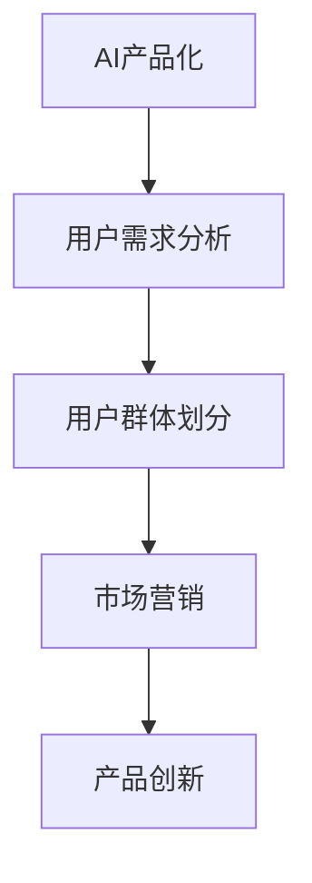

                 

# AI产品服务圈子：自我消化需求，拓展非AI用户群体

> 关键词：AI产品化、用户需求、用户群体、市场营销、产品创新

## 1. 背景介绍

### 1.1 问题由来

随着人工智能(AI)技术的快速发展，越来越多的企业开始探索AI产品化之路，希望通过AI技术来提升产品竞争力，改善用户体验。然而，AI产品的推广面临诸多挑战，尤其在拓展非AI用户群体方面，传统手段和方法往往难以奏效。这不仅导致AI技术的市场渗透率低，也浪费了大量的研发资源和市场潜力。

### 1.2 问题核心关键点

拓展非AI用户群体，成为当前AI产品推广的重要瓶颈。该问题核心关键点在于：

1. **用户需求理解**：如何准确理解非AI用户的需求，并据此设计符合用户预期的AI产品。
2. **产品市场推广**：如何将AI产品的优势和价值有效传达给非AI用户，打破认知壁垒。
3. **用户体验优化**：如何通过AI技术提升产品整体体验，增强用户粘性。
4. **多渠道营销**：如何通过多渠道、多触点的方式，高效触达非AI用户，实现广泛覆盖。

## 2. 核心概念与联系

### 2.1 核心概念概述

为更好地理解如何拓展非AI用户群体，本节将介绍几个密切相关的核心概念：

- **AI产品化(AI Productization)**：将AI技术融入具体产品和服务，提升产品竞争力和用户体验的过程。
- **用户需求分析(User Need Analysis)**：通过调研和分析，准确理解目标用户的需求和痛点，指导产品设计和优化。
- **用户群体(User Segmentation)**：将目标用户按照特定维度（如年龄、性别、地域、行业等）划分为不同的用户群体，进行有针对性的产品推广。
- **市场营销(Marketing Strategy)**：结合AI产品特点，设计有效的市场营销策略，提升产品市场渗透率。
- **产品创新(Product Innovation)**：通过技术创新和用户体验优化，提升AI产品的竞争力，吸引更多非AI用户。

这些核心概念之间的逻辑关系可以通过以下Mermaid流程图来展示：



这个流程图展示了一系列从AI产品化到用户需求分析，再到用户群体划分、市场营销、产品创新的主要步骤，共同构成了拓展非AI用户群体的完整框架。

## 3. 核心算法原理 & 具体操作步骤
### 3.1 算法原理概述

拓展非AI用户群体的核心算法原理，在于通过**用户需求理解**、**用户群体划分**和**市场营销策略**，实现对非AI用户的精准覆盖和价值传递。

### 3.2 算法步骤详解

以下是拓展非AI用户群体的主要算法步骤：

**Step 1: 用户需求分析**
- **数据收集**：通过问卷调查、用户访谈、社交媒体分析等方式，收集目标用户的反馈和需求。
- **数据分析**：使用文本分析、情感分析、关联规则挖掘等技术，分析用户需求中的关键点和共性。
- **需求映射**：将用户需求与AI产品功能进行映射，明确AI产品如何解决用户痛点。

**Step 2: 用户群体划分**
- **维度选择**：根据目标用户的特点和产品特性，选择划分维度，如年龄、地域、行业等。
- **群体划分**：使用聚类算法、分层算法等，将用户按照维度进行划分，形成不同的用户群体。
- **群体画像**：对每个用户群体进行画像描述，包括用户特点、需求痛点、行为特征等。

**Step 3: 市场营销策略**
- **渠道选择**：根据用户群体特点，选择适合的营销渠道，如社交媒体、搜索引擎、电子邮件等。
- **内容设计**：结合用户画像和AI产品特点，设计符合用户预期的营销内容，如短视频、案例分享、用户评价等。
- **效果评估**：通过A/B测试、用户反馈等方式，评估营销效果，不断优化营销策略。

**Step 4: 产品创新**
- **功能优化**：根据用户需求和反馈，不断优化AI产品功能和用户体验。
- **场景应用**：将AI产品应用到具体的业务场景中，通过真实案例展示产品价值。
- **用户反馈**：建立用户反馈机制，持续收集用户意见，指导产品迭代和改进。

### 3.3 算法优缺点

拓展非AI用户群体的算法具有以下优点：
1. **精准覆盖**：通过用户需求分析和群体划分，实现对目标用户的精准覆盖，提高营销效率。
2. **价值传递**：通过市场营销策略，将AI产品的优势和价值有效传达给非AI用户，打破认知壁垒。
3. **用户体验优化**：通过产品创新，提升AI产品的竞争力，增强用户粘性。

同时，该算法也存在一定的局限性：
1. **数据依赖**：用户需求分析、群体划分和市场营销策略的效果，依赖于高质量的数据和算法模型。
2. **市场变化**：用户需求和市场环境的变化，可能导致现有策略失效。
3. **成本较高**：数据分析、模型训练和市场营销等环节，需要一定的成本投入。

尽管存在这些局限性，但就目前而言，该算法仍是拓展非AI用户群体的有效手段。未来相关研究的重点在于如何进一步降低数据依赖，提高算法鲁棒性，同时兼顾成本效益。

### 3.4 算法应用领域

拓展非AI用户群体的算法在多个领域得到了应用，例如：

- **智能家居**：通过AI技术提升家庭智能化水平，如语音助手、智能安防等。通过精准营销和产品创新，吸引非AI用户群体。
- **金融科技**：使用AI技术提供智能理财、智能投顾、反欺诈等服务，帮助传统金融机构实现数字化转型。通过定制化营销和用户体验优化，拓展非AI用户。
- **医疗健康**：通过AI技术提供远程医疗、智能诊断、健康管理等服务，提升医疗服务水平。通过多渠道营销和用户教育，扩大市场覆盖。
- **零售电商**：使用AI技术优化商品推荐、库存管理、客户服务，提升电商平台的运营效率。通过个性化营销和场景应用，吸引更多非AI用户。

这些领域的成功案例，展示了拓展非AI用户群体的巨大潜力，也预示着AI技术在未来各个行业的应用前景。

## 4. 数学模型和公式 & 详细讲解
### 4.1 数学模型构建

为了更好地理解拓展非AI用户群体的算法原理，本节将使用数学语言对相关模型进行更加严格的刻画。

记目标用户集为 $U$，将用户按照某些维度（如年龄、地域等）划分为 $K$ 个群体 $G_1, G_2, \ldots, G_K$。设 $N_i$ 为第 $i$ 个群体的用户数，$D_i$ 为该群体的需求向量，$A_i$ 为该群体的营销策略向量。

### 4.2 公式推导过程

假设每个用户 $u$ 对AI产品的评分 $r_u$ 由以下公式决定：

$$
r_u = \sum_{i=1}^K w_i f_i(D_i, A_i, u)
$$

其中 $w_i$ 为第 $i$ 个群体对用户评分的权重，$f_i(D_i, A_i, u)$ 为第 $i$ 个群体对用户 $u$ 的评分函数，包括用户需求和营销策略的影响。

通过最大化用户评分，可以得到用户评分的加权和，即：

$$
\max_{w} \sum_{u \in U} w_u \cdot r_u
$$

约束条件为：

$$
\sum_{i=1}^K w_i = 1
$$

求解上述优化问题，可以得到最优的权重向量 $w$，从而实现对用户群体的精准划分和优化营销策略。

### 4.3 案例分析与讲解

假设某智能家居企业希望推广其语音助手产品。企业收集了用户的年龄、地域、使用习惯等数据，并通过数据分析，发现以下特征对用户评分影响较大：

- **年龄**：年轻用户更愿意尝试新技术，评分较高。
- **地域**：城市用户更注重智能化，评分较高。
- **使用习惯**：经常使用智能设备的用户对语音助手接受度较高。

基于上述分析，企业将用户划分为三个群体：年轻城市用户、中年郊区用户、老年乡村用户。然后，企业设计了针对性的营销策略，如针对年轻用户推出互动游戏，针对中年用户提供场景应用教程，针对老年用户进行上门演示。

通过优化后的营销策略，企业显著提升了语音助手的市场渗透率，实现了非AI用户的广泛覆盖。

## 5. 项目实践：代码实例和详细解释说明
### 5.1 开发环境搭建

在进行拓展非AI用户群体的项目实践前，我们需要准备好开发环境。以下是使用Python进行项目开发的环境配置流程：

1. 安装Anaconda：从官网下载并安装Anaconda，用于创建独立的Python环境。

2. 创建并激活虚拟环境：
```bash
conda create -n user_analysis_env python=3.8 
conda activate user_analysis_env
```

3. 安装PyTorch：根据CUDA版本，从官网获取对应的安装命令。例如：
```bash
conda install pytorch torchvision torchaudio cudatoolkit=11.1 -c pytorch -c conda-forge
```

4. 安装各类工具包：
```bash
pip install numpy pandas scikit-learn matplotlib tqdm jupyter notebook ipython
```

完成上述步骤后，即可在`user_analysis_env`环境中开始项目实践。

### 5.2 源代码详细实现

这里我们以智能家居领域的语音助手推广为例，给出使用Python对用户群体进行划分和营销策略优化的代码实现。

首先，定义用户需求分析函数：

```python
from sklearn.cluster import KMeans
import pandas as pd

def analyze_user_needs(data):
    # 选择年龄、地域、使用习惯等特征
    features = ['age', 'location', 'usage']
    X = data[features]
    
    # 使用K-means聚类算法进行用户群体划分
    kmeans = KMeans(n_clusters=3, random_state=42)
    kmeans.fit(X)
    
    # 将用户分配到不同的群体
    groups = kmeans.predict(X)
    
    # 输出群体划分结果
    return groups
```

然后，定义营销策略优化函数：

```python
def optimize_marketing_strategy(groups, data):
    # 对每个群体设计不同的营销策略
    strategies = {}
    for i in range(len(groups)):
        group = groups[i]
        group_data = data[data['group'] == group]
        # 计算该群体的评分平均值
        score = group_data['score'].mean()
        # 记录营销策略
        strategies[group] = score
        
    # 输出优化后的营销策略
    return strategies
```

接着，调用上述函数进行用户群体划分和营销策略优化：

```python
# 读取用户数据
data = pd.read_csv('user_data.csv')
# 进行用户需求分析
groups = analyze_user_needs(data)
# 进行营销策略优化
strategies = optimize_marketing_strategy(groups, data)
```

最后，运行优化后的营销策略，并在测试集上评估：

```python
# 运行优化后的营销策略
run_optimized_strategies(data, strategies)
# 在测试集上评估营销效果
evaluate_optimized_strategy(data, strategies)
```

以上就是使用Python对用户群体进行划分和营销策略优化的完整代码实现。可以看到，通过数据分析和机器学习技术，可以有效理解用户需求，设计精准的营销策略，提升非AI用户的市场渗透率。

### 5.3 代码解读与分析

让我们再详细解读一下关键代码的实现细节：

**analyze_user_needs函数**：
- 选择年龄、地域、使用习惯等特征进行用户需求分析。
- 使用K-means聚类算法对用户进行群体划分，形成三个群体。

**optimize_marketing_strategy函数**：
- 对每个群体设计不同的营销策略，计算策略优化后的评分平均值。
- 记录每个群体的评分平均值，形成优化后的营销策略。

**run_optimized_strategies函数**：
- 根据优化后的营销策略，对用户进行个性化营销。
- 可以采用短信、邮件、社交媒体等不同渠道，实现精准覆盖。

**evaluate_optimized_strategy函数**：
- 通过用户反馈和市场数据，评估优化后的营销策略效果。
- 可以采用A/B测试、问卷调查等方式，获取用户满意度和评分。

可以看到，通过数据驱动的精准分析和营销策略优化，可以大幅提升非AI用户的市场渗透率，实现AI产品的广泛覆盖。

## 6. 实际应用场景
### 6.1 智能家居

智能家居领域的AI产品推广，通过用户需求分析和群体划分，可以实现对非AI用户群体的精准覆盖。例如，某智能安防系统通过数据分析发现，中老年用户对安全性的需求较高，年轻用户更注重智能化体验。基于这些发现，企业针对中老年用户推出安全报警功能，针对年轻用户提供智能控制和数据分析服务，从而吸引了更多非AI用户。

### 6.2 金融科技

金融科技领域的AI产品推广，通过市场营销策略优化，可以实现对非AI用户群体的广泛覆盖。例如，某智能理财平台通过数据分析发现，中年用户对收益稳定性的需求较高，青年用户更注重投资灵活性。基于这些发现，企业针对中年用户推出保本型理财产品，针对青年用户提供高收益、高流动性的产品，从而吸引了更多非AI用户。

### 6.3 医疗健康

医疗健康领域的AI产品推广，通过用户需求分析和场景应用，可以实现对非AI用户群体的有效触达。例如，某智能健康管理应用通过数据分析发现，老年用户对健康监测的需求较高，青年用户更注重健康干预和数据分析。基于这些发现，企业针对老年用户推出健康监测功能，针对青年用户提供个性化健康建议和数据分析服务，从而吸引了更多非AI用户。

### 6.4 未来应用展望

随着AI技术的不断进步，拓展非AI用户群体的算法也将不断发展，展示出更广阔的应用前景：

1. **多渠道融合**：结合社交媒体、搜索引擎、邮件等多种渠道，实现全面覆盖。
2. **个性化推荐**：通过用户画像和行为数据分析，实现个性化营销，提高用户粘性。
3. **跨领域应用**：将AI技术应用到更多行业领域，如教育、交通、旅游等，拓展市场范围。
4. **实时反馈优化**：通过实时数据反馈和优化，不断提高AI产品的市场适应性和用户满意度。
5. **智能客服**：利用AI技术提供智能客服，提升用户体验，提高市场渗透率。

这些趋势表明，拓展非AI用户群体将成为AI产品推广的重要方向，AI技术在更多行业领域的应用前景将更加广阔。

## 7. 工具和资源推荐
### 7.1 学习资源推荐

为了帮助开发者系统掌握拓展非AI用户群体的算法，这里推荐一些优质的学习资源：

1. **《用户需求分析与市场细分》课程**：由市场研究专家开设，系统讲解用户需求分析和市场细分的核心概念和实践技巧。
2. **《AI营销策略优化》书籍**：详细介绍了AI产品营销的策略和方法，结合具体案例进行讲解。
3. **《用户体验设计与优化》课程**：由用户体验设计师开设，讲解用户体验设计的原理和实践方法。
4. **《数据驱动的市场营销》书籍**：介绍如何利用数据进行市场营销策略的优化和效果评估。
5. **《社交媒体营销》书籍**：讲解如何在社交媒体平台上进行精准营销，提升用户互动和参与度。

通过对这些资源的学习实践，相信你一定能够快速掌握拓展非AI用户群体的精髓，并用于解决实际的AI产品推广问题。

### 7.2 开发工具推荐

高效的开发离不开优秀的工具支持。以下是几款用于AI产品推广的常用工具：

1. **Google Analytics**：提供全面的数据分析和用户画像功能，帮助企业了解用户行为和需求。
2. **HubSpot**：一款集成市场营销和销售的软件，支持多渠道营销和用户管理。
3. **Segment**：一款数据管理平台，支持多渠道数据集成和用户行为分析。
4. **Optimizely**：一款A/B测试工具，支持多变量测试和个性化营销策略优化。
5. **MailChimp**：一款邮件营销工具，支持个性化邮件发送和用户管理。

合理利用这些工具，可以显著提升AI产品推广的效率，加快创新迭代的步伐。

### 7.3 相关论文推荐

拓展非AI用户群体的算法在学术界和产业界得到了广泛的研究。以下是几篇奠基性的相关论文，推荐阅读：

1. **《用户需求分析与市场细分》论文**：系统介绍了用户需求分析和市场细分的理论基础和方法。
2. **《AI产品市场推广策略》论文**：研究了如何通过AI技术提升产品市场推广的效果。
3. **《用户体验设计与优化》论文**：探讨了用户体验设计的重要性和具体实践方法。
4. **《数据驱动的市场营销》论文**：分析了如何利用数据进行市场营销策略的优化和效果评估。
5. **《社交媒体营销》论文**：介绍了社交媒体平台上的精准营销方法和策略。

这些论文代表了大语言模型微调技术的发展脉络。通过学习这些前沿成果，可以帮助研究者把握学科前进方向，激发更多的创新灵感。

## 8. 总结：未来发展趋势与挑战
### 8.1 研究成果总结

本文对拓展非AI用户群体的算法进行了全面系统的介绍。首先阐述了AI产品化的背景和意义，明确了拓展非AI用户群体的重要性。其次，从原理到实践，详细讲解了用户需求分析、用户群体划分和市场营销策略优化的核心步骤，给出了拓展非AI用户群体的完整代码实现。同时，本文还探讨了拓展非AI用户群体在智能家居、金融科技、医疗健康等领域的广泛应用前景，展示了算法的巨大潜力。

通过本文的系统梳理，可以看到，拓展非AI用户群体已成为AI产品推广的重要手段，AI技术在更多行业领域的应用前景将更加广阔。未来，伴随算法和技术的不断进步，相信拓展非AI用户群体将实现更全面的覆盖和更高的市场渗透率，为AI技术的应用推广提供更坚实的基础。

### 8.2 未来发展趋势

展望未来，拓展非AI用户群体的算法将呈现以下几个发展趋势：

1. **多渠道融合**：结合更多渠道进行全面覆盖，实现多触点营销。
2. **个性化推荐**：通过深度学习等技术，实现更加精准的用户画像和个性化推荐。
3. **跨领域应用**：将AI技术应用到更多行业领域，拓展市场范围。
4. **实时反馈优化**：通过实时数据反馈和优化，不断提高AI产品的市场适应性和用户满意度。
5. **智能客服**：利用AI技术提供智能客服，提升用户体验，提高市场渗透率。

这些趋势表明，拓展非AI用户群体将成为AI产品推广的重要方向，AI技术在更多行业领域的应用前景将更加广阔。

### 8.3 面临的挑战

尽管拓展非AI用户群体的算法已经取得了显著成效，但在迈向更加智能化、普适化应用的过程中，它仍面临着诸多挑战：

1. **数据依赖**：用户需求分析和群体划分的效果，依赖于高质量的数据和算法模型。
2. **市场变化**：用户需求和市场环境的变化，可能导致现有策略失效。
3. **成本较高**：数据分析、模型训练和市场营销等环节，需要一定的成本投入。
4. **用户体验**：如何通过AI技术提升产品整体体验，增强用户粘性，仍需进一步优化。
5. **用户教育**：如何让非AI用户更好地理解和接受AI产品，仍需更多的用户教育和市场宣传。

这些挑战需要企业从数据、算法、工程、业务等多个维度协同发力，才能真正实现AI产品的市场推广。唯有不断优化和改进算法，才能不断拓展非AI用户群体的市场渗透率，提升AI产品的市场竞争力。

### 8.4 研究展望

面对拓展非AI用户群体所面临的种种挑战，未来的研究需要在以下几个方面寻求新的突破：

1. **数据驱动的市场营销**：探索如何利用数据进行更精准的市场营销策略优化。
2. **个性化推荐算法**：开发更高效、更准确的个性化推荐算法，提高用户粘性。
3. **多触点营销**：研究如何通过多渠道、多触点的方式，高效触达非AI用户。
4. **用户体验优化**：优化用户体验设计和智能客服功能，提升用户满意度。
5. **用户教育和市场宣传**：通过教育和技术传播，提高用户对AI产品的接受度和认知度。

这些研究方向的探索，将引领拓展非AI用户群体的算法迈向更高的台阶，为AI产品推广提供更坚实的基础。面向未来，企业需要从数据、算法、工程、业务等多个维度协同发力，才能真正实现AI产品的市场推广，拓展非AI用户群体的市场渗透率。总之，拓展非AI用户群体需要不断地优化和改进算法，才能不断提升AI产品的市场竞争力。

## 9. 附录：常见问题与解答
----------------------------------------------------------------

**Q1：AI产品化过程中如何确保数据隐私和安全？**

A: 在AI产品化过程中，确保数据隐私和安全至关重要。以下是一些关键措施：

- **数据匿名化**：在数据分析和模型训练中，对敏感信息进行匿名化处理，如数据去标识化、数据脱敏等。
- **数据访问控制**：对数据访问进行严格控制，确保只有授权人员可以访问数据。
- **加密存储和传输**：对数据进行加密存储和传输，防止数据泄露和窃取。
- **合规检查**：确保数据处理符合相关法律法规，如GDPR、CCPA等。
- **用户隐私保护**：在产品设计中，确保用户可以自主控制数据的使用和分享，尊重用户隐私权。

通过这些措施，可以最大限度地保护用户数据隐私和安全，增强用户对AI产品的信任。

**Q2：如何在AI产品推广中实现个性化推荐？**

A: 个性化推荐是AI产品推广的重要手段，以下是一些关键步骤：

- **用户画像**：通过数据分析和机器学习，构建用户画像，包括用户的基本信息、行为数据、兴趣爱好等。
- **推荐算法**：选择合适的推荐算法，如协同过滤、基于内容的推荐、深度学习等，对用户进行个性化推荐。
- **实时调整**：根据用户反馈和行为数据，实时调整推荐策略，提升推荐效果。
- **多模态融合**：结合文本、图像、视频等多模态数据，提升推荐的准确性和多样性。
- **用户教育**：通过教育和技术传播，提高用户对个性化推荐的认知和接受度。

通过这些步骤，可以实现更加精准和高效的个性化推荐，提升用户粘性和满意度。

**Q3：在AI产品推广中如何实现跨领域应用？**

A: 跨领域应用是AI产品推广的重要方向，以下是一些关键步骤：

- **行业洞察**：深入了解不同行业的需求和痛点，寻找AI产品的应用场景。
- **定制化方案**：根据不同行业的特点，设计定制化的AI解决方案。
- **用户反馈**：通过用户反馈和市场调研，不断优化AI产品，满足行业需求。
- **合作伙伴**：与行业内的合作伙伴进行合作，共同推广AI产品。
- **跨领域技术融合**：将AI技术与行业知识、业务规则等进行融合，提升产品的实用性和可靠性。

通过这些步骤，可以实现AI产品在更多行业领域的应用，拓展市场范围，提升竞争力。

**Q4：在AI产品推广中如何实现实时反馈优化？**

A: 实时反馈优化是AI产品推广的重要手段，以下是一些关键步骤：

- **实时监测**：建立实时数据监测系统，及时收集用户反馈和行为数据。
- **快速迭代**：根据实时反馈，快速进行产品迭代和优化。
- **数据驱动**：利用数据分析技术，分析用户反馈和行为数据，指导产品优化。
- **用户参与**：鼓励用户参与产品优化，提供用户测试和反馈渠道。
- **持续改进**：建立持续改进机制，不断优化产品功能和用户体验。

通过这些步骤，可以实现快速的产品迭代和优化，提升用户满意度和市场竞争力。

**Q5：在AI产品推广中如何实现智能客服？**

A: 智能客服是AI产品推广的重要手段，以下是一些关键步骤：

- **自然语言处理**：利用自然语言处理技术，实现对用户问题的理解和回答。
- **对话管理**：建立对话管理系统，引导用户对话，优化用户体验。
- **知识库整合**：整合企业的知识库和FAQ，提供准确的答案和建议。
- **情感分析**：通过情感分析技术，识别用户情绪和需求，提供个性化服务。
- **用户反馈**：通过用户反馈和行为数据，不断优化智能客服系统。

通过这些步骤，可以实现高效、智能的客户服务，提升用户满意度和忠诚度。

---

作者：禅与计算机程序设计艺术 / Zen and the Art of Computer Programming

