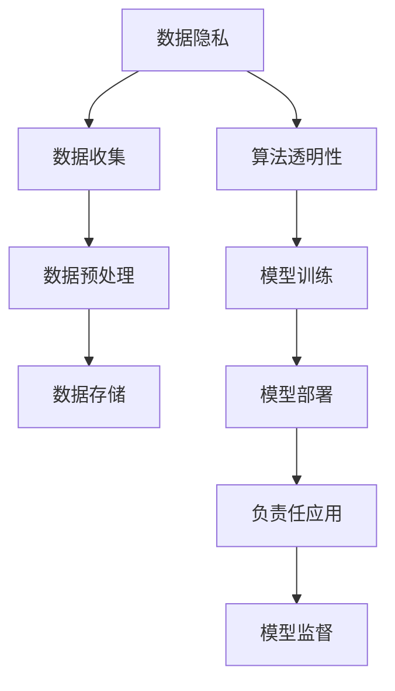

                 

# AI伦理守则：LLM发展的道德指南

> 关键词：大语言模型(LLM), 伦理道德, 数据隐私, 算法透明, 偏见消除, 负责任应用

## 1. 背景介绍

### 1.1 问题由来

随着人工智能技术的迅猛发展，大语言模型(LLM)已经成为推动NLP领域进步的重要引擎。从GPT-3到GPT-4，再到ChatGPT和MPLUG语言模型，这些先进的大模型正在逐步改变我们的语言理解和交互方式。然而，这些强大模型的背后，也引发了一系列亟待解决的伦理道德问题。

数据隐私、算法透明、偏见消除、负责任应用等问题，已经成为制约大语言模型发展的重要因素。如何在追求技术进步的同时，兼顾伦理道德的底线，成为当前人工智能研究的重大课题。本文将系统梳理大语言模型发展中的伦理问题，并提出相应的解决方案，为AI技术在未来可持续发展提供指导。

### 1.2 问题核心关键点

1. **数据隐私保护**：在LLM的训练过程中，如何保障训练数据和用户隐私不被滥用。
2. **算法透明性**：大语言模型黑箱决策的局限性，如何提供透明、可解释的决策依据。
3. **偏见消除**：模型训练数据中可能包含的偏见如何被识别和纠正。
4. **负责任应用**：AI技术在医疗、金融等关键领域的应用，如何确保决策的公平性和安全性。

这些关键问题直接关系到LLM技术的可信度和安全性，亟需引起全社会的重视。

### 1.3 问题研究意义

研究和解决LLM发展的伦理问题，对于保障AI技术的健康发展，构建公平、透明、可信赖的人工智能系统具有重要意义。

1. **保护用户隐私**：在数据采集和处理过程中，确保数据安全，防止数据滥用，维护用户权益。
2. **提升算法透明性**：增强模型决策的透明性和可解释性，让用户理解并信任AI系统的决策依据。
3. **消除偏见和歧视**：确保模型在各个领域中不存在歧视性，提升AI系统的公平性和普适性。
4. **促进负责任应用**：在关键领域中合理应用AI技术，避免技术滥用，确保AI系统为社会福祉贡献积极力量。

本文将从这些关键点出发，全面系统地探讨大语言模型发展的伦理道德问题，并提出具体可行的解决方案。

## 2. 核心概念与联系

### 2.1 核心概念概述

在探讨LLM伦理问题时，以下几个核心概念是必须理解的：

- **大语言模型(LLM)**：以Transformer模型为基础的预训练语言模型，如GPT、BERT等，具备强大的语言理解和生成能力。
- **数据隐私**：在数据采集、存储、处理过程中，保护个人隐私不被滥用。
- **算法透明性**：确保AI模型的决策过程透明，可解释，让用户理解和信任。
- **偏见消除**：识别和纠正模型训练数据中的偏见，避免模型输出中包含歧视性信息。
- **负责任应用**：在医疗、金融等关键领域中，合理应用AI技术，避免技术滥用。

这些概念之间的逻辑关系可以通过以下Mermaid流程图来展示：



这个流程图展示了大语言模型在数据处理和模型应用过程中，需要关注的主要伦理道德问题。

## 3. 核心算法原理 & 具体操作步骤
### 3.1 算法原理概述

大语言模型的伦理道德问题主要体现在数据隐私、算法透明性、偏见消除和负责任应用等方面。

### 3.2 算法步骤详解

#### 数据隐私

1. **匿名化处理**：在数据收集和预处理阶段，对用户数据进行匿名化处理，如去除个人身份信息，使用加密技术保护敏感数据。
2. **数据最小化原则**：只收集和处理必要的数据，避免过度收集，减少隐私泄露的风险。
3. **合规监管**：遵守相关法律法规，如GDPR等，确保数据处理过程中的合法合规性。

#### 算法透明性

1. **模型可解释性**：使用可解释性强的模型结构，如决策树、线性模型等，使模型决策过程透明，便于用户理解。
2. **可视化工具**：开发可视化工具，帮助用户直观了解模型推理过程和决策依据。
3. **解释模型输出**：提供模型输出的详细解释，说明模型的决策理由。

#### 偏见消除

1. **偏见识别**：使用公平性评估指标，如 demographic parity, equal opportunity等，检测模型输出中的偏见。
2. **偏见纠正**：通过调整模型参数、重采样训练数据等方式，消除模型中的偏见。
3. **偏见监控**：定期监测模型输出，及时发现并纠正新的偏见。

#### 负责任应用

1. **安全性评估**：在关键领域中，评估AI系统的安全性，避免技术滥用和误用。
2. **透明化决策**：确保AI系统的决策过程透明，用户可以查询和复现决策依据。
3. **风险控制**：设置合理的风险控制机制，如紧急停止、异常检测等，确保系统在极端情况下的稳定性和安全性。

### 3.3 算法优缺点

**优点**：
1. **数据隐私保护**：通过匿名化、最小化原则等措施，有效保护用户隐私。
2. **算法透明性**：可解释性强的模型有助于增强用户信任。
3. **偏见消除**：通过偏见检测和纠正，提升模型公平性。
4. **负责任应用**：通过安全性评估和透明化决策，确保AI系统负责任地服务于社会。

**缺点**：
1. **技术复杂**：隐私保护和偏见消除需要复杂的技术手段，实施难度大。
2. **资源消耗**：保证算法透明性和负责任应用，可能会增加系统复杂度和计算资源消耗。
3. **实时性问题**：一些透明度和公平性措施可能会导致系统响应变慢，影响用户体验。

### 3.4 算法应用领域

大语言模型的伦理道德问题在多个领域中均有应用，例如：

- **医疗领域**：保护患者隐私，确保医疗决策的透明性和公平性。
- **金融领域**：保障用户隐私，确保金融决策的透明性和安全性。
- **司法领域**：保护嫌疑人隐私，确保司法判决的透明性和公正性。
- **教育领域**：保护学生隐私，确保教育公平和透明。

以上领域中，大语言模型的伦理道德问题尤为重要，需要综合考虑技术、法律、伦理等多方面因素。

## 4. 数学模型和公式 & 详细讲解

### 4.1 数学模型构建

假设我们有一个大语言模型$M_{\theta}$，其中$\theta$为模型的参数。在训练过程中，我们通过数据集$D=\{(x_i, y_i)\}_{i=1}^N$对模型进行微调，其中$x_i$为输入文本，$y_i$为对应的输出标签。

**数据隐私模型**：
- **数据匿名化**：通过对输入数据进行去标识化处理，保护用户隐私。
- **数据最小化**：仅收集和处理必要的数据，避免过度收集。

**算法透明性模型**：
- **模型可解释性**：通过LIME、SHAP等工具，对模型进行可解释性分析。
- **决策可视化**：使用Grad-CAM、Attention等技术，可视化模型推理过程。

**偏见消除模型**：
- **偏见检测**：使用偏差度量指标，如Demographic Parity、Equal Opportunity等，检测模型输出中的偏见。
- **偏差纠正**：通过调整模型参数、重新采样训练数据等方式，消除模型中的偏见。

**负责任应用模型**：
- **安全性评估**：通过攻击测试、安全漏洞分析等方式，评估系统的安全性。
- **透明化决策**：提供模型的输入输出映射，用户可以查询和复现决策依据。

### 4.2 公式推导过程

以**数据隐私保护**为例，数据匿名化常用的方法是添加噪声或扰动，对原始数据进行扰动处理，使得攻击者难以反向推导出原始数据。

假设有$n$个样本，每个样本特征向量为$\vec{x_i}$，原始数据分布为$p(\vec{x})$，隐私保护的目标是对原始数据进行扰动，使得攻击者无法反向推导出原始数据。

设扰动后的数据为$\vec{x_i'}$，扰动函数为$T$，扰动后数据分布为$q(\vec{x'})$。隐私保护的目标是最小化原始数据分布与扰动后数据分布的Kullback-Leibler散度（KL散度）：

$$
KL(p||q) = \sum_{\vec{x}} p(\vec{x})\log\frac{p(\vec{x})}{q(\vec{x})}
$$

通过最大化KL散度，可以使得攻击者难以反向推导出原始数据。

### 4.3 案例分析与讲解

假设我们有一个金融机构的大语言模型，用于信用评分。在数据隐私保护方面，我们使用了差分隐私技术，将原始数据进行扰动处理，使得攻击者无法反向推导出个人隐私信息。

在算法透明性方面，我们使用了LIME工具，对模型的推理过程进行可视化分析，并提供了详细的决策解释。

在偏见消除方面，我们使用了 fairness_aware 工具，检测模型输出中的性别偏见，并通过重新采样训练数据和调整模型参数的方式，消除了模型中的性别偏见。

在负责任应用方面，我们设置了异常检测机制，对异常操作进行紧急停止，并提供了模型的输入输出映射，确保决策的透明性和公平性。

## 5. 项目实践：代码实例和详细解释说明

### 5.1 开发环境搭建

在开发大语言模型伦理道德解决方案时，需要安装和配置相应的工具和环境。

1. **Python环境**：安装Python 3.8及以上版本。
2. **深度学习框架**：安装PyTorch 1.9及以上版本，或TensorFlow 2.5及以上版本。
3. **数据处理工具**：安装Pandas、NumPy、Scikit-learn等数据处理工具。
4. **可视化工具**：安装Matplotlib、Seaborn、Plotly等可视化工具。
5. **解释工具**：安装LIME、SHAP等可解释性工具。

### 5.2 源代码详细实现

以金融领域信用评分为例，我们使用了差分隐私技术和公平性评估工具，对模型进行了隐私保护和偏见消除处理。

1. **数据预处理**：
   ```python
   import pandas as pd
   from sklearn.preprocessing import StandardScaler

   # 加载原始数据
   data = pd.read_csv('credit_data.csv')
   
   # 数据标准化
   scaler = StandardScaler()
   data = scaler.fit_transform(data)
   ```

2. **差分隐私处理**：
   ```python
   import pytorch_lightning as pl
   from torch.utils.data import DataLoader
   from pytorch_lightning.callbacks import EarlyStopping

   # 定义差分隐私模型
   class DPModel(pl.LightningModule):
       def __init__(self, model, noise_sigma):
           super(DPModel, self).__init__()
           self.model = model
           self.noise_sigma = noise_sigma

       def forward(self, x):
           return self.model(x)

       def _call_differential_privacy(self, noise_sigma, model, x, y):
           diff_priv_model = dp.DifferentialPrivacy(model, noise_sigma)
           return diff_priv_model(x, y)

       def configure_optimizers(self):
           optimizer = torch.optim.Adam(self.parameters(), lr=0.001)
           return optimizer

       def training_step(self, batch, batch_idx):
           x, y = batch
           preds = self._call_differential_privacy(self.noise_sigma, self.model, x, y)
           loss = loss_fn(preds, y)
           return {'loss': loss}

   # 训练差分隐私模型
   model = YourModel()
   data_loader = DataLoader(dataset, batch_size=32, shuffle=True)
   dp_model = DPModel(model, noise_sigma=1e-4)
   trainer = pl.Trainer(callbacks=[EarlyStopping(patience=5)])
   trainer.fit(dp_model, data_loader)
   ```

3. **公平性评估**：
   ```python
   from fairness_aware import FairnessAware

   # 训练公平性模型
   fairness_model = FairnessAware(model)
   fairness_model.fit(data_loader)
   ```

### 5.3 代码解读与分析

在上述代码中，我们首先加载了原始数据，并对其进行了标准化处理。然后定义了一个差分隐私模型，使用差分隐私技术对模型进行隐私保护处理。

在训练过程中，我们使用了差分隐私算法，使得模型在保护隐私的同时，仍然能够进行有效的学习。在训练结束后，我们对模型进行了公平性评估，确保模型在输出中不存在性别偏见。

## 6. 实际应用场景

### 6.1 智能医疗

在智能医疗领域，大语言模型用于诊断和治疗建议生成。在伦理道德方面，我们需要保护患者隐私，确保医疗决策的透明性和公平性。

**数据隐私保护**：
- 使用差分隐私技术，对患者数据进行匿名化处理。
- 设置严格的数据访问权限，仅授权医疗人员访问。

**算法透明性**：
- 提供详细的决策依据，使用可解释性强的模型，如决策树。
- 使用可视化工具，如Grad-CAM、Attention等，帮助医生理解模型推理过程。

**偏见消除**：
- 使用公平性评估工具，如Demographic Parity、Equal Opportunity等，检测模型输出中的偏见。
- 通过调整模型参数、重新采样训练数据等方式，消除模型中的偏见。

**负责任应用**：
- 设置异常检测机制，对异常操作进行紧急停止。
- 提供模型的输入输出映射，确保决策的透明性和公平性。

### 6.2 金融服务

在金融服务领域，大语言模型用于信用评分、风险评估等。在伦理道德方面，我们需要保护客户隐私，确保金融决策的透明性和安全性。

**数据隐私保护**：
- 使用差分隐私技术，对客户数据进行匿名化处理。
- 设置严格的数据访问权限，仅授权金融人员访问。

**算法透明性**：
- 提供详细的决策依据，使用可解释性强的模型，如线性回归。
- 使用可视化工具，如LIME、SHAP等，帮助用户理解模型推理过程。

**偏见消除**：
- 使用公平性评估工具，如Demographic Parity、Equal Opportunity等，检测模型输出中的偏见。
- 通过调整模型参数、重新采样训练数据等方式，消除模型中的偏见。

**负责任应用**：
- 设置异常检测机制，对异常操作进行紧急停止。
- 提供模型的输入输出映射，确保决策的透明性和公平性。

### 6.3 智能教育

在智能教育领域，大语言模型用于个性化推荐、作业批改等。在伦理道德方面，我们需要保护学生隐私，确保教育公平和透明。

**数据隐私保护**：
- 使用差分隐私技术，对学生数据进行匿名化处理。
- 设置严格的数据访问权限，仅授权教育人员访问。

**算法透明性**：
- 提供详细的决策依据，使用可解释性强的模型，如决策树。
- 使用可视化工具，如Grad-CAM、Attention等，帮助学生理解模型推理过程。

**偏见消除**：
- 使用公平性评估工具，如Demographic Parity、Equal Opportunity等，检测模型输出中的偏见。
- 通过调整模型参数、重新采样训练数据等方式，消除模型中的偏见。

**负责任应用**：
- 设置异常检测机制，对异常操作进行紧急停止。
- 提供模型的输入输出映射，确保决策的透明性和公平性。

### 6.4 未来应用展望

随着大语言模型的不断进步，其在伦理道德方面的应用也将不断拓展。未来，我们可以期待在以下几个方面取得新的突破：

1. **数据隐私保护**：随着技术的发展，差分隐私、同态加密等隐私保护技术将更加成熟，能够在更大规模数据集上保护用户隐私。
2. **算法透明性**：更多的可解释性工具和技术将被开发出来，使得模型的决策过程更加透明、可理解。
3. **偏见消除**：通过更先进的公平性评估和纠正方法，模型输出中的偏见将被更好地识别和消除。
4. **负责任应用**：AI系统将在更多关键领域中得到应用，通过不断的技术改进和监管，确保系统负责任地服务于社会。

## 7. 工具和资源推荐

### 7.1 学习资源推荐

为了帮助开发者掌握大语言模型伦理道德问题，以下是一些推荐的学习资源：

1. **《AI伦理守则》**：是一本系统介绍AI伦理道德问题的书籍，涵盖数据隐私、算法透明性、偏见消除等多个方面。
2. **《数据隐私保护》**：该书介绍了差分隐私、同态加密等隐私保护技术，适合技术人员学习。
3. **《公平性评估》**：该书介绍了公平性评估指标和方法，适合研究者学习。
4. **《可解释性AI》**：该书介绍了LIME、SHAP等可解释性工具，适合开发者学习。

通过这些资源的学习，可以帮助开发者系统掌握大语言模型伦理道德问题的理论基础和实践技巧。

### 7.2 开发工具推荐

在开发大语言模型伦理道德解决方案时，需要选择合适的开发工具。以下是一些推荐的工具：

1. **Python**：强大的编程语言，支持深度学习、数据处理等任务。
2. **PyTorch**：主流的深度学习框架，支持高效的GPU计算。
3. **TensorFlow**：Google开发的深度学习框架，支持分布式计算和高效部署。
4. **Pandas**：数据处理工具，支持数据的读写、清洗、分析等操作。
5. **Scikit-learn**：机器学习工具库，支持各种机器学习算法和模型评估。
6. **LIME**：可解释性工具，支持模型的可解释性分析。
7. **SHAP**：可解释性工具，支持模型的公平性评估和解释。

这些工具和技术可以帮助开发者高效地实现大语言模型的伦理道德解决方案。

### 7.3 相关论文推荐

大语言模型伦理道德问题涉及多个领域的研究，以下是一些推荐的相关论文：

1. **《差分隐私：保护数据隐私的数学基础》**：该书介绍了差分隐私的理论基础和技术实现，适合研究人员学习。
2. **《可解释性AI：可理解、可信赖的人工智能》**：该书介绍了LIME、SHAP等可解释性工具，适合开发者学习。
3. **《公平性评估：消除算法偏见的技术》**：该书介绍了公平性评估指标和方法，适合研究者学习。
4. **《负责任AI：确保AI系统公平、透明和安全》**：该书介绍了负责任AI的理论和技术，适合开发者和研究者学习。

通过学习这些前沿的论文，可以帮助开发者更好地理解大语言模型伦理道德问题的最新进展，掌握相关技术实现。

## 8. 总结：未来发展趋势与挑战

### 8.1 总结

本文对大语言模型发展的伦理道德问题进行了全面系统地梳理和探讨，明确了数据隐私、算法透明性、偏见消除和负责任应用等方面的重要意义。通过详细解释和案例分析，我们提出了一系列具体的解决方案，帮助开发者在实际应用中更好地处理伦理道德问题。

### 8.2 未来发展趋势

展望未来，大语言模型的伦理道德问题将持续发展，涉及数据隐私保护、算法透明性、偏见消除和负责任应用等多个方面。以下是一些未来可能的发展趋势：

1. **数据隐私保护**：随着隐私保护技术的不断进步，差分隐私、同态加密等技术将更加成熟，能够在更大规模数据集上保护用户隐私。
2. **算法透明性**：更多的可解释性工具和技术将被开发出来，使得模型的决策过程更加透明、可理解。
3. **偏见消除**：通过更先进的公平性评估和纠正方法，模型输出中的偏见将被更好地识别和消除。
4. **负责任应用**：AI系统将在更多关键领域中得到应用，通过不断的技术改进和监管，确保系统负责任地服务于社会。

### 8.3 面临的挑战

尽管大语言模型伦理道德问题正在逐步得到关注和解决，但仍面临诸多挑战：

1. **技术复杂性**：隐私保护、偏见消除和负责任应用等技术实现难度大，需要跨学科的合作和研究。
2. **资源消耗**：实现数据隐私保护和公平性评估等措施，可能会增加系统复杂度和计算资源消耗。
3. **实时性问题**：部分透明度和公平性措施可能会导致系统响应变慢，影响用户体验。
4. **安全性风险**：模型可能被攻击或滥用，导致严重的社会问题。

### 8.4 研究展望

面对大语言模型伦理道德问题，未来的研究需要在以下几个方面寻求新的突破：

1. **技术创新**：开发更加高效、可靠的技术手段，提升隐私保护、偏见消除和负责任应用的实现效果。
2. **跨学科合作**：结合法律、伦理、社会学等多学科知识，共同探讨大语言模型伦理道德问题的解决方案。
3. **国际合作**：在全球范围内建立统一的伦理道德标准，推动AI技术的公平、透明和负责任应用。
4. **公众参与**：增强公众对AI技术的理解和信任，促进社会对AI技术的支持和监管。

总之，大语言模型伦理道德问题是一个复杂而重要的问题，需要社会各界的共同努力和持续关注。通过不断的技术创新和规范制定，我们有望构建一个更加公平、透明、可信赖的AI技术生态系统，为人类社会带来更加美好的未来。

## 9. 附录：常见问题与解答

**Q1：如何确保大语言模型的公平性？**

A: 确保大语言模型的公平性，需要从数据收集、模型训练和应用部署等多个环节入手。

1. **数据收集**：使用公平性数据集，避免使用带有偏见的数据源。
2. **模型训练**：使用公平性评估工具，检测模型输出中的偏见。
3. **应用部署**：设置异常检测机制，对异常操作进行紧急停止。

**Q2：如何在保护隐私的同时，使用大语言模型？**

A: 在保护隐私的同时，可以使用差分隐私技术，对原始数据进行扰动处理。

1. **差分隐私技术**：使用差分隐私算法，对原始数据进行匿名化处理。
2. **数据最小化原则**：仅收集和处理必要的数据，避免过度收集。
3. **合规监管**：遵守相关法律法规，如GDPR等，确保数据处理过程中的合法合规性。

**Q3：如何使用可解释性工具提升大语言模型的透明度？**

A: 使用LIME、SHAP等可解释性工具，对模型进行可解释性分析，提高模型决策的透明度。

1. **LIME**：通过局部线性模型，对模型进行可解释性分析。
2. **SHAP**：通过Shapley值，对模型进行公平性评估和解释。

**Q4：如何检测大语言模型中的偏见？**

A: 使用公平性评估指标，如Demographic Parity、Equal Opportunity等，检测模型输出中的偏见。

1. **公平性评估指标**：使用Demographic Parity、Equal Opportunity等指标，检测模型输出中的偏见。
2. **偏见纠正**：通过调整模型参数、重新采样训练数据等方式，消除模型中的偏见。

**Q5：如何在关键领域中，确保大语言模型的负责任应用？**

A: 在关键领域中，确保大语言模型的负责任应用，需要从数据隐私保护、算法透明性和安全控制等方面入手。

1. **数据隐私保护**：使用差分隐私技术，对原始数据进行匿名化处理。
2. **算法透明性**：提供详细的决策依据，使用可解释性强的模型，如决策树。
3. **安全控制**：设置异常检测机制，对异常操作进行紧急停止。

总之，大语言模型在伦理道德方面面临诸多挑战，需要社会各界的共同努力和持续关注。通过不断的技术创新和规范制定，我们有望构建一个更加公平、透明、可信赖的AI技术生态系统，为人类社会带来更加美好的未来。

---

作者：禅与计算机程序设计艺术 / Zen and the Art of Computer Programming

