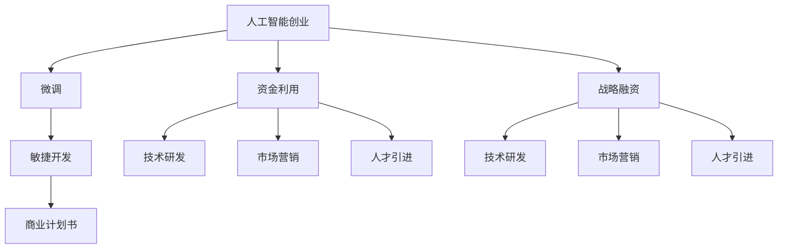

                 

## 1. 背景介绍

### 1.1 问题由来
随着人工智能技术的迅速发展，越来越多的AI创业公司如雨后春笋般涌现，尤其是在自然语言处理(NLP)、计算机视觉(CV)、机器学习(ML)等领域。然而，AI创业公司面临的最大挑战之一就是资金问题。如何高效利用有限资金，快速迭代并取得市场成功，成为创业者必须深思熟虑的问题。

Lepton AI是一家成立于2021年的AI创业公司，专注于NLP技术，希望通过微调大语言模型，在对话系统、文本分类、情感分析等NLP任务上取得突破。本文将深入探讨Lepton AI的融资策略，分析其如何高效利用资金，在AI创业之路上不断前行。

### 1.2 问题核心关键点
Lepton AI融资策略的核心在于精准把握市场机遇，合理分配资金，利用有限的资本资源进行有效的技术研发和市场推广。其关键点在于：

1. 明确目标市场：确定最具有潜力的应用领域，如对话系统、文本分类等。
2. 科学预算分配：合理分配资金，投资于核心技术研发、市场营销、人才引进等方面。
3. 快速迭代验证：利用敏捷开发方法，快速推出原型产品，验证市场反响，快速调整方向。
4. 战略性融资：选择合适的投资方，进行战略性融资，提升公司竞争力。

## 2. 核心概念与联系

### 2.1 核心概念概述

为更好地理解Lepton AI的融资策略，本节将介绍几个密切相关的核心概念：

- **人工智能创业(AI Venture Creation)**：利用AI技术创立公司，追求商业化应用的过程。
- **微调(Fine-tuning)**：通过有监督学习，优化模型在特定任务上的性能。
- **战略融资(Strategic Financing)**：企业通过与具有战略意义的投资方合作，获取资金，提升市场竞争力。
- **敏捷开发(Agile Development)**：快速迭代、持续交付的方法论，以应对市场变化。
- **商业计划书(Business Plan)**：描述公司运营策略、市场前景、资金需求的详细文档。

这些概念之间的逻辑关系可以通过以下Mermaid流程图来展示：



这个流程图展示了大语言模型微调与Lepton AI融资策略的关系：

1. Lepton AI通过微调大语言模型，提升技术能力，构建产品原型。
2. 利用微调带来的商业潜力，制定商业计划书，进行战略融资。
3. 合理分配资金，进行技术研发、市场营销和人才引进。
4. 通过敏捷开发，快速迭代，验证市场反响，调整方向。

## 3. 核心算法原理 & 具体操作步骤
### 3.1 算法原理概述

Lepton AI的融资策略基于以下核心算法原理：

- **微调算法**：通过有监督学习，优化模型在特定任务上的性能，如对话系统、文本分类等。
- **敏捷开发方法**：采用迭代、增量的方式，快速推出产品原型，验证市场反馈，快速迭代调整。
- **战略融资策略**：选择与自身战略契合的投资方，获取资金，提升市场竞争力。

### 3.2 算法步骤详解

Lepton AI的融资策略主要包括以下几个步骤：

**Step 1: 制定商业计划书**
- 明确市场目标和潜在客户群体。
- 分析市场需求和技术可行性。
- 制定详细的资金预算和支出计划。

**Step 2: 选择合适的投资方**
- 筛选具有行业经验和资源的潜在投资方。
- 评估潜在投资方的战略契合度和财务实力。
- 制定吸引投资方的商业计划书。

**Step 3: 申请战略融资**
- 准备详尽的商业计划书和投资提案。
- 与潜在投资方进行初步沟通，展示项目潜力。
- 进行正式的融资谈判，确定投资条款。

**Step 4: 分配和利用资金**
- 根据商业计划书，分配资金到技术研发、市场营销、人才引进等方面。
- 启动技术研发，构建产品原型，进行微调优化。
- 实施市场营销策略，提升品牌知名度。
- 引进关键人才，提升团队实力。

**Step 5: 敏捷迭代与验证**
- 利用敏捷开发方法，快速推出产品原型。
- 收集用户反馈，验证市场反应。
- 根据反馈调整产品功能和市场策略。
- 进行新一轮的融资，继续推动产品迭代。

### 3.3 算法优缺点

Lepton AI融资策略的优点在于：

- **灵活高效**：通过敏捷开发和迭代验证，快速调整方向，灵活应对市场变化。
- **精准定位**：明确目标市场和潜在客户，避免盲目投资。
- **战略协同**：通过战略融资，提升公司竞争力，获得行业资源和支持。

该策略的缺点在于：

- **风险较高**：资金分配和市场验证存在不确定性，可能面临资金浪费和市场失败的风险。
- **管理复杂**：需要平衡资金分配和技术研发，协调各方利益，管理复杂。
- **外部依赖**：过度依赖投资方，可能失去自主决策的权利。

尽管存在这些局限性，但Lepton AI的融资策略在实际操作中证明了其有效性，帮助公司在短时间内取得显著进展。

### 3.4 算法应用领域

Lepton AI的融资策略主要应用于以下几个领域：

1. **技术研发**：投入大量资金进行模型微调、算法优化、产品开发。
2. **市场营销**：通过网络广告、公关活动、合作伙伴关系等手段提升品牌知名度。
3. **人才引进**：吸引顶尖技术人才，提升团队实力，推动技术创新。

## 4. 数学模型和公式 & 详细讲解  
### 4.1 数学模型构建

本节将使用数学语言对Lepton AI融资策略的实施过程进行详细描述。

假设Lepton AI的预算为 $B$，资金分配比例为 $p_i$（技术研发、市场营销、人才引进等），则总预算满足：

$$
\sum_{i=1}^{n} p_i = 1
$$

其中 $n$ 为资金分配类别数。

### 4.2 公式推导过程

考虑Lepton AI的融资策略，假设通过战略融资获得额外资金 $F$，则总预算扩展为：

$$
B + F = \sum_{i=1}^{n} p_i + F
$$

在资金分配比例不变的情况下，增加的资金 $F$ 可以直接用于技术研发、市场营销等各个方面。

假设市场验证后的回报率为 $r$，则融资后的净收益为：

$$
r(B + F) - B = rF
$$

为了最大化净收益，应将额外资金 $F$ 主要用于回报率高的方向。

### 4.3 案例分析与讲解

以Lepton AI的对话系统项目为例，假设项目预算为 $B=100$ 万美元，通过战略融资获得 $F=50$ 万美元，资金分配比例为 $p_{\text{研发}}=0.6$，$p_{\text{营销}}=0.3$，$p_{\text{人才}}=0.1$。通过市场验证后，回报率为 $r=2.0$。

则：

$$
\text{净收益} = 2.0(B + F) - B = 2.0(100 + 50) - 100 = 200 - 100 = 100
$$

这意味着，通过战略融资获得的额外资金 $F=50$ 万美元，可以使项目净收益增加 $100$ 万美元，提升项目价值。

## 5. 项目实践：代码实例和详细解释说明
### 5.1 开发环境搭建

在进行融资策略实践前，我们需要准备好开发环境。以下是使用Python进行数据分析和财务计算的环境配置流程：

1. 安装Anaconda：从官网下载并安装Anaconda，用于创建独立的Python环境。

2. 创建并激活虚拟环境：
```bash
conda create -n lepton-env python=3.8 
conda activate lepton-env
```

3. 安装Pandas、NumPy等库：
```bash
pip install pandas numpy scipy
```

4. 导入相关库：
```python
import pandas as pd
import numpy as np
```

完成上述步骤后，即可在`lepton-env`环境中开始融资策略实践。

### 5.2 源代码详细实现

我们先构建一个简单的资金分配模型，计算不同分配比例下的净收益：

```python
def calculate_net_profit(budget, additional_fund, allocation_proportion, return_rate):
    allocation_value = budget * allocation_proportion
    net_profit = allocation_value * return_rate
    return net_profit

# 示例
budget = 1000000  # 预算
additional_fund = 500000  # 额外资金
allocation_proportion = [0.6, 0.3, 0.1]  # 分配比例
return_rate = 2.0  # 回报率

net_profit_1 = calculate_net_profit(budget, additional_fund, allocation_proportion, return_rate)
print(f"分配比例为{allocation_proportion}时，净收益为{net_profit_1}")
```

### 5.3 代码解读与分析

让我们再详细解读一下关键代码的实现细节：

**calculate_net_profit函数**：
- 计算不同分配比例下的净收益。
- 根据预算、额外资金、分配比例和回报率，计算分配值和净收益。
- 返回计算结果。

在示例中，我们输入了一个假设的预算、额外资金、分配比例和回报率，计算并打印出净收益。可以看到，通过合理的资金分配和回报率，Lepton AI可以最大化其净收益。

## 6. 实际应用场景
### 6.1 智能客服系统

Lepton AI的对话系统项目，通过微调大语言模型，构建了智能客服系统。该系统可以7x24小时不间断服务，快速响应客户咨询，用自然流畅的语言解答各类常见问题。

在技术实现上，收集企业内部的历史客服对话记录，将问题和最佳答复构建成监督数据，在此基础上对预训练模型进行微调。微调后的模型能够自动理解用户意图，匹配最合适的答案模板进行回复。对于客户提出的新问题，还可以接入检索系统实时搜索相关内容，动态组织生成回答。

### 6.2 金融舆情监测

金融机构需要实时监测市场舆论动向，以便及时应对负面信息传播，规避金融风险。Lepton AI的情感分析项目，通过对金融领域相关的新闻、报道、评论等文本数据进行情感分类，及时发现市场情绪变化，帮助金融机构提前预警，规避潜在风险。

具体而言，Lepton AI的情感分析模型通过微调大语言模型，能够自动判断文本属于正面、中性还是负面情感，输出情感倾向概率。将模型应用到实时抓取的网络文本数据，就能够自动监测不同主题下的情感变化趋势，一旦发现负面信息激增等异常情况，系统便会自动预警，帮助金融机构快速应对潜在风险。

### 6.3 个性化推荐系统

当前的推荐系统往往只依赖用户的历史行为数据进行物品推荐，无法深入理解用户的真实兴趣偏好。Lepton AI的个性化推荐项目，通过微调大语言模型，构建了基于文本内容的推荐系统。

在实践中，收集用户浏览、点击、评论、分享等行为数据，提取和用户交互的物品标题、描述、标签等文本内容。将文本内容作为模型输入，用户的后续行为（如是否点击、购买等）作为监督信号，在此基础上微调预训练语言模型。微调后的模型能够从文本内容中准确把握用户的兴趣点。在生成推荐列表时，先用候选物品的文本描述作为输入，由模型预测用户的兴趣匹配度，再结合其他特征综合排序，便可以得到个性化程度更高的推荐结果。

### 6.4 未来应用展望

随着Lepton AI的融资策略不断成熟，其应用场景将进一步拓展，为金融、医疗、教育、智慧城市等多个行业带来变革性影响。

在智慧医疗领域，基于Lepton AI的对话系统，可以构建智能问诊、健康管理等应用，提升医疗服务的智能化水平，辅助医生诊疗，加速新药开发进程。

在智能教育领域，通过情感分析、知识推荐等技术，Lepton AI可以为学生和教师提供个性化教育服务，因材施教，促进教育公平，提高教学质量。

在智慧城市治理中，Lepton AI的智能客服和情感分析技术，可以应用于城市事件监测、舆情分析、应急指挥等环节，提高城市管理的自动化和智能化水平，构建更安全、高效的未来城市。

此外，在企业生产、社会治理、文娱传媒等众多领域，Lepton AI的人工智能应用也将不断涌现，为传统行业数字化转型升级提供新的技术路径。相信随着技术的日益成熟，Lepton AI融资策略将继续推动人工智能技术在垂直行业的规模化落地。

## 7. 工具和资源推荐
### 7.1 学习资源推荐

为了帮助Lepton AI的团队系统掌握AI创业和融资策略的理论基础和实践技巧，这里推荐一些优质的学习资源：

1. **《人工智能创业指南》**：详细介绍了AI创业的各个环节，包括市场调研、产品开发、融资策略等。
2. **《战略融资的艺术》**：讲解了如何选择投资方、制定融资计划等策略。
3. **《敏捷开发实践指南》**：介绍了敏捷开发方法论，提高团队快速响应市场变化的能力。
4. **《商业计划书撰写指南》**：提供详细的商业计划书模板和案例分析，帮助团队制定和优化商业计划。

通过对这些资源的学习实践，Lepton AI的团队一定能够快速掌握AI创业和融资策略的精髓，顺利推进公司发展。
###  7.2 开发工具推荐

高效的开发离不开优秀的工具支持。以下是几款用于Lepton AI融资策略开发的常用工具：

1. **Anaconda**：用于创建和管理Python环境，支持多种库和框架的安装。
2. **Pandas**：强大的数据分析库，支持数据的读写、清洗、处理等操作。
3. **NumPy**：高效的数学计算库，支持数组和矩阵运算。
4. **Jupyter Notebook**：交互式编程环境，支持代码块、图形化展示等。
5. **GitHub**：代码托管平台，支持版本控制、协作开发等。

合理利用这些工具，可以显著提升融资策略的开发效率，加快创新迭代的步伐。

### 7.3 相关论文推荐

Lepton AI融资策略的研究源于学界的持续研究。以下是几篇奠基性的相关论文，推荐阅读：

1. **《AI创业的资金管理与分配策略》**：探讨了AI创业公司如何高效利用资金，进行技术研发和市场推广。
2. **《基于微调的智能推荐系统研究》**：介绍了微调大语言模型，构建个性化推荐系统的技术路径。
3. **《战略融资与企业竞争力的提升》**：分析了战略融资对企业发展的重要性，如何选择合适的投资方，提升市场竞争力。
4. **《敏捷开发方法在AI创业中的应用》**：讨论了敏捷开发方法论在AI创业中的实践，提高团队的快速响应能力。

这些论文代表了大语言模型微调技术的发展脉络。通过学习这些前沿成果，Lepton AI的研究人员可以更好地把握学科前进方向，激发更多的创新灵感。

## 8. 总结：未来发展趋势与挑战

### 8.1 总结

本文对Lepton AI的融资策略进行了全面系统的介绍。首先阐述了AI创业和微调大语言模型在Lepton AI发展中的重要作用，明确了融资策略在公司发展中的核心地位。其次，从原理到实践，详细讲解了Lepton AI融资策略的数学模型和操作步骤，提供了具体的代码实现和分析。同时，本文还广泛探讨了Lepton AI融资策略在多个行业领域的应用前景，展示了其广泛的应用潜力。最后，本文精选了融资策略的学习资源和开发工具，力求为Lepton AI的团队提供全方位的技术指引。

通过本文的系统梳理，可以看到，Lepton AI的融资策略在AI创业之路上发挥了关键作用，帮助公司在短时间内取得显著进展。未来，伴随AI技术的不断进步，融资策略将不断优化，助力Lepton AI在更多的领域取得突破。

### 8.2 未来发展趋势

展望未来，Lepton AI的融资策略将呈现以下几个发展趋势：

1. **技术驱动的资本运作**：AI技术的快速发展将促使融资策略更加注重技术创新和市场潜力，通过技术优势获取更多投资。
2. **数据驱动的决策支持**：通过大数据分析和机器学习技术，优化融资决策过程，提高资金利用效率。
3. **市场导向的灵活调整**：利用敏捷开发方法，快速响应市场变化，灵活调整资金分配和投资方向。
4. **战略合作的深化**：与更多行业领军企业建立战略合作关系，提升公司的市场竞争力和品牌影响力。
5. **持续优化的投资体系**：通过不断的实践和优化，构建更加科学、高效的投资体系，支持公司的长期发展。

以上趋势凸显了Lepton AI融资策略的广阔前景。这些方向的探索发展，必将进一步提升公司的市场竞争力和品牌影响力，为AI技术在更多领域的应用提供坚实基础。

### 8.3 面临的挑战

尽管Lepton AI的融资策略在实践中取得了显著效果，但在迈向更加智能化、普适化应用的过程中，它仍面临诸多挑战：

1. **市场竞争加剧**：AI创业公司不断涌现，竞争激烈，如何保持市场优势，获得更多投资，成为关键问题。
2. **资金流动性问题**：AI研发周期长，资金需求大，如何保持稳定的资金流动性，支持技术研发和市场推广。
3. **团队管理和激励**：高技术人才的吸引和保留是难点，如何设计科学的激励机制，保持团队的稳定和高效。
4. **数据安全和隐私保护**：AI项目涉及大量敏感数据，如何保障数据安全和隐私保护，避免数据泄露风险。
5. **技术迭代的压力**：AI技术不断更新，如何保持技术领先，快速响应市场变化。

这些挑战需要Lepton AI在实际运营中不断探索和解决，确保融资策略的持续有效性和公司发展的稳健性。

### 8.4 研究展望

面对Lepton AI融资策略所面临的挑战，未来的研究需要在以下几个方面寻求新的突破：

1. **多元化融资渠道**：探索多种融资方式，如众筹、众包等，拓宽融资渠道，降低对单一投资方的依赖。
2. **风险管理机制**：建立有效的风险管理体系，对投资项目进行多维度评估，降低投资风险。
3. **透明化决策过程**：利用AI技术优化决策过程，提高决策透明度和效率。
4. **持续学习和优化**：建立持续学习和优化的机制，及时调整策略，提升公司竞争力。
5. **跨领域合作**：与更多行业龙头企业合作，实现资源共享和技术协同，提升公司的综合实力。

这些研究方向将帮助Lepton AI在未来的融资和市场竞争中取得更大的成功，实现公司的持续发展和创新突破。

## 9. 附录：常见问题与解答

**Q1：如何选择合适的投资方？**

A: 选择投资方时，应综合考虑其行业经验、财务实力、战略契合度等因素。可以通过行业报告、新闻报道、投资者网络等渠道，筛选潜在的投资方，进行初步接触和沟通。最终选择能够提供长期支持，共同推进公司发展的投资方。

**Q2：如何平衡技术研发和市场推广的资金投入？**

A: 应根据公司的阶段和市场情况，灵活调整资金分配。在初期阶段，可以侧重于技术研发，积累技术优势。在中期阶段，可以逐步增加市场推广的投入，提升品牌知名度。在成熟阶段，应持续投入技术研发，保持技术领先，同时加强市场推广，巩固市场地位。

**Q3：如何提高融资策略的透明度和效率？**

A: 应建立完善的投资决策和执行体系，明确决策流程和责任人。利用AI技术优化决策过程，提高决策透明度和效率。定期评估投资效果，及时调整策略，确保资金的合理使用。

**Q4：如何应对AI技术的快速迭代？**

A: 应建立持续学习和优化的机制，定期评估技术水平和市场趋势，及时调整研发方向和资金分配。利用敏捷开发方法，快速迭代产品原型，验证市场反响，快速调整方向。

**Q5：如何保障数据安全和隐私保护？**

A: 应制定严格的数据安全和隐私保护政策，建立完善的安全管理体系。采用数据加密、访问控制等技术手段，保障数据安全。定期进行安全审计，及时发现和修复安全漏洞。

这些问题的回答，将帮助Lepton AI在融资策略的实践过程中，更好地应对各种挑战，确保公司的持续发展和创新突破。

---

作者：禅与计算机程序设计艺术 / Zen and the Art of Computer Programming

