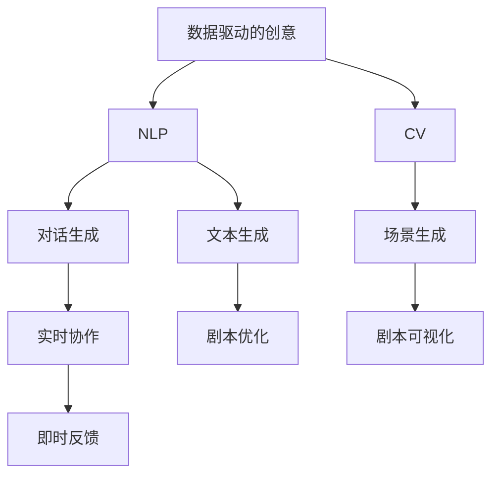

                 

# AI剧本创作：电影和电视产业的新工具

> 关键词：人工智能(AI), 剧本创作, 电影制作, 电视制作, 剧本生成, 深度学习, 自然语言处理(NLP), 计算机视觉(CV), 自动摘要, 文本生成

## 1. 背景介绍

### 1.1 问题由来
在影视行业的剧本创作和制作过程中，一个关键的瓶颈是创意。传统的剧本创作主要依赖编剧的个人创意和经验积累，但这种方式存在两个主要问题：

- **创意瓶颈**：顶级编剧通常数量有限，且创作速度慢，难以满足大制作的需求。
- **经验壁垒**：编剧的经验和风格对剧本质量有直接影响，但新手编剧往往需要较长时间才能达到一定水平。

随着人工智能技术的发展，尤其是深度学习和大数据分析，现在有新的技术手段开始被应用于剧本创作和电影制作中，以期解决上述瓶颈。通过自动化和数据驱动的方式，AI正在成为电影和电视产业中的新工具。

### 1.2 问题核心关键点
AI在影视产业中应用的核心关键点主要包括以下几点：

1. **数据驱动的创意**：AI通过分析海量影视作品的数据，理解故事结构、角色关系、情感变化等元素，从而生成或优化剧本。
2. **自然语言处理(NLP)**：NLP技术使得AI能够理解人类语言，进行剧本文本生成和自动摘要。
3. **计算机视觉(CV)**：CV技术帮助AI识别场景、人物和动作，辅助剧本创作。
4. **多模态融合**：结合NLP和CV，AI可以实现从文字到图像的自动生成，提升剧本创作效率和质量。
5. **实时协作**：AI工具可以与编剧实时协作，提供即时反馈和建议。

## 2. 核心概念与联系

### 2.1 核心概念概述

为更好地理解AI在影视产业中的应用，本节将介绍几个关键概念：

- **人工智能(AI)**：通过数据、算法和计算能力实现模拟人类智能的技术。
- **剧本创作**：电影和电视作品中的对话和情节设计。
- **自然语言处理(NLP)**：使计算机能够理解和生成人类语言的技术。
- **计算机视觉(CV)**：使计算机能够“看”图像和视频的技术。
- **多模态融合**：将不同类型的数据（如文本、图像、音频等）结合起来进行综合处理的技术。

这些概念共同构成了AI在影视产业中剧本创作的核心框架，使得AI能够理解和生成剧本，辅助编剧创作，提升电影制作效率和质量。

### 2.2 核心概念原理和架构的 Mermaid 流程图



这个流程图展示了大语言模型在影视产业中剧本创作的流程：

1. **数据驱动的创意**：利用海量影视作品的数据进行分析。
2. **自然语言处理(NLP)**：理解文本，进行文本生成和对话生成。
3. **计算机视觉(CV)**：识别场景和人物。
4. **多模态融合**：结合文本和图像，生成场景和剧本。
5. **实时协作**：与编剧实时交互，提供即时反馈。

## 3. 核心算法原理 & 具体操作步骤

### 3.1 算法原理概述

AI剧本创作的核心算法原理主要基于以下三点：

1. **数据驱动**：通过分析海量影视作品的数据，理解故事结构、角色关系、情感变化等元素，从而生成或优化剧本。
2. **自然语言处理(NLP)**：利用NLP技术使AI能够理解和生成剧本文本。
3. **计算机视觉(CV)**：结合CV技术，AI可以识别场景、人物和动作，辅助剧本创作。

这些技术可以单独或组合使用，以不同的方式支持剧本创作和影视制作。

### 3.2 算法步骤详解

**Step 1: 数据预处理**
- 收集和清洗海量影视作品的数据，包括剧本文本、视频片段、音频对话等。
- 使用NLP和CV技术提取数据特征，如情节结构、角色关系、情感变化、场景描述等。

**Step 2: 模型训练**
- 使用深度学习模型（如BERT、GPT等）进行预训练，使其具备良好的语言理解能力。
- 在预训练模型的基础上，通过微调或迁移学习等方式，训练特定于影视剧本的模型。

**Step 3: 剧本生成**
- 利用训练好的模型生成新的剧本文本或优化现有剧本。
- 结合CV技术，生成场景图像，辅助剧本创作。

**Step 4: 多模态融合**
- 将文本、图像和音频等多模态数据融合，生成更加完整的剧本内容。
- 使用AI实时协作工具，与编剧交互，提供即时反馈和建议。

**Step 5: 剧本优化**
- 结合专家反馈和AI分析，对剧本进行多次迭代优化。
- 使用A/B测试等方式，评估不同版本的剧本效果，选择最优方案。

### 3.3 算法优缺点

AI剧本创作的优点：

1. **效率提升**：大量剧本创作和优化任务可以在较短时间内完成。
2. **质量提升**：AI能够提供客观的分析和建议，提升剧本质量。
3. **减少创意瓶颈**：AI可以辅助新手编剧，提升其创作能力。

AI剧本创作的主要缺点：

1. **依赖数据**：AI的创作依赖于高质量的数据，数据不足时效果有限。
2. **创造力局限**：AI生成的剧本可能缺乏独特的创造性和深度。
3. **伦理和偏见**：AI生成的内容可能存在偏见和伦理问题，需要人为审核和调整。

### 3.4 算法应用领域

AI剧本创作在以下领域中得到了广泛应用：

1. **电影制作**：辅助编剧创作故事大纲、剧本和对话，提升创作效率。
2. **电视制作**：生成电视剧集的情节和对话，提升内容生产速度。
3. **动画制作**：生成动画剧本和角色动作脚本，辅助动画制作。
4. **游戏制作**：生成游戏故事情节和角色对话，提升游戏体验。
5. **教育培训**：生成教学剧本和角色对话，辅助教育和培训。

## 4. 数学模型和公式 & 详细讲解 & 举例说明

### 4.1 数学模型构建

我们以生成文本为基础，介绍AI剧本创作中常用的数学模型。

假设我们有一个预训练的语言模型，其输出为 $p(x)$，表示生成文本的概率分布。在影视剧本创作中，我们希望生成的文本 $x$ 能够符合特定的情感和场景要求，即最大化 $p(x|e, s)$，其中 $e$ 为情感，$s$ 为场景。

因此，我们可以构建一个带有情感和场景约束的生成模型：

$$
p(x|e, s) = \frac{p(x)}{p(e, s)} = \frac{p(x)}{\frac{p(e|x)p(s|x)}{p(x)}}
$$

其中 $p(e|x)$ 和 $p(s|x)$ 分别表示情感和场景的预测概率。

### 4.2 公式推导过程

为了最大化上述模型，我们需要对情感和场景进行预测，并将其与目标情感和场景进行对比。这可以通过训练一个联合预测模型来实现：

$$
\hat{e} = \text{Softmax}(f_{em}(x))
$$

$$
\hat{s} = \text{Softmax}(f_{sm}(x))
$$

其中 $f_{em}(x)$ 和 $f_{sm}(x)$ 分别为情感和场景的预测函数，$\text{Softmax}$ 函数将输出映射到概率分布上。

通过最大化 $\log p(x|e, s)$，我们可以得到：

$$
\hat{x} = \arg\max_{x} \log p(x|e, s)
$$

结合上述预测模型，我们得到最终生成的文本为：

$$
x = \arg\max_{x} \log p(x) - \log p(e|x) - \log p(s|x)
$$

### 4.3 案例分析与讲解

假设我们要生成一个描述美丽景色的文本：

```
The sun sets over the mountain, casting a golden glow over the landscape. Birds chirp in the distance, and the air is filled with the sweet scent of blooming flowers.
```

我们可以使用上述模型进行情感和场景预测，然后结合文本生成模型，得到最终的文本。

## 5. 项目实践：代码实例和详细解释说明

### 5.1 开发环境搭建

要进行AI剧本创作的代码实践，首先需要搭建开发环境。以下是使用Python进行PyTorch开发的简单步骤：

1. 安装Anaconda：从官网下载并安装Anaconda，用于创建独立的Python环境。

2. 创建并激活虚拟环境：
```bash
conda create -n pytorch-env python=3.8 
conda activate pytorch-env
```

3. 安装PyTorch：根据CUDA版本，从官网获取对应的安装命令。例如：
```bash
conda install pytorch torchvision torchaudio cudatoolkit=11.1 -c pytorch -c conda-forge
```

4. 安装相关库：
```bash
pip install transformers sacremoses
```

### 5.2 源代码详细实现

下面是一个简单的代码示例，展示如何使用GPT模型生成剧本文本。

```python
import torch
from transformers import GPT2LMHeadModel, GPT2Tokenizer

# 加载模型和分词器
model = GPT2LMHeadModel.from_pretrained('gpt2-medium')
tokenizer = GPT2Tokenizer.from_pretrained('gpt2-medium')

# 定义情感和场景标签
emotions = ['happy', 'sad', 'angry', 'neutral']
scenes = ['city', 'forest', 'mountain', 'desert']

# 定义目标情感和场景
target_emotion = 'happy'
target_scene = 'forest'

# 生成剧本文本
generated_text = ''
input_prompt = f"{target_emotion} scene: {target_scene}, start with: 'The sun sets over the mountain, casting a golden glow over the landscape.'"

input_ids = tokenizer.encode(input_prompt, return_tensors='pt')

for _ in range(100):
    output_ids, _ = model.generate(input_ids)
    generated_text += tokenizer.decode(output_ids, skip_special_tokens=True)
    input_ids = tokenizer.encode(generated_text, max_length=512, return_tensors='pt')

# 输出生成文本
print(generated_text)
```

### 5.3 代码解读与分析

在上述代码中，我们使用了GPT2模型和GPT2分词器，生成了描述森林场景的剧本文本。关键步骤如下：

1. **加载模型和分词器**：通过`from_pretrained`方法加载预训练的GPT2模型和分词器。
2. **定义情感和场景标签**：定义常用的情感和场景标签。
3. **生成剧本文本**：使用`generate`方法生成文本，循环迭代100次，每次生成的文本作为下一次的输入。
4. **输出生成文本**：将生成的文本解码输出。

可以看到，GPT2模型能够根据初始输入生成符合特定情感和场景的文本，具有较高的创作能力。

## 6. 实际应用场景

### 6.1 智能编剧助手

智能编剧助手可以辅助编剧进行剧本创作，提供情感和场景建议，生成对话和情节。例如，Netflix的NeoScript工具，结合AI和人类编辑的优势，可以大幅提升剧本创作效率。

### 6.2 场景生成和视觉特效

结合计算机视觉技术，AI可以自动生成场景图像和视觉特效，帮助编剧和导演更好地构思和制作影视作品。例如，Disney的Artificial Intelligence for Filmmaking，利用深度学习技术生成3D场景和角色。

### 6.3 情节生成和优化

AI可以通过分析海量影视作品的数据，生成情节大纲和优化剧本内容。例如，AuroraWaves的CineMonkey工具，通过分析海量剧本数据，生成情节大纲和角色关系图。

### 6.4 未来应用展望

随着AI技术的发展，未来影视产业中AI剧本创作的应用将更加广泛，带来以下变革：

1. **自动化创作**：AI将能够生成高质量的剧本内容，大幅提升创作效率。
2. **数据驱动决策**：AI可以分析大量影视作品的数据，提供科学的创作建议。
3. **实时协作**：AI工具可以与编剧实时交互，提供即时反馈和建议。
4. **跨领域融合**：AI结合计算机视觉、自然语言处理等技术，实现多模态创作。
5. **个性化定制**：AI可以生成符合特定观众口味的剧本内容。

## 7. 工具和资源推荐

### 7.1 学习资源推荐

为了帮助开发者系统掌握AI剧本创作的理论基础和实践技巧，这里推荐一些优质的学习资源：

1. **《深度学习》书籍**：Ian Goodfellow、Yoshua Bengio、Aaron Courville合著的深度学习经典教材，系统介绍了深度学习理论和应用。
2. **《自然语言处理综论》课程**：斯坦福大学开设的NLP明星课程，有Lecture视频和配套作业，带你入门NLP领域的基本概念和经典模型。
3. **《人工智能在影视产业中的应用》课程**：在线学习平台上的相关课程，系统介绍了AI在影视产业中的应用和最新进展。
4. **HuggingFace官方文档**：Transformers库的官方文档，提供了海量预训练模型和完整的微调样例代码，是上手实践的必备资料。
5. **GitHub上的AI剧本创作项目**：搜索相关开源项目，学习最佳实践和技术方案。

### 7.2 开发工具推荐

高效的开发离不开优秀的工具支持。以下是几款用于AI剧本创作开发的常用工具：

1. **PyTorch**：基于Python的开源深度学习框架，灵活动态的计算图，适合快速迭代研究。大部分预训练语言模型都有PyTorch版本的实现。
2. **TensorFlow**：由Google主导开发的开源深度学习框架，生产部署方便，适合大规模工程应用。同样有丰富的预训练语言模型资源。
3. **Transformers库**：HuggingFace开发的NLP工具库，集成了众多SOTA语言模型，支持PyTorch和TensorFlow，是进行剧本创作开发的利器。
4. **Weights & Biases**：模型训练的实验跟踪工具，可以记录和可视化模型训练过程中的各项指标，方便对比和调优。与主流深度学习框架无缝集成。
5. **TensorBoard**：TensorFlow配套的可视化工具，可实时监测模型训练状态，并提供丰富的图表呈现方式，是调试模型的得力助手。

### 7.3 相关论文推荐

AI剧本创作的发展源于学界的持续研究。以下是几篇奠基性的相关论文，推荐阅读：

1. **Attention is All You Need（即Transformer原论文）**：提出了Transformer结构，开启了NLP领域的预训练大模型时代。
2. **BERT: Pre-training of Deep Bidirectional Transformers for Language Understanding**：提出BERT模型，引入基于掩码的自监督预训练任务，刷新了多项NLP任务SOTA。
3. **Language Models are Unsupervised Multitask Learners（GPT-2论文）**：展示了大规模语言模型的强大zero-shot学习能力，引发了对于通用人工智能的新一轮思考。
4. **Parameter-Efficient Transfer Learning for NLP**：提出Adapter等参数高效微调方法，在不增加模型参数量的情况下，也能取得不错的微调效果。
5. **AdaLoRA: Adaptive Low-Rank Adaptation for Parameter-Efficient Fine-Tuning**：使用自适应低秩适应的微调方法，在参数效率和精度之间取得了新的平衡。

这些论文代表了大语言模型微调技术的发展脉络。通过学习这些前沿成果，可以帮助研究者把握学科前进方向，激发更多的创新灵感。

## 8. 总结：未来发展趋势与挑战

### 8.1 总结

本文对AI在影视产业中剧本创作的应用进行了全面系统的介绍。首先阐述了AI剧本创作的研究背景和意义，明确了AI剧本创作在影视产业中的重要价值。其次，从原理到实践，详细讲解了AI剧本创作的核心算法和操作步骤，给出了具体的代码实例和解释。同时，本文还广泛探讨了AI剧本创作在影视制作中的应用场景，展示了AI的广泛潜力。

通过本文的系统梳理，可以看到，AI剧本创作正在成为影视产业的重要工具，极大地提升影视创作的效率和质量。未来，伴随AI技术的发展，AI剧本创作必将在影视产业中发挥更加重要的作用，推动影视产业的数字化转型和智能化升级。

### 8.2 未来发展趋势

展望未来，AI剧本创作将呈现以下几个发展趋势：

1. **自动化水平提升**：AI将能够自动生成高质量的剧本内容，提升创作效率。
2. **数据驱动决策**：AI可以分析海量影视作品的数据，提供科学的创作建议。
3. **实时协作**：AI工具可以与编剧实时交互，提供即时反馈和建议。
4. **跨领域融合**：AI结合计算机视觉、自然语言处理等技术，实现多模态创作。
5. **个性化定制**：AI可以生成符合特定观众口味的剧本内容。

这些趋势将使AI在影视产业中的应用更加深入和广泛，带来新的机遇和挑战。

### 8.3 面临的挑战

尽管AI剧本创作取得了显著进展，但在迈向更加智能化、普适化应用的过程中，仍然面临诸多挑战：

1. **数据依赖**：AI的创作依赖于高质量的数据，数据不足时效果有限。
2. **创造力局限**：AI生成的剧本可能缺乏独特的创造性和深度。
3. **伦理和偏见**：AI生成的内容可能存在偏见和伦理问题，需要人为审核和调整。

### 8.4 研究展望

面对AI剧本创作面临的挑战，未来的研究需要在以下几个方面寻求新的突破：

1. **数据增强**：通过数据增强技术，提升AI对不同风格和题材的适应能力。
2. **多模态融合**：结合计算机视觉、自然语言处理等技术，实现多模态创作。
3. **伦理和偏见**：引入伦理导向的评估指标，过滤和惩罚有偏见、有害的输出倾向。
4. **人性化交互**：提升AI与编剧的交互体验，增强人机协作效果。

这些研究方向将推动AI剧本创作技术的不断演进，为影视产业带来更多创新和变革。

## 9. 附录：常见问题与解答

**Q1：AI剧本创作是否适用于所有影视作品？**

A: AI剧本创作在电影、电视、动画、游戏等多个领域中都有应用，但并不适用于所有影视作品。对于一些需要高度个性化和深度创作的作品，如文艺片、纪录片等，AI可能无法完全取代人工创作。

**Q2：AI剧本创作是否会影响编剧的创造力？**

A: AI可以辅助编剧进行创意构思和剧本优化，但并不会取代编剧的创造力。AI提供的只是基于数据的建议，最终的创作还需依赖编剧的想象力和创新力。

**Q3：AI剧本创作是否会带来伦理和偏见问题？**

A: AI生成的剧本可能存在偏见和伦理问题，如性别歧视、暴力内容等。为避免这些问题，需要在生成模型中加入伦理导向的评估指标，并进行严格的人工审核和调整。

**Q4：AI剧本创作是否会降低剧本质量？**

A: AI生成的剧本质量取决于训练数据和模型设计。如果数据质量高，模型设计合理，AI生成的剧本可以达到甚至超越一些新手编剧的水平。但无论如何，AI仍无法完全取代顶级编剧的创作能力。

**Q5：AI剧本创作是否需要高昂的计算资源？**

A: AI剧本创作需要较大的计算资源，但随着硬件设备的提升和算法优化，计算成本正在逐步降低。目前已有许多开源工具和云服务，降低了AI剧本创作的门槛。

通过本文的系统梳理，可以看到，AI剧本创作正在成为影视产业的重要工具，极大地提升影视创作的效率和质量。未来，伴随AI技术的发展，AI剧本创作必将在影视产业中发挥更加重要的作用，推动影视产业的数字化转型和智能化升级。

---

作者：禅与计算机程序设计艺术 / Zen and the Art of Computer Programming

