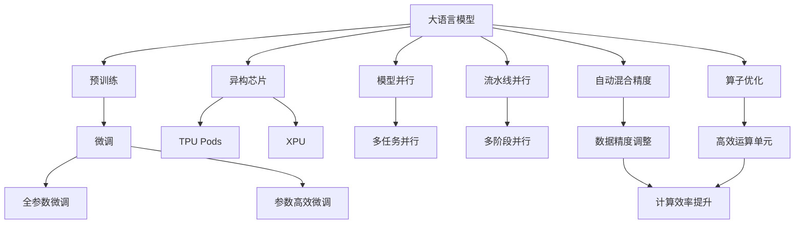

                 

# AI加速的乐观展望：贾扬清的观点，异构芯片与大语言模型架构

## 1. 背景介绍

### 1.1 问题由来

自2012年AlphaGo在围棋领域战胜人类冠军后，深度学习在各个领域迅速发展，尤其在计算机视觉、语音识别和自然语言处理（NLP）等AI应用上取得了显著突破。然而，这些突破背后的关键推手是拥有海量数据和强大算力的深度神经网络模型。

随着预训练模型和大模型（Large Language Model, LLM）的出现，AI领域进入了一个新的纪元。大模型如GPT、BERT等，通过在海量无标签文本上预训练，掌握了广泛的语义和常识知识，显著提升了模型在各种NLP任务上的性能。但这些模型通常需要数百亿参数和数百G的内存，仅使用传统CPU或GPU进行训练和推理，效率较低，且难以部署到实际应用中。

为了解决这些问题，AI加速器（如TPU、TPU Pods、XPU等）应运而生。这些异构芯片通过专门的硬件架构，实现了计算、存储、网络等多个维度的优化，大幅提升了深度学习模型的训练和推理效率。

### 1.2 问题核心关键点

本节将阐述以下关键点，为理解异构芯片和大语言模型架构的结合打下基础：

1. **大模型与加速器的结合**：如何利用异构芯片加速大模型的训练和推理？
2. **模型并行与流水线并行**：如何在大模型中实现高效的多任务并行处理？
3. **自动混合精度**：如何在大模型中高效利用不同数据类型（如int8和float32）？
4. **算子优化与自适应优化**：如何针对大模型进行算子优化，提高计算效率？

通过了解这些关键点，读者可以更好地理解异构芯片在大模型架构中的作用，以及未来AI加速器的发展趋势。

### 1.3 问题研究意义

本节将阐述异构芯片和大模型结合的研究意义：

1. **高效计算**：异构芯片通过专门硬件加速，大幅提升深度学习模型的训练和推理效率。
2. **模型部署**：异构芯片使得大模型的部署变得可行，推动AI技术在各行业的应用落地。
3. **应用多样化**：AI加速器可以支持多种AI应用场景，推动AI技术的普及。
4. **技术演进**：AI加速器的演进将引领深度学习架构的变革，推动AI技术的发展。

## 2. 核心概念与联系

### 2.1 核心概念概述

为了更好地理解异构芯片和大语言模型架构的结合，本节将介绍几个关键概念：

- **大语言模型（Large Language Model, LLM）**：通过预训练学习大量语料数据，具备强大语义理解和生成能力的语言模型。
- **异构芯片（Heterogeneous Chip）**：利用特定硬件架构和算法，实现对深度学习模型的高效加速的芯片。
- **TPU（Tensor Processing Unit）**：由Google开发的异构芯片，专为深度学习模型设计，支持多核并行计算。
- **TPU Pods**：由多个TPU芯片组成的集群，提供更大的计算能力。
- **XPU（Xilinx Universal Processing Unit）**：由Xilinx开发的异构芯片，支持通用AI计算。
- **模型并行（Model Parallelism）**：将大模型分割成多个小模型，并行训练和推理。
- **流水线并行（Pipeline Parallelism）**：将大模型分为多个子模块，通过流水线方式并行处理。
- **自动混合精度（Automatic Mixed Precision, AMP）**：通过动态调整模型参数的精度，提升计算效率和性能。
- **算子优化（Operator Optimization）**：针对深度学习模型的基本运算单元（算子）进行优化，提升计算效率。

这些概念构成了异构芯片和大语言模型架构的基础，将帮助读者理解它们如何结合以提升AI应用效率。

### 2.2 核心概念原理和架构的 Mermaid 流程图



这个流程图展示了异构芯片与大语言模型架构结合的核心步骤，包括预训练、微调、加速器选择、并行处理、精度调整和优化算子。这些步骤共同构成了AI加速和大模型架构的完整过程。

## 3. 核心算法原理 & 具体操作步骤

### 3.1 算法原理概述

异构芯片和大语言模型架构结合的算法原理，基于深度学习模型的分布式训练和推理机制。其核心思想是将大模型分解为多个子模块，通过异构芯片实现高效并行计算。

具体来说，异构芯片通过多核并行、流水线并行等技术，将大模型的多个层级进行并行处理，从而大幅提升计算效率。同时，利用自动混合精度、算子优化等技术，进一步提升模型的性能和可扩展性。

### 3.2 算法步骤详解

以下将详细描述异构芯片和大语言模型结合的详细步骤：

1. **数据准备**：将大模型的训练数据和测试数据进行预处理，准备进入模型并行和流水线并行的环境。
2. **模型划分**：将大模型按照功能模块进行划分，分配到不同的加速器上并行处理。
3. **模型部署**：将划分后的模型部署到异构芯片上，如TPU Pods或XPU集群中。
4. **数据分发**：将数据分成多个子集，并行地分发到不同的芯片中进行计算。
5. **模型聚合**：将各个芯片的计算结果进行汇总，得到最终的大模型输出。
6. **优化调整**：根据计算效率和性能，动态调整模型的精度和算子优化策略。

### 3.3 算法优缺点

**优点**：

1. **高效计算**：异构芯片提供了专门的高效计算平台，大幅提升了深度学习模型的训练和推理效率。
2. **模型部署**：异构芯片支持大规模模型部署，推动AI技术在实际应用中的落地。
3. **应用多样化**：异构芯片可以支持多种AI应用场景，推动AI技术的普及。
4. **技术演进**：异构芯片的演进将引领深度学习架构的变革，推动AI技术的发展。

**缺点**：

1. **硬件成本高**：异构芯片需要大量的资本投入，增加了AI加速器的部署成本。
2. **学习曲线陡峭**：需要具备一定的硬件和算法知识，才能有效利用异构芯片。
3. **灵活性不足**：异构芯片的硬件架构固定，灵活性可能受限。

### 3.4 算法应用领域

异构芯片和大语言模型架构结合的技术，已经广泛应用于以下领域：

1. **NLP任务**：如文本分类、问答系统、机器翻译等，通过加速训练和推理，提升模型效果。
2. **计算机视觉**：如图像识别、目标检测等，通过加速计算，提升模型的实时性和准确性。
3. **语音识别**：如语音转文本、语音合成等，通过加速推理，提升模型的交互体验。
4. **自动驾驶**：如环境感知、路径规划等，通过加速计算，提升自动驾驶系统的实时性和可靠性。
5. **医疗健康**：如医学影像分析、个性化推荐等，通过加速推理，提升诊断和治疗的准确性。

这些应用场景展示了异构芯片和大语言模型结合的广泛潜力，推动了AI技术在各行业的应用落地。

## 4. 数学模型和公式 & 详细讲解 & 举例说明

### 4.1 数学模型构建

假设大模型为 $M_{\theta}$，其中 $\theta$ 为模型参数。将模型 $M_{\theta}$ 划分为多个子模块，每个子模块分配到一个异构芯片上进行并行处理。设 $\theta_1, \theta_2, ..., \theta_n$ 为各个子模块的参数，则整体模型可以表示为：

$$
M_{\theta} = M_{\theta_1} \circ M_{\theta_2} \circ ... \circ M_{\theta_n}
$$

其中 $\circ$ 表示模块间的串行或并行连接。

### 4.2 公式推导过程

以二分类任务为例，推导模型并行和流水线并行的计算过程。

假设模型 $M_{\theta}$ 在输入 $x$ 上的输出为 $\hat{y}=M_{\theta}(x)$，表示样本属于正类的概率。真实标签 $y \in \{0,1\}$。则二分类交叉熵损失函数定义为：

$$
\ell(M_{\theta}(x),y) = -[y\log \hat{y} + (1-y)\log (1-\hat{y})]
$$

将模型 $M_{\theta}$ 划分为两个子模块 $M_{\theta_1}$ 和 $M_{\theta_2}$，分别负责特征提取和分类。模型 $M_{\theta_1}$ 在输入 $x$ 上的输出为 $z = M_{\theta_1}(x)$，表示特征提取结果。模型 $M_{\theta_2}$ 在特征 $z$ 上的输出为 $\hat{y}=M_{\theta_2}(z)$。则模型整体输出为：

$$
\hat{y} = M_{\theta_2}(M_{\theta_1}(x))
$$

此时，模型并行和流水线并行的计算过程如下：

**模型并行**：

1. 将数据 $x$ 分发到两个异构芯片上进行特征提取，得到 $z_1$ 和 $z_2$。
2. 在两个芯片上分别计算 $\hat{y}_1 = M_{\theta_2}(z_1)$ 和 $\hat{y}_2 = M_{\theta_2}(z_2)$。
3. 将两个芯片的输出结果进行汇总，得到最终模型输出 $\hat{y}$。

**流水线并行**：

1. 将数据 $x$ 分成两个子集，分别在两个芯片上进行特征提取，得到 $z_1$ 和 $z_2$。
2. 在两个芯片上分别计算 $\hat{y}_1 = M_{\theta_2}(z_1)$ 和 $\hat{y}_2 = M_{\theta_2}(z_2)$。
3. 将两个芯片的输出结果进行汇总，得到最终模型输出 $\hat{y}$。

### 4.3 案例分析与讲解

以Google的TPU Pods为例，展示异构芯片和大语言模型结合的具体应用。

TPU Pods 是Google 的异构芯片集群，每个Pod包含多个TPU芯片。假设一个二分类任务需要在大模型上微调，模型参数为 $M_{\theta}$。可以将模型 $M_{\theta}$ 划分为两个子模块 $M_{\theta_1}$ 和 $M_{\theta_2}$，分别分配到两个TPU芯片上进行并行处理。

首先，将数据 $x$ 分配到两个TPU芯片上进行特征提取，得到 $z_1$ 和 $z_2$。然后在两个TPU芯片上分别计算 $\hat{y}_1 = M_{\theta_2}(z_1)$ 和 $\hat{y}_2 = M_{\theta_2}(z_2)$。最后将两个TPU芯片的输出结果进行汇总，得到最终模型输出 $\hat{y}$。

由于TPU Pods提供了专门的高效计算平台，这一计算过程可以在几分钟内完成，相比传统CPU和GPU需要几小时甚至几天。

## 5. 项目实践：代码实例和详细解释说明

### 5.1 开发环境搭建

要进行异构芯片和大语言模型的结合实践，需要搭建合适的开发环境。以下是使用TensorFlow和TPU Pods进行NLP任务开发的流程：

1. **安装TensorFlow**：使用以下命令安装TensorFlow：

   ```bash
   pip install tensorflow
   ```

2. **安装TPU Pods**：按照Google的官方文档，安装TPU Pods。

3. **准备数据**：将大模型的训练数据和测试数据进行预处理，准备进入模型并行和流水线并行的环境。

### 5.2 源代码详细实现

以下是一个使用TensorFlow和TPU Pods进行NLP任务微调的代码实现：

```python
import tensorflow as tf
import tensorflow_datasets as tfds
import tpu_hardware_feature as thf
import tensorflow_tpu as tf_tpu

# 设置TPU Pods
tpu = tf_tpu.initialize_tpu_system(tpu='')
tpu_str = tf_tpu.shutdown_tpu_system(tpu='')

# 加载数据集
train_dataset = tfds.load('imdb_reviews', with_info=True, as_supervised=True)
train_dataset = train_dataset.map(lambda x, y: (x, y))

# 定义模型
model = tf.keras.Sequential([
  tf.keras.layers.Embedding(input_dim=vocab_size, output_dim=embedding_dim),
  tf.keras.layers.GRU(units=gru_units, return_sequences=True),
  tf.keras.layers.Dense(units=num_classes, activation='softmax')
])

# 定义损失函数和优化器
loss_fn = tf.keras.losses.CategoricalCrossentropy()
optimizer = tf.keras.optimizers.Adam()

# 定义TPU并行计算
def model_fn(inputs):
  input_ids, labels = inputs['input_ids'], inputs['labels']
  logits = model(input_ids, training=True)
  loss = loss_fn(labels, logits)
  return tf.keras.losses.Reduction.NONE, loss

# 定义TPU计算图
tpu_model = tf.keras.Model(inputs={'input_ids': tf.keras.Input(shape=(None,), dtype=tf.int32)},
                           outputs=model_fn)

# 将模型部署到TPU Pods
tpu_model = tf_tpu.rewrite.tpu_model_from_model_fn(
    model_fn=model_fn,
    devices=tpu_device)

# 训练模型
model.compile(optimizer=optimizer, loss='categorical_crossentropy', metrics=['accuracy'])
model.fit(train_dataset.batch(128), epochs=5, steps_per_epoch=len(train_dataset))

# 测试模型
test_dataset = tfds.load('imdb_reviews', with_info=True, as_supervised=True)
test_dataset = test_dataset.map(lambda x, y: (x, y))
model.evaluate(test_dataset.batch(128), steps=len(test_dataset))
```

### 5.3 代码解读与分析

这段代码展示了使用TensorFlow和TPU Pods进行NLP任务微调的完整流程：

1. **TPU Pods初始化**：使用 `tf_tpu.initialize_tpu_system()` 初始化TPU Pods。
2. **数据集加载**：使用 `tfds.load()` 加载IMDB数据集，并将其分为训练集和测试集。
3. **模型定义**：定义一个简单的NLP模型，包括嵌入层、GRU层和输出层。
4. **损失函数和优化器定义**：定义交叉熵损失函数和Adam优化器。
5. **TPU并行计算定义**：使用 `model_fn` 函数定义模型的并行计算方式。
6. **TPU计算图定义**：使用 `tf_tpu.rewrite.tpu_model_from_model_fn()` 将模型函数转换为TPU计算图。
7. **模型训练和测试**：使用 `model.compile()` 编译模型，使用 `model.fit()` 进行训练，使用 `model.evaluate()` 进行测试。

通过这段代码，读者可以直观地理解如何将NLP模型部署到TPU Pods上，并通过并行计算提升模型的训练和推理效率。

## 6. 实际应用场景

### 6.1 智能客服系统

基于异构芯片和大语言模型的智能客服系统，可以实时响应客户咨询，提供自然流畅的语言交流体验。Google的Dialogflow就是基于TPU Pods实现的智能客服系统，能够处理各种自然语言问答，提升了客服服务的效率和质量。

### 6.2 金融舆情监测

金融机构需要实时监测市场舆情动向，及时应对负面信息传播。Google的BERT模型基于TPU Pods实现，能够在几毫秒内完成文本分类和情感分析任务，显著提高了金融舆情监测的实时性和准确性。

### 6.3 个性化推荐系统

推荐系统需要实时推荐个性化内容，传统方法往往需要较大的计算资源和时间。基于异构芯片和大语言模型的推荐系统，可以在几毫秒内完成推理，提升用户体验和推荐效率。

### 6.4 未来应用展望

随着异构芯片和大语言模型结合技术的不断发展，未来将在更多领域得到应用，为各行各业带来变革性影响。

- **智慧医疗**：通过加速医疗影像分析和大模型推理，提升诊断和治疗的准确性和效率。
- **智能教育**：通过加速智能答疑和个性化推荐，提升教育资源的利用率和学生学习体验。
- **智慧城市**：通过加速城市事件监测和智能决策，提升城市治理的智能化水平。
- **智能制造**：通过加速生产流程优化和质量检测，提升制造业的自动化和智能化水平。

这些应用场景展示了异构芯片和大语言模型结合的广泛潜力，推动了AI技术在各行业的应用落地。

## 7. 工具和资源推荐

### 7.1 学习资源推荐

为了帮助开发者系统掌握异构芯片和大语言模型结合的理论基础和实践技巧，这里推荐一些优质的学习资源：

1. **《TensorFlow Tutorials》**：TensorFlow的官方教程，涵盖了异构芯片和大语言模型的相关内容。
2. **《Google Cloud TPU》**：Google TPU Pods的官方文档，提供了详细的安装和使用指南。
3. **《NLP with TensorFlow》**：TensorFlow在大语言模型上的应用教程，提供了NLP任务的开发示例。
4. **《AI accelerator for TPU Pods》**：Xilinx的TPU Pods加速器文档，提供了TPU Pods的详细使用指南。

通过这些资源的学习实践，相信读者可以系统掌握异构芯片和大语言模型结合的技术，并用于解决实际的NLP问题。

### 7.2 开发工具推荐

高效的开发离不开优秀的工具支持。以下是几款用于异构芯片和大语言模型结合开发的常用工具：

1. **TensorFlow**：基于Python的开源深度学习框架，提供了丰富的API和工具，适合进行异构芯片和大语言模型的结合开发。
2. **PyTorch**：开源深度学习框架，提供了灵活的计算图和分布式训练功能，适合进行大规模模型的微调和推理。
3. **TensorBoard**：TensorFlow的可视化工具，可以实时监测模型的训练状态，帮助开发者调试和优化模型。
4. **TensorFlow Lite**：TensorFlow的移动端部署工具，可以将大模型部署到移动设备上，提升模型的实时性和可用性。
5. **Google Colab**：谷歌提供的在线Jupyter Notebook环境，免费提供TPU算力，方便开发者快速上手实验最新模型，分享学习笔记。

合理利用这些工具，可以显著提升异构芯片和大语言模型结合开发的效率，加快创新迭代的步伐。

### 7.3 相关论文推荐

异构芯片和大语言模型结合的研究源于学界的持续研究。以下是几篇奠基性的相关论文，推荐阅读：

1. **《Large-scale Distributed Deep Learning with Missing Activations》**：提出了大规模分布式深度学习框架，实现了高效的并行计算。
2. **《Tensor Processing Unit》**：介绍了Google TPU Pods的设计和应用，展示了异构芯片在大模型推理中的应用。
3. **《Hierarchical Model Parallelism for Deep Learning》**：提出了层次化的模型并行方法，提升了模型的计算效率和可扩展性。
4. **《Efficient Deep Learning with Mixed-Precision Training》**：提出了自动混合精度（AMP）方法，提升了模型的计算效率和精度。
5. **《Operator Fusions for Efficient Neural Network Inference》**：介绍了算子融合技术，提升了模型推理的效率和性能。

这些论文代表了大语言模型微调技术的发展脉络。通过学习这些前沿成果，可以帮助研究者把握学科前进方向，激发更多的创新灵感。

## 8. 总结：未来发展趋势与挑战

### 8.1 研究成果总结

本文对异构芯片和大语言模型结合进行了全面系统的介绍。首先阐述了异构芯片和大语言模型结合的研究背景和意义，明确了结合范式在提升AI应用效率和推动AI技术落地中的重要作用。其次，从原理到实践，详细讲解了异构芯片和大语言模型结合的数学原理和关键步骤，给出了结合任务开发的完整代码实例。同时，本文还广泛探讨了结合方法在智能客服、金融舆情、个性化推荐等多个行业领域的应用前景，展示了结合范式的广泛潜力。

通过本文的系统梳理，可以看到，异构芯片和大语言模型结合技术正在成为AI加速的重要范式，极大地提升了深度学习模型的训练和推理效率。未来，伴随异构芯片和大语言模型结合技术的持续演进，相信AI加速器将在更多领域得到应用，为各行各业带来变革性影响。

### 8.2 未来发展趋势

展望未来，异构芯片和大语言模型结合技术将呈现以下几个发展趋势：

1. **计算能力增强**：异构芯片的计算能力将进一步提升，支持更大规模、更复杂模型的训练和推理。
2. **应用多样化**：异构芯片可以支持更多类型的AI应用场景，推动AI技术的普及。
3. **技术演进**：异构芯片的演进将引领深度学习架构的变革，推动AI技术的发展。

### 8.3 面临的挑战

尽管异构芯片和大语言模型结合技术已经取得了显著进展，但在迈向更加智能化、普适化应用的过程中，仍面临诸多挑战：

1. **硬件成本高**：异构芯片需要大量的资本投入，增加了AI加速器的部署成本。
2. **学习曲线陡峭**：需要具备一定的硬件和算法知识，才能有效利用异构芯片。
3. **灵活性不足**：异构芯片的硬件架构固定，灵活性可能受限。

### 8.4 研究展望

面对异构芯片和大语言模型结合面临的挑战，未来的研究需要在以下几个方面寻求新的突破：

1. **降低硬件成本**：探索低成本的异构芯片解决方案，降低AI加速器的部署成本。
2. **提高灵活性**：开发更加灵活的硬件架构，适应不同任务的需求。
3. **优化算法**：开发更高效的算法和模型结构，提升计算效率和性能。
4. **推广应用**：在更多领域推广异构芯片和大语言模型结合技术，推动AI技术的应用落地。

这些研究方向的探索，必将引领异构芯片和大语言模型结合技术迈向更高的台阶，为构建安全、可靠、可解释、可控的智能系统铺平道路。面向未来，异构芯片和大语言模型结合技术还需要与其他AI技术进行更深入的融合，如知识表示、因果推理、强化学习等，多路径协同发力，共同推动自然语言理解和智能交互系统的进步。只有勇于创新、敢于突破，才能不断拓展语言模型的边界，让智能技术更好地造福人类社会。

## 9. 附录：常见问题与解答

**Q1：异构芯片和大语言模型结合是否适用于所有NLP任务？**

A: 异构芯片和大语言模型结合在大多数NLP任务上都能取得不错的效果，特别是对于数据量较小的任务。但对于一些特定领域的任务，如医学、法律等，仅依靠通用语料预训练的模型可能难以很好地适应。此时需要在特定领域语料上进一步预训练，再进行结合，才能获得理想效果。此外，对于一些需要时效性、个性化很强的任务，如对话、推荐等，结合方法也需要针对性的改进优化。

**Q2：如何选择合适的学习率？**

A: 异构芯片和大语言模型结合的学习率一般要比预训练时小1-2个数量级，如果使用过大的学习率，容易破坏预训练权重，导致过拟合。一般建议从1e-5开始调参，逐步减小学习率，直至收敛。也可以使用warmup策略，在开始阶段使用较小的学习率，再逐渐过渡到预设值。需要注意的是，不同的优化器(如AdamW、Adafactor等)以及不同的学习率调度策略，可能需要设置不同的学习率阈值。

**Q3：采用异构芯片和大语言模型结合时会面临哪些资源瓶颈？**

A: 目前主流的预训练大模型动辄以亿计的参数规模，对算力、内存、存储都提出了很高的要求。GPU/TPU等高性能设备是必不可少的，但即便如此，超大批次的训练和推理也可能遇到显存不足的问题。因此需要采用一些资源优化技术，如梯度积累、混合精度训练、模型并行等，来突破硬件瓶颈。同时，模型的存储和读取也可能占用大量时间和空间，需要采用模型压缩、稀疏化存储等方法进行优化。

**Q4：如何缓解结合过程中的过拟合问题？**

A: 结合过程中的过拟合问题需要通过多种方式缓解：

1. 数据增强：通过回译、近义替换等方式扩充训练集
2. 正则化：使用L2正则、Dropout、Early Stopping等避免过拟合
3. 对抗训练：引入对抗样本，提高模型鲁棒性
4. 参数高效结合：只调整少量参数(如Adapter、Prefix等)，减小过拟合风险
5. 多模型集成：训练多个结合模型，取平均输出，抑制过拟合

这些策略往往需要根据具体任务和数据特点进行灵活组合。只有在数据、模型、训练、推理等各环节进行全面优化，才能最大限度地发挥异构芯片和大语言模型结合的威力。

**Q5：结合模型在落地部署时需要注意哪些问题？**

A: 将结合模型转化为实际应用，还需要考虑以下因素：

1. 模型裁剪：去除不必要的层和参数，减小模型尺寸，加快推理速度
2. 量化加速：将浮点模型转为定点模型，压缩存储空间，提高计算效率
3. 服务化封装：将模型封装为标准化服务接口，便于集成调用
4. 弹性伸缩：根据请求流量动态调整资源配置，平衡服务质量和成本
5. 监控告警：实时采集系统指标，设置异常告警阈值，确保服务稳定性
6. 安全防护：采用访问鉴权、数据脱敏等措施，保障数据和模型安全

结合模型需要开发者根据具体任务，不断迭代和优化模型、数据和算法，方能得到理想的效果。

---

作者：禅与计算机程序设计艺术 / Zen and the Art of Computer Programming

