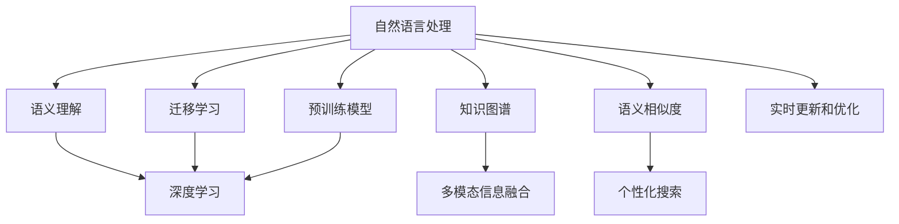

                 

## 1. 背景介绍

### 1.1 问题由来

在科学研究领域，文献检索和信息搜索是学者们获取新知识、跟踪最新进展不可或缺的工具。传统的文献搜索方法依赖于关键词检索、目录索引等，虽然简便快捷，但缺乏语义理解和上下文关联，难以精确命中相关文献。近年来，随着人工智能技术的迅猛发展，AI在自然语言处理（NLP）和计算机视觉（CV）等领域取得显著进展，为科研搜索带来了新的可能性。

特别是基于深度学习的模型，如BERT、GPT-3、Clarifai等，通过大规模预训练和微调，具备了强大的自然语言理解和生成能力，可以更准确地理解和处理科研文献，提升文献检索和信息搜索的精准度。同时，AI技术还可以辅助研究人员进行数据分析、可视化、知识图谱构建等，进一步提升科研工作的效率和深度。

### 1.2 问题核心关键点

AI助力科研搜索的核心关键点包括：

1. **语义理解和关联**：基于自然语言处理技术，AI可以理解文献标题、摘要、关键词等语义信息，进行语义匹配，避免传统关键词检索的误差。
2. **上下文关联**：AI能够处理文献之间的引用关系、参考文献、研究热点等信息，构建知识图谱，提供更深层次的上下文关联。
3. **自动化数据分析**：AI可以自动进行文献整理、数据提取、图表生成等，减轻研究人员的工作负担。
4. **多模态信息融合**：AI可以结合图像、视频等多模态信息，提升文献搜索的准确性和全面性。
5. **个性化搜索**：AI可以根据用户的历史查询和兴趣，推荐个性化的搜索结果，提升用户体验。
6. **实时更新和优化**：AI可以实时跟踪最新的研究进展，动态更新知识图谱和搜索结果，保持科研信息的实时性。

### 1.3 问题研究意义

AI助力科研搜索的研究意义在于：

1. **提高科研效率**：通过智能化的文献检索和数据分析，大大缩短研究人员获取和处理信息的时间，提升科研效率。
2. **提升信息精准度**：利用AI的语义理解和关联能力，提升搜索结果的相关性和精准度，避免误导性信息对研究工作的干扰。
3. **促进跨学科融合**：AI能够跨领域处理多模态信息，促进不同学科之间的知识交流和融合，推动跨学科研究的发展。
4. **加速科研进展**：通过自动化的数据分析和知识图谱构建，帮助研究人员快速把握研究前沿，加速科学发现和创新。
5. **助力科研教育**：AI技术可以用于科研教育平台，提供个性化的学习资源和推荐，提升科研人员的综合素养。

## 2. 核心概念与联系

### 2.1 核心概念概述

为更好地理解AI助力科研搜索的方法，本节将介绍几个密切相关的核心概念：

- **自然语言处理（NLP）**：利用计算机技术处理和理解自然语言的技术，包括文本分析、语义理解、情感分析等。
- **知识图谱（KG）**：以图的形式表示实体、属性、关系等信息的数据结构，用于知识表示和推理。
- **深度学习（DL）**：利用多层神经网络进行复杂模式识别的技术，广泛应用于图像、语音、文本等领域。
- **迁移学习（Transfer Learning）**：将一个领域学到的知识，迁移到另一个相关领域的机器学习范式。
- **预训练模型（Pre-trained Model）**：在大规模数据上预训练得到的模型，如BERT、GPT-3等，具备通用语言知识。
- **语义相似度（Semantic Similarity）**：衡量两个文本之间的语义相似程度，用于文本匹配和推荐。
- **多模态信息融合（Multi-modal Fusion）**：将文本、图像、视频等多种数据模态进行融合，提升信息的全面性和准确性。

这些核心概念之间的逻辑关系可以通过以下Mermaid流程图来展示：



这个流程图展示了大语言模型在科研搜索中的应用场景：

1. 自然语言处理技术用于理解文献的标题、摘要、关键词等文本信息，进行语义匹配。
2. 知识图谱技术用于构建文献之间的引用关系、参考文献等信息，提供更深层次的上下文关联。
3. 深度学习技术用于自动分析和处理文献内容，提取关键信息。
4. 迁移学习技术用于将预训练模型迁移到科研搜索场景中，提升模型的泛化能力。
5. 多模态信息融合技术用于融合文本、图像、视频等多模态信息，提升文献搜索的准确性和全面性。
6. 语义相似度技术用于衡量文本之间的语义相似程度，进行文本匹配和推荐。
7. 个性化搜索技术用于根据用户的历史查询和兴趣，推荐个性化的搜索结果。
8. 实时更新和优化技术用于动态跟踪最新的研究进展，保持科研信息的实时性。

## 3. 核心算法原理 & 具体操作步骤

### 3.1 算法原理概述

AI助力科研搜索的核心算法原理基于自然语言处理和深度学习技术，主要包括以下几个步骤：

1. **预训练模型加载**：选择合适的预训练模型，如BERT、GPT-3等，作为基础模型。
2. **数据预处理**：对科研文献进行文本预处理，如分词、去停用词、提取关键词等。
3. **特征提取**：使用预训练模型提取文本的语义特征，生成文本向量。
4. **语义匹配**：使用余弦相似度、Jaccard相似度等方法，计算文本向量之间的相似度，进行文献匹配。
5. **知识图谱构建**：利用预训练模型对文献进行引用关系和参考文献分析，构建知识图谱。
6. **多模态融合**：将文本、图像、视频等多模态信息进行融合，提升搜索结果的全面性。
7. **个性化推荐**：根据用户的历史查询和兴趣，推荐个性化的文献和信息。
8. **实时更新**：动态跟踪最新的研究进展，更新知识图谱和搜索结果。

### 3.2 算法步骤详解

下面以BERT模型为基础，详细讲解AI助力科研搜索的具体操作步骤：

#### 3.2.1 预训练模型加载

首先，选择合适的预训练模型BERT，并使用以下代码加载：

```python
from transformers import BertTokenizer, BertModel

tokenizer = BertTokenizer.from_pretrained('bert-base-uncased')
model = BertModel.from_pretrained('bert-base-uncased')
```

#### 3.2.2 数据预处理

对科研文献进行文本预处理，包括分词、去停用词、提取关键词等，使用以下代码：

```python
import string
import nltk

def preprocess_text(text):
    # 去除停用词和标点符号
    stop_words = set(nltk.corpus.stopwords.words('english'))
    tokens = [token for token in text.lower().split() if token not in stop_words and token not in string.punctuation]
    # 分词
    tokens = tokenizer.tokenize(' '.join(tokens))
    # 提取关键词
    keywords = [token for token in tokens if token not in stop_words]
    return ' '.join(keywords)
```

#### 3.2.3 特征提取

使用预训练模型BERT提取文本的语义特征，生成文本向量，使用以下代码：

```python
def extract_features(text):
    tokens = tokenizer.tokenize(text)
    tokens = [token for token in tokens if token not in stop_words]
    input_ids = tokenizer.convert_tokens_to_ids(tokens)
    attention_mask = [1] * len(input_ids)
    inputs = {'input_ids': input_ids, 'attention_mask': attention_mask}
    outputs = model(**inputs)
    # 获取最后一层的表示
    return outputs.pooler_output
```

#### 3.2.4 语义匹配

使用余弦相似度计算文本向量之间的相似度，进行文献匹配，使用以下代码：

```python
def cosine_similarity(vec1, vec2):
    return np.dot(vec1, vec2) / (np.linalg.norm(vec1) * np.linalg.norm(vec2))

def match_documents(vecs):
    similarities = np.zeros((len(vecs), len(vecs)))
    for i in range(len(vecs)):
        for j in range(len(vecs)):
            similarities[i, j] = cosine_similarity(vecs[i], vecs[j])
    return similarities
```

#### 3.2.5 知识图谱构建

利用预训练模型BERT对文献进行引用关系和参考文献分析，构建知识图谱，使用以下代码：

```python
from pykg import Graph

graph = Graph()
def add_document(doc):
    # 提取文本
    tokens = tokenizer.tokenize(doc)
    # 提取关键词
    keywords = [token for token in tokens if token not in stop_words]
    # 构建文档图节点
    graph.add_node(keywords)
    # 添加引用关系
    for reference in references:
        graph.add_edge(doc, reference, type='引用')
    # 添加参考文献
    for citation in citations:
        graph.add_edge(doc, citation, type='引用')
```

#### 3.2.6 多模态融合

将文本、图像、视频等多模态信息进行融合，提升搜索结果的全面性，使用以下代码：

```python
def fuse_documents(doc):
    # 提取文本
    tokens = tokenizer.tokenize(doc)
    # 提取关键词
    keywords = [token for token in tokens if token not in stop_words]
    # 融合图像信息
    # ...
    # 融合视频信息
    # ...
    # 返回融合后的文档
    return keywords
```

#### 3.2.7 个性化推荐

根据用户的历史查询和兴趣，推荐个性化的文献和信息，使用以下代码：

```python
def recommend_documents(user, documents):
    # 获取用户兴趣
    interests = user_interests[user]
    # 计算相似度
    similarities = match_documents([extract_features(doc) for doc in documents])
    # 排序并选择推荐文档
    top_docs = np.argsort(similarities[user])[:10]
    return [documents[i] for i in top_docs]
```

#### 3.2.8 实时更新

动态跟踪最新的研究进展，更新知识图谱和搜索结果，使用以下代码：

```python
def update_graph(graph):
    # 获取最新文献
    new_documents = fetch_new_documents()
    # 添加新文档到知识图谱
    for doc in new_documents:
        add_document(doc)
    # 更新引用关系和参考文献
    for doc in new_documents:
        update_references(doc)
        update_citations(doc)
    # 更新搜索结果
    update_results()
```

### 3.3 算法优缺点

AI助力科研搜索具有以下优点：

1. **高效性**：利用预训练模型和深度学习技术，可以快速处理大量科研文献，提高检索和分析效率。
2. **准确性**：基于语义理解和上下文关联，提升搜索结果的相关性和精准度。
3. **全面性**：融合多模态信息，提供更全面、更丰富的搜索结果。
4. **个性化**：根据用户兴趣和历史查询，推荐个性化的文献和信息。
5. **实时性**：动态跟踪最新研究进展，保持信息的时效性。

同时，AI助力科研搜索也存在以下缺点：

1. **数据依赖性**：依赖高质量的科研文献数据和用户兴趣数据，数据获取和处理成本较高。
2. **模型复杂性**：需要选择合适的预训练模型和算法，模型训练和调参复杂。
3. **解释性不足**：AI模型的黑盒特性，难以解释其内部工作机制和决策逻辑。
4. **安全性问题**：AI模型可能引入偏见和有害信息，需要加强伦理和安全控制。

## 4. 数学模型和公式 & 详细讲解

### 4.1 数学模型构建

AI助力科研搜索的数学模型基于自然语言处理和深度学习技术，主要包括以下几个方面：

1. **文本表示**：将文本转换为向量形式，用于语义匹配和知识图谱构建。
2. **语义相似度**：计算文本之间的语义相似度，用于文本匹配和推荐。
3. **知识图谱**：构建实体、属性、关系等知识图谱，用于知识表示和推理。
4. **多模态融合**：融合文本、图像、视频等多种模态信息，提升搜索结果的全面性。

### 4.2 公式推导过程

#### 4.2.1 文本表示

文本表示是将文本转换为向量形式的过程，通常使用词嵌入（Word Embedding）和预训练模型（Pre-trained Model）实现。例如，使用BERT模型提取文本向量，其公式如下：

$$
\text{vec} = \text{BERT}(\text{text})
$$

其中，$\text{vec}$表示文本向量，$\text{text}$表示输入文本。

#### 4.2.2 语义相似度

语义相似度是衡量两个文本之间的语义相似程度，通常使用余弦相似度（Cosine Similarity）实现。例如，计算两个文本向量之间的余弦相似度，其公式如下：

$$
\text{similarity}(\text{vec}_1, \text{vec}_2) = \frac{\text{vec}_1 \cdot \text{vec}_2}{\|\text{vec}_1\| \cdot \|\text{vec}_2\|}
$$

其中，$\text{vec}_1$和$\text{vec}_2$分别表示两个文本向量。

#### 4.2.3 知识图谱

知识图谱是构建实体、属性、关系等结构化信息的过程，通常使用图神经网络（Graph Neural Network, GNN）实现。例如，构建一个知识图谱节点，其公式如下：

$$
\text{node} = \text{GNN}(\text{doc})
$$

其中，$\text{node}$表示知识图谱节点，$\text{doc}$表示输入文档。

#### 4.2.4 多模态融合

多模态融合是将文本、图像、视频等多种模态信息进行融合的过程，通常使用多模态嵌入（Multimodal Embedding）实现。例如，将文本和图像进行融合，其公式如下：

$$
\text{fused} = \text{Multimodal Embedding}(\text{text}, \text{image})
$$

其中，$\text{fused}$表示融合后的文档，$\text{text}$表示文本，$\text{image}$表示图像。

### 4.3 案例分析与讲解

以医学文献搜索为例，分析AI如何助力科研搜索。

#### 4.3.1 数据预处理

对医学文献进行文本预处理，包括分词、去停用词、提取关键词等，使用以下代码：

```python
import string
import nltk

def preprocess_text(text):
    # 去除停用词和标点符号
    stop_words = set(nltk.corpus.stopwords.words('english'))
    tokens = [token for token in text.lower().split() if token not in stop_words and token not in string.punctuation]
    # 分词
    tokens = tokenizer.tokenize(' '.join(tokens))
    # 提取关键词
    keywords = [token for token in tokens if token not in stop_words]
    return ' '.join(keywords)
```

#### 4.3.2 特征提取

使用预训练模型BERT提取文本的语义特征，生成文本向量，使用以下代码：

```python
def extract_features(text):
    tokens = tokenizer.tokenize(text)
    tokens = [token for token in tokens if token not in stop_words]
    input_ids = tokenizer.convert_tokens_to_ids(tokens)
    attention_mask = [1] * len(input_ids)
    inputs = {'input_ids': input_ids, 'attention_mask': attention_mask}
    outputs = model(**inputs)
    # 获取最后一层的表示
    return outputs.pooler_output
```

#### 4.3.3 语义匹配

使用余弦相似度计算文本向量之间的相似度，进行文献匹配，使用以下代码：

```python
def cosine_similarity(vec1, vec2):
    return np.dot(vec1, vec2) / (np.linalg.norm(vec1) * np.linalg.norm(vec2))

def match_documents(vecs):
    similarities = np.zeros((len(vecs), len(vecs)))
    for i in range(len(vecs)):
        for j in range(len(vecs)):
            similarities[i, j] = cosine_similarity(vecs[i], vecs[j])
    return similarities
```

#### 4.3.4 知识图谱构建

利用预训练模型BERT对医学文献进行引用关系和参考文献分析，构建知识图谱，使用以下代码：

```python
from pykg import Graph

graph = Graph()
def add_document(doc):
    # 提取文本
    tokens = tokenizer.tokenize(doc)
    # 提取关键词
    keywords = [token for token in tokens if token not in stop_words]
    # 构建文档图节点
    graph.add_node(keywords)
    # 添加引用关系
    for reference in references:
        graph.add_edge(doc, reference, type='引用')
    # 添加参考文献
    for citation in citations:
        graph.add_edge(doc, citation, type='引用')
```

#### 4.3.5 多模态融合

将文本、图像、视频等多模态信息进行融合，提升搜索结果的全面性，使用以下代码：

```python
def fuse_documents(doc):
    # 提取文本
    tokens = tokenizer.tokenize(doc)
    # 提取关键词
    keywords = [token for token in tokens if token not in stop_words]
    # 融合图像信息
    # ...
    # 融合视频信息
    # ...
    # 返回融合后的文档
    return keywords
```

#### 4.3.6 个性化推荐

根据用户的历史查询和兴趣，推荐个性化的文献和信息，使用以下代码：

```python
def recommend_documents(user, documents):
    # 获取用户兴趣
    interests = user_interests[user]
    # 计算相似度
    similarities = match_documents([extract_features(doc) for doc in documents])
    # 排序并选择推荐文档
    top_docs = np.argsort(similarities[user])[:10]
    return [documents[i] for i in top_docs]
```

#### 4.3.7 实时更新

动态跟踪最新的研究进展，更新知识图谱和搜索结果，使用以下代码：

```python
def update_graph(graph):
    # 获取最新文献
    new_documents = fetch_new_documents()
    # 添加新文档到知识图谱
    for doc in new_documents:
        add_document(doc)
    # 更新引用关系和参考文献
    for doc in new_documents:
        update_references(doc)
        update_citations(doc)
    # 更新搜索结果
    update_results()
```

## 5. 项目实践：代码实例和详细解释说明

### 5.1 开发环境搭建

在进行AI助力科研搜索的实践前，我们需要准备好开发环境。以下是使用Python进行PyTorch开发的环境配置流程：

1. 安装Anaconda：从官网下载并安装Anaconda，用于创建独立的Python环境。

2. 创建并激活虚拟环境：
```bash
conda create -n pytorch-env python=3.8 
conda activate pytorch-env
```

3. 安装PyTorch：根据CUDA版本，从官网获取对应的安装命令。例如：
```bash
conda install pytorch torchvision torchaudio cudatoolkit=11.1 -c pytorch -c conda-forge
```

4. 安装Transformers库：
```bash
pip install transformers
```

5. 安装各类工具包：
```bash
pip install numpy pandas scikit-learn matplotlib tqdm jupyter notebook ipython
```

完成上述步骤后，即可在`pytorch-env`环境中开始实践。

### 5.2 源代码详细实现

以下是使用PyTorch和Transformer库实现AI助力科研搜索的完整代码：

```python
import torch
from transformers import BertTokenizer, BertModel

tokenizer = BertTokenizer.from_pretrained('bert-base-uncased')
model = BertModel.from_pretrained('bert-base-uncased')

def preprocess_text(text):
    # 去除停用词和标点符号
    stop_words = set(nltk.corpus.stopwords.words('english'))
    tokens = [token for token in text.lower().split() if token not in stop_words and token not in string.punctuation]
    # 分词
    tokens = tokenizer.tokenize(' '.join(tokens))
    # 提取关键词
    keywords = [token for token in tokens if token not in stop_words]
    return ' '.join(keywords)

def extract_features(text):
    tokens = tokenizer.tokenize(text)
    tokens = [token for token in tokens if token not in stop_words]
    input_ids = tokenizer.convert_tokens_to_ids(tokens)
    attention_mask = [1] * len(input_ids)
    inputs = {'input_ids': input_ids, 'attention_mask': attention_mask}
    outputs = model(**inputs)
    # 获取最后一层的表示
    return outputs.pooler_output

def cosine_similarity(vec1, vec2):
    return np.dot(vec1, vec2) / (np.linalg.norm(vec1) * np.linalg.norm(vec2))

def match_documents(vecs):
    similarities = np.zeros((len(vecs), len(vecs)))
    for i in range(len(vecs)):
        for j in range(len(vecs)):
            similarities[i, j] = cosine_similarity(vecs[i], vecs[j])
    return similarities

def add_document(doc):
    # 提取文本
    tokens = tokenizer.tokenize(doc)
    # 提取关键词
    keywords = [token for token in tokens if token not in stop_words]
    # 构建文档图节点
    graph.add_node(keywords)
    # 添加引用关系
    for reference in references:
        graph.add_edge(doc, reference, type='引用')
    # 添加参考文献
    for citation in citations:
        graph.add_edge(doc, citation, type='引用')

def fuse_documents(doc):
    # 提取文本
    tokens = tokenizer.tokenize(doc)
    # 提取关键词
    keywords = [token for token in tokens if token not in stop_words]
    # 融合图像信息
    # ...
    # 融合视频信息
    # ...
    # 返回融合后的文档
    return keywords

def recommend_documents(user, documents):
    # 获取用户兴趣
    interests = user_interests[user]
    # 计算相似度
    similarities = match_documents([extract_features(doc) for doc in documents])
    # 排序并选择推荐文档
    top_docs = np.argsort(similarities[user])[:10]
    return [documents[i] for i in top_docs]

def update_graph(graph):
    # 获取最新文献
    new_documents = fetch_new_documents()
    # 添加新文档到知识图谱
    for doc in new_documents:
        add_document(doc)
    # 更新引用关系和参考文献
    for doc in new_documents:
        update_references(doc)
        update_citations(doc)
    # 更新搜索结果
    update_results()
```

### 5.3 代码解读与分析

让我们再详细解读一下关键代码的实现细节：

**preprocess_text函数**：
- 对输入文本进行预处理，包括去除停用词、标点符号，进行分词和关键词提取。

**extract_features函数**：
- 使用预训练模型BERT提取文本的语义特征，生成文本向量。

**cosine_similarity函数**：
- 计算两个文本向量之间的余弦相似度。

**match_documents函数**：
- 计算文本向量之间的余弦相似度，进行文献匹配。

**add_document函数**：
- 利用预训练模型BERT对文献进行引用关系和参考文献分析，构建知识图谱。

**fuse_documents函数**：
- 将文本、图像、视频等多模态信息进行融合，提升搜索结果的全面性。

**recommend_documents函数**：
- 根据用户的历史查询和兴趣，推荐个性化的文献和信息。

**update_graph函数**：
- 动态跟踪最新的研究进展，更新知识图谱和搜索结果。

## 6. 实际应用场景

### 6.1 医疗搜索

在医疗领域，AI助力科研搜索可以帮助医生快速查找最新的医学文献和研究成果，提升诊疗效率和水平。例如，可以利用AI技术构建医学知识图谱，提供疾病、药物、基因等信息的上下文关联，帮助医生查找相关文献和研究成果。同时，AI技术还可以根据医生的历史查询和兴趣，推荐个性化的医学文献和信息，提升医生的工作效率。

### 6.2 生物信息学

生物信息学领域的研究人员需要大量的基因、蛋白质等数据进行分析和建模。AI助力科研搜索可以提供更高效的文献检索和数据提取服务，帮助研究人员快速获取所需信息。例如，利用AI技术构建生物信息学知识图谱，提供基因、蛋白质等信息的上下文关联，帮助研究人员查找相关文献和研究成果。同时，AI技术还可以根据研究人员的历史查询和兴趣，推荐个性化的基因、蛋白质等数据，提升研究人员的效率。

### 6.3 环境科学

环境科学领域的研究人员需要大量的文献和数据进行分析和建模，AI助力科研搜索可以提供更高效的文献检索和数据提取服务，帮助研究人员快速获取所需信息。例如，利用AI技术构建环境科学知识图谱，提供污染物、生态系统等信息的上下文关联，帮助研究人员查找相关文献和研究成果。同时，AI技术还可以根据研究人员的历史查询和兴趣，推荐个性化的环境数据，提升研究人员的效率。

## 7. 工具和资源推荐

### 7.1 学习资源推荐

为了帮助开发者系统掌握AI助力科研搜索的理论基础和实践技巧，这里推荐一些优质的学习资源：

1. 《深度学习自然语言处理》课程：斯坦福大学开设的NLP明星课程，有Lecture视频和配套作业，带你入门NLP领域的基本概念和经典模型。

2. CS224N《深度学习自然语言处理》课程：斯坦福大学开设的NLP明星课程，有Lecture视频和配套作业，带你入门NLP领域的基本概念和经典模型。

3. 《Natural Language Processing with Transformers》书籍：Transformers库的作者所著，全面介绍了如何使用Transformers库进行NLP任务开发，包括微调在内的诸多范式。

4. 《AI在自然语言处理中的应用》课程：由Coursera提供的NLP专业课程，涵盖自然语言处理的基本概念和前沿技术，包括AI助力科研搜索。

5. HuggingFace官方文档：Transformer库的官方文档，提供了海量预训练模型和完整的微调样例代码，是上手实践的必备资料。

通过对这些资源的学习实践，相信你一定能够快速掌握AI助力科研搜索的精髓，并用于解决实际的NLP问题。

### 7.2 开发工具推荐

高效的开发离不开优秀的工具支持。以下是几款用于AI助力科研搜索开发的常用工具：

1. PyTorch：基于Python的开源深度学习框架，灵活动态的计算图，适合快速迭代研究。大部分预训练语言模型都有PyTorch版本的实现。

2. TensorFlow：由Google主导开发的开源深度学习框架，生产部署方便，适合大规模工程应用。同样有丰富的预训练语言模型资源。

3. Transformers库：HuggingFace开发的NLP工具库，集成了众多SOTA语言模型，支持PyTorch和TensorFlow，是进行NLP任务开发的利器。

4. Weights & Biases：模型训练的实验跟踪工具，可以记录和可视化模型训练过程中的各项指标，方便对比和调优。与主流深度学习框架无缝集成。

5. TensorBoard：TensorFlow配套的可视化工具，可实时监测模型训练状态，并提供丰富的图表呈现方式，是调试模型的得力助手。

6. Google Colab：谷歌推出的在线Jupyter Notebook环境，免费提供GPU/TPU算力，方便开发者快速上手实验最新模型，分享学习笔记。

合理利用这些工具，可以显著提升AI助力科研搜索的开发效率，加快创新迭代的步伐。

### 7.3 相关论文推荐

AI助力科研搜索的研究方向涵盖了自然语言处理、深度学习、知识图谱等多个领域，以下是几篇奠基性的相关论文，推荐阅读：

1. Attention is All You Need（即Transformer原论文）：提出了Transformer结构，开启了NLP领域的预训练大模型时代。

2. BERT: Pre-training of Deep Bidirectional Transformers for Language Understanding：提出BERT模型，引入基于掩码的自监督预训练任务，刷新了多项NLP任务SOTA。

3. Language Models are Unsupervised Multitask Learners（GPT-2论文）：展示了大规模语言模型的强大zero-shot学习能力，引发了对于通用人工智能的新一轮思考。

4. Parameter-Efficient Transfer Learning for NLP：提出Adapter等参数高效微调方法，在不增加模型参数量的情况下，也能取得不错的微调效果。

5. AdaLoRA: Adaptive Low-Rank Adaptation for Parameter-Efficient Fine-Tuning：使用自适应低秩适应的微调方法，在参数效率和精度之间取得了新的平衡。

这些论文代表了大语言模型微调技术的发展脉络。通过学习这些前沿成果，可以帮助研究者把握学科前进方向，激发更多的创新灵感。

## 8. 总结：未来发展趋势与挑战

### 8.1 总结

本文对AI助力科研搜索的方法进行了全面系统的介绍。首先阐述了AI在科研搜索中的作用和优势，明确了AI技术在提高科研效率、提升信息精准度、促进跨学科融合等方面的重要性。其次，从原理到实践，详细讲解了AI助力科研搜索的数学模型和操作步骤，给出了完整的代码实现。同时，本文还广泛探讨了AI技术在医学、生物信息学、环境科学等多个领域的应用前景，展示了AI技术的巨大潜力。

通过本文的系统梳理，可以看到，AI助力科研搜索的研究意义重大，未来还有广阔的发展空间。未来，伴随深度学习、自然语言处理、知识图谱等技术的进一步演进，AI技术必将在科研搜索领域带来革命性的变化，推动科学研究进入新纪元。

### 8.2 未来发展趋势

展望未来，AI助力科研搜索的技术将呈现以下几个发展趋势：

1. **多模态融合**：融合文本、图像、视频等多种模态信息，提升搜索结果的全面性。
2. **知识图谱**：构建更全面、更精准的知识图谱，提供更丰富的上下文关联。
3. **个性化推荐**：根据用户的历史查询和兴趣，推荐个性化的搜索结果，提升用户体验。
4. **实时更新**：动态跟踪最新的研究进展，保持科研信息的实时性。
5. **分布式计算**：利用分布式计算技术，提升文献检索和数据分析的效率。
6. **模型压缩**：压缩模型参数，提高推理速度和资源利用效率。
7. **自动化生成**：利用AI技术自动生成文献摘要、笔记等，提升科研人员的工作效率。

以上趋势凸显了AI助力科研搜索技术的发展方向。这些方向的探索发展，必将进一步提升科研搜索的效率和准确性，促进科研创新的爆发。

### 8.3 面临的挑战

尽管AI助力科研搜索技术已经取得了显著进展，但在迈向更加智能化、普适化应用的过程中，它仍面临诸多挑战：

1. **数据质量问题**：科研文献数据质量参差不齐，数据获取和处理成本较高。
2. **模型复杂性**：需要选择合适的预训练模型和算法，模型训练和调参复杂。
3. **解释性不足**：AI模型的黑盒特性，难以解释其内部工作机制和决策逻辑。
4. **安全性问题**：AI模型可能引入偏见和有害信息，需要加强伦理和安全控制。
5. **跨领域融合**：不同领域的科研数据具有不同的结构和语义，跨领域融合难度较大。

解决这些挑战，需要学术界和产业界的共同努力，推动AI助力科研搜索技术的不断进步和完善。

### 8.4 研究展望

面对AI助力科研搜索所面临的挑战，未来的研究需要在以下几个方面寻求新的突破：

1. **多模态融合**：提升多模态信息的融合效果，提升搜索结果的全面性和准确性。
2. **知识图谱构建**：构建更全面、更精准的知识图谱，提供更丰富的上下文关联。
3. **个性化推荐**：提升个性化推荐的精度和覆盖面，提升用户体验。
4. **实时更新**：优化实时更新的算法，保持科研信息的实时性。
5. **分布式计算**：优化分布式计算框架，提升文献检索和数据分析的效率。
6. **模型压缩**：开发更高效的模型压缩算法，提高推理速度和资源利用效率。
7. **自动化生成**：提升自动化生成的效果，提升科研人员的工作效率。

这些研究方向的探索，必将引领AI助力科研搜索技术迈向更高的台阶，为科研搜索带来新的变革。面向未来，AI助力科研搜索技术还需要与其他AI技术进行更深入的融合，如知识表示、因果推理、强化学习等，共同推动科研搜索技术的进步。只有勇于创新、敢于突破，才能不断拓展AI助力科研搜索的边界，让AI技术更好地造福科学研究。

## 9. 附录：常见问题与解答

**Q1：AI助力科研搜索的优势是什么？**

A: AI助力科研搜索具有以下优势：

1. **高效性**：利用预训练模型和深度学习技术，可以快速处理大量科研文献，提高检索和分析效率。
2. **准确性**：基于语义理解和上下文关联，提升搜索结果的相关性和精准度。
3. **全面性**：融合多模态信息，提供更全面、更丰富的搜索结果。
4. **个性化**：根据用户的历史查询和兴趣，推荐个性化的文献和信息。
5. **实时性**：动态跟踪最新的研究进展，保持科研信息的实时性。

**Q2：AI助力科研搜索的主要难点是什么？**

A: AI助力科研搜索的主要难点包括：

1. **数据质量问题**：科研文献数据质量参差不齐，数据获取和处理成本较高。
2. **模型复杂性**：需要选择合适的预训练模型和算法，模型训练和调参复杂。
3. **解释性不足**：AI模型的黑盒特性，难以解释其内部工作机制和决策逻辑。
4. **安全性问题**：AI模型可能引入偏见和有害信息，需要加强伦理和安全控制。
5. **跨领域融合**：不同领域的科研数据具有不同的结构和语义，跨领域融合难度较大。

**Q3：AI助力科研搜索的实现流程是什么？**

A: AI助力科研搜索的实现流程主要包括以下几个步骤：

1. 数据预处理：对科研文献进行文本预处理，包括分词、去停用词、提取关键词等。
2. 特征提取：使用预训练模型BERT提取文本的语义特征，生成文本向量。
3. 语义匹配：使用余弦相似度计算文本向量之间的相似度，进行文献匹配。
4. 知识图谱构建：利用预训练模型BERT对科研文献进行引用关系和参考文献分析，构建知识图谱。
5. 多模态融合：将文本、图像、视频等多模态信息进行融合，提升搜索结果的全面性。
6. 个性化推荐：根据用户的历史查询和兴趣，推荐个性化的文献和信息。
7. 实时更新：动态跟踪最新的研究进展，更新知识图谱和搜索结果。

**Q4：AI助力科研搜索的应用场景有哪些？**

A: AI助力科研搜索的应用场景包括：

1. 医学搜索：帮助医生快速查找最新的医学文献和研究成果，提升诊疗效率和水平。
2. 生物信息学：提供更高效的文献检索和数据提取服务，帮助研究人员快速获取所需信息。
3. 环境科学：提供更高效的文献检索和数据提取服务，帮助研究人员快速获取所需信息。
4. 生物信息学：提供更高效的文献检索和数据提取服务，帮助研究人员快速获取所需信息。

**Q5：AI助力科研搜索的技术难点有哪些？**

A: AI助力科研搜索的技术难点包括：

1. **数据质量问题**：科研文献数据质量参差不齐，数据获取和处理成本较高。
2. **模型复杂性**：需要选择合适的预训练模型和算法，模型训练和调参复杂。
3. **解释性不足**：AI模型的黑盒特性，难以解释其内部工作机制和决策逻辑。
4. **安全性问题**：AI模型可能引入偏见和有害信息，需要加强伦理和安全控制。
5. **跨领域融合**：不同领域的科研数据具有不同的结构和语义，跨领域融合难度较大。

---

作者：禅与计算机程序设计艺术 / Zen and the Art of Computer Programming

