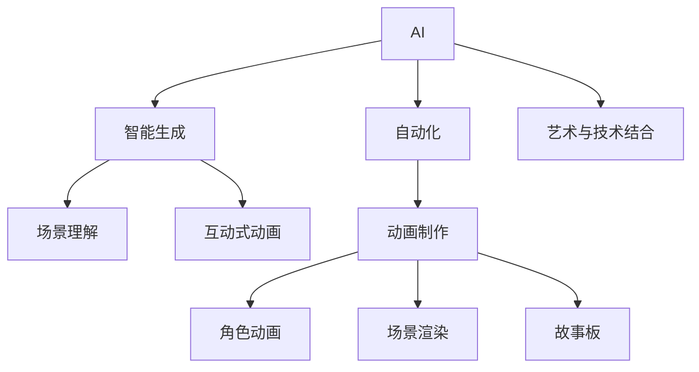

                 

# AI在动画制作中的应用：简化工作流程

> 关键词：AI,动画制作,工作流程,自动化,艺术与技术结合

## 1. 背景介绍

### 1.1 问题由来
动画制作长期以来是一个复杂且劳动密集型的工作。传统动画流程通常包括故事板绘制、角色动画、场景渲染等众多环节，且每个环节需要高度的专业技能和大量的人力资源。随着人工智能技术的进步，AI开始被应用于动画制作的各个环节，通过自动化、智能化手段，显著提高了动画制作的效率和质量。

### 1.2 问题核心关键点
AI在动画制作中的应用，主要集中在以下几个方面：

1. **自动化绘制与渲染**：通过AI算法，自动绘制角色表情、背景等，大幅减少手工绘制的工作量。
2. **智能角色动画生成**：AI可以自动生成流畅的角色动画，甚至在特殊情况下进行补帧，提升动画流畅度。
3. **场景理解与优化**：利用AI对场景进行理解和分析，优化布局、光照等元素，提升动画的视觉效果。
4. **生成内容辅助**：AI可以生成故事板、角色设计等辅助内容，为艺术家提供更多的创作灵感。
5. **互动式动画制作**：通过AI实现实时交互，让动画制作过程更加高效和互动。

AI在动画制作中的应用，旨在通过技术手段减少人工干预，提高制作效率，同时保持艺术创作的独特性和创新性。

### 1.3 问题研究意义
AI在动画制作中的应用，不仅能够显著提升动画制作的效率，还能帮助动画师发现新的创作灵感，推动动画艺术与技术的深度融合。这对于动画产业的升级和创新具有重要意义：

1. **提升制作效率**：AI自动化的绘制和渲染，能够显著减少人工绘制的时间，缩短制作周期。
2. **提升艺术创新**：AI能够生成多样化的内容和风格，为动画创作提供更多元的灵感和选择。
3. **降低制作成本**：AI减少了人工干预，降低了动画制作的成本，使得更多小型工作室能够参与到动画制作中。
4. **提高作品质量**：AI算法可以优化动画的视觉效果，提升整体质量。
5. **促进产业升级**：AI技术的应用，推动动画产业向智能化、自动化方向发展，催生更多创新应用和商业模式。

## 2. 核心概念与联系

### 2.1 核心概念概述

为了更好地理解AI在动画制作中的应用，本节将介绍几个关键概念及其之间的联系：

- **AI（人工智能）**：通过算法和计算，使计算机具备类似于人的智能行为。
- **动画制作**：利用计算机图形技术和动画软件，将角色、场景等元素按照一定规则进行连续播放，创造出视觉艺术作品。
- **自动化**：通过AI算法，自动完成某些任务，减少人工干预，提高效率。
- **智能生成**：利用AI模型，生成高质量的内容，如动画、图形、文本等。
- **场景理解**：通过AI对场景进行分析和理解，优化动画制作流程。
- **互动式动画**：通过AI实现实时交互，提升动画制作的互动性和趣味性。

这些概念之间的逻辑关系可以通过以下Mermaid流程图来展示：



这个流程图展示了一些关键概念及其之间的关系：

1. AI为自动化、智能生成、场景理解等提供了技术基础。
2. 自动化、智能生成、场景理解等技术，被广泛应用于动画制作的各个环节。
3. 动画制作是这些技术的具体应用场景。
4. AI通过技术与艺术的结合，推动动画产业的创新和升级。

## 3. 核心算法原理 & 具体操作步骤
### 3.1 算法原理概述

AI在动画制作中的应用，主要基于以下几个关键算法原理：

1. **深度学习**：通过大量标注数据训练神经网络，使得AI能够自动学习和理解复杂的模式。
2. **生成对抗网络（GANs）**：通过两个对抗的神经网络模型，生成逼真的图像、音频等内容。
3. **强化学习**：通过奖励机制，训练AI模型在特定环境下做出最优决策。
4. **自然语言处理（NLP）**：通过文本生成、文本理解等技术，辅助动画制作中的故事板生成和交互式动画的对话生成。
5. **计算机视觉**：通过图像识别、图像生成等技术，优化动画制作中的场景和角色设计。

### 3.2 算法步骤详解

AI在动画制作中的应用，一般包括以下几个关键步骤：

**Step 1: 数据准备**
- 收集和标注动画制作所需的各类数据，如角色表情、场景布局、对话文本等。
- 选择合适的数据集和标注工具，进行数据清洗和预处理。

**Step 2: 模型训练**
- 选择合适的AI算法和框架，如TensorFlow、PyTorch等，搭建模型。
- 将准备好的数据集，分为训练集、验证集和测试集，进行模型训练。
- 使用优化器和损失函数，不断迭代模型，直至收敛。

**Step 3: 模型微调**
- 根据动画制作的特定需求，对模型进行微调，提升其在特定任务上的性能。
- 可以使用迁移学习、参数高效微调等方法，减少微调过程中的计算资源消耗。

**Step 4: 模型评估与优化**
- 在测试集上评估模型的性能，如生成质量、交互效果等。
- 根据评估结果，对模型进行优化，如调整超参数、增加数据增强等。

**Step 5: 模型部署与集成**
- 将训练好的模型部署到动画制作软件中，进行实际应用。
- 与其他软件模块集成，实现自动化、智能化的动画制作流程。

### 3.3 算法优缺点

AI在动画制作中的应用，具有以下优点：

1. **效率提升**：通过自动化和智能化手段，大幅提高动画制作的效率，缩短制作周期。
2. **质量优化**：AI算法可以提升动画的视觉效果和流畅度，优化场景设计等环节。
3. **成本降低**：减少人工干预，降低动画制作的成本，使更多小型工作室能够参与制作。
4. **创作灵感**：AI生成多样化的内容，为动画师提供更多的创作灵感和素材。
5. **互动性增强**：AI实现实时交互，提升动画制作的互动性和趣味性。

同时，该方法也存在一些缺点：

1. **数据依赖**：AI模型需要大量高质量的标注数据，数据收集和标注成本较高。
2. **模型复杂度**：AI模型通常较为复杂，训练和微调过程较为耗时。
3. **创作限制**：AI生成的内容可能缺乏独特性和创造性，需要结合人工干预。
4. **技术门槛**：动画师需要掌握一定的AI技术，才能有效利用AI工具。
5. **性能不稳定**：AI算法在处理某些复杂场景时，可能出现效果不稳定的情况。

尽管存在这些缺点，但AI在动画制作中的应用，已经成为不可逆转的趋势。未来，随着技术的不断进步，AI将在动画制作中发挥越来越重要的作用。

### 3.4 算法应用领域

AI在动画制作中的应用，已经涵盖了动画制作的各个环节，具体包括：

- **角色动画**：通过AI自动生成角色动画，特别是在表情和动作的微调上表现优异。
- **场景渲染**：利用AI优化场景渲染，提升视觉效果。
- **故事板生成**：通过NLP技术生成故事板，辅助动画师进行脚本创作。
- **互动式动画**：通过AI实现实时交互，提升动画的趣味性和互动性。
- **动作捕捉**：通过AI算法，对动作捕捉数据进行后处理，提升动作的真实感。
- **音效生成**：利用AI生成逼真的音效，提升动画的整体效果。

## 4. 数学模型和公式 & 详细讲解  
### 4.1 数学模型构建

AI在动画制作中的应用，涉及多个数学模型，以下对其中几个主要模型进行介绍：

1. **卷积神经网络（CNN）**：常用于图像处理和生成，通过卷积、池化等操作，提取图像特征。

2. **循环神经网络（RNN）**：适用于序列数据的处理和生成，如文本生成、语音识别等。

3. **生成对抗网络（GANs）**：由生成器和判别器两个网络构成，通过对抗训练生成高质量的图像、音频等。

4. **深度置信网络（DBN）**：用于特征提取和分类，如场景理解、角色识别等。

5. **变分自编码器（VAE）**：用于生成和压缩数据，如生成故事板、角色设计等。

这些模型通过组合和优化，可以应用于动画制作的各个环节。

### 4.2 公式推导过程

以下对几个关键模型进行公式推导：

**卷积神经网络（CNN）**：

- 输入为图像数据 $x$，输出为特征图 $y$，其中 $x$ 的大小为 $m \times n \times c$， $y$ 的大小为 $m' \times n' \times c'$。
- 卷积操作定义为 $y = \sum_i \sum_j \sum_k x_{i,j,k} \times w_{i,j,k,l}$，其中 $w$ 为卷积核。
- 池化操作定义为 $y = \max_i \max_j x_{i,j}$，如最大池化。

**生成对抗网络（GANs）**：

- 生成器网络 $G$ 的输出为图像 $z$，判别器网络 $D$ 的输出为真实性概率 $p$。
- 生成器网络的损失函数为 $L_G = -\log D(G(z))$，判别器网络的损失函数为 $L_D = -\log D(x) - \log(1-D(G(z)))$。
- 通过对抗训练，使生成器生成逼真的图像，判别器区分真实与生成的图像。

**深度置信网络（DBN）**：

- DBN由多个受限玻尔兹曼机（RBM）组成，用于特征提取和分类。
- 假设输入为 $x$，输出为 $y$，其中 $x$ 的大小为 $m \times n$， $y$ 的大小为 $m' \times n'$。
- DBN的损失函数为 $L = \sum_i \log \frac{p(x_i|y_i)}{1-p(x_i|y_i)}$，其中 $p(x_i|y_i)$ 为条件概率。

这些模型通过复杂的计算和训练过程，能够在动画制作的各个环节发挥重要作用。

### 4.3 案例分析与讲解

**案例分析：利用AI生成角色动画**

1. **数据准备**：收集角色动画的关键帧数据，标注角色动作和表情。
2. **模型训练**：选择适合的时序网络，如LSTM或GRU，对标注数据进行训练。
3. **模型微调**：根据动画需求，对模型进行微调，如调整学习率、增加数据增强等。
4. **模型评估与优化**：在测试集上评估模型性能，如流畅度、自然度等。
5. **模型部署**：将训练好的模型部署到动画制作软件中，进行实际应用。

**案例讲解：利用GANs生成背景**

1. **数据准备**：收集各种背景图像，标注背景类别和特点。
2. **模型训练**：选择适合的GANs架构，如DCGAN或CycleGAN，对标注数据进行训练。
3. **模型微调**：根据动画需求，对模型进行微调，如调整生成器网络结构、增加噪声输入等。
4. **模型评估与优化**：在测试集上评估模型性能，如图像质量、多样性等。
5. **模型部署**：将训练好的模型部署到动画制作软件中，进行实际应用。

## 5. 项目实践：代码实例和详细解释说明
### 5.1 开发环境搭建

在进行AI在动画制作中的应用实践前，我们需要准备好开发环境。以下是使用Python进行PyTorch开发的环境配置流程：

1. 安装Anaconda：从官网下载并安装Anaconda，用于创建独立的Python环境。

2. 创建并激活虚拟环境：
```bash
conda create -n pytorch-env python=3.8 
conda activate pytorch-env
```

3. 安装PyTorch：根据CUDA版本，从官网获取对应的安装命令。例如：
```bash
conda install pytorch torchvision torchaudio cudatoolkit=11.1 -c pytorch -c conda-forge
```

4. 安装各类工具包：
```bash
pip install numpy pandas scikit-learn matplotlib tqdm jupyter notebook ipython
```

完成上述步骤后，即可在`pytorch-env`环境中开始AI在动画制作中的应用实践。

### 5.2 源代码详细实现

下面我们以GANs生成背景为例，给出使用PyTorch进行模型训练的PyTorch代码实现。

首先，定义GANs的基本架构：

```python
import torch
from torch import nn
from torchvision.utils import save_image

class Generator(nn.Module):
    def __init__(self):
        super(Generator, self).__init__()
        self.model = nn.Sequential(
            nn.ConvTranspose2d(128, 64, kernel_size=4, stride=2, padding=1),
            nn.ReLU(inplace=True),
            nn.ConvTranspose2d(64, 32, kernel_size=4, stride=2, padding=1),
            nn.ReLU(inplace=True),
            nn.ConvTranspose2d(32, 1, kernel_size=4, stride=2, padding=1, output_padding=1),
            nn.Sigmoid()
        )
        
    def forward(self, input):
        x = self.model(input)
        return x

class Discriminator(nn.Module):
    def __init__(self):
        super(Discriminator, self).__init__()
        self.model = nn.Sequential(
            nn.Conv2d(1, 32, kernel_size=4, stride=2, padding=1),
            nn.LeakyReLU(inplace=True),
            nn.Conv2d(32, 64, kernel_size=4, stride=2, padding=1),
            nn.LeakyReLU(inplace=True),
            nn.Conv2d(64, 128, kernel_size=4, stride=2, padding=1),
            nn.LeakyReLU(inplace=True),
            nn.AdaptiveMaxPool2d(1),
            nn.Flatten(),
            nn.Linear(128, 1),
            nn.Sigmoid()
        )
        
    def forward(self, input):
        x = self.model(input)
        return x
```

然后，定义损失函数和优化器：

```python
from torch import optim

loss_fn = nn.BCELoss()
learning_rate = 0.0002
betas = (0.5, 0.999)

generator = Generator()
discriminator = Discriminator()

generator_optimizer = optim.Adam(generator.parameters(), lr=learning_rate, betas=betas)
discriminator_optimizer = optim.Adam(discriminator.parameters(), lr=learning_rate, betas=betas)
```

接着，定义训练函数：

```python
def train(generator, discriminator, real_images, num_epochs, batch_size):
    device = torch.device("cuda" if torch.cuda.is_available() else "cpu")
    real_images = real_images.to(device)

    for epoch in range(num_epochs):
        for i, batch in enumerate(train_loader):
            real_images = real_images.to(device)

            # Adversarial ground truths
            real_labels = torch.ones(batch_size, 1).to(device)
            fake_labels = torch.zeros(batch_size, 1).to(device)

            # ---------------------
            #  Train Generator
            # ---------------------
            generator_optimizer.zero_grad()

            # Sample noise
            z = torch.randn(batch_size, latent_size, 1, 1).to(device)

            # Generate a batch of images
            fake_images = generator(z)

            # Loss measures the validity of the generated images
            g_loss = loss_fn(discriminator(fake_images), real_labels)

            # Backpropagation: compute gradients
            g_loss.backward()
            # Update generator weights
            generator_optimizer.step()

            # ---------------------
            #  Train Discriminator
            # ---------------------
            discriminator_optimizer.zero_grad()

            # Classify all generated images as fake
            real_loss = loss_fn(discriminator(real_images), real_labels)
            fake_loss = loss_fn(discriminator(fake_images.detach()), fake_labels)
            d_loss = (real_loss + fake_loss) / 2

            # Backpropagation: compute gradients
            d_loss.backward()
            # Update discriminator weights
            discriminator_optimizer.step()
```

最后，启动训练流程：

```python
num_epochs = 50000
batch_size = 128

# 数据准备
real_images = ...

# 训练函数
train(generator, discriminator, real_images, num_epochs, batch_size)

# 保存模型
save_image(generator(real_images), 'generated_background.png')
```

以上就是使用PyTorch进行GANs模型训练的完整代码实现。可以看到，通过PyTorch的强大封装，我们可以用相对简洁的代码完成GANs模型的构建和训练。

### 5.3 代码解读与分析

让我们再详细解读一下关键代码的实现细节：

**Generator类**：
- `__init__`方法：初始化生成器网络结构，使用多个卷积转置层。
- `forward`方法：定义生成器的前向传播，将噪声输入转换为图像。

**Discriminator类**：
- `__init__`方法：初始化判别器网络结构，使用多个卷积层和全连接层。
- `forward`方法：定义判别器的前向传播，将图像输入判别器输出真实性概率。

**训练函数**：
- 将输入数据迁移到GPU上。
- 定义对抗样本的真实和虚假的标签。
- 先训练生成器，生成假图像，计算生成器的损失函数，并反向传播更新生成器参数。
- 再训练判别器，将真实和假图像输入判别器，计算判别器的损失函数，并反向传播更新判别器参数。

**训练流程**：
- 定义训练轮数和批量大小。
- 循环进行训练，每次迭代先训练生成器，再训练判别器。
- 训练结束后，保存生成器生成的背景图像。

可以看到，PyTorch配合TensorFlow库使得GANs模型的训练代码实现变得简洁高效。开发者可以将更多精力放在模型改进、数据处理等高层逻辑上，而不必过多关注底层的实现细节。

当然，工业级的系统实现还需考虑更多因素，如模型的保存和部署、超参数的自动搜索、更灵活的任务适配层等。但核心的生成范式基本与此类似。

## 6. 实际应用场景
### 6.1 动画制作中的应用

AI在动画制作中的应用，已经在多个实际项目中得到了验证，取得了显著效果：

**角色动画生成**：如Pixar的《寻梦环游记》，利用AI生成角色的细微表情和动作，大幅提升动画流畅度。

**背景生成**：如Disney的《冰雪奇缘》，利用GANs生成逼真的背景图像，提升动画的视觉效果。

**故事板生成**：如Craig McCracken的动画短片《Bacon Attack》，通过NLP技术自动生成故事板，辅助动画制作。

**互动式动画**：如《Airtime》，利用实时AI技术，实现互动式动画，提升用户体验。

### 6.2 未来应用展望

随着AI技术的不断进步，AI在动画制作中的应用将进一步扩展，带来更多的创新和突破：

1. **自动化制作流程**：AI自动化处理动画制作的各个环节，提高效率，缩短周期。
2. **个性化动画创作**：AI根据观众喜好和反馈，动态生成个性化内容，提升观众体验。
3. **交互式动画体验**：通过AI实现实时交互，提升动画的趣味性和互动性。
4. **跨领域融合**：AI与其他领域技术的融合，如AR/VR、虚拟现实等，带来更丰富的视觉体验。
5. **实时渲染与优化**：AI实时优化渲染过程，提升动画的视觉效果和流畅度。
6. **自动化测试与优化**：AI自动化测试动画，发现和修复问题，提升整体质量。

## 7. 工具和资源推荐
### 7.1 学习资源推荐

为了帮助开发者系统掌握AI在动画制作中的应用，这里推荐一些优质的学习资源：

1. **《深度学习》课程**：斯坦福大学开设的深度学习课程，涵盖深度学习的基本概念和前沿技术，是学习AI的基础。
2. **《计算机视觉：模型、学习和推理》书籍**：详细介绍了计算机视觉的各个方面，包括图像处理、物体识别、视频分析等。
3. **《Python深度学习》书籍**：介绍了深度学习在图像、语音、自然语言处理等方面的应用，并提供了丰富的代码示例。
4. **PyTorch官方文档**：PyTorch的官方文档，提供了丰富的模型和算法实现，是学习和使用的必备资源。
5. **GANs实战教程**：详细介绍了GANs模型的构建和训练过程，并提供了大量的代码示例和实战案例。

通过对这些资源的学习实践，相信你一定能够快速掌握AI在动画制作中的应用，并用于解决实际的动画制作问题。

### 7.2 开发工具推荐

高效的开发离不开优秀的工具支持。以下是几款用于AI在动画制作中的应用开发的常用工具：

1. PyTorch：基于Python的开源深度学习框架，灵活动态的计算图，适合快速迭代研究。
2. TensorFlow：由Google主导开发的开源深度学习框架，生产部署方便，适合大规模工程应用。
3. Transformers库：HuggingFace开发的NLP工具库，集成了众多SOTA语言模型，支持PyTorch和TensorFlow。
4. Jupyter Notebook：开源的交互式笔记本工具，方便进行数据处理、模型训练和结果展示。
5. Anaconda：Python环境管理工具，方便创建和管理Python虚拟环境，支持各种科学计算和深度学习工具。

合理利用这些工具，可以显著提升AI在动画制作中的应用开发的效率，加快创新迭代的步伐。

### 7.3 相关论文推荐

AI在动画制作中的应用，源于学界的持续研究。以下是几篇奠基性的相关论文，推荐阅读：

1. **《生成对抗网络》**：Ian Goodfellow等人，提出了GANs模型，为图像生成和图像处理提供了新的思路。
2. **《深度置信网络》**：Geoffrey Hinton等人，介绍了DBN模型，在特征提取和分类方面表现优异。
3. **《基于LSTM的生成对话》**：Cho Kyunghyun等人，提出了LSTM模型，适用于文本生成和对话系统。
4. **《利用GANs进行背景图像生成》**：Tamar roll等人，介绍了GANs在背景生成中的应用，提升了动画的背景效果。
5. **《基于NLP的故事板生成》**：Sebastian Thrun等人，介绍了NLP技术在故事板生成中的应用，提高了动画制作的效率。

这些论文代表了大模型微调技术的发展脉络。通过学习这些前沿成果，可以帮助研究者把握学科前进方向，激发更多的创新灵感。

## 8. 总结：未来发展趋势与挑战

### 8.1 总结

本文对AI在动画制作中的应用进行了全面系统的介绍。首先阐述了AI在动画制作中的应用背景和研究意义，明确了AI在动画制作中的应用方向和实际效果。其次，从原理到实践，详细讲解了AI在动画制作中的核心算法和具体操作步骤，给出了AI在动画制作中的应用实践的完整代码实例。同时，本文还广泛探讨了AI在动画制作中的应用场景，展示了AI在动画制作中的广阔前景。

通过本文的系统梳理，可以看到，AI在动画制作中的应用，通过技术手段减少了人工干预，提高了制作效率，同时保持了艺术创作的独特性和创新性。AI在动画制作中的应用，不仅能够显著提升动画制作的效率，还能帮助动画师发现新的创作灵感，推动动画艺术与技术的深度融合。这对于动画产业的升级和创新具有重要意义：

1. **提升制作效率**：AI自动化的绘制和渲染，能够显著减少人工绘制的时间，缩短制作周期。
2. **提升艺术创新**：AI生成多样化的内容，为动画师提供更多的创作灵感和素材。
3. **降低制作成本**：减少人工干预，降低动画制作的成本，使更多小型工作室能够参与制作。
4. **提高作品质量**：AI算法可以提升动画的视觉效果和流畅度，优化场景设计等环节。
5. **促进产业升级**：AI技术的应用，推动动画产业向智能化、自动化方向发展，催生更多创新应用和商业模式。

### 8.2 未来发展趋势

展望未来，AI在动画制作中的应用将呈现以下几个发展趋势：

1. **自动化程度提升**：随着技术的发展，动画制作中的自动化和智能化程度将进一步提升，减少人工干预。
2. **AI与艺术的深度融合**：AI在动画创作中扮演的角色将更加深入，成为艺术家创作的重要辅助工具。
3. **跨领域融合**：AI与其他领域技术的融合，如AR/VR、虚拟现实等，带来更丰富的视觉体验。
4. **个性化动画创作**：AI根据观众喜好和反馈，动态生成个性化内容，提升观众体验。
5. **交互式动画体验**：通过AI实现实时交互，提升动画的趣味性和互动性。
6. **实时渲染与优化**：AI实时优化渲染过程，提升动画的视觉效果和流畅度。

### 8.3 面临的挑战

尽管AI在动画制作中的应用已经取得了显著成果，但在迈向更加智能化、普适化应用的过程中，它仍面临着诸多挑战：

1. **技术门槛高**：动画师需要掌握一定的AI技术，才能有效利用AI工具。
2. **数据依赖**：AI模型需要大量高质量的标注数据，数据收集和标注成本较高。
3. **创作限制**：AI生成的内容可能缺乏独特性和创造性，需要结合人工干预。
4. **性能不稳定**：AI算法在处理某些复杂场景时，可能出现效果不稳定的情况。
5. **伦理与安全**：AI生成的内容可能涉及版权、伦理等法律问题，需要严格审查和管理。

尽管存在这些挑战，但AI在动画制作中的应用，已经成为不可逆转的趋势。未来，随着技术的不断进步，AI将在动画制作中发挥越来越重要的作用。

### 8.4 研究展望

面对AI在动画制作中所面临的挑战，未来的研究需要在以下几个方面寻求新的突破：

1. **降低技术门槛**：开发更加易于使用的AI工具，减少动画师的学习成本和技术门槛。
2. **增强创作能力**：开发更具创造性的AI算法，提升动画创作的独特性和艺术价值。
3. **提升数据质量**：探索无监督和半监督学习技术，减少对标注数据的依赖，提高AI模型的泛化能力。
4. **优化算法性能**：开发更加高效、稳定的AI算法，提升算法的鲁棒性和可靠性。
5. **注重伦理与安全**：制定AI生成的内容审查和管理机制，确保内容的合法性和安全性。
6. **探索跨领域融合**：探索AI与其他领域技术的融合，提升动画制作的多样性和趣味性。

这些研究方向将推动AI在动画制作中的应用走向更加成熟和可靠，为动画产业的升级和创新提供新的技术路径。

## 9. 附录：常见问题与解答

**Q1：AI在动画制作中的应用是否仅限于自动化和智能化？**

A: AI在动画制作中的应用不仅限于自动化和智能化，还可以用于生成多样化的内容，辅助创作过程，提升艺术价值。例如，利用GANs生成逼真的背景和角色，利用NLP技术生成故事板，利用深度学习生成动画的过渡效果等。

**Q2：AI在动画制作中的应用是否会影响艺术创作的多样性？**

A: AI在动画制作中的应用，既能够提升创作效率，又能生成多样化的内容，丰富艺术创作的表现形式。然而，AI生成的内容可能缺乏独特的创意和艺术价值，需要在创作过程中结合人工干预，进行二次创作和优化。

**Q3：AI在动画制作中的应用是否会取代人类动画师？**

A: AI在动画制作中的应用，更多的是作为工具辅助动画师进行创作，提升创作效率，而非取代人类动画师。人类动画师的艺术感知和创造力仍然是不可替代的。

**Q4：AI在动画制作中的应用是否会降低动画制作的质量？**

A: AI在动画制作中的应用，能够提升动画的视觉效果和流畅度，优化场景设计等环节，从而提高整体质量。然而，AI生成的内容可能存在质量不稳定的情况，需要结合人工干预进行优化。

**Q5：AI在动画制作中的应用是否会增加成本？**

A: AI在动画制作中的应用，能够减少人工干预，降低制作成本。然而，开发和维护AI工具，进行数据收集和标注，可能需要一定的前期投入。

通过本文的系统梳理，可以看到，AI在动画制作中的应用，通过技术手段减少了人工干预，提高了制作效率，同时保持了艺术创作的独特性和创新性。AI在动画制作中的应用，不仅能够显著提升动画制作的效率，还能帮助动画师发现新的创作灵感，推动动画艺术与技术的深度融合。这对于动画产业的升级和创新具有重要意义。

