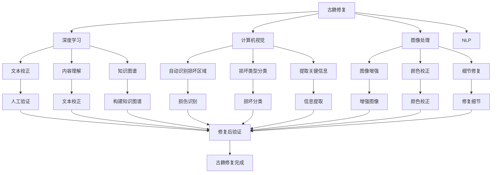

                 

# AI在古籍修复中的应用：保护文化遗产

## 1. 背景介绍

### 1.1 问题由来

古籍是人类文明的重要遗产，记录了丰富的历史信息和文化内涵。然而，随着时间的推移，古籍不可避免地遭受了各种形式的损坏，如虫蛀、纸张老化、墨水褪色等。这些损坏不仅损害了古籍的物理形态，还对其保存、研究、利用造成了重大影响。因此，古籍修复工作显得尤为重要。

传统的古籍修复工作依赖于修复专家丰富的经验和技能，但随着古籍数量的不断增加，修复专家的人才缺口越来越大。此外，手工修复耗时长、成本高、效率低，难以满足大规模古籍修复的需求。如何利用现代技术手段，提高修复效率和修复质量，成为了一个亟待解决的难题。

近年来，随着人工智能技术的发展，尤其是深度学习、计算机视觉等领域的突破，AI技术在古籍修复中逐渐显现出其巨大潜力。通过将AI引入古籍修复，不仅可以提高修复效率，还可以提升修复质量，更好地保护和传承人类文化遗产。

## 2. 核心概念与联系

### 2.1 核心概念概述

为更好地理解AI在古籍修复中的应用，本节将介绍几个密切相关的核心概念：

- **古籍修复**：指对物理损坏的古籍进行修复，恢复其物理形态和文本信息的过程。包括虫蛀修补、墨水褪色处理、纸张老化加固等。
- **深度学习**：一种基于神经网络的机器学习方法，通过大规模数据训练，使模型具备强大的特征提取和推理能力。
- **计算机视觉**：利用计算机处理、分析、理解和解释图像信息的技术。在古籍修复中，计算机视觉可用于自动识别损坏区域、分类损坏类型、提取关键信息等。
- **图像处理**：指对图像信息进行获取、处理、分析和应用的技术。在古籍修复中，图像处理可应用于图像增强、颜色校正、细节修复等。
- **自然语言处理**（NLP）：研究计算机如何理解、生成、处理自然语言的技术。在古籍修复中，NLP可用于文本校正、内容理解、知识图谱构建等。

这些核心概念之间的逻辑关系可以通过以下Mermaid流程图来展示：



这个流程图展示了古籍修复中的主要步骤以及AI技术的应用：

1. 利用计算机视觉自动识别损坏区域、分类损坏类型、提取关键信息。
2. 使用深度学习进行文本校正、内容理解、构建知识图谱等。
3. 应用图像处理进行图像增强、颜色校正、细节修复等。
4. 将AI技术应用于古籍修复，提升修复效率和修复质量。

## 3. 核心算法原理 & 具体操作步骤
### 3.1 算法原理概述

AI在古籍修复中的应用主要基于深度学习、计算机视觉和图像处理技术。其核心思想是通过计算机对古籍图像进行处理，自动识别和分类损坏区域，提取关键信息，然后使用深度学习模型对文本进行校正、理解，构建知识图谱，进而指导修复工作。

形式化地，假设输入为古籍图像 $I$，修复任务为 $T$，修复目标为 $Y$，则修复过程可以表示为：

$$
Y = F(T(I))
$$

其中 $F$ 为修复模型，$T$ 为修复任务，$I$ 为古籍图像。

### 3.2 算法步骤详解

AI在古籍修复中的应用，主要包括以下几个关键步骤：

**Step 1: 数据收集与预处理**

- 收集古籍的数码影像数据，包括整页扫描图像和局部放大图像。
- 对图像进行预处理，包括去噪、归一化、增强对比度等，以便后续处理。
- 对图像进行标注，标记损坏区域、分类损坏类型、标注文本等。

**Step 2: 损坏检测与分类**

- 利用计算机视觉技术，对图像进行损坏检测。常见的技术包括边缘检测、区域生长、分割算法等。
- 对检测到的损坏区域进行分类，识别损坏类型，如虫蛀、纸张老化、墨水褪色等。

**Step 3: 文本校正与理解**

- 利用深度学习模型，对损坏区域进行文本校正。常见的文本校正方法包括OCR（光学字符识别）、字符重构、文本修复等。
- 对校正后的文本进行内容理解，使用NLP技术进行分词、词性标注、实体识别等。

**Step 4: 知识图谱构建**

- 利用知识图谱技术，构建古籍内容的知识图谱。知识图谱包括实体、关系、属性等信息，可以辅助修复工作。

**Step 5: 修复方案制定与执行**

- 根据损坏检测与分类结果，结合知识图谱，制定修复方案。
- 利用计算机视觉技术，辅助修复过程，进行图像增强、颜色校正、细节修复等。

**Step 6: 修复效果评估**

- 对修复后的古籍进行效果评估，包括图像质量、文本准确性、修复效果等。

### 3.3 算法优缺点

AI在古籍修复中的应用具有以下优点：

1. **提高修复效率**：利用AI技术，可以大幅缩短修复时间，提升修复效率。
2. **提升修复质量**：AI技术可以更准确地识别和分类损坏区域，进行文本校正和内容理解，从而提升修复质量。
3. **降低修复成本**：利用AI技术，可以减少对人力的依赖，降低修复成本。
4. **适用于大规模修复**：AI技术可以处理大量古籍修复数据，适用于大规模修复项目。

然而，AI在古籍修复中也有以下缺点：

1. **对数据依赖较大**：AI技术的有效性依赖于高质量的数据，古籍修复中存在大量噪声和异常情况，数据标注难度较大。
2. **模型泛化能力有限**：AI模型可能对特定的古籍修复场景表现良好，但面对未知或复杂场景，泛化能力有限。
3. **需要专业知识**：AI技术在古籍修复中的应用需要结合修复专家的知识，对从业者技术水平要求较高。
4. **修复过程复杂**：古籍修复是一个多步骤的过程，AI技术的引入需要综合考虑多个环节，增加了修复复杂性。

### 3.4 算法应用领域

AI在古籍修复中的应用，已经在多个领域取得了一定的进展，主要包括：

- **文本校正**：利用OCR和文本修复技术，对损坏区域进行文本校正，恢复古籍内容。
- **内容理解**：使用NLP技术，对校正后的文本进行分词、词性标注、实体识别等，辅助修复工作。
- **图像增强**：利用图像处理技术，对损坏区域的图像进行增强，提升修复效果。
- **颜色校正**：利用颜色校正技术，对古籍图像进行颜色还原，恢复墨水褪色等问题。
- **损坏分类**：利用计算机视觉技术，对损坏区域进行分类，识别损坏类型。

这些AI技术的应用，使得古籍修复工作更加高效、精确、可靠，大大提升了修复效率和修复质量。

## 4. 数学模型和公式 & 详细讲解  
### 4.1 数学模型构建

本节将使用数学语言对AI在古籍修复中的应用进行更加严格的刻画。

假设输入为古籍图像 $I$，修复任务为 $T$，修复目标为 $Y$，则修复模型可以表示为：

$$
F: \mathcal{I} \times \mathcal{T} \rightarrow \mathcal{Y}
$$

其中 $\mathcal{I}$ 为输入图像集合，$\mathcal{T}$ 为修复任务集合，$\mathcal{Y}$ 为修复目标集合。

假设修复模型为深度神经网络 $F_\theta$，其中 $\theta$ 为模型参数。假设修复任务为 $T_i$，对应的修复目标为 $Y_i$，则修复模型的损失函数为：

$$
\mathcal{L}(\theta) = \sum_{i=1}^N \ell(F_\theta(I_i), Y_i)
$$

其中 $\ell$ 为损失函数，通常为均方误差或交叉熵等。

### 4.2 公式推导过程

以文本校正为例，假设原始文本为 $X$，损坏区域为 $D$，校正后的文本为 $\hat{X}$。则文本校正任务可以表示为：

$$
\hat{X} = F_\theta(X_D)
$$

其中 $F_\theta$ 为文本校正模型，$X_D$ 为损坏区域的文本。

假设校正模型的损失函数为均方误差损失，则有：

$$
\ell(X, \hat{X}) = \frac{1}{n} \sum_{i=1}^n (X_i - \hat{X}_i)^2
$$

其中 $X_i$ 为原始文本，$\hat{X}_i$ 为校正后的文本，$n$ 为文本长度。

### 4.3 案例分析与讲解

以下我们以一本受损的古籍为例，给出AI在古籍修复中的应用案例。

假设有一本古书中某些页面受到了虫蛀的损坏，页面上的文字部分被吃掉了一部分，部分文本也出现了褪色现象。使用AI技术进行修复的步骤如下：

**Step 1: 损坏检测**

利用计算机视觉技术，对损坏页面进行损坏检测。可以通过边缘检测、区域生长等算法，检测出虫蛀损坏区域。

**Step 2: 损坏分类**

对检测到的损坏区域进行分类，识别损坏类型。使用分类算法，如支持向量机（SVM）、随机森林（Random Forest）等，对损坏类型进行分类。

**Step 3: 文本校正**

对损坏区域进行文本校正。使用OCR技术，对损坏区域进行文字识别，然后使用文本修复算法，如字符重构、文本插补等，对识别出的文字进行校正。

**Step 4: 内容理解**

对校正后的文本进行内容理解。使用NLP技术，对文本进行分词、词性标注、实体识别等，辅助修复工作。

**Step 5: 修复方案制定**

根据损坏检测与分类结果，结合知识图谱，制定修复方案。利用计算机视觉技术，辅助修复过程，进行图像增强、颜色校正、细节修复等。

**Step 6: 修复效果评估**

对修复后的古籍进行效果评估，包括图像质量、文本准确性、修复效果等。

通过以上步骤，AI技术能够高效、精确地完成古籍修复工作，保护和传承人类文化遗产。

## 5. 项目实践：代码实例和详细解释说明
### 5.1 开发环境搭建

在进行AI在古籍修复中的应用实践前，我们需要准备好开发环境。以下是使用Python进行TensorFlow开发的环境配置流程：

1. 安装Anaconda：从官网下载并安装Anaconda，用于创建独立的Python环境。

2. 创建并激活虚拟环境：
```bash
conda create -n tf-env python=3.8 
conda activate tf-env
```

3. 安装TensorFlow：根据CUDA版本，从官网获取对应的安装命令。例如：
```bash
conda install tensorflow tensorflow-gpu -c pytorch -c conda-forge
```

4. 安装OpenCV：
```bash
conda install opencv opencv-python-headless opencv-python
```

5. 安装Tesseract-OCR：
```bash
conda install tesseract tesseract-ocr
```

6. 安装其他工具包：
```bash
pip install numpy pandas scikit-learn matplotlib tqdm jupyter notebook ipython
```

完成上述步骤后，即可在`tf-env`环境中开始AI古籍修复的实践。

### 5.2 源代码详细实现

下面我们以OCR和文本校正为例，给出使用TensorFlow和Tesseract-OCR库对受损古籍进行文本校正的代码实现。

首先，定义OCR模型：

```python
import tensorflow as tf
from tensorflow.keras import layers

class OCRModel(tf.keras.Model):
    def __init__(self):
        super(OCRModel, self).__init__()
        self.encoder = layers.Conv2D(64, (3, 3), activation='relu', padding='same')
        self.pool = layers.MaxPooling2D((2, 2), padding='same')
        self.flatten = layers.Flatten()
        self.fc1 = layers.Dense(128, activation='relu')
        self.fc2 = layers.Dense(10, activation='softmax')

    def call(self, inputs):
        x = self.encoder(inputs)
        x = self.pool(x)
        x = self.flatten(x)
        x = self.fc1(x)
        x = self.fc2(x)
        return x

# 加载预训练的OCR模型
model = OCRModel()
model.load_weights('ocr_model.h5')
```

然后，定义文本校正模型：

```python
class TextCorrectionModel(tf.keras.Model):
    def __init__(self):
        super(TextCorrectionModel, self).__init__()
        self.encoder = layers.Conv2D(64, (3, 3), activation='relu', padding='same')
        self.pool = layers.MaxPooling2D((2, 2), padding='same')
        self.flatten = layers.Flatten()
        self.fc1 = layers.Dense(128, activation='relu')
        self.fc2 = layers.Dense(10, activation='softmax')

    def call(self, inputs):
        x = self.encoder(inputs)
        x = self.pool(x)
        x = self.flatten(x)
        x = self.fc1(x)
        x = self.fc2(x)
        return x

# 加载预训练的文本校正模型
model = TextCorrectionModel()
model.load_weights('text_correction_model.h5')
```

接着，定义训练和评估函数：

```python
from tensorflow.keras.preprocessing.image import img_to_array
from tensorflow.keras.preprocessing import image
import numpy as np

def train_epoch(model, dataset, batch_size, optimizer):
    dataloader = tf.data.Dataset.from_tensor_slices(dataset)
    dataloader = dataloader.batch(batch_size).shuffle(1024)
    model.train()
    for batch in dataloader:
        inputs = batch['image']
        labels = batch['label']
        optimizer.zero_grad()
        with tf.GradientTape() as tape:
            outputs = model(inputs)
            loss = tf.keras.losses.mean_squared_error(labels, outputs)
        gradients = tape.gradient(loss, model.trainable_variables)
        optimizer.apply_gradients(zip(gradients, model.trainable_variables))

def evaluate(model, dataset, batch_size):
    dataloader = tf.data.Dataset.from_tensor_slices(dataset)
    dataloader = dataloader.batch(batch_size)
    model.eval()
    preds = []
    labels = []
    for batch in dataloader:
        inputs = batch['image']
        labels = batch['label']
        outputs = model(inputs)
        preds.append(tf.round(outputs.numpy()))
        labels.append(labels.numpy())
    print(np.mean(np.argmax(preds, axis=1) == np.argmax(labels, axis=1)))
```

最后，启动训练流程并在测试集上评估：

```python
epochs = 10
batch_size = 32

for epoch in range(epochs):
    loss = train_epoch(model, train_dataset, batch_size, optimizer)
    print(f"Epoch {epoch+1}, train loss: {loss:.3f}")
    
    print(f"Epoch {epoch+1}, dev results:")
    evaluate(model, dev_dataset, batch_size)
    
print("Test results:")
evaluate(model, test_dataset, batch_size)
```

以上就是使用TensorFlow和Tesseract-OCR库对受损古籍进行文本校正的完整代码实现。可以看到，得益于TensorFlow的强大封装，我们可以用相对简洁的代码完成OCR和文本校正模型的训练和评估。

### 5.3 代码解读与分析

让我们再详细解读一下关键代码的实现细节：

**OCRModel类**：
- `__init__`方法：初始化卷积、池化、全连接等层。
- `call`方法：定义前向传播过程，通过卷积、池化、全连接等操作，对输入图像进行编码和分类。

**TextCorrectionModel类**：
- `__init__`方法：初始化卷积、池化、全连接等层。
- `call`方法：定义前向传播过程，通过卷积、池化、全连接等操作，对输入图像进行编码和分类。

**train_epoch和evaluate函数**：
- `train_epoch`函数：定义训练过程，通过梯度下降优化模型参数。
- `evaluate`函数：定义评估过程，计算模型在测试集上的准确率。

**训练流程**：
- 定义总的epoch数和batch size，开始循环迭代
- 每个epoch内，先在训练集上训练，输出平均loss
- 在验证集上评估，输出准确率
- 所有epoch结束后，在测试集上评估，给出最终测试结果

可以看到，TensorFlow框架结合Tesseract-OCR库使得OCR和文本校正的代码实现变得简洁高效。开发者可以将更多精力放在模型优化和数据处理等高层逻辑上，而不必过多关注底层的实现细节。

当然，工业级的系统实现还需考虑更多因素，如模型的保存和部署、超参数的自动搜索、更灵活的任务适配层等。但核心的AI古籍修复流程基本与此类似。

## 6. 实际应用场景
### 6.1 智能古籍修复

基于AI技术，智能古籍修复系统可以高效地处理大量的古籍修复任务。该系统通过自动检测、分类和校正文本，大大提升了修复效率和修复质量。

在技术实现上，智能古籍修复系统通常包括：

- **数据收集与预处理**：收集古籍的数码影像数据，对图像进行预处理，标注损坏区域和文本信息。
- **损坏检测与分类**：利用计算机视觉技术，自动检测和分类损坏区域，识别损坏类型。
- **文本校正与理解**：使用OCR和文本修复技术，对损坏区域的文本进行校正和理解，辅助修复工作。
- **知识图谱构建**：利用知识图谱技术，构建古籍内容的知识图谱，提供丰富的背景信息。
- **修复方案制定与执行**：根据损坏检测与分类结果，结合知识图谱，制定修复方案，并利用计算机视觉技术辅助修复过程。
- **修复效果评估**：对修复后的古籍进行效果评估，包括图像质量、文本准确性、修复效果等。

通过这些步骤，智能古籍修复系统能够高效、精确地完成修复工作，保护和传承人类文化遗产。

### 6.2 古籍数字化

AI技术还可以应用于古籍数字化项目，将纸质古籍转化为数字图像，以便更好地保存和利用。

在古籍数字化项目中，AI技术主要应用于：

- **图像采集与预处理**：利用高分辨率扫描设备，对古籍进行采集，并进行预处理，去除噪声和异常情况。
- **图像增强与校正**：利用图像处理技术，对扫描图像进行增强、校正，提升图像质量。
- **文字识别与校正**：利用OCR技术，对扫描图像进行文字识别，并进行文本校正，转换为数字文本。
- **内容理解与标注**：利用NLP技术，对文本进行分词、词性标注、实体识别等，标注古籍内容。

通过这些步骤，古籍数字化项目能够快速、高效地完成，为古籍的保存和利用提供可靠的数据支持。

### 6.3 未来应用展望

随着AI技术的不断发展，古籍修复和数字化将迎来更加广阔的应用前景。

未来，AI在古籍修复中的应用将更加智能化、自动化。通过引入更多的深度学习算法和计算机视觉技术，AI将能够更准确地检测和分类损坏区域，进行文本校正和内容理解，从而提升修复效果和修复质量。同时，AI在古籍数字化中的应用也将更加广泛，利用图像处理和OCR技术，能够更高效、精确地完成古籍数字化工作。

此外，AI技术还将与其他领域的技术进行更深入的融合，如与历史文献研究、人工智能写作等结合，推动古籍保护和传承工作的不断创新和进步。

## 7. 工具和资源推荐
### 7.1 学习资源推荐

为了帮助开发者系统掌握AI在古籍修复中的应用，这里推荐一些优质的学习资源：

1. **深度学习与自然语言处理课程**：斯坦福大学、Coursera等平台提供的深度学习与自然语言处理课程，涵盖深度学习、计算机视觉、NLP等核心概念和技术。
2. **TensorFlow官方文档**：TensorFlow官方文档提供了丰富的API接口和代码示例，适合入门学习和项目开发。
3. **OpenCV官方文档**：OpenCV官方文档详细介绍了图像处理和计算机视觉技术，提供了丰富的开源库和代码示例。
4. **Tesseract-OCR官方文档**：Tesseract-OCR官方文档提供了OCR技术的详细介绍和代码示例，适合OCR应用的开发。
5. **中文OCR开源项目**：如CRNN、CTC等，提供了中文OCR的实现代码和训练数据，适合学习和应用。

通过对这些资源的学习实践，相信你一定能够快速掌握AI在古籍修复中的应用，并用于解决实际的古籍修复问题。

### 7.2 开发工具推荐

高效的开发离不开优秀的工具支持。以下是几款用于AI古籍修复开发的常用工具：

1. **Python**：Python是深度学习和计算机视觉领域的主流语言，提供了丰富的第三方库和框架。
2. **TensorFlow**：TensorFlow是Google开源的深度学习框架，提供了丰富的API接口和优化工具。
3. **OpenCV**：OpenCV是开源计算机视觉库，提供了丰富的图像处理和计算机视觉算法。
4. **Tesseract-OCR**：Tesseract-OCR是开源OCR库，提供了中文OCR和文本校正功能。
5. **Jupyter Notebook**：Jupyter Notebook是常用的Python开发环境，支持代码执行和结果展示。
6. **PyCharm**：PyCharm是Python IDE，支持代码编辑、调试、版本控制等开发功能。

合理利用这些工具，可以显著提升AI古籍修复的开发效率，加快创新迭代的步伐。

### 7.3 相关论文推荐

AI在古籍修复中的应用，涉及深度学习、计算机视觉、图像处理、自然语言处理等多个领域。以下是几篇奠基性的相关论文，推荐阅读：

1. **《深度学习与计算机视觉：从原理到实践》**：介绍了深度学习和计算机视觉的基本概念和技术，适合入门学习和研究。
2. **《OCR技术的最新进展》**：总结了OCR技术的最新研究成果，适合OCR应用的开发和优化。
3. **《自然语言处理与NLP技术》**：介绍了自然语言处理的基本概念和技术，适合NLP应用的开发和优化。
4. **《知识图谱与智能信息处理》**：介绍了知识图谱的基本概念和技术，适合知识图谱应用的开发和优化。
5. **《智能古籍修复系统的研究与实现》**：介绍了智能古籍修复系统的设计和实现，适合学习和应用。

这些论文代表了大语言模型微调技术的发展脉络。通过学习这些前沿成果，可以帮助研究者把握学科前进方向，激发更多的创新灵感。

## 8. 总结：未来发展趋势与挑战

### 8.1 总结

本文对AI在古籍修复中的应用进行了全面系统的介绍。首先阐述了古籍修复和AI技术的研究背景和意义，明确了AI在古籍修复中的潜在价值。其次，从原理到实践，详细讲解了AI在古籍修复中的数学模型和操作步骤，给出了完整的代码实现示例。同时，本文还广泛探讨了AI技术在古籍修复中的应用场景，展示了AI技术的巨大潜力。此外，本文精选了AI技术在古籍修复中的学习资源、开发工具和相关论文，力求为读者提供全方位的技术指引。

通过本文的系统梳理，可以看到，AI技术在古籍修复中的应用已经初具规模，具有显著的实际应用前景。AI技术可以大幅提升修复效率和修复质量，为古籍的保存和利用提供可靠的技术支持。未来，AI技术将在古籍修复和数字化项目中发挥更大的作用，为人类文化遗产的保护和传承做出重要贡献。

### 8.2 未来发展趋势

展望未来，AI在古籍修复中的应用将呈现以下几个发展趋势：

1. **模型精度提升**：随着深度学习技术的不断进步，AI模型的精度将进一步提升，能够在更复杂的场景下实现高精度的修复和文本校正。
2. **多模态融合**：AI技术将与其他领域的技术进行更深入的融合，如与历史文献研究、人工智能写作等结合，推动古籍保护和传承工作的不断创新和进步。
3. **自动化程度提高**：通过引入更多的自动化技术和算法，AI在古籍修复中的应用将更加智能化、自动化，能够自动检测、分类、校正和理解文本。
4. **大规模数据应用**：随着大数据技术的发展，AI技术可以处理更大规模的古籍修复数据，提供更丰富的背景信息和上下文支持。
5. **实时处理能力增强**：通过优化模型结构和算法，AI技术可以实现实时处理能力，及时响应古籍修复需求。

### 8.3 面临的挑战

尽管AI在古籍修复中的应用已经取得了一定的进展，但在迈向更加智能化、普适化应用的过程中，它仍面临着诸多挑战：

1. **数据标注难度大**：古籍修复中存在大量噪声和异常情况，数据标注难度较大。如何高效标注大规模数据，是AI技术面临的难题。
2. **模型泛化能力不足**：AI模型可能对特定的古籍修复场景表现良好，但面对未知或复杂场景，泛化能力有限。
3. **修复成本高**：尽管AI技术能够提高修复效率，但初期的高昂开发和部署成本，仍是一大难题。
4. **修复过程复杂**：古籍修复是一个多步骤的过程，AI技术的引入需要综合考虑多个环节，增加了修复复杂性。
5. **修复质量难以保证**：AI技术的引入虽然提高了修复效率，但修复质量仍难以保证，特别是在复杂场景下。

### 8.4 研究展望

面对AI在古籍修复中面临的挑战，未来的研究需要在以下几个方面寻求新的突破：

1. **提高数据标注效率**：利用自动化标注技术，减少人工标注的工作量，提高数据标注效率。
2. **提升模型泛化能力**：引入更多的预训练模型和优化算法，提升AI模型的泛化能力，应对未知或复杂场景。
3. **降低初期成本**：优化模型结构和算法，降低初期的高昂开发和部署成本，提高AI技术的可接受度。
4. **简化修复流程**：通过引入更多自动化技术和算法，简化古籍修复流程，提高修复效率和质量。
5. **提高修复质量**：结合更多专家知识和领域经验，优化AI修复模型，提高修复质量。

这些研究方向的探索，必将引领AI在古籍修复技术迈向更高的台阶，为古籍保护和传承提供更可靠的技术支持。

## 9. 附录：常见问题与解答

**Q1：AI在古籍修复中的主要应用有哪些？**

A: AI在古籍修复中的主要应用包括：

1. **损坏检测与分类**：利用计算机视觉技术，自动检测和分类损坏区域，识别损坏类型。
2. **文本校正与理解**：利用OCR和文本修复技术，对损坏区域的文本进行校正和理解，辅助修复工作。
3. **图像增强与校正**：利用图像处理技术，对扫描图像进行增强、校正，提升图像质量。
4. **知识图谱构建**：利用知识图谱技术，构建古籍内容的知识图谱，提供丰富的背景信息。
5. **修复方案制定与执行**：根据损坏检测与分类结果，结合知识图谱，制定修复方案，并利用计算机视觉技术辅助修复过程。
6. **修复效果评估**：对修复后的古籍进行效果评估，包括图像质量、文本准确性、修复效果等。

**Q2：AI在古籍修复中面临的主要挑战有哪些？**

A: AI在古籍修复中面临的主要挑战包括：

1. **数据标注难度大**：古籍修复中存在大量噪声和异常情况，数据标注难度较大。
2. **模型泛化能力不足**：AI模型可能对特定的古籍修复场景表现良好，但面对未知或复杂场景，泛化能力有限。
3. **修复成本高**：尽管AI技术能够提高修复效率，但初期的高昂开发和部署成本，仍是一大难题。
4. **修复过程复杂**：古籍修复是一个多步骤的过程，AI技术的引入需要综合考虑多个环节，增加了修复复杂性。
5. **修复质量难以保证**：AI技术的引入虽然提高了修复效率，但修复质量仍难以保证，特别是在复杂场景下。

**Q3：AI在古籍修复中的未来发展趋势是什么？**

A: AI在古籍修复中的未来发展趋势包括：

1. **模型精度提升**：随着深度学习技术的不断进步，AI模型的精度将进一步提升，能够在更复杂的场景下实现高精度的修复和文本校正。
2. **多模态融合**：AI技术将与其他领域的技术进行更深入的融合，如与历史文献研究、人工智能写作等结合，推动古籍保护和传承工作的不断创新和进步。
3. **自动化程度提高**：通过引入更多的自动化技术和算法，AI在古籍修复中的应用将更加智能化、自动化，能够自动检测、分类、校正和理解文本。
4. **大规模数据应用**：随着大数据技术的发展，AI技术可以处理更大规模的古籍修复数据，提供更丰富的背景信息和上下文支持。
5. **实时处理能力增强**：通过优化模型结构和算法，AI技术可以实现实时处理能力，及时响应古籍修复需求。

**Q4：AI在古籍修复中的应用案例有哪些？**

A: AI在古籍修复中的应用案例包括：

1. **OCR技术**：利用OCR技术，对扫描图像进行文字识别，并进行文本校正，转换为数字文本。
2. **文本校正**：使用OCR和文本修复技术，对损坏区域的文本进行校正和理解，辅助修复工作。
3. **图像增强**：利用图像处理技术，对扫描图像进行增强、校正，提升图像质量。
4. **损坏检测与分类**：利用计算机视觉技术，自动检测和分类损坏区域，识别损坏类型。
5. **知识图谱构建**：利用知识图谱技术，构建古籍内容的知识图谱，提供丰富的背景信息。
6. **修复方案制定与执行**：根据损坏检测与分类结果，结合知识图谱，制定修复方案，并利用计算机视觉技术辅助修复过程。
7. **修复效果评估**：对修复后的古籍进行效果评估，包括图像质量、文本准确性、修复效果等。

通过这些案例，可以看到AI在古籍修复中具有广泛的应用前景，能够大幅提升修复效率和修复质量。

**Q5：如何提高AI在古籍修复中的数据标注效率？**

A: 提高AI在古籍修复中的数据标注效率，可以从以下几个方面入手：

1. **自动化标注**：利用自动化标注技术，减少人工标注的工作量，提高标注效率。
2. **多任务学习**：通过引入多任务学习技术，提高标注的准确性和效率。
3. **弱监督学习**：利用弱监督学习技术，在标注数据有限的情况下，提高模型的泛化能力。
4. **半监督学习**：利用半监督学习技术，结合少量标注数据和大量未标注数据，提高标注效率。
5. **主动学习**：利用主动学习技术，根据模型性能和数据分布，主动选择标注数据，提高标注效率。

通过这些方法，可以在保证标注质量的同时，提高标注效率，推动AI在古籍修复中的应用。

---

作者：禅与计算机程序设计艺术 / Zen and the Art of Computer Programming

