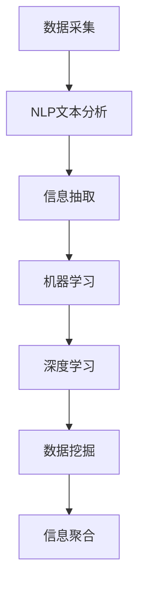

                 

# AI在实时信息更新中的作用

## 1. 背景介绍

在数字化和信息爆炸的时代，实时信息更新已成为各行各业的重要环节。无论是新闻媒体、金融市场、健康医疗还是电子商务，快速准确地获取和更新信息，都能为企业带来显著的竞争优势。传统的信息更新方式依赖人工维护，效率低、成本高，难以应对海量信息的挑战。而人工智能(AI)技术的引入，为实时信息更新带来了革命性的变化。

### 1.1 问题由来

在信息更新领域，AI技术主要通过以下方式发挥作用：

- **数据采集**：利用爬虫和API，自动从互联网、社交媒体、新闻源等获取最新数据。
- **文本分析**：使用自然语言处理(NLP)技术，自动理解和分类文本信息，如新闻、评论、用户评论等。
- **事件识别**：利用机器学习模型，识别出突发事件和新闻报道中的关键信息。
- **信息聚合**：整合不同来源的文本信息，生成综合性的新闻摘要或报告。
- **预测分析**：使用时间序列预测、情感分析等技术，对未来趋势进行预测和分析。

通过AI技术，企业能够快速获取和处理海量信息，同时保障数据的准确性和时效性。但AI在实时信息更新中的应用还面临一些挑战，如数据噪声、算法鲁棒性、模型解释性等，这些问题的解决，将进一步提升AI在实时信息更新中的作用。

### 1.2 问题核心关键点

AI在实时信息更新中的作用主要体现在以下几个方面：

- **自动化数据采集**：AI爬虫可以自动抓取网站、论坛、社交媒体等平台的数据，减少人工采集的时间和成本。
- **高效文本分析**：AI可以快速处理和分析大量的文本信息，从中提取关键事实和趋势。
- **事件实时识别**：AI模型能够自动识别和捕获突发事件和新闻热点，保障信息的实时性。
- **精准信息聚合**：AI能够整合多源信息，生成高质量的新闻摘要或报告。
- **预测分析能力**：AI可以基于历史数据和模型预测，对未来的趋势和事件进行预测。

## 2. 核心概念与联系

### 2.1 核心概念概述

为更好地理解AI在实时信息更新中的应用，本节将介绍几个核心概念：

- **自然语言处理(NLP)**：通过计算机技术处理和分析人类语言的技术，包括文本分类、情感分析、命名实体识别等。
- **机器学习(ML)**：通过数据训练模型，自动学习规律和知识，广泛应用于分类、回归、聚类等任务。
- **深度学习(DL)**：基于神经网络的机器学习范式，广泛应用于图像识别、语音识别、自然语言处理等领域。
- **数据挖掘(Data Mining)**：从大量数据中挖掘出有用信息、模式和趋势的技术。
- **信息抽取(Information Extraction)**：从文本中自动提取实体、关系、事件等关键信息的技术。

这些概念之间存在紧密的联系，共同构成了AI在实时信息更新中的核心技术框架。NLP和ML是AI处理文本数据的关键技术，DL提供了强大的模型支持，而数据挖掘和信息抽取则进一步提升了数据处理的深度和精度。

### 2.2 核心概念原理和架构的 Mermaid 流程图(Mermaid 流程节点中不要有括号、逗号等特殊字符)



这个流程图展示了AI在实时信息更新中从数据采集到信息聚合的完整流程：

1. **数据采集**：通过爬虫和API获取互联网上的最新数据。
2. **NLP文本分析**：对采集到的文本进行语言处理，提取关键信息。
3. **信息抽取**：进一步分析和挖掘文本中的实体、关系和事件。
4. **机器学习**：基于历史数据训练模型，预测未来的趋势和事件。
5. **深度学习**：利用神经网络模型，提升分析的准确性和鲁棒性。
6. **数据挖掘**：从多源数据中挖掘出有用的知识和模式。
7. **信息聚合**：整合信息，生成综合性的新闻摘要或报告。

这些步骤相互依赖、相互促进，共同保证了信息更新的实时性和准确性。

## 3. 核心算法原理 & 具体操作步骤

### 3.1 算法原理概述

AI在实时信息更新中的应用，主要依赖以下几种算法和技术：

- **深度学习模型**：如卷积神经网络(CNN)、循环神经网络(RNN)、Transformer等，用于处理和分析文本数据。
- **自然语言处理技术**：如词嵌入、词性标注、命名实体识别、句法分析等，用于理解文本含义和结构。
- **机器学习算法**：如决策树、随机森林、支持向量机(SVM)、神经网络等，用于分类、回归、聚类等任务。
- **信息抽取技术**：如实体识别、关系抽取、事件抽取等，用于从文本中提取关键信息。

AI在实时信息更新中的核心算法，概括来说，是对大规模文本数据进行高效处理和分析，从中提取有用信息，并实时更新数据库和系统。

### 3.2 算法步骤详解

AI在实时信息更新中的具体操作步骤包括以下几个关键步骤：

**Step 1: 数据采集**

1. **爬虫抓取**：使用网络爬虫自动抓取互联网上的新闻、社交媒体、博客等数据。
2. **API调用**：利用API接口，从新闻源、社交媒体平台等获取实时数据。

**Step 2: 文本预处理**

1. **去重去噪**：对抓取到的数据进行去重和去噪处理，去除重复和无效内容。
2. **分词和词性标注**：使用分词和词性标注工具，将文本分割成单词和短语，并进行词性标注。
3. **停用词过滤**：去除文本中的停用词，提高信息处理效率。

**Step 3: 信息抽取**

1. **命名实体识别**：从文本中识别出人名、地名、机构名等实体，并标注其类型和位置。
2. **事件抽取**：识别文本中提及的事件和事件关系，如事件发生时间、地点、参与者等。
3. **情感分析**：使用情感分析模型，判断文本的情感倾向，如正面、负面、中性等。

**Step 4: 机器学习分析**

1. **特征提取**：从文本中提取有用的特征，如关键词、词频、情感得分等。
2. **分类预测**：使用机器学习模型对文本进行分类，如新闻类型、热门程度等。
3. **异常检测**：利用异常检测算法，识别出异常或伪造的新闻。

**Step 5: 信息聚合与更新**

1. **信息聚合**：将从不同来源抽取的信息整合在一起，生成综合性的新闻摘要或报告。
2. **实时更新**：将最新信息及时更新到数据库和系统中，供用户访问和分析。

### 3.3 算法优缺点

AI在实时信息更新中的优点包括：

- **高效性**：AI可以快速处理大量文本数据，提取有用信息，生成实时更新。
- **准确性**：利用机器学习和深度学习技术，提高信息提取和分类的准确性。
- **实时性**：通过爬虫和API，实时抓取和更新数据，保证信息的最新性。
- **自动化**：自动化处理文本和数据，减少人工干预，降低成本。

但同时，AI在实时信息更新中也存在一些缺点：

- **数据噪声**：互联网上的数据存在大量噪声和错误信息，需要复杂的预处理和过滤。
- **算法鲁棒性**：AI模型可能对异常数据和噪声敏感，需要加强鲁棒性设计。
- **模型解释性**：深度学习模型往往被认为是"黑盒"，难以解释其内部工作机制。
- **资源需求高**：深度学习模型需要大量计算资源，对硬件要求高。
- **隐私和伦理**：数据隐私和伦理问题复杂，需要严格的数据管理和保护。

## 4. 数学模型和公式 & 详细讲解

### 4.1 数学模型构建

基于AI的实时信息更新，其数学模型主要包括以下几个部分：

- **文本表示模型**：将文本转换为向量表示，如word2vec、GloVe、BERT等。
- **分类模型**：使用逻辑回归、决策树、随机森林、神经网络等模型进行文本分类。
- **聚类模型**：使用K-means、层次聚类等模型对文本进行聚类分析。
- **预测模型**：使用ARIMA、LSTM、GRU等模型对时间序列数据进行预测。

### 4.2 公式推导过程

以文本分类为例，假设文本表示为向量 $x \in \mathbb{R}^d$，类别标签为 $y \in \{0, 1\}$，分类模型的目标是最大化预测准确率。设分类器的参数为 $\theta$，则分类任务的目标函数为：

$$
\min_{\theta} L(\theta) = -\frac{1}{N}\sum_{i=1}^N [y_i \log \sigma(y_i^\top \theta x_i) + (1-y_i) \log(1-\sigma(y_i^\top \theta x_i))]
$$

其中 $\sigma$ 为sigmoid函数，$y_i^\top \theta x_i$ 为分类器的输出，$L$ 为交叉熵损失函数。

通过梯度下降等优化算法，不断更新参数 $\theta$，最小化损失函数 $L(\theta)$，即可得到最优分类器。

### 4.3 案例分析与讲解

以金融市场实时信息更新为例，假设需要实时监测股票市场的新闻信息，步骤如下：

1. **数据采集**：使用爬虫抓取新闻网站、财经网站、社交媒体等数据。
2. **文本预处理**：去除停用词、标点符号等噪声，进行词性标注。
3. **信息抽取**：识别出新闻中提及的股票代码、公司名称、事件类型等信息。
4. **情感分析**：使用情感分析模型，判断新闻的情感倾向。
5. **异常检测**：利用异常检测算法，识别出可能包含虚假信息的新闻。
6. **信息聚合**：将多源新闻整合，生成综合性的市场报告。
7. **实时更新**：将最新信息实时更新到金融系统中，供交易决策参考。

## 5. 项目实践：代码实例和详细解释说明

### 5.1 开发环境搭建

在进行AI实时信息更新开发前，需要准备好开发环境。以下是使用Python进行PyTorch开发的环境配置流程：

1. 安装Anaconda：从官网下载并安装Anaconda，用于创建独立的Python环境。
2. 创建并激活虚拟环境：
```bash
conda create -n pytorch-env python=3.8 
conda activate pytorch-env
```

3. 安装PyTorch：根据CUDA版本，从官网获取对应的安装命令。例如：
```bash
conda install pytorch torchvision torchaudio cudatoolkit=11.1 -c pytorch -c conda-forge
```

4. 安装TensorFlow：
```bash
pip install tensorflow
```

5. 安装各类工具包：
```bash
pip install numpy pandas scikit-learn matplotlib tqdm jupyter notebook ipython
```

完成上述步骤后，即可在`pytorch-env`环境中开始项目开发。

### 5.2 源代码详细实现

以下是一个使用PyTorch进行文本分类的代码实现示例：

```python
import torch
import torch.nn as nn
import torch.optim as optim
from torchtext.datasets import AG_NEWS
from torchtext.data import Field, BucketIterator

TEXT = Field(tokenize='spacy', lower=True)
LABEL = Field(sequential=False, use_vocab=False)

train_data, test_data = AG_NEWS.splits(TEXT, LABEL)

TEXT.build_vocab(train_data, max_size=25_000, vectors="glove.6B.100d")
LABEL.build_vocab(train_data)

device = torch.device('cuda' if torch.cuda.is_available() else 'cpu')

class CNNClassifier(nn.Module):
    def __init__(self, n_words, n_classes):
        super().__init__()
        self.embedding = nn.Embedding(n_words, 100)
        self.conv1 = nn.Conv1d(1, 64, 3)
        self.conv2 = nn.Conv1d(64, 128, 3)
        self.fc1 = nn.Linear(128 * 3 * 3, 64)
        self.fc2 = nn.Linear(64, n_classes)
        self.dropout = nn.Dropout(0.5)
        self.pooling = nn.MaxPool1d(kernel_size=2, stride=2)
        
    def forward(self, x):
        x = self.embedding(x)
        x = x.unsqueeze(1)
        x = self.conv1(x)
        x = nn.ReLU()(x)
        x = self.pooling(x)
        x = self.conv2(x)
        x = nn.ReLU()(x)
        x = self.pooling(x)
        x = x.view(-1, 128 * 3 * 3)
        x = self.fc1(x)
        x = nn.ReLU()(x)
        x = self.dropout(x)
        x = self.fc2(x)
        return x

model = CNNClassifier(len(TEXT.vocab), 4)
model = model.to(device)

optimizer = optim.Adam(model.parameters(), lr=0.001)

def train_epoch(model, iterator, optimizer):
    model.train()
    total_loss = 0
    for batch in iterator:
        optimizer.zero_grad()
        text, labels = batch
        text = text.to(device)
        labels = labels.to(device)
        predictions = model(text)
        loss = nn.CrossEntropyLoss()(predictions, labels)
        loss.backward()
        optimizer.step()
        total_loss += loss.item()
    return total_loss / len(iterator)

def evaluate(model, iterator):
    model.eval()
    total_loss = 0
    total_correct = 0
    with torch.no_grad():
        for batch in iterator:
            text, labels = batch
            text = text.to(device)
            labels = labels.to(device)
            predictions = model(text)
            loss = nn.CrossEntropyLoss()(predictions, labels)
            total_loss += loss.item()
            total_correct += (predictions.argmax(dim=1) == labels).sum().item()
    return total_loss / len(iterator), total_correct / len(iterator.dataset)
```

### 5.3 代码解读与分析

**CnnClassifier类**：
- `__init__`方法：初始化模型参数，包括嵌入层、卷积层、全连接层等。
- `forward`方法：定义模型前向传播过程。

**train_epoch函数**：
- 对训练数据进行迭代，前向传播计算损失，反向传播更新模型参数，并返回平均损失。

**evaluate函数**：
- 对测试数据进行迭代，计算模型在测试集上的损失和准确率，并返回结果。

**训练流程**：
- 定义模型、优化器和训练数据集。
- 在每个epoch中，对训练集进行迭代，更新模型参数。
- 在每个epoch结束后，对验证集进行评估，输出损失和准确率。

## 6. 实际应用场景

### 6.1 智能新闻推荐

智能新闻推荐系统可以根据用户的浏览历史、兴趣标签等，实时推荐相关的新闻文章。AI技术可以自动抓取和分析海量新闻数据，识别出用户感兴趣的主题和事件，从而提供个性化的新闻推荐。

在技术实现上，可以利用深度学习模型对新闻文本进行分类和情感分析，识别出热门和用户感兴趣的新闻。同时，可以使用协同过滤、矩阵分解等方法，结合用户行为数据，进行更精准的推荐。

### 6.2 金融市场监控

金融市场监控系统需要实时获取和分析市场动态，预测市场趋势，辅助投资者做出决策。AI技术可以自动化抓取财经新闻、市场数据、社交媒体信息等，提取关键信息和情感倾向，生成实时市场报告。

在实际应用中，可以使用LSTM等时间序列模型，对历史数据进行分析和预测。同时，结合异常检测算法，识别出市场异常和虚假信息，保障信息的真实性和可靠性。

### 6.3 健康医疗监测

健康医疗领域需要实时监测和分析各类疾病动态，及时预警和处理公共卫生事件。AI技术可以自动化抓取和分析各类健康数据，提取关键事件和趋势，生成综合性的健康报告。

在实现上，可以使用命名实体识别和事件抽取技术，识别出疾病的名称、传播途径等信息。同时，结合时间序列分析和情感分析，预测疾病趋势和公众情绪，提供科学的健康建议。

### 6.4 未来应用展望

未来，AI在实时信息更新中的应用将更加广泛和深入。随着技术的不断发展，AI有望在以下方面取得突破：

1. **跨模态信息融合**：将文本、图像、视频等多模态信息进行融合，提升信息提取和分析的全面性。
2. **交互式实时系统**：结合自然语言处理和生成技术，实现实时交互式问答和信息推送。
3. **情感和社会分析**：利用情感分析和社会网络分析，了解公众情绪和事件的社会影响。
4. **数据治理和安全**：建立数据隐私保护和治理机制，确保数据安全性和可靠性。

## 7. 工具和资源推荐

### 7.1 学习资源推荐

为了帮助开发者系统掌握AI在实时信息更新中的技术，这里推荐一些优质的学习资源：

1. 《深度学习》系列书籍：由多位深度学习领域专家撰写，系统介绍了深度学习的基本概念和经典模型。
2. CS224N《自然语言处理》课程：斯坦福大学开设的NLP明星课程，涵盖文本分类、情感分析、信息抽取等基础任务。
3. 《Python数据科学手册》：涵盖Python编程语言在数据科学中的应用，适合了解AI开发环境和技术栈。
4. Kaggle平台：提供丰富的数据集和竞赛任务，可以实践和应用各类AI技术。
5. Google Colab：免费的在线Jupyter Notebook环境，方便开发和实验最新模型，分享学习笔记。

通过对这些资源的学习实践，相信你一定能够快速掌握AI在实时信息更新中的核心技术，并应用于实际项目中。

### 7.2 开发工具推荐

高效的开发离不开优秀的工具支持。以下是几款用于AI实时信息更新开发的常用工具：

1. PyTorch：基于Python的开源深度学习框架，灵活动态的计算图，适合快速迭代研究。大部分预训练语言模型都有PyTorch版本的实现。
2. TensorFlow：由Google主导开发的开源深度学习框架，生产部署方便，适合大规模工程应用。同样有丰富的预训练语言模型资源。
3. Scikit-learn：Python科学计算库，提供各种机器学习算法和数据处理工具。
4. NLTK：自然语言处理工具包，提供文本处理、分词、词性标注等功能。
5. spaCy：流行的自然语言处理库，提供高效的文本处理和分析工具。

合理利用这些工具，可以显著提升AI实时信息更新的开发效率，加快创新迭代的步伐。

### 7.3 相关论文推荐

AI在实时信息更新中的技术发展源于学界的持续研究。以下是几篇奠基性的相关论文，推荐阅读：

1. Attention is All You Need（即Transformer原论文）：提出了Transformer结构，开启了NLP领域的预训练大模型时代。
2. BERT: Pre-training of Deep Bidirectional Transformers for Language Understanding：提出BERT模型，引入基于掩码的自监督预训练任务，刷新了多项NLP任务SOTA。
3. Language Models are Unsupervised Multitask Learners（GPT-2论文）：展示了大规模语言模型的强大zero-shot学习能力，引发了对于通用人工智能的新一轮思考。
4. Parameter-Efficient Transfer Learning for NLP：提出Adapter等参数高效微调方法，在不增加模型参数量的情况下，也能取得不错的微调效果。
5. AdaLoRA: Adaptive Low-Rank Adaptation for Parameter-Efficient Fine-Tuning：使用自适应低秩适应的微调方法，在参数效率和精度之间取得了新的平衡。

这些论文代表了大语言模型微调技术的发展脉络。通过学习这些前沿成果，可以帮助研究者把握学科前进方向，激发更多的创新灵感。

## 8. 总结：未来发展趋势与挑战

### 8.1 总结

本文对AI在实时信息更新中的应用进行了全面系统的介绍。首先阐述了AI在实时信息更新中的研究背景和意义，明确了AI技术在数据采集、文本分析、事件识别、信息聚合等方面的独特价值。其次，从原理到实践，详细讲解了AI在实时信息更新中的数学模型和算法步骤，给出了实际应用的代码实现和详细解释。同时，本文还广泛探讨了AI在智能新闻推荐、金融市场监控、健康医疗监测等场景的应用前景，展示了AI技术的广泛适用性和巨大潜力。

通过本文的系统梳理，可以看到，AI在实时信息更新中通过自动化数据采集和高效文本分析，显著提升了信息处理的效率和准确性。AI技术的不断发展，必将进一步推动实时信息更新的自动化和智能化进程，为各行各业带来深远影响。

### 8.2 未来发展趋势

展望未来，AI在实时信息更新中的技术将呈现以下几个发展趋势：

1. **跨模态信息处理**：将文本、图像、视频等多模态信息进行融合，提升信息提取和分析的全面性。
2. **实时交互式系统**：结合自然语言处理和生成技术，实现实时交互式问答和信息推送。
3. **情感和社会分析**：利用情感分析和社会网络分析，了解公众情绪和事件的社会影响。
4. **数据治理和安全**：建立数据隐私保护和治理机制，确保数据安全性和可靠性。
5. **模型优化和压缩**：优化模型结构和参数，提高推理速度和资源利用率。
6. **联邦学习和边缘计算**：利用联邦学习和边缘计算，提升模型隐私性和计算效率。

以上趋势凸显了AI在实时信息更新中的广阔前景。这些方向的探索发展，必将进一步提升AI技术在实时信息更新中的应用效果，为各行各业带来更高的自动化和智能化水平。

### 8.3 面临的挑战

尽管AI在实时信息更新中取得了显著成效，但在迈向更加智能化、普适化应用的过程中，它仍面临着诸多挑战：

1. **数据噪声**：互联网上的数据存在大量噪声和错误信息，需要复杂的预处理和过滤。
2. **算法鲁棒性**：AI模型可能对异常数据和噪声敏感，需要加强鲁棒性设计。
3. **模型解释性**：深度学习模型往往被认为是"黑盒"，难以解释其内部工作机制。
4. **资源需求高**：深度学习模型需要大量计算资源，对硬件要求高。
5. **隐私和伦理**：数据隐私和伦理问题复杂，需要严格的数据管理和保护。

这些挑战需要学界和产业界共同努力，通过持续的研究和创新，逐步克服。

### 8.4 研究展望

面对AI在实时信息更新中所面临的挑战，未来的研究需要在以下几个方面寻求新的突破：

1. **自动化数据预处理**：开发更高效的数据清洗和预处理技术，减少人工干预。
2. **增强模型鲁棒性**：引入异常检测和鲁棒性设计，提升模型的鲁棒性和泛化能力。
3. **模型解释性增强**：开发可解释的模型和工具，增强模型的透明性和可解释性。
4. **跨模态融合技术**：研究跨模态信息融合方法，提升多模态数据处理的效率和效果。
5. **联邦学习和边缘计算**：利用联邦学习和边缘计算，提升模型的隐私性和计算效率。
6. **跨领域知识整合**：研究跨领域知识整合技术，提升模型的综合理解和预测能力。

这些研究方向的探索，必将引领AI在实时信息更新技术迈向更高的台阶，为各行各业带来更大的智能化和自动化价值。总之，AI在实时信息更新中发挥着越来越重要的作用，未来的研究还需要结合其他AI技术，如知识图谱、因果推理、强化学习等，共同推动实时信息更新的智能化进程。

## 9. 附录：常见问题与解答

**Q1：AI在实时信息更新中能否处理复杂任务？**

A: AI在实时信息更新中已经展示出处理复杂任务的能力。通过结合深度学习、自然语言处理、时间序列分析等技术，AI可以自动化处理文本、图像、视频等多种类型的数据，并进行多任务的融合和分析。例如，在智能新闻推荐中，AI可以同时进行情感分析、文本分类、用户行为分析等多个任务，实现综合性的推荐结果。

**Q2：AI在实时信息更新中面临的主要挑战是什么？**

A: AI在实时信息更新中面临的主要挑战包括：

1. **数据噪声**：互联网上的数据存在大量噪声和错误信息，需要复杂的预处理和过滤。
2. **算法鲁棒性**：AI模型可能对异常数据和噪声敏感，需要加强鲁棒性设计。
3. **模型解释性**：深度学习模型往往被认为是"黑盒"，难以解释其内部工作机制。
4. **资源需求高**：深度学习模型需要大量计算资源，对硬件要求高。
5. **隐私和伦理**：数据隐私和伦理问题复杂，需要严格的数据管理和保护。

这些挑战需要进一步研究和解决，才能充分发挥AI在实时信息更新中的作用。

**Q3：如何提高AI在实时信息更新中的性能？**

A: 提高AI在实时信息更新中的性能可以从以下几个方面入手：

1. **数据质量**：提高数据采集和预处理的准确性，减少噪声和错误信息。
2. **模型优化**：优化模型结构和参数，提高模型的鲁棒性和泛化能力。
3. **跨模态融合**：研究跨模态信息融合方法，提升多模态数据处理的效率和效果。
4. **联邦学习和边缘计算**：利用联邦学习和边缘计算，提升模型的隐私性和计算效率。
5. **增强可解释性**：开发可解释的模型和工具，增强模型的透明性和可解释性。

通过以上措施，可以进一步提升AI在实时信息更新中的性能和应用效果。

**Q4：AI在实时信息更新中如何保护用户隐私？**

A: 在实时信息更新中，保护用户隐私是一个重要课题。以下是一些保护用户隐私的措施：

1. **数据匿名化**：对用户数据进行匿名化处理，保护用户隐私。
2. **数据加密**：对用户数据进行加密处理，防止数据泄露。
3. **访问控制**：设置严格的访问控制机制，确保只有授权用户才能访问数据。
4. **差分隐私**：在数据处理过程中引入差分隐私技术，保护用户隐私。
5. **隐私计算**：利用隐私计算技术，在不泄露用户隐私的情况下，进行数据处理和分析。

这些措施可以有效地保护用户隐私，确保AI在实时信息更新中的应用安全和可靠。

**Q5：AI在实时信息更新中如何处理数据异常？**

A: 在实时信息更新中，数据异常是不可避免的问题。以下是一些处理数据异常的措施：

1. **异常检测**：利用异常检测算法，识别和处理异常数据。
2. **数据清洗**：对异常数据进行清洗和处理，去除无用和错误信息。
3. **数据补充**：补充缺失数据，保持数据完整性。
4. **模型鲁棒性设计**：在模型设计中加入鲁棒性设计，确保模型对异常数据具有一定的抗干扰能力。

通过以上措施，可以有效地处理数据异常，保障AI在实时信息更新中的数据质量。

**Q6：AI在实时信息更新中如何提高计算效率？**

A: 在实时信息更新中，提高计算效率是一个重要课题。以下是一些提高计算效率的措施：

1. **模型压缩**：对模型进行压缩和优化，减少计算资源消耗。
2. **分布式计算**：利用分布式计算技术，提高计算效率。
3. **并行计算**：利用并行计算技术，加速模型训练和推理。
4. **硬件加速**：利用GPU、TPU等硬件加速技术，提升计算速度。

通过以上措施，可以有效地提高AI在实时信息更新中的计算效率，满足实时性和高性能的需求。

---

作者：禅与计算机程序设计艺术 / Zen and the Art of Computer Programming

