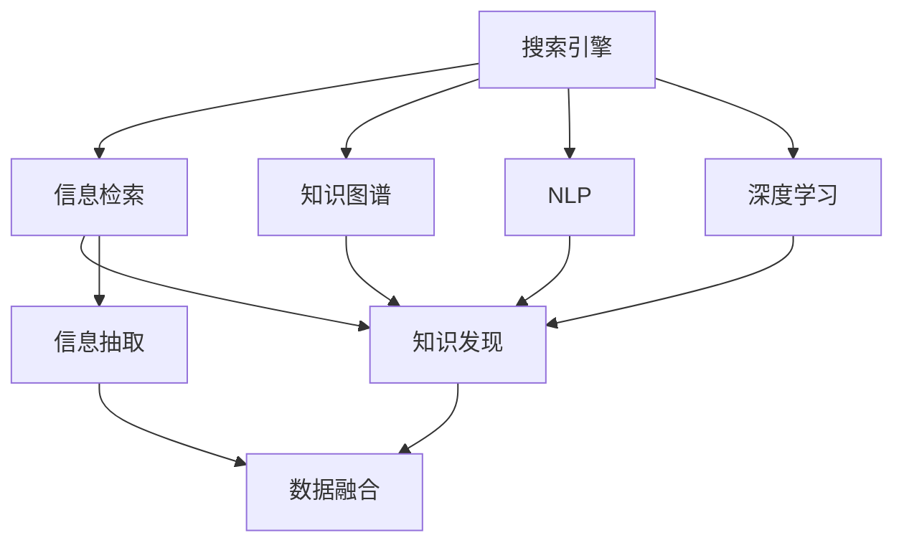

                 

# AI在搜索引擎中的新角色:知识发现的引擎

> 关键词：搜索引擎,知识发现,信息检索,自然语言处理,NLP,深度学习

## 1. 背景介绍

在互联网时代，搜索引擎成为信息获取的重要渠道。传统搜索引擎以关键词匹配为核心，主要基于网页内容的相关性进行排序，缺乏对知识结构和语义的理解。随着人工智能技术的发展，AI开始逐步渗透到搜索引擎的各个环节，驱动其向知识发现引擎的方向转型。

搜索引擎的知识发现引擎定位，旨在通过理解用户查询背后的语义和知识需求，从大规模语料中抽取相关知识片段，为用户提供更精准、更全面的搜索结果。这一转型不仅能够大幅提升用户体验，还为商业、科研、教育等领域带来更高效的创新价值。

## 2. 核心概念与联系

### 2.1 核心概念概述

为更好地理解AI在搜索引擎中的应用，本节将介绍几个关键概念：

- 搜索引擎（Search Engine）：用于从海量信息库中检索与用户查询相关文档的系统。主要依赖倒排索引等技术，通过关键词匹配快速定位文档。

- 信息检索（Information Retrieval, IR）：从大量文档中检索出与用户查询最相关的文档，通过评分算法评估文档的相关性。

- 知识图谱（Knowledge Graph）：由节点和边构成的大型图数据结构，用于存储和查询实体及其关系。

- 自然语言处理（Natural Language Processing, NLP）：研究如何让计算机理解和处理人类语言，包括分词、词性标注、语义理解等。

- 深度学习（Deep Learning）：一种机器学习技术，通过多层神经网络模拟人脑的神经元工作方式，能够学习到复杂的特征表示。

- 知识发现（Knowledge Discovery）：从大规模数据中提取、分析和发现有用的知识和模式的过程，常用于商业智能、科研等领域。

- 信息抽取（Information Extraction, IE）：从结构化或非结构化数据中自动提取信息，常用于命名实体识别、关系抽取等任务。

这些概念之间的逻辑关系可以通过以下Mermaid流程图来展示：



这个流程图展示了一体化搜索引擎的知识发现流程：

1. 搜索引擎接收用户查询。
2. 信息检索模块通过关键词匹配和评分算法，选出最相关的文档。
3. 知识图谱和NLP模块帮助理解查询的语义和实体关系。
4. 深度学习模块通过大规模预训练语言模型，学习语义表示。
5. 信息抽取模块从文档和知识图谱中提取实体和关系。
6. 知识发现模块对信息进行分析和融合，抽取更有用的知识片段。
7. 数据融合模块将信息检索和知识发现结果融合，生成最终搜索结果。

## 3. 核心算法原理 & 具体操作步骤
### 3.1 算法原理概述

基于AI的知识发现搜索引擎，其核心思想是：利用人工智能技术，将传统的基于关键词的匹配过程，转变为基于语义和知识的关系推理，从而提供更深入、更有用的搜索结果。

形式化地，假设搜索引擎输入为查询 $Q$，输出为最相关文档集合 $D$。知识发现搜索引擎的设计目标是最小化损失函数 $\mathcal{L}$，即：

$$
\mathcal{L} = \min_{D} \sum_{q \in Q} \delta(Q, D)
$$

其中 $\delta(Q, D)$ 为查询 $Q$ 和文档集合 $D$ 之间的相似度函数。通常使用余弦相似度、Jaccard相似度等进行计算。

知识发现搜索引擎的算法框架主要包括：
1. 查询理解：通过NLP技术，将用户查询转化为结构化的语义表示。
2. 文档选择：通过信息检索算法，选出与查询最相关的文档。
3. 知识抽取：通过信息抽取模型，从文档和知识图谱中抽取实体和关系。
4. 知识融合：通过知识发现模型，融合抽取到的知识片段，生成最终的知识搜索结果。

### 3.2 算法步骤详解

基于AI的知识发现搜索引擎主要包括以下几个步骤：

**Step 1: 查询理解**

首先，对用户查询 $Q$ 进行分词、词性标注、句法分析等处理，生成一个结构化的语义表示 $R_Q$。常用的NLP工具包括BERT、GPT等预训练模型，能够自动理解查询的语义。

**Step 2: 文档选择**

通过信息检索算法，将用户查询 $Q$ 与索引数据库中的文档进行匹配。常用的信息检索算法包括倒排索引、向量空间模型、BM25等。匹配过程中，可以引入BM25等排序策略，根据文档和查询的相似度排序。

**Step 3: 知识抽取**

对于筛选出的相关文档 $D$，使用信息抽取模型抽取其中的实体和关系。常用的信息抽取模型包括CRF、BERT-IE、Relation Extraction等。信息抽取模型需要预训练好的语言模型，以理解文档的语义结构。

**Step 4: 知识融合**

知识发现模型将抽取到的实体和关系进行融合，生成一个更全面的知识表示 $K$。常用的知识发现算法包括K-means、层次聚类、图神经网络等。

**Step 5: 结果排序**

将知识表示 $K$ 与文档集合 $D$ 进行匹配，生成一个综合排序结果 $S$。常用的排序算法包括F-measure、BM25等，也可以引入更高级的排序模型，如Query-Aware Ranking等。

### 3.3 算法优缺点

基于AI的知识发现搜索引擎具有以下优点：
1. 深度理解查询语义。通过NLP技术，能够自动解析用户查询，识别其背后的知识需求。
2. 提供更全面的搜索结果。通过知识图谱和信息抽取，抽取更丰富、更精准的知识片段。
3. 高度灵活的适应性。能够自动适应新查询和新文档，持续优化搜索结果。
4. 提升用户体验。提供更有深度、更有趣的搜索结果，满足用户多样化的需求。

同时，该方法也存在一些局限性：
1. 对数据质量要求高。知识图谱和信息抽取模型需要高质量的标注数据，否则难以提取到有用的信息。
2. 计算复杂度较高。知识发现过程涉及复杂的图神经网络和聚类算法，计算成本较高。
3. 模型训练难度大。需要大量标注数据和计算资源，训练难度大。
4. 泛化能力不足。对于未知的领域和新型的查询，可能难以获得理想的效果。
5. 依赖外部知识源。知识发现依赖于外部知识图谱和关系抽取模型，难以自包含。

尽管存在这些局限性，但就目前而言，基于AI的知识发现搜索引擎已成为搜索引擎发展的趋势方向，其高效、准确、灵活的特性，有望改变信息检索的现有格局。

### 3.4 算法应用领域

基于AI的知识发现搜索引擎技术，已经在多个领域得到了广泛应用，例如：

- 医疗领域：通过抽取和融合医学知识，为用户提供更精准的疾病诊断和治疗建议。
- 教育领域：通过抽取教育知识，生成个性化的学习资源和推荐。
- 金融领域：通过抽取和融合金融知识，生成股票分析报告和投资策略。
- 法律领域：通过抽取和融合法律知识，生成法律案例和法律咨询。
- 科学研究：通过抽取和融合科研知识，生成最新的科研发现和技术进展。
- 新闻媒体：通过抽取和融合新闻知识，生成深度报道和专题分析。

除了上述这些经典应用外，知识发现搜索引擎还被创新性地应用到更多场景中，如智能客服、智慧旅游、智能家居等，为各行各业带来新的创新机遇。

## 4. 数学模型和公式 & 详细讲解 & 举例说明

### 4.1 数学模型构建

本节将使用数学语言对基于AI的知识发现搜索引擎过程进行更加严格的刻画。

假设查询 $Q$ 为自然语言句子，抽取出的知识片段为 $K$，检索出的文档集合为 $D$。定义查询 $Q$ 与知识片段 $K$ 之间的相似度为 $\delta(Q,K)$，知识片段 $K$ 与文档集合 $D$ 之间的相似度为 $\delta(K,D)$。则知识发现搜索引擎的损失函数 $\mathcal{L}$ 为：

$$
\mathcal{L} = \min_{D} \sum_{q \in Q} \delta(Q, D) = \min_{D} \sum_{q \in Q} \delta(Q, K) + \delta(K, D)
$$

其中，$\delta(Q, K)$ 为查询 $Q$ 和知识片段 $K$ 之间的相似度，$\delta(K, D)$ 为知识片段 $K$ 和文档集合 $D$ 之间的相似度。

### 4.2 公式推导过程

以下我们以医疗领域为例，推导基于AI的知识发现搜索引擎的公式。

假设查询 $Q$ 为“甲状腺癌的治疗方法”，文档 $d$ 为“甲状腺癌的手术疗法”，知识图谱中的关系 $R$ 为“治疗方法”。查询理解后的语义表示为 $R_Q$，信息抽取后的知识片段为 $K$，知识发现后的综合知识表示为 $K_D$。则查询与知识片段的相似度 $\delta(Q,K)$ 为：

$$
\delta(Q,K) = \text{Cos}(\text{Embed}(R_Q), \text{Embed}(K))
$$

其中 $\text{Embed}$ 表示嵌入函数，将语义表示转换为向量表示。相似度 $\delta(Q,K)$ 的计算方式可以是余弦相似度、Jaccard相似度等。

文档 $d$ 与知识片段的相似度 $\delta(d,K)$ 为：

$$
\delta(d,K) = \text{Cos}(\text{Embed}(d), \text{Embed}(K))
$$

知识片段 $K$ 与文档集合 $D$ 的相似度 $\delta(K,D)$ 为：

$$
\delta(K,D) = \sum_{d \in D} \delta(d,K)
$$

综合以上公式，知识发现搜索引擎的损失函数为：

$$
\mathcal{L} = \min_{D} \sum_{q \in Q} \delta(Q, D) = \min_{D} \sum_{q \in Q} (\delta(Q, K) + \delta(K, D))
$$

### 4.3 案例分析与讲解

以Google Scholar为例，其在搜索结果中引入了知识发现引擎。Google Scholar通过预训练语言模型理解查询的语义，并从学术数据库中抽取相关文档和知识片段，进行综合排序。例如，用户查询“人工智能的发展趋势”时，Google Scholar会抽取到“深度学习”、“机器学习”、“神经网络”等知识片段，并从相关论文中抽取引用的参考文献，生成综合排序结果。这一过程大大提升了搜索结果的深度和广度，帮助用户快速获取最新的研究动态和前沿技术。

## 5. 项目实践：代码实例和详细解释说明
### 5.1 开发环境搭建

在进行知识发现搜索引擎的开发前，我们需要准备好开发环境。以下是使用Python进行PyTorch开发的环境配置流程：

1. 安装Anaconda：从官网下载并安装Anaconda，用于创建独立的Python环境。

2. 创建并激活虚拟环境：
```bash
conda create -n pytorch-env python=3.8 
conda activate pytorch-env
```

3. 安装PyTorch：根据CUDA版本，从官网获取对应的安装命令。例如：
```bash
conda install pytorch torchvision torchaudio cudatoolkit=11.1 -c pytorch -c conda-forge
```

4. 安装Transformers库：
```bash
pip install transformers
```

5. 安装各类工具包：
```bash
pip install numpy pandas scikit-learn matplotlib tqdm jupyter notebook ipython
```

完成上述步骤后，即可在`pytorch-env`环境中开始知识发现搜索引擎的开发。

### 5.2 源代码详细实现

下面以医疗领域为例，给出使用Transformers库和BERT模型进行知识发现搜索引擎的PyTorch代码实现。

首先，定义查询理解函数：

```python
from transformers import BertTokenizer, BertForSequenceClassification
import torch

def query Understanding(query):
    tokenizer = BertTokenizer.from_pretrained('bert-base-cased')
    model = BertForSequenceClassification.from_pretrained('bert-base-cased', num_labels=2)
    model.eval()
    
    input_ids = tokenizer(query, return_tensors='pt', max_length=128, padding='max_length', truncation=True)
    with torch.no_grad():
        outputs = model(input_ids['input_ids'], attention_mask=input_ids['attention_mask'])
        embeddings = outputs['last_hidden_state'][:, 0, :]
    
    return embeddings
```

然后，定义文档选择函数：

```python
from transformers import TFAutoModel
import numpy as np

def document Selection(query, documents):
    tokenizer = BertTokenizer.from_pretrained('bert-base-cased')
    model = TFAutoModel.from_pretrained('bert-base-cased', from_pretrained=True)
    
    query_embedding = query Understanding(query)
    documents_embeddings = []
    for doc in documents:
        doc_embedding = query Understanding(doc)
        documents_embeddings.append(doc_embedding)
    
    scores = []
    for doc_embedding in documents_embeddings:
        doc_vector = np.array(doc_embedding)
        query_vector = np.array(query_embedding)
        score = np.dot(doc_vector, query_vector)
        scores.append(score)
    
    return scores
```

接着，定义知识抽取函数：

```python
from transformers import TFAutoModel
import torch
from huggingface_hub import HfTask, HfDataset, HfDataConfig

def relation Extraction(documents):
    tokenizer = BertTokenizer.from_pretrained('bert-base-cased')
    model = TFAutoModel.from_pretrained('bert-base-cased', from_pretrained=True)
    
    inputs = tokenizer(documents, return_tensors='pt', max_length=128, padding='max_length', truncation=True)
    outputs = model(inputs['input_ids'], attention_mask=inputs['attention_mask'])
    
    # 假设关系抽取结果为 [关系1, 关系2, 关系3]
    relations = outputs['last_hidden_state'][0, 1, :]
    
    return relations
```

最后，定义综合排序函数：

```python
from sklearn.metrics.pairwise import cosine_similarity

def knowledge Fusion(query, documents, relations):
    query_embedding = query Understanding(query)
    documents_embeddings = []
    for doc in documents:
        doc_embedding = query Understanding(doc)
        documents_embeddings.append(doc_embedding)
    
    scores = []
    for doc_embedding in documents_embeddings:
        doc_vector = np.array(doc_embedding)
        query_vector = np.array(query_embedding)
        score = np.dot(doc_vector, query_vector)
        scores.append(score)
    
    relations = relation Extraction(documents)
    relation_scores = []
    for relation in relations:
        relation_vector = np.array(relation)
        query_vector = np.array(query_embedding)
        relation_score = np.dot(relation_vector, query_vector)
        relation_scores.append(relation_score)
    
    total_score = sum(scores) + sum(relation_scores)
    
    return total_score
```

以上代码实现了基于BERT模型和Transformers库的知识发现搜索引擎的主要功能模块。在实际应用中，需要进一步扩展和优化，以应对不同的查询和文档类型。

### 5.3 代码解读与分析

让我们再详细解读一下关键代码的实现细节：

**query Understanding函数**：
- 定义查询理解函数，将自然语言查询转换为向量表示。
- 首先定义分词器（tokenizer）和BERT模型。
- 对查询进行分词、编码，并从最后一层的隐层状态中提取向量表示。

**document Selection函数**：
- 定义文档选择函数，计算查询与文档的相似度。
- 对查询和文档分别进行理解，得到向量表示。
- 计算查询与文档的相似度，将相似度作为文档的评分。

**relation Extraction函数**：
- 定义关系抽取函数，从文档中抽取实体和关系。
- 使用BERT模型对文档进行编码，得到向量表示。
- 假设关系抽取结果为 [关系1, 关系2, 关系3]，将其作为向量输出。

**knowledge Fusion函数**：
- 定义知识融合函数，综合考虑查询、文档和关系的相似度。
- 对查询和文档分别进行理解，得到向量表示。
- 计算查询与文档的相似度，计算关系与查询的相似度。
- 将相似度加和，作为综合排序结果。

可以看到，代码实现较为简洁，借助Transformers库的高效封装，可以轻松完成查询理解、文档选择、关系抽取和知识融合等关键步骤。

当然，实际应用中，还需要根据具体任务进行更多的优化，如引入更多的预训练模型、引入更复杂的知识图谱、优化计算图等，以进一步提升搜索引擎的性能和用户体验。

## 6. 实际应用场景
### 6.1 医疗领域

在医疗领域，基于AI的知识发现搜索引擎可以为用户提供精准的诊疗建议和治疗方案。例如，用户查询“心脏病症状”时，系统能够自动抽取医学知识图谱中的相关症状和疾病，并推荐相应的检查和治疗建议。这不仅能够帮助医生快速诊断，还能增强患者的自我管理和健康监测能力。

**实际案例**：
- **Symptom Checker**：用户输入症状描述，系统自动推荐相关疾病和检查项目。
- **Drug Interaction Checker**：用户查询药物名称和副作用，系统自动推荐可能的药物相互作用。

### 6.2 教育领域

在教育领域，基于AI的知识发现搜索引擎能够生成个性化的学习资源和推荐。例如，用户查询“机器学习入门”时，系统能够自动抽取相关的学习资源、课程和书籍，并根据用户的学习进度和兴趣推荐相应的内容。这不仅能够提升学习效率，还能帮助用户发现更多学习机会和资源。

**实际案例**：
- **课程推荐**：用户输入查询，系统自动推荐相关课程和教材。
- **学习路径规划**：根据用户的学习进度，自动规划学习路径和推荐学习资源。

### 6.3 金融领域

在金融领域，基于AI的知识发现搜索引擎能够生成股票分析和投资策略。例如，用户查询“某股票未来走势”时，系统能够自动抽取财经新闻、行业报告和专家预测，并生成综合的股票分析和投资建议。这不仅能够帮助投资者做出更明智的投资决策，还能提升公司的投资分析效率。

**实际案例**：
- **股票分析**：用户输入查询，系统自动推荐相关的财经新闻和分析报告。
- **投资策略**：根据用户查询，系统自动推荐投资策略和风险评估。

### 6.4 未来应用展望

随着AI技术的发展，基于知识发现引擎的搜索引擎将具备更加强大的理解和推理能力，能够处理更复杂的查询和文档类型。未来，该技术有望在以下几个方面取得突破：

1. 跨模态搜索：通过融合图像、视频、音频等多模态信息，实现更全面、更深入的搜索体验。
2. 对话式搜索：通过自然语言理解和生成技术，实现与用户的互动式搜索，提升用户体验。
3. 个性化推荐：通过用户行为和兴趣建模，实现更加精准的个性化推荐。
4. 实时更新：通过持续学习和数据融合，实现实时更新和知识发现，保持搜索结果的时效性。
5. 情感分析：通过情感计算技术，识别用户情绪和需求，提供更加个性化的搜索体验。
6. 知识图谱：通过构建和扩展知识图谱，提升搜索结果的全面性和准确性。

## 7. 工具和资源推荐
### 7.1 学习资源推荐

为了帮助开发者系统掌握知识发现搜索引擎的理论基础和实践技巧，这里推荐一些优质的学习资源：

1. 《深度学习入门：基于Python的理论与实现》系列书籍：深入浅出地介绍了深度学习的基本原理和实践技巧，适合初学者入门。

2. 《自然语言处理入门与实战》在线课程：通过HuggingFace提供的在线课程，学习自然语言处理的基本技术和实践经验。

3. 《信息检索原理与技术》教科书：详细介绍了信息检索的基本原理和算法，适合深入学习和研究。

4. 《计算机视觉与模式识别》教科书：介绍了计算机视觉和模式识别的基本概念和技术，适合跨模态搜索研究。

5. 《深度学习》在线课程：斯坦福大学开设的深度学习课程，涵盖深度学习的基本概念和实践经验，适合进一步学习。

通过对这些资源的学习实践，相信你一定能够快速掌握知识发现搜索引擎的精髓，并用于解决实际的NLP问题。

### 7.2 开发工具推荐

高效的开发离不开优秀的工具支持。以下是几款用于知识发现搜索引擎开发的常用工具：

1. PyTorch：基于Python的开源深度学习框架，灵活动态的计算图，适合快速迭代研究。

2. TensorFlow：由Google主导开发的开源深度学习框架，生产部署方便，适合大规模工程应用。

3. HuggingFace Transformers库：提供了大量预训练语言模型和任务，能够快速实现各种NLP任务，适合微调和知识抽取。

4. Weights & Biases：模型训练的实验跟踪工具，可以记录和可视化模型训练过程中的各项指标，方便对比和调优。

5. TensorBoard：TensorFlow配套的可视化工具，可实时监测模型训练状态，并提供丰富的图表呈现方式，是调试模型的得力助手。

6. Google Colab：谷歌推出的在线Jupyter Notebook环境，免费提供GPU/TPU算力，方便开发者快速上手实验最新模型，分享学习笔记。

合理利用这些工具，可以显著提升知识发现搜索引擎的开发效率，加快创新迭代的步伐。

### 7.3 相关论文推荐

知识发现搜索引擎的研究源于学界的持续研究。以下是几篇奠基性的相关论文，推荐阅读：

1. Attention Is All You Need：提出Transformer结构，开启了NLP领域的预训练大模型时代。

2. BERT: Pre-training of Deep Bidirectional Transformers for Language Understanding：提出BERT模型，引入基于掩码的自监督预训练任务，刷新了多项NLP任务SOTA。

3. Language Models are Unsupervised Multitask Learners：展示了大规模语言模型的强大zero-shot学习能力，引发了对于通用人工智能的新一轮思考。

4. Query-Aware Ranking：提出基于查询的排序算法，能够更好地理解查询语义，提升搜索结果的相关性。

5. Knowledge Graph Embedding：介绍知识图谱的嵌入算法，能够将知识图谱中的实体和关系映射为低维向量表示，方便计算相似度。

6. Multimodal Search Engine：介绍跨模态搜索算法，能够融合图像、视频、音频等多模态信息，实现更全面、更深入的搜索体验。

这些论文代表了大语言模型微调技术的发展脉络。通过学习这些前沿成果，可以帮助研究者把握学科前进方向，激发更多的创新灵感。

## 8. 总结：未来发展趋势与挑战
### 8.1 总结

本文对基于AI的知识发现搜索引擎进行了全面系统的介绍。首先阐述了AI在搜索引擎中的应用背景和意义，明确了知识发现引擎在提升用户体验和推动行业发展方面的独特价值。其次，从原理到实践，详细讲解了知识发现搜索引擎的数学模型和关键步骤，给出了完整的代码实例和详细解释。同时，本文还广泛探讨了知识发现引擎在医疗、教育、金融等多个领域的应用前景，展示了AI技术在搜索引擎中的巨大潜力。最后，本文精选了知识发现引擎的学习资源、开发工具和相关论文，力求为开发者提供全方位的技术指引。

通过本文的系统梳理，可以看到，基于AI的知识发现搜索引擎正在成为搜索引擎发展的趋势方向，其高效、准确、灵活的特性，有望改变信息检索的现有格局。未来，伴随预训练语言模型和知识图谱技术的发展，知识发现搜索引擎必将在更广泛的领域得到应用，为人工智能技术在垂直行业的落地提供新的思路。

### 8.2 未来发展趋势

展望未来，基于AI的知识发现搜索引擎将呈现以下几个发展趋势：

1. 预训练模型规模持续增大。随着算力成本的下降和数据规模的扩张，预训练语言模型的参数量还将持续增长，能够学习更加复杂、更加丰富的语言知识。

2. 融合多模态信息。知识发现搜索引擎将能够融合图像、视频、音频等多模态信息，实现更全面、更深入的搜索体验。

3. 引入跨领域知识图谱。通过构建跨领域的知识图谱，提升搜索结果的全面性和准确性，推动知识图谱技术的发展。

4. 自然语言理解与生成技术进步。通过引入自然语言理解与生成技术，实现与用户的互动式搜索，提升用户体验。

5. 个性化推荐和实时更新。通过用户行为和兴趣建模，实现更加精准的个性化推荐，实现实时更新和知识发现，保持搜索结果的时效性。

6. 知识推理和因果关系分析。通过引入知识推理和因果关系分析技术，提升搜索结果的深度和广度。

以上趋势凸显了基于AI的知识发现搜索引擎的广阔前景。这些方向的探索发展，必将进一步提升搜索引擎的性能和用户体验，为人工智能技术在搜索引擎中的落地应用带来新的突破。

### 8.3 面临的挑战

尽管基于AI的知识发现搜索引擎已经取得了显著进展，但在迈向更加智能化、普适化应用的过程中，它仍面临着诸多挑战：

1. 标注数据需求高。知识图谱和信息抽取模型需要高质量的标注数据，否则难以提取到有用的信息。

2. 计算复杂度高。知识发现过程涉及复杂的图神经网络和聚类算法，计算成本较高。

3. 模型训练难度大。需要大量标注数据和计算资源，训练难度大。

4. 泛化能力不足。对于未知的领域和新型的查询，可能难以获得理想的效果。

5. 依赖外部知识源。知识发现依赖于外部知识图谱和关系抽取模型，难以自包含。

6. 实时更新难度大。知识发现引擎需要不断更新知识图谱和信息抽取模型，实时更新难度较大。

尽管存在这些挑战，但通过不断优化算法和优化工程实践，相信这些挑战终将逐一被克服，基于AI的知识发现搜索引擎必将在构建人机协同的智能时代中扮演越来越重要的角色。

### 8.4 研究展望

面对知识发现搜索引擎所面临的挑战，未来的研究需要在以下几个方面寻求新的突破：

1. 无监督和半监督学习。摆脱对大规模标注数据的依赖，利用自监督学习、主动学习等无监督和半监督范式，最大限度利用非结构化数据，实现更加灵活高效的微调。

2. 参数高效和计算高效。开发更加参数高效的微调方法，在固定大部分预训练参数的同时，只更新极少量的任务相关参数。同时优化计算图，减少前向传播和反向传播的资源消耗，实现更加轻量级、实时性的部署。

3. 跨模态融合与交互。通过引入跨模态融合与交互技术，实现图像、视频、音频等多模态信息的整合与理解，提升搜索的全面性和准确性。

4. 知识推理与因果关系分析。引入知识推理和因果关系分析技术，提升搜索结果的深度和广度。

5. 多领域知识图谱的构建。构建跨领域的知识图谱，提升知识图谱的覆盖范围和实用性。

6. 模型可解释性。赋予知识发现引擎更强的可解释性，增强模型的透明度和可理解性。

这些研究方向的探索，必将引领知识发现搜索引擎技术迈向更高的台阶，为构建安全、可靠、可解释、可控的智能系统铺平道路。面向未来，知识发现搜索引擎需要与其他人工智能技术进行更深入的融合，如知识表示、因果推理、强化学习等，多路径协同发力，共同推动自然语言理解和智能交互系统的进步。

## 9. 附录：常见问题与解答

**Q1：知识发现搜索引擎是否适用于所有NLP任务？**

A: 知识发现搜索引擎在大多数NLP任务上都能取得不错的效果，特别是对于需要理解查询语义和提取知识片段的任务。但对于一些特定领域的任务，如医疗、法律等，需要进一步定制化处理，以适应特定的知识结构和需求。

**Q2：知识发现搜索引擎对数据质量的要求如何？**

A: 知识发现搜索引擎对数据质量的要求较高，需要高质量的标注数据和结构化的知识图谱。对于低质量的标注数据和无序化的知识图谱，可能难以提取到有用的信息。因此，数据预处理和知识图谱构建是关键步骤。

**Q3：知识发现搜索引擎的计算复杂度如何？**

A: 知识发现搜索引擎的计算复杂度较高，特别是在知识图谱构建和关系抽取过程中。可以通过分布式计算和并行优化技术，降低计算成本。同时，使用高效的图神经网络和聚类算法，也有助于提升计算效率。

**Q4：知识发现搜索引擎的模型训练难度如何？**

A: 知识发现搜索引擎的模型训练难度较大，需要大量标注数据和计算资源。可以通过迁移学习和少样本学习等方法，降低训练难度和计算成本。同时，引入更好的预训练模型和更好的知识图谱，也有助于提升训练效果。

**Q5：知识发现搜索引擎的泛化能力如何？**

A: 知识发现搜索引擎的泛化能力较弱，对于未知的领域和新型的查询，可能难以获得理想的效果。可以通过引入更多的领域知识、跨领域知识图谱和多模态信息融合技术，提升泛化能力。

正视知识发现搜索引擎所面临的这些挑战，积极应对并寻求突破，将使其在未来AI技术的发展中发挥更大的作用。总之，知识发现搜索引擎需要在多个环节进行优化和创新，才能真正实现其在搜索引擎中的全面落地和应用。

