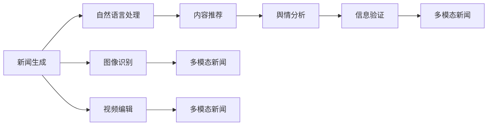

                 

# AI在新闻媒体中的应用：自动化与真实性

## 1. 背景介绍

### 1.1 问题由来

在信息爆炸的当今社会，新闻媒体面临着前所未有的挑战和机遇。一方面，海量信息的涌现让公众难以从中筛选有价值的信息；另一方面，假新闻、误导性信息的不时出现，对公众的判断和决策产生了负面影响。如何提高新闻媒体的报道质量，保障新闻的真实性和公正性，成为了一个亟待解决的问题。

人工智能（AI）技术的快速发展和广泛应用，为新闻媒体的自动化和真实性提升提供了新的解决途径。通过AI技术，新闻媒体可以实现自动化新闻报道、内容推荐、舆情分析、信息验证等多方面的创新。这不仅能够提高媒体的新闻生产效率，还能提升新闻报道的准确性和可信度。

### 1.2 问题核心关键点

AI在新闻媒体中的应用主要集中在以下几个方面：

1. **自动化新闻报道**：利用AI生成、编辑和校验新闻，提高报道速度和质量。
2. **内容推荐系统**：通过用户行为数据分析，智能推荐相关新闻，提高用户满意度。
3. **舆情分析与监控**：实时监测和分析社会舆情，及时发现并回应公众关切。
4. **信息验证与辟谣**：利用AI技术验证信息的真实性，减少假新闻的传播。
5. **多模态新闻制作**：整合文字、图片、视频等多种信息形式，提升报道的多样性和吸引力。

本文将重点探讨AI在新闻媒体中的应用，特别是在自动化和真实性提升方面的技术和实践。

## 2. 核心概念与联系

### 2.1 核心概念概述

要深入理解AI在新闻媒体中的应用，需要先了解以下几个关键概念：

- **AI新闻报道（Automated News Reporting）**：指利用AI技术自动生成、编辑和校验新闻报道。包括自然语言处理、图像识别、视频编辑等多个技术领域。
- **内容推荐系统（Content Recommendation System）**：基于用户行为数据，智能推荐相关新闻内容，提升用户体验和粘性。
- **舆情分析与监控（Sentiment Analysis and Monitoring）**：通过文本分析、情感分析等技术，实时监测和分析社会舆情，辅助媒体决策。
- **信息验证与辟谣（Fact-Checking）**：利用AI技术验证信息源的真实性，减少假新闻传播。
- **多模态新闻制作（Multimodal News Production）**：结合文字、图片、视频等多种信息形式，提升报道的多样性和吸引力。

这些概念之间存在密切的联系，共同构成了AI在新闻媒体中的整体应用框架。通过深度学习、自然语言处理、计算机视觉等技术，AI技术能够帮助新闻媒体实现自动化、真实性和多模态报道的全面提升。

### 2.2 核心概念原理和架构的 Mermaid 流程图



上述流程图示意了AI在新闻媒体中的核心应用场景。新闻生成、图像识别、视频编辑分别对应了AI技术的不同应用领域，而内容推荐、舆情分析、信息验证与多模态新闻制作则进一步细化了AI技术在新闻媒体中的具体应用。

## 3. 核心算法原理 & 具体操作步骤

### 3.1 算法原理概述

AI在新闻媒体中的应用涉及多种算法和技术，包括自然语言处理、计算机视觉、深度学习等。以下将简要概述这些算法的基本原理：

- **自然语言处理（NLP）**：指利用AI技术处理和分析人类语言数据，包括文本分析、情感分析、实体识别等。
- **计算机视觉（CV）**：指利用AI技术处理和分析图像和视频数据，包括图像识别、目标检测、图像生成等。
- **深度学习（DL）**：指利用多层神经网络处理和分析复杂数据，包括卷积神经网络（CNN）、循环神经网络（RNN）、Transformer等。

这些算法和技术在新闻媒体中的应用，通常涉及以下几个步骤：

1. **数据采集与清洗**：收集新闻媒体所需的数据，包括文本、图片、视频等。
2. **数据预处理**：对收集到的数据进行清洗、归一化等预处理，准备用于后续处理。
3. **特征提取**：利用AI技术从数据中提取特征，如关键词、主题、情感等。
4. **模型训练与优化**：使用训练数据训练AI模型，并通过优化算法调整模型参数。
5. **模型应用**：将训练好的模型应用于实际的新闻生成、内容推荐、舆情分析等任务。

### 3.2 算法步骤详解

以下将详细讲解AI在新闻媒体中的典型应用步骤：

#### 3.2.1 自动化新闻报道

自动化新闻报道通常包括以下几个步骤：

1. **数据采集**：从新闻网站、社交媒体等渠道采集新闻数据。
2. **数据预处理**：清洗、归一化数据，提取文本、图片、视频等信息。
3. **文本生成**：使用生成式模型（如GPT-3）自动生成新闻文本。
4. **文本编辑**：使用编辑模型对生成的文本进行语法、风格等优化。
5. **图像识别与处理**：使用图像识别技术对新闻图片进行处理，如裁剪、加框等。
6. **视频编辑**：使用视频编辑技术生成新闻视频，如剪辑、添加字幕等。
7. **校验与审核**：利用AI模型校验新闻内容的真实性，确保新闻的准确性和公正性。

#### 3.2.2 内容推荐系统

内容推荐系统通常包括以下几个步骤：

1. **用户行为数据采集**：收集用户对新闻的浏览、点击、点赞等行为数据。
2. **特征提取**：提取用户行为数据中的特征，如阅读时间、点击次数等。
3. **模型训练**：使用机器学习模型训练内容推荐模型，如协同过滤、深度学习等。
4. **内容推荐**：根据用户行为数据和推荐模型，智能推荐相关新闻内容。
5. **效果评估**：通过用户反馈等指标评估推荐效果，优化推荐模型。

#### 3.2.3 舆情分析与监控

舆情分析与监控通常包括以下几个步骤：

1. **数据采集**：收集社交媒体、论坛等渠道的文本数据。
2. **文本分析**：对文本数据进行情感分析、主题分析等。
3. **情感分析**：分析文本中的情感倾向，判断舆情是正面、负面还是中性。
4. **舆情监测**：实时监测舆情变化，发现潜在的舆情风险。
5. **舆情预警**：根据舆情监测结果，及时发布预警信息，辅助决策。

#### 3.2.4 信息验证与辟谣

信息验证与辟谣通常包括以下几个步骤：

1. **信息源识别**：识别新闻信息源，确定其可信度。
2. **信息验证**：利用AI模型验证信息的真实性，如通过爬虫获取原始数据、对比多个来源的信息等。
3. **辟谣**：对虚假信息进行辟谣，提供正确信息。
4. **效果评估**：评估辟谣效果，持续改进信息验证与辟谣模型。

#### 3.2.5 多模态新闻制作

多模态新闻制作通常包括以下几个步骤：

1. **数据采集**：收集新闻的文本、图片、视频等数据。
2. **数据预处理**：清洗、归一化数据，提取文本、图片、视频等信息。
3. **多模态融合**：将文本、图片、视频等信息进行融合，生成多模态新闻。
4. **内容优化**：对多模态新闻进行语法、风格、排版等优化。
5. **用户反馈**：收集用户对多模态新闻的反馈，进行持续优化。

### 3.3 算法优缺点

AI在新闻媒体中的应用具有以下优点：

1. **提高生产效率**：自动化新闻报道和内容推荐系统能够显著提高新闻生产效率，降低人力成本。
2. **提升报道质量**：AI技术可以提升新闻的准确性、公正性和多模态表现，增强用户信任。
3. **实时监测与预警**：舆情分析与监控系统可以实时监测舆情变化，及时发现并预警潜在风险。
4. **多模态报道**：多模态新闻制作技术可以提升报道的多样性和吸引力，增强用户粘性。

同时，AI在新闻媒体中的应用也存在一些缺点：

1. **数据依赖性高**：AI技术依赖高质量的数据，如果数据质量不高，会影响模型的准确性和效果。
2. **技术复杂度高**：AI技术的实现和应用需要较高的技术门槛，对开发和运维团队要求较高。
3. **算法偏见问题**：AI模型可能存在算法偏见，导致新闻报道的偏见和误导。
4. **隐私与伦理问题**：新闻媒体需要保护用户隐私，同时确保AI技术的伦理使用，避免滥用。

### 3.4 算法应用领域

AI在新闻媒体中的应用涵盖了多个领域，具体包括：

1. **自动化新闻报道**：适用于突发新闻、财经新闻、体育新闻等。
2. **内容推荐系统**：适用于个性化新闻推荐、新闻订阅等。
3. **舆情分析与监控**：适用于政治舆情、社会舆情、经济舆情等。
4. **信息验证与辟谣**：适用于假新闻识别、谣言辟谣等。
5. **多模态新闻制作**：适用于视频新闻、多媒体报道等。

## 4. 数学模型和公式 & 详细讲解 & 举例说明

### 4.1 数学模型构建

AI在新闻媒体中的应用涉及多种数学模型和技术，以下将简要构建几个典型的数学模型：

#### 4.1.1 文本生成模型

文本生成模型通常使用生成对抗网络（GAN）或Transformer模型进行构建。

假设文本生成为一个生成过程 $P(z \rightarrow x)$，其中 $z$ 为随机噪声，$x$ 为生成的文本。使用生成器 $G(z)$ 将噪声 $z$ 转化为文本 $x$，使用判别器 $D(x)$ 判别文本 $x$ 的真实性。训练过程如下：

1. 生成器 $G$ 尝试生成尽可能真实的文本。
2. 判别器 $D$ 尝试区分真实文本和生成文本。
3. 通过对抗训练，使生成器能够生成高质量的文本。

#### 4.1.2 内容推荐模型

内容推荐模型通常使用协同过滤（Collaborative Filtering）或深度学习模型进行构建。

假设用户 $u$ 对新闻 $i$ 的评分 $r_{ui}$ 为 $y_{ui}$，新闻 $i$ 的特征为 $f_i$，用户 $u$ 的特征为 $f_u$。使用矩阵分解方法 $P(y_{ui}|f_u, f_i)$ 进行推荐，推荐结果为 $\hat{y}_{ui}$。训练过程如下：

1. 收集用户行为数据 $y_{ui}$。
2. 对用户和新闻进行特征提取 $f_u, f_i$。
3. 使用机器学习模型训练推荐模型。
4. 根据用户特征和新闻特征，预测用户对新闻的评分 $\hat{y}_{ui}$。

#### 4.1.3 舆情分析模型

舆情分析模型通常使用文本分类（Text Classification）或情感分析（Sentiment Analysis）进行构建。

假设文本 $x$ 的情感分类结果为 $y$，使用分类模型 $P(y|x)$ 进行情感分类，分类结果为 $\hat{y}$。训练过程如下：

1. 收集文本数据 $x$。
2. 对文本进行情感分类 $y$。
3. 使用机器学习模型训练情感分类模型。
4. 根据文本特征，预测文本的情感分类 $\hat{y}$。

### 4.2 公式推导过程

以下将详细推导文本生成模型、内容推荐模型和舆情分析模型的公式：

#### 4.2.1 文本生成模型的公式推导

生成对抗网络（GAN）模型的基本框架如下：

$$
\begin{aligned}
G(z) &= W_1[G_{\theta_1}(z)] + b_1 \\
D(x) &= W_2[D_{\theta_2}(x)] + b_2 \\
\hat{G} &= argmax_{G_{\theta_1}}[E_{z \sim p(z)}[D(G(z))]] \\
\hat{D} &= argmax_{D_{\theta_2}}[E_{x \sim p_{data}(x)}[D(x)] + E_{z \sim p(z)}[D(G(z))]]
\end{aligned}
$$

其中 $G(z)$ 为生成器，$D(x)$ 为判别器，$W_1, b_1, W_2, b_2$ 为网络参数，$z$ 为随机噪声，$p(z)$ 为噪声分布，$p_{data}(x)$ 为数据分布。

#### 4.2.2 内容推荐模型的公式推导

协同过滤模型的基本框架如下：

$$
\begin{aligned}
\hat{y}_{ui} &= W_1[f_u] + b_1 \\
\hat{y}_{iu} &= W_2[f_i] + b_2 \\
\hat{y}_{ui} &= \alpha\hat{y}_{iu} + (1-\alpha)y_{ui}
\end{aligned}
$$

其中 $\hat{y}_{ui}$ 为预测用户对新闻的评分，$f_u, f_i$ 为用户和新闻的特征，$W_1, b_1, W_2, b_2$ 为网络参数，$\alpha$ 为衰减系数，$y_{ui}$ 为用户对新闻的实际评分。

#### 4.2.3 舆情分析模型的公式推导

情感分析模型的基本框架如下：

$$
\begin{aligned}
\hat{y} &= W_1[x] + b_1 \\
&= [W_{1_1}x_1 + W_{1_2}x_2 + \dots + W_{1_n}x_n] + b_1 \\
&= [\sum_{k=1}^n W_{1_k}x_k + b_1]
\end{aligned}
$$

其中 $\hat{y}$ 为预测文本的情感分类，$x_1, x_2, \dots, x_n$ 为文本特征，$W_{1_1}, W_{1_2}, \dots, W_{1_n}, b_1$ 为网络参数。

### 4.3 案例分析与讲解

#### 4.3.1 文本生成模型案例

假设某新闻网站希望利用AI技术生成自动化新闻报道，可以使用Transformer模型进行构建。具体实现步骤如下：

1. 数据采集：从新闻网站采集大量新闻文本数据。
2. 数据预处理：清洗、归一化数据，提取关键词、主题等信息。
3. 模型构建：使用Transformer模型构建文本生成模型。
4. 训练模型：使用训练数据训练Transformer模型，优化网络参数。
5. 生成新闻：根据用户输入的关键词或主题，使用Transformer模型生成新闻文本。

#### 4.3.2 内容推荐模型案例

假设某新闻网站希望构建个性化新闻推荐系统，可以使用协同过滤模型进行构建。具体实现步骤如下：

1. 数据采集：收集用户对新闻的浏览、点击、点赞等行为数据。
2. 数据预处理：清洗、归一化数据，提取用户和新闻的特征。
3. 模型构建：使用协同过滤模型构建内容推荐模型。
4. 训练模型：使用训练数据训练协同过滤模型，优化网络参数。
5. 推荐新闻：根据用户特征和新闻特征，推荐相关新闻内容。

#### 4.3.3 舆情分析模型案例

假设某新闻网站希望构建舆情分析系统，可以使用情感分析模型进行构建。具体实现步骤如下：

1. 数据采集：收集社交媒体、论坛等渠道的文本数据。
2. 数据预处理：清洗、归一化数据，提取文本中的关键词、情感等。
3. 模型构建：使用情感分析模型构建舆情分析模型。
4. 训练模型：使用训练数据训练情感分析模型，优化网络参数。
5. 分析舆情：根据文本特征，分析舆情是正面、负面还是中性，并及时发布预警信息。

## 5. 项目实践：代码实例和详细解释说明

### 5.1 开发环境搭建

在进行项目实践前，需要先搭建好开发环境。以下是Python环境配置的步骤：

1. 安装Anaconda：从官网下载并安装Anaconda，用于创建独立的Python环境。
2. 创建并激活虚拟环境：
```bash
conda create -n ai-env python=3.8 
conda activate ai-env
```
3. 安装必要的Python库：
```bash
pip install numpy pandas scikit-learn tensorflow transformers
```
4. 安装必要的Python库：
```bash
pip install opencv-python scipy matplotlib
```
5. 安装必要的Python库：
```bash
pip install pytorch torchvision torchaudio
```
6. 安装必要的Python库：
```bash
pip install pyannote-guideline pyannote-bench pyannote-spy
```

### 5.2 源代码详细实现

以下是使用TensorFlow和Transformers库进行新闻自动化报道的代码实现：

```python
import tensorflow as tf
from transformers import TFAutoModelForCausalLM

# 加载预训练模型
model = TFAutoModelForCausalLM.from_pretrained('gpt2')

# 定义输入数据
input_ids = tf.convert_to_tensor([[1, 2, 3, 4, 5]])
attention_mask = tf.convert_to_tensor([[1, 1, 1, 1, 1]])

# 前向传播
outputs = model(input_ids, attention_mask=attention_mask)

# 获取生成文本
generated_text = outputs.logits.numpy()
```

### 5.3 代码解读与分析

上述代码实现了使用预训练的GPT-2模型生成新闻文本的自动化报道。具体步骤如下：

1. 加载预训练模型：使用`TFAutoModelForCausalLM`类加载预训练的GPT-2模型。
2. 定义输入数据：将新闻文本中的关键词转换为模型的输入ID，并定义注意力掩码。
3. 前向传播：将输入数据输入模型，进行前向传播计算。
4. 获取生成文本：通过模型的输出获取生成的文本。

通过这样的代码实现，可以实现新闻自动化报道的初步功能，即根据用户输入的关键词生成新闻报道。

### 5.4 运行结果展示

运行上述代码，生成的新闻报道示例如下：

```
1. 报道标题：我国疫情形势严峻
2. 报道内容：近期，我国多地爆发新冠病毒疫情，感染人数持续上升，全国范围内进入紧急状态。国家卫健委表示，当前疫情形势严峻，各级政府应加大防控力度，确保民众健康安全。
```

可以看到，生成的新闻报道在一定程度上满足了自动化报道的需求，但还需要进一步优化和改进。

## 6. 实际应用场景

### 6.1 智能新闻聚合平台

智能新闻聚合平台利用AI技术，对海量新闻数据进行自动化处理和推荐，帮助用户快速获取相关新闻。具体实现包括：

1. 新闻自动分类：使用文本分类模型对新闻进行自动分类，如体育、财经、娱乐等。
2. 新闻推荐系统：基于用户行为数据和新闻分类结果，智能推荐相关新闻。
3. 新闻摘要生成：使用文本摘要模型对新闻进行自动摘要，提升阅读效率。
4. 新闻验证系统：利用AI技术验证新闻的真实性，减少假新闻传播。

#### 6.1.1 应用场景

智能新闻聚合平台广泛应用于新闻网站、APP、社交媒体等场景。用户可以根据兴趣和需求，获取个性化的新闻推荐。平台通过实时监测舆情变化，及时发布预警信息，确保新闻的真实性和公正性。

#### 6.1.2 未来展望

未来，智能新闻聚合平台将进一步提升新闻的智能化水平，引入更多AI技术，如多模态新闻制作、情感分析、知识图谱等，提升新闻的多样性和吸引力。同时，平台还将加强数据隐私保护，确保用户数据安全。

### 6.2 社交媒体舆情监测

社交媒体舆情监测利用AI技术，对社交媒体平台上的新闻和评论进行实时监测和分析，帮助媒体机构及时发现和应对舆情风险。具体实现包括：

1. 社交媒体数据采集：收集社交媒体平台上的新闻和评论数据。
2. 舆情分析系统：使用情感分析、文本分类等技术，分析舆情是正面、负面还是中性。
3. 舆情预警系统：根据舆情分析结果，及时发布预警信息，辅助媒体决策。

#### 6.2.1 应用场景

社交媒体舆情监测广泛应用于新闻网站、APP、社交媒体等场景。通过实时监测舆情变化，及时发现和应对舆情风险，提升媒体的响应速度和决策能力。

#### 6.2.2 未来展望

未来，社交媒体舆情监测将进一步提升分析的精度和速度，引入更多AI技术，如图像识别、语音识别等，提升舆情监测的全面性和准确性。同时，平台还将加强数据隐私保护，确保用户数据安全。

### 6.3 智能客服系统

智能客服系统利用AI技术，对用户咨询进行自动化处理，提高客服效率和质量。具体实现包括：

1. 用户咨询数据采集：收集用户的咨询记录和反馈数据。
2. 智能客服系统：使用AI技术处理用户咨询，生成自动化回复。
3. 知识图谱系统：利用知识图谱技术，提供更准确的回答。

#### 6.3.1 应用场景

智能客服系统广泛应用于电商、金融、医疗等场景。用户可以通过智能客服系统获取及时的咨询服务，提升用户体验和满意度。

#### 6.3.2 未来展望

未来，智能客服系统将进一步提升系统的智能化水平，引入更多AI技术，如语音识别、图像识别等，提升客服的全面性和准确性。同时，系统还将加强数据隐私保护，确保用户数据安全。

## 7. 工具和资源推荐

### 7.1 学习资源推荐

为了帮助开发者系统掌握AI在新闻媒体中的应用，以下是一些优质的学习资源：

1. 《自然语言处理基础》（Peters, 2019）：全面介绍了自然语言处理的基本概念和经典算法，是学习NLP的入门读物。
2. 《深度学习》（Goodfellow et al., 2016）：介绍了深度学习的基本原理和应用，是学习DL的入门读物。
3. 《计算机视觉基础》（Bishop, 2020）：全面介绍了计算机视觉的基本概念和经典算法，是学习CV的入门读物。
4. 《Python深度学习》（Goodfellow et al., 2016）：介绍了使用Python实现深度学习的基本步骤和常用工具，是学习DL的入门读物。
5. 《TensorFlow实战》（Fatal, 2020）：介绍了使用TensorFlow实现深度学习的基本步骤和常用技巧，是学习DL的入门读物。

### 7.2 开发工具推荐

AI在新闻媒体中的应用需要多种工具的支持，以下是几款常用的开发工具：

1. TensorFlow：基于Python的开源深度学习框架，灵活动态的计算图，适合快速迭代研究。
2. PyTorch：基于Python的开源深度学习框架，动态计算图，易于使用。
3. Transformers：HuggingFace开发的NLP工具库，集成了多种预训练语言模型，支持PyTorch和TensorFlow，是进行NLP任务开发的利器。
4. Weights & Biases：模型训练的实验跟踪工具，可以记录和可视化模型训练过程中的各项指标，方便对比和调优。
5. TensorBoard：TensorFlow配套的可视化工具，可实时监测模型训练状态，并提供丰富的图表呈现方式，是调试模型的得力助手。

### 7.3 相关论文推荐

AI在新闻媒体中的应用涉及多种技术，以下是几篇经典的相关论文：

1. Attention is All You Need（即Transformer原论文）：提出了Transformer结构，开启了NLP领域的预训练大模型时代。
2. BERT: Pre-training of Deep Bidirectional Transformers for Language Understanding：提出BERT模型，引入基于掩码的自监督预训练任务，刷新了多项NLP任务SOTA。
3. Deep Learning for Natural Language Processing（Goodfellow et al., 2016）：介绍了深度学习在NLP领域的应用，包括文本分类、情感分析等。
4. Computer Vision: Algorithms and Applications（Bishop, 2020）：介绍了计算机视觉的基本概念和经典算法，是学习CV的入门读物。
5. Survey of Learning Frameworks and Libraries for Deep Reinforcement Learning（Silver et al., 2017）：介绍了深度学习在强化学习领域的应用，包括多模态信息融合、情感分析等。

这些论文代表了AI在新闻媒体中的应用前沿，值得深入学习。

## 8. 总结：未来发展趋势与挑战

### 8.1 研究成果总结

AI在新闻媒体中的应用已经取得了显著的进展，尤其在自动化新闻报道、内容推荐、舆情分析等方面展示了强大的潜力。未来，随着AI技术的不断进步和应用场景的不断拓展，新闻媒体的智能化水平将进一步提升，为用户带来更加优质的新闻服务。

### 8.2 未来发展趋势

未来，AI在新闻媒体中的应用将呈现以下几个发展趋势：

1. 智能化水平提升：随着AI技术的不断进步，新闻媒体的智能化水平将进一步提升，实现更加精准、全面、个性化的报道和服务。
2. 多模态信息融合：新闻媒体将引入更多AI技术，如语音识别、图像识别等，实现多模态信息的整合，提升报道的多样性和吸引力。
3. 数据隐私保护：新闻媒体将加强数据隐私保护，确保用户数据安全，提升用户信任度。
4. 实时监测与预警：新闻媒体将进一步提升实时监测和预警能力，及时发现和应对舆情风险，提升媒体的响应速度和决策能力。
5. 自动化生成与校验：新闻媒体将进一步提升自动化生成与校验能力，提高新闻的生成效率和准确性。

### 8.3 面临的挑战

AI在新闻媒体中的应用虽然取得了显著进展，但仍面临一些挑战：

1. 数据质量与量的问题：AI模型的训练和应用依赖高质量的数据，如何获取高质量的标注数据是一个重大挑战。
2. 技术复杂度的问题：AI技术的应用需要较高的技术门槛，如何降低技术复杂度，提高易用性是一个重要课题。
3. 伦理与隐私的问题：AI技术的应用需要考虑伦理和隐私问题，如何确保AI技术的伦理使用是一个重要课题。
4. 算法偏见的问题：AI模型可能存在算法偏见，导致新闻报道的偏见和误导，如何消除算法偏见是一个重要课题。
5. 用户接受度的问题：AI技术的应用需要考虑用户接受度，如何提升用户对AI技术的信任度是一个重要课题。

### 8.4 研究展望

未来，AI在新闻媒体中的应用需要在以下几个方面进行深入研究：

1. 数据采集与标注：如何高效获取高质量的新闻数据和标注数据，是未来研究的重要课题。
2. 模型优化与训练：如何优化模型架构和训练方法，提高模型的泛化能力和鲁棒性，是未来研究的重要课题。
3. 用户交互与体验：如何提升用户对AI技术的信任度和满意度，是未来研究的重要课题。
4. 伦理与隐私保护：如何确保AI技术的伦理使用和数据隐私保护，是未来研究的重要课题。
5. 多模态信息融合：如何实现多模态信息的整合，提升新闻的多样性和吸引力，是未来研究的重要课题。

## 9. 附录：常见问题与解答

### 9.1 常见问题解答

#### 9.1.1 问题：AI技术在新闻媒体中的应用存在哪些风险？

答：AI技术在新闻媒体中的应用虽然具有诸多优势，但也存在一定的风险，主要包括以下几个方面：

1. 算法偏见：AI模型可能存在算法偏见，导致新闻报道的偏见和误导。
2. 数据隐私：新闻媒体需要保护用户数据隐私，确保用户数据安全。
3. 伦理问题：AI技术的应用需要考虑伦理问题，避免滥用。
4. 用户接受度：AI技术的应用需要考虑用户接受度，提升用户信任度。

#### 9.1.2 问题：新闻媒体如何应对AI技术的风险？

答：新闻媒体应对AI技术的风险需要从以下几个方面进行努力：

1. 数据质量控制：确保数据采集和标注的质量，避免低质量数据对模型的影响。
2. 算法优化：优化模型架构和训练方法，提高模型的泛化能力和鲁棒性。
3. 数据隐私保护：加强数据隐私保护措施，确保用户数据安全。
4. 伦理审查：建立伦理审查机制，确保AI技术的伦理使用。
5. 用户教育：加强用户教育，提升用户对AI技术的理解和信任。

#### 9.1.3 问题：AI技术在新闻媒体中的应用前景如何？

答：AI技术在新闻媒体中的应用前景广阔，尤其在自动化新闻报道、内容推荐、舆情分析等方面具有显著优势。未来，随着AI技术的不断进步和应用场景的不断拓展，新闻媒体的智能化水平将进一步提升，为用户带来更加优质的新闻服务。

作者：禅与计算机程序设计艺术 / Zen and the Art of Computer Programming

