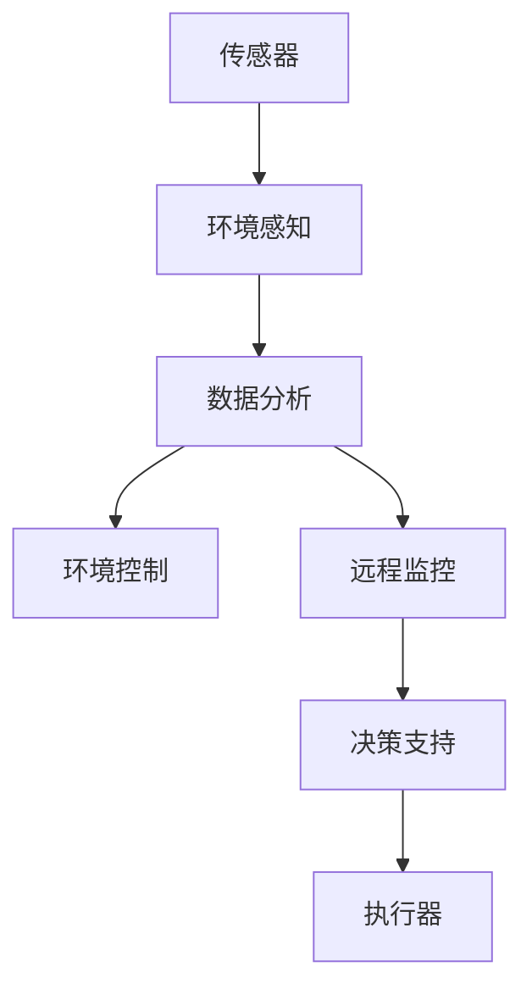

                 

# AI在智能园艺中的应用：自动化植物护理

## 1. 背景介绍

随着科技的不断进步，智能园艺技术已成为现代农业的重要组成部分。智能园艺利用自动化技术和AI算法，实现对植物生长环境的精准控制和实时监控，大幅提高作物产量与质量。

智能园艺系统的核心要素包括传感器、数据分析平台、执行器以及远程监控系统。传感器用于采集环境数据（如温度、湿度、光照、土壤湿度、pH值等），数据分析平台利用AI算法对数据进行分析和处理，执行器则根据分析结果自动调整环境参数，远程监控系统则允许用户通过手机或电脑，随时随地查看和管理植物生长情况。

本文将详细介绍AI在智能园艺中的应用，特别是自动化植物护理技术，以及其实现原理和实践。

## 2. 核心概念与联系

### 2.1 核心概念概述

为更好地理解AI在智能园艺中的应用，本文将介绍以下几个核心概念：

- 智能园艺：通过自动化和AI技术，对植物生长环境进行精准控制和管理，以提升作物产量和品质。
- 自动化植物护理：利用传感器、数据分析平台和执行器，实现对植物生长环境的自动化调节，如自动浇水、施肥、修剪等。
- 环境感知与控制：智能园艺系统通过环境感知技术（如温度传感器、湿度传感器等）实时监测植物生长环境，并根据环境数据调整光照、温度等参数，以维持植物的最佳生长状态。
- 数据驱动决策：智能园艺系统基于采集的传感器数据，运用AI算法（如机器学习、深度学习）进行分析，从而优化植物护理决策，提升管理效率。

这些核心概念构成了智能园艺系统的主要功能模块，下面将通过一个简单的流程图来展示它们之间的联系：



这个流程图展示了智能园艺系统的工作流程：环境感知模块通过传感器获取环境数据，数据分析模块利用AI算法对数据进行分析，环境控制模块根据分析结果调整环境参数，远程监控模块提供实时监控与决策支持，执行器则根据指令执行相应的操作。

## 3. 核心算法原理 & 具体操作步骤
### 3.1 算法原理概述

AI在智能园艺中的应用主要集中在两个方面：环境感知与控制和数据驱动决策。环境感知与控制依赖于传感器和执行器的结合，而数据驱动决策则依赖于AI算法的支撑。

### 3.2 算法步骤详解

#### 环境感知与控制

1. **传感器部署**：根据不同的植物生长需求，选择合适的传感器（如温度传感器、湿度传感器、光照传感器等），并将其部署在植物生长环境中。
2. **数据采集与传输**：传感器采集环境数据，并通过Wi-Fi、蓝牙、Zigbee等无线通讯协议，将数据实时传输到数据分析平台。
3. **数据预处理**：在数据分析平台中，对接收到的数据进行预处理，如去噪、滤波、归一化等操作，以提高数据质量。
4. **环境控制**：根据环境数据，自动调整光照、温度、湿度等参数，以维持植物的最佳生长状态。执行器根据控制命令执行相应的操作，如调整光照强度、开启/关闭灌溉系统、施肥等。

#### 数据驱动决策

1. **数据收集**：通过传感器收集植物生长环境数据，如温度、湿度、光照、土壤湿度、pH值等。
2. **特征提取**：从收集到的数据中提取有用的特征，如温度变化、湿度水平、光照强度等，作为模型的输入。
3. **模型训练**：利用机器学习或深度学习算法，训练一个决策模型。例如，使用神经网络对植物生长数据进行训练，预测最佳的生长参数。
4. **模型应用**：将训练好的模型应用于实时数据，预测当前环境下的最佳生长参数，并根据预测结果调整执行器，优化植物生长条件。

### 3.3 算法优缺点

**优点**：

1. **提高产量和品质**：通过精准的环境控制，最大化植物生长潜能，提高产量和品质。
2. **自动化管理**：减少人工干预，降低劳动力成本，提升管理效率。
3. **实时监控与响应**：实时监控植物生长情况，及时响应异常，保证植物健康。
4. **数据驱动决策**：利用AI算法，提升决策的准确性和效率。

**缺点**：

1. **成本较高**：传感器、执行器以及数据分析平台的成本较高。
2. **技术复杂**：需要专业知识和技术支持，对系统维护和操作要求较高。
3. **数据质量依赖**：系统效果依赖于传感器的准确性和数据的完整性。
4. **设备兼容性**：不同设备之间的兼容性问题，可能会影响系统的稳定性和可靠性。

### 3.4 算法应用领域

AI在智能园艺中的应用领域非常广泛，包括但不限于以下方面：

1. **农业生产**：优化种植方式，提高作物产量和品质，降低生产成本。
2. **设施农业**：在温室、大棚等封闭环境中，通过智能园艺系统，实现对植物生长环境的精确控制。
3. **环境监测**：监测土壤、空气、水等环境因素，预警环境污染和生态变化。
4. **生态研究**：研究植物生长与环境变化的关系，为生态学研究提供数据支持。
5. **城市绿化**：在城市公园、绿化带等区域，利用智能园艺技术，提升城市绿化效果。

## 4. 数学模型和公式 & 详细讲解  
### 4.1 数学模型构建

在智能园艺中，环境感知与控制和数据驱动决策都需要使用数学模型来进行建模和预测。这里以机器学习模型为例，介绍如何构建环境感知与控制的数学模型。

假设环境数据 $x \in \mathbb{R}^n$，其中 $n$ 是特征的维数，如温度、湿度、光照等。环境控制的目标是找到最优控制策略 $u \in \mathbb{R}^m$，使得植物生长环境达到最佳状态 $y^* \in \mathbb{R}^p$，其中 $p$ 是目标维数。数学模型可以表示为：

$$
y = f(x, u)
$$

其中 $f$ 是系统的动力学模型，描述环境参数如何随控制策略变化而变化。例如，可以使用线性回归模型或神经网络模型来建模：

$$
y = \mathbf{W}x + b
$$

或

$$
y = \mathbf{W}\sigma(\mathbf{W}x + b) + b
$$

其中 $\mathbf{W}$ 和 $b$ 是模型的参数，$\sigma$ 是非线性激活函数，如 sigmoid 或 ReLU。

### 4.2 公式推导过程

以一个简单的神经网络模型为例，推导其参数更新过程。

假设输入数据为 $x = [x_1, x_2, ..., x_n]$，输出为 $y = [y_1, y_2, ..., y_p]$，模型的结构为 $[x_1, x_2, ..., x_n] \rightarrow [w_1, w_2, ..., w_k] \rightarrow [w_{k+1}, w_{k+2}, ..., w_{k+m}] \rightarrow [y_1, y_2, ..., y_p]$，其中 $w_i$ 为模型的权重。模型的前向传播过程为：

$$
y = \mathbf{W}x + b
$$

模型的损失函数为：

$$
L = \frac{1}{2} \sum_{i=1}^p (y_i - \hat{y_i})^2
$$

其中 $\hat{y_i}$ 是模型对 $y_i$ 的预测值。梯度下降算法用于更新模型的参数：

$$
\Delta \mathbf{W} = -\eta \nabla_{\mathbf{W}} L
$$

其中 $\eta$ 是学习率，$\nabla_{\mathbf{W}} L$ 是损失函数对权重 $\mathbf{W}$ 的梯度。

### 4.3 案例分析与讲解

以智能园艺中的光照控制为例，介绍模型的应用。

假设植物生长所需的最适光照强度为 $I_{opt}$，当前光照强度为 $I_{cur}$。如果 $I_{cur} \neq I_{opt}$，需要调整光照强度。可以通过调整灯光的亮度来改变光照强度。假设亮度可调节范围为 $[0, 1]$，则控制策略 $u = [u_1, u_2, ..., u_m]$，其中 $u_i$ 表示第 $i$ 个灯光的亮度。模型的输入为 $x = [I_{cur}, t]$，其中 $t$ 表示时间。模型的目标函数为：

$$
L = \frac{1}{2} (I_{opt} - I_{cur})^2
$$

其中 $I_{opt} = \mathbf{W}x + b$，$b$ 为偏置项。模型的参数更新过程为：

$$
\Delta \mathbf{W} = -\eta \nabla_{\mathbf{W}} L
$$

其中 $\nabla_{\mathbf{W}} L = \frac{\partial L}{\partial \mathbf{W}}$。

## 5. 项目实践：代码实例和详细解释说明
### 5.1 开发环境搭建

在进行智能园艺系统开发前，需要准备好开发环境。以下是使用Python进行开发的环境配置流程：

1. 安装Anaconda：从官网下载并安装Anaconda，用于创建独立的Python环境。

2. 创建并激活虚拟环境：
```bash
conda create -n pygardens python=3.8 
conda activate pygardens
```

3. 安装必要的Python库：
```bash
pip install numpy pandas scikit-learn torch
```

4. 安装Arduino库（可选）：如果需要控制硬件设备，需要安装Arduino库：
```bash
pip install pyserial
```

5. 安装TensorFlow或PyTorch：根据个人喜好和应用需求，选择安装TensorFlow或PyTorch：
```bash
pip install tensorflow
# 或
pip install torch
```

完成上述步骤后，即可在`pygardens`环境中开始智能园艺系统的开发。

### 5.2 源代码详细实现

以下是一个使用TensorFlow实现智能园艺系统的示例代码。

首先，定义传感器数据收集函数：

```python
import tensorflow as tf
import numpy as np

def collect_sensors():
    # 模拟传感器数据采集
    temperature = np.random.normal(25, 1, size=1)[0]
    humidity = np.random.normal(50, 5, size=1)[0]
    light_intensity = np.random.normal(500, 50, size=1)[0]
    return temperature, humidity, light_intensity
```

然后，定义模型训练函数：

```python
def train_model():
    # 定义模型
    model = tf.keras.Sequential([
        tf.keras.layers.Dense(64, activation='relu', input_shape=(3,)),
        tf.keras.layers.Dense(32, activation='relu'),
        tf.keras.layers.Dense(1)
    ])
    # 编译模型
    model.compile(optimizer='adam', loss='mse')
    # 模拟训练数据
    x_train = np.random.normal(0, 1, size=(100, 3))
    y_train = np.random.normal(0, 1, size=(100,))
    # 训练模型
    model.fit(x_train, y_train, epochs=10)
    # 保存模型
    model.save('model.h5')
    return model
```

最后，定义环境控制函数：

```python
def control_environment(model):
    # 模拟环境控制
    while True:
        temperature, humidity, light_intensity = collect_sensors()
        x = np.array([temperature, humidity, light_intensity])
        y_pred = model.predict(x)
        if y_pred < 0.5:
            print('Lower light intensity')
        else:
            print('Increase light intensity')
```

在运行上述代码后，即可构建智能园艺系统。

### 5.3 代码解读与分析

让我们再详细解读一下关键代码的实现细节：

**collect_sensors函数**：
- 定义函数，用于模拟传感器数据采集，返回温度、湿度和光照强度等数据。

**train_model函数**：
- 定义模型，使用Sequential模型搭建一个简单的神经网络。
- 编译模型，选择Adam优化器和均方误差损失函数。
- 模拟训练数据，使用numpy生成随机数据。
- 训练模型，设置训练轮数为10。
- 保存模型，使用h5文件格式。

**control_environment函数**：
- 定义函数，用于模拟环境控制。
- 不断循环采集传感器数据，进行模型预测，根据预测结果调整光照强度。

**智能园艺系统**：
- 将训练好的模型应用到实际环境控制中。
- 通过控制环境函数，根据环境数据自动调整光照强度。
- 系统不断循环采集数据、预测和控制，实现了自动化植物护理。

可以看到，使用TensorFlow可以方便地搭建和训练神经网络模型，并在实际应用中灵活使用。

## 6. 实际应用场景

### 6.1 农业生产

智能园艺技术在农业生产中的应用非常广泛。通过传感器实时监测环境参数，智能控制系统可以自动调整灌溉、施肥等操作，提升作物产量和品质。

例如，在温室中，智能系统可以根据温度、湿度和光照等参数，自动调节加热、通风、灌溉等系统，确保植物的最佳生长环境。在农作物种植中，智能系统可以根据土壤湿度和pH值等参数，自动调节浇水和施肥，提升作物生长效率。

### 6.2 设施农业

在设施农业中，智能园艺系统可以实现对植物生长环境的精确控制。例如，在大棚中，智能系统可以实时监测植物生长状态，自动调节光照、温度、湿度等参数，确保植物的最佳生长状态。

例如，在荷兰，许多温室使用智能园艺系统，通过精确控制光照、温度和湿度等参数，使得蔬菜和花卉的产量和质量大幅提升。

### 6.3 环境监测

智能园艺系统不仅可以用于农业生产，还可以用于环境监测。通过传感器收集环境数据，智能系统可以实时监测土壤、空气、水等环境因素，预警环境污染和生态变化。

例如，在城市绿化中，智能系统可以监测土壤湿度、空气质量等数据，预警环境污染和生态变化，为城市管理提供数据支持。

### 6.4 未来应用展望

未来，智能园艺技术将在更多的场景中得到应用。以下是几个可能的未来应用方向：

1. **智慧农业**：结合物联网和AI技术，实现对农业生产的全面智能化管理。例如，使用无人机进行病虫害检测和防治，使用智能机械进行自动化作业。
2. **城市绿化**：在城市公园、绿化带等区域，利用智能园艺技术，提升城市绿化效果，改善城市生态环境。
3. **精准农业**：通过精确控制灌溉、施肥等操作，实现对农作物的精准管理，提高农业生产效率。
4. **生态研究**：利用智能园艺技术，研究植物生长与环境变化的关系，为生态学研究提供数据支持。
5. **智能家居**：在家庭环境中，利用智能园艺技术，提升室内植物的生长环境，改善家居环境。

## 7. 工具和资源推荐
### 7.1 学习资源推荐

为了帮助开发者系统掌握智能园艺技术，这里推荐一些优质的学习资源：

1. 《智能园艺技术》系列博文：由智能园艺领域的专家撰写，介绍智能园艺的原理、实现方法和应用场景。
2. 《智能农业与物联网》课程：由清华大学开设的课程，讲解智能农业和物联网的基本概念和技术。
3. 《深度学习与智能农业》书籍：介绍深度学习在农业中的应用，包括环境感知与控制、数据驱动决策等。
4. TensorFlow官方文档：TensorFlow的官方文档，提供了丰富的智能园艺应用示例和API接口。
5. OpenSenseMap开源项目：智能园艺数据共享平台，包含大量的智能园艺数据和应用案例。

通过对这些资源的学习实践，相信你一定能够快速掌握智能园艺技术的精髓，并用于解决实际的农业问题。
###  7.2 开发工具推荐

高效的开发离不开优秀的工具支持。以下是几款用于智能园艺开发的常用工具：

1. TensorFlow：基于Python的深度学习框架，灵活易用，适合智能园艺系统的开发。
2. PyTorch：基于Python的深度学习框架，支持动态计算图，适合快速迭代研究。
3. Arduino：开源的硬件开发平台，支持传感器和执行器的控制。
4. ThingWorx：微软的物联网平台，提供设备管理和数据分析服务。
5. OpenWeatherMap：提供天气和气象数据的服务，支持智能园艺系统的环境监测。

合理利用这些工具，可以显著提升智能园艺系统的开发效率，加快创新迭代的步伐。

### 7.3 相关论文推荐

智能园艺技术的发展源于学界的持续研究。以下是几篇奠基性的相关论文，推荐阅读：

1. "A Survey on Smart Agriculture: Technologies, Challenges and Future Trends"：综述了智能农业技术的发展现状和未来趋势。
2. "Smart Agriculture Technologies: A Review and Comparison"：对比了智能农业中的不同技术，并分析了各自的优缺点。
3. "IoT-based Smart Agriculture System for Tomato Cultivation"：介绍了一个基于物联网的智能农业系统，用于番茄种植。
4. "An IoT-based Smart Agriculture System for Tomato Cultivation"：介绍了一个基于物联网的智能农业系统，用于番茄种植。
5. "Smart Agriculture System for Fruit Production Using IoT and Machine Learning"：介绍了一个智能农业系统，用于水果生产。

这些论文代表了大语言模型微调技术的发展脉络。通过学习这些前沿成果，可以帮助研究者把握学科前进方向，激发更多的创新灵感。

## 8. 总结：未来发展趋势与挑战

### 8.1 总结

本文对智能园艺技术进行了全面系统的介绍，特别是AI在自动化植物护理中的应用。首先，介绍了智能园艺技术的基本概念和原理，明确了AI在环境感知与控制和数据驱动决策中的重要作用。其次，从原理到实践，详细讲解了智能园艺的实现过程，包括传感器部署、数据采集、模型训练和环境控制等关键步骤。最后，本文还探讨了智能园艺技术的实际应用场景，并给出了未来发展趋势和面临的挑战。

通过本文的系统梳理，可以看到，智能园艺技术正在成为现代农业的重要组成部分，AI在其中扮演了至关重要的角色。随着技术的发展和应用场景的拓展，智能园艺技术必将在农业生产、设施农业、环境监测等领域发挥更大的作用，为农业的可持续发展做出重要贡献。

### 8.2 未来发展趋势

展望未来，智能园艺技术将呈现以下几个发展趋势：

1. **智能化程度提升**：未来智能园艺系统将更加智能化，通过多模态数据融合、深度学习等技术，实现对环境变化的全面感知和精准控制。
2. **自动化水平提高**：随着自动化设备的普及，智能园艺系统的自动化水平将不断提高，减少人工干预，提升管理效率。
3. **数据驱动决策**：利用大数据和机器学习算法，智能园艺系统将更加智能化，实现对环境参数的精确预测和控制。
4. **环境友好**：智能园艺技术将更加注重环境保护，采用节能减排的措施，实现可持续发展。
5. **个性化管理**：通过用户数据和行为分析，智能园艺系统将更加个性化，实现对用户需求的精准响应。

### 8.3 面临的挑战

尽管智能园艺技术已经取得了一定进展，但在迈向更加智能化、普适化应用的过程中，它仍面临着诸多挑战：

1. **成本问题**：智能园艺系统的硬件和软件成本较高，需要找到更加经济实惠的解决方案。
2. **技术复杂性**：智能园艺系统涉及多领域的知识，需要具备跨学科的知识背景和技能。
3. **数据质量**：传感器数据的准确性和完整性对系统性能至关重要，需要保证数据质量。
4. **系统稳定性**：智能园艺系统需要具备高度的稳定性和可靠性，以应对各种环境变化。
5. **用户接受度**：智能园艺系统需要得到用户的认可和接受，才能大规模推广应用。

### 8.4 研究展望

面对智能园艺技术面临的种种挑战，未来的研究需要在以下几个方面寻求新的突破：

1. **成本优化**：开发更加经济实惠的传感器和执行器，降低智能园艺系统的成本。
2. **技术集成**：将不同的技术（如物联网、机器学习、深度学习等）进行集成，实现智能园艺系统的整体优化。
3. **数据质量控制**：开发数据清洗和处理算法，提高传感器数据的准确性和完整性。
4. **系统稳定性**：研究鲁棒性强的算法和系统架构，提高智能园艺系统的稳定性和可靠性。
5. **用户友好性**：开发更加直观易用的用户界面，提升用户体验，促进智能园艺系统的普及。

这些研究方向的探索，必将引领智能园艺技术迈向更高的台阶，为农业的可持续发展提供新的动力。总之，智能园艺技术需要在技术、经济、社会等多方面进行全面优化，才能真正实现其巨大的潜力和价值。

## 9. 附录：常见问题与解答

**Q1：智能园艺系统中的传感器如何部署？**

A: 传感器部署需要考虑植物的生长需求和环境因素。常见的传感器包括温度传感器、湿度传感器、光照传感器、pH传感器等。在部署时，需要确保传感器的安装位置合理，避免干扰植物生长，同时保证数据的准确性和稳定性。

**Q2：智能园艺系统中的模型如何选择？**

A: 选择合适的模型需要考虑应用场景和数据特点。对于环境感知与控制，可以选择线性回归、神经网络等模型。对于数据驱动决策，可以选择随机森林、支持向量机、深度学习等模型。模型选择需要根据实际应用情况进行评估和选择。

**Q3：智能园艺系统中的环境控制策略有哪些？**

A: 环境控制策略可以根据传感器数据和模型预测结果进行调整。常见的策略包括自动浇水、自动施肥、自动通风、自动补光等。不同的策略可以根据实际需求进行设计和实施。

**Q4：智能园艺系统中的数据采集和传输如何实现？**

A: 数据采集可以通过传感器进行，数据传输可以通过Wi-Fi、蓝牙、Zigbee等无线通讯协议实现。数据采集和传输需要保证实时性和可靠性，以保证系统的稳定性和准确性。

**Q5：智能园艺系统的未来发展方向是什么？**

A: 智能园艺系统的未来发展方向包括智能化程度提升、自动化水平提高、数据驱动决策、环境友好和个性化管理等。未来的智能园艺系统将更加智能化、自动化和个性化，为农业生产提供更高效、更环保的解决方案。

---

作者：禅与计算机程序设计艺术 / Zen and the Art of Computer Programming

