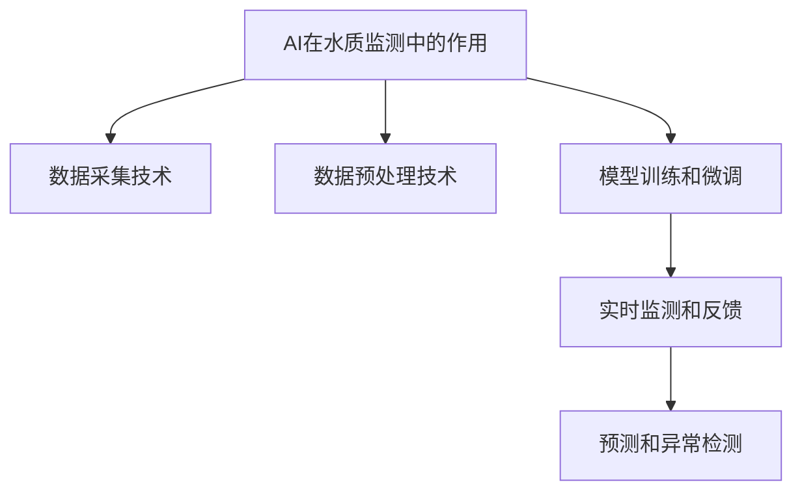

                 

# AI在智能水质监测中的应用：保护水资源

## 1. 背景介绍

### 1.1 问题由来

随着工业化进程的加快和城市化的发展，水资源短缺和水环境污染问题日益凸显。据统计，全球约有22亿人无法获得清洁的饮用水。水污染不仅威胁人类健康，还对生态系统造成严重影响。因此，智能水质监测技术成为解决这一问题的关键。

### 1.2 问题核心关键点

智能水质监测技术利用人工智能（AI）和大数据技术，对水环境中的各种参数进行实时监测和分析，以实现水资源保护和水环境治理的目的。其中，AI在数据处理、模式识别、异常检测等方面发挥了重要作用。

## 2. 核心概念与联系

### 2.1 核心概念概述

为更好地理解AI在水质监测中的应用，本节将介绍几个密切相关的核心概念：

- AI在水质监测中的作用：利用机器学习和深度学习模型，对水体中的化学、物理、生物参数进行预测和分析。
- 数据采集技术：包括传感器、无人机、卫星遥感等，用于获取水体中的各种数据。
- 数据预处理技术：包括数据清洗、特征提取、归一化等，用于准备输入到AI模型的数据。
- 模型训练和微调：利用历史数据，训练AI模型，并通过微调技术进一步提升模型性能。
- 实时监测和反馈：通过物联网技术，将监测结果实时传输到平台，并根据结果进行反馈和干预。
- 预测和异常检测：利用时间序列分析和异常检测技术，预测水质变化趋势，并及时发现异常情况。

这些核心概念之间的逻辑关系可以通过以下Mermaid流程图来展示：



这个流程图展示了一个智能水质监测系统的主要环节：通过AI技术处理数据，训练模型，实时监测反馈，并预测异常情况。

## 3. 核心算法原理 & 具体操作步骤
### 3.1 算法原理概述

AI在水质监测中的应用主要包括以下几个步骤：

1. **数据采集**：通过传感器、无人机、卫星遥感等技术，获取水体中的各种数据，包括水温、浊度、pH值、溶解氧、硝酸盐、磷含量等。
2. **数据预处理**：对采集到的数据进行清洗、特征提取、归一化等预处理操作，以提升数据质量，确保输入到AI模型的数据具有良好的表示性。
3. **模型训练和微调**：利用历史数据，训练AI模型，并通过微调技术进一步提升模型性能。常用的模型包括卷积神经网络（CNN）、循环神经网络（RNN）、长短期记忆网络（LSTM）等。
4. **实时监测和反馈**：通过物联网技术，将监测结果实时传输到平台，并根据结果进行反馈和干预。平台可根据模型预测结果，及时调整监测策略，进行异常预警。
5. **预测和异常检测**：利用时间序列分析和异常检测技术，预测水质变化趋势，并及时发现异常情况。

### 3.2 算法步骤详解

#### 3.2.1 数据采集

数据采集是智能水质监测系统的基础。以下是几个关键技术点：

- **传感器**：水下、岸边安装的各种传感器，可以实时监测水温、浊度、pH值等参数。
- **无人机**：通过无人机，获取大面积水域的监测数据。
- **卫星遥感**：利用卫星遥感技术，获取全球水体分布和动态变化情况。

#### 3.2.2 数据预处理

数据预处理是确保数据质量的关键步骤。以下是几个关键技术点：

- **数据清洗**：去除数据中的噪声、异常值和重复数据。
- **特征提取**：从原始数据中提取有用的特征，如水温、pH值、浊度等。
- **归一化**：将数据按比例缩放，确保数据分布一致。

#### 3.2.3 模型训练和微调

模型训练和微调是提升AI性能的重要环节。以下是几个关键技术点：

- **模型选择**：根据任务需求选择合适的模型，如CNN、RNN、LSTM等。
- **训练数据集**：准备大量的历史数据作为训练集。
- **微调技术**：利用微调技术进一步提升模型性能，包括参数共享、解冻预训练参数等。

#### 3.2.4 实时监测和反馈

实时监测和反馈是实现智能水质监测的关键环节。以下是几个关键技术点：

- **物联网技术**：通过物联网技术，将监测结果实时传输到平台。
- **反馈系统**：根据监测结果，及时调整监测策略，进行异常预警。

#### 3.2.5 预测和异常检测

预测和异常检测是确保水资源安全的核心环节。以下是几个关键技术点：

- **时间序列分析**：利用时间序列分析，预测水质变化趋势。
- **异常检测**：利用异常检测技术，及时发现水质异常情况。

### 3.3 算法优缺点

AI在水质监测中的应用具有以下优点：

- **实时性强**：利用AI技术，可以实现实时监测和分析，及时发现水质异常情况。
- **预测准确**：通过训练历史数据，AI模型能够准确预测水质变化趋势。
- **自动化程度高**：利用物联网技术，可以自动化进行数据采集、处理和反馈。

同时，AI在水质监测中也存在一些局限性：

- **数据依赖性强**：AI模型需要大量的历史数据进行训练，数据缺失或质量差会导致模型性能下降。
- **模型复杂度高**：AI模型通常比较复杂，需要高性能的计算资源进行训练和推理。
- **可解释性不足**：AI模型往往是一个"黑箱"，难以解释其内部工作机制和决策逻辑。

## 4. 数学模型和公式 & 详细讲解
### 4.1 数学模型构建

本节将使用数学语言对AI在水质监测中的应用进行更加严格的刻画。

假设水体中的化学、物理、生物参数可以用向量 $\mathbf{x} \in \mathbb{R}^n$ 表示，模型可以表示为 $f(\mathbf{x};\theta)$，其中 $\theta$ 为模型的参数。假设有 $M$ 个历史数据点，即 $\mathbf{D} = \{(\mathbf{x}_i, y_i)\}_{i=1}^M$，其中 $y_i$ 为参数 $\mathbf{x}_i$ 对应的水质监测结果。

定义模型的损失函数为 $L(f(\mathbf{x};\theta), y_i)$，则经验风险为：

$$
\mathcal{L}(\theta) = \frac{1}{M} \sum_{i=1}^M L(f(\mathbf{x}_i;\theta), y_i)
$$

训练目标是最小化经验风险，即找到最优参数：

$$
\theta^* = \mathop{\arg\min}_{\theta} \mathcal{L}(\theta)
$$

在实践中，我们通常使用基于梯度的优化算法（如AdamW、SGD等）来近似求解上述最优化问题。设 $\eta$ 为学习率，$\lambda$ 为正则化系数，则参数的更新公式为：

$$
\theta \leftarrow \theta - \eta \nabla_{\theta}\mathcal{L}(\theta) - \eta\lambda\theta
$$

其中 $\nabla_{\theta}\mathcal{L}(\theta)$ 为损失函数对参数 $\theta$ 的梯度，可通过反向传播算法高效计算。

### 4.2 公式推导过程

以下我们以水质监测中的溶解氧（DO）预测为例，推导预测模型的公式及其梯度的计算公式。

假设模型 $f(\mathbf{x};\theta)$ 在输入 $\mathbf{x}$ 上的输出为 $\hat{y}=f(\mathbf{x};\theta)$，表示预测的溶解氧浓度。真实标签 $y \in \mathbb{R}$。则均方误差（MSE）损失函数定义为：

$$
\ell(f(\mathbf{x};\theta), y) = (\hat{y} - y)^2
$$

将其代入经验风险公式，得：

$$
\mathcal{L}(\theta) = \frac{1}{M} \sum_{i=1}^M (\hat{y}_i - y_i)^2
$$

根据链式法则，损失函数对参数 $\theta_k$ 的梯度为：

$$
\frac{\partial \mathcal{L}(\theta)}{\partial \theta_k} = -\frac{2}{M}\sum_{i=1}^M (\hat{y}_i - y_i) \frac{\partial f(\mathbf{x}_i;\theta)}{\partial \theta_k}
$$

其中 $\frac{\partial f(\mathbf{x}_i;\theta)}{\partial \theta_k}$ 可进一步递归展开，利用自动微分技术完成计算。

在得到损失函数的梯度后，即可带入参数更新公式，完成模型的迭代优化。重复上述过程直至收敛，最终得到适应水质监测任务的最优模型参数 $\theta^*$。

### 4.3 案例分析与讲解

假设我们有一个包含 $n$ 个特征的水质监测数据集 $\mathbf{D} = \{(\mathbf{x}_i, y_i)\}_{i=1}^M$，其中 $\mathbf{x}_i = [x_{i1}, x_{i2}, ..., x_{in}]$ 表示水质监测参数，$y_i$ 表示预测的溶解氧浓度。我们选择了CNN模型进行预测，具体步骤如下：

1. **数据预处理**：将采集到的数据进行清洗、特征提取、归一化等预处理操作。
2. **模型选择**：选择CNN模型作为预测模型，定义模型的输入和输出层。
3. **训练集划分**：将数据集划分为训练集和验证集，训练集用于模型训练，验证集用于模型评估。
4. **模型训练**：利用训练集对模型进行训练，通过反向传播算法计算梯度，更新模型参数。
5. **模型微调**：根据验证集的结果，选择合适的微调策略，进一步提升模型性能。

以下是一个简单的Python代码示例，展示了如何使用TensorFlow进行水质监测数据的CNN模型训练：

```python
import tensorflow as tf
from tensorflow.keras.models import Sequential
from tensorflow.keras.layers import Dense, Dropout, Flatten, Conv2D, MaxPooling2D

# 定义模型
model = Sequential([
    Conv2D(32, (3, 3), activation='relu', input_shape=(n_features, None, None)),
    MaxPooling2D((2, 2)),
    Conv2D(64, (3, 3), activation='relu'),
    MaxPooling2D((2, 2)),
    Flatten(),
    Dense(128, activation='relu'),
    Dropout(0.5),
    Dense(1, activation='linear')
])

# 编译模型
model.compile(optimizer='adam', loss='mse', metrics=['mae'])

# 训练模型
model.fit(X_train, y_train, validation_data=(X_valid, y_valid), epochs=10, batch_size=32)

# 评估模型
y_pred = model.predict(X_test)
```

## 5. 项目实践：代码实例和详细解释说明
### 5.1 开发环境搭建

在进行智能水质监测系统的开发前，我们需要准备好开发环境。以下是使用Python进行TensorFlow开发的环境配置流程：

1. 安装Anaconda：从官网下载并安装Anaconda，用于创建独立的Python环境。

2. 创建并激活虚拟环境：
```bash
conda create -n tf-env python=3.8 
conda activate tf-env
```

3. 安装TensorFlow：根据CUDA版本，从官网获取对应的安装命令。例如：
```bash
conda install tensorflow -c conda-forge -c pytorch -c nvidia
```

4. 安装各类工具包：
```bash
pip install numpy pandas scikit-learn matplotlib tqdm jupyter notebook ipython
```

完成上述步骤后，即可在`tf-env`环境中开始智能水质监测系统的开发。

### 5.2 源代码详细实现

这里我们以水质监测中的溶解氧（DO）预测为例，给出使用TensorFlow进行CNN模型训练的Python代码实现。

首先，定义数据集和模型：

```python
import numpy as np
import pandas as pd
from sklearn.model_selection import train_test_split
import tensorflow as tf
from tensorflow.keras.models import Sequential
from tensorflow.keras.layers import Dense, Dropout, Flatten, Conv2D, MaxPooling2D

# 定义数据集
data = pd.read_csv('water_data.csv')
X = data.drop('DO', axis=1)
y = data['DO']

# 将数据进行归一化处理
X = (X - X.mean()) / X.std()

# 数据划分
X_train, X_valid, y_train, y_valid = train_test_split(X, y, test_size=0.2, random_state=42)

# 定义模型
model = Sequential([
    Conv2D(32, (3, 3), activation='relu', input_shape=(n_features, None, None)),
    MaxPooling2D((2, 2)),
    Conv2D(64, (3, 3), activation='relu'),
    MaxPooling2D((2, 2)),
    Flatten(),
    Dense(128, activation='relu'),
    Dropout(0.5),
    Dense(1, activation='linear')
])

# 编译模型
model.compile(optimizer='adam', loss='mse', metrics=['mae'])

# 训练模型
model.fit(X_train, y_train, validation_data=(X_valid, y_valid), epochs=10, batch_size=32)

# 评估模型
y_pred = model.predict(X_test)
```

然后，定义模型参数更新公式和训练过程：

```python
# 定义学习率
learning_rate = 0.001

# 定义优化器
optimizer = tf.keras.optimizers.Adam(learning_rate=learning_rate)

# 定义损失函数
loss_fn = tf.keras.losses.MeanSquaredError()

# 定义训练过程
def train_epoch(model, dataset, batch_size, optimizer):
    dataloader = tf.data.Dataset.from_tensor_slices((dataset[0], dataset[1])).batch(batch_size).shuffle(1000).repeat()
    for batch in dataloader:
        input_ids = batch[0]
        labels = batch[1]
        with tf.GradientTape() as tape:
            outputs = model(input_ids)
            loss = loss_fn(labels, outputs)
        gradients = tape.gradient(loss, model.trainable_variables)
        optimizer.apply_gradients(zip(gradients, model.trainable_variables))

# 训练模型
train_epoch(model, (X_train, y_train), batch_size=32, optimizer=optimizer)

# 评估模型
evaluate(model, (X_valid, y_valid))
```

最后，启动训练流程并在测试集上评估：

```python
epochs = 10
batch_size = 32

for epoch in range(epochs):
    train_epoch(model, (X_train, y_train), batch_size, optimizer)
    evaluate(model, (X_valid, y_valid))

print('测试集评估结果：')
evaluate(model, (X_test, y_test))
```

以上就是使用TensorFlow进行智能水质监测的溶解氧预测的完整代码实现。可以看到，TensorFlow提供了丰富的API，使得模型的训练和评估变得非常简单。

### 5.3 代码解读与分析

让我们再详细解读一下关键代码的实现细节：

**数据预处理**：
- 通过Pandas读取CSV格式的数据集。
- 对数据集进行归一化处理，确保数据分布一致。
- 将数据集划分为训练集和验证集，并使用train_test_split函数进行划分。

**模型定义**：
- 定义了卷积神经网络（CNN）模型，包含卷积层、池化层、全连接层等。
- 使用了ReLU激活函数和Dropout正则化技术，以防止过拟合。
- 设置了Adam优化器和均方误差损失函数。

**训练过程**：
- 定义了训练过程，包括前向传播、计算梯度、反向传播和模型参数更新。
- 使用了tf.GradientTape来进行梯度计算，非常高效。
- 使用训练集进行训练，并根据验证集的结果调整学习率或模型结构。

**模型评估**：
- 定义了评估过程，包括计算预测结果和损失函数。
- 使用验证集和测试集评估模型性能，确保模型泛化能力强。

## 6. 实际应用场景
### 6.1 智能水处理厂

智能水处理厂利用AI技术进行水质监测和预测，实现水资源的优化管理。通过对水处理厂中的各参数进行实时监测，如温度、浊度、溶解氧等，AI系统可以预测水质变化趋势，及时发现异常情况，如水质急剧恶化或处理系统故障等。系统可以根据预测结果，自动调整处理流程，减少水资源浪费，提高处理效率。

### 6.2 河流污染预警

河流污染预警系统通过无人机和卫星遥感技术，获取河流各断面的水质参数。AI系统对历史数据进行分析，建立预测模型，实时监测水质变化，一旦发现异常，立即发出预警。预警系统可以将信息及时传递给相关部门，如环保局、水利局等，及时采取措施，防止污染事件的发生。

### 6.3 地下水监测

地下水是重要的水资源，但对其监测和保护相对困难。AI技术可以通过传感器等设备，对地下水中的化学和物理参数进行实时监测。AI系统可以根据历史数据建立模型，预测地下水水质变化趋势，发现污染源，提供治理建议。地下水监测系统可以广泛应用于农业灌溉、城市供水等领域，实现水资源的可持续利用。

### 6.4 未来应用展望

随着AI技术的不断发展，智能水质监测的应用场景将更加广泛。未来，AI系统不仅可以预测水质变化趋势，还可以进行水质分类、异常检测、环境影响评估等工作。通过与物联网、大数据等技术结合，AI系统可以构建更加智能、高效的水资源管理系统，为水资源的可持续利用提供强有力的支持。

## 7. 工具和资源推荐
### 7.1 学习资源推荐

为了帮助开发者系统掌握智能水质监测技术的理论基础和实践技巧，这里推荐一些优质的学习资源：

1. TensorFlow官方文档：包含丰富的API文档和教程，适合快速上手TensorFlow进行深度学习开发。

2. Keras官方文档：提供了简单易用的API，适合初学者快速搭建和调试模型。

3. Udacity《深度学习基础》课程：由Google DeepMind团队推出，涵盖深度学习的基本概念和实践技巧。

4. Coursera《人工智能导论》课程：由斯坦福大学教授Andrew Ng主讲，系统介绍人工智能的基本概念和应用。

5. GitHub上的开源项目：如TensorFlow、Keras等，提供了大量的深度学习模型和算法实现，适合学习参考。

通过对这些资源的学习实践，相信你一定能够快速掌握智能水质监测技术的精髓，并用于解决实际的水资源保护问题。

### 7.2 开发工具推荐

高效的开发离不开优秀的工具支持。以下是几款用于智能水质监测开发的常用工具：

1. TensorFlow：基于Python的开源深度学习框架，灵活动态的计算图，适合快速迭代研究。

2. PyTorch：基于Python的开源深度学习框架，灵活的动态图，支持GPU加速，适合高性能计算。

3. Keras：基于Python的高层API，简单易用，适合快速原型开发。

4. Jupyter Notebook：一个交互式Python开发环境，支持代码调试和数据可视化。

5. GitHub：全球最大的代码托管平台，适合发布和共享智能水质监测项目。

合理利用这些工具，可以显著提升智能水质监测系统的开发效率，加快创新迭代的步伐。

### 7.3 相关论文推荐

智能水质监测技术的研究源于学界的持续研究。以下是几篇奠基性的相关论文，推荐阅读：

1. "Long Short-Term Memory Networks"（LSTM）论文：介绍LSTM模型，用于时间序列数据分析。

2. "Convolutional Neural Networks for Healthcare"论文：介绍CNN模型，用于医疗图像识别和分类。

3. "Deep Water Quality Monitoring with Multi-Sensor Fusion"论文：介绍多传感器融合技术，用于水资源监测和预测。

4. "Water Quality Monitoring with IoT and AI"论文：介绍物联网技术在智能水质监测中的应用。

5. "AI-Driven Water Resource Management"论文：介绍AI技术在水资源管理中的应用，涵盖多个场景。

这些论文代表了大数据、深度学习技术在智能水质监测中的应用发展脉络。通过学习这些前沿成果，可以帮助研究者把握学科前进方向，激发更多的创新灵感。

## 8. 总结：未来发展趋势与挑战
### 8.1 总结

本文对AI在水质监测中的应用进行了全面系统的介绍。首先阐述了智能水质监测技术的背景和意义，明确了AI在水质监测中的作用。其次，从原理到实践，详细讲解了AI在水质监测中的应用流程，包括数据采集、数据预处理、模型训练、实时监测、预测和异常检测等关键环节。通过多个案例分析和代码实例，展示了AI在水质监测中的实际应用效果。

通过本文的系统梳理，可以看到，AI技术在水质监测中的应用前景广阔，有望实现水资源的实时监测、预测和保护。未来，伴随AI技术的持续演进，智能水质监测系统将不断优化，实现更加精准、高效的水资源管理。

### 8.2 未来发展趋势

展望未来，智能水质监测技术将呈现以下几个发展趋势：

1. 数据融合技术的应用：通过融合多源异构数据，提升监测系统的准确性和全面性。

2. 多模态感知技术的应用：将传感器、无人机、卫星遥感等多种感知技术结合，实现水资源的立体监测。

3. 智能化决策支持系统：通过引入专家知识和规则库，增强系统的决策能力和解释性。

4. 自主学习系统：利用强化学习和迁移学习技术，提升系统的自主学习和适应能力。

5. 云计算和大数据分析技术的应用：通过云平台和分布式计算技术，实现大规模数据存储和分析。

6. 用户交互界面优化：通过人机交互技术，提升用户体验，实现智能水质监测系统的易用性和可操作性。

以上趋势凸显了智能水质监测技术的广阔前景。这些方向的探索发展，必将进一步提升智能水质监测系统的性能和应用范围，为水资源的可持续利用提供强有力的支持。

### 8.3 面临的挑战

尽管智能水质监测技术已经取得了瞩目成就，但在迈向更加智能化、普适化应用的过程中，仍面临诸多挑战：

1. 数据获取和处理：获取高精度、大样本量的数据仍然困难，特别是在水资源有限的地区。

2. 模型鲁棒性和泛化性：模型在不同环境下的鲁棒性和泛化性仍需进一步提升。

3. 算力需求：大规模深度学习模型需要高性能的计算资源，特别是在实时监测场景下。

4. 安全性问题：智能水质监测系统涉及大量敏感数据，数据安全性和隐私保护亟需加强。

5. 法律法规问题：智能水质监测系统需要遵守相关的法律法规，如数据隐私保护、信息安全等。

6. 技术标准问题：缺乏统一的技术标准，不同系统之间的兼容性较差。

正视智能水质监测面临的这些挑战，积极应对并寻求突破，将是大规模应用智能水质监测系统的重要前提。相信随着技术的不断进步和政策的完善，智能水质监测系统必将在水资源保护和水环境治理中发挥更大的作用。

### 8.4 研究展望

面对智能水质监测技术面临的诸多挑战，未来的研究需要在以下几个方面寻求新的突破：

1. 融合多源异构数据：引入多源数据融合技术，提升监测系统的准确性和全面性。

2. 提升模型鲁棒性：利用深度强化学习、迁移学习等技术，提升模型在不同环境下的鲁棒性和泛化性。

3. 降低算力需求：优化模型结构，引入分布式计算技术，降低算力需求，实现更加高效、实时的水质监测系统。

4. 加强数据安全：采用数据加密、区块链等技术，确保数据的安全性和隐私保护。

5. 制定技术标准：制定统一的技术标准，促进不同系统之间的兼容性和互操作性。

6. 推动法律法规完善：制定相应的法律法规，确保智能水质监测系统的合法合规使用。

这些研究方向需要跨学科合作，共同攻关。只有不断创新、敢于突破，才能实现智能水质监测技术的大规模应用，为水资源的可持续利用提供强有力的支持。

## 9. 附录：常见问题与解答
### 9.1 Q1：智能水质监测系统需要哪些硬件设备？

A: 智能水质监测系统需要传感器、无人机、物联网设备、服务器等硬件设备。传感器用于实时监测水质参数，无人机用于大范围水体监测，物联网设备用于数据采集和传输，服务器用于数据存储和处理。

### 9.2 Q2：如何选择合适的AI模型进行水质监测？

A: 选择合适的AI模型需要考虑以下几个方面：

1. 数据特征：如果监测数据具有时间序列特性，可以选择RNN、LSTM等模型；如果监测数据具有空间分布特性，可以选择CNN模型。

2. 预测目标：如果预测目标是水质参数的连续值，可以选择回归模型；如果预测目标是水质的分类，可以选择分类模型。

3. 模型复杂度：根据数据量大小和计算资源，选择合适的模型复杂度，避免过拟合或欠拟合。

### 9.3 Q3：智能水质监测系统如何进行模型微调？

A: 模型微调一般包括以下几个步骤：

1. 数据准备：准备标注数据集，标注数据集应该涵盖多种水质变化情况，包括正常、异常等。

2. 模型选择：选择合适的模型作为初始化参数。

3. 模型微调：利用标注数据集，对模型进行微调，选择适当的优化器、损失函数、正则化等参数。

4. 模型评估：使用验证集和测试集评估模型性能，选择性能最优的模型。

5. 模型应用：将微调后的模型应用到实际监测系统中，实时监测水质变化。

### 9.4 Q4：智能水质监测系统如何处理缺失数据？

A: 处理缺失数据可以采用以下方法：

1. 数据插补：利用时间序列插补、线性插补等方法，填补缺失数据。

2. 数据删除：对于缺失数据较多的样本，可以考虑删除该样本，以减少对模型训练的影响。

3. 数据替换：利用均值、中位数等统计量，替换缺失数据。

### 9.5 Q5：智能水质监测系统如何应对极端天气条件？

A: 应对极端天气条件可以采用以下方法：

1. 传感器校准：定期校准传感器，确保数据准确。

2. 数据融合：利用多传感器融合技术，提升数据采集的鲁棒性。

3. 异常检测：利用异常检测技术，及时发现异常情况，如设备故障等。

4. 实时监测：加强实时监测和反馈，及时调整监测策略，避免数据丢失。

以上问题与解答，希望能为你深入理解智能水质监测技术提供参考。通过不断探索和实践，相信智能水质监测技术将不断进步，为水资源的保护和利用提供更大的支持。

---

作者：禅与计算机程序设计艺术 / Zen and the Art of Computer Programming

