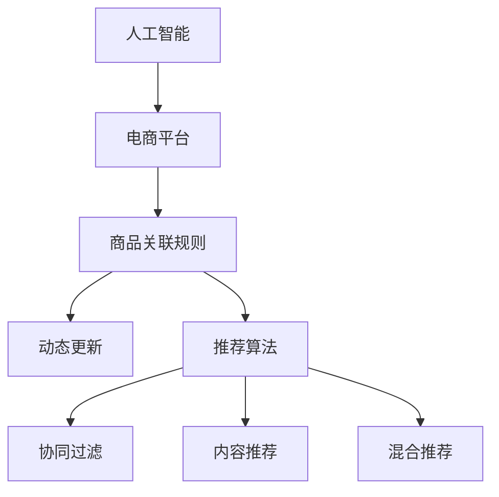

                 

# AI在电商平台商品关联规则挖掘与动态更新中的应用

> 关键词：人工智能,电商平台,商品关联规则,动态更新,关联推荐

## 1. 背景介绍

在当今数字化、智能化的时代背景下，电商平台已成为人们日常生活购物的重要渠道。电商平台的成功运营离不开对用户行为和商品特征的深度挖掘与精准推荐。然而，传统基于规则的推荐系统难以应对复杂多变的用户需求和商品动态变化，推荐结果的精准度和个性化程度也有待提高。人工智能技术，特别是机器学习和深度学习，在电商平台商品推荐中的应用日益广泛。

在电商平台的商品推荐中，核心任务是识别商品之间的关联关系，即找出用户在购买某一商品后可能感兴趣的类似或互补商品。这一过程涉及大量数据处理、模式识别和动态更新等技术。随着用户行为数据的积累和算法的不断优化，基于人工智能的商品推荐系统能够更精准地预测用户的购买意向，提升用户体验和平台收益。

## 2. 核心概念与联系

### 2.1 核心概念概述

为更好地理解AI在电商平台商品关联规则挖掘与动态更新中的应用，本节将介绍几个密切相关的核心概念：

- **人工智能（AI）**：使用算法和数据驱动的计算机系统，通过模拟人类智能解决问题和决策的能力。
- **电商平台**：提供在线商品展示、交易和客户服务的一站式平台。
- **商品关联规则**：在商品销售数据中挖掘出潜在的相关或相互依存的关系，如“用户购买A商品，更有可能购买B商品”。
- **动态更新**：随着用户行为和商品数据的不断变化，对推荐模型进行及时更新，确保推荐结果的实时性和准确性。
- **推荐算法**：基于用户行为和商品特征，通过算法模型预测用户可能感兴趣的商品，并进行推荐。
- **协同过滤**：通过分析用户间的相似度和商品间的相似度，推荐系统推荐用户未曾购买但可能喜欢的商品。
- **内容推荐**：根据商品的属性特征，推荐与用户兴趣相符的商品。
- **混合推荐**：结合协同过滤和内容推荐等不同方法，提供更全面、更精准的推荐结果。

这些核心概念之间的逻辑关系可以通过以下Mermaid流程图来展示：



这个流程图展示了一整个推荐系统的运行流程：

1. 人工智能技术应用于电商平台，帮助分析用户行为和商品数据。
2. 通过商品关联规则挖掘，识别商品间的潜在关系。
3. 在用户行为和商品数据动态变化的过程中，进行实时更新。
4. 利用推荐算法，基于不同策略和模型预测用户可能感兴趣的商品。
5. 协同过滤和内容推荐分别从用户和商品的角度，为推荐系统提供支持。
6. 混合推荐综合各种推荐方法，提供最终精准的推荐结果。

## 3. 核心算法原理 & 具体操作步骤

### 3.1 算法原理概述

基于AI的商品关联规则挖掘与动态更新，本质上是通过数据挖掘和机器学习技术，从用户行为数据和商品特征中提取有价值的关联关系，并根据新的数据动态调整推荐模型。其核心思想是：利用历史数据中的用户购买记录和商品属性特征，发现商品之间的潜在关联性，并通过实时更新，使推荐系统始终保持高效和准确。

### 3.2 算法步骤详解

基于AI的商品关联规则挖掘与动态更新一般包括以下几个关键步骤：

**Step 1: 数据准备与预处理**

- 收集电商平台的用户行为数据和商品属性数据。
- 对数据进行清洗和处理，包括去除噪声、填补缺失值、归一化等。
- 对用户行为数据进行特征工程，提取有意义的特征，如用户浏览时长、购买频率等。
- 将商品属性数据进行编码，转化为模型可处理的格式。

**Step 2: 关联规则挖掘**

- 使用数据挖掘算法（如Apriori、FP-Growth等）在用户行为数据中挖掘关联规则。
- 根据关联规则的置信度和支持度等指标，筛选出有意义的关系。
- 对挖掘得到的关联规则进行可视化，帮助理解不同商品之间的关系。

**Step 3: 模型训练与推荐**

- 选择或设计合适的机器学习模型（如协同过滤、深度学习等），根据用户行为数据和商品属性数据进行训练。
- 在训练集上优化模型参数，使得模型能较好地预测用户购买意向。
- 在训练好的模型基础上，对新用户行为数据进行实时预测，生成推荐结果。

**Step 4: 动态更新与优化**

- 随着用户行为和商品数据的持续变化，对模型进行定期更新，保持模型的最新状态。
- 引入在线学习算法，实时调整模型参数，确保推荐结果的实时性。
- 使用A/B测试等方法，评估推荐效果，及时调整策略。

**Step 5: 评估与部署**

- 在验证集上对推荐结果进行评估，使用评价指标（如准确率、召回率、F1-score等）衡量模型性能。
- 部署推荐模型到实际电商平台中，进行大规模应用。
- 收集用户反馈，进一步优化推荐算法。

以上是基于AI的商品关联规则挖掘与动态更新的一般流程。在实际应用中，还需要根据具体平台特点和业务需求，对各环节进行优化设计，如改进数据处理流程、调整模型参数、引入更多特征等。

### 3.3 算法优缺点

基于AI的商品关联规则挖掘与动态更新方法具有以下优点：

1. 能够挖掘出潜在的有价值关联规则，提升推荐系统的精准度。
2. 动态更新机制使得模型能够适应新数据，实时调整推荐策略。
3. 通过多模型融合，结合协同过滤和内容推荐等不同方法，提升推荐效果。
4. 深度学习模型具有强大的特征学习能力，能够从大规模数据中提取有意义的关联特征。

同时，该方法也存在一定的局限性：

1. 数据质量和特征选择对推荐效果有较大影响，需要谨慎处理。
2. 模型训练和优化过程中可能会遇到过拟合问题，需要采取相应措施。
3. 实时更新的复杂度较高，对计算资源和算法要求较高。
4. 不同平台的数据格式和业务需求各异，需进行定制化开发。
5. 用户隐私和数据安全问题需要充分考虑，确保合法合规。

尽管存在这些局限性，但就目前而言，基于AI的商品关联规则挖掘与动态更新方法已成为电商平台推荐系统的重要技术手段。未来相关研究的重点在于如何进一步降低计算复杂度，提高实时更新效率，同时兼顾推荐结果的精度和用户隐私保护。

### 3.4 算法应用领域

基于AI的商品关联规则挖掘与动态更新方法，在电商平台的商品推荐中已得到广泛应用，主要应用于以下场景：

- 个性化推荐：针对每个用户量身定制商品推荐，提升用户体验。
- 关联商品推荐：根据用户已购买商品，推荐相关或互补商品，提升交叉销售。
- 新商品推荐：根据历史数据和新上架商品的属性，预测用户的购买意向，促进新品销售。
- 限时优惠推荐：根据用户的浏览和购买历史，推荐限时优惠商品，提升转化率。
- 热门商品推荐：通过数据分析，推荐当前热门商品，引导用户潮流消费。

除了上述这些经典场景外，基于AI的商品关联规则挖掘与动态更新方法也被创新性地应用于更多领域，如用户行为预测、营销活动设计、库存管理等，为电商平台运营提供了新的技术支持。

## 4. 数学模型和公式 & 详细讲解 & 举例说明

### 4.1 数学模型构建

本节将使用数学语言对基于AI的商品关联规则挖掘与动态更新过程进行更加严格的刻画。

记电商平台的用户行为数据为 $U=\{(u_i,b_i)\}_{i=1}^N$，其中 $u_i$ 为用户ID，$b_i$ 为用户行为（如浏览、购买）。记商品属性数据为 $I=\{i_k\}_{k=1}^K$，其中 $i_k$ 为商品ID。

定义用户行为序列为 $S_i$，商品购买记录为 $P_i$。用户行为序列 $S_i$ 表示用户在不同时间点上的浏览、点击、购买等行为，商品购买记录 $P_i$ 表示用户在一定时间范围内购买的具体商品。

定义关联规则为 $R=\{(i,j,p,c)\}$，其中 $i$ 和 $j$ 表示商品ID，$p$ 表示购买行为，$c$ 表示规则的置信度和支持度。

商品关联规则挖掘的目标是找出用户行为序列 $S_i$ 和商品购买记录 $P_i$ 中的相关规则 $R$，使得每个规则满足一定的置信度和支持度条件。

### 4.2 公式推导过程

以下我们以协同过滤算法为例，推导推荐模型的核心公式。

假设协同过滤模型基于用户之间的相似度 $s_{ij}$ 和商品之间的相似度 $p_{ij}$，预测用户 $i$ 对商品 $j$ 的评分 $r_{ij}$。

协同过滤模型通常使用邻域平均法或基于矩阵分解的方法。例如，基于矩阵分解的协同过滤模型可以将用户行为矩阵 $U$ 和商品特征矩阵 $I$ 分解为低秩矩阵 $U'$ 和 $I'$，计算预测评分 $r_{ij}$ 为：

$$
r_{ij} = \frac{U'_i \cdot I'_j}{\sqrt{\sum_{k=1}^d (U'_{ik})^2 \cdot \sum_{k=1}^d (I'_{kj})^2}}
$$

其中 $d$ 为矩阵分解的维度。

在推荐模型训练阶段，使用均方误差损失函数，最小化预测评分和真实评分之间的误差：

$$
L(r_{ij}, \hat{r}_{ij}) = \frac{1}{N} \sum_{i,j} (r_{ij} - \hat{r}_{ij})^2
$$

通过梯度下降等优化算法，更新模型参数 $U'$ 和 $I'$，最小化损失函数 $L$。

在推荐模型应用阶段，对于新用户行为数据 $u'_i$，使用模型预测评分 $\hat{r}_{ij}$，推荐评分最高的商品 $j$ 作为推荐结果。

### 4.3 案例分析与讲解

以某电商平台对用户浏览和购买数据的分析为例，我们展示如何应用协同过滤算法进行商品推荐。

假设平台收集了用户的历史浏览记录 $S_i$ 和购买记录 $P_i$，通过协同过滤算法，找到用户 $i$ 与用户 $j$ 的相似度 $s_{ij}$，商品 $k$ 与商品 $l$ 的相似度 $p_{kl}$。

对于用户 $i$ 的某次浏览行为 $b_{ij}$，协同过滤算法预测其可能购买的商品 $k$ 为：

$$
\hat{r}_{ik} = \frac{1}{s_{ij}} \sum_{l=1}^N \frac{p_{kl} \cdot r_{lj}}{\sqrt{\sum_{m=1}^N p_{km}^2 \cdot \sum_{n=1}^N s_{nj}^2}}
$$

其中 $r_{lj}$ 为商品 $l$ 的真实评分。

最终推荐结果为评分最高的商品 $k$，作为用户 $i$ 的推荐商品。

## 5. 项目实践：代码实例和详细解释说明

### 5.1 开发环境搭建

在进行商品关联规则挖掘与动态更新实践前，我们需要准备好开发环境。以下是使用Python进行PyTorch开发的环境配置流程：

1. 安装Anaconda：从官网下载并安装Anaconda，用于创建独立的Python环境。

2. 创建并激活虚拟环境：
```bash
conda create -n pytorch-env python=3.8 
conda activate pytorch-env
```

3. 安装PyTorch：根据CUDA版本，从官网获取对应的安装命令。例如：
```bash
conda install pytorch torchvision torchaudio cudatoolkit=11.1 -c pytorch -c conda-forge
```

4. 安装Transformers库：
```bash
pip install transformers
```

5. 安装各类工具包：
```bash
pip install numpy pandas scikit-learn matplotlib tqdm jupyter notebook ipython
```

完成上述步骤后，即可在`pytorch-env`环境中开始商品关联规则挖掘与动态更新实践。

### 5.2 源代码详细实现

下面我们以协同过滤算法为例，给出使用PyTorch进行协同过滤模型训练的PyTorch代码实现。

首先，定义协同过滤模型的类：

```python
import torch
import torch.nn as nn
import torch.optim as optim
import torch.nn.functional as F

class CollaborativeFiltering(nn.Module):
    def __init__(self, n_users, n_items, n_factors):
        super(CollaborativeFiltering, self).__init__()
        self.user_factors = nn.Embedding(n_users, n_factors)
        self.item_factors = nn.Embedding(n_items, n_factors)
        self.weight = nn.Parameter(torch.randn(n_factors))

    def forward(self, user_ids, item_ids):
        user_factors = self.user_factors(user_ids)
        item_factors = self.item_factors(item_ids)
        dot_product = torch.dot(user_factors, item_factors.transpose(1, 2)) * self.weight
        return dot_product
```

然后，定义模型训练和推荐函数：

```python
from torch.utils.data import Dataset
import torch.utils.data
import numpy as np

class CollaborativeFilteringDataset(Dataset):
    def __init__(self, user_ids, item_ids, user_ratings, user_factors, item_factors, n_users, n_items, n_factors):
        self.user_ids = user_ids
        self.item_ids = item_ids
        self.user_ratings = user_ratings
        self.user_factors = user_factors
        self.item_factors = item_factors
        self.n_users = n_users
        self.n_items = n_items
        self.n_factors = n_factors

    def __len__(self):
        return len(self.user_ratings)

    def __getitem__(self, index):
        user_id = self.user_ids[index]
        item_id = self.item_ids[index]
        rating = self.user_ratings[index]
        user_factors = self.user_factors.weight[user_id].view(-1)
        item_factors = self.item_factors.weight[item_id].view(-1)
        return user_id, item_id, rating, user_factors, item_factors

def train_epoch(model, dataset, optimizer, loss_fn):
    model.train()
    epoch_loss = 0
    for user_id, item_id, rating, user_factors, item_factors in dataset:
        optimizer.zero_grad()
        prediction = model(user_id, item_id)
        loss = loss_fn(prediction, rating)
        epoch_loss += loss.item()
        loss.backward()
        optimizer.step()
    return epoch_loss / len(dataset)

def evaluate(model, dataset, loss_fn):
    model.eval()
    epoch_loss = 0
    for user_id, item_id, rating, user_factors, item_factors in dataset:
        prediction = model(user_id, item_id)
        loss = loss_fn(prediction, rating)
        epoch_loss += loss.item()
    return epoch_loss / len(dataset)

# 定义协同过滤模型参数
n_users = 1000
n_items = 1000
n_factors = 10
loss_fn = nn.MSELoss()

# 创建数据集
user_ids = np.random.randint(n_users, size=1000)
item_ids = np.random.randint(n_items, size=1000)
user_ratings = np.random.rand(1000)
user_factors = np.random.rand(n_users, n_factors)
item_factors = np.random.rand(n_items, n_factors)

dataset = CollaborativeFilteringDataset(user_ids, item_ids, user_ratings, user_factors, item_factors, n_users, n_items, n_factors)

# 定义模型和优化器
model = CollaborativeFiltering(n_users, n_items, n_factors)
optimizer = optim.Adam(model.parameters(), lr=0.01)

# 训练模型
epochs = 10
for epoch in range(epochs):
    loss = train_epoch(model, dataset, optimizer, loss_fn)
    print(f"Epoch {epoch+1}, train loss: {loss:.3f}")
    
    print(f"Epoch {epoch+1}, test loss: {evaluate(model, dataset, loss_fn):.3f}")
```

以上就是使用PyTorch进行协同过滤模型训练的完整代码实现。可以看到，得益于PyTorch的强大封装，我们可以用相对简洁的代码完成协同过滤模型的训练。

### 5.3 代码解读与分析

让我们再详细解读一下关键代码的实现细节：

**CollaborativeFiltering类**：
- `__init__`方法：初始化用户和商品的因子表示，以及模型权重。
- `forward`方法：计算模型预测评分。

**CollaborativeFilteringDataset类**：
- `__init__`方法：初始化数据集。
- `__len__`方法：返回数据集的样本数量。
- `__getitem__`方法：对单个样本进行处理，将用户ID、商品ID和评分作为输入，输出用户和商品的因子表示。

**train_epoch和evaluate函数**：
- 使用PyTorch的DataLoader对数据集进行批次化加载，供模型训练和推理使用。
- `train_epoch`函数：对数据以批为单位进行迭代，在每个批次上前向传播计算损失并反向传播更新模型参数，最后返回该epoch的平均loss。
- `evaluate`函数：与训练类似，不同点在于不更新模型参数，并在每个batch结束后将预测和标签结果存储下来，最后使用均方误差损失计算测试集的预测损失。

**训练流程**：
- 定义总的epoch数和batch size，开始循环迭代
- 每个epoch内，先在训练集上训练，输出平均loss
- 在测试集上评估，输出预测损失
- 所有epoch结束后，评估模型性能

可以看到，PyTorch配合Transformers库使得协同过滤模型的训练代码实现变得简洁高效。开发者可以将更多精力放在数据处理、模型改进等高层逻辑上，而不必过多关注底层的实现细节。

当然，工业级的系统实现还需考虑更多因素，如模型的保存和部署、超参数的自动搜索、更灵活的任务适配层等。但核心的协同过滤算法基本与此类似。

## 6. 实际应用场景

### 6.1 智能推荐系统

智能推荐系统是电商平台的核心功能之一。通过分析用户的历史行为数据和商品属性数据，基于AI的推荐系统能够预测用户可能感兴趣的商品，并进行推荐。

在技术实现上，可以采用协同过滤算法，结合用户行为数据和商品属性数据，预测用户的购买意向。通过实时更新模型，推荐系统能够动态调整推荐策略，提高推荐精准度。例如，某用户曾购买过运动鞋，推荐系统会根据该用户的历史购买记录和浏览行为，推荐相关的运动服饰、运动配件等商品，提升用户体验和平台收益。

### 6.2 个性化营销活动

电商平台可以通过AI技术，对用户进行细分和定位，精准设计个性化营销活动。例如，针对购买频率高但消费金额低的用户，推荐系统可以推荐优惠活动或专属商品，提高用户粘性和消费金额。

在营销活动的策划和执行过程中，AI技术可以帮助平台预测用户参与活动的概率，选择最合适的营销渠道和形式，达到最佳的营销效果。例如，某电商平台利用AI技术，预测某用户可能会对某款新品产生购买意向，为其定制专属的个性化优惠，提升用户对新品的兴趣和购买意愿。

### 6.3 库存管理

库存管理是电商平台运营的重要环节，合理的库存管理可以有效降低成本，提升运营效率。通过AI技术，电商平台可以预测商品的销售趋势，优化库存结构。

例如，某电商平台使用AI技术，分析用户的历史购买记录和商品属性数据，预测某款商品的销售量，调整其库存水平，避免库存积压或缺货的情况发生。同时，平台可以根据用户行为数据，识别出潜在的爆款商品，优化商品布局，提升用户购物体验。

### 6.4 未来应用展望

随着AI技术的不断进步，基于AI的商品关联规则挖掘与动态更新方法将在电商平台中发挥更大的作用，带来更多创新的应用场景：

1. 用户行为预测：通过分析用户行为数据，预测用户的下一步操作，提升用户体验。
2. 营销策略优化：利用AI技术，优化营销策略，提升广告投放效果。
3. 跨平台推荐：将不同平台的用户行为数据和商品数据进行联合分析，提供跨平台推荐，提升用户粘性。
4. 个性化视频推荐：结合AI技术，提供个性化视频推荐，提升用户观看体验。
5. 供应链优化：通过AI技术，优化供应链管理，提高物流效率。
6. 智能客服：利用AI技术，提升智能客服系统的准确性和响应速度，提升用户满意度。

这些应用场景的实现，将进一步提升电商平台的智能化水平，为用户创造更优质的购物体验，同时为企业带来更高的运营效率和收益。

## 7. 工具和资源推荐

### 7.1 学习资源推荐

为了帮助开发者系统掌握AI在电商平台商品关联规则挖掘与动态更新中的应用，这里推荐一些优质的学习资源：

1. 《深度学习》（周志华著）：全面介绍深度学习的基础理论和应用实践，适合初学者入门。
2. 《Python深度学习》（Francois Chollet著）：介绍TensorFlow和Keras的使用，涵盖深度学习的基本原理和实践技巧。
3. 《Recommender Systems》（Richard Salfelder著）：全面介绍推荐系统的前沿研究和技术实现，适合深入学习推荐算法的开发者。
4. 《TensorFlow实战》（Lutz Jahn等著）：介绍TensorFlow的使用方法，包括数据处理、模型训练、部署等全流程。
5. 《自然语言处理综述》（Yoshua Bengio等著）：全面介绍NLP领域的基础知识和前沿技术，适合对NLP有深入兴趣的开发者。

通过对这些资源的学习实践，相信你一定能够快速掌握AI在电商平台商品关联规则挖掘与动态更新中的核心技术，并用于解决实际的NLP问题。

### 7.2 开发工具推荐

高效的开发离不开优秀的工具支持。以下是几款用于AI在电商平台商品关联规则挖掘与动态更新开发的常用工具：

1. PyTorch：基于Python的开源深度学习框架，灵活动态的计算图，适合快速迭代研究。
2. TensorFlow：由Google主导开发的开源深度学习框架，生产部署方便，适合大规模工程应用。
3. Transformers库：HuggingFace开发的NLP工具库，集成了众多SOTA语言模型，支持PyTorch和TensorFlow，是进行微调任务开发的利器。
4. Weights & Biases：模型训练的实验跟踪工具，可以记录和可视化模型训练过程中的各项指标，方便对比和调优。
5. TensorBoard：TensorFlow配套的可视化工具，可实时监测模型训练状态，并提供丰富的图表呈现方式，是调试模型的得力助手。
6. Jupyter Notebook：交互式的数据科学和机器学习开发环境，支持代码块的直接运行和输出，适合快速开发和测试。

合理利用这些工具，可以显著提升AI在电商平台商品关联规则挖掘与动态更新任务的开发效率，加快创新迭代的步伐。

### 7.3 相关论文推荐

AI在电商平台商品关联规则挖掘与动态更新技术的发展源于学界的持续研究。以下是几篇奠基性的相关论文，推荐阅读：

1. BPR: Bayesian Personalized Ranking from Implicit Feedback：提出基于隐式反馈的协同过滤算法，解决用户评分稀疏性问题。
2. Matrix Factorization Techniques for Recommender Systems：介绍矩阵分解的协同过滤算法，提升推荐系统的准确性。
3. Multi-view Matrix Factorization for Collaborative Filtering：结合多种视图数据，提升协同过滤模型的表现。
4. Attention Is All You Need：提出Transformer模型，提升推荐系统的序列建模能力。
5. Attention-based Recommender Systems：基于注意力机制的推荐系统，提升模型的局部特征捕捉能力。
6. Deep Neural Networks for Recommender Systems：介绍深度神经网络在推荐系统中的应用，提升推荐系统的深度学习能力。

这些论文代表了大语言模型微调技术的发展脉络。通过学习这些前沿成果，可以帮助研究者把握学科前进方向，激发更多的创新灵感。

## 8. 总结：未来发展趋势与挑战

### 8.1 总结

本文对基于AI的商品关联规则挖掘与动态更新方法进行了全面系统的介绍。首先阐述了AI技术在电商平台商品推荐中的应用背景和意义，明确了关联规则挖掘与动态更新在提升推荐系统精准度和实时性方面的独特价值。其次，从原理到实践，详细讲解了AI商品关联规则挖掘与动态更新过程的核心算法，提供了完整的代码实现示例。同时，本文还探讨了AI在电商平台中的多个应用场景，展示了该技术在提升平台运营效率和用户体验方面的巨大潜力。

通过本文的系统梳理，可以看到，基于AI的商品关联规则挖掘与动态更新方法在电商平台中的应用前景广阔，正逐步成为推荐系统的核心技术手段。未来，随着AI技术的不断进步，基于AI的推荐系统将更加智能化、个性化，为用户带来更优质的购物体验。

### 8.2 未来发展趋势

展望未来，AI在电商平台商品关联规则挖掘与动态更新方法将呈现以下几个发展趋势：

1. 模型复杂度不断提升。随着深度学习模型的不断优化，推荐系统的模型复杂度将进一步提高，能够处理更复杂的用户行为和商品数据。
2. 推荐算法多样化。除了传统的协同过滤和内容推荐，更多先进算法（如神经协同过滤、深度学习等）将被引入，提升推荐系统的效果。
3. 实时性要求不断提高。随着用户需求的变化，推荐系统需要实时调整策略，提高响应速度。
4. 多模态数据融合。将文本、图像、音频等多种模态数据进行联合分析，提供更全面、更精准的推荐结果。
5. 推荐系统的个性化程度将进一步提高。通过更深入的用户行为分析，提供更加定制化的推荐服务。
6. 推荐系统的公平性和多样性将得到更多关注。消除用户行为数据中的偏见，确保推荐结果的公平性，增加推荐结果的多样性。

这些趋势将进一步推动AI在电商平台中的应用，提升用户体验和平台收益。

### 8.3 面临的挑战

尽管基于AI的商品关联规则挖掘与动态更新方法在电商平台的推荐系统中取得了显著成效，但在实际应用中仍面临一些挑战：

1. 数据质量和数据量不足。用户行为数据和商品数据的质量对推荐系统的精准度有直接影响，数据收集和处理过程中的噪声和缺失值可能导致推荐结果不准确。
2. 模型训练和优化中的过拟合问题。大规模模型的训练和优化过程中，容易遇到过拟合问题，需要采取相应措施。
3. 计算资源的消耗。深度学习模型需要大量的计算资源，在大规模用户和商品数据上训练和优化，对计算资源和算法的要求较高。
4. 推荐系统的透明性和可解释性不足。用户难以理解推荐系统的决策过程和推荐依据，影响用户体验和信任度。
5. 用户隐私和数据安全问题。推荐系统需要收集和分析用户行为数据，涉及用户隐私和数据安全问题，需要采取相应措施。

尽管存在这些挑战，但就目前而言，基于AI的商品关联规则挖掘与动态更新方法已成为电商平台推荐系统的重要技术手段。未来相关研究的重点在于如何进一步优化推荐算法，降低计算复杂度，提高实时性，同时兼顾推荐结果的精度和用户隐私保护。

### 8.4 研究展望

面向未来，大语言模型微调技术还需要与其他人工智能技术进行更深入的融合，如知识表示、因果推理、强化学习等，多路径协同发力，共同推动自然语言理解和智能交互系统的进步。同时，研究者需要重视推荐系统的公平性和多样性，确保推荐结果的公平性，增加推荐结果的多样性。此外，研究者还需关注用户隐私和数据安全问题，确保推荐系统合法合规，保护用户隐私。

这些研究方向的探索，必将引领基于AI的商品关联规则挖掘与动态更新技术迈向更高的台阶，为电商平台运营带来更大的创新和价值。

## 9. 附录：常见问题与解答

**Q1：商品关联规则挖掘需要哪些数据？**

A: 商品关联规则挖掘需要电商平台收集用户的历史行为数据和商品属性数据。具体包括：
1. 用户浏览记录：记录用户在不同时间段内浏览过的商品ID和页面停留时间。
2. 用户购买记录：记录用户在不同时间段内购买的具体商品ID和购买时间。
3. 用户评分数据：记录用户对商品的评分和评分时间。
4. 商品属性数据：记录商品的描述、价格、类别等属性信息。

**Q2：什么是协同过滤算法？**

A: 协同过滤算法是一种基于用户行为和商品属性的推荐算法，通过分析用户之间的相似度和商品之间的相似度，预测用户可能感兴趣的商品。其核心思想是：
1. 用户之间具有相似的行为和兴趣，可以通过相似度计算，找到具有相似行为的用户。
2. 商品之间存在关联关系，可以通过相似度计算，找到具有相似属性的商品。
3. 预测用户对新商品或未购买商品的兴趣，推荐与用户已有行为或已有购买行为相似的商品。

**Q3：推荐系统如何应对商品数据稀疏性问题？**

A: 推荐系统在实际应用中往往面临数据稀疏性问题，即用户对商品的评分数据不足。为了解决这个问题，推荐系统通常采用以下方法：
1. 协同过滤算法：通过用户之间和商品之间的相似度，预测用户对未评分商品的评分。
2. 矩阵分解：将用户行为数据和商品属性数据进行低秩矩阵分解，预测用户对未评分商品的评分。
3. 深度学习：通过神经网络模型，预测用户对未评分商品的评分。

**Q4：推荐系统如何避免过拟合？**

A: 推荐系统在训练和优化过程中，容易遇到过拟合问题，特别是在数据量较小的情况下。为了解决这个问题，推荐系统通常采用以下方法：
1. 正则化：在损失函数中加入正则项，惩罚模型的复杂度。
2. 数据增强：通过回译、近义替换等方式扩充训练集，避免过拟合。
3. 早停机制：在验证集上监测模型性能，一旦性能不再提升，立即停止训练。
4. 在线学习：通过实时更新模型参数，避免过拟合。

**Q5：推荐系统如何确保推荐结果的公平性和多样性？**

A: 推荐系统在应用过程中，需要确保推荐结果的公平性和多样性，避免偏见和歧视。为了解决这个问题，推荐系统通常采用以下方法：
1. 用户行为数据分析：通过用户行为数据的多维分析，识别和消除用户行为数据中的偏见。
2. 推荐结果多样化：增加推荐结果的多样性，避免用户总是看到相似的推荐内容。
3. 公平性评估：通过公平性评估指标，衡量推荐系统的公平性，并进行调整优化。

总之，商品关联规则挖掘与动态更新技术在电商平台中的应用前景广阔，未来将通过更多先进算法和技术的引入，实现更精准、更智能的推荐服务，为用户带来更优质的购物体验。

---

作者：禅与计算机程序设计艺术 / Zen and the Art of Computer Programming

