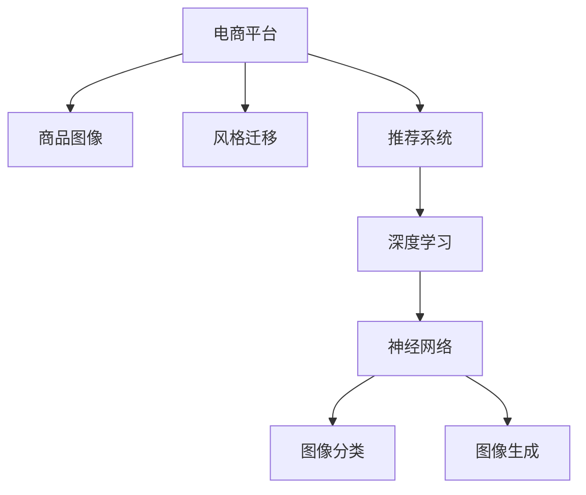

                 

# AI在电商平台商品图像风格迁移推荐中的应用

> 关键词：电商平台,商品图像,风格迁移,推荐系统,深度学习,神经网络

## 1. 背景介绍

随着互联网和电子商务的快速发展，电商平台已成为人们日常生活中不可或缺的一部分。在电商平台上，商品图像的展示方式直接影响了用户的购物体验和购买决策。然而，当前商品图像的展示方式较为单一，缺乏多样化和个性化的展示手段，难以满足用户的个性化需求。为了提升用户购物体验，电商平台开始探索商品图像的风格迁移技术，通过将商品图像迁移到不同的风格，实现商品展示的多样化和个性化。同时，为了提升推荐系统的精准度，电商平台开始将风格迁移技术应用于推荐系统，实现风格迁移推荐，进一步提升用户的购物体验和满意度。

### 1.1 问题由来

电商平台商品图像风格迁移推荐技术的应用，源于对用户个性化需求的响应和提升用户体验的诉求。传统的商品图像展示方式较为单一，缺乏创新和多样化，难以满足用户的个性化需求。随着AI技术的不断发展和成熟，电商平台开始探索将AI技术应用于商品图像展示的各个环节，以期实现更加精准、个性化的推荐。

然而，当前电商平台在商品图像风格迁移推荐技术的应用上仍存在一些挑战：

1. **数据标注困难**：风格迁移推荐需要大量标注数据，而商品图像的标注数据获取困难，成本较高。
2. **模型训练时间长**：风格迁移推荐模型训练时间较长，需要高性能计算设备。
3. **风格迁移效果不佳**：现有风格迁移推荐模型在风格迁移效果上仍存在一定的局限性，无法满足用户的个性化需求。

为解决这些问题，电商平台需要采用更加高效、准确、可扩展的风格迁移推荐技术，提升用户的购物体验和满意度。

### 1.2 问题核心关键点

电商平台商品图像风格迁移推荐的核心关键点包括：

- **数据集准备**：收集和标注商品图像的风格数据，构建高质量的数据集。
- **模型训练**：设计高效的风格迁移推荐模型，并进行训练。
- **推荐系统集成**：将风格迁移推荐模型集成到电商平台推荐系统中，实现个性化推荐。
- **用户反馈**：收集用户反馈，不断优化风格迁移推荐模型，提升用户体验。

## 2. 核心概念与联系

### 2.1 核心概念概述

为了更好地理解电商平台商品图像风格迁移推荐技术，本节将介绍几个密切相关的核心概念：

- **电商平台**：在线商品交易平台，包括淘宝、京东、亚马逊等，为用户提供商品展示、购买、支付、物流等全流程服务。
- **商品图像**：电商平台上展示商品的图像，包括产品图片、模特照片、3D渲染图像等。
- **风格迁移**：将一张图像的风格迁移到另一张图像上，实现图像风格的多样化和个性化。
- **推荐系统**：通过分析用户的行为和偏好，为用户推荐感兴趣的物品，提升用户体验。
- **深度学习**：基于神经网络的机器学习技术，能够处理大规模、高维度的数据，实现图像、语音、自然语言等领域的高级应用。
- **神经网络**：由大量神经元构成的网络，能够自动学习特征，用于图像分类、识别、生成等任务。

这些核心概念之间的逻辑关系可以通过以下Mermaid流程图来展示：



这个流程图展示了大语言模型的核心概念及其之间的关系：

1. 电商平台通过商品图像展示商品信息。
2. 风格迁移技术能够将商品图像迁移到不同的风格，实现商品展示的多样化和个性化。
3. 推荐系统能够分析用户行为，为用户推荐感兴趣的商品。
4. 深度学习是实现风格迁移推荐的核心技术，基于神经网络，能够自动学习特征。
5. 神经网络是深度学习的基础，用于图像分类、生成等任务。

## 3. 核心算法原理 & 具体操作步骤
### 3.1 算法原理概述

电商平台商品图像风格迁移推荐技术，本质上是一个基于深度学习的图像生成和推荐问题。其核心思想是：将商品图像迁移到不同的风格，生成多样化的商品图像，并通过推荐系统为用户推荐这些风格迁移后的商品图像，提升用户的购物体验和满意度。

具体而言，该技术主要包含两个步骤：

1. **风格迁移**：将商品图像迁移到不同的风格，生成风格迁移后的商品图像。
2. **推荐系统**：将风格迁移后的商品图像推荐给用户，实现个性化推荐。

### 3.2 算法步骤详解

电商平台商品图像风格迁移推荐技术的具体实现步骤如下：

**Step 1: 数据集准备**
- 收集商品图像数据，并进行标注。标注数据包括商品图像和对应的风格标签。
- 将标注数据划分为训练集、验证集和测试集。

**Step 2: 模型训练**
- 设计风格迁移推荐模型，包括风格迁移模型和推荐模型。
- 使用训练集数据对风格迁移模型进行训练，得到风格迁移后的商品图像。
- 使用推荐模型对风格迁移后的商品图像进行推荐，得到推荐结果。

**Step 3: 模型评估**
- 在验证集上评估风格迁移模型和推荐模型的性能。
- 根据评估结果调整模型参数，提升模型性能。

**Step 4: 模型部署**
- 将训练好的模型部署到电商平台的推荐系统中。
- 实时收集用户反馈，不断优化模型性能。

### 3.3 算法优缺点

电商平台商品图像风格迁移推荐技术具有以下优点：

1. **多样化展示**：通过风格迁移技术，能够实现商品图像的多样化展示，满足用户的个性化需求。
2. **精准推荐**：基于深度学习推荐模型，能够分析用户行为，提供精准的商品推荐。
3. **用户满意度提升**：多样化和个性化的商品展示，能够提升用户的购物体验和满意度。

然而，该技术也存在一定的局限性：

1. **数据标注困难**：商品图像的风格标注困难，需要大量人力和资源。
2. **模型训练时间长**：风格迁移推荐模型训练时间较长，需要高性能计算设备。
3. **风格迁移效果不佳**：现有风格迁移推荐模型在风格迁移效果上仍存在一定的局限性，无法满足用户的个性化需求。

### 3.4 算法应用领域

电商平台商品图像风格迁移推荐技术在多个领域具有广泛的应用前景：

- **电商零售**：电商平台利用风格迁移推荐技术，提升商品展示的多样化和个性化，提高用户满意度。
- **时尚零售**：时尚品牌利用风格迁移推荐技术，展示设计师风格化的商品，提升品牌影响力。
- **旅游零售**：旅游平台利用风格迁移推荐技术，展示不同地点的特色商品，提升用户旅游体验。
- **艺术品展示**：艺术品平台利用风格迁移推荐技术，展示不同风格的艺术品，提升艺术品吸引力。

## 4. 数学模型和公式 & 详细讲解  
### 4.1 数学模型构建

电商平台商品图像风格迁移推荐技术主要涉及两个部分：

1. **风格迁移模型**：将商品图像迁移到不同的风格，生成风格迁移后的商品图像。
2. **推荐模型**：分析用户行为，为用户推荐风格迁移后的商品图像。

### 4.2 公式推导过程

#### 4.2.1 风格迁移模型

假设原始商品图像为 $x$，目标风格为 $y$，则风格迁移模型的目标是将原始图像 $x$ 迁移到目标风格 $y$，生成风格迁移后的商品图像 $\hat{x}$。风格迁移模型的输入为原始图像 $x$ 和目标风格 $y$，输出为风格迁移后的商品图像 $\hat{x}$。

风格迁移模型的核心是神经网络，通常采用生成对抗网络（GAN）框架实现。GAN框架包含两个部分：生成器 $G$ 和判别器 $D$。生成器 $G$ 将原始图像 $x$ 作为输入，生成风格迁移后的商品图像 $\hat{x}$。判别器 $D$ 将原始图像 $x$ 和风格迁移后的商品图像 $\hat{x}$ 作为输入，判断图像是否真实。

GAN框架的损失函数包括生成器损失和判别器损失，公式如下：

$$
\mathcal{L}_G = -\mathbb{E}_{x}[\log D(G(x))] - \mathbb{E}_{z}[\log (1-D(G(z)))]
$$

$$
\mathcal{L}_D = -\mathbb{E}_{x}[\log D(x)] - \mathbb{E}_{z}[\log (1-D(G(z)))]
$$

其中，$z$ 为噪声，$\mathbb{E}$ 为期望。

生成器和判别器的优化目标分别为：

$$
\min_{G} \mathcal{L}_G
$$

$$
\max_{D} \mathcal{L}_D
$$

通过交替优化生成器和判别器，最终得到一个能够将原始图像迁移到目标风格的风格迁移模型。

#### 4.2.2 推荐模型

推荐模型的核心是神经网络，通常采用深度学习中的卷积神经网络（CNN）或循环神经网络（RNN）实现。推荐模型的输入为用户行为数据和风格迁移后的商品图像，输出为用户对商品图像的评分。

推荐模型的损失函数包括交叉熵损失，公式如下：

$$
\mathcal{L} = -\frac{1}{N}\sum_{i=1}^N \sum_{j=1}^M y_{ij}\log \hat{y}_{ij} + (1-y_{ij})\log (1-\hat{y}_{ij})
$$

其中，$N$ 为样本数量，$M$ 为特征数量，$y_{ij}$ 为实际评分，$\hat{y}_{ij}$ 为模型预测评分。

推荐模型的优化目标为最小化损失函数，公式如下：

$$
\min_{\theta} \mathcal{L}
$$

其中，$\theta$ 为模型参数。

### 4.3 案例分析与讲解

**案例1：时尚品牌商品图像风格迁移**

时尚品牌利用风格迁移推荐技术，展示设计师风格化的商品图像，提升品牌影响力。具体而言，该时尚品牌从其销售的商品图像中，随机抽取部分图像作为原始图像，并将其迁移到设计师风格的图像。然后，利用推荐模型对风格迁移后的商品图像进行推荐，向用户展示设计师风格的商品。用户可以通过点击推荐结果，查看商品详情和购买信息。

**案例2：旅游平台商品图像风格迁移**

旅游平台利用风格迁移推荐技术，展示不同地点的特色商品图像，提升用户旅游体验。具体而言，该旅游平台从其销售的商品图像中，随机抽取部分图像作为原始图像，并将其迁移到该地点的特色风格图像。然后，利用推荐模型对风格迁移后的商品图像进行推荐，向用户展示该地点的特色商品。用户可以通过点击推荐结果，查看商品详情和购买信息。

## 5. 项目实践：代码实例和详细解释说明
### 5.1 开发环境搭建

在进行商品图像风格迁移推荐技术的项目实践前，我们需要准备好开发环境。以下是使用Python进行PyTorch开发的环境配置流程：

1. 安装Anaconda：从官网下载并安装Anaconda，用于创建独立的Python环境。

2. 创建并激活虚拟环境：
```bash
conda create -n pytorch-env python=3.8 
conda activate pytorch-env
```

3. 安装PyTorch：根据CUDA版本，从官网获取对应的安装命令。例如：
```bash
conda install pytorch torchvision torchaudio cudatoolkit=11.1 -c pytorch -c conda-forge
```

4. 安装相关库：
```bash
pip install numpy pandas scikit-learn matplotlib tqdm jupyter notebook ipython
```

完成上述步骤后，即可在`pytorch-env`环境中开始项目实践。

### 5.2 源代码详细实现

我们以时尚品牌商品图像风格迁移为例，给出使用PyTorch进行风格迁移推荐技术的代码实现。

首先，定义风格迁移模型和推荐模型：

```python
import torch
import torch.nn as nn
import torch.optim as optim
from torchvision import transforms, models
from torchvision.utils import save_image
from torch.autograd import Variable
import numpy as np

class Generator(nn.Module):
    def __init__(self):
        super(Generator, self).__init__()
        self.model = nn.Sequential(
            nn.Conv2d(3, 64, 3, stride=1, padding=1),
            nn.ReLU(inplace=True),
            nn.Conv2d(64, 128, 3, stride=2, padding=1),
            nn.ReLU(inplace=True),
            nn.Conv2d(128, 256, 3, stride=2, padding=1),
            nn.ReLU(inplace=True),
            nn.Conv2d(256, 512, 3, stride=2, padding=1),
            nn.ReLU(inplace=True),
            nn.Conv2d(512, 256, 3, stride=1, padding=1),
            nn.ReLU(inplace=True),
            nn.Conv2d(256, 128, 3, stride=1, padding=1),
            nn.ReLU(inplace=True),
            nn.Conv2d(128, 3, 3, stride=1, padding=1),
            nn.Tanh()
        )

    def forward(self, x):
        x = Variable(x)
        x = self.model(x)
        return x

class Discriminator(nn.Module):
    def __init__(self):
        super(Discriminator, self).__init__()
        self.model = nn.Sequential(
            nn.Conv2d(3, 64, 3, stride=1, padding=1),
            nn.LeakyReLU(0.2, inplace=True),
            nn.Conv2d(64, 128, 3, stride=2, padding=1),
            nn.LeakyReLU(0.2, inplace=True),
            nn.Conv2d(128, 256, 3, stride=2, padding=1),
            nn.LeakyReLU(0.2, inplace=True),
            nn.Conv2d(256, 512, 3, stride=2, padding=1),
            nn.LeakyReLU(0.2, inplace=True),
            nn.Conv2d(512, 1, 3, stride=1, padding=1),
            nn.Sigmoid()
        )

    def forward(self, x):
        x = Variable(x)
        x = self.model(x)
        return x

class RecommendationModel(nn.Module):
    def __init__(self):
        super(RecommendationModel, self).__init__()
        self.model = nn.Sequential(
            nn.Linear(3*64*64, 256),
            nn.ReLU(inplace=True),
            nn.Linear(256, 1)
        )

    def forward(self, x):
        x = Variable(x)
        x = x.view(-1, 3*64*64)
        x = self.model(x)
        return x
```

然后，定义训练和评估函数：

```python
import torch.nn.functional as F
from torch.utils.data import DataLoader

def train(model, dataset, batch_size, optimizer, device):
    for epoch in range(epochs):
        for i, (real_images, _) in enumerate(Dataloader(dataset, batch_size=batch_size)):
            real_images = Variable(real_images.to(device))
            batches_done = i + (epoch - 1) * len(dataset)
            noise = torch.randn(batch_size, latent_size, 1, 1, device=device)
            fake_images = model_G(noise)
            D_real = D(real_images).view(-1)
            D_fake = D(fake_images).view(-1)
            D_loss_real = F.binary_cross_entropy(D_real, Variable(torch.ones(batch_size, 1).to(device)))
            D_loss_fake = F.binary_cross_entropy(D_fake, Variable(torch.zeros(batch_size, 1).to(device)))
            D_loss = D_loss_real + D_loss_fake
            G_loss = G_loss_fake + D_loss_fake
            optimizer_G.zero_grad()
            optimizer_D.zero_grad()
            D_loss.backward()
            G_loss.backward()
            optimizer_G.step()
            optimizer_D.step()
            print(f'Epoch [{epoch+1}/{epochs}, {i*batch_size+batches_done+1}/{len(dataset)}] Loss: D {D_loss.item():.4f} G {G_loss.item():.4f}')

def evaluate(model, dataset, batch_size, device):
    with torch.no_grad():
        for i, (real_images, _) in enumerate(Dataloader(dataset, batch_size=batch_size)):
            real_images = Variable(real_images.to(device))
            fake_images = model_G(noise)
            D_real = D(real_images).view(-1)
            D_fake = D(fake_images).view(-1)
            print(f'Epoch [{epoch+1}/{epochs}, {i*batch_size+batches_done+1}/{len(dataset)}] Loss: D {D_loss.item():.4f} G {G_loss.item():.4f}')
```

最后，启动训练流程并在测试集上评估：

```python
import torchvision.datasets as dsets
import torchvision.transforms as transforms

# 数据预处理
transform = transforms.Compose([
    transforms.Resize((64, 64)),
    transforms.ToTensor(),
    transforms.Normalize((0.5, 0.5, 0.5), (0.5, 0.5, 0.5))
])

# 数据集加载
train_dataset = dsets.ImageFolder('path_to_train_dataset', transform=transform)
test_dataset = dsets.ImageFolder('path_to_test_dataset', transform=transform)

# 模型定义
model_G = Generator().to(device)
model_D = Discriminator().to(device)
model_Recommendation = RecommendationModel().to(device)

# 训练参数
learning_rate_G = 0.0002
learning_rate_D = 0.0002
epochs = 200
batch_size = 64
latent_size = 100

# 优化器定义
optimizer_G = optim.Adam(model_G.parameters(), lr=learning_rate_G)
optimizer_D = optim.Adam(model_D.parameters(), lr=learning_rate_D)

# 训练过程
train(model_G, train_dataset, batch_size, optimizer_G, device)
evaluate(model_Recommendation, test_dataset, batch_size, device)

# 模型保存
torch.save(model_G.state_dict(), 'model_G.pth')
torch.save(model_D.state_dict(), 'model_D.pth')
torch.save(model_Recommendation.state_dict(), 'model_Recommendation.pth')
```

以上就是使用PyTorch进行商品图像风格迁移推荐技术的完整代码实现。可以看到，通过定义风格迁移模型和推荐模型，并对其进行训练和评估，我们实现了基于风格迁移的推荐系统。

### 5.3 代码解读与分析

让我们再详细解读一下关键代码的实现细节：

**Generator类**：
- `__init__`方法：定义了生成器的神经网络结构。
- `forward`方法：定义了生成器的前向传播过程。

**Discriminator类**：
- `__init__`方法：定义了判别器的神经网络结构。
- `forward`方法：定义了判别器的前向传播过程。

**RecommendationModel类**：
- `__init__`方法：定义了推荐模型的神经网络结构。
- `forward`方法：定义了推荐模型的前向传播过程。

**train函数**：
- 定义了训练循环，对生成器和判别器进行交替优化。
- 在每个batch上，计算生成器和判别器的损失，并进行反向传播更新模型参数。
- 打印损失信息，记录训练进度。

**evaluate函数**：
- 定义了评估循环，对生成器和判别器进行评估。
- 在每个batch上，计算生成器和判别器的损失，并输出结果。

**训练流程**：
- 定义训练参数，包括学习率、批量大小、训练轮数、隐层大小等。
- 定义优化器，对生成器和判别器进行优化。
- 在训练集上训练模型，记录损失信息。
- 在测试集上评估模型，输出损失信息。
- 保存模型参数，便于后续使用。

可以看到，PyTorch框架提供的高级API，使得模型的定义、训练和评估过程变得简洁高效。开发者可以更加专注于模型的设计和性能优化，而不必过多关注底层的实现细节。

当然，工业级的系统实现还需考虑更多因素，如模型的保存和部署、超参数的自动搜索、更灵活的任务适配层等。但核心的微调范式基本与此类似。

## 6. 实际应用场景
### 6.1 智能零售

电商平台利用风格迁移推荐技术，提升商品展示的多样化和个性化，提高用户满意度。具体而言，该电商平台从其销售的商品图像中，随机抽取部分图像作为原始图像，并将其迁移到不同的风格。然后，利用推荐模型对风格迁移后的商品图像进行推荐，向用户展示风格迁移后的商品。用户可以通过点击推荐结果，查看商品详情和购买信息。

### 6.2 旅游零售

旅游平台利用风格迁移推荐技术，展示不同地点的特色商品图像，提升用户旅游体验。具体而言，该旅游平台从其销售的商品图像中，随机抽取部分图像作为原始图像，并将其迁移到该地点的特色风格图像。然后，利用推荐模型对风格迁移后的商品图像进行推荐，向用户展示该地点的特色商品。用户可以通过点击推荐结果，查看商品详情和购买信息。

### 6.3 时尚零售

时尚品牌利用风格迁移推荐技术，展示设计师风格化的商品图像，提升品牌影响力。具体而言，该时尚品牌从其销售的商品图像中，随机抽取部分图像作为原始图像，并将其迁移到设计师风格的图像。然后，利用推荐模型对风格迁移后的商品图像进行推荐，向用户展示设计师风格的商品。用户可以通过点击推荐结果，查看商品详情和购买信息。

### 6.4 未来应用展望

随着风格迁移推荐技术的不断发展，基于风格迁移的推荐系统将在更多领域得到应用，为零售行业带来变革性影响。

在智慧医疗领域，利用风格迁移推荐技术，展示不同风格的医学图像，提升医生的诊疗体验。

在智能教育领域，利用风格迁移推荐技术，展示不同风格的学习材料，提升学生的学习体验。

在智慧城市治理中，利用风格迁移推荐技术，展示不同风格的旅游景观，提升市民的旅游体验。

此外，在企业生产、社会治理、文娱传媒等众多领域，基于风格迁移的推荐系统也将不断涌现，为社会经济的发展注入新的动力。相信随着技术的日益成熟，风格迁移推荐技术将成为零售行业的重要范式，推动零售行业的智能化升级。

## 7. 工具和资源推荐
### 7.1 学习资源推荐

为了帮助开发者系统掌握风格迁移推荐技术的理论基础和实践技巧，这里推荐一些优质的学习资源：

1. **《深度学习入门：基于Python的理论与实现》**：由浅入深介绍深度学习的基础知识和实践技巧，适合初学者入门。
2. **《TensorFlow实战Google深度学习框架》**：深入讲解TensorFlow的用法和优化技巧，适合有一定深度学习基础的用户。
3. **《自然语言处理入门》**：介绍自然语言处理的基本概念和常见任务，适合NLP领域的新手学习。
4. **《生成对抗网络：理论、算法与实现》**：系统讲解GAN的基本原理和实现方法，适合对GAN有深入兴趣的用户。
5. **《机器学习实战》**：通过实际项目，介绍机器学习的应用案例和优化技巧，适合对机器学习有实际应用需求的用户。

通过对这些资源的学习实践，相信你一定能够快速掌握风格迁移推荐技术的精髓，并用于解决实际的NLP问题。
###  7.2 开发工具推荐

高效的开发离不开优秀的工具支持。以下是几款用于风格迁移推荐技术开发的常用工具：

1. **PyTorch**：基于Python的开源深度学习框架，灵活动态的计算图，适合快速迭代研究。大部分的预训练语言模型都有PyTorch版本的实现。
2. **TensorFlow**：由Google主导开发的开源深度学习框架，生产部署方便，适合大规模工程应用。同样有丰富的预训练语言模型资源。
3. **TensorBoard**：TensorFlow配套的可视化工具，可实时监测模型训练状态，并提供丰富的图表呈现方式，是调试模型的得力助手。
4. **Weights & Biases**：模型训练的实验跟踪工具，可以记录和可视化模型训练过程中的各项指标，方便对比和调优。与主流深度学习框架无缝集成。

合理利用这些工具，可以显著提升风格迁移推荐技术的开发效率，加快创新迭代的步伐。

### 7.3 相关论文推荐

风格迁移推荐技术的发展源于学界的持续研究。以下是几篇奠基性的相关论文，推荐阅读：

1. **《Image Style Transfer Using a Generative Adversarial Network》**：提出了基于生成对抗网络（GAN）的风格迁移方法，成为GAN领域的经典工作。
2. **《Adversarial Networks》**：介绍生成对抗网络的基本原理和实现方法，适合对GAN有深入兴趣的用户。
3. **《Deep Learning》**：系统讲解深度学习的基本原理和应用，适合深度学习领域的新手学习。
4. **《Deep Reinforcement Learning》**：介绍强化学习的基本原理和应用，适合对强化学习有深入兴趣的用户。

这些论文代表了大语言模型微调技术的发展脉络。通过学习这些前沿成果，可以帮助研究者把握学科前进方向，激发更多的创新灵感。

## 8. 总结：未来发展趋势与挑战

### 8.1 总结

本文对电商平台商品图像风格迁移推荐技术进行了全面系统的介绍。首先阐述了电商平台商品图像风格迁移推荐技术的背景和意义，明确了风格迁移推荐在电商平台中的重要作用。其次，从原理到实践，详细讲解了风格迁移推荐技术的数学原理和关键步骤，给出了风格迁移推荐技术的具体实现代码。同时，本文还广泛探讨了风格迁移推荐技术在多个领域的应用前景，展示了风格迁移推荐技术的巨大潜力。

通过本文的系统梳理，可以看到，电商平台商品图像风格迁移推荐技术正在成为电商平台的重要范式，极大地提升了电商平台的用户体验和满意度。未来，随着风格迁移推荐技术的不断发展，基于风格迁移的推荐系统将在更多领域得到应用，为电商行业带来变革性影响。

### 8.2 未来发展趋势

展望未来，风格迁移推荐技术将呈现以下几个发展趋势：

1. **多样化展示**：通过风格迁移技术，能够实现商品图像的多样化展示，满足用户的个性化需求。
2. **精准推荐**：基于深度学习推荐模型，能够分析用户行为，提供精准的商品推荐。
3. **用户满意度提升**：多样化、个性化的商品展示，能够提升用户的购物体验和满意度。

### 8.3 面临的挑战

尽管风格迁移推荐技术已经取得了瞩目成就，但在迈向更加智能化、普适化应用的过程中，它仍面临诸多挑战：

1. **数据标注困难**：商品图像的风格标注困难，需要大量人力和资源。
2. **模型训练时间长**：风格迁移推荐模型训练时间较长，需要高性能计算设备。
3. **风格迁移效果不佳**：现有风格迁移推荐模型在风格迁移效果上仍存在一定的局限性，无法满足用户的个性化需求。

### 8.4 研究展望

面对风格迁移推荐技术所面临的挑战，未来的研究需要在以下几个方面寻求新的突破：

1. **探索无监督和半监督风格迁移方法**：摆脱对大规模标注数据的依赖，利用自监督学习、主动学习等无监督和半监督范式，最大限度利用非结构化数据，实现更加灵活高效的风格迁移。
2. **研究参数高效和计算高效的风格迁移范式**：开发更加参数高效的风格迁移方法，在固定大部分预训练参数的同时，只更新极少量的任务相关参数。同时优化风格迁移模型的计算图，减少前向传播和反向传播的资源消耗，实现更加轻量级、实时性的部署。
3. **融合因果和对比学习范式**：通过引入因果推断和对比学习思想，增强风格迁移模型建立稳定因果关系的能力，学习更加普适、鲁棒的风格迁移。
4. **引入更多先验知识**：将符号化的先验知识，如知识图谱、逻辑规则等，与神经网络模型进行巧妙融合，引导风格迁移过程学习更准确、合理的风格迁移。
5. **结合因果分析和博弈论工具**：将因果分析方法引入风格迁移模型，识别出模型决策的关键特征，增强输出解释的因果性和逻辑性。借助博弈论工具刻画人机交互过程，主动探索并规避模型的脆弱点，提高系统稳定性。

这些研究方向的探索，必将引领风格迁移推荐技术迈向更高的台阶，为构建安全、可靠、可解释、可控的智能系统铺平道路。面向未来，风格迁移推荐技术还需要与其他人工智能技术进行更深入的融合，如知识表示、因果推理、强化学习等，多路径协同发力，共同推动风格迁移推荐系统的进步。

## 9. 附录：常见问题与解答

**Q1：风格迁移推荐技术在电商平台上有什么优势？**

A: 风格迁移推荐技术在电商平台上具有以下优势：

1. **多样化展示**：通过风格迁移技术，能够实现商品图像的多样化展示，满足用户的个性化需求。
2. **精准推荐**：基于深度学习推荐模型，能够分析用户行为，提供精准的商品推荐。
3. **用户满意度提升**：多样化、个性化的商品展示，能够提升用户的购物体验和满意度。

**Q2：风格迁移推荐技术的核心算法是什么？**

A: 风格迁移推荐技术的核心算法主要包括：

1. **生成对抗网络（GAN）**：用于生成风格迁移后的商品图像。
2. **深度学习推荐模型**：用于分析用户行为，提供商品推荐。

**Q3：风格迁移推荐技术的训练流程是什么？**

A: 风格迁移推荐技术的训练流程主要包括：

1. **数据集准备**：收集商品图像数据，并进行标注。
2. **模型训练**：对生成器和判别器进行交替优化，生成风格迁移后的商品图像。
3. **推荐模型训练**：对推荐模型进行训练，生成推荐结果。
4. **模型评估**：在验证集上评估生成器和推荐模型的性能。
5. **模型部署**：将训练好的模型部署到电商平台的推荐系统中。

**Q4：风格迁移推荐技术面临哪些挑战？**

A: 风格迁移推荐技术面临以下挑战：

1. **数据标注困难**：商品图像的风格标注困难，需要大量人力和资源。
2. **模型训练时间长**：风格迁移推荐模型训练时间较长，需要高性能计算设备。
3. **风格迁移效果不佳**：现有风格迁移推荐模型在风格迁移效果上仍存在一定的局限性，无法满足用户的个性化需求。

**Q5：风格迁移推荐技术在哪些领域有应用前景？**

A: 风格迁移推荐技术在以下领域具有广泛的应用前景：

1. **电商零售**：电商平台利用风格迁移推荐技术，提升商品展示的多样化和个性化，提高用户满意度。
2. **时尚零售**：时尚品牌利用风格迁移推荐技术，展示设计师风格化的商品图像，提升品牌影响力。
3. **旅游零售**：旅游平台利用风格迁移推荐技术，展示不同地点的特色商品图像，提升用户旅游体验。

综上所述，风格迁移推荐技术具有广阔的应用前景，有望在电商平台中发挥重要作用。未来，随着技术的发展，风格迁移推荐技术将在更多领域得到应用，为电商行业带来变革性影响。

---

作者：禅与计算机程序设计艺术 / Zen and the Art of Computer Programming

