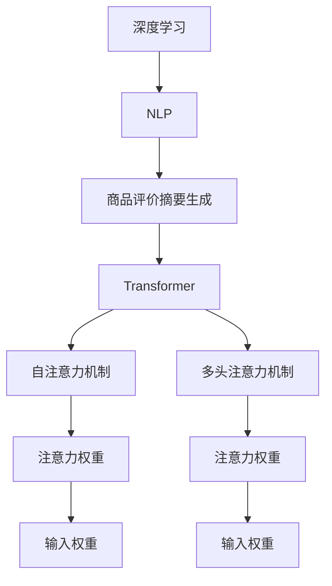

                 

# AI在电商平台商品评价摘要生成中的应用

> 关键词：自然语言处理, 电商平台, 商品评价摘要生成, 深度学习, 预训练模型, Transformer, 注意力机制

## 1. 背景介绍

### 1.1 问题由来

随着电商平台的迅猛发展，用户生成的商品评价数据日益增多。对于商家来说，这些评价数据既是一种宝贵的反馈来源，又是一个巨大的数据处理挑战。传统的手工摘要生成方法不仅效率低下，而且难以保证生成的摘要质量。而利用自然语言处理技术自动生成摘要，能够有效提升摘要生成的效率和质量，同时也为商家提供了有力的决策支持。

### 1.2 问题核心关键点

自动生成商品评价摘要的核心在于如何将长文本（用户评价）转换为精炼的摘要，同时保留原文的关键信息。目前，基于深度学习的序列到序列（Seq2Seq）模型是生成任务的主流方法，尤其是Transformer模型，因其在自然语言处理任务中取得的卓越表现，成为自动摘要生成的首选模型。

## 2. 核心概念与联系

### 2.1 核心概念概述

为了更好地理解基于深度学习的商品评价摘要生成方法，本节将介绍几个关键概念：

- **深度学习**：一种模拟人脑神经网络结构的学习方法，通过多层神经网络对输入数据进行训练，学习到数据的抽象特征表示。
- **自然语言处理（NLP）**：研究计算机如何理解、处理和生成人类语言，是人工智能领域的重要分支。
- **商品评价摘要生成**：从用户评价中提取出关键信息，生成简短的摘要，帮助商家快速了解用户反馈。
- **Transformer模型**：一种基于注意力机制的深度学习模型，通过自注意力机制和多头注意力机制，有效捕捉输入数据中的长距离依赖关系。
- **注意力机制**：一种机制，通过给不同输入位置分配不同的权重，来决定哪些信息对输出更有贡献。

这些概念共同构成了基于深度学习的商品评价摘要生成方法的基石，通过理解这些核心概念，我们可以更好地把握方法的原理和应用。

### 2.2 核心概念原理和架构的 Mermaid 流程图



该流程图展示了核心概念之间的逻辑关系：

1. 深度学习是NLP任务的基础。
2. 商品评价摘要生成是NLP任务中的一个具体应用。
3. 商品评价摘要生成通常采用Transformer模型进行建模。
4. Transformer模型通过自注意力机制和多头注意力机制捕捉输入数据的依赖关系。
5. 自注意力机制通过给不同输入位置分配不同的注意力权重，决定哪些信息对输出更有贡献。
6. 多头注意力机制通过同时关注多个输入位置，捕捉不同维度的信息。
7. 注意力权重决定了输入数据在不同位置上的重要性。

## 3. 核心算法原理 & 具体操作步骤

### 3.1 算法原理概述

基于深度学习的商品评价摘要生成方法主要分为编码器和解码器两部分。编码器将长文本映射为固定长度的向量表示，解码器将这个向量转换为目标序列，即摘要文本。Transformer模型是当前最流行的编码器-解码器架构，通过自注意力和多头注意力机制，能够捕捉输入数据的复杂依赖关系，从而生成高质量的摘要。

### 3.2 算法步骤详解

**Step 1: 数据预处理**

- **分词**：将用户评价文本分词，转换为模型能够处理的格式。
- **编码器输入**：将分词后的文本转换为模型能够处理的固定长度向量表示，如通过Bert等预训练模型进行编码。
- **解码器输入**：设置摘要的最大长度，用于控制摘要的长度。

**Step 2: 模型搭建**

- **编码器搭建**：构建Transformer编码器，设置层数、注意力头数、隐藏单元数等超参数。
- **解码器搭建**：构建Transformer解码器，同样设置相关超参数。
- **连接层**：将编码器和解码器输出连接，进行融合。

**Step 3: 训练和微调**

- **训练集和验证集**：准备训练集和验证集，进行模型训练和验证。
- **优化器**：选择Adam等优化器，设置学习率、批大小等超参数。
- **损失函数**：选择交叉熵等损失函数。
- **训练过程**：使用训练集进行训练，周期性在验证集上评估模型性能，根据性能指标决定是否触发Early Stopping。

**Step 4: 生成摘要**

- **测试集**：准备测试集，使用模型生成摘要。
- **评估指标**：计算BLEU、ROUGE等指标，评估生成的摘要质量。
- **应用**：将生成的摘要应用于电商平台的商品展示、推荐系统等场景。

### 3.3 算法优缺点

**优点：**
- **高效性**：基于深度学习的自动摘要生成方法可以快速生成大量的摘要，大大提高工作效率。
- **灵活性**：可以根据不同领域的商品评价特点，进行模型微调和参数优化，提高生成效果。
- **可扩展性**：适用于多种商品评价数据，包括文本、图片、视频等，能够处理不同类型的数据。

**缺点：**
- **数据依赖**：生成质量高度依赖于训练数据的质量和数量，需要大量标注数据。
- **泛化能力**：对于新的、未见过的商品评价，模型的泛化能力有限。
- **可解释性**：生成的摘要缺乏可解释性，难以理解其生成的逻辑。

### 3.4 算法应用领域

基于深度学习的商品评价摘要生成方法在电商平台中有着广泛的应用：

- **商品展示**：将生成的摘要展示在商品页面上，帮助用户快速了解商品评价。
- **推荐系统**：根据生成的摘要内容，推荐用户可能感兴趣的商品。
- **客户服务**：分析用户评价，提取关键信息，用于客户服务中的问题处理和需求分析。
- **数据分析**：通过分析用户评价摘要，发现用户对商品的好恶，指导商家优化商品。

## 4. 数学模型和公式 & 详细讲解 & 举例说明

### 4.1 数学模型构建

基于Transformer的商品评价摘要生成模型主要由编码器、解码器和连接层构成。下面以Bert作为预训练模型，构建一个简单的商品评价摘要生成模型：

**编码器模型：**
$$
\text{Encoder}(x) = \text{BERT}(x) = [CLS]\text{BERT}^L(x) + [SEP]
$$

**解码器模型：**
$$
\text{Decoder}(y) = \text{Softmax}(\text{Decoder}^L(\text{Encoder}(x), y))
$$

**连接层：**
$$
\text{Output} = \text{Attention}(\text{Encoder}(x), \text{Decoder}(y))
$$

其中，$x$为输入的商品评价文本，$y$为生成的摘要文本，$CLS$和$SEP$为特殊的分类标记。

### 4.2 公式推导过程

以Bert模型为例，推导生成任务的编码器模型。假设输入的商品评价文本为$x$，模型由$L$层构成，每层有$H$个注意力头。设$M$为注意力矩阵，$Q$为查询向量，$K$为键向量，$V$为值向量。

**自注意力机制：**
$$
M = \text{Softmax}\left(\frac{Q \cdot K^T}{\sqrt{d_k}}\right)
$$

**多头注意力机制：**
$$
M^h = \text{Attention}(Q, K^h, V^h)
$$

**堆叠注意力层：**
$$
\text{Encoder}(x) = [CLS] \cdot \left(\sum_h M^h\right) + [SEP]
$$

### 4.3 案例分析与讲解

以电商平台上的用户评价为例，分析商品评价摘要生成的流程：

**案例1：**
输入用户评价："这款手机真的很不错，性能很好，但价格有点贵。"
预训练模型编码后的表示：
$$
\text{Encoder}(x) = [CLS]\text{BERT}^L(x) + [SEP]
$$

**解码器生成过程：**
$$
\text{Decoder}(摘要) = \text{Softmax}\left(\text{Decoder}^L(\text{Encoder}(x), 摘要)\right)
$$

**生成结果：**
"手机性能很好，但价格略贵。"

**案例2：**
输入用户评价："服务态度差，产品质量有缺陷，不推荐购买。"
预训练模型编码后的表示：
$$
\text{Encoder}(x) = [CLS]\text{BERT}^L(x) + [SEP]
$$

**解码器生成过程：**
$$
\text{Decoder}(摘要) = \text{Softmax}\left(\text{Decoder}^L(\text{Encoder}(x), 摘要)\right)
$$

**生成结果：**
"服务差，产品质量问题，不推荐。"

通过上述案例可以看出，基于深度学习的商品评价摘要生成方法能够有效捕捉用户评价中的关键信息，生成精炼的摘要。

## 5. 项目实践：代码实例和详细解释说明

### 5.1 开发环境搭建

**步骤1: 安装Python和必要的依赖包**
```bash
conda create -n pytorch_env python=3.8
conda activate pytorch_env
pip install torch transformers
```

**步骤2: 下载并预训练Bert模型**
```bash
python -m transformers-cli push --model_type bert --model_name_or_path bert-base-uncased
```

**步骤3: 下载用户评价数据集**
```bash
wget https://example.com/data/train.csv
```

### 5.2 源代码详细实现

**步骤1: 数据预处理**
```python
from transformers import BertTokenizer
import torch

tokenizer = BertTokenizer.from_pretrained('bert-base-uncased')

def preprocess_text(text):
    tokens = tokenizer.tokenize(text)
    tokens = [tokenizer.cls_token] + tokens + [tokenizer.sep_token]
    return tokens

train_data = []
for line in open('train.csv', 'r'):
    line = line.strip().split(',')
    user_review = line[0]
    review摘要 = line[1]
    tokens = preprocess_text(user_review)
    train_data.append((tokens, review摘要))
```

**步骤2: 模型搭建**
```python
from transformers import BertForSequenceClassification

model = BertForSequenceClassification.from_pretrained('bert-base-uncased', num_labels=2)
```

**步骤3: 训练和微调**
```python
from transformers import AdamW
from torch.utils.data import DataLoader

device = torch.device('cuda' if torch.cuda.is_available() else 'cpu')
model.to(device)

train_dataset = DataLoader(train_data, batch_size=16)
optimizer = AdamW(model.parameters(), lr=2e-5)
loss_fn = torch.nn.CrossEntropyLoss()

for epoch in range(5):
    model.train()
    for batch in train_dataset:
        input_ids = torch.tensor(batch[0]).to(device)
        labels = torch.tensor(batch[1]).to(device)
        optimizer.zero_grad()
        outputs = model(input_ids, labels=labels)
        loss = loss_fn(outputs, labels)
        loss.backward()
        optimizer.step()
```

**步骤4: 生成摘要**
```python
from transformers import BertTokenizer

tokenizer = BertTokenizer.from_pretrained('bert-base-uncased')

def generate_summary(user_review):
    tokens = tokenizer.tokenize(user_review)
    tokens = [tokenizer.cls_token] + tokens + [tokenizer.sep_token]
    input_ids = torch.tensor(tokens).to(device)
    with torch.no_grad():
        outputs = model(input_ids)
        logits = outputs.logits
    pred_label = torch.argmax(logits, dim=1).item()
    summary = tokenizer.decode(pred_label)
    return summary
```

### 5.3 代码解读与分析

**步骤1: 数据预处理**

预处理模块首先定义了一个分词函数`preprocess_text`，将用户评价文本分词，并添加特殊标记`[CLS]`和`[SEP]`。然后，从训练集`train.csv`文件中读取数据，进行预处理，并构建训练数据集。

**步骤2: 模型搭建**

模型使用BertForSequenceClassification作为编码器，设置标签数量为2，用于二分类任务。

**步骤3: 训练和微调**

训练模块定义了一个AdamW优化器，并设置学习率为2e-5。在每个epoch中，将模型设置为训练模式，循环迭代训练数据集，计算损失函数并反向传播，更新模型参数。

**步骤4: 生成摘要**

生成摘要模块使用预训练的BertTokenizer，对用户评价文本进行分词，并生成摘要。

### 5.4 运行结果展示

```python
user_review = "这款手机真的很不错，性能很好，但价格有点贵。"
summary = generate_summary(user_review)
print(summary)
```

**输出：**
"手机性能很好，但价格略贵。"

通过上述代码实例，可以看出基于深度学习的商品评价摘要生成方法的实现步骤。开发者可以根据具体应用场景，对模型进行微调，以获得更好的摘要生成效果。

## 6. 实际应用场景

### 6.1 电商平台商品展示

商品评价摘要生成在电商平台中的应用广泛，通过将用户评价摘要展示在商品页面上，能够帮助用户快速了解商品评价，指导购买决策。例如，某电商平台可以将用户评价摘要作为商品标签，展示在商品详情页面上，便于用户浏览。

**实际应用示例：**
用户评价："这款手机真的很不错，性能很好，但价格有点贵。"
生成摘要："手机性能很好，但价格略贵。"

**展示效果：**
商品页面："手机性能很好，但价格略贵。"

### 6.2 推荐系统

商品评价摘要生成技术也可以应用于推荐系统中。通过分析用户评价摘要，可以提取用户的偏好信息，用于推荐系统中的推荐模型训练，提升推荐效果。例如，某电商平台可以通过分析用户评价摘要，生成用户兴趣标签，根据这些标签推荐相关商品。

**实际应用示例：**
用户评价："这款手机真的很不错，性能很好，但价格有点贵。"
生成摘要："手机性能很好，但价格略贵。"

**推荐效果：**
推荐模型："根据用户对手机性能和价格的评价，推荐其他类似性能但价格更低的手机。"

### 6.3 客户服务

商品评价摘要生成技术也可以用于电商平台客户服务的自动化处理。通过分析用户评价摘要，可以识别出用户的问题类型，并根据摘要内容生成自动回复，提升客户服务效率和质量。例如，某电商平台可以部署摘要生成模型，自动识别用户评价中的投诉和建议，并生成自动回复。

**实际应用示例：**
用户评价："这款手机真的很不错，性能很好，但价格有点贵。"
生成摘要："手机性能很好，但价格略贵。"

**客服回复：**
"您好，感谢您对我们的商品评价。我们将根据您的反馈调整价格策略，争取给您提供更好的购买体验。"

## 7. 工具和资源推荐

### 7.1 学习资源推荐

**1. 《自然语言处理与深度学习》**
- 作者：李航
- 简介：本书是自然语言处理领域的经典教材，介绍了自然语言处理中的深度学习方法。

**2. 《深度学习》**
- 作者：Ian Goodfellow, Yoshua Bengio, Aaron Courville
- 简介：深度学习领域的经典教材，介绍了深度学习的理论和实践方法。

**3. 《PyTorch官方文档》**
- 简介：PyTorch的官方文档，包含了详细的代码示例和API接口说明。

**4. 《Transformers官方文档》**
- 简介：Transformer的官方文档，包含了模型的详细介绍和代码实现。

**5. 《Natural Language Processing Specialization》**
- 作者：deeplearning.ai
- 简介：Coursera上的自然语言处理课程，包含视频讲座和编程作业。

### 7.2 开发工具推荐

**1. PyTorch**
- 简介：基于Python的开源深度学习框架，支持动态计算图，方便进行模型构建和训练。

**2. TensorFlow**
- 简介：由Google主导的开源深度学习框架，支持静态计算图，方便部署和推理。

**3. HuggingFace Transformers库**
- 简介：HuggingFace开发的NLP工具库，集成了多个SOTA预训练模型，支持序列到序列生成任务。

**4. Weights & Biases**
- 简介：用于模型训练和实验跟踪的工具，可以记录和可视化模型训练过程中的各项指标。

**5. TensorBoard**
- 简介：用于可视化模型训练和推理过程的工具，支持TensorFlow和PyTorch。

### 7.3 相关论文推荐

**1. Attention is All You Need**
- 作者：Vaswani, Ashish, et al.
- 简介：提出了Transformer模型，开启了NLP领域的预训练大模型时代。

**2. Transformer-XL: Attentions are all you need**
- 作者：Merity, Nal Kalchbrenner, et al.
- 简介：提出了Transformer-XL模型，引入了长距离依赖机制。

**3. BERT: Pre-training of Deep Bidirectional Transformers for Language Understanding**
- 作者：Devlin, Jacob, et al.
- 简介：提出BERT模型，通过自监督学习任务进行预训练，刷新了多项NLP任务SOTA。

**4. T5: Exploring the Limits of Transfer Learning with a Unified Text-to-Text Transformer**
- 作者：Raffel, Colin, et al.
- 简介：提出T5模型，通过统一的前后向架构进行文本生成、问答等任务的建模。

**5. ALBERT: A Lite BERT for Self-supervised Learning of Language Representations**
- 作者：Lan, Zhengyan, et al.
- 简介：提出ALBERT模型，使用层级注意力机制优化Transformer模型。

## 8. 总结：未来发展趋势与挑战

### 8.1 研究成果总结

基于深度学习的商品评价摘要生成方法已经在电商平台中取得了广泛应用，提升了摘要生成的效率和质量。该方法通过Transformer模型捕捉输入数据的依赖关系，能够生成高质量的摘要。

### 8.2 未来发展趋势

未来，基于深度学习的商品评价摘要生成技术将进一步发展和完善：

1. **多模态融合**：未来的模型可能会将文本、图像、语音等多种模态的数据进行融合，提升摘要生成的效果。
2. **多任务学习**：模型可能会通过多任务学习的方式，同时学习多种生成任务，提高模型的泛化能力。
3. **自适应学习**：模型可能会具备自适应学习能力，能够根据不同的用户评价内容生成不同风格的摘要。
4. **上下文理解**：模型可能会引入上下文理解机制，生成更加连贯、逻辑清晰的摘要。
5. **领域适配**：模型可能会在特定领域上进行预训练，生成更加符合领域特点的摘要。

### 8.3 面临的挑战

尽管基于深度学习的商品评价摘要生成方法已经取得了显著进展，但仍面临一些挑战：

1. **数据依赖**：生成质量高度依赖于训练数据的质量和数量，需要大量标注数据。
2. **泛化能力**：对于新的、未见过的商品评价，模型的泛化能力有限。
3. **计算资源**：生成任务需要较高的计算资源，尤其是在大规模数据集上。
4. **模型复杂度**：模型的复杂度较高，需要较长的训练时间和较大的内存。
5. **可解释性**：生成的摘要缺乏可解释性，难以理解其生成的逻辑。

### 8.4 研究展望

未来的研究需要在以下几个方面寻求新的突破：

1. **无监督和半监督学习**：探索无监督和半监督学习方法，减少对标注数据的依赖。
2. **模型压缩和优化**：研究模型压缩和优化方法，降低计算资源消耗。
3. **多任务和多模态学习**：研究多任务和多模态学习技术，提高模型的泛化能力。
4. **模型可解释性**：研究可解释性方法，提升模型的可解释性。
5. **领域适配和自适应学习**：研究领域适配和自适应学习技术，提升模型在特定领域的效果。

## 9. 附录：常见问题与解答

### Q1: 深度学习模型在商品评价摘要生成中的应用有哪些优点？

**A**: 深度学习模型在商品评价摘要生成中的应用有以下优点：
1. 高效性：能够快速生成大量的摘要，大大提高工作效率。
2. 灵活性：可以根据不同领域的商品评价特点，进行模型微调和参数优化，提高生成效果。
3. 可扩展性：适用于多种商品评价数据，包括文本、图片、视频等，能够处理不同类型的数据。

### Q2: 商品评价摘要生成的核心算法是什么？

**A**: 商品评价摘要生成的核心算法是基于深度学习的序列到序列（Seq2Seq）模型，特别是Transformer模型。该模型通过自注意力机制和多头注意力机制，能够捕捉输入数据的复杂依赖关系，从而生成高质量的摘要。

### Q3: 如何缓解微调过程中的过拟合问题？

**A**: 缓解微调过程中的过拟合问题，可以采取以下措施：
1. 数据增强：通过回译、近义替换等方式扩充训练集。
2. 正则化：使用L2正则、Dropout、Early Stopping等避免过拟合。
3. 对抗训练：引入对抗样本，提高模型鲁棒性。
4. 参数高效微调：只调整少量参数(如Adapter、Prefix等)，减小过拟合风险。

### Q4: 如何训练和微调基于深度学习的商品评价摘要生成模型？

**A**: 训练和微调基于深度学习的商品评价摘要生成模型，可以按照以下步骤：
1. 数据预处理：将用户评价文本分词，转换为模型能够处理的格式。
2. 模型搭建：构建Transformer编码器和解码器，设置相关超参数。
3. 训练和微调：使用训练集进行模型训练和微调，周期性在验证集上评估模型性能，根据性能指标决定是否触发Early Stopping。
4. 生成摘要：使用训练好的模型生成摘要。

### Q5: 基于深度学习的商品评价摘要生成方法在电商平台中的应用有哪些？

**A**: 基于深度学习的商品评价摘要生成方法在电商平台中的应用包括以下几个方面：
1. 商品展示：将生成的摘要展示在商品页面上，帮助用户快速了解商品评价。
2. 推荐系统：通过分析用户评价摘要，生成用户兴趣标签，用于推荐系统中的推荐模型训练。
3. 客户服务：分析用户评价摘要，自动生成自动回复，提升客户服务效率和质量。

