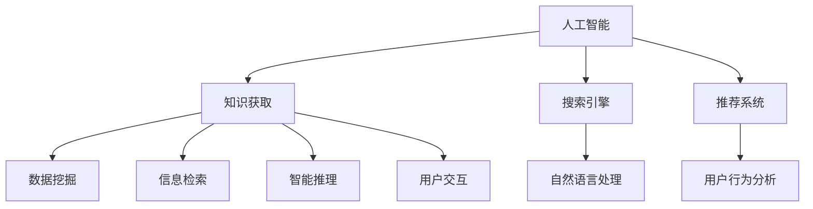

                 

# AI在知识获取中的角色转变

## 1. 背景介绍

在信息技术迅猛发展的时代，知识获取方式正经历着前所未有的变革。人工智能（AI）技术以其强大的处理能力，正在逐步替代人类在知识获取中的角色，成为知识检索和获取的关键力量。无论是搜索引擎的进化，还是个性化推荐系统的兴起，AI都展示了其在信息处理、数据挖掘和智能推理方面的独特优势。然而，AI在知识获取中的角色转变，也带来了许多挑战与机遇。本文将深入探讨AI在知识获取中的核心概念与联系，核心算法原理与具体操作步骤，并展望未来发展趋势。

## 2. 核心概念与联系

### 2.1 核心概念概述

要理解AI在知识获取中的角色转变，首先需要明确几个核心概念：

- **人工智能（AI）**：通过计算机模拟人类智能过程，以实现对大量数据的处理、分析和决策。
- **知识获取（Knowledge Acquisition）**：指从数据中提取、整理、理解并形成知识的整个过程。
- **搜索引擎**：一种能够从大规模数据中快速检索并返回相关信息的系统。
- **推荐系统**：根据用户行为和偏好，智能推荐信息的系统。
- **自然语言处理（NLP）**：使计算机能够理解和处理人类自然语言的技术。

这些概念构成了AI在知识获取中的基础框架，帮助我们理解AI如何从数据中提取知识，并为用户提供高质量的信息服务。

### 2.2 核心概念原理和架构的 Mermaid 流程图



在这个流程图中，人工智能是核心，通过搜索引擎、推荐系统等工具，对自然语言处理、数据挖掘、信息检索和智能推理等技术进行整合，实现知识获取。用户行为分析则与推荐系统紧密相连，进一步提升推荐的精准度。最终，这些技术通过用户交互，实现了知识获取过程的闭环。

## 3. 核心算法原理 & 具体操作步骤

### 3.1 算法原理概述

AI在知识获取中的核心算法原理主要包括：

- **信息检索算法**：用于在大量数据中快速定位相关信息的算法，如向量空间模型（Vector Space Model）、BM25等。
- **自然语言处理算法**：使计算机能够理解和处理自然语言的算法，如分词、词性标注、命名实体识别等。
- **推荐算法**：基于用户行为和兴趣，智能推荐信息的算法，如协同过滤（Collaborative Filtering）、基于内容的推荐（Content-Based Recommendation）等。
- **深度学习算法**：利用神经网络对数据进行深层次特征提取和建模的算法，如CNN、RNN、Transformer等。

### 3.2 算法步骤详解

以推荐系统为例，推荐算法的基本步骤包括：

1. **数据收集**：从用户行为日志、网站点击记录、评分信息等来源收集数据。
2. **用户画像构建**：通过数据分析和机器学习算法，构建用户的兴趣画像。
3. **物品画像构建**：对物品进行特征提取，如标签、分类、用户评分等。
4. **相似度计算**：计算用户画像与物品画像之间的相似度。
5. **推荐结果生成**：基于相似度，生成推荐列表。
6. **反馈收集与优化**：根据用户反馈，不断优化推荐算法和数据模型。

### 3.3 算法优缺点

**优点**：
- **高效性**：AI能够快速处理大量数据，提高知识获取的效率。
- **精准性**：通过深度学习和智能推理，推荐系统能够提供高度个性化的信息。
- **实时性**：AI能够实时响应用户请求，提供即时的信息服务。

**缺点**：
- **数据依赖**：AI依赖大量高质量的数据，数据质量会直接影响算法效果。
- **公平性**：AI推荐系统可能存在偏见，无法保证推荐结果的公平性。
- **解释性**：AI算法的决策过程往往难以解释，缺乏透明性。

### 3.4 算法应用领域

AI在知识获取中的应用领域广泛，主要包括：

- **搜索引擎**：如Google、Bing等，通过自然语言处理和信息检索技术，快速响应用户查询。
- **推荐系统**：如Amazon、Netflix等，通过用户行为分析，提供个性化商品和服务推荐。
- **智能客服**：通过自然语言理解和智能推理，实现人机交互，提高服务效率。
- **知识图谱**：如DBpedia、Geonames等，构建知识网络，实现知识查询和关联。
- **智能问答系统**：如IBM Watson等，通过NLP和智能推理，回答用户问题。

## 4. 数学模型和公式 & 详细讲解 & 举例说明

### 4.1 数学模型构建

以协同过滤推荐算法为例，基本模型包括用户-物品矩阵 $R$，用户画像 $u$ 和物品画像 $i$：

- $R_{ui} = r_{ui}$
- $u = \sum_{j=1}^{n} w_j p_j$
- $i = \sum_{k=1}^{m} w_k q_k$

其中 $R_{ui}$ 表示用户 $u$ 对物品 $i$ 的评分，$w_j$ 和 $w_k$ 为权重，$p_j$ 和 $q_k$ 为特征向量。

### 4.2 公式推导过程

协同过滤推荐算法中，用户画像和物品画像的相似度计算公式为：

$$
s_{ui} = \frac{R_{ui} \times s_u i}{\sqrt{\sum_{j=1}^{n} p_j^2} \times \sqrt{\sum_{k=1}^{m} q_k^2}}
$$

其中 $s_{ui}$ 为用户画像和物品画像的相似度，$R_{ui}$ 为评分数据，$s_u i$ 为用户画像与物品画像的内积。

### 4.3 案例分析与讲解

假设一个电影推荐系统，用户 $u$ 对电影 $i$ 的评分如下：

- $R_{u1}=3$
- $R_{u2}=4$
- $R_{u3}=2$

物品画像为：

- $i_1=[0.5, 0.3, 0.2]$
- $i_2=[0.2, 0.6, 0.2]$
- $i_3=[0.3, 0.3, 0.4]$

用户画像为：

- $u=[0.4, 0.2, 0.4]$

则用户画像和物品画像的相似度计算如下：

$$
s_{u1i} = \frac{3 \times (0.5 \times 0.4 + 0.3 \times 0.2 + 0.2 \times 0.4)}{\sqrt{0.5^2 + 0.3^2 + 0.2^2} \times \sqrt{0.4^2 + 0.2^2 + 0.4^2}} = 0.66
$$

$$
s_{u2i} = \frac{4 \times (0.5 \times 0.4 + 0.3 \times 0.2 + 0.2 \times 0.4)}{\sqrt{0.5^2 + 0.3^2 + 0.2^2} \times \sqrt{0.4^2 + 0.2^2 + 0.4^2}} = 1
$$

$$
s_{u3i} = \frac{2 \times (0.5 \times 0.4 + 0.3 \times 0.2 + 0.2 \times 0.4)}{\sqrt{0.5^2 + 0.3^2 + 0.2^2} \times \sqrt{0.4^2 + 0.2^2 + 0.4^2}} = 0.46
$$

根据相似度，推荐系统可以推荐物品 $i_2$ 给用户 $u$。

## 5. 项目实践：代码实例和详细解释说明

### 5.1 开发环境搭建

要进行推荐系统的开发，首先需要搭建Python环境，安装必要的库：

```bash
pip install numpy scipy pandas scikit-learn sympy
```

### 5.2 源代码详细实现

以下是一个简单的协同过滤推荐系统实现，使用Numpy进行矩阵运算：

```python
import numpy as np

# 用户-物品矩阵
R = np.array([[3, 4, 2],
              [2, 3, 1],
              [4, 2, 3]])

# 用户画像
u = np.array([0.4, 0.2, 0.4])

# 物品画像
i = np.array([0.5, 0.3, 0.2])

# 计算相似度
s = R * np.outer(u, i) / (np.linalg.norm(u) * np.linalg.norm(i))

# 推荐物品
index = np.argsort(s)[0][::-1]
recommend = index[1:4]  # 推荐前三个物品
print(recommend)
```

### 5.3 代码解读与分析

在上述代码中，首先定义了用户-物品矩阵 $R$、用户画像 $u$ 和物品画像 $i$。然后计算用户画像和物品画像的相似度 $s$，并根据相似度排序，输出推荐结果。

## 6. 实际应用场景

### 6.1 智慧医疗

在智慧医疗领域，AI通过知识图谱、信息检索和智能推理，帮助医生快速获取患者病历、临床指南和最新研究成果。如IBM Watson，通过自然语言处理和知识图谱，提供医学问答、病历分析等服务。

### 6.2 智能教育

在智能教育领域，AI通过推荐系统和智能问答，个性化推荐学习资源，回答学生疑问，提高学习效果。如Coursera，通过用户行为分析，推荐最适合的课程和学习材料。

### 6.3 智慧城市

在智慧城市领域，AI通过大数据分析和推荐系统，优化城市资源配置，提升公共服务水平。如城市交通管理、环境监测、公共安全等领域，AI通过智能推荐和决策支持，实现城市治理智能化。

### 6.4 未来应用展望

未来，AI在知识获取中的应用将更加广泛和深入。随着深度学习、知识图谱、自然语言处理等技术的进步，AI将能够更好地理解人类语言和知识，实现更高层次的知识获取和应用。

## 7. 工具和资源推荐

### 7.1 学习资源推荐

- **《深度学习》（周志华）**：介绍深度学习的基本原理和应用。
- **《推荐系统实战》（李呈波）**：详解协同过滤、基于内容的推荐等推荐算法。
- **《知识图谱理论与技术》（何添加）**：讲解知识图谱的基本概念和构建方法。

### 7.2 开发工具推荐

- **Jupyter Notebook**：一个交互式的Python开发环境，适合数据分析和机器学习项目。
- **PyTorch**：一个高效的深度学习框架，适合构建和训练复杂的神经网络模型。
- **TensorFlow**：一个强大的开源框架，支持多种深度学习模型的构建和训练。

### 7.3 相关论文推荐

- **《深度学习与自然语言处理》（Yann LeCun等）**：介绍深度学习在NLP中的应用。
- **《基于内容的推荐系统》（Jian Zeng等）**：详细讲解基于内容的推荐算法。
- **《知识图谱与智能问答系统》（Huajuan Liang等）**：介绍知识图谱和智能问答系统的构建。

## 8. 总结：未来发展趋势与挑战

### 8.1 研究成果总结

AI在知识获取中的应用已经取得了显著进展，从搜索引擎到推荐系统，再到智慧医疗、智能教育等领域，AI已经成为不可或缺的信息获取工具。

### 8.2 未来发展趋势

未来，AI在知识获取中的趋势将包括以下几个方面：

- **多模态知识获取**：将图像、音频、视频等多模态数据与文本数据结合，提升信息获取的全面性和准确性。
- **跨领域知识整合**：将不同领域的数据和知识进行整合，构建更全面的知识图谱。
- **深度强化学习**：利用深度强化学习技术，提升推荐系统的智能化水平。
- **自适应知识获取**：根据用户行为和偏好，动态调整信息获取策略，提升用户体验。

### 8.3 面临的挑战

AI在知识获取中仍面临许多挑战：

- **数据隐私和安全**：如何保护用户隐私和数据安全，是AI应用中的重要问题。
- **算法的公平性和透明性**：AI算法可能存在偏见，如何确保算法的公平性和透明性，仍需深入研究。
- **知识的真实性和可靠性**：AI推荐系统和知识图谱中的知识需要经过严格验证，确保其真实性和可靠性。

### 8.4 研究展望

未来的研究应在以下几个方向寻求突破：

- **跨领域知识获取**：将不同领域的数据和知识进行整合，构建更全面的知识图谱。
- **知识验证和可信度评估**：构建知识验证机制，确保AI获取的知识的真实性和可靠性。
- **隐私保护和数据安全**：开发隐私保护技术，确保用户数据的安全性和隐私性。

总之，AI在知识获取中的角色转变正在深刻影响着我们的生活和工作。通过不断探索和创新，我们相信AI将在未来的知识获取中发挥更加重要的作用。

---

作者：禅与计算机程序设计艺术 / Zen and the Art of Computer Programming

