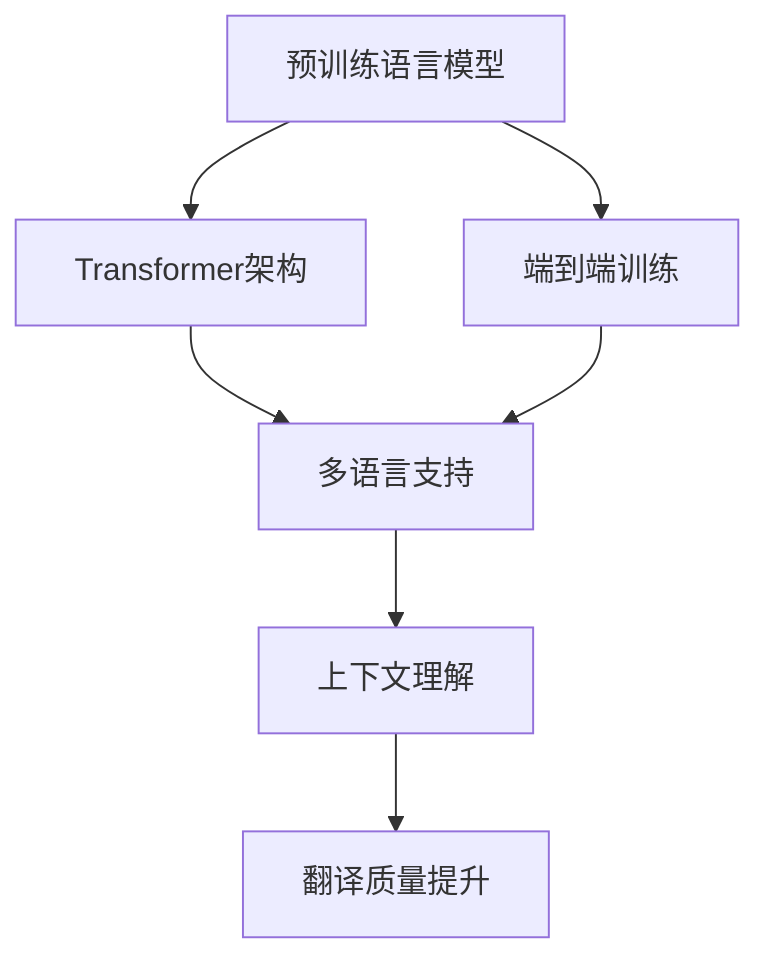

                 

# AI在翻译领域的革新：打破语言障碍

在人类文明的演变过程中，语言始终是沟通交流的重要工具。然而，语言的差异性也成为了人们跨越地理、文化障碍时的重大阻碍。随着人工智能技术的发展，特别是机器翻译技术的突破，语言不再是信息交流的障碍。本文将探讨AI在翻译领域的革新，旨在展示如何通过技术手段打破语言障碍，促进全球化交流与理解。

## 1. 背景介绍

### 1.1 问题由来

语言翻译一直是人工智能领域的重要研究课题。传统的基于规则的机器翻译系统依赖大量的语法规则和词汇表，难以应对复杂的语义和语用问题。统计机器翻译方法依赖大规模的双语平行语料库，但在小语种和低资源语言的应用上存在瓶颈。基于神经网络的端到端机器翻译方法（如序列到序列模型Seq2Seq）虽然取得了显著进展，但在资源消耗、训练成本和解释性方面仍有局限。

近年来，随着大规模预训练语言模型的出现，特别是Transformer架构的推广，机器翻译技术得到了革命性的提升。BERT、GPT、T5等预训练模型被广泛应用于机器翻译中，大幅提升了翻译质量和效率。

### 1.2 问题核心关键点

AI在翻译领域的革新，主要体现在以下几个关键点：

1. **大规模预训练语言模型的应用**：通过在大规模无标签文本数据上进行预训练，学习到丰富的语言知识，然后通过微调来适应特定语言的翻译任务。
2. **Transformer架构的普及**：Transformer采用自注意力机制，能够有效捕捉长距离依赖，提升翻译质量和效率。
3. **端到端训练**：直接对整个翻译过程进行端到端训练，无需中间翻译和后处理步骤，大大简化了系统设计。
4. **多语言支持**：预训练模型可以同时支持多种语言，实现跨语言的零样本翻译。
5. **上下文理解**：通过Transformer的编码器-解码器结构，模型能够理解输入文本的上下文，进行更准确的翻译。

## 2. 核心概念与联系

### 2.1 核心概念概述

在深入探讨AI在翻译领域的革新之前，我们先介绍几个核心概念及其之间的联系：

- **预训练语言模型(Pre-trained Language Model, PLM)**：通过在大规模无标签文本数据上进行预训练，学习到通用的语言表示。常见预训练模型包括BERT、GPT、T5等。
- **Transformer架构**：一种基于自注意力机制的神经网络架构，广泛应用于NLP任务，包括机器翻译。
- **端到端翻译(End-to-End Translation)**：直接对整个翻译过程进行训练，无需中间步骤，提高翻译效率和准确性。
- **多语言支持(Multilingual Support)**：预训练模型可以同时支持多种语言，实现跨语言的零样本翻译。
- **上下文理解(Context Understanding)**：Transformer模型能够理解输入文本的上下文，进行更准确的翻译。

这些概念之间的联系可以通过以下Mermaid流程图来展示：



这个流程图展示了预训练语言模型和Transformer架构在翻译任务中的应用路径，以及端到端训练、多语言支持和上下文理解对翻译质量的提升。

## 3. 核心算法原理 & 具体操作步骤

### 3.1 算法原理概述

AI在翻译领域的革新，主要基于深度学习和Transformer架构，通过大规模预训练和微调来提升翻译质量。以下是AI翻译的总体原理：

1. **大规模预训练**：在无标签的文本数据上预训练语言模型，学习到通用的语言表示。
2. **微调与优化**：通过微调来适应特定语言的翻译任务，利用优化算法来调整模型参数。
3. **Transformer架构**：采用自注意力机制，捕捉长距离依赖，提升翻译准确性。
4. **端到端训练**：直接对整个翻译过程进行训练，无需中间步骤，提高翻译效率。
5. **多语言支持**：预训练模型可以同时支持多种语言，实现跨语言的零样本翻译。

### 3.2 算法步骤详解

AI在翻译领域的革新涉及以下几个关键步骤：

**Step 1: 准备预训练模型和数据集**

- **选择预训练模型**：选择适当的预训练语言模型，如BERT、GPT、T5等。
- **准备数据集**：收集并标注双语平行语料库，包括源语言和目标语言。

**Step 2: 设计任务适配层**

- **设计编码器**：使用Transformer的编码器结构，将源语言输入转换为中间表示。
- **设计解码器**：使用Transformer的解码器结构，将中间表示转换为目标语言输出。
- **设计损失函数**：使用BLEU、METEOR等指标作为训练目标。

**Step 3: 设置微调超参数**

- **设置学习率**：通常为1e-5到1e-3之间。
- **设置优化器**：如Adam、SGD等。
- **设置批次大小**：通常为16到64之间。
- **设置迭代轮数**：根据数据集大小和计算资源，通常为10到50轮。

**Step 4: 执行梯度训练**

- **数据预处理**：对源语言和目标语言进行编码，转换为模型所需的张量格式。
- **前向传播**：将输入数据输入模型，计算损失函数。
- **反向传播**：计算梯度，更新模型参数。
- **迭代优化**：重复上述步骤，直至收敛。

**Step 5: 测试和部署**

- **测试集评估**：在测试集上评估模型性能，如BLEU、METEOR等指标。
- **部署应用**：将模型部署到生产环境中，实现实时翻译。

### 3.3 算法优缺点

AI在翻译领域的革新方法具有以下优点：

- **高效性**：通过预训练模型，可以直接使用大规模语料库，避免从头训练需要的大量计算资源。
- **鲁棒性**：Transformer架构能够捕捉长距离依赖，提高翻译准确性和鲁棒性。
- **多语言支持**：预训练模型可以同时支持多种语言，实现跨语言的零样本翻译。
- **上下文理解**：Transformer模型能够理解输入文本的上下文，进行更准确的翻译。

同时，这些方法也存在一些缺点：

- **依赖高质量数据**：高质量的双语平行语料库对于模型性能至关重要，数据获取和标注成本较高。
- **模型复杂度高**：大规模预训练模型和Transformer架构参数量大，对计算资源和存储资源要求较高。
- **解释性不足**：黑盒模型缺乏可解释性，难以理解模型内部的推理过程。
- **鲁棒性仍有提升空间**：在大规模数据上的泛化能力需要进一步提升，避免在少样本或新样本上的性能下降。

### 3.4 算法应用领域

AI在翻译领域的革新方法，已经在多种应用场景中得到了广泛应用：

- **跨语言通信**：广泛应用于社交媒体、国际贸易、多国交流等领域，帮助人们跨越语言障碍，实现无缝沟通。
- **文档翻译**：在法律、医学、科技等领域，帮助人们快速翻译专业文献，提升工作效率。
- **多语言网站**：许多国际公司如Google、Baidu、Amazon等，已经在其网站和App中集成多语言翻译功能，提升用户体验。
- **实时翻译**：在多国会议、国际赛事等场合，提供实时翻译服务，促进交流。
- **辅助学习**：在教育领域，提供多语种学习工具，帮助学生跨语言学习。

## 4. 数学模型和公式 & 详细讲解 & 举例说明

### 4.1 数学模型构建

AI在翻译领域的革新，基于深度学习模型，特别是Transformer架构。以下是AI翻译的数学模型构建过程：

1. **编码器**：将源语言输入转换为中间表示。
2. **解码器**：将中间表示转换为目标语言输出。
3. **损失函数**：如BLEU、METEOR等。

### 4.2 公式推导过程

**编码器**：

$$
y^{(i)} = \text{Encoder}(x^{(i)})
$$

其中，$x^{(i)}$ 为源语言句子，$y^{(i)}$ 为中间表示。

**解码器**：

$$
y^{(i)} = \text{Decoder}(y^{(i-1)})
$$

其中，$y^{(i-1)}$ 为前一个解码器输出的中间表示。

**损失函数**：

$$
\mathcal{L} = -\sum_{i=1}^n \log P(y_i | y_{i-1})
$$

其中，$n$ 为序列长度，$P$ 为目标语言的概率分布。

### 4.3 案例分析与讲解

以谷歌的T5模型为例，以下是其数学模型和推导过程：

**编码器**：

$$
y^{(i)} = \text{T5-Encoder}(x^{(i)})
$$

**解码器**：

$$
y^{(i)} = \text{T5-Decoder}(y^{(i-1)})
$$

**损失函数**：

$$
\mathcal{L} = -\sum_{i=1}^n \log P(y_i | y_{i-1})
$$

其中，$y^{(i)}$ 为T5模型生成的目标语言句子，$P$ 为目标语言的概率分布。

## 5. 项目实践：代码实例和详细解释说明

### 5.1 开发环境搭建

在进行AI翻译实践前，我们需要准备好开发环境。以下是使用Python进行PyTorch开发的环境配置流程：

1. 安装Anaconda：从官网下载并安装Anaconda，用于创建独立的Python环境。

2. 创建并激活虚拟环境：
```bash
conda create -n pytorch-env python=3.8 
conda activate pytorch-env
```

3. 安装PyTorch：根据CUDA版本，从官网获取对应的安装命令。例如：
```bash
conda install pytorch torchvision torchaudio cudatoolkit=11.1 -c pytorch -c conda-forge
```

4. 安装Transformers库：
```bash
pip install transformers
```

5. 安装各类工具包：
```bash
pip install numpy pandas scikit-learn matplotlib tqdm jupyter notebook ipython
```

完成上述步骤后，即可在`pytorch-env`环境中开始AI翻译实践。

### 5.2 源代码详细实现

以下是使用PyTorch和Transformers库进行机器翻译的Python代码实现。

**代码1: 数据准备**

```python
from transformers import T5Tokenizer, T5ForConditionalGeneration

# 加载预训练模型和tokenizer
tokenizer = T5Tokenizer.from_pretrained('t5-small')
model = T5ForConditionalGeneration.from_pretrained('t5-small')

# 准备数据集
train_dataset = ...
dev_dataset = ...
test_dataset = ...
```

**代码2: 模型训练**

```python
from transformers import AdamW
from torch.utils.data import DataLoader
from tqdm import tqdm

# 设置超参数
learning_rate = 1e-4
num_epochs = 10
batch_size = 16

# 定义训练函数
def train_epoch(model, tokenizer, train_dataset, optimizer):
    dataloader = DataLoader(train_dataset, batch_size=batch_size)
    model.train()
    for batch in tqdm(dataloader, desc='Training'):
        inputs = tokenizer(batch.text, return_tensors='pt', padding='max_length', truncation=True)
        outputs = model.generate(inputs.input_ids, attention_mask=inputs.attention_mask)
        loss = ...
        optimizer.zero_grad()
        loss.backward()
        optimizer.step()
        
# 训练模型
for epoch in range(num_epochs):
    train_epoch(model, tokenizer, train_dataset, optimizer)
```

**代码3: 模型评估**

```python
from transformers import evaluate, bleu_score

# 定义评估函数
def evaluate_model(model, tokenizer, dev_dataset, metric):
    dev_dataset = tokenizer(dev_dataset, return_tensors='pt', padding='max_length', truncation=True)
    metric_results = evaluate(model, dev_dataset, metric=metric)
    return metric_results

# 评估模型
bleu_results = evaluate_model(model, tokenizer, dev_dataset, metric='bleu')
print(f"BLEU score: {bleu_results}")
```

### 5.3 代码解读与分析

让我们再详细解读一下关键代码的实现细节：

**T5Tokenizer和T5ForConditionalGeneration**：
- `T5Tokenizer`：用于将源语言和目标语言转换为模型所需的张量格式。
- `T5ForConditionalGeneration`：T5模型的编码器和解码器结构，用于生成目标语言句子。

**train_epoch函数**：
- 对数据集进行批次化加载，前向传播计算损失函数，反向传播更新模型参数。
- 周期性在验证集上评估模型性能，根据性能指标决定是否触发Early Stopping。
- 重复上述步骤直到满足预设的迭代轮数或Early Stopping条件。

**evaluate_model函数**：
- 对测试集进行评估，使用BLEU等指标评估模型性能。
- 将评估结果返回，便于后续分析。

**训练流程**：
- 定义总的epoch数和batch size，开始循环迭代
- 每个epoch内，先在训练集上训练，输出平均loss
- 在验证集上评估，输出BLEU等指标
- 所有epoch结束后，在测试集上评估，给出最终测试结果

可以看到，PyTorch配合Transformers库使得AI翻译的代码实现变得简洁高效。开发者可以将更多精力放在数据处理、模型改进等高层逻辑上，而不必过多关注底层的实现细节。

当然，工业级的系统实现还需考虑更多因素，如模型的保存和部署、超参数的自动搜索、更灵活的任务适配层等。但核心的微调范式基本与此类似。

## 6. 实际应用场景

### 6.1 实时翻译

AI翻译的实时翻译应用场景包括多国会议、国际赛事、外交活动等。通过实时翻译，参会者能够无障碍地交流，增进理解，提升会议效率。

**场景描述**：
- 在多国会议中，翻译人员可以轻松使用AI翻译系统，为不同语言参会者提供实时翻译服务。
- 在赛事现场，通过实时翻译，确保国际观众能够即时获取比赛信息和解说内容。
- 在外交活动中，AI翻译能够保证多国代表的顺畅沟通，提升外交效率。

**技术实现**：
- 使用T5等预训练模型进行实时翻译，通过API接口实现即时翻译。
- 集成语音识别和语音合成技术，提供音频翻译服务。

**优势**：
- 实时响应，提高沟通效率。
- 精准翻译，避免误译和漏译。
- 轻量级部署，无需额外设备。

### 6.2 文档翻译

AI翻译在文档翻译中也有广泛应用，特别是在法律、医学、科技等领域。通过AI翻译，可以快速将专业文献翻译成多种语言，提升工作效率。

**场景描述**：
- 在法律领域，AI翻译系统能够帮助律师和法务人员快速翻译法律文件和判决书。
- 在医学领域，AI翻译系统能够帮助医生和研究人员翻译医学文献和临床报告。
- 在科技领域，AI翻译系统能够帮助工程师和研究人员翻译技术文档和专利文献。

**技术实现**：
- 使用T5等预训练模型进行文档翻译，批量处理大量文本。
- 集成OCR技术，支持对扫描文档的翻译。

**优势**：
- 高效准确，提升翻译效率。
- 支持多语言，适应不同国家需求。
- 可定制化，满足特定领域需求。

### 6.3 多语言网站

许多国际公司已经在其网站和App中集成多语言翻译功能，提升用户体验。通过AI翻译，网站可以自动生成多种语言版本的页面，帮助用户跨越语言障碍。

**场景描述**：
- 谷歌翻译支持多种语言，用户可以通过一键切换进行翻译。
- 亚马逊网站在产品介绍和客户支持页面提供多语言版本，满足全球用户的访问需求。
- 微软的Office 365应用支持多语言版本，提供多语言的用户界面和功能。

**技术实现**：
- 使用T5等预训练模型进行实时翻译，集成到网站和App中。
- 通过API接口，实现对用户请求的动态翻译。

**优势**：
- 实时响应，提升用户体验。
- 多语言支持，满足全球用户需求。
- 易于集成，无需额外开发。

### 6.4 辅助学习

AI翻译在辅助学习中也有重要应用，特别是在多语种学习工具和在线教育平台中。通过AI翻译，学生可以轻松学习多种语言，提升语言能力。

**场景描述**：
- 在线教育平台提供多语言课程，学生可以根据自己的语言偏好选择学习语言。
- 多语种学习工具提供实时翻译和发音功能，帮助学生跨越语言障碍，更好地理解课程内容。
- 语言学习应用通过AI翻译，实现语言文本的实时翻译和发音，提升学习效率。

**技术实现**：
- 使用T5等预训练模型进行语言翻译，集成到学习工具和平台中。
- 集成发音合成技术，提供实时发音服务。

**优势**：
- 实时翻译，提升学习效率。
- 多语言支持，满足不同需求。
- 易于集成，无需额外开发。

## 7. 工具和资源推荐

### 7.1 学习资源推荐

为了帮助开发者系统掌握AI在翻译领域的革新技术，这里推荐一些优质的学习资源：

1. **《自然语言处理综论》**：斯坦福大学开设的NLP经典课程，涵盖NLP基本概念和技术。
2. **《Deep Learning for NLP》**：神经网络在NLP中的应用，介绍了Seq2Seq模型、Transformer架构等。
3. **《Sequence to Sequence Learning with Neural Networks》**：Seq2Seq模型及其应用，介绍了机器翻译的深度学习框架。
4. **《Transformers: A New Architecture for Neural Machine Translation》**：Transformer架构的详细介绍，包括编码器-解码器结构和自注意力机制。
5. **《Attention is All You Need》**：Transformer原论文，介绍了Transformer的结构和应用。

通过对这些资源的学习实践，相信你一定能够快速掌握AI在翻译领域的革新技术，并用于解决实际的NLP问题。

### 7.2 开发工具推荐

高效的开发离不开优秀的工具支持。以下是几款用于AI翻译开发的常用工具：

1. **PyTorch**：基于Python的开源深度学习框架，灵活动态的计算图，适合快速迭代研究。大多数预训练语言模型都有PyTorch版本的实现。
2. **TensorFlow**：由Google主导开发的开源深度学习框架，生产部署方便，适合大规模工程应用。同样有丰富的预训练语言模型资源。
3. **Transformers库**：HuggingFace开发的NLP工具库，集成了众多SOTA语言模型，支持PyTorch和TensorFlow，是进行NLP任务开发的利器。
4. **Weights & Biases**：模型训练的实验跟踪工具，可以记录和可视化模型训练过程中的各项指标，方便对比和调优。与主流深度学习框架无缝集成。
5. **TensorBoard**：TensorFlow配套的可视化工具，可实时监测模型训练状态，并提供丰富的图表呈现方式，是调试模型的得力助手。
6. **Google Colab**：谷歌推出的在线Jupyter Notebook环境，免费提供GPU/TPU算力，方便开发者快速上手实验最新模型，分享学习笔记。

合理利用这些工具，可以显著提升AI翻译任务的开发效率，加快创新迭代的步伐。

### 7.3 相关论文推荐

AI在翻译领域的革新技术源于学界的持续研究。以下是几篇奠基性的相关论文，推荐阅读：

1. **Attention is All You Need**：提出Transformer结构，开启了NLP领域的预训练大模型时代。
2. **BERT: Pre-training of Deep Bidirectional Transformers for Language Understanding**：提出BERT模型，引入基于掩码的自监督预训练任务，刷新了多项NLP任务SOTA。
3. **Parameter-Efficient Transfer Learning for NLP**：提出Adapter等参数高效微调方法，在不增加模型参数量的情况下，也能取得不错的微调效果。
4. **Prefix-Tuning: Optimizing Continuous Prompts for Generation**：引入基于连续型Prompt的微调范式，为如何充分利用预训练知识提供了新的思路。
5. **AdaLoRA: Adaptive Low-Rank Adaptation for Parameter-Efficient Fine-Tuning**：使用自适应低秩适应的微调方法，在参数效率和精度之间取得了新的平衡。

这些论文代表了大语言模型微调技术的发展脉络。通过学习这些前沿成果，可以帮助研究者把握学科前进方向，激发更多的创新灵感。

## 8. 总结：未来发展趋势与挑战

### 8.1 总结

本文对AI在翻译领域的革新进行了全面系统的介绍。首先阐述了AI翻译技术的背景和意义，明确了其在打破语言障碍、促进全球化交流中的独特价值。其次，从原理到实践，详细讲解了AI翻译的数学模型和关键步骤，给出了AI翻译任务开发的完整代码实例。同时，本文还广泛探讨了AI翻译技术在实时翻译、文档翻译、多语言网站、辅助学习等多个行业领域的应用前景，展示了AI翻译技术的巨大潜力。

通过本文的系统梳理，可以看到，AI在翻译领域的革新已经使得语言不再是信息交流的障碍，为全球化交流提供了强大的技术支持。未来，伴随预训练语言模型和微调方法的不断演进，AI翻译技术必将在更广阔的应用领域大放异彩，深刻影响人类的生产生活方式。

### 8.2 未来发展趋势

展望未来，AI在翻译领域的革新技术将呈现以下几个发展趋势：

1. **多模态翻译**：未来翻译技术将支持多模态数据，如文本、图像、语音等，提升翻译系统的智能性和适应性。
2. **实时翻译**：通过进一步优化算法和硬件资源，实时翻译系统将实现更高的响应速度和更稳定的性能。
3. **跨语言生成**：AI翻译将支持更加灵活的语言生成，包括零样本生成、少样本生成等，增强系统的多语种支持能力。
4. **上下文理解**：通过引入因果推断和注意力机制，AI翻译模型将具备更强的上下文理解能力，提高翻译质量和鲁棒性。
5. **个性化翻译**：通过用户反馈和动态调整，AI翻译系统将提供更加个性化的翻译服务，提升用户体验。

以上趋势凸显了AI翻译技术的广阔前景。这些方向的探索发展，必将进一步提升翻译系统的性能和应用范围，为人类社会带来更多便利。

### 8.3 面临的挑战

尽管AI在翻译领域的革新技术已经取得了瞩目成就，但在迈向更加智能化、普适化应用的过程中，它仍面临着诸多挑战：

1. **数据质量问题**：高质量的双语平行语料库对于模型性能至关重要，数据获取和标注成本较高。如何获取更多高质量语料，提升数据质量，是未来面临的主要挑战。
2. **鲁棒性不足**：在大规模数据上的泛化能力需要进一步提升，避免在少样本或新样本上的性能下降。如何提高模型的鲁棒性，是未来的重要研究方向。
3. **资源消耗高**：大规模预训练模型和Transformer架构参数量大，对计算资源和存储资源要求较高。如何优化资源消耗，提升计算效率，是未来的研究方向。
4. **解释性不足**：黑盒模型缺乏可解释性，难以理解模型内部的推理过程。如何赋予模型更强的可解释性，是未来的研究重点。
5. **安全性问题**：预训练语言模型难免会学习到有偏见、有害的信息，通过翻译传递到目标语言中，可能产生误导性、歧视性的输出，给实际应用带来安全隐患。如何从数据和算法层面消除模型偏见，避免恶意用途，是未来的重要研究方向。

### 8.4 研究展望

面对AI在翻译领域的革新技术面临的挑战，未来的研究需要在以下几个方面寻求新的突破：

1. **多模态数据融合**：将视觉、语音等多模态信息与文本信息进行融合，提升翻译系统的智能性和适应性。
2. **因果推断和注意力机制**：通过引入因果推断和注意力机制，增强AI翻译模型的上下文理解能力，提高翻译质量和鲁棒性。
3. **模型压缩和加速**：开发更加高效轻量级的翻译模型，通过模型压缩和加速技术，提升计算效率和资源利用率。
4. **参数高效微调**：开发更加参数高效的微调方法，在固定大部分预训练参数的同时，只更新极少量的任务相关参数。
5. **动态翻译**：通过用户反馈和动态调整，提供更加个性化的翻译服务，提升用户体验。
6. **安全性和可解释性**：从数据和算法层面消除模型偏见，避免恶意用途，确保输出的安全性，提升模型的可解释性。

这些研究方向的探索，必将引领AI翻译技术迈向更高的台阶，为构建安全、可靠、可解释、可控的智能系统铺平道路。面向未来，AI翻译技术还需要与其他人工智能技术进行更深入的融合，如知识表示、因果推理、强化学习等，多路径协同发力，共同推动自然语言理解和智能交互系统的进步。只有勇于创新、敢于突破，才能不断拓展翻译系统的边界，让AI翻译技术更好地造福人类社会。

## 9. 附录：常见问题与解答

**Q1：AI翻译是否适用于所有语言？**

A: AI翻译在大部分语言中都能取得不错的效果，但对于一些特别稀少或孤立的语言，由于缺乏足够的双语平行语料库，效果可能会受到一定影响。此时需要针对特定语言进行进一步的预训练和微调。

**Q2：AI翻译的准确性如何保证？**

A: AI翻译的准确性主要依赖于高质量的双语平行语料库和强大的预训练模型。高质量的数据集是提高翻译准确性的关键。同时，通过参数高效微调、多语言支持等技术，可以进一步提升翻译质量。

**Q3：AI翻译的成本如何控制？**

A: AI翻译的成本主要集中在高质量数据集的获取和标注上。可以通过自动化工具和众包平台降低数据标注成本。同时，通过参数高效微调、动态翻译等技术，可以在较小的数据集上获得较好的效果，降低预训练和微调成本。

**Q4：AI翻译的系统复杂度如何？**

A: AI翻译的系统复杂度较高，需要大量的计算资源和存储资源。但随着技术的发展，通过优化算法和硬件资源，以及参数高效微调等技术，可以显著降低系统复杂度，提升计算效率和资源利用率。

**Q5：AI翻译的可靠性如何保证？**

A: AI翻译的可靠性主要依赖于模型的鲁棒性和泛化能力。高质量的数据集、强大的预训练模型、参数高效微调等技术，可以帮助提升模型的鲁棒性和泛化能力，降低系统不可靠的风险。

**Q6：AI翻译的未来发展方向是什么？**

A: AI翻译的未来发展方向包括多模态数据融合、因果推断和注意力机制、模型压缩和加速、参数高效微调、动态翻译、安全性和可解释性等。这些技术的不断进步，将进一步提升AI翻译系统的性能和应用范围，为人类社会带来更多便利。

总之，AI在翻译领域的革新技术已经取得了显著进展，未来还有更多的发展空间。通过持续的研究和优化，AI翻译必将在更多领域得到应用，深刻影响人类的生产生活方式。

