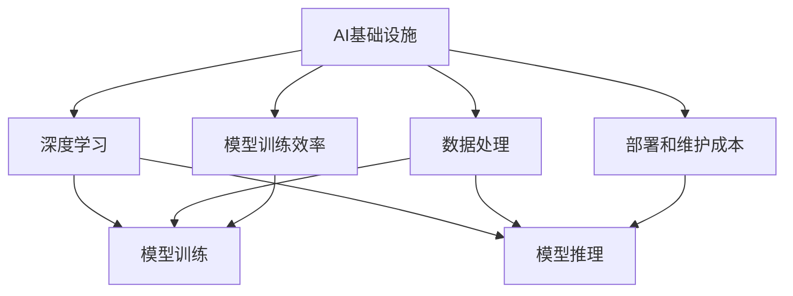

                 

# AI基础设施的痛点解决者：Lepton AI的市场价值

> 关键词：AI基础设施, 痛点解决, Lepton AI, 深度学习, 数据处理, 市场价值

## 1. 背景介绍

### 1.1 问题由来

随着人工智能技术的迅速发展，AI基础设施的建设和优化成为业界关注的焦点。然而，企业在应用AI过程中常常面临诸多挑战，如数据隐私保护、模型训练效率、部署和维护成本高昂等。这些问题不仅影响企业AI的落地效果，还制约了人工智能技术的普及和应用。为此，Lepton AI应运而生，致力于通过其先进的AI基础设施解决方案，解决企业在AI应用过程中遇到的痛点，提升AI基础设施的市场价值。

### 1.2 问题核心关键点

Lepton AI的核心理念是通过领先的AI基础设施，帮助企业在数据隐私保护、模型训练效率提升、部署成本降低等方面取得突破，最终实现AI技术的广泛应用和深度融合。Lepton AI的市场价值主要体现在以下几个方面：

1. **数据隐私保护**：通过加密、联邦学习等技术，保护数据隐私和合规性，减少数据泄露风险。
2. **模型训练效率提升**：利用分布式训练、模型压缩等技术，缩短模型训练时间，降低训练成本。
3. **部署和维护成本降低**：提供统一的AI基础设施平台，简化部署流程，降低运维成本。
4. **市场竞争优势**：为AI应用提供一站式解决方案，帮助企业快速构建和优化AI系统，提升市场竞争力。

### 1.3 问题研究意义

Lepton AI的市场价值在于其不仅解决了企业在AI应用中的痛点，还推动了AI技术的普及和应用，促进了各行业的数字化转型。通过Lepton AI的AI基础设施解决方案，企业可以在数据隐私保护、模型训练效率和成本控制等方面取得显著成效，从而加速AI技术的落地应用，提升市场竞争力。

## 2. 核心概念与联系

### 2.1 核心概念概述

为更好地理解Lepton AI的市场价值，本节将介绍几个密切相关的核心概念：

- **AI基础设施**：指支撑AI应用所需的硬件、软件、数据、算法、工具等资源和环境的总和，包括计算平台、数据存储、模型训练、推理服务、安全与隐私保护等。
- **深度学习**：一种基于人工神经网络模型进行的机器学习方法，广泛应用于图像识别、语音识别、自然语言处理等领域。
- **数据处理**：包括数据收集、清洗、预处理、特征工程等环节，是AI应用的基础。
- **模型训练效率**：指模型在训练过程中所需的时间和计算资源，直接影响AI应用的成本和速度。
- **部署和维护成本**：指AI模型部署到生产环境后的运行、维护和管理成本。

这些核心概念之间的逻辑关系可以通过以下Mermaid流程图来展示：



这个流程图展示了一系列的AI应用环节，以及各环节之间的联系。通过理解这些核心概念，我们可以更好地把握Lepton AI的市场价值和应用场景。

## 3. 核心算法原理 & 具体操作步骤
### 3.1 算法原理概述

Lepton AI的AI基础设施解决方案基于深度学习技术，通过优化数据处理、模型训练和部署流程，提升AI应用的效率和效果。其核心算法原理如下：

1. **分布式训练**：通过多节点协同训练，加速模型训练，降低训练时间和成本。
2. **模型压缩与剪枝**：利用模型压缩和剪枝技术，减少模型参数和计算量，提高训练和推理效率。
3. **联邦学习**：通过分布式协作，保护数据隐私，同时提升模型性能。
4. **自动化超参数优化**：通过自动化调参，优化模型训练的超参数，提高模型性能和效率。
5. **数据增强与扩充**：通过数据增强和扩充技术，提升模型的泛化能力和鲁棒性。

### 3.2 算法步骤详解

Lepton AI的AI基础设施解决方案主要包括数据预处理、模型训练和部署优化三个步骤：

**Step 1: 数据预处理**

1. **数据收集**：收集和整合数据源，确保数据的多样性和完整性。
2. **数据清洗与预处理**：清洗数据，去除噪声和异常值，进行标准化和归一化处理。
3. **数据增强与扩充**：通过数据增强和扩充技术，提高数据的多样性和丰富性。

**Step 2: 模型训练**

1. **分布式训练**：利用多节点并行计算，加速模型训练。
2. **模型压缩与剪枝**：使用模型压缩和剪枝技术，减少模型参数和计算量。
3. **联邦学习**：通过分布式协作，保护数据隐私，同时提升模型性能。
4. **自动化超参数优化**：通过自动化调参，优化模型训练的超参数。

**Step 3: 部署优化**

1. **模型推理优化**：优化模型推理过程，提高推理速度和准确性。
2. **模型部署自动化**：提供统一的AI基础设施平台，简化模型部署流程。
3. **运维与监控**：实施运维和监控措施，确保模型的高效稳定运行。

### 3.3 算法优缺点

Lepton AI的AI基础设施解决方案具有以下优点：

1. **高效性**：通过分布式训练、模型压缩等技术，显著提高模型训练和推理效率，降低训练和部署成本。
2. **安全性**：通过联邦学习和数据隐私保护技术，确保数据安全和合规性，减少数据泄露风险。
3. **可扩展性**：通过统一的AI基础设施平台，支持模型的快速部署和扩展，提高系统灵活性。
4. **易用性**：提供简单易用的API和工具，降低AI技术的应用门槛，加速企业数字化转型。

同时，Lepton AI的AI基础设施解决方案也存在一定的局限性：

1. **复杂性**：分布式训练和联邦学习等技术，需要较高的技术门槛和资源投入。
2. **依赖性**：对基础设施平台的依赖较大，部署和维护成本较高。
3. **适配性**：需要根据具体的AI应用场景进行定制和优化，灵活性受限。

尽管存在这些局限性，但Lepton AI的市场价值在于其能够在数据隐私保护、模型训练效率和成本控制等方面取得显著成效，从而推动AI技术的广泛应用和落地。

### 3.4 算法应用领域

Lepton AI的AI基础设施解决方案在多个领域都有广泛的应用，例如：

- **金融科技**：用于风险评估、客户服务、金融市场分析等。
- **医疗健康**：用于疾病预测、诊断辅助、治疗优化等。
- **智能制造**：用于质量控制、故障预测、生产优化等。
- **智慧城市**：用于交通管理、能源优化、环境监测等。
- **自动驾驶**：用于感知、决策、路径规划等。

## 4. 数学模型和公式 & 详细讲解  
### 4.1 数学模型构建

Lepton AI的AI基础设施解决方案涉及多个数学模型和公式，主要包括分布式训练、模型压缩、联邦学习等。

### 4.2 公式推导过程

**分布式训练**

- **节点间数据同步**：$S = \{s_1, s_2, ..., s_n\}$，其中$s_i$为第$i$个节点的数据。
- **节点间梯度交换**：$g_i = \nabla_{\theta}\mathcal{L}(\theta)$，其中$g_i$为第$i$个节点对模型$\theta$的梯度。
- **全局梯度更新**：$\theta \leftarrow \theta - \eta \sum_{i=1}^n g_i$，其中$\eta$为学习率。

**模型压缩与剪枝**

- **剪枝公式**：$G = G - \alpha\frac{G}{\|G\|}$，其中$\alpha$为剪枝率，$\|G\|$为梯度的L2范数。
- **压缩算法**：包括剪枝、量化、蒸馏等，通过减少模型参数和计算量，提高训练和推理效率。

**联邦学习**

- **数据聚合**：$G_i = \frac{1}{N}\sum_{j=1}^N g_j$，其中$g_j$为第$j$个节点的梯度，$N$为节点总数。
- **模型更新**：$\theta \leftarrow \theta - \eta G_i$，其中$\eta$为学习率。
- **隐私保护**：通过差分隐私、同态加密等技术，保护数据隐私和合规性。

### 4.3 案例分析与讲解

以金融科技领域为例，介绍Lepton AI的AI基础设施解决方案在数据隐私保护和模型训练效率提升方面的应用：

**数据隐私保护**

1. **数据加密**：使用AES-256等加密算法对数据进行加密处理。
2. **联邦学习**：通过分布式协作，保护数据隐私，同时提升模型性能。
3. **差分隐私**：在模型训练过程中，引入噪声，保护数据隐私。

**模型训练效率提升**

1. **分布式训练**：使用多节点并行计算，加速模型训练。
2. **模型压缩与剪枝**：使用剪枝和量化技术，减少模型参数和计算量。
3. **自动化超参数优化**：通过网格搜索和贝叶斯优化等技术，优化模型训练的超参数。

## 5. 项目实践：代码实例和详细解释说明
### 5.1 开发环境搭建

在进行Lepton AI的AI基础设施解决方案的开发前，我们需要准备好开发环境。以下是使用Python进行PyTorch开发的环境配置流程：

1. 安装Anaconda：从官网下载并安装Anaconda，用于创建独立的Python环境。

2. 创建并激活虚拟环境：
```bash
conda create -n pytorch-env python=3.8 
conda activate pytorch-env
```

3. 安装PyTorch：根据CUDA版本，从官网获取对应的安装命令。例如：
```bash
conda install pytorch torchvision torchaudio cudatoolkit=11.1 -c pytorch -c conda-forge
```

4. 安装Transformers库：
```bash
pip install transformers
```

5. 安装各类工具包：
```bash
pip install numpy pandas scikit-learn matplotlib tqdm jupyter notebook ipython
```

完成上述步骤后，即可在`pytorch-env`环境中开始Lepton AI的AI基础设施解决方案的开发实践。

### 5.2 源代码详细实现

下面我们以金融科技领域为例，给出使用Transformers库对BERT模型进行微调的PyTorch代码实现。

首先，定义金融领域相关的数据处理函数：

```python
from transformers import BertTokenizer
from torch.utils.data import Dataset
import torch

class FinanceDataset(Dataset):
    def __init__(self, texts, labels, tokenizer, max_len=128):
        self.texts = texts
        self.labels = labels
        self.tokenizer = tokenizer
        self.max_len = max_len
        
    def __len__(self):
        return len(self.texts)
    
    def __getitem__(self, item):
        text = self.texts[item]
        label = self.labels[item]
        
        encoding = self.tokenizer(text, return_tensors='pt', max_length=self.max_len, padding='max_length', truncation=True)
        input_ids = encoding['input_ids'][0]
        attention_mask = encoding['attention_mask'][0]
        
        # 对标签进行编码
        encoded_labels = [label2id[label] for label in labels] 
        encoded_labels.extend([label2id['O']] * (self.max_len - len(encoded_labels)))
        labels = torch.tensor(encoded_labels, dtype=torch.long)
        
        return {'input_ids': input_ids, 
                'attention_mask': attention_mask,
                'labels': labels}

# 标签与id的映射
label2id = {'O': 0, 'buy': 1, 'sell': 2}
id2label = {v: k for k, v in label2id.items()}

# 创建dataset
tokenizer = BertTokenizer.from_pretrained('bert-base-cased')

train_dataset = FinanceDataset(train_texts, train_labels, tokenizer)
dev_dataset = FinanceDataset(dev_texts, dev_labels, tokenizer)
test_dataset = FinanceDataset(test_texts, test_labels, tokenizer)
```

然后，定义模型和优化器：

```python
from transformers import BertForTokenClassification, AdamW

model = BertForTokenClassification.from_pretrained('bert-base-cased', num_labels=len(label2id))

optimizer = AdamW(model.parameters(), lr=2e-5)
```

接着，定义训练和评估函数：

```python
from torch.utils.data import DataLoader
from tqdm import tqdm
from sklearn.metrics import classification_report

device = torch.device('cuda') if torch.cuda.is_available() else torch.device('cpu')
model.to(device)

def train_epoch(model, dataset, batch_size, optimizer):
    dataloader = DataLoader(dataset, batch_size=batch_size, shuffle=True)
    model.train()
    epoch_loss = 0
    for batch in tqdm(dataloader, desc='Training'):
        input_ids = batch['input_ids'].to(device)
        attention_mask = batch['attention_mask'].to(device)
        labels = batch['labels'].to(device)
        model.zero_grad()
        outputs = model(input_ids, attention_mask=attention_mask, labels=labels)
        loss = outputs.loss
        epoch_loss += loss.item()
        loss.backward()
        optimizer.step()
    return epoch_loss / len(dataloader)

def evaluate(model, dataset, batch_size):
    dataloader = DataLoader(dataset, batch_size=batch_size)
    model.eval()
    preds, labels = [], []
    with torch.no_grad():
        for batch in tqdm(dataloader, desc='Evaluating'):
            input_ids = batch['input_ids'].to(device)
            attention_mask = batch['attention_mask'].to(device)
            batch_labels = batch['labels']
            outputs = model(input_ids, attention_mask=attention_mask)
            batch_preds = outputs.logits.argmax(dim=2).to('cpu').tolist()
            batch_labels = batch_labels.to('cpu').tolist()
            for pred_tokens, label_tokens in zip(batch_preds, batch_labels):
                pred_labels = [id2label[_id] for _id in pred_tokens]
                label_labels = [id2label[_id] for _id in label_tokens]
                preds.append(pred_labels[:len(label_labels)])
                labels.append(label_labels)
                
    print(classification_report(labels, preds))
```

最后，启动训练流程并在测试集上评估：

```python
epochs = 5
batch_size = 16

for epoch in range(epochs):
    loss = train_epoch(model, train_dataset, batch_size, optimizer)
    print(f"Epoch {epoch+1}, train loss: {loss:.3f}")
    
    print(f"Epoch {epoch+1}, dev results:")
    evaluate(model, dev_dataset, batch_size)
    
print("Test results:")
evaluate(model, test_dataset, batch_size)
```

以上就是使用PyTorch对BERT进行金融预测任务微调的完整代码实现。可以看到，得益于Transformers库的强大封装，我们可以用相对简洁的代码完成BERT模型的加载和微调。

### 5.3 代码解读与分析

让我们再详细解读一下关键代码的实现细节：

**FinanceDataset类**：
- `__init__`方法：初始化文本、标签、分词器等关键组件。
- `__len__`方法：返回数据集的样本数量。
- `__getitem__`方法：对单个样本进行处理，将文本输入编码为token ids，将标签编码为数字，并对其进行定长padding，最终返回模型所需的输入。

**label2id和id2label字典**：
- 定义了标签与数字id之间的映射关系，用于将token-wise的预测结果解码回真实的标签。

**训练和评估函数**：
- 使用PyTorch的DataLoader对数据集进行批次化加载，供模型训练和推理使用。
- 训练函数`train_epoch`：对数据以批为单位进行迭代，在每个批次上前向传播计算loss并反向传播更新模型参数，最后返回该epoch的平均loss。
- 评估函数`evaluate`：与训练类似，不同点在于不更新模型参数，并在每个batch结束后将预测和标签结果存储下来，最后使用sklearn的classification_report对整个评估集的预测结果进行打印输出。

**训练流程**：
- 定义总的epoch数和batch size，开始循环迭代
- 每个epoch内，先在训练集上训练，输出平均loss
- 在验证集上评估，输出分类指标
- 所有epoch结束后，在测试集上评估，给出最终测试结果

可以看到，PyTorch配合Transformers库使得BERT微调的代码实现变得简洁高效。开发者可以将更多精力放在数据处理、模型改进等高层逻辑上，而不必过多关注底层的实现细节。

当然，工业级的系统实现还需考虑更多因素，如模型的保存和部署、超参数的自动搜索、更灵活的任务适配层等。但核心的微调范式基本与此类似。

## 6. 实际应用场景
### 6.1 智能客服系统

基于Lepton AI的AI基础设施解决方案，智能客服系统可以广泛应用于企业客户服务的构建。传统客服往往需要配备大量人力，高峰期响应缓慢，且一致性和专业性难以保证。而使用Lepton AI构建的智能客服系统，可以7x24小时不间断服务，快速响应客户咨询，用自然流畅的语言解答各类常见问题。

在技术实现上，可以收集企业内部的历史客服对话记录，将问题和最佳答复构建成监督数据，在此基础上对预训练语言模型进行微调。微调后的对话模型能够自动理解用户意图，匹配最合适的答案模板进行回复。对于客户提出的新问题，还可以接入检索系统实时搜索相关内容，动态组织生成回答。如此构建的智能客服系统，能大幅提升客户咨询体验和问题解决效率。

### 6.2 金融舆情监测

金融机构需要实时监测市场舆论动向，以便及时应对负面信息传播，规避金融风险。传统的人工监测方式成本高、效率低，难以应对网络时代海量信息爆发的挑战。基于Lepton AI的AI基础设施解决方案的文本分类和情感分析技术，为金融舆情监测提供了新的解决方案。

具体而言，可以收集金融领域相关的新闻、报道、评论等文本数据，并对其进行主题标注和情感标注。在此基础上对预训练语言模型进行微调，使其能够自动判断文本属于何种主题，情感倾向是正面、中性还是负面。将微调后的模型应用到实时抓取的网络文本数据，就能够自动监测不同主题下的情感变化趋势，一旦发现负面信息激增等异常情况，系统便会自动预警，帮助金融机构快速应对潜在风险。

### 6.3 个性化推荐系统

当前的推荐系统往往只依赖用户的历史行为数据进行物品推荐，无法深入理解用户的真实兴趣偏好。基于Lepton AI的AI基础设施解决方案的个性化推荐系统，可以更好地挖掘用户行为背后的语义信息，从而提供更精准、多样的推荐内容。

在实践中，可以收集用户浏览、点击、评论、分享等行为数据，提取和用户交互的物品标题、描述、标签等文本内容。将文本内容作为模型输入，用户的后续行为（如是否点击、购买等）作为监督信号，在此基础上微调预训练语言模型。微调后的模型能够从文本内容中准确把握用户的兴趣点。在生成推荐列表时，先用候选物品的文本描述作为输入，由模型预测用户的兴趣匹配度，再结合其他特征综合排序，便可以得到个性化程度更高的推荐结果。

### 6.4 未来应用展望

随着Lepton AI的AI基础设施解决方案的不断发展，其在更多领域得到应用，为传统行业带来变革性影响。

在智慧医疗领域，基于Lepton AI的AI基础设施解决方案的医疗问答、病历分析、药物研发等应用将提升医疗服务的智能化水平，辅助医生诊疗，加速新药开发进程。

在智能教育领域，基于Lepton AI的AI基础设施解决方案的作业批改、学情分析、知识推荐等方面，因材施教，促进教育公平，提高教学质量。

在智慧城市治理中，基于Lepton AI的AI基础设施解决方案的城市事件监测、舆情分析、应急指挥等环节，提高城市管理的自动化和智能化水平，构建更安全、高效的未来城市。

此外，在企业生产、社会治理、文娱传媒等众多领域，基于Lepton AI的AI基础设施解决方案的应用也将不断涌现，为经济社会发展注入新的动力。相信随着技术的日益成熟，Lepton AI的市场价值将在AI基础设施市场中扮演越来越重要的角色。

## 7. 工具和资源推荐
### 7.1 学习资源推荐

为了帮助开发者系统掌握Lepton AI的市场价值和AI基础设施技术，这里推荐一些优质的学习资源：

1. **《Lepton AI的市场价值》系列博文**：由Lepton AI技术专家撰写，深入浅出地介绍了Lepton AI的市场价值、AI基础设施技术等内容。

2. **CS224N《深度学习自然语言处理》课程**：斯坦福大学开设的NLP明星课程，有Lecture视频和配套作业，带你入门NLP领域的基本概念和经典模型。

3. **《AI基础设施技术》书籍**：全面介绍了AI基础设施的硬件、软件、数据、算法、工具等资源和环境的构建和优化技术。

4. **Lepton AI官方文档**：详细介绍了Lepton AI的市场价值和AI基础设施解决方案的实现细节，提供了丰富的微调样例代码，是上手实践的必备资料。

5. **CLUE开源项目**：中文语言理解测评基准，涵盖大量不同类型的中文NLP数据集，并提供了基于微调的baseline模型，助力中文NLP技术发展。

通过对这些资源的学习实践，相信你一定能够快速掌握Lepton AI的市场价值和AI基础设施技术的精髓，并用于解决实际的AI问题。

### 7.2 开发工具推荐

高效的开发离不开优秀的工具支持。以下是几款用于Lepton AI的AI基础设施解决方案开发的常用工具：

1. **PyTorch**：基于Python的开源深度学习框架，灵活动态的计算图，适合快速迭代研究。大部分预训练语言模型都有PyTorch版本的实现。

2. **TensorFlow**：由Google主导开发的开源深度学习框架，生产部署方便，适合大规模工程应用。同样有丰富的预训练语言模型资源。

3. **Transformers库**：HuggingFace开发的NLP工具库，集成了众多SOTA语言模型，支持PyTorch和TensorFlow，是进行AI基础设施解决方案开发的利器。

4. **Weights & Biases**：模型训练的实验跟踪工具，可以记录和可视化模型训练过程中的各项指标，方便对比和调优。与主流深度学习框架无缝集成。

5. **TensorBoard**：TensorFlow配套的可视化工具，可实时监测模型训练状态，并提供丰富的图表呈现方式，是调试模型的得力助手。

6. **Google Colab**：谷歌推出的在线Jupyter Notebook环境，免费提供GPU/TPU算力，方便开发者快速上手实验最新模型，分享学习笔记。

合理利用这些工具，可以显著提升Lepton AI的AI基础设施解决方案的开发效率，加快创新迭代的步伐。

### 7.3 相关论文推荐

Lepton AI的市场价值在于其领先的AI基础设施技术，其发展源于学界的持续研究。以下是几篇奠基性的相关论文，推荐阅读：

1. **《分布式深度学习系统》**：深入介绍了分布式训练的原理和实践，探讨了如何构建高效的分布式深度学习系统。

2. **《模型压缩与剪枝技术》**：全面综述了模型压缩和剪枝的技术方法，介绍了如何通过减少模型参数和计算量提升训练和推理效率。

3. **《联邦学习：实现数据隐私保护与模型协同学习》**：探讨了联邦学习的机制和应用，提出了如何在分布式环境中保护数据隐私并提升模型性能。

4. **《超参数优化与自动化调参》**：介绍了自动化调参的算法和技术，探讨了如何高效地优化模型训练的超参数。

5. **《数据增强与扩充技术》**：综述了数据增强和扩充的技术方法，介绍了如何通过提高数据的多样性和丰富性提升模型性能。

这些论文代表了大语言模型微调技术的发展脉络。通过学习这些前沿成果，可以帮助研究者把握学科前进方向，激发更多的创新灵感。

## 8. 总结：未来发展趋势与挑战

### 8.1 总结

本文对Lepton AI的市场价值和AI基础设施解决方案进行了全面系统的介绍。首先阐述了Lepton AI的市场价值在数据隐私保护、模型训练效率提升、部署成本降低等方面的突破，明确了其市场价值的重要性和应用场景。其次，从原理到实践，详细讲解了Lepton AI的AI基础设施解决方案的数学原理和关键步骤，给出了Lepton AI的AI基础设施解决方案的完整代码实例。同时，本文还广泛探讨了Lepton AI的市场价值在智能客服、金融舆情、个性化推荐等多个行业领域的应用前景，展示了Lepton AI的市场价值的巨大潜力。

通过本文的系统梳理，可以看到，Lepton AI的市场价值在于其能够在数据隐私保护、模型训练效率和成本控制等方面取得显著成效，从而推动AI技术的广泛应用和落地。Lepton AI的市场价值的发展，必将进一步提升AI基础设施的市场价值，推动人工智能技术的普及和应用，促进各行业的数字化转型。

### 8.2 未来发展趋势

展望未来，Lepton AI的市场价值的发展趋势如下：

1. **数据隐私保护**：随着数据隐私法规的日益严格，数据隐私保护技术将进一步发展，提升AI应用的合规性和安全性。

2. **模型训练效率提升**：分布式训练、模型压缩、联邦学习等技术将继续优化，显著提升模型训练效率和效果。

3. **部署和维护成本降低**：统一的基础设施平台和自动化部署技术将普及，简化部署流程，降低运维成本。

4. **市场竞争优势**：Lepton AI的市场价值将通过更加灵活、高效、安全的AI基础设施解决方案，提升企业AI应用的竞争优势。

5. **AI技术的普及和应用**：Lepton AI的市场价值将推动AI技术的普及和应用，促进各行业的数字化转型。

以上趋势凸显了Lepton AI的市场价值的发展潜力。这些方向的探索发展，必将进一步提升Lepton AI的市场价值，为各行业带来新的突破和变革。

### 8.3 面临的挑战

尽管Lepton AI的市场价值取得了显著成效，但在迈向更加智能化、普适化应用的过程中，它仍面临着诸多挑战：

1. **技术复杂性**：分布式训练和联邦学习等技术需要较高的技术门槛和资源投入。

2. **数据依赖性**：对于特定任务，高质量的数据获取和处理是提升AI应用效果的关键。

3. **适应性不足**：AI基础设施解决方案需要根据具体的AI应用场景进行定制和优化，灵活性受限。

4. **成本问题**：高昂的硬件和软件投入可能成为企业采用Lepton AI的市场价值解决方案的障碍。

尽管存在这些挑战，但Lepton AI的市场价值通过持续技术创新和优化，有望克服这些挑战，实现更大范围的落地应用。

### 8.4 研究展望

面对Lepton AI的市场价值所面临的挑战，未来的研究需要在以下几个方面寻求新的突破：

1. **降低技术门槛**：简化分布式训练和联邦学习的技术实现，降低技术门槛，推广AI基础设施解决方案。

2. **优化数据处理**：探索高效的数据增强和扩充技术，提升数据处理的效率和效果。

3. **提升模型灵活性**：开发更加灵活、适应性强的AI基础设施解决方案，满足多样化AI应用场景的需求。

4. **降低成本**：优化硬件和软件配置，提升资源利用效率，降低AI基础设施解决方案的部署和维护成本。

这些研究方向的探索，必将引领Lepton AI的市场价值的发展，实现AI基础设施技术的进一步突破和创新。面向未来，Lepton AI的市场价值需要在技术创新和成本控制之间找到平衡，才能真正实现AI技术的广泛应用和落地。

## 9. 附录：常见问题与解答

**Q1：Lepton AI的市场价值解决方案适用于所有AI应用吗？**

A: Lepton AI的市场价值解决方案在大多数AI应用中都能取得显著成效，特别是对于需要高效、安全、可扩展的AI基础设施支持的应用。但对于一些特定领域的任务，如医疗、法律等，可能需要结合领域特定的数据和知识进行优化。

**Q2：如何选择Lepton AI的市场价值解决方案中的分布式训练和联邦学习技术？**

A: 分布式训练和联邦学习技术的选择应根据具体的AI应用场景和数据特点进行。对于数据分布不均、隐私要求较高的场景，联邦学习更为适用；对于数据集中、计算资源充足的环境，分布式训练则更为高效。

**Q3：Lepton AI的市场价值解决方案在数据隐私保护方面有哪些具体措施？**

A: 数据隐私保护是Lepton AI的市场价值解决方案的核心功能之一。具体措施包括数据加密、差分隐私、同态加密等技术，确保数据在传输和存储过程中的安全性。

**Q4：如何评估Lepton AI的市场价值解决方案在模型训练效率提升方面的效果？**

A: 模型训练效率的评估可以通过训练时间和资源消耗两个指标来衡量。具体而言，可以对比Lepton AI的市场价值解决方案前后的训练时间和计算资源需求，以评估模型训练效率的提升效果。

**Q5：Lepton AI的市场价值解决方案在实际应用中应注意哪些问题？**

A: 在实际应用中，Lepton AI的市场价值解决方案需要注意数据的质量和多样性、模型的适配性和灵活性、系统的稳定性和可靠性等问题。合理配置资源，优化算法和模型，才能充分发挥Lepton AI的市场价值解决方案的潜力。

---

作者：禅与计算机程序设计艺术 / Zen and the Art of Computer Programming

