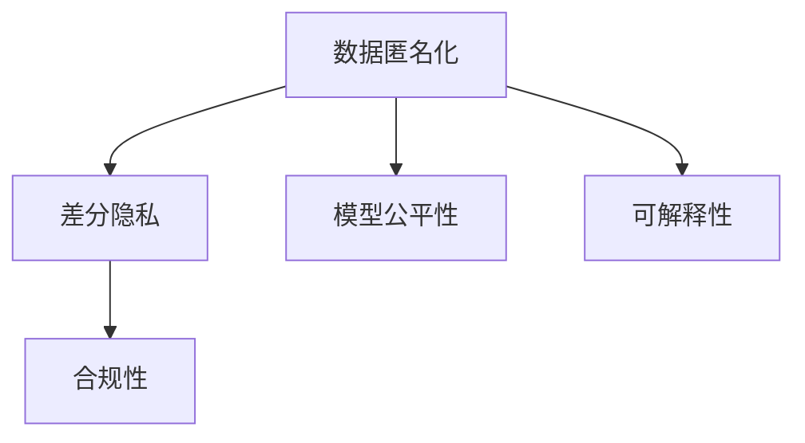

                 

## 1. 背景介绍

### 1.1 问题由来

近年来，随着人工智能技术的飞速发展，数据驱动的AI基础设施在各行各业的应用不断深入，如智能客服、自动驾驶、金融风控等。然而，这些基础设施在带来效率提升的同时，也带来了数据隐私保护的严峻挑战。用户的数据是AI系统的核心资产，任何数据泄露都可能导致严重的安全问题，甚至直接威胁到国家安全。

目前，数据隐私保护已经成为一个全球性的问题，各国政府和监管机构相继出台了相关法律法规，如欧盟的《通用数据保护条例》(GDPR)、美国的《加州消费者隐私法》(CCPA)等。这些法规对数据收集、存储、处理和传输等方面提出了严格要求，以保障用户隐私权。

在此背景下，Lepton AI公司凭借其在隐私保护领域多年的研究积累，推出了数据安全方案，旨在为AI基础设施提供一站式的隐私保护解决方案。

### 1.2 问题核心关键点

Lepton AI的数据安全方案，旨在实现以下几点关键目标：

- **数据匿名化**：通过数据匿名化技术，确保用户数据在传输和存储过程中不被直接识别。
- **差分隐私**：在数据统计分析中，通过差分隐私机制，保证用户数据不被单一记录影响。
- **模型公平性**：确保AI模型在训练和推理过程中，对不同群体的预测结果尽可能公平。
- **可解释性**：通过可解释性技术，使得AI模型的决策过程透明，用户能够理解和信任AI的输出结果。
- **合规性**：遵循全球隐私保护法规，确保数据处理合规性，保护用户隐私权。

这些目标不仅能够有效提升AI系统的安全性，还能增强用户对其的信任感，促进AI技术的健康发展。

## 2. 核心概念与联系

### 2.1 核心概念概述

为更好地理解Lepton AI的数据安全方案，本节将介绍几个密切相关的核心概念：

- **数据匿名化(Data Anonymization)**：通过移除、加密或替换等技术手段，将数据中的敏感信息去除，防止数据泄露。常见的数据匿名化方法包括K-匿名化、L-多样性、T-闭合性等。

- **差分隐私(Differential Privacy)**：一种隐私保护机制，通过在统计查询结果中加入随机噪声，使得单个记录的加入或移除对结果的影响极小，从而保护用户隐私。差分隐私被广泛应用于机器学习、数据挖掘等领域。

- **模型公平性(Model Fairness)**：确保AI模型在处理不同群体数据时，能够提供公正的预测结果，避免对某些群体产生偏见。模型公平性分为算法公平、结果公平和机会公平等类型。

- **可解释性(Explainability)**：通过可视化、解释性模型、规则等手段，使得AI模型的预测结果和决策过程透明，便于用户理解和信任。

- **合规性(Regulatory Compliance)**：遵循各国隐私保护法规，如GDPR、CCPA等，确保数据处理过程合规，保护用户隐私权。

这些核心概念之间的逻辑关系可以通过以下Mermaid流程图来展示：



这个流程图展示了大语言模型的核心概念及其之间的关系：

1. 数据匿名化通过移除或加密敏感信息，防止数据泄露。
2. 差分隐私在数据统计分析中，保护用户隐私。
3. 模型公平性确保AI模型对不同群体预测的公正性。
4. 可解释性使得AI模型的决策过程透明。
5. 合规性遵循全球隐私保护法规，确保数据处理合规。

这些概念共同构成了Lepton AI的数据安全框架，确保AI基础设施的隐私保护。

## 3. 核心算法原理 & 具体操作步骤

### 3.1 算法原理概述

Lepton AI的数据安全方案，基于一系列前沿的隐私保护算法和技术，确保AI基础设施在数据收集、存储、处理和传输等环节的安全性。其核心算法原理包括：

- **差分隐私算法**：通过在统计查询结果中加入随机噪声，确保单个记录的加入或移除对结果的影响极小。
- **数据匿名化算法**：通过移除、加密或替换等技术手段，确保数据中的敏感信息不被直接识别。
- **可解释性算法**：通过可视化、解释性模型、规则等手段，使得AI模型的决策过程透明。
- **模型公平性算法**：通过调整模型训练过程，确保不同群体数据在模型中的公平性。
- **合规性检查算法**：遵循各国隐私保护法规，确保数据处理合规性。

这些算法共同构成了Lepton AI的数据安全方案，确保AI基础设施的隐私保护。

### 3.2 算法步骤详解

Lepton AI的数据安全方案包括以下几个关键步骤：

**Step 1: 数据收集与预处理**

- 收集用户数据，并进行预处理，确保数据格式统一和数据质量。
- 对数据进行初步分析，识别敏感信息，制定数据匿名化策略。

**Step 2: 数据匿名化**

- 根据数据匿名化策略，对数据进行匿名化处理。
- 对匿名化后的数据进行差分隐私处理，确保统计分析结果的隐私性。

**Step 3: 数据存储与传输**

- 将匿名化后的数据存储在安全的数据库中，并采用加密技术保护数据。
- 在数据传输过程中，使用端到端加密技术确保数据安全性。

**Step 4: 模型训练与推理**

- 使用匿名化后的数据进行模型训练，确保模型学习到的是经过隐私保护的特征。
- 在模型推理过程中，加入差分隐私机制，确保推理结果的隐私性。

**Step 5: 模型评估与优化**

- 对模型进行评估，确保模型的公平性和可解释性。
- 根据评估结果，优化模型，提高模型的性能和隐私性。

**Step 6: 合规性检查与审计**

- 对数据处理和模型训练过程进行合规性检查，确保符合相关法律法规。
- 定期进行数据和模型审计，发现并修复潜在的安全漏洞。

通过以上步骤，Lepton AI的数据安全方案实现了数据隐私保护的全生命周期管理，确保AI基础设施的隐私安全。

### 3.3 算法优缺点

Lepton AI的数据安全方案具有以下优点：

1. **全面的隐私保护**：结合差分隐私、数据匿名化等技术，提供了多层次的隐私保护，确保数据在各个环节的安全性。
2. **高效的数据利用**：在保证隐私性的前提下，最大化数据利用率，提升AI系统的性能。
3. **严格的合规性**：遵循全球隐私保护法规，确保数据处理合规性，保护用户隐私权。
4. **透明的决策过程**：通过可解释性技术，使得AI模型的决策过程透明，用户能够理解和信任AI的输出结果。

同时，该方案也存在以下局限性：

1. **技术复杂度高**：隐私保护技术的实现需要较高的技术门槛，需要专业的技术团队支持。
2. **性能开销大**：差分隐私、数据匿名化等技术会增加额外的计算开销，影响AI系统的性能。
3. **合规性检查难度大**：不同国家/地区的隐私保护法规可能存在差异，合规性检查和审计工作复杂。

尽管存在这些局限性，Lepton AI的数据安全方案仍然是当前隐私保护领域的先进实践，具有重要的参考价值。

### 3.4 算法应用领域

Lepton AI的数据安全方案，已经广泛应用于以下几个领域：

- **智能客服**：通过差分隐私和数据匿名化技术，确保用户对话数据的安全性。
- **自动驾驶**：在车辆数据处理和模型训练过程中，确保数据隐私和合规性。
- **金融风控**：在金融数据处理和模型训练过程中，确保数据隐私和合规性。
- **医疗健康**：在医疗数据处理和模型训练过程中，确保数据隐私和合规性。
- **安全监控**：在视频数据处理和模型训练过程中，确保数据隐私和合规性。

除了上述这些应用场景外，Lepton AI的数据安全方案还适用于各种需要处理敏感数据的AI应用，为数据隐私保护提供了全面、高效的解决方案。

## 4. 数学模型和公式 & 详细讲解

### 4.1 数学模型构建

Lepton AI的数据安全方案，涉及多种隐私保护算法的数学模型构建。以下将以差分隐私为例，详细讲解其数学模型构建。

定义一个简单的数据集 $D=\{(x_i, y_i)\}_{i=1}^N$，其中 $x_i$ 表示用户特征， $y_i$ 表示标签。假设对 $D$ 进行差分隐私查询，查询函数为 $F(x)$，其查询结果为 $R=F(D)$。差分隐私的目标是，确保单个记录的加入或移除对 $R$ 的影响极小。

差分隐私通常使用拉普拉斯噪声来保护查询结果的隐私性。在每次查询 $F(x)$ 时，加入随机噪声 $\xi \sim \text{Laplace}(0, \epsilon)$，其中 $\epsilon$ 表示隐私预算。差分隐私的数学定义如下：

$$
R = F(D) + \xi \sim \text{Laplace}(0, \epsilon)
$$

其中 $\xi$ 的分布为拉普拉斯分布，其密度函数为：

$$
p(\xi) = \frac{1}{2b}e^{-\frac{|\xi|}{b}}
$$

其中 $b=\frac{\epsilon}{2}$。

通过拉普拉斯噪声的引入，差分隐私确保了单个记录的加入或移除对 $R$ 的影响极小，从而保护了用户隐私。

### 4.2 公式推导过程

以下我们以线性回归为例，推导差分隐私的数学公式及其推导过程。

假设训练集 $D=\{(x_i, y_i)\}_{i=1}^N$，其中 $x_i \in \mathbb{R}^d$， $y_i \in \mathbb{R}$。线性回归模型的目标是最小化均方误差损失：

$$
\ell(\theta) = \frac{1}{N}\sum_{i=1}^N (y_i - \theta^T x_i)^2
$$

其中 $\theta$ 为模型参数，$x_i$ 为输入，$y_i$ 为输出。

在差分隐私下，对训练集 $D$ 进行差分隐私处理，其查询结果为 $\hat{y} = F(D)$，其中 $F(D) = \theta^T D$。为了保证差分隐私，需要在 $F(D)$ 中引入拉普拉斯噪声 $\xi$：

$$
\hat{y} = F(D) + \xi \sim \text{Laplace}(0, \epsilon)
$$

将 $F(D)$ 带入损失函数中，得到差分隐私线性回归的损失函数：

$$
\ell(\theta, \epsilon) = \frac{1}{N}\sum_{i=1}^N (\hat{y}_i - \theta^T x_i)^2
$$

其中 $\hat{y}_i = \theta^T x_i + \xi_i \sim \text{Laplace}(0, \epsilon)$。

通过对 $\theta$ 进行优化，得到差分隐私线性回归的参数更新公式：

$$
\theta \leftarrow \theta - \eta \nabla_{\theta}\ell(\theta, \epsilon)
$$

其中 $\eta$ 为学习率，$\nabla_{\theta}\ell(\theta, \epsilon)$ 为损失函数对 $\theta$ 的梯度。

通过差分隐私线性回归的数学推导，我们可以看到，差分隐私通过在损失函数中引入拉普拉斯噪声，确保了模型参数 $\theta$ 的隐私性。

### 4.3 案例分析与讲解

**案例1: 差分隐私下的线性回归**

假设有一家电商公司，需要根据用户的历史购买记录预测其未来的购买意向。为了保护用户隐私，公司决定使用差分隐私线性回归模型。

首先，收集用户的历史购买记录 $D=\{(x_i, y_i)\}_{i=1}^N$，其中 $x_i$ 为用户的特征，$y_i$ 为购买意向。然后，对 $D$ 进行差分隐私处理，得到差分隐私的训练集 $\tilde{D}=\{(\tilde{x}_i, \tilde{y}_i)\}_{i=1}^N$，其中 $\tilde{y}_i = y_i + \xi_i \sim \text{Laplace}(0, \epsilon)$。

接着，对 $\tilde{D}$ 进行线性回归训练，得到模型参数 $\hat{\theta}$。最后，将 $\hat{\theta}$ 用于预测新的用户购买意向。

通过差分隐私线性回归，公司可以在不泄露用户隐私的情况下，预测用户的购买意向，保护用户隐私权。

**案例2: 差分隐私下的图像分类**

假设一家医疗机构，需要将病人的图像数据用于疾病诊断。为了保护病人隐私，决定使用差分隐私的图像分类模型。

首先，收集病人的图像数据 $D=\{(x_i, y_i)\}_{i=1}^N$，其中 $x_i$ 为病人的图像，$y_i$ 为疾病的分类标签。然后，对 $D$ 进行差分隐私处理，得到差分隐私的训练集 $\tilde{D}=\{(\tilde{x}_i, \tilde{y}_i)\}_{i=1}^N$，其中 $\tilde{y}_i = y_i + \xi_i \sim \text{Laplace}(0, \epsilon)$。

接着，对 $\tilde{D}$ 进行图像分类训练，得到模型参数 $\hat{\theta}$。最后，将 $\hat{\theta}$ 用于预测病人的疾病分类。

通过差分隐私的图像分类模型，医疗机构可以在不泄露病人隐私的情况下，进行疾病诊断，保护病人隐私权。

## 5. 项目实践：代码实例和详细解释说明

### 5.1 开发环境搭建

在进行隐私保护方案的开发前，我们需要准备好开发环境。以下是使用Python进行PyTorch开发的环境配置流程：

1. 安装Anaconda：从官网下载并安装Anaconda，用于创建独立的Python环境。

2. 创建并激活虚拟环境：
```bash
conda create -n privacy-env python=3.8 
conda activate privacy-env
```

3. 安装PyTorch：根据CUDA版本，从官网获取对应的安装命令。例如：
```bash
conda install pytorch torchvision torchaudio cudatoolkit=11.1 -c pytorch -c conda-forge
```

4. 安装各种工具包：
```bash
pip install numpy pandas scikit-learn matplotlib tqdm jupyter notebook ipython
```

完成上述步骤后，即可在`privacy-env`环境中开始隐私保护方案的开发。

### 5.2 源代码详细实现

这里我们以差分隐私线性回归为例，给出使用PyTorch实现差分隐私的代码实现。

首先，定义差分隐私线性回归的模型类：

```python
import torch
import torch.nn as nn
from torch.distributions.laplace import Laplace

class DifferentialPrivacyLinearRegression(nn.Module):
    def __init__(self, num_features, output_dim, epsilon):
        super(DifferentialPrivacyLinearRegression, self).__init__()
        self.linear = nn.Linear(num_features, output_dim)
        self.epsilon = epsilon
    
    def forward(self, x):
        output = self.linear(x)
        noise = Laplace(0, self.epsilon).sample()
        return output + noise
```

然后，定义差分隐私线性回归的训练函数：

```python
import torch.optim as optim
from sklearn.datasets import load_boston
from sklearn.model_selection import train_test_split

def train_differential_privacy_model(X, y, epochs, batch_size, learning_rate, epsilon):
    num_features = X.shape[1]
    output_dim = 1
    
    # 定义模型
    model = DifferentialPrivacyLinearRegression(num_features, output_dim, epsilon)
    
    # 定义优化器和损失函数
    optimizer = optim.Adam(model.parameters(), lr=learning_rate)
    criterion = nn.MSELoss()
    
    # 数据集划分
    X_train, X_test, y_train, y_test = train_test_split(X, y, test_size=0.2, random_state=42)
    
    # 训练模型
    for epoch in range(epochs):
        model.train()
        total_loss = 0
        for i in range(0, len(X_train), batch_size):
            X_batch = X_train[i:i+batch_size]
            y_batch = y_train[i:i+batch_size]
            output = model(X_batch)
            loss = criterion(output, y_batch)
            optimizer.zero_grad()
            loss.backward()
            optimizer.step()
            total_loss += loss.item()
        
        epoch_loss = total_loss / (len(X_train) // batch_size)
        print(f"Epoch {epoch+1}, train loss: {epoch_loss:.3f}")
    
    # 评估模型
    model.eval()
    with torch.no_grad():
        X_test = torch.tensor(X_test, dtype=torch.float32)
        y_test = torch.tensor(y_test, dtype=torch.float32)
        output = model(X_test)
        mse = criterion(output, y_test)
        print(f"Test loss: {mse:.3f}")
```

最后，启动差分隐私线性回归的训练流程并在测试集上评估：

```python
from sklearn.datasets import load_boston

# 加载波士顿房价数据集
data = load_boston()
X, y = data.data, data.target

# 定义超参数
epochs = 100
batch_size = 32
learning_rate = 0.01
epsilon = 0.1

# 定义模型
train_differential_privacy_model(X, y, epochs, batch_size, learning_rate, epsilon)
```

以上就是使用PyTorch实现差分隐私线性回归的完整代码实现。可以看到，得益于PyTorch的强大封装，我们可以用相对简洁的代码完成差分隐私模型的实现。

### 5.3 代码解读与分析

让我们再详细解读一下关键代码的实现细节：

**DifferentialPrivacyLinearRegression类**：
- `__init__`方法：初始化模型参数和隐私预算 $\epsilon$。
- `forward`方法：在输入 $x$ 上计算模型输出，并加入拉普拉斯噪声。

**train_differential_privacy_model函数**：
- 定义模型、优化器和损失函数。
- 对数据进行划分，并设置批次大小。
- 在每个epoch中，对批次数据进行前向传播和反向传播，更新模型参数。
- 计算每个epoch的平均损失，并在每个epoch后打印输出。
- 在训练结束后，在测试集上评估模型性能，并输出测试损失。

通过上述代码，我们展示了差分隐私线性回归的实现过程，可以看到，PyTorch提供了丰富的模型封装和自动微分功能，使得差分隐私算法的实现变得简洁高效。

当然，工业级的系统实现还需考虑更多因素，如模型的保存和部署、超参数的自动搜索、更灵活的任务适配层等。但核心的差分隐私算法实现基本与此类似。

## 6. 实际应用场景

### 6.1 智能客服系统

在智能客服系统中，客户对话数据包含了大量的个人敏感信息，如姓名、地址、电话号码等。为了保护用户隐私，可以使用差分隐私技术对客户对话数据进行处理。

具体而言，可以收集客户的历史对话数据，将其匿名化处理后进行差分隐私处理，生成差分隐私的训练集。在差分隐私训练集上训练模型，使得模型能够对新的客户对话进行预测和回复，同时保护客户隐私。

### 6.2 金融舆情监测

金融机构需要实时监测市场舆情，以规避金融风险。客户在金融平台上的行为数据，如交易记录、浏览历史等，包含了大量个人隐私信息。为了保护客户隐私，可以使用差分隐私技术对这些行为数据进行处理。

具体而言，可以收集客户的交易记录和浏览历史数据，将其匿名化处理后进行差分隐私处理，生成差分隐私的训练集。在差分隐私训练集上训练模型，使得模型能够对新的客户行为进行预测和分析，同时保护客户隐私。

### 6.3 个性化推荐系统

个性化推荐系统需要根据用户的历史行为数据进行推荐，这些数据包含了用户的个人信息。为了保护用户隐私，可以使用差分隐私技术对这些数据进行处理。

具体而言，可以收集用户的历史浏览、点击、评分等行为数据，将其匿名化处理后进行差分隐私处理，生成差分隐私的训练集。在差分隐私训练集上训练模型，使得模型能够对新用户的行为进行推荐，同时保护用户隐私。

### 6.4 未来应用展望

随着隐私保护技术的不断发展，差分隐私和数据匿名化等技术在实际应用中得到了广泛应用。未来，这些技术还将进一步发展，为AI基础设施提供更加全面、高效的隐私保护方案。

在智慧城市治理中，差分隐私和数据匿名化技术可以应用于视频监控、交通数据等公共数据，确保数据的隐私性和合规性。

在企业生产中，差分隐私和数据匿名化技术可以应用于客户数据、产品数据等敏感信息，确保数据在内部流转和使用过程中的安全性。

在医疗健康领域，差分隐私和数据匿名化技术可以应用于病人数据、治疗数据等敏感信息，确保数据在医疗决策和研究中的隐私性和合规性。

总之，差分隐私和数据匿名化技术将在未来得到更广泛的应用，为AI基础设施提供更加强大的隐私保护能力。

## 7. 工具和资源推荐

### 7.1 学习资源推荐

为了帮助开发者系统掌握差分隐私和数据匿名化的理论基础和实践技巧，这里推荐一些优质的学习资源：

1. **《差分隐私理论与应用》**：一本详细介绍差分隐私理论和应用的书籍，适合深度学习工程师和数据科学家学习。

2. **Coursera差分隐私课程**：由斯坦福大学开设的差分隐私在线课程，深入浅出地讲解差分隐私理论和技术。

3. **Kaggle差分隐私比赛**：Kaggle平台上举办的多场差分隐私竞赛，通过实际问题推动差分隐私算法的应用实践。

4. **Differential Privacy for Machine Learning**：一个差分隐私的GitHub仓库，提供了丰富的差分隐私算法和实现。

5. **Laplacian Mechanism**：一篇关于拉普拉斯机制的论文，详细介绍了差分隐私中的拉普拉斯噪声生成技术。

通过对这些资源的学习实践，相信你一定能够快速掌握差分隐私和数据匿名化的精髓，并用于解决实际的隐私保护问题。

### 7.2 开发工具推荐

高效的开发离不开优秀的工具支持。以下是几款用于差分隐私和数据匿名化开发的常用工具：

1. **PyTorch**：基于Python的开源深度学习框架，灵活动态的计算图，适合快速迭代研究。

2. **TensorFlow**：由Google主导开发的开源深度学习框架，生产部署方便，适合大规模工程应用。

3. **Google Cloud Differential Privacy**：谷歌云平台上的差分隐私服务，提供了丰富的差分隐私算法和实现。

4. **Microsoft Privacy Impact Assessment (PIA) Tool**：微软开发的隐私影响评估工具，帮助开发者进行隐私风险评估和管理。

5. **Apache Superset**：一个数据可视化平台，支持差分隐私和数据匿名化的可视化展示。

6. **TensorBoard**：TensorFlow配套的可视化工具，可实时监测模型训练状态，并提供丰富的图表呈现方式。

合理利用这些工具，可以显著提升差分隐私和数据匿名化的开发效率，加快创新迭代的步伐。

### 7.3 相关论文推荐

差分隐私和数据匿名化技术的发展源于学界的持续研究。以下是几篇奠基性的相关论文，推荐阅读：

1. **《差分隐私理论》**：一篇详细介绍差分隐私理论和算法的经典论文，奠定了差分隐私理论的基础。

2. **《K-匿名性：一种保护隐私的数据发布技术》**：一篇关于K-匿名性的经典论文，详细介绍了K-匿名性的定义和实现方法。

3. **《L-多样性：一种保护隐私的数据发布技术》**：一篇关于L-多样性的经典论文，详细介绍了L-多样性的定义和实现方法。

4. **《A Survey of Privacy-Preserving Machine Learning Techniques》**：一篇综述论文，总结了隐私保护机器学习技术的研究进展和应用场景。

5. **《Data Privacy: Principles and Prescriptions》**：一本详细介绍数据隐私保护原则和实践的书籍，适合深度学习工程师和数据科学家学习。

通过对这些资源的学习实践，相信你一定能够快速掌握差分隐私和数据匿名化的精髓，并用于解决实际的隐私保护问题。

## 8. 总结：未来发展趋势与挑战

### 8.1 总结

本文对Lepton AI的数据安全方案进行了全面系统的介绍。首先阐述了差分隐私和数据匿名化的研究背景和意义，明确了隐私保护在AI基础设施中的重要性。其次，从原理到实践，详细讲解了差分隐私和数据匿名化的数学原理和关键步骤，给出了差分隐私线性回归的代码实现。同时，本文还广泛探讨了差分隐私和数据匿名化在智能客服、金融舆情、个性化推荐等多个领域的应用前景，展示了差分隐私技术的广泛适用性。

通过本文的系统梳理，可以看到，差分隐私和数据匿名化技术已经成为隐私保护领域的重要范式，极大地提升了AI基础设施的安全性和用户信任度。未来，随着技术的不断演进，差分隐私和数据匿名化技术还将进一步发展，为AI基础设施提供更加全面、高效的隐私保护方案。

### 8.2 未来发展趋势

展望未来，差分隐私和数据匿名化技术将呈现以下几个发展趋势：

1. **技术复杂度降低**：随着差分隐私和数据匿名化算法的不断优化，其技术复杂度将逐步降低，便于更多开发者应用。
2. **计算开销减少**：差分隐私和数据匿名化技术的计算开销将逐步降低，提升AI系统的性能。
3. **隐私预算优化**：差分隐私预算的优化算法将不断完善，使得模型隐私性和性能达到更好的平衡。
4. **隐私保护与业务结合**：差分隐私和数据匿名化技术将与AI业务深度结合，提供更加智能的隐私保护方案。
5. **跨领域应用拓展**：差分隐私和数据匿名化技术将在更多领域得到应用，如医疗、教育、政府等。

这些趋势凸显了差分隐私和数据匿名化技术的广阔前景。这些方向的探索发展，必将进一步提升AI基础设施的安全性和用户信任度，促进AI技术的健康发展。

### 8.3 面临的挑战

尽管差分隐私和数据匿名化技术已经取得了不小的进步，但在实现过程中仍面临诸多挑战：

1. **隐私预算设定**：隐私预算的设定需要根据具体应用场景进行调整，难以找到最优平衡。隐私预算过小，无法保护隐私；隐私预算过大，模型性能受限。
2. **计算开销大**：差分隐私和数据匿名化技术的计算开销较大，对硬件资源要求高，增加了系统的复杂度。
3. **隐私保护与数据利用**：在保护隐私的同时，如何最大化数据利用率，提升AI系统的性能，是一个重要的研究方向。
4. **合规性检查难度大**：不同国家/地区的隐私保护法规可能存在差异，合规性检查和审计工作复杂。

尽管存在这些挑战，但通过不断的研究和探索，差分隐私和数据匿名化技术将在未来得到更好的应用和推广，为AI基础设施提供更加全面、高效的隐私保护方案。

### 8.4 研究展望

面对差分隐私和数据匿名化所面临的挑战，未来的研究需要在以下几个方面寻求新的突破：

1. **隐私预算自动调整**：开发自动调整隐私预算的算法，根据数据特点和应用场景，动态优化隐私预算。
2. **高效隐私保护算法**：开发高效的数据匿名化算法，减少计算开销，提升系统性能。
3. **隐私保护与业务结合**：将差分隐私和数据匿名化技术与AI业务深度结合，提供更加智能的隐私保护方案。
4. **跨领域应用拓展**：将差分隐私和数据匿名化技术拓展到更多领域，如医疗、教育、政府等。

这些研究方向的探索，必将引领差分隐私和数据匿名化技术迈向更高的台阶，为AI基础设施提供更加全面、高效的隐私保护方案。面向未来，差分隐私和数据匿名化技术还需要与其他隐私保护技术进行更深入的融合，如数据加密、模型公平性等，多路径协同发力，共同推动AI基础设施的安全发展。

## 9. 附录：常见问题与解答

**Q1：什么是差分隐私？**

A: 差分隐私是一种隐私保护机制，通过在统计查询结果中加入随机噪声，使得单个记录的加入或移除对结果的影响极小，从而保护用户隐私。

**Q2：差分隐私和数据匿名化的区别是什么？**

A: 差分隐私和数据匿名化都是隐私保护技术，但实现方式不同。差分隐私通过在查询结果中加入噪声，使得单个记录的加入或移除对结果的影响极小；而数据匿名化通过移除或替换敏感信息，防止数据泄露。

**Q3：差分隐私和数据匿名化技术的计算开销大吗？**

A: 差分隐私和数据匿名化技术的计算开销较大，对硬件资源要求高，但随着算法的优化，计算开销逐步降低，提升AI系统的性能。

**Q4：如何优化差分隐私的隐私预算？**

A: 差分隐私预算的优化是一个重要的研究方向，可以采用自动调整隐私预算的算法，根据数据特点和应用场景，动态优化隐私预算。

**Q5：差分隐私和数据匿名化技术在实际应用中需要注意哪些问题？**

A: 在实际应用中，差分隐私和数据匿名化技术需要考虑隐私预算、计算开销、隐私保护与数据利用等诸多问题。合理设计隐私保护策略，确保模型性能和隐私安全。

通过本文的系统梳理，可以看到，差分隐私和数据匿名化技术已经成为隐私保护领域的重要范式，极大地提升了AI基础设施的安全性和用户信任度。未来，随着技术的不断演进，差分隐私和数据匿名化技术将进一步发展，为AI基础设施提供更加全面、高效的隐私保护方案。

