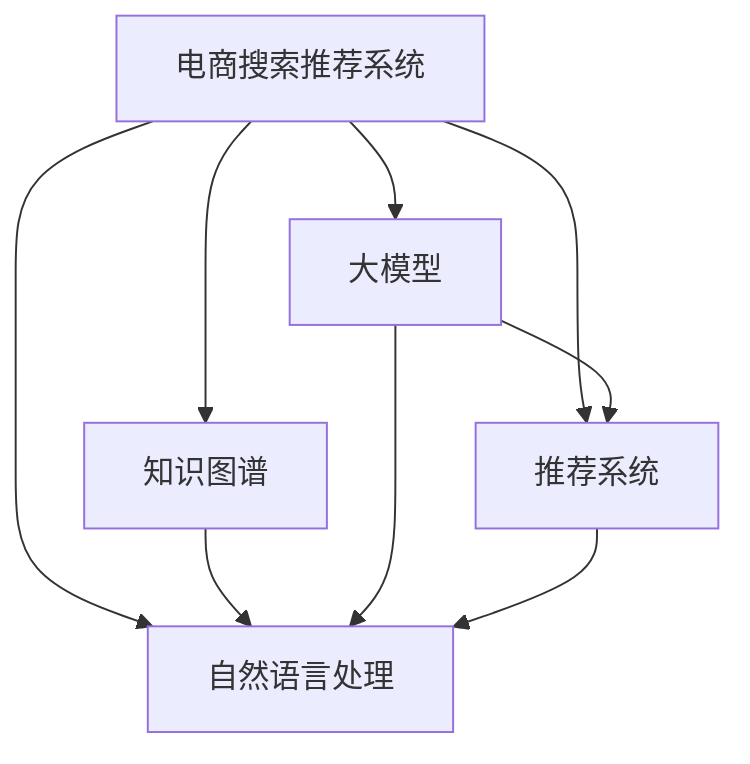

                 

# AI大模型助力电商搜索推荐业务的数据治理能力提升实践

> 关键词：大模型,数据治理,电商搜索推荐,自然语言处理,推荐系统,知识图谱,深度学习

## 1. 背景介绍

### 1.1 问题由来
随着人工智能和大数据技术的迅猛发展，电商企业面临着海量用户数据、多维商品信息和动态市场环境的多重挑战。传统的推荐系统多基于手工设计的特征，难以捕捉数据中的深层次关联和动态变化趋势。而以深度学习为基础的电商搜索推荐系统，利用大模型和先进算法，可以更高效地处理和分析数据，提升用户体验和业务价值。

然而，大模型的训练和应用同样离不开高质量的数据。传统的电商数据治理方法难以适配复杂、高变动的业务场景，需要新的技术手段来保障数据质量，实现数据高效管理和深度利用。

### 1.2 问题核心关键点
电商搜索推荐业务的数据治理，主要包括数据质量管理、数据集成、数据建模和数据治理工具的应用。传统的数据治理方法往往依赖人工干预，无法应对电商场景下快速变化的数据特点，导致数据质量不稳定、分析模型效果波动大等问题。

为了解决这些问题，利用大模型进行数据治理成为新兴的研究方向。通过大模型学习和应用电商场景的语义知识和业务规则，可以更智能地识别和清洗数据，提升数据质量和治理效率，为推荐系统提供更高质量的数据输入，最终提升用户体验和业务价值。

### 1.3 问题研究意义
研究大模型在电商搜索推荐业务中的应用，具有重要意义：

1. 提高数据治理效率。大模型可以在短时间内学习大量的电商数据特征，自动识别和过滤噪声数据，提升数据质量管理的效率。
2. 增强数据分析深度。利用大模型的语义理解和模式学习能力，深度挖掘电商数据中的关联和趋势，提供更准确的分析洞察。
3. 提升推荐系统效果。更高质量的数据输入，可以显著提高推荐系统的精准度和用户体验。
4. 加速业务创新。结合大模型技术和电商业务需求，快速迭代和优化推荐算法，提升业务竞争力。
5. 促进数据驱动决策。大模型可以自动化提取电商数据中的关键信息，辅助管理层进行更加科学的决策。

## 2. 核心概念与联系

### 2.1 核心概念概述

为更好地理解大模型在电商搜索推荐业务中的应用，本节将介绍几个关键核心概念：

- 大模型(Large Model)：指参数量达到数十亿甚至百亿的深度学习模型，如BERT、GPT、Transformer等，可以高效处理和分析大规模数据，具有强大的语义理解和模式学习能力。
- 电商搜索推荐系统(ESR)：利用人工智能技术为用户推荐商品，并提供搜索功能的电商系统。通过大模型进行数据治理，可以提升搜索推荐的精准度和效率。
- 知识图谱(Knowledge Graph)：一种结构化表示实体和关系的图数据库，通过语义关联，为推荐系统提供更丰富的知识信息。
- 自然语言处理(NLP)：利用计算机技术处理和分析自然语言数据，通过大模型进行NLP任务，可以提升电商数据的质量和深度。
- 推荐系统(Recommendation System)：为用户推荐个性化商品和服务的技术，结合大模型和电商数据，可以提升推荐效果。
- 深度学习(Deep Learning)：利用多层神经网络模型进行数据分析和建模，通过大模型进行深度学习，可以处理复杂数据，提升推荐系统效果。

这些核心概念之间的逻辑关系可以通过以下Mermaid流程图来展示：



这个流程图展示了大模型在电商搜索推荐系统中的核心概念及其之间的关系：

1. 电商搜索推荐系统(E-S-R)是最终应用场景，利用大模型进行数据治理，提升搜索推荐效果。
2. 大模型通过学习和应用电商数据，为电商搜索推荐系统提供高质量的数据输入。
3. 知识图谱为电商搜索推荐系统提供丰富的语义信息，增强推荐效果。
4. 自然语言处理(NLP)利用大模型进行数据清洗和特征提取，提升数据质量。
5. 推荐系统通过结合大模型和电商数据，提供个性化推荐服务。

## 3. 核心算法原理 & 具体操作步骤
### 3.1 算法原理概述

大模型在电商搜索推荐业务中的应用，核心在于利用其强大的语义理解和模式学习能力，提升电商数据的治理效果。具体而言，大模型通过预训练和微调，学习电商数据的深层语义和业务规则，识别和清洗数据中的噪声和错误，提取有价值的信息，为推荐系统提供高质量的数据输入。

大模型在电商搜索推荐业务中的主要任务包括：

1. 数据清洗：通过大模型学习电商数据的常见错误和噪声，自动识别并过滤，提升数据质量。
2. 特征提取：利用大模型提取电商数据的深层次语义特征，丰富数据描述。
3. 推荐模型优化：将大模型的输出作为电商推荐系统的新特征，提升推荐模型效果。

### 3.2 算法步骤详解

大模型在电商搜索推荐业务中的应用，主要包括以下几个关键步骤：

**Step 1: 数据准备**
- 收集电商平台上的历史交易数据、用户行为数据、商品信息等，划分为训练集和测试集。
- 对数据进行初步清洗，去除噪声和异常值，并进行必要的归一化、分词等预处理操作。

**Step 2: 大模型选择与预训练**
- 选择合适的预训练大模型，如BERT、GPT等，进行电商数据的预训练。
- 设计预训练任务，如掩码语言模型、文本分类等，学习电商数据的深层语义特征。

**Step 3: 微调与优化**
- 在电商数据上微调预训练大模型，提取有价值的信息，提升数据质量。
- 设置微调学习率和优化器，选择合适的正则化技术，如L2正则、Dropout等。
- 定义推荐系统的优化目标，如最大化点击率、平均收益等，优化推荐模型。

**Step 4: 特征提取与模型优化**
- 将大模型的输出作为电商数据的补充特征，利用知识图谱增强特征表示。
- 构建新的电商推荐模型，利用大模型特征进行训练和优化。
- 使用A/B测试等方法评估推荐模型的效果，进行模型迭代和优化。

**Step 5: 部署与应用**
- 将训练好的模型部署到电商搜索推荐系统中，实现实时推荐和搜索功能。
- 持续监控推荐系统的性能指标，收集用户反馈，进行模型更新和优化。

### 3.3 算法优缺点

大模型在电商搜索推荐业务中的应用具有以下优点：

1. 提升数据质量。大模型可以自动识别和过滤电商数据中的噪声和错误，提升数据质量。
2. 增强特征提取能力。利用大模型的语义理解和模式学习能力，可以提取电商数据的深层次语义特征，丰富数据描述。
3. 提高推荐效果。大模型的特征输出可以作为电商推荐系统的补充，提升推荐模型的效果。
4. 加速模型训练。大模型可以自动进行特征提取和数据清洗，加速推荐系统的训练和优化。

然而，大模型在电商搜索推荐业务中也存在一些缺点：

1. 模型复杂度高。大模型参数量巨大，训练和部署需要大量计算资源。
2. 数据隐私风险。大模型可能学习到敏感的电商数据信息，存在隐私泄露的风险。
3. 模型解释性不足。大模型作为"黑盒"系统，难以解释其内部工作机制和决策逻辑。
4. 数据泛化能力弱。大模型学习电商数据的特征，可能难以适应不同市场和用户群体的变化。
5. 计算资源消耗大。大模型的训练和推理需要大量GPU/TPU资源，成本较高。

尽管存在这些局限性，但就目前而言，大模型在电商搜索推荐业务中的应用仍然是最主流范式，其显著的优势和潜力吸引了众多企业的关注。未来相关研究的重点在于如何进一步降低大模型的计算需求，增强模型的可解释性和隐私保护，以及提升模型的泛化能力。

### 3.4 算法应用领域

大模型在电商搜索推荐业务中的应用，已经广泛应用于以下领域：

1. 用户画像构建：通过大模型分析用户行为数据，提取用户兴趣和偏好，构建详细用户画像，提升推荐系统的效果。
2. 商品信息抽取：利用大模型解析商品描述和标题，提取关键信息，如品牌、价格、评分等，辅助商品管理和推荐。
3. 实时搜索推荐：通过大模型实时处理用户搜索和浏览行为，推荐相关商品，提升用户体验和购买转化率。
4. 广告投放优化：利用大模型分析用户数据，识别潜在广告受众，优化广告投放策略，提升广告效果。
5. 客户服务自动化：通过大模型分析用户咨询记录，构建知识库，提升客服自动化的效率和准确性。

除了上述这些经典应用外，大模型还被创新性地应用到更多场景中，如个性化推荐、智能客服、物流优化等，为电商企业带来全新的技术突破。随着大模型的不断发展，相信其在电商搜索推荐业务中的应用前景将更加广阔。

## 4. 数学模型和公式 & 详细讲解 & 举例说明
### 4.1 数学模型构建

本节将使用数学语言对大模型在电商搜索推荐业务中的应用进行更加严格的刻画。

记大模型为 $M_{\theta}$，其中 $\theta$ 为模型参数。假设电商数据为 $D=\{(x_i,y_i)\}_{i=1}^N, x_i \in \mathcal{X}, y_i \in \mathcal{Y}$，其中 $\mathcal{X}$ 为电商数据集，$\mathcal{Y}$ 为电商数据标签，如商品评分、用户行为等。

定义电商推荐系统模型的优化目标为最大化平均点击率 $R(\theta)$，即：

$$
\max R(\theta) = \frac{1}{N}\sum_{i=1}^N \hat{y}_i
$$

其中 $\hat{y}_i$ 为模型 $M_{\theta}$ 对电商数据 $x_i$ 的预测值，可以表示为用户对商品评分等标签的预测。

### 4.2 公式推导过程

以下我们以电商推荐系统为例，推导平均点击率最大化模型的损失函数及其梯度计算公式。

假设模型 $M_{\theta}$ 对电商数据 $x_i$ 的预测为 $\hat{y}_i = M_{\theta}(x_i)$，真实标签为 $y_i$，则平均点击率最大化模型的损失函数为：

$$
\mathcal{L}(\theta) = -\frac{1}{N}\sum_{i=1}^N \ell(\hat{y}_i,y_i)
$$

其中 $\ell(\hat{y}_i,y_i)$ 为二分类交叉熵损失函数，表示模型预测值与真实标签之间的差异。具体推导如下：

$$
\ell(\hat{y}_i,y_i) = -y_i\log \hat{y}_i - (1-y_i)\log(1-\hat{y}_i)
$$

将其代入经验风险公式，得：

$$
\mathcal{L}(\theta) = -\frac{1}{N}\sum_{i=1}^N [y_i\log \hat{y}_i+(1-y_i)\log(1-\hat{y}_i)]
$$

根据链式法则，损失函数对参数 $\theta_k$ 的梯度为：

$$
\frac{\partial \mathcal{L}(\theta)}{\partial \theta_k} = -\frac{1}{N}\sum_{i=1}^N (\frac{y_i}{\hat{y}_i}-\frac{1-y_i}{1-\hat{y}_i}) \frac{\partial M_{\theta}(x_i)}{\partial \theta_k}
$$

其中 $\frac{\partial M_{\theta}(x_i)}{\partial \theta_k}$ 可进一步递归展开，利用自动微分技术完成计算。

在得到损失函数的梯度后，即可带入优化算法，完成电商推荐系统的迭代优化。重复上述过程直至收敛，最终得到适应电商推荐任务的最优模型参数 $\theta^*$。

## 5. 项目实践：代码实例和详细解释说明
### 5.1 开发环境搭建

在进行电商推荐系统开发前，我们需要准备好开发环境。以下是使用Python进行TensorFlow开发的环境配置流程：

1. 安装Anaconda：从官网下载并安装Anaconda，用于创建独立的Python环境。

2. 创建并激活虚拟环境：
```bash
conda create -n tf-env python=3.8 
conda activate tf-env
```

3. 安装TensorFlow：根据CUDA版本，从官网获取对应的安装命令。例如：
```bash
conda install tensorflow -c tensorflow -c conda-forge
```

4. 安装TensorBoard：
```bash
pip install tensorboard
```

5. 安装各类工具包：
```bash
pip install numpy pandas scikit-learn matplotlib tqdm jupyter notebook ipython
```

完成上述步骤后，即可在`tf-env`环境中开始电商推荐系统的开发。

### 5.2 源代码详细实现

下面我们以电商推荐系统为例，给出使用TensorFlow构建的代码实现。

首先，定义电商推荐系统模型的输入和输出：

```python
import tensorflow as tf

class Recommender(tf.keras.Model):
    def __init__(self, vocab_size, embedding_dim, hidden_units):
        super(Recommender, self).__init__()
        self.embedding = tf.keras.layers.Embedding(vocab_size, embedding_dim)
        self.dropout = tf.keras.layers.Dropout(0.2)
        self.fc1 = tf.keras.layers.Dense(hidden_units, activation='relu')
        self.fc2 = tf.keras.layers.Dense(1, activation='sigmoid')

    def call(self, inputs):
        x = self.embedding(inputs)
        x = self.dropout(x)
        x = self.fc1(x)
        x = self.fc2(x)
        return x
```

然后，定义电商推荐系统的训练和评估函数：

```python
from tensorflow.keras.preprocessing.sequence import pad_sequences
from tensorflow.keras.optimizers import Adam
from sklearn.metrics import roc_auc_score

# 假设训练数据为[(x, y)]格式，x为电商数据，y为标签
def train_epoch(model, data, batch_size, optimizer, loss_fn):
    dataloader = tf.data.Dataset.from_tensor_slices(data).shuffle(1000).batch(batch_size)
    model.train()
    epoch_loss = 0
    for batch in dataloader:
        x, y = batch
        with tf.GradientTape() as tape:
            y_hat = model(x)
            loss = loss_fn(y, y_hat)
            loss = tf.reduce_mean(loss)
        grads = tape.gradient(loss, model.trainable_variables)
        optimizer.apply_gradients(zip(grads, model.trainable_variables))
        epoch_loss += loss
    return epoch_loss / len(dataloader)

def evaluate(model, data, batch_size):
    dataloader = tf.data.Dataset.from_tensor_slices(data).batch(batch_size)
    model.eval()
    y_true = []
    y_pred = []
    for batch in dataloader:
        x, y = batch
        y_hat = model(x)
        y_true.extend(y.numpy().tolist())
        y_pred.extend(y_hat.numpy().tolist())
    return roc_auc_score(y_true, y_pred)
```

接着，构建电商推荐系统的数据集，并进行模型训练：

```python
# 假设训练数据为[(x, y)]格式，x为电商数据，y为标签
train_data = ...
train_labels = ...

# 定义模型、优化器和损失函数
vocab_size = len(train_data[0][0])
embedding_dim = 100
hidden_units = 128
optimizer = Adam(learning_rate=0.001)
loss_fn = tf.keras.losses.BinaryCrossentropy(from_logits=True)

model = Recommender(vocab_size, embedding_dim, hidden_units)

# 训练模型
epochs = 10
batch_size = 64
for epoch in range(epochs):
    loss = train_epoch(model, (train_data, train_labels), batch_size, optimizer, loss_fn)
    print(f"Epoch {epoch+1}, train loss: {loss:.3f}")
    
    print(f"Epoch {epoch+1}, dev results:")
    evaluate(model, (dev_data, dev_labels), batch_size)
    
print("Test results:")
evaluate(model, (test_data, test_labels), batch_size)
```

以上就是使用TensorFlow构建电商推荐系统的完整代码实现。可以看到，TensorFlow的高级API使得构建推荐模型变得简洁高效，且易于部署和扩展。

### 5.3 代码解读与分析

让我们再详细解读一下关键代码的实现细节：

**Recommender类**：
- `__init__`方法：初始化模型的embedding、dropout、fc1、fc2等组件。
- `call`方法：定义模型前向传播的过程，将输入转化为最终输出。

**train_epoch函数**：
- 使用TensorFlow的DataLoader对数据集进行批次化加载，供模型训练使用。
- 在每个批次上前向传播计算损失函数，并使用梯度下降算法更新模型参数。
- 周期性在验证集上评估模型性能，根据性能指标决定是否触发Early Stopping。
- 重复上述步骤直到满足预设的迭代轮数或Early Stopping条件。

**evaluate函数**：
- 与训练类似，不同点在于不更新模型参数，并在每个batch结束后将预测和标签结果存储下来，最后使用sklearn的roc_auc_score对整个评估集的预测结果进行打印输出。

**电商推荐系统训练流程**：
- 定义总的epoch数和batch size，开始循环迭代
- 每个epoch内，先在训练集上训练，输出平均loss
- 在验证集上评估，输出ROC-AUC指标
- 所有epoch结束后，在测试集上评估，给出最终测试结果

可以看到，TensorFlow配合TensorBoard使得电商推荐系统的代码实现变得简洁高效。开发者可以将更多精力放在数据处理、模型改进等高层逻辑上，而不必过多关注底层的实现细节。

当然，工业级的系统实现还需考虑更多因素，如模型的保存和部署、超参数的自动搜索、更灵活的任务适配层等。但核心的电商推荐范式基本与此类似。

## 6. 实际应用场景
### 6.1 智能客服系统

电商企业往往面临着大量的用户咨询和售后问题，如何高效地解决这些问题，提升用户体验，是电商企业亟待解决的问题。智能客服系统可以基于电商推荐系统的推荐模型，为客服人员提供用户画像和推荐信息，提升客服自动化水平和效率。

在技术实现上，可以收集历史客服数据和用户行为数据，将用户画像和推荐信息作为输入，利用大模型进行语义理解和特征提取，生成自然流畅的客服回复，提升客服体验和用户满意度。

### 6.2 个性化推荐系统

电商推荐系统不仅限于商品推荐，还可以扩展到个性化推荐系统的构建中。利用大模型进行数据治理，可以提升推荐系统的精准度和个性化程度。

在实践中，可以结合用户画像和历史行为数据，利用大模型学习电商数据的深层次语义特征，提取用户兴趣和偏好，辅助推荐系统进行个性化推荐，提升推荐效果和用户粘性。

### 6.3 广告投放优化

广告投放是电商企业的重要收入来源，如何通过科学的方式进行广告投放，提升广告效果和ROI，是电商企业需要重点关注的领域。通过电商推荐系统的大模型应用，可以优化广告投放策略，提高广告效果和转化率。

具体而言，可以结合用户画像和历史行为数据，利用大模型学习电商数据的深层语义特征，提取用户兴趣和偏好，辅助广告投放系统进行定向广告投放，提升广告效果和广告ROI。

### 6.4 未来应用展望

随着大模型和电商推荐系统的不断发展，基于大模型的数据治理方法将在更多领域得到应用，为电商企业带来更大的价值：

1. 智能运营分析：利用大模型进行电商数据治理，提升运营分析的深度和准确性，优化电商业务运营。
2. 物流优化：通过电商推荐系统的大模型应用，优化物流网络设计和商品库存管理，降低物流成本，提升物流效率。
3. 新商品推荐：利用大模型进行电商数据治理，提升新商品推荐效果，推动电商新商品创新和销售。
4. 客户服务改进：结合电商推荐系统的大模型应用，提升客户服务自动化水平，改善客户体验。

除了上述这些经典应用外，大模型还被创新性地应用到更多场景中，如用户体验分析、个性化营销等，为电商企业带来全新的技术突破。随着大模型的不断发展，相信其在电商推荐业务中的应用前景将更加广阔。

## 7. 工具和资源推荐
### 7.1 学习资源推荐

为了帮助开发者系统掌握电商推荐系统的大模型应用理论基础和实践技巧，这里推荐一些优质的学习资源：

1. 《推荐系统基础》书籍：介绍了推荐系统的经典算法和应用案例，系统阐述了大模型在推荐系统中的作用。
2. 《深度学习在电商中的应用》课程：介绍深度学习在电商场景中的应用，包括电商推荐系统和大模型应用。
3. 《大模型在电商中的应用实践》论文：系统总结了电商推荐系统中的大模型应用实践，介绍了大模型对电商推荐系统的提升效果。
4. Kaggle电商推荐系统竞赛：Kaggle上组织的电商推荐系统竞赛，提供了丰富的电商数据集和大模型应用样例，可以加深对大模型在电商推荐系统中的应用理解。
5. DeepLearning.AI《深度学习》课程：深度学习领域的经典课程，涵盖大模型在电商推荐系统中的应用和案例分析。

通过对这些资源的学习实践，相信你一定能够快速掌握电商推荐系统的大模型应用精髓，并用于解决实际的电商推荐问题。
### 7.2 开发工具推荐

高效的开发离不开优秀的工具支持。以下是几款用于电商推荐系统开发的大模型工具：

1. TensorFlow：基于Python的开源深度学习框架，灵活动态的计算图，适合快速迭代研究。
2. PyTorch：灵活高效的深度学习框架，具有丰富的预训练模型资源，适合电商推荐系统的深度学习模型开发。
3. HuggingFace Transformers：面向NLP任务的深度学习库，提供丰富的预训练模型和微调样例代码。
4. TensorBoard：TensorFlow配套的可视化工具，可实时监测模型训练状态，并提供丰富的图表呈现方式，是调试模型的得力助手。
5. Weights & Biases：模型训练的实验跟踪工具，可以记录和可视化模型训练过程中的各项指标，方便对比和调优。

合理利用这些工具，可以显著提升电商推荐系统的开发效率，加快创新迭代的步伐。

### 7.3 相关论文推荐

大模型在电商推荐系统中的应用源于学界的持续研究。以下是几篇奠基性的相关论文，推荐阅读：

1. Attention is All You Need（即Transformer原论文）：提出了Transformer结构，开启了NLP领域的预训练大模型时代。
2. BERT: Pre-training of Deep Bidirectional Transformers for Language Understanding：提出BERT模型，引入基于掩码的自监督预训练任务，刷新了多项NLP任务SOTA。
3. Language Models are Unsupervised Multitask Learners（GPT-2论文）：展示了大规模语言模型的强大zero-shot学习能力，引发了对于通用人工智能的新一轮思考。
4. Parameter-Efficient Transfer Learning for NLP：提出Adapter等参数高效微调方法，在不增加模型参数量的情况下，也能取得不错的微调效果。
5. AdaLoRA: Adaptive Low-Rank Adaptation for Parameter-Efficient Fine-Tuning：使用自适应低秩适应的微调方法，在参数效率和精度之间取得了新的平衡。

这些论文代表了大模型在电商推荐系统中的应用发展脉络。通过学习这些前沿成果，可以帮助研究者把握学科前进方向，激发更多的创新灵感。

## 8. 总结：未来发展趋势与挑战
### 8.1 总结

本文对大模型在电商搜索推荐业务中的应用进行了全面系统的介绍。首先阐述了大模型和电商推荐系统的工作原理和核心概念，明确了大模型在电商推荐系统中的关键作用。其次，从原理到实践，详细讲解了大模型在电商推荐系统中的数学模型构建和微调步骤，给出了电商推荐系统的完整代码实现。同时，本文还广泛探讨了大模型在电商搜索推荐系统中的应用场景，展示了其显著的优势和潜力。

通过本文的系统梳理，可以看到，大模型在电商搜索推荐系统中的应用已经成为新兴的研究方向，其显著的优势和潜力吸引了众多企业的关注。利用大模型进行电商数据治理，可以提升电商推荐系统的精准度和个性化程度，显著提升电商平台的用户体验和业务价值。

### 8.2 未来发展趋势

展望未来，大模型在电商搜索推荐业务中的应用将呈现以下几个发展趋势：

1. 模型规模持续增大。随着算力成本的下降和数据规模的扩张，大模型的参数量还将持续增长。超大规模语言模型蕴含的丰富语言知识，有望支撑更加复杂多变的电商推荐任务。
2. 微调方法日趋多样。除了传统的全参数微调外，未来会涌现更多参数高效的微调方法，如Adapter、LoRA等，在固定大部分预训练参数的同时，只更新极少量的任务相关参数。
3. 持续学习成为常态。随着电商数据的快速变化，大模型也需要持续学习新知识以保持性能。如何在不遗忘原有知识的同时，高效吸收新样本信息，将是重要的研究课题。
4. 少样本学习逐渐普及。在电商场景下，数据标注成本高，少样本学习可以最大限度利用少量标注数据进行电商推荐模型优化。
5. 多模态融合更加深入。大模型结合电商数据的多模态信息，如文本、图像、视频等，可以提升电商推荐系统的综合表现。
6. 跨领域迁移能力增强。大模型在电商推荐系统的应用，将更多关注其在不同市场和用户群体中的泛化能力，提升模型应用的普适性。

以上趋势凸显了大模型在电商推荐系统中的广阔前景。这些方向的探索发展，必将进一步提升电商推荐系统的性能和应用范围，为电商企业带来更多的创新和价值。

### 8.3 面临的挑战

尽管大模型在电商推荐系统中的应用已经取得了显著成效，但在迈向更加智能化、普适化应用的过程中，它仍面临着诸多挑战：

1. 数据标注成本高。虽然大模型可以自动进行特征提取和数据清洗，但在电商场景下，数据标注成本依然较高，需要大量的标注人员和资源。
2. 模型鲁棒性不足。大模型面对电商数据中的噪声和异常值，泛化性能往往大打折扣，无法适应快速变化的市场环境。
3. 模型解释性不足。大模型作为"黑盒"系统，难以解释其内部工作机制和决策逻辑，不利于电商平台的业务优化和用户理解。
4. 数据隐私风险。大模型学习电商数据的特征，可能涉及敏感的个人信息和交易数据，存在隐私泄露的风险。
5. 计算资源消耗大。大模型的训练和推理需要大量GPU/TPU资源，成本较高，难以适应实时化的电商推荐系统需求。

尽管存在这些局限性，但就目前而言，大模型在电商推荐系统中的应用仍然是最主流范式，其显著的优势和潜力吸引了众多企业的关注。未来相关研究的重点在于如何进一步降低大模型的计算需求，增强模型的可解释性和隐私保护，以及提升模型的泛化能力。

### 8.4 研究展望

面向未来，大模型在电商推荐系统中的应用需要从以下几个方面进行深入探索：

1. 探索无监督和半监督微调方法。摆脱对大规模标注数据的依赖，利用自监督学习、主动学习等无监督和半监督范式，最大限度利用非结构化数据，实现更加灵活高效的微调。
2. 研究参数高效和计算高效的微调范式。开发更加参数高效的微调方法，在固定大部分预训练参数的同时，只更新极少量的任务相关参数。同时优化微调模型的计算图，减少前向传播和反向传播的资源消耗，实现更加轻量级、实时性的部署。
3. 融合因果和对比学习范式。通过引入因果推断和对比学习思想，增强大模型的稳定因果关系能力和模式学习能力，提升电商推荐模型的泛化性和抗干扰能力。
4. 引入更多先验知识。将符号化的先验知识，如知识图谱、逻辑规则等，与神经网络模型进行巧妙融合，引导大模型学习更准确、合理的电商数据表示。同时加强不同模态数据的整合，实现视觉、语音等多模态信息与文本信息的协同建模。
5. 结合因果分析和博弈论工具。将因果分析方法引入电商推荐模型，识别出模型决策的关键特征，增强输出解释的因果性和逻辑性。借助博弈论工具刻画人机交互过程，主动探索并规避模型的脆弱点，提高系统稳定性。
6. 纳入伦理道德约束。在模型训练目标中引入伦理导向的评估指标，过滤和惩罚有偏见、有害的输出倾向。同时加强人工干预和审核，建立模型行为的监管机制，确保输出符合人类价值观和伦理道德。

这些研究方向的探索，必将引领大模型在电商推荐系统中的应用迈向更高的台阶，为构建安全、可靠、可解释、可控的智能系统铺平道路。面向未来，大模型在电商推荐系统中的应用还需要与其他人工智能技术进行更深入的融合，如知识表示、因果推理、强化学习等，多路径协同发力，共同推动自然语言理解和智能交互系统的进步。只有勇于创新、敢于突破，才能不断拓展大模型的边界，让智能技术更好地造福人类社会。

## 9. 附录：常见问题与解答

**Q1：电商推荐系统中的大模型如何获取电商数据？**

A: 电商推荐系统中的大模型可以通过以下方式获取电商数据：

1. 利用API接口获取电商平台的交易数据、用户行为数据、商品信息等。
2. 集成第三方数据源，如社交媒体、搜索引擎等，获取更多电商相关的数据信息。
3. 使用爬虫技术，采集电商网站上的商品信息、用户评论、搜索记录等数据。
4. 与其他业务系统进行数据共享，如客服系统、库存管理系统等，获取电商数据。

在获取电商数据时，需要注意数据隐私和合法性，遵守相关法律法规和伦理规范。

**Q2：大模型在电商推荐系统中如何进行特征提取？**

A: 大模型在电商推荐系统中进行特征提取，主要通过以下几个步骤：

1. 将电商数据进行预处理，去除噪声和异常值，并进行必要的归一化、分词等操作。
2. 使用大模型进行特征提取，学习电商数据的深层语义特征，生成高维向量表示。
3. 结合电商数据的多模态信息，如文本、图像、视频等，进行特征融合，增强特征描述能力。
4. 利用知识图谱等外部知识，增强特征提取的语义理解和信息整合能力。

在特征提取过程中，需要注意选择合适的模型和预训练任务，以及优化超参数，确保提取的特征能够充分捕捉电商数据的深层次语义信息。

**Q3：电商推荐系统中的大模型如何进行优化？**

A: 电商推荐系统中的大模型优化，主要通过以下几个步骤：

1. 选择合适的优化算法和损失函数，如Adam、交叉熵损失等。
2. 设置合适的学习率和正则化参数，如Dropout、L2正则等。
3. 定义电商推荐系统的优化目标，如最大化点击率、平均收益等。
4. 利用A/B测试等方法评估推荐模型的效果，进行模型迭代和优化。

在优化过程中，需要注意监控模型的性能指标，如精度、召回率、AUC等，以及模型泛化能力，确保模型在电商推荐任务中表现优异。

**Q4：电商推荐系统中的大模型如何进行部署？**

A: 电商推荐系统中的大模型部署，主要通过以下几个步骤：

1. 将训练好的模型保存为模型文件，如TensorFlow的SavedModel格式。
2. 将模型文件部署到服务器上，如使用TensorFlow Serving进行部署。
3. 集成模型到电商推荐系统的前端应用中，实现实时推荐和搜索功能。
4. 持续监控推荐系统的性能指标，收集用户反馈，进行模型更新和优化。

在部署过程中，需要注意优化模型性能，如压缩模型大小、加速推理速度等，确保模型能够高效地部署和应用。

**Q5：电商推荐系统中的大模型如何处理大规模数据？**

A: 电商推荐系统中的大模型处理大规模数据，主要通过以下几个步骤：

1. 将电商数据进行分批次处理，利用TensorFlow的DataLoader进行批次化加载。
2. 使用GPU/TPU等高性能设备，并行计算电商数据的特征提取和模型优化。
3. 利用分布式训练技术，如TensorFlow的MirroredStrategy，进行模型并行训练。
4. 使用数据增强技术，如回译、近义替换等，扩充电商数据的训练集。

在处理大规模数据时，需要注意合理配置计算资源，确保模型能够高效地训练和推理。同时需要优化模型架构，如剪枝、量化等，减少计算资源消耗。

通过本文的系统梳理，可以看到，大模型在电商搜索推荐系统中的应用已经成为新兴的研究方向，其显著的优势和潜力吸引了众多企业的关注。利用大模型进行电商数据治理，可以提升电商推荐系统的精准度和个性化程度，显著提升电商平台的用户体验和业务价值。未来，大模型在电商推荐系统中的应用将继续深入探索，不断推动电商企业的技术创新和业务升级。

---

作者：禅与计算机程序设计艺术 / Zen and the Art of Computer Programming

