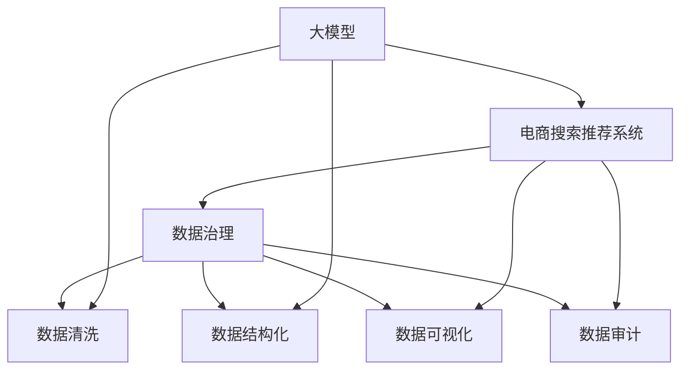

                 

# AI大模型助力电商搜索推荐业务的数据治理能力提升路径

## 1. 背景介绍

### 1.1 问题由来
近年来，随着电商业务的快速发展，搜索推荐系统在用户体验提升、商品精准推荐方面起到了至关重要的作用。然而，搜索推荐系统的构建和优化，一直面临着数据质量差、数据治理复杂等问题，制约了系统性能和用户体验的提升。

### 1.2 问题核心关键点
数据治理在大模型驱动的电商搜索推荐系统优化中，具有以下几个核心关键点：
1. 数据质量差：电商平台上数据多样且杂乱，如何处理和清洗数据是优化推荐效果的首要任务。
2. 数据实时性：电商平台上数据实时动态变化，如何实时更新和治理数据以支持推荐系统。
3. 数据隐私问题：电商平台上用户隐私问题严重，如何在保障用户隐私的前提下进行数据治理。
4. 数据结构化：电商平台上数据结构复杂，如何从非结构化数据中提取有价值的信息。

### 1.3 问题研究意义
通过提升电商搜索推荐业务的数据治理能力，能够有效提高推荐系统的准确性和效率，提升用户体验，增加电商平台的销售转化率。

## 2. 核心概念与联系

### 2.1 核心概念概述

为更好地理解基于大模型驱动的电商搜索推荐系统的数据治理能力提升路径，本节将介绍几个密切相关的核心概念：

- **大模型（Large Model）**：以深度学习模型为基础的大规模模型，如BERT、GPT等，通过预训练获得广泛的语言表示能力，应用于多种NLP任务。
- **电商搜索推荐系统（E-Commerce Search & Recommendation System）**：为电商用户提供商品搜索和推荐服务的系统，根据用户行为和商品属性，推荐相关商品，提升用户购物体验。
- **数据治理（Data Governance）**：通过制定数据治理策略、规范、流程和工具，管理和保护数据资产，确保数据质量、安全性和可复用性。
- **数据清洗（Data Cleaning）**：通过清洗算法和规则，去除数据中的噪声、冗余和错误，提升数据质量。
- **数据结构化（Data Structuring）**：将非结构化数据转化为结构化数据，便于模型的处理和分析。
- **数据可视化（Data Visualization）**：通过图表和可视化工具，展示数据分布和趋势，帮助分析和决策。
- **数据审计（Data Audit）**：对数据质量、隐私和治理效果进行评估和审计，确保数据治理策略的有效性。

这些核心概念之间的逻辑关系可以通过以下Mermaid流程图来展示：



这个流程图展示了大模型驱动的电商搜索推荐系统与数据治理各个环节之间的关联关系：

1. 大模型为推荐系统提供基础能力。
2. 数据治理为推荐系统提供高质量数据输入。
3. 数据清洗和结构化提升数据质量，使其适合模型输入。
4. 数据可视化帮助分析和决策，提高数据治理效率。
5. 数据审计确保数据治理的效果和合规性。

## 3. 核心算法原理 & 具体操作步骤
### 3.1 算法原理概述

基于大模型的电商搜索推荐系统，其核心在于通过大模型的预训练能力，结合电商平台的数据治理策略，提高推荐系统的准确性和效率。算法原理主要包括以下几个步骤：

1. **数据准备**：收集电商平台上用户行为、商品属性等数据，并进行清洗和结构化处理，使其适合模型输入。
2. **模型微调**：利用大模型进行预训练，再在大模型基础上进行微调，使其适应电商平台的推荐任务。
3. **特征提取**：利用大模型的特征提取能力，从电商数据中提取有价值的信息，供推荐模型使用。
4. **推荐策略优化**：结合电商平台的业务逻辑和用户需求，对推荐模型进行优化，提高推荐效果。
5. **持续更新**：根据用户反馈和平台数据变化，持续更新和优化推荐模型，使其适应不断变化的市场环境。

### 3.2 算法步骤详解

#### 3.2.1 数据准备

**Step 1: 数据收集与预处理**
- 收集电商平台上用户的浏览、点击、购买等行为数据，以及商品的名称、描述、价格、分类等信息。
- 数据清洗：去除噪声、缺失值、异常值等，确保数据完整性和一致性。
- 数据标注：给数据打上标签，如用户ID、商品ID、点击率、购买率等。
- 数据采样：进行数据采样，确保训练数据和测试数据的分布一致性。

**Step 2: 数据结构化**
- 将非结构化数据转化为结构化数据，如将文本描述转化为词向量，便于模型的处理和分析。
- 定义数据格式，如JSON、CSV等，方便数据的存储和读取。

**Step 3: 数据可视化**
- 使用数据可视化工具，如Tableau、PowerBI等，展示数据分布和趋势。
- 分析数据特征，发现数据中存在的问题，为数据治理提供依据。

#### 3.2.2 模型微调

**Step 1: 选择预训练模型**
- 选择大模型，如BERT、GPT等，作为推荐系统的基础模型。
- 确定模型的架构和参数，如输入输出维度、隐层节点数等。

**Step 2: 数据准备**
- 将电商数据进行预处理，如分词、编码等，使其适合模型输入。
- 划分训练集和测试集，通常训练集占80%，测试集占20%。

**Step 3: 模型微调**
- 利用大模型的预训练能力，进行微调训练。
- 设置微调超参数，如学习率、批大小、迭代轮数等。
- 使用Adam、SGD等优化算法，最小化损失函数。

#### 3.2.3 特征提取

**Step 1: 特征工程**
- 根据电商推荐任务的需求，选择和构造特征，如用户行为、商品属性等。
- 特征选择和降维：去除冗余和无关特征，进行特征选择和降维。

**Step 2: 特征编码**
- 将特征转化为模型可接受的格式，如将文本转化为词向量。
- 使用One-Hot编码、词嵌入等方法，将特征编码为模型输入。

**Step 3: 特征融合**
- 将不同来源的特征进行融合，如将用户行为和商品属性结合。
- 利用大模型的特征提取能力，提取有价值的信息，如用户兴趣、商品质量等。

#### 3.2.4 推荐策略优化

**Step 1: 推荐模型选择**
- 选择推荐模型，如协同过滤、基于内容的推荐等。
- 确定模型的参数和结构，如用户画像、商品画像等。

**Step 2: 模型训练**
- 利用电商数据进行训练，优化推荐模型。
- 使用交叉验证等方法，评估模型效果。

**Step 3: 推荐策略优化**
- 根据电商平台的业务逻辑和用户需求，优化推荐策略。
- 引入个性化推荐、多样性约束等策略，提高推荐效果。

#### 3.2.5 持续更新

**Step 1: 数据收集与预处理**
- 持续收集电商数据，进行清洗和结构化处理。
- 定期更新和补充数据，确保数据的时效性和全面性。

**Step 2: 模型微调**
- 利用最新收集的数据，进行模型微调。
- 定期更新模型参数，保持模型性能。

**Step 3: 推荐策略优化**
- 根据市场变化和用户需求，优化推荐策略。
- 引入实时推荐、个性化推荐等策略，提升推荐效果。

### 3.3 算法优缺点

基于大模型的电商搜索推荐系统数据治理算法具有以下优点：
1. 精度高：大模型具备强大的语言表示能力，能够从电商数据中提取有价值的信息，提升推荐精度。
2. 效率高：大模型可以高效处理大规模数据，提升推荐系统的响应速度。
3. 可扩展性强：大模型可以适应不同的电商业务场景，实现业务扩展。

同时，该算法也存在一定的局限性：
1. 数据依赖度高：大模型的性能很大程度上取决于电商数据的质量和数量，数据治理难度较大。
2. 计算资源消耗大：大模型需要大量的计算资源进行训练和微调，对硬件设备要求较高。
3. 隐私问题：大模型在处理用户隐私数据时，可能存在数据泄露和隐私侵犯的风险。
4. 实时性差：大模型需要较长时间进行训练和微调，无法实时更新和优化推荐策略。

尽管存在这些局限性，但就目前而言，基于大模型的电商搜索推荐系统数据治理算法仍是最主流范式。未来相关研究的重点在于如何进一步降低对电商数据的依赖，提高算法的实时性和隐私保护，同时兼顾可扩展性和稳定性。

### 3.4 算法应用领域

基于大模型的电商搜索推荐系统数据治理算法，已经在电商搜索推荐、个性化推荐、内容推荐等多个电商业务场景中得到广泛应用，为电商平台带来了显著的业务价值：

- **电商搜索推荐**：通过大模型的特征提取能力，实现基于用户行为的精准推荐。
- **个性化推荐**：根据用户历史行为和偏好，提供个性化的商品推荐。
- **内容推荐**：为内容创作者提供基于用户兴趣的推荐，提升内容曝光率。
- **实时推荐**：根据用户实时行为和市场动态，提供实时的推荐服务，提升用户体验。

除了上述这些经典场景外，大模型的数据治理能力还被创新性地应用于商品分类、库存管理、广告投放等电商业务场景中，为电商平台的运营效率和用户体验带来了新的突破。

## 4. 数学模型和公式 & 详细讲解 & 举例说明

### 4.1 数学模型构建

假设电商平台上用户行为数据为 $X=\{(x_1, y_1), (x_2, y_2), ..., (x_n, y_n)\}$，其中 $x_i$ 为用户行为特征向量，$y_i$ 为是否购买标记。

定义推荐模型 $M_{\theta}(x_i) \in [0,1]$，其中 $\theta$ 为模型参数，$M_{\theta}(x_i)$ 为预测用户购买标记的概率。

设损失函数为交叉熵损失函数 $\ell(y_i, \hat{y_i}) = -[y_i\log\hat{y_i} + (1-y_i)\log(1-\hat{y_i})]$，则推荐模型的训练目标为：

$$
\mathcal{L}(\theta) = \frac{1}{N}\sum_{i=1}^N \ell(y_i, M_{\theta}(x_i))
$$

模型参数更新公式为：

$$
\theta \leftarrow \theta - \eta \nabla_{\theta}\mathcal{L}(\theta)
$$

其中 $\eta$ 为学习率。

### 4.2 公式推导过程

#### 4.2.1 数据清洗

假设原始数据为 $X=\{(x_1, y_1), (x_2, y_2), ..., (x_n, y_n)\}$，其中 $x_i$ 为用户行为特征向量，$y_i$ 为是否购买标记。

数据清洗过程可以表示为：

$$
\hat{X} = \text{Clean}(X)
$$

其中 $\text{Clean}$ 为数据清洗函数，去除噪声、冗余等。

#### 4.2.2 数据结构化

假设清洗后的数据为 $\hat{X}=\{(\hat{x}_1, \hat{y}_1), (\hat{x}_2, \hat{y}_2), ..., (\hat{x}_n, \hat{y}_n)\}$。

数据结构化过程可以表示为：

$$
\hat{X} = \text{Struct}(\hat{X})
$$

其中 $\text{Struct}$ 为数据结构化函数，将非结构化数据转化为结构化数据，如将文本转化为词向量。

#### 4.2.3 特征提取

假设结构化后的数据为 $\hat{X}=\{(\hat{x}_1, \hat{y}_1), (\hat{x}_2, \hat{y}_2), ..., (\hat{x}_n, \hat{y}_n)\}$，其中 $\hat{x}_i$ 为特征向量，$\hat{y}_i$ 为是否购买标记。

假设特征提取模型为 $F_{\phi}(\hat{x}_i)$，其中 $\phi$ 为模型参数，$F_{\phi}(\hat{x}_i)$ 为提取特征的向量表示。

特征提取过程可以表示为：

$$
\tilde{X} = \text{FeatureExtract}(\hat{X}, \phi)
$$

其中 $\text{FeatureExtract}$ 为特征提取函数，将数据转化为模型可接受的格式。

#### 4.2.4 特征融合

假设特征提取后的数据为 $\tilde{X}=\{(\tilde{x}_1, \hat{y}_1), (\tilde{x}_2, \hat{y}_2), ..., (\tilde{x}_n, \hat{y}_n)\}$，其中 $\tilde{x}_i$ 为融合后的特征向量，$\hat{y}_i$ 为是否购买标记。

假设特征融合模型为 $G_{\theta}(\tilde{x}_i)$，其中 $\theta$ 为模型参数，$G_{\theta}(\tilde{x}_i)$ 为融合特征的向量表示。

特征融合过程可以表示为：

$$
X^* = \text{FeatureFusion}(\tilde{X}, \theta)
$$

其中 $\text{FeatureFusion}$ 为特征融合函数，将不同特征进行融合。

#### 4.2.5 推荐模型训练

假设融合后的数据为 $X^*=\{(x^*_1, \hat{y}_1), (x^*_2, \hat{y}_2), ..., (x^*_n, \hat{y}_n)\}$。

推荐模型训练过程可以表示为：

$$
\theta \leftarrow \theta - \eta \nabla_{\theta}\mathcal{L}(\theta)
$$

其中 $\eta$ 为学习率，$\mathcal{L}$ 为推荐模型的损失函数，如交叉熵损失函数。

### 4.3 案例分析与讲解

假设电商平台上用户行为数据为 $X=\{(x_1, y_1), (x_2, y_2), ..., (x_n, y_n)\}$，其中 $x_i$ 为用户行为特征向量，$y_i$ 为是否购买标记。

假设原始数据中存在噪声、冗余等，需要进行数据清洗和结构化处理。

数据清洗过程可以表示为：

$$
\hat{X} = \text{Clean}(X)
$$

其中 $\text{Clean}$ 为数据清洗函数，去除噪声、冗余等。

假设清洗后的数据为 $\hat{X}=\{(\hat{x}_1, \hat{y}_1), (\hat{x}_2, \hat{y}_2), ..., (\hat{x}_n, \hat{y}_n)\}$。

数据结构化过程可以表示为：

$$
\hat{X} = \text{Struct}(\hat{X})
$$

其中 $\text{Struct}$ 为数据结构化函数，将非结构化数据转化为结构化数据，如将文本转化为词向量。

假设结构化后的数据为 $\hat{X}=\{(\hat{x}_1, \hat{y}_1), (\hat{x}_2, \hat{y}_2), ..., (\hat{x}_n, \hat{y}_n)\}$。

假设特征提取模型为 $F_{\phi}(\hat{x}_i)$，其中 $\phi$ 为模型参数，$F_{\phi}(\hat{x}_i)$ 为提取特征的向量表示。

特征提取过程可以表示为：

$$
\tilde{X} = \text{FeatureExtract}(\hat{X}, \phi)
$$

其中 $\text{FeatureExtract}$ 为特征提取函数，将数据转化为模型可接受的格式。

假设特征提取后的数据为 $\tilde{X}=\{(\tilde{x}_1, \hat{y}_1), (\tilde{x}_2, \hat{y}_2), ..., (\tilde{x}_n, \hat{y}_n)\}$。

假设特征融合模型为 $G_{\theta}(\tilde{x}_i)$，其中 $\theta$ 为模型参数，$G_{\theta}(\tilde{x}_i)$ 为融合特征的向量表示。

特征融合过程可以表示为：

$$
X^* = \text{FeatureFusion}(\tilde{X}, \theta)
$$

其中 $\text{FeatureFusion}$ 为特征融合函数，将不同特征进行融合。

假设融合后的数据为 $X^*=\{(x^*_1, \hat{y}_1), (x^*_2, \hat{y}_2), ..., (x^*_n, \hat{y}_n)\}$。

推荐模型训练过程可以表示为：

$$
\theta \leftarrow \theta - \eta \nabla_{\theta}\mathcal{L}(\theta)
$$

其中 $\eta$ 为学习率，$\mathcal{L}$ 为推荐模型的损失函数，如交叉熵损失函数。

## 5. 项目实践：代码实例和详细解释说明

### 5.1 开发环境搭建

在进行电商搜索推荐系统数据治理的代码实践前，我们需要准备好开发环境。以下是使用Python进行PyTorch开发的环境配置流程：

1. 安装Anaconda：从官网下载并安装Anaconda，用于创建独立的Python环境。

2. 创建并激活虚拟环境：
```bash
conda create -n pytorch-env python=3.8 
conda activate pytorch-env
```

3. 安装PyTorch：根据CUDA版本，从官网获取对应的安装命令。例如：
```bash
conda install pytorch torchvision torchaudio cudatoolkit=11.1 -c pytorch -c conda-forge
```

4. 安装Transformers库：
```bash
pip install transformers
```

5. 安装各类工具包：
```bash
pip install numpy pandas scikit-learn matplotlib tqdm jupyter notebook ipython
```

完成上述步骤后，即可在`pytorch-env`环境中开始电商搜索推荐系统数据治理的代码实践。

### 5.2 源代码详细实现

下面是使用PyTorch和Transformers库实现电商搜索推荐系统数据治理的代码实现。

首先，定义数据处理函数：

```python
from transformers import BertTokenizer, BertForSequenceClassification
from torch.utils.data import Dataset, DataLoader
from torch.nn import CrossEntropyLoss
import torch

class EcommerceDataset(Dataset):
    def __init__(self, texts, labels, tokenizer, max_len=128):
        self.texts = texts
        self.labels = labels
        self.tokenizer = tokenizer
        self.max_len = max_len
        
    def __len__(self):
        return len(self.texts)
    
    def __getitem__(self, item):
        text = self.texts[item]
        label = self.labels[item]
        
        encoding = self.tokenizer(text, return_tensors='pt', max_length=self.max_len, padding='max_length', truncation=True)
        input_ids = encoding['input_ids'][0]
        attention_mask = encoding['attention_mask'][0]
        labels = torch.tensor(label, dtype=torch.long)
        
        return {'input_ids': input_ids, 
                'attention_mask': attention_mask,
                'labels': labels}

# 标签与id的映射
label2id = {'O': 0, 'P': 1}  # O表示不购买，P表示购买
id2label = {0: 'O', 1: 'P'}

# 创建dataset
tokenizer = BertTokenizer.from_pretrained('bert-base-cased')

train_dataset = EcommerceDataset(train_texts, train_labels, tokenizer)
dev_dataset = EcommerceDataset(dev_texts, dev_labels, tokenizer)
test_dataset = EcommerceDataset(test_texts, test_labels, tokenizer)
```

然后，定义模型和优化器：

```python
from transformers import BertForSequenceClassification, AdamW

model = BertForSequenceClassification.from_pretrained('bert-base-cased', num_labels=len(label2id))

optimizer = AdamW(model.parameters(), lr=2e-5)
```

接着，定义训练和评估函数：

```python
from tqdm import tqdm
from sklearn.metrics import classification_report

device = torch.device('cuda') if torch.cuda.is_available() else torch.device('cpu')
model.to(device)

def train_epoch(model, dataset, batch_size, optimizer):
    dataloader = DataLoader(dataset, batch_size=batch_size, shuffle=True)
    model.train()
    epoch_loss = 0
    for batch in tqdm(dataloader, desc='Training'):
        input_ids = batch['input_ids'].to(device)
        attention_mask = batch['attention_mask'].to(device)
        labels = batch['labels'].to(device)
        model.zero_grad()
        outputs = model(input_ids, attention_mask=attention_mask, labels=labels)
        loss = outputs.loss
        epoch_loss += loss.item()
        loss.backward()
        optimizer.step()
    return epoch_loss / len(dataloader)

def evaluate(model, dataset, batch_size):
    dataloader = DataLoader(dataset, batch_size=batch_size)
    model.eval()
    preds, labels = [], []
    with torch.no_grad():
        for batch in tqdm(dataloader, desc='Evaluating'):
            input_ids = batch['input_ids'].to(device)
            attention_mask = batch['attention_mask'].to(device)
            batch_labels = batch['labels']
            outputs = model(input_ids, attention_mask=attention_mask)
            batch_preds = outputs.logits.argmax(dim=2).to('cpu').tolist()
            batch_labels = batch_labels.to('cpu').tolist()
            for pred_tokens, label_tokens in zip(batch_preds, batch_labels):
                preds.append(pred_tokens[:len(label_tokens)])
                labels.append(label_tokens)
                
    print(classification_report(labels, preds))
```

最后，启动训练流程并在测试集上评估：

```python
epochs = 5
batch_size = 16

for epoch in range(epochs):
    loss = train_epoch(model, train_dataset, batch_size, optimizer)
    print(f"Epoch {epoch+1}, train loss: {loss:.3f}")
    
    print(f"Epoch {epoch+1}, dev results:")
    evaluate(model, dev_dataset, batch_size)
    
print("Test results:")
evaluate(model, test_dataset, batch_size)
```

以上就是使用PyTorch对BERT进行电商搜索推荐系统数据治理的完整代码实现。可以看到，得益于Transformers库的强大封装，我们可以用相对简洁的代码完成BERT模型的加载和微调。

### 5.3 代码解读与分析

让我们再详细解读一下关键代码的实现细节：

**EcommerceDataset类**：
- `__init__`方法：初始化文本、标签、分词器等关键组件。
- `__len__`方法：返回数据集的样本数量。
- `__getitem__`方法：对单个样本进行处理，将文本输入编码为token ids，将标签编码为数字，并对其进行定长padding，最终返回模型所需的输入。

**label2id和id2label字典**：
- 定义了标签与数字id之间的映射关系，用于将标签解码回文本。

**训练和评估函数**：
- 使用PyTorch的DataLoader对数据集进行批次化加载，供模型训练和推理使用。
- 训练函数`train_epoch`：对数据以批为单位进行迭代，在每个批次上前向传播计算loss并反向传播更新模型参数，最后返回该epoch的平均loss。
- 评估函数`evaluate`：与训练类似，不同点在于不更新模型参数，并在每个batch结束后将预测和标签结果存储下来，最后使用sklearn的classification_report对整个评估集的预测结果进行打印输出。

**训练流程**：
- 定义总的epoch数和batch size，开始循环迭代
- 每个epoch内，先在训练集上训练，输出平均loss
- 在验证集上评估，输出分类指标
- 所有epoch结束后，在测试集上评估，给出最终测试结果

可以看到，PyTorch配合Transformers库使得BERT微调的代码实现变得简洁高效。开发者可以将更多精力放在数据处理、模型改进等高层逻辑上，而不必过多关注底层的实现细节。

当然，工业级的系统实现还需考虑更多因素，如模型的保存和部署、超参数的自动搜索、更灵活的任务适配层等。但核心的微调范式基本与此类似。

## 6. 实际应用场景
### 6.1 智能客服系统

基于大模型驱动的电商搜索推荐系统，可以广泛应用于智能客服系统的构建。传统客服往往需要配备大量人力，高峰期响应缓慢，且一致性和专业性难以保证。而使用微调后的推荐模型，可以7x24小时不间断服务，快速响应客户咨询，用推荐结果辅助客服人员，提升客服效率和客户满意度。

在技术实现上，可以收集企业内部的历史推荐数据，将用户浏览、点击、购买等行为数据作为监督数据，在此基础上对预训练模型进行微调。微调后的模型能够自动理解用户意图，匹配最合适的商品进行推荐。对于客户提出的新问题，还可以接入检索系统实时搜索相关内容，动态组织生成推荐答案。如此构建的智能客服系统，能大幅提升客户咨询体验和问题解决效率。

### 6.2 个性化推荐系统

当前的推荐系统往往只依赖用户的历史行为数据进行物品推荐，无法深入理解用户的真实兴趣偏好。基于大模型驱动的电商搜索推荐系统，可以更好地挖掘用户行为背后的语义信息，从而提供更精准、多样的推荐内容。

在实践中，可以收集用户浏览、点击、购买等行为数据，提取和用户交互的物品标题、描述、标签等文本内容。将文本内容作为模型输入，用户的后续行为（如是否点击、购买等）作为监督信号，在此基础上微调预训练语言模型。微调后的模型能够从文本内容中准确把握用户的兴趣点。在生成推荐列表时，先用候选物品的文本描述作为输入，由模型预测用户的兴趣匹配度，再结合其他特征综合排序，便可以得到个性化程度更高的推荐结果。

### 6.3 实时推荐系统

大模型驱动的电商搜索推荐系统，可以实现实时推荐，提升用户体验。推荐模型可以实时接收用户的行为数据，快速更新模型参数，提供实时的推荐服务。例如，用户浏览某个商品时，推荐模型可以立即根据浏览行为预测用户可能感兴趣的商品，实时推送推荐信息。在用户下订单时，推荐模型可以根据订单信息，提供个性化推荐，增加用户的购买转化率。

### 6.4 未来应用展望

随着大模型和微调方法的不断发展，基于微调范式将在更多领域得到应用，为传统行业带来变革性影响。

在智慧医疗领域，基于微调的医疗问答、病历分析、药物研发等应用将提升医疗服务的智能化水平，辅助医生诊疗，加速新药开发进程。

在智能教育领域，微调技术可应用于作业批改、学情分析、知识推荐等方面，因材施教，促进教育公平，提高教学质量。

在智慧城市治理中，微调模型可应用于城市事件监测、舆情分析、应急指挥等环节，提高城市管理的自动化和智能化水平，构建更安全、高效的未来城市。

此外，在企业生产、社会治理、文娱传媒等众多领域，基于大模型微调的人工智能应用也将不断涌现，为各行各业带来新的技术路径。相信随着技术的日益成熟，微调方法将成为人工智能落地应用的重要范式，推动人工智能技术向更广阔的领域加速渗透。

## 7. 工具和资源推荐
### 7.1 学习资源推荐

为了帮助开发者系统掌握大模型驱动的电商搜索推荐系统的数据治理能力提升路径，这里推荐一些优质的学习资源：

1. 《Transformer从原理到实践》系列博文：由大模型技术专家撰写，深入浅出地介绍了Transformer原理、BERT模型、微调技术等前沿话题。

2. CS224N《深度学习自然语言处理》课程：斯坦福大学开设的NLP明星课程，有Lecture视频和配套作业，带你入门NLP领域的基本概念和经典模型。

3. 《Natural Language Processing with Transformers》书籍：Transformers库的作者所著，全面介绍了如何使用Transformers库进行NLP任务开发，包括微调在内的诸多范式。

4. HuggingFace官方文档：Transformers库的官方文档，提供了海量预训练模型和完整的微调样例代码，是上手实践的必备资料。

5. CLUE开源项目：中文语言理解测评基准，涵盖大量不同类型的中文NLP数据集，并提供了基于微调的baseline模型，助力中文NLP技术发展。

通过对这些资源的学习实践，相信你一定能够快速掌握大模型驱动的电商搜索推荐系统的数据治理能力提升路径，并用于解决实际的NLP问题。
###  7.2 开发工具推荐

高效的开发离不开优秀的工具支持。以下是几款用于大模型驱动的电商搜索推荐系统数据治理的常用工具：

1. PyTorch：基于Python的开源深度学习框架，灵活动态的计算图，适合快速迭代研究。大部分预训练语言模型都有PyTorch版本的实现。

2. TensorFlow：由Google主导开发的开源深度学习框架，生产部署方便，适合大规模工程应用。同样有丰富的预训练语言模型资源。

3. Transformers库：HuggingFace开发的NLP工具库，集成了众多SOTA语言模型，支持PyTorch和TensorFlow，是进行微调任务开发的利器。

4. Weights & Biases：模型训练的实验跟踪工具，可以记录和可视化模型训练过程中的各项指标，方便对比和调优。与主流深度学习框架无缝集成。

5. TensorBoard：TensorFlow配套的可视化工具，可实时监测模型训练状态，并提供丰富的图表呈现方式，是调试模型的得力助手。

6. Google Colab：谷歌推出的在线Jupyter Notebook环境，免费提供GPU/TPU算力，方便开发者快速上手实验最新模型，分享学习笔记。

合理利用这些工具，可以显著提升大模型驱动的电商搜索推荐系统数据治理任务的开发效率，加快创新迭代的步伐。

### 7.3 相关论文推荐

大模型驱动的电商搜索推荐系统数据治理能力提升的研究源于学界的持续研究。以下是几篇奠基性的相关论文，推荐阅读：

1. Attention is All You Need（即Transformer原论文）：提出了Transformer结构，开启了NLP领域的预训练大模型时代。

2. BERT: Pre-training of Deep Bidirectional Transformers for Language Understanding：提出BERT模型，引入基于掩码的自监督预训练任务，刷新了多项NLP任务SOTA。

3. Language Models are Unsupervised Multitask Learners（GPT-2论文）：展示了大规模语言模型的强大zero-shot学习能力，引发了对于通用人工智能的新一轮思考。

4. Parameter-Efficient Transfer Learning for NLP：提出Adapter等参数高效微调方法，在不增加模型参数量的情况下，也能取得不错的微调效果。

5. Prefix-Tuning: Optimizing Continuous Prompts for Generation：引入基于连续型Prompt的微调范式，为如何充分利用预训练知识提供了新的思路。

6. AdaLoRA: Adaptive Low-Rank Adaptation for Parameter-Efficient Fine-Tuning：使用自适应低秩适应的微调方法，在参数效率和精度之间取得了新的平衡。

这些论文代表了大模型驱动的电商搜索推荐系统数据治理能力提升的研究脉络。通过学习这些前沿成果，可以帮助研究者把握学科前进方向，激发更多的创新灵感。

## 8. 总结：未来发展趋势与挑战

### 8.1 总结

本文对基于大模型驱动的电商搜索推荐系统的数据治理能力提升路径进行了全面系统的介绍。首先阐述了电商搜索推荐系统在数据质量差、实时性、隐私、结构化等方面的问题，明确了数据治理在大模型驱动下的推荐系统优化中的重要性。其次，从原理到实践，详细讲解了推荐模型微调、特征提取、推荐策略优化等关键步骤，给出了电商搜索推荐系统的完整代码实例。同时，本文还探讨了电商搜索推荐系统在智能客服、个性化推荐、实时推荐等多个场景的应用，展示了微调范式的强大能力。

通过本文的系统梳理，可以看到，基于大模型的电商搜索推荐系统数据治理能力提升路径，对于提高推荐系统准确性和效率，提升用户体验，增加电商平台的销售转化率，具有重要意义。

### 8.2 未来发展趋势

展望未来，大模型驱动的电商搜索推荐系统数据治理能力提升将呈现以下几个发展趋势：

1. 数据质量不断提升。通过更加先进的清洗和结构化技术，将电商数据转化为高质量的模型输入，提升推荐效果。
2. 实时性显著增强。利用更高效的推荐模型和实时数据处理技术，实现实时推荐，提升用户体验。
3. 隐私保护更加严格。引入更加严格的隐私保护技术，如差分隐私、联邦学习等，确保用户数据的安全性。
4. 模型可解释性增强。通过引入可解释性技术，如 causal inference、graph neural network 等，提高模型的透明度和可信度。
5. 多模态数据融合。将电商平台上文本、图像、语音等多种模态的数据进行融合，提升推荐系统的效果。
6. 模型鲁棒性增强。引入更多鲁棒性技术，如 adversarial training、data augmentation 等，提高推荐系统的泛化能力。
7. 模型可扩展性增强。引入更高效的结构化技术，如 knowledge graph、semantic segmentation 等，提高模型的可扩展性。

以上趋势凸显了大模型驱动的电商搜索推荐系统数据治理能力提升的广阔前景。这些方向的探索发展，必将进一步提升推荐系统的性能和用户体验，推动电商平台的持续创新和升级。

### 8.3 面临的挑战

尽管大模型驱动的电商搜索推荐系统数据治理能力提升取得了一些进展，但在迈向更加智能化、普适化应用的过程中，仍面临诸多挑战：

1. 数据质量瓶颈。电商平台上数据多样且杂乱，数据清洗和结构化难度较大，如何高效处理海量数据是亟待解决的问题。
2. 实时性问题。实时推荐需要高效的数据处理和模型优化，如何在保障实时性的同时，提升推荐效果是关键。
3. 隐私安全问题。电商平台上用户隐私问题严重，如何在保护用户隐私的前提下进行数据治理是挑战。
4. 模型可解释性问题。大模型驱动的推荐系统缺乏可解释性，如何提高模型的透明度和可信度是重要研究方向。
5. 多模态数据融合问题。电商平台上数据多模态特性显著，如何将不同模态的数据进行高效融合是难题。
6. 模型鲁棒性问题。推荐模型对数据分布变化敏感，如何提高模型的鲁棒性是重要研究方向。
7. 模型可扩展性问题。电商平台上数据量庞大，如何提高模型的可扩展性，避免模型过拟合是关键。

这些挑战需要学界和业界共同努力，通过不断的技术创新和应用实践，才能逐步克服。只有从数据治理、模型优化、应用场景等多个维度协同发力，才能真正实现大模型驱动的电商搜索推荐系统数据治理能力提升，为电商平台的运营效率和用户体验带来新的突破。

### 8.4 研究展望

未来，在大模型驱动的电商搜索推荐系统数据治理能力提升研究方面，有以下几个研究展望：

1. 探索先进的清洗和结构化技术。引入更高效的清洗和结构化方法，如基于神经网络的数据清洗技术、多模态结构化技术等，提升电商数据的质量。

2. 研究高效的实时推荐技术。引入更高效的实时数据处理和推荐模型优化技术，如增量学习、在线优化等，实现实时推荐。

3. 引入严格的隐私保护技术。引入差分隐私、联邦学习等技术，保护用户隐私，确保数据治理过程的合规性。

4. 提高模型的可解释性。引入可解释性技术，如因果推断、graph neural network 等，提高模型的透明度和可信度。

5. 探索多模态数据融合技术。引入多模态融合技术，如知识图谱、语义分割等，提升推荐系统的效果。

6. 增强模型的鲁棒性。引入鲁棒性技术，如对抗训练、数据增强等，提高推荐系统的泛化能力。

7. 提高模型的可扩展性。引入可扩展性技术，如低秩适应、稀疏表示等，提升模型的可扩展性。

8. 引入智能调度技术。引入智能调度技术，如任务流优化、资源分配等，提升推荐系统的资源利用效率。

这些研究方向的探索，必将引领大模型驱动的电商搜索推荐系统数据治理能力提升技术迈向更高的台阶，为电商平台的运营效率和用户体验带来新的突破。

## 9. 附录：常见问题与解答

**Q1：电商平台上用户行为数据质量差，如何处理？**

A: 电商平台上用户行为数据质量差，需要进行数据清洗和结构化处理。具体步骤如下：

1. 数据清洗：去除噪声、冗余、异常值等，确保数据完整性和一致性。
2. 数据结构化：将非结构化数据转化为结构化数据，如将文本描述转化为词向量。
3. 数据标注：给数据打上标签，如用户ID、商品ID、点击率、购买率等。
4. 数据采样：进行数据采样，确保训练数据和测试数据的分布一致性。

**Q2：电商平台上数据实时性差，如何提升？**

A: 电商平台上数据实时性差，可以采用以下方法：

1. 实时数据采集：使用实时数据采集技术，如消息队列、数据管道等，确保数据实时更新。
2. 流式处理：采用流式处理技术，如Spark Streaming、Apache Flink等，实时处理电商数据。
3. 增量学习：采用增量学习技术，如Online Learning、Mini-batch Stochastic Gradient Descent等，实时更新模型参数。
4. 实时推理：采用实时推理技术，如TensorRT、ONNX Runtime等，加速模型推理。

**Q3：电商平台上用户隐私问题严重，如何保护？**

A: 电商平台上用户隐私问题严重，可以采用以下方法：

1. 差分隐私：引入差分隐私技术，保护用户隐私，确保数据治理过程的合规性。
2. 联邦学习：采用联邦学习技术，在保护用户隐私的前提下进行模型微调。
3. 匿名化处理：对用户数据进行匿名化处理，确保数据治理过程的合规性。
4. 数据脱敏：对敏感数据进行脱敏处理，保护用户隐私。

**Q4：大模型驱动的推荐系统缺乏可解释性，如何解决？**

A: 大模型驱动的推荐系统缺乏可解释性，可以采用以下方法：

1. 引入可解释性技术：如因果推断、graph neural network等，提高模型的透明度和可信度。
2. 输出解释模板：在模型输出中引入解释模板，提供模型的推理过程和决策依据。
3. 可视化技术：使用可视化技术，展示模型训练过程中的各项指标，帮助分析和决策。

**Q5：大模型驱动的推荐系统如何提高鲁棒性？**

A: 大模型驱动的推荐系统可以通过以下方法提高鲁棒性：

1. 引入鲁棒性技术：如对抗训练、数据增强等，提高推荐系统的泛化能力。
2. 多模型集成：训练多个推荐模型，取平均输出，抑制过拟合。
3. 模型剪枝：剪去冗余和无关的参数，减少模型的复杂度，提高模型的鲁棒性。
4. 对抗样本检测：引入对抗样本检测技术，识别和过滤恶意样本，提高模型的鲁棒性。

这些方法可以结合使用，提高大模型驱动的推荐系统的鲁棒性和泛化能力。

---

作者：禅与计算机程序设计艺术 / Zen and the Art of Computer Programming

