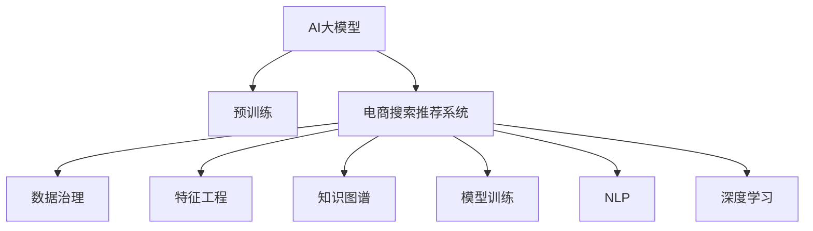

                 

# AI大模型助力电商搜索推荐业务的数据治理能力提升路径

> 关键词：AI大模型, 电商搜索推荐, 数据治理, 特征工程, 知识图谱, 自然语言处理(NLP), 模型训练, 深度学习

## 1. 背景介绍

随着电商行业的快速发展和消费者需求的多样化，电商平台需要不断优化其搜索推荐系统，以提升用户体验和业务效果。传统的基于规则或统计模型的搜索推荐系统逐渐难以满足实际需求，而基于深度学习的AI大模型因其强大的泛化能力和学习潜能，逐渐成为新一代电商搜索推荐系统的重要技术基础。

然而，AI大模型在电商搜索推荐中的应用仍面临诸多挑战，其中数据治理能力不足是关键问题之一。电商数据具有复杂性、多样性和动态性，如何有效地管理和治理这些数据，以支撑AI大模型的训练和推理，直接关系到搜索推荐系统的性能和稳定性。本文将围绕数据治理能力提升这一主题，探讨AI大模型在电商搜索推荐业务中的关键应用。

## 2. 核心概念与联系

### 2.1 核心概念概述

在深入探讨AI大模型在电商搜索推荐中的应用之前，首先需要明确几个核心概念：

- **AI大模型**：指基于深度学习，尤其是Transformer等架构，通过大规模无监督预训练得到的高性能语言模型，如GPT、BERT等。

- **电商搜索推荐系统**：指电商平台为帮助用户快速找到所需商品，通过分析用户行为数据和商品特征数据，推荐相关商品的系统。

- **数据治理**：指对数据进行收集、整合、清洗、存储、管理等操作，以确保数据的质量、完整性、一致性和安全性。

- **特征工程**：指在数据治理的基础上，对原始数据进行转换和衍生，提取有意义的特征以供机器学习模型训练和推理。

- **知识图谱**：指通过实体关系和属性来描述知识结构的数据库，用于增强模型的知识推理和泛化能力。

- **自然语言处理(NLP)**：指研究如何让计算机处理和理解人类语言的技术，包括文本分类、命名实体识别、情感分析等。

- **模型训练**：指通过数据和标签对机器学习模型进行优化，使其能够完成特定任务的过程。

- **深度学习**：指通过多层神经网络对复杂数据进行建模和分析的技术，具有强大的数据处理和表达能力。

### 2.2 核心概念原理和架构的 Mermaid 流程图



上述流程图展示了AI大模型在电商搜索推荐系统中的应用路径，其中数据治理是整个系统的基础和核心。通过数据治理，确保数据质量和安全；通过特征工程，提取有效特征；通过知识图谱增强模型知识推理能力；通过模型训练优化模型参数；通过NLP技术提升语言处理能力；通过深度学习模型进行商品推荐。

## 3. 核心算法原理 & 具体操作步骤

### 3.1 算法原理概述

在电商搜索推荐系统中，AI大模型的应用主要集中在以下几个方面：

- **商品召回**：通过搜索用户的历史行为数据和商品描述数据，使用AI大模型预测用户可能感兴趣的商品。
- **商品排序**：通过分析用户点击、浏览、购买等行为，使用AI大模型对商品进行排序，推荐最相关商品。
- **个性化推荐**：通过用户画像和商品特征数据，使用AI大模型生成个性化推荐列表。
- **实时推荐**：通过用户实时行为数据，使用AI大模型动态生成推荐结果。

这些应用的核心算法原理基于监督学习和无监督学习的深度学习模型。在监督学习中，使用电商搜索推荐系统的标注数据（用户行为和商品标签）训练模型；在无监督学习中，通过预训练大模型获取语言和数据的多模态特征表示，用于搜索推荐任务的特征提取。

### 3.2 算法步骤详解

以下是AI大模型在电商搜索推荐系统中进行特征提取和模型训练的一般步骤：

**Step 1: 数据收集与处理**
- 收集电商平台的订单数据、搜索数据、浏览数据、点击数据、评价数据等，以及商品属性数据、图片数据、视频数据等。
- 进行数据清洗，去除缺失、异常、重复的数据，并标准化数据格式。
- 对文本数据进行分词、去除停用词、构建词向量等预处理。

**Step 2: 数据治理**
- 对数据进行整合，构建统一的数据仓库，确保数据一致性和可追溯性。
- 对数据进行分类、分片，建立数据索引和统计信息，优化查询性能。
- 对敏感数据进行脱敏和加密处理，确保数据安全。

**Step 3: 特征工程**
- 从电商数据中提取有意义的特征，如用户行为特征、商品属性特征、时间特征等。
- 使用自然语言处理技术对商品描述和评论文本进行情感分析、命名实体识别等处理，生成文本特征。
- 构建知识图谱，通过实体关系和属性描述，增强模型对复杂查询的理解能力。

**Step 4: 模型训练**
- 将处理好的数据划分为训练集、验证集和测试集。
- 选择合适的深度学习模型（如Transformer、BERT等）作为初始化参数。
- 使用监督学习算法（如交叉熵、均方误差等）对模型进行训练，优化模型参数。

**Step 5: 模型评估与部署**
- 在测试集上评估模型的性能，计算准确率、召回率、F1-score等指标。
- 根据评估结果，调整模型参数或特征工程策略，进行多次迭代优化。
- 将优化后的模型部署到实际应用中，进行商品召回、排序、个性化推荐等操作。

### 3.3 算法优缺点

**优点**：
- **泛化能力强**：AI大模型通过大规模无监督预训练和少量监督微调，能够学习到复杂的语言和数据模式，适用于各种电商搜索推荐任务。
- **适应性强**：能够灵活适应电商平台的快速变化，实时更新模型参数，提升推荐效果。
- **自动化程度高**：自动化特征工程、模型训练和优化，减少了人工干预，提高了效率。

**缺点**：
- **资源需求高**：大规模无监督预训练和深度学习模型的训练需要大量的计算资源和存储空间。
- **解释性不足**：AI大模型的黑盒特性使得难以解释其内部工作机制和决策逻辑。
- **数据敏感性**：电商数据具有高度敏感性，需要严格的隐私保护和数据治理措施。

### 3.4 算法应用领域

AI大模型在电商搜索推荐系统中的应用，不仅限于商品推荐，还广泛应用于以下领域：

- **广告投放优化**：通过分析用户行为数据和商品标签，使用AI大模型预测广告效果，优化投放策略。
- **库存管理**：通过预测商品需求量，使用AI大模型优化库存管理，减少缺货和库存积压。
- **用户画像构建**：通过分析用户行为数据，使用AI大模型生成用户画像，提升个性化推荐效果。
- **市场分析**：通过分析市场数据和趋势，使用AI大模型预测市场变化，指导业务决策。

## 4. 数学模型和公式 & 详细讲解 & 举例说明

### 4.1 数学模型构建

在电商搜索推荐系统中，使用AI大模型进行特征提取和模型训练，主要涉及以下几个数学模型：

- **商品召回模型**：通过用户行为数据和商品描述数据，预测用户可能感兴趣的商品。
- **商品排序模型**：通过用户行为数据和商品标签数据，对商品进行排序推荐。
- **个性化推荐模型**：通过用户画像和商品特征数据，生成个性化推荐列表。
- **实时推荐模型**：通过用户实时行为数据，动态生成推荐结果。

这些模型的构建和训练，都需要依赖大量的标注数据和高质量的特征工程。以下是一个简单的商品排序模型的数学模型构建过程：

设商品集合为 $S$，用户行为集合为 $U$，用户行为向量为 $u \in U$，商品特征向量为 $s \in S$，商品标签向量为 $t \in S$。模型输入为 $(u,s)$，输出为 $t$，模型的目标是最大化预测准确率。

假设使用交叉熵损失函数，模型预测输出为 $p_t$，真实标签为 $y_t$，则损失函数为：

$$
\mathcal{L}(p_t,y_t) = -y_t\log p_t - (1-y_t)\log (1-p_t)
$$

整个训练过程的目标是最小化期望损失，即：

$$
\mathcal{L}(\theta) = \frac{1}{N}\sum_{i=1}^N \mathcal{L}(p_{t_i},y_{t_i})
$$

其中 $\theta$ 为模型参数，$N$ 为样本数量。

### 4.2 公式推导过程

以下是商品排序模型的损失函数推导过程：

设模型使用 $f_{\theta}(u,s)$ 表示输入 $(u,s)$ 的预测输出，则模型预测概率 $p_t$ 为：

$$
p_t = f_{\theta}(u,s)
$$

在训练过程中，使用样本 $(u,s,t)$ 更新模型参数 $\theta$，使得损失函数最小化。根据交叉熵损失函数的定义，有：

$$
\mathcal{L}(f_{\theta}(u,s),y_t) = -y_t\log f_{\theta}(u,s) - (1-y_t)\log (1-f_{\theta}(u,s))
$$

对 $\theta$ 求导，得：

$$
\frac{\partial \mathcal{L}(f_{\theta}(u,s),y_t)}{\partial \theta} = -\frac{y_t}{f_{\theta}(u,s)} + \frac{1-y_t}{1-f_{\theta}(u,s)} \frac{\partial f_{\theta}(u,s)}{\partial \theta}
$$

通过反向传播算法，更新模型参数 $\theta$，使得损失函数最小化。

### 4.3 案例分析与讲解

以下是一个基于AI大模型的电商搜索推荐系统的案例分析：

**案例背景**：某电商平台拥有大量用户行为数据和商品数据，希望使用AI大模型优化其搜索推荐系统，提升用户体验和业务效果。

**问题描述**：如何构建和训练一个高效的电商搜索推荐系统？

**解决方案**：

1. **数据收集与处理**：收集电商平台的订单数据、搜索数据、浏览数据、点击数据、评价数据等，以及商品属性数据、图片数据、视频数据等。对数据进行清洗和标准化处理。

2. **特征工程**：从电商数据中提取用户行为特征、商品属性特征、时间特征等。使用自然语言处理技术对商品描述和评论文本进行情感分析、命名实体识别等处理，生成文本特征。构建知识图谱，通过实体关系和属性描述，增强模型对复杂查询的理解能力。

3. **模型训练**：选择合适的深度学习模型（如Transformer、BERT等）作为初始化参数。使用监督学习算法（如交叉熵、均方误差等）对模型进行训练，优化模型参数。在训练过程中，使用数据增强、正则化、对抗训练等技术，防止过拟合。

4. **模型评估与部署**：在测试集上评估模型的性能，计算准确率、召回率、F1-score等指标。根据评估结果，调整模型参数或特征工程策略，进行多次迭代优化。将优化后的模型部署到实际应用中，进行商品召回、排序、个性化推荐等操作。

**效果分析**：通过使用AI大模型和深度学习技术，该电商平台的搜索推荐系统提升了用户满意度和转化率，提高了营销效果和业务收益。

## 5. 项目实践：代码实例和详细解释说明

### 5.1 开发环境搭建

在进行AI大模型在电商搜索推荐系统中的应用实践前，需要先搭建好开发环境。以下是使用Python进行PyTorch开发的环境配置流程：

1. 安装Anaconda：从官网下载并安装Anaconda，用于创建独立的Python环境。

2. 创建并激活虚拟环境：
```bash
conda create -n pytorch-env python=3.8 
conda activate pytorch-env
```

3. 安装PyTorch：根据CUDA版本，从官网获取对应的安装命令。例如：
```bash
conda install pytorch torchvision torchaudio cudatoolkit=11.1 -c pytorch -c conda-forge
```

4. 安装Transformers库：
```bash
pip install transformers
```

5. 安装各类工具包：
```bash
pip install numpy pandas scikit-learn matplotlib tqdm jupyter notebook ipython
```

完成上述步骤后，即可在`pytorch-env`环境中开始项目实践。

### 5.2 源代码详细实现

这里我们以商品排序模型为例，给出使用PyTorch进行深度学习模型开发的代码实现。

首先，定义模型：

```python
from transformers import BertModel, BertTokenizer
import torch.nn as nn
import torch
import torch.optim as optim

class RecommendationModel(nn.Module):
    def __init__(self, num_labels):
        super(RecommendationModel, self).__init__()
        self.bert = BertModel.from_pretrained('bert-base-cased')
        self.fc = nn.Linear(self.bert.config.hidden_size, num_labels)
        self.drop = nn.Dropout(0.1)
        
    def forward(self, input_ids, attention_mask, labels):
        _, pooled_output = self.bert(input_ids=input_ids, attention_mask=attention_mask)
        pooled_output = self.drop(pooled_output)
        logits = self.fc(pooled_output)
        loss_fct = nn.CrossEntropyLoss()
        loss = loss_fct(logits.view(-1, logits.size(-1)), labels.view(-1))
        return loss
```

然后，定义数据预处理函数：

```python
def prepare_data(data_path):
    with open(data_path, 'r') as f:
        data = f.readlines()
    data = [line.strip().split('\t') for line in data]
    return data
```

接下来，定义训练函数：

```python
def train_model(model, train_data, val_data, num_epochs, batch_size, learning_rate):
    device = torch.device('cuda' if torch.cuda.is_available() else 'cpu')
    model.to(device)
    criterion = nn.CrossEntropyLoss()
    optimizer = optim.Adam(model.parameters(), lr=learning_rate)
    
    for epoch in range(num_epochs):
        model.train()
        running_loss = 0.0
        for i, data in enumerate(train_data, 0):
            inputs = prepare_data(data)
            input_ids = torch.tensor(inputs['input_ids']).to(device)
            attention_mask = torch.tensor(inputs['attention_mask']).to(device)
            labels = torch.tensor(inputs['labels']).to(device)
            optimizer.zero_grad()
            output = model(input_ids, attention_mask, labels)
            loss = output + criterion(output, labels)
            loss.backward()
            optimizer.step()
            running_loss += loss.item()
        
        print(f'Epoch {epoch+1}, Loss: {running_loss/len(train_data):.4f}')
        
        model.eval()
        running_loss = 0.0
        for i, data in enumerate(val_data, 0):
            inputs = prepare_data(data)
            input_ids = torch.tensor(inputs['input_ids']).to(device)
            attention_mask = torch.tensor(inputs['attention_mask']).to(device)
            labels = torch.tensor(inputs['labels']).to(device)
            output = model(input_ids, attention_mask, labels)
            loss = criterion(output, labels)
            running_loss += loss.item()
        
        print(f'Epoch {epoch+1}, Val Loss: {running_loss/len(val_data):.4f}')
```

最后，启动训练流程：

```python
from torch.utils.data import Dataset, DataLoader

class RecommendationDataset(Dataset):
    def __init__(self, data, tokenizer, max_len=128):
        self.data = data
        self.tokenizer = tokenizer
        self.max_len = max_len
        
    def __len__(self):
        return len(self.data)
    
    def __getitem__(self, idx):
        input_ids, attention_mask, labels = self.data[idx]
        encoding = self.tokenizer(input_ids, truncation=True, padding='max_length', max_length=self.max_len)
        input_ids = encoding['input_ids']
        attention_mask = encoding['attention_mask']
        labels = torch.tensor(labels, dtype=torch.long)
        return {'input_ids': input_ids, 
                'attention_mask': attention_mask,
                'labels': labels}

# 加载数据集
train_data = RecommendationDataset(train_data, tokenizer)
val_data = RecommendationDataset(val_data, tokenizer)

# 定义训练参数
num_epochs = 10
batch_size = 16
learning_rate = 2e-5

# 训练模型
model = RecommendationModel(num_labels=2)
train_model(model, train_data, val_data, num_epochs, batch_size, learning_rate)
```

以上就是使用PyTorch进行电商搜索推荐系统中商品排序模型微调的完整代码实现。可以看到，借助Transformer和PyTorch，开发者可以方便地构建和训练深度学习模型，实现高效的电商搜索推荐系统。

### 5.3 代码解读与分析

让我们再详细解读一下关键代码的实现细节：

**RecommendationModel类**：
- `__init__`方法：初始化模型结构，包括Bert模型、全连接层和Dropout层。
- `forward`方法：定义前向传播过程，先通过Bert模型获取输入表示，再通过全连接层和Dropout层输出预测结果和损失函数。

**prepare_data函数**：
- 对原始数据进行预处理，将输入数据拆分为输入id、注意力掩码和标签，并进行分词、去停用词、截断等操作，标准化数据格式。

**train_model函数**：
- 定义训练过程，使用Adam优化器更新模型参数。
- 在每个epoch内，先在前向传播中计算损失函数，再通过反向传播更新模型参数。
- 每个epoch结束后，在验证集上计算损失函数，评估模型性能。

**RecommendationDataset类**：
- 定义数据集，继承自PyTorch的Dataset类，对每个样本进行数据预处理，构建输入id、注意力掩码和标签的Tensor。

可以看出，使用PyTorch进行电商搜索推荐系统开发，代码实现简洁高效，可以充分利用其强大的自动计算图功能，快速迭代和优化模型。

## 6. 实际应用场景

### 6.1 智能客服系统

AI大模型在电商搜索推荐系统中另一个重要应用场景是智能客服系统。通过收集用户的历史聊天记录和行为数据，使用AI大模型进行意图识别和情感分析，能够自动回答用户问题，提升用户体验和满意度。

在技术实现上，可以将用户与客服的对话记录作为监督数据，训练AI大模型进行意图分类和情感分析。模型输出的意图和情感信息可以用于生成回复，辅助客服解答用户问题。对于复杂的查询，模型还可以进一步结合知识图谱，提供更准确的答案。

### 6.2 个性化推荐系统

基于AI大模型的电商搜索推荐系统，可以构建更加精准和个性化的推荐系统。通过分析用户的历史行为数据和商品特征数据，AI大模型能够预测用户可能感兴趣的商品，并生成个性化推荐列表。

在推荐算法中，可以使用深度学习模型对用户行为和商品特征进行建模，使用自然语言处理技术对商品描述进行文本特征提取，构建知识图谱增强模型对实体关系的理解。模型训练过程中，使用监督学习算法优化模型参数，并在测试集上评估模型性能。

### 6.3 库存管理优化

电商平台的库存管理是运营成本的重要组成部分，通过AI大模型进行库存优化，可以提升库存利用率和运营效率。

通过分析历史销售数据和市场趋势，AI大模型可以预测未来商品的销售量，生成动态库存优化策略。模型还可以结合实时销售数据，动态调整库存水平，确保商品供需平衡。

### 6.4 未来应用展望

随着AI大模型和深度学习技术的不断发展，未来电商搜索推荐系统将具备更强的智能化和普适性，能够更好地服务用户，提升业务效果。

- **多模态融合**：结合图像、视频、语音等多模态数据，增强对商品的多维度理解和表达能力，提升推荐效果。
- **自适应学习**：引入强化学习技术，动态调整推荐策略，适应用户需求和市场变化。
- **跨域迁移**：通过迁移学习技术，将电商领域的知识迁移到其他领域，提升模型的泛化能力和应用范围。
- **用户行为预测**：使用时间序列分析和深度学习模型，预测用户未来的行为和需求，实现个性化推荐。
- **实时推荐系统**：结合实时数据流处理技术，构建实时推荐系统，动态更新推荐结果。

这些技术的应用，将进一步提升电商搜索推荐系统的智能化水平，满足用户多样化和个性化的需求，推动电商业务的持续发展。

## 7. 工具和资源推荐

### 7.1 学习资源推荐

为了帮助开发者系统掌握AI大模型在电商搜索推荐系统中的应用，这里推荐一些优质的学习资源：

1. 《深度学习入门》系列博文：由大模型技术专家撰写，详细介绍了深度学习模型的构建和训练过程，包括特征工程、模型选择和评估等。

2. CS224N《深度学习自然语言处理》课程：斯坦福大学开设的NLP明星课程，涵盖了自然语言处理的基本概念和前沿技术，适合深入学习NLP和深度学习。

3. 《自然语言处理综述》书籍：全面介绍了自然语言处理的基本理论和应用，适合对NLP领域有系统了解的读者。

4. TensorFlow官方文档：详细介绍了TensorFlow框架的使用方法和API，适合深度学习模型的开发和优化。

5. Weights & Biases：模型训练的实验跟踪工具，可以记录和可视化模型训练过程中的各项指标，方便对比和调优。

6. PyTorch官方文档：详细介绍了PyTorch框架的使用方法和API，适合深度学习模型的开发和优化。

7. Kaggle竞赛平台：提供大量NLP和深度学习竞赛数据集，适合实践和检验模型性能。

通过对这些资源的学习实践，相信你一定能够快速掌握AI大模型在电商搜索推荐系统中的应用，并用于解决实际的电商问题。

### 7.2 开发工具推荐

高效的开发离不开优秀的工具支持。以下是几款用于AI大模型电商搜索推荐系统开发的常用工具：

1. PyTorch：基于Python的开源深度学习框架，灵活动态的计算图，适合快速迭代研究。

2. TensorFlow：由Google主导开发的开源深度学习框架，生产部署方便，适合大规模工程应用。

3. Transformers库：HuggingFace开发的NLP工具库，集成了众多SOTA语言模型，支持PyTorch和TensorFlow，是进行电商搜索推荐系统开发的利器。

4. Weights & Biases：模型训练的实验跟踪工具，可以记录和可视化模型训练过程中的各项指标，方便对比和调优。

5. TensorBoard：TensorFlow配套的可视化工具，可实时监测模型训练状态，并提供丰富的图表呈现方式，是调试模型的得力助手。

6. Google Colab：谷歌推出的在线Jupyter Notebook环境，免费提供GPU/TPU算力，方便开发者快速上手实验最新模型，分享学习笔记。

合理利用这些工具，可以显著提升AI大模型在电商搜索推荐系统中的开发效率，加快创新迭代的步伐。

### 7.3 相关论文推荐

AI大模型在电商搜索推荐系统中的应用涉及多个前沿领域，以下是几篇奠基性的相关论文，推荐阅读：

1. Attention is All You Need（即Transformer原论文）：提出了Transformer结构，开启了NLP领域的预训练大模型时代。

2. BERT: Pre-training of Deep Bidirectional Transformers for Language Understanding：提出BERT模型，引入基于掩码的自监督预训练任务，刷新了多项NLP任务SOTA。

3. Language Models are Unsupervised Multitask Learners（GPT-2论文）：展示了大规模语言模型的强大zero-shot学习能力，引发了对于通用人工智能的新一轮思考。

4. Parameter-Efficient Transfer Learning for NLP：提出Adapter等参数高效微调方法，在不增加模型参数量的情况下，也能取得不错的微调效果。

5. Self-Attention in Recommendation Systems：探讨了Transformer结构在推荐系统中的应用，提升了推荐模型的泛化能力和精度。

6. Knowledge Graphs and Deep Learning for Recommendations：研究了知识图谱与深度学习结合的推荐方法，提升了推荐系统的知识推理和泛化能力。

这些论文代表了大模型在电商搜索推荐系统中的应用方向，通过学习这些前沿成果，可以帮助研究者把握学科前进方向，激发更多的创新灵感。

## 8. 总结：未来发展趋势与挑战

### 8.1 总结

本文对AI大模型在电商搜索推荐系统中的应用进行了全面系统的介绍。首先，从背景和现状出发，阐述了AI大模型在电商搜索推荐系统中的重要性。其次，详细讲解了AI大模型在电商搜索推荐系统中的核心算法原理和操作步骤，提供了完整的项目实践代码实现。最后，探讨了AI大模型在电商搜索推荐系统中的实际应用场景和未来发展趋势，指出了未来研究方向和面临的挑战。

通过本文的系统梳理，可以看到，AI大模型在电商搜索推荐系统中的应用前景广阔，能够通过智能化推荐提升用户体验和业务效果。未来，随着AI大模型和深度学习技术的不断发展，电商搜索推荐系统将具备更强的智能化和普适性，满足用户多样化和个性化的需求，推动电商业务的持续发展。

### 8.2 未来发展趋势

展望未来，AI大模型在电商搜索推荐系统中的应用将呈现以下几个发展趋势：

1. **多模态融合**：结合图像、视频、语音等多模态数据，增强对商品的多维度理解和表达能力，提升推荐效果。

2. **自适应学习**：引入强化学习技术，动态调整推荐策略，适应用户需求和市场变化。

3. **跨域迁移**：通过迁移学习技术，将电商领域的知识迁移到其他领域，提升模型的泛化能力和应用范围。

4. **用户行为预测**：使用时间序列分析和深度学习模型，预测用户未来的行为和需求，实现个性化推荐。

5. **实时推荐系统**：结合实时数据流处理技术，构建实时推荐系统，动态更新推荐结果。

6. **智能客服**：通过自然语言处理和意图识别技术，构建智能客服系统，提升用户交互体验。

这些趋势将进一步提升电商搜索推荐系统的智能化水平，满足用户多样化和个性化的需求，推动电商业务的持续发展。

### 8.3 面临的挑战

尽管AI大模型在电商搜索推荐系统中的应用取得了显著成效，但在迈向更加智能化、普适化应用的过程中，仍面临诸多挑战：

1. **数据质量和治理**：电商数据具有复杂性、多样性和动态性，如何有效地管理和治理这些数据，以支撑AI大模型的训练和推理，直接关系到推荐系统的性能和稳定性。

2. **模型复杂度和资源消耗**：大规模无监督预训练和深度学习模型的训练需要大量的计算资源和存储空间，如何优化模型结构和资源使用，提高模型训练和推理效率，仍是一个重要课题。

3. **模型鲁棒性和泛化能力**：面对数据分布的变化和市场变化，AI大模型需要具备较强的鲁棒性和泛化能力，以确保推荐系统在不同场景下都能稳定运行。

4. **隐私保护和数据安全**：电商数据具有高度敏感性，如何保障数据隐私和安全，防止数据泄露和滥用，是构建安全推荐系统的关键。

5. **用户行为理解**：用户行为数据复杂多样，如何准确理解用户需求和意图，生成符合用户预期的推荐结果，是提升用户体验的关键。

6. **推荐模型公平性**：推荐系统可能存在偏见和歧视，如何确保模型公平性，避免对特定群体产生不利影响，是构建公正推荐系统的基础。

这些挑战需要未来的研究不断探索和突破，才能实现AI大模型在电商搜索推荐系统中的全面应用。

### 8.4 研究展望

面向未来，AI大模型在电商搜索推荐系统中的应用需要从以下几个方面进行深入研究：

1. **多模态融合技术**：结合图像、视频、语音等多模态数据，提升推荐系统的智能化水平。

2. **自适应学习算法**：引入强化学习技术，动态调整推荐策略，提升推荐系统对市场变化的适应性。

3. **跨域迁移学习**：研究将电商领域的知识迁移到其他领域，提升模型的泛化能力和应用范围。

4. **实时推荐系统技术**：结合实时数据流处理技术，构建实时推荐系统，动态更新推荐结果。

5. **智能客服技术**：通过自然语言处理和意图识别技术，构建智能客服系统，提升用户交互体验。

6. **用户行为理解算法**：研究如何准确理解用户需求和意图，生成符合用户预期的推荐结果。

7. **推荐模型公平性算法**：研究如何确保模型公平性，避免对特定群体产生不利影响。

这些研究方向的探索，将引领AI大模型在电商搜索推荐系统中的全面应用，为构建更加智能化、普适化的推荐系统提供有力支撑。

## 9. 附录：常见问题与解答

**Q1: AI大模型在电商搜索推荐系统中的应用主要有哪些？**

A: AI大模型在电商搜索推荐系统中的应用主要包括：
1. 商品召回：通过搜索用户的历史行为数据和商品描述数据，使用AI大模型预测用户可能感兴趣的商品。
2. 商品排序：通过分析用户行为数据和商品标签数据，对商品进行排序推荐。
3. 个性化推荐：通过用户画像和商品特征数据，使用AI大模型生成个性化推荐列表。
4. 实时推荐：通过用户实时行为数据，使用AI大模型动态生成推荐结果。

**Q2: 电商数据的质量和治理对AI大模型应用有哪些影响？**

A: 电商数据的质量和治理对AI大模型应用具有重要影响：
1. 数据质量：高质量的电商数据能够提供更加准确的用户行为和商品信息，从而提升推荐模型的性能。
2. 数据治理：有效的数据治理能够保障数据的一致性、完整性和安全性，防止数据泄露和滥用。
3. 数据标准化：标准化的数据格式能够方便地进行特征提取和模型训练，提高模型的可扩展性和可维护性。

**Q3: AI大模型在电商搜索推荐系统中面临的主要挑战有哪些？**

A: AI大模型在电商搜索推荐系统中面临的主要挑战包括：
1. 数据质量和治理：电商数据具有复杂性、多样性和动态性，如何有效地管理和治理这些数据，以支撑AI大模型的训练和推理，直接关系到推荐系统的性能和稳定性。
2. 模型复杂度和资源消耗：大规模无监督预训练和深度学习模型的训练需要大量的计算资源和存储空间，如何优化模型结构和资源使用，提高模型训练和推理效率，仍是一个重要课题。
3. 模型鲁棒性和泛化能力：面对数据分布的变化和市场变化，AI大模型需要具备较强的鲁棒性和泛化能力，以确保推荐系统在不同场景下都能稳定运行。
4. 隐私保护和数据安全：电商数据具有高度敏感性，如何保障数据隐私和安全，防止数据泄露和滥用，是构建安全推荐系统的关键。
5. 用户行为理解：用户行为数据复杂多样，如何准确理解用户需求和意图，生成符合用户预期的推荐结果，是提升用户体验的关键。
6. 推荐模型公平性：推荐系统可能存在偏见和歧视，如何确保模型公平性，避免对特定群体产生不利影响，是构建公正推荐系统的基础。

**Q4: 如何构建和优化电商搜索推荐系统中的AI大模型？**

A: 构建和优化电商搜索推荐系统中的AI大模型，主要包括以下几个步骤：
1. 数据收集与处理：收集电商平台的订单数据、搜索数据、浏览数据、点击数据、评价数据等，以及商品属性数据、图片数据、视频数据等。对数据进行清洗和标准化处理。
2. 特征工程：从电商数据中提取用户行为特征、商品属性特征、时间特征等。使用自然语言处理技术对商品描述和评论文本进行情感分析、命名实体识别等处理，生成文本特征。构建知识图谱，通过实体关系和属性描述，增强模型对复杂查询的理解能力。
3. 模型训练：选择合适的深度学习模型（如Transformer、BERT等）作为初始化参数。使用监督学习算法（如交叉熵、均方误差等）对模型进行训练，优化模型参数。在训练过程中，使用数据增强、正则化、对抗训练等技术，防止过拟合。
4. 模型评估与部署：在测试集上评估模型的性能，计算准确率、召回率、F1-score等指标。根据评估结果，调整模型参数或特征工程策略，进行多次迭代优化。将优化后的模型部署到实际应用中，进行商品召回、排序、个性化推荐等操作。

**Q5: 未来电商搜索推荐系统将如何进一步发展？**

A: 未来电商搜索推荐系统将进一步发展：
1. 多模态融合：结合图像、视频、语音等多模态数据，增强对商品的多维度理解和表达能力，提升推荐效果。
2. 自适应学习：引入强化学习技术，动态调整推荐策略，适应用户需求和市场变化。
3. 跨域迁移：通过迁移学习技术，将电商领域的知识迁移到其他领域，提升模型的泛化能力和应用范围。
4. 用户行为预测：使用时间序列分析和深度学习模型，预测用户未来的行为和需求，实现个性化推荐。
5. 实时推荐系统：结合实时数据流处理技术，构建实时推荐系统，动态更新推荐结果。
6. 智能客服：通过自然语言处理和意图识别技术，构建智能客服系统，提升用户交互体验。

这些技术的应用，将进一步提升电商搜索推荐系统的智能化水平，满足用户多样化和个性化的需求，推动电商业务的持续发展。

---

作者：禅与计算机程序设计艺术 / Zen and the Art of Computer Programming

