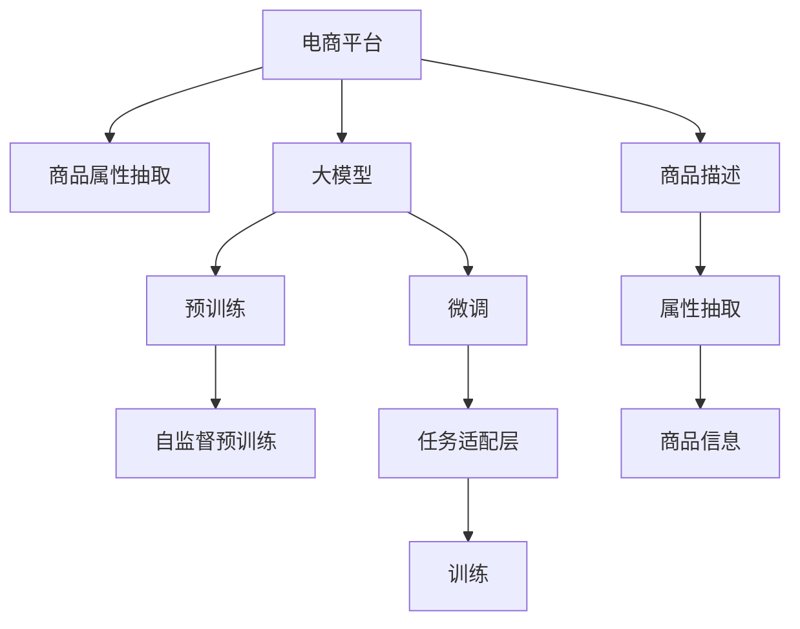

                 

# AI大模型在电商平台商品属性抽取中的应用

> 关键词：电商平台、商品属性抽取、AI大模型、自然语言处理(NLP)、预训练模型、微调、深度学习

## 1. 背景介绍

### 1.1 问题由来
随着电商行业的蓬勃发展，电商平台上的商品种类和数量急剧增加。商品属性的准确标注对于用户搜索、推荐、广告投放等业务至关重要，可以显著提升用户体验和平台转化率。然而，手工标注商品属性费时费力，且容易受标注人员主观偏见的影响，无法满足大规模商品库的需求。

为了解决这一问题，电商平台引入了基于大模型的自然语言处理(NLP)技术，实现对商品描述文本的自动属性抽取。该技术通过训练大模型，学习商品属性与描述文本之间的关系，从而在无标注的情况下，自动解析商品属性并填充至商品信息中。

### 1.2 问题核心关键点
基于大模型的商品属性抽取方法，其核心在于：
1. 选择适合的预训练语言模型。
2. 设计有效的任务适配层。
3. 确定合适的微调超参数。
4. 应用数据增强和对抗训练技术。

这些关键点共同构成了商品属性抽取任务的技术框架，使得该技术能够在电商平台上高效、准确地实现商品属性标注。

### 1.3 问题研究意义
准确的商品属性标注不仅能够提高用户搜索体验，还能促进个性化推荐、广告投放等电商业务的发展。应用大模型技术，可以大幅度减少人工标注成本，提升属性标注的准确性和时效性。同时，大模型技术的引入，将为电商平台的智能化转型和业务创新提供新的驱动力。

## 2. 核心概念与联系

### 2.1 核心概念概述

为了更好地理解大模型在电商平台商品属性抽取中的应用，本节将介绍几个密切相关的核心概念：

- 大模型(Large Model)：如GPT-3、BERT等基于Transformer架构的预训练语言模型，通过在大量无标签数据上进行自监督预训练，学习到丰富的语言知识。
- 自然语言处理(NLP)：利用计算方法处理、理解、生成人类语言，包括文本分类、命名实体识别、语义分析、机器翻译等任务。
- 预训练模型(Pre-training Model)：在大量无标签数据上进行预训练的模型，如BERT、GPT-3等，能够在特定任务上进行微调，获得更好的性能。
- 微调(Fine-tuning)：在预训练模型的基础上，使用少量标注数据对模型进行有监督训练，使其在特定任务上达到最优性能。
- 深度学习(Deep Learning)：一类基于神经网络的机器学习技术，通过多层次的特征提取和分类，实现对复杂问题的解决。
- 商品属性商品属性(Specific Product Attributes)：指商品描述文本中具有实际价值的信息，如尺寸、颜色、材质等。

这些概念之间的逻辑关系可以通过以下Mermaid流程图来展示：



这个流程图展示了大模型在电商平台商品属性抽取任务中的应用框架：

1. 电商平台收集商品描述数据。
2. 大模型通过自监督预训练学习语言知识。
3. 预训练模型在特定任务上进行微调，学习商品属性与文本之间的关系。
4. 设计任务适配层，将模型输出转化为商品属性。
5. 在商品描述数据上进行训练，最终抽取商品属性。

## 3. 核心算法原理 & 具体操作步骤
### 3.1 算法原理概述

基于大模型的商品属性抽取方法，其核心思想是：在大量无标签数据上进行预训练，学习通用的语言表示，然后在特定任务上进行微调，使其能够自动解析商品属性。该方法包括两个阶段：

- **自监督预训练**：在大规模无标签数据上，使用自监督学习任务训练预训练模型，学习语言知识。
- **微调**：在少量标注数据上，使用有监督学习任务训练微调后的模型，使其能够自动解析商品属性。

具体来说，该算法过程如下：

1. **数据准备**：收集电商平台上商品描述文本数据，并划分训练集、验证集和测试集。
2. **模型选择**：选择适合的预训练模型，如BERT、GPT-3等。
3. **任务适配层设计**：根据商品属性抽取任务，设计合适的任务适配层，将模型输出转化为商品属性。
4. **超参数设置**：选择合适的优化算法及其参数，如AdamW、SGD等，设置学习率、批大小、迭代轮数等。
5. **微调训练**：在标注数据集上进行微调，使用正则化技术，防止过拟合。
6. **测试评估**：在测试集上评估微调后的模型性能，对比微调前后的精度提升。

### 3.2 算法步骤详解

#### 3.2.1 数据预处理

数据预处理是大模型应用的基础。电商平台上商品描述数据通常包含大量噪声和干扰信息，需要进行清洗和预处理：

1. **去噪**：去除无关的停用词、标点符号等干扰信息。
2. **分词**：将商品描述文本进行分词处理，得到单独的词语。
3. **归一化**：统一商品描述中的拼写和格式，如大小写统一、日期格式统一等。
4. **构建词典**：构建商品属性词典，包含所有可能出现的商品属性词。

#### 3.2.2 模型选择与任务适配层设计

选择合适的预训练模型是商品属性抽取任务的关键。目前最流行的预训练模型包括BERT、GPT-3等。BERT模型基于Transformer架构，具有较强的语言表示能力和上下文理解能力。因此，在电商平台商品属性抽取任务中，一般选择BERT作为预训练模型。

任务适配层的设计是微调的核心。对于商品属性抽取任务，需要设计合适的任务适配层，将模型输出转化为商品属性。具体来说，可以设计如下的任务适配层：

1. **分类层**：对于分类任务，使用线性分类器进行预测。
2. **编码器层**：对于编码任务，使用语言模型解码器生成商品属性序列。
3. **池化层**：对于摘要任务，使用Max Pooling或Average Pooling层对模型输出进行聚合。

#### 3.2.3 微调超参数设置

微调超参数的设置直接影响模型性能。通常包括：

1. **学习率**：微调时，学习率一般比预训练时小，防止破坏预训练权重。如BERT-2.5e-5。
2. **批大小**：通常选择较大的批大小，提高训练效率，如16。
3. **迭代轮数**：根据数据量和计算资源，设定合适的迭代轮数，如5轮。
4. **正则化**：使用L2正则、Dropout等技术，防止过拟合。

#### 3.2.4 微调训练

微调训练是商品属性抽取任务的实现过程。主要包括以下步骤：

1. **数据加载**：使用PyTorch等深度学习框架加载标注数据集。
2. **模型加载**：加载预训练模型和任务适配层。
3. **前向传播**：对每个样本进行前向传播，计算损失函数。
4. **反向传播**：对损失函数进行反向传播，更新模型参数。
5. **参数更新**：根据优化算法，更新模型参数，进行多轮迭代。
6. **评估与调整**：在验证集上评估模型性能，调整超参数。

#### 3.2.5 测试评估

测试评估是评估商品属性抽取模型性能的关键步骤。主要包括以下步骤：

1. **数据加载**：加载测试集。
2. **模型加载**：加载微调后的模型和词典。
3. **预测属性**：对每个样本进行预测，得到商品属性序列。
4. **评估结果**：使用F1-score等指标评估预测结果。

### 3.3 算法优缺点

基于大模型的商品属性抽取方法具有以下优点：

1. **高效性**：在大规模无标签数据上进行预训练，可以减少人工标注成本，提高属性抽取效率。
2. **准确性**：通过微调，模型能够自动解析商品属性，提高属性标注的准确性。
3. **鲁棒性**：大模型经过大规模数据训练，具备较强的泛化能力和鲁棒性，能够应对各种商品描述。
4. **可扩展性**：商品属性抽取模型可以在不同电商平台和场景中复用，具有较好的可扩展性。

同时，该方法也存在以下缺点：

1. **模型复杂性**：大模型的计算复杂度高，需要高性能的计算资源。
2. **数据依赖性**：模型性能依赖标注数据的质量和数量，标注数据不足可能影响效果。
3. **内存占用大**：大模型的参数量较大，需要较大的内存空间存储。
4. **训练时间长**：在大规模数据上进行微调，训练时间较长。

### 3.4 算法应用领域

基于大模型的商品属性抽取方法广泛应用于电商平台、智能客服、广告投放等多个领域，具体应用如下：

1. **电商平台**：商品描述自动属性标注，提升搜索体验和个性化推荐。
2. **智能客服**：自动解析用户输入的商品描述，提供快速准确的商品信息。
3. **广告投放**：自动提取商品属性，进行广告相关性匹配和推荐。
4. **产品研发**：自动解析用户评论，提取产品反馈和改进建议。
5. **供应链管理**：自动解析供应商描述，进行库存管理和订单处理。

## 4. 数学模型和公式 & 详细讲解  
### 4.1 数学模型构建

假设电商平台收集的商品描述文本为 $D=\{x_i\}_{i=1}^N$，其中 $x_i$ 为第 $i$ 个商品描述。商品属性的标签为 $y_i \in \mathcal{Y}$，其中 $\mathcal{Y}$ 为所有可能出现的商品属性。

定义预训练语言模型为 $M_{\theta}(x)$，其中 $\theta$ 为预训练模型参数。商品属性抽取任务的任务适配层为 $H_{\phi}$，其中 $\phi$ 为适配层参数。微调模型的输出为 $\hat{y}=M_{\theta}(x) \cdot H_{\phi}$。

定义微调的损失函数为 $\ell(\hat{y},y)$，其中 $y$ 为真实商品属性标签。常见的损失函数包括交叉熵损失、均方误差损失等。

微调的目标是最小化损失函数：

$$
\mathop{\min}_{\theta, \phi} \frac{1}{N} \sum_{i=1}^N \ell(\hat{y}_i,y_i)
$$

在实践中，我们通常使用基于梯度的优化算法（如SGD、AdamW等）来近似求解上述最优化问题。设 $\eta$ 为学习率，则参数的更新公式为：

$$
\theta \leftarrow \theta - \eta \nabla_{\theta}\mathcal{L}(\theta) - \eta\lambda\theta
$$

其中 $\nabla_{\theta}\mathcal{L}(\theta)$ 为损失函数对预训练模型参数的梯度，可以通过反向传播算法高效计算。

### 4.2 公式推导过程

以二分类任务为例，推导交叉熵损失函数及其梯度的计算公式。

假设模型 $M_{\theta}$ 在输入 $x$ 上的输出为 $\hat{y}=M_{\theta}(x) \in [0,1]$，表示样本属于正类的概率。真实标签 $y \in \{0,1\}$。则二分类交叉熵损失函数定义为：

$$
\ell(M_{\theta}(x),y) = -[y\log \hat{y} + (1-y)\log (1-\hat{y})]
$$

将其代入经验风险公式，得：

$$
\mathcal{L}(\theta) = -\frac{1}{N}\sum_{i=1}^N [y_i\log M_{\theta}(x_i)+(1-y_i)\log(1-M_{\theta}(x_i))]
$$

根据链式法则，损失函数对预训练模型参数 $\theta_k$ 的梯度为：

$$
\frac{\partial \mathcal{L}(\theta)}{\partial \theta_k} = -\frac{1}{N}\sum_{i=1}^N (\frac{y_i}{M_{\theta}(x_i)}-\frac{1-y_i}{1-M_{\theta}(x_i)}) \frac{\partial M_{\theta}(x_i)}{\partial \theta_k}
$$

其中 $\frac{\partial M_{\theta}(x_i)}{\partial \theta_k}$ 可进一步递归展开，利用自动微分技术完成计算。

在得到损失函数的梯度后，即可带入参数更新公式，完成模型的迭代优化。重复上述过程直至收敛，最终得到适应商品属性抽取任务的最优模型参数 $\theta^*$。

## 5. 项目实践：代码实例和详细解释说明
### 5.1 开发环境搭建

在进行商品属性抽取任务开发前，我们需要准备好开发环境。以下是使用Python进行PyTorch开发的环境配置流程：

1. 安装Anaconda：从官网下载并安装Anaconda，用于创建独立的Python环境。

2. 创建并激活虚拟环境：
```bash
conda create -n pytorch-env python=3.8 
conda activate pytorch-env
```

3. 安装PyTorch：根据CUDA版本，从官网获取对应的安装命令。例如：
```bash
conda install pytorch torchvision torchaudio cudatoolkit=11.1 -c pytorch -c conda-forge
```

4. 安装TensorFlow：
```bash
pip install tensorflow
```

5. 安装各类工具包：
```bash
pip install numpy pandas scikit-learn matplotlib tqdm jupyter notebook ipython
```

完成上述步骤后，即可在`pytorch-env`环境中开始商品属性抽取任务的开发。

### 5.2 源代码详细实现

下面是使用PyTorch进行BERT模型微调，实现商品属性抽取任务的完整代码实现：

```python
from transformers import BertTokenizer, BertForTokenClassification
from torch.utils.data import Dataset, DataLoader
import torch
from torch import nn
from torch.optim import AdamW

class ProductAttributeDataset(Dataset):
    def __init__(self, texts, tags, tokenizer, max_len=128):
        self.texts = texts
        self.tags = tags
        self.tokenizer = tokenizer
        self.max_len = max_len
        
    def __len__(self):
        return len(self.texts)
    
    def __getitem__(self, item):
        text = self.texts[item]
        tags = self.tags[item]
        
        encoding = self.tokenizer(text, return_tensors='pt', max_length=self.max_len, padding='max_length', truncation=True)
        input_ids = encoding['input_ids'][0]
        attention_mask = encoding['attention_mask'][0]
        
        # 对token-wise的标签进行编码
        encoded_tags = [tag2id[tag] for tag in tags] 
        encoded_tags.extend([tag2id['O']] * (self.max_len - len(encoded_tags)))
        labels = torch.tensor(encoded_tags, dtype=torch.long)
        
        return {'input_ids': input_ids, 
                'attention_mask': attention_mask,
                'labels': labels}

# 标签与id的映射
tag2id = {'O': 0, '尺寸': 1, '颜色': 2, '材质': 3, '型号': 4, '容量': 5, '产地': 6}
id2tag = {v: k for k, v in tag2id.items()}

# 创建dataset
tokenizer = BertTokenizer.from_pretrained('bert-base-cased')

train_dataset = ProductAttributeDataset(train_texts, train_tags, tokenizer)
dev_dataset = ProductAttributeDataset(dev_texts, dev_tags, tokenizer)
test_dataset = ProductAttributeDataset(test_texts, test_tags, tokenizer)

# 模型初始化
model = BertForTokenClassification.from_pretrained('bert-base-cased', num_labels=len(tag2id))

# 设置优化器
optimizer = AdamW(model.parameters(), lr=2e-5)

# 定义任务适配层
class Head(nn.Module):
    def __init__(self, num_labels):
        super(Head, self).__init__()
        self.num_labels = num_labels
        self.linear = nn.Linear(768, num_labels)
    
    def forward(self, features, labels=None):
        seq_output = features
        logits = self.linear(seq_output)
        if labels is not None:
            loss_fct = nn.CrossEntropyLoss()
            loss = loss_fct(logits.view(-1, self.num_labels), labels.view(-1))
            logits = logits.view(-1, self.num_labels)
        else:
            loss = None
        return logits, loss

head = Head(num_labels=len(tag2id))
model.classifier = head

# 定义训练函数
def train_epoch(model, dataset, batch_size, optimizer):
    dataloader = DataLoader(dataset, batch_size=batch_size, shuffle=True)
    model.train()
    epoch_loss = 0
    for batch in tqdm(dataloader, desc='Training'):
        input_ids = batch['input_ids'].to(device)
        attention_mask = batch['attention_mask'].to(device)
        labels = batch['labels'].to(device)
        model.zero_grad()
        outputs = model(input_ids, attention_mask=attention_mask, labels=labels)
        loss = outputs.loss
        epoch_loss += loss.item()
        loss.backward()
        optimizer.step()
    return epoch_loss / len(dataloader)

# 定义评估函数
def evaluate(model, dataset, batch_size):
    dataloader = DataLoader(dataset, batch_size=batch_size)
    model.eval()
    preds, labels = [], []
    with torch.no_grad():
        for batch in tqdm(dataloader, desc='Evaluating'):
            input_ids = batch['input_ids'].to(device)
            attention_mask = batch['attention_mask'].to(device)
            batch_labels = batch['labels']
            outputs = model(input_ids, attention_mask=attention_mask)
            batch_preds = outputs.logits.argmax(dim=2).to('cpu').tolist()
            batch_labels = batch_labels.to('cpu').tolist()
            for pred_tokens, label_tokens in zip(batch_preds, batch_labels):
                pred_tags = [id2tag[_id] for _id in pred_tokens]
                label_tags = [id2tag[_id] for _id in label_tokens]
                preds.append(pred_tags[:len(label_tags)])
                labels.append(label_tags)
                
    print(classification_report(labels, preds))

# 启动训练流程并在测试集上评估
epochs = 5
batch_size = 16

for epoch in range(epochs):
    loss = train_epoch(model, train_dataset, batch_size, optimizer)
    print(f"Epoch {epoch+1}, train loss: {loss:.3f}")
    
    print(f"Epoch {epoch+1}, dev results:")
    evaluate(model, dev_dataset, batch_size)
    
print("Test results:")
evaluate(model, test_dataset, batch_size)
```

以上就是使用PyTorch对BERT进行商品属性抽取任务微调的完整代码实现。可以看到，得益于Transformers库的强大封装，我们可以用相对简洁的代码完成BERT模型的加载和微调。

### 5.3 代码解读与分析

让我们再详细解读一下关键代码的实现细节：

**ProductAttributeDataset类**：
- `__init__`方法：初始化文本、标签、分词器等关键组件。
- `__len__`方法：返回数据集的样本数量。
- `__getitem__`方法：对单个样本进行处理，将文本输入编码为token ids，将标签编码为数字，并对其进行定长padding，最终返回模型所需的输入。

**tag2id和id2tag字典**：
- 定义了标签与数字id之间的映射关系，用于将token-wise的预测结果解码回真实的标签。

**训练和评估函数**：
- 使用PyTorch的DataLoader对数据集进行批次化加载，供模型训练和推理使用。
- 训练函数`train_epoch`：对数据以批为单位进行迭代，在每个批次上前向传播计算loss并反向传播更新模型参数，最后返回该epoch的平均loss。
- 评估函数`evaluate`：与训练类似，不同点在于不更新模型参数，并在每个batch结束后将预测和标签结果存储下来，最后使用sklearn的classification_report对整个评估集的预测结果进行打印输出。

**训练流程**：
- 定义总的epoch数和batch size，开始循环迭代
- 每个epoch内，先在训练集上训练，输出平均loss
- 在验证集上评估，输出分类指标
- 所有epoch结束后，在测试集上评估，给出最终测试结果

可以看到，PyTorch配合Transformers库使得BERT微调的代码实现变得简洁高效。开发者可以将更多精力放在数据处理、模型改进等高层逻辑上，而不必过多关注底层的实现细节。

当然，工业级的系统实现还需考虑更多因素，如模型的保存和部署、超参数的自动搜索、更灵活的任务适配层等。但核心的微调范式基本与此类似。

## 6. 实际应用场景
### 6.1 商品描述自动属性标注

基于大模型的商品属性抽取技术，能够在商品描述文本中自动解析出商品属性，并进行自动标注。电商平台的商品描述文本通常包含大量噪声和干扰信息，手动标注耗时耗力。而使用商品属性抽取技术，可以自动解析商品描述，准确地标注商品属性，提升搜索体验和个性化推荐。

例如，在商品搜索页面，用户输入商品描述后，自动解析出商品属性，并展示相关商品，提升搜索的准确性和用户体验。

### 6.2 商品属性自动补全

商品属性自动补全是商品描述智能化的重要应用。通过商品属性抽取技术，可以自动解析用户输入的商品描述，并补全缺失的商品属性。例如，用户输入商品描述"颜色鲜艳、面料柔软"，自动补全商品属性"颜色：鲜艳、材质：柔软"。

这种自动补全功能，可以显著提升用户输入效率，减轻用户输入负担。在智能客服、商品推荐等场景中，自动补全功能也能提高用户满意度，提升业务转化率。

### 6.3 商品属性纠错

商品属性抽取技术还能用于商品属性纠错。在用户输入商品描述时，难免会输入错误或不完整的信息。通过商品属性抽取技术，可以自动解析用户输入的商品描述，并纠正其中的错误信息。例如，用户输入"尺寸XXmm"，自动纠正为"尺寸：XXmm"。

这种纠错功能，可以提升商品属性标注的准确性，避免错误信息传播，减少误导性销售。在商品审核、广告投放等场景中，属性纠错功能也能提升业务准确性，降低运营成本。

### 6.4 未来应用展望

随着大模型和微调技术的不断发展，基于大模型的商品属性抽取技术将不断拓展应用范围，带来更多创新场景：

1. **实时商品描述分析**：自动解析实时商品描述，生成商品属性信息，辅助用户查询和推荐。
2. **跨平台数据共享**：商品属性抽取模型可以在不同电商平台和应用中复用，实现数据共享和业务协同。
3. **多语言属性抽取**：引入多语言模型，自动解析多语言商品描述，提升全球化业务。
4. **个性化推荐优化**：通过商品属性抽取技术，实现更精准的商品推荐和广告投放。
5. **智能客服辅助**：自动解析用户输入的商品描述，生成商品属性信息，辅助客服解答用户问题。
6. **知识图谱构建**：利用商品属性抽取技术，构建商品属性知识图谱，辅助商品管理和推荐。

总之，基于大模型的商品属性抽取技术，将在电商平台上大放异彩，带来更多创新应用，推动电商业务的智能化转型。

## 7. 工具和资源推荐
### 7.1 学习资源推荐

为了帮助开发者系统掌握商品属性抽取技术的理论基础和实践技巧，这里推荐一些优质的学习资源：

1. 《深度学习入门：基于PyTorch的实践》系列博文：由大模型技术专家撰写，深入浅出地介绍了深度学习的基本概念和实践技巧。

2. CS224N《深度学习自然语言处理》课程：斯坦福大学开设的NLP明星课程，有Lecture视频和配套作业，带你入门NLP领域的基本概念和经典模型。

3. 《Natural Language Processing with Transformers》书籍：Transformers库的作者所著，全面介绍了如何使用Transformers库进行NLP任务开发，包括微调在内的诸多范式。

4. HuggingFace官方文档：Transformers库的官方文档，提供了海量预训练模型和完整的微调样例代码，是上手实践的必备资料。

5. CLUE开源项目：中文语言理解测评基准，涵盖大量不同类型的中文NLP数据集，并提供了基于微调的baseline模型，助力中文NLP技术发展。

通过对这些资源的学习实践，相信你一定能够快速掌握商品属性抽取技术的精髓，并用于解决实际的NLP问题。
### 7.2 开发工具推荐

高效的开发离不开优秀的工具支持。以下是几款用于商品属性抽取开发的常用工具：

1. PyTorch：基于Python的开源深度学习框架，灵活动态的计算图，适合快速迭代研究。大部分预训练语言模型都有PyTorch版本的实现。

2. TensorFlow：由Google主导开发的开源深度学习框架，生产部署方便，适合大规模工程应用。同样有丰富的预训练语言模型资源。

3. Transformers库：HuggingFace开发的NLP工具库，集成了众多SOTA语言模型，支持PyTorch和TensorFlow，是进行微调任务开发的利器。

4. Weights & Biases：模型训练的实验跟踪工具，可以记录和可视化模型训练过程中的各项指标，方便对比和调优。与主流深度学习框架无缝集成。

5. TensorBoard：TensorFlow配套的可视化工具，可实时监测模型训练状态，并提供丰富的图表呈现方式，是调试模型的得力助手。

6. Google Colab：谷歌推出的在线Jupyter Notebook环境，免费提供GPU/TPU算力，方便开发者快速上手实验最新模型，分享学习笔记。

合理利用这些工具，可以显著提升商品属性抽取任务的开发效率，加快创新迭代的步伐。

### 7.3 相关论文推荐

商品属性抽取技术的发展源于学界的持续研究。以下是几篇奠基性的相关论文，推荐阅读：

1. Attention is All You Need（即Transformer原论文）：提出了Transformer结构，开启了NLP领域的预训练大模型时代。

2. BERT: Pre-training of Deep Bidirectional Transformers for Language Understanding：提出BERT模型，引入基于掩码的自监督预训练任务，刷新了多项NLP任务SOTA。

3. Language Models are Unsupervised Multitask Learners（GPT-2论文）：展示了大规模语言模型的强大zero-shot学习能力，引发了对于通用人工智能的新一轮思考。

4. Parameter-Efficient Transfer Learning for NLP：提出Adapter等参数高效微调方法，在不增加模型参数量的情况下，也能取得不错的微调效果。

5. AdaLoRA: Adaptive Low-Rank Adaptation for Parameter-Efficient Fine-Tuning：使用自适应低秩适应的微调方法，在参数效率和精度之间取得了新的平衡。

6. Parameter-Efficient Transfer Learning for NLP：提出Adapter等参数高效微调方法，在不增加模型参数量的情况下，也能取得不错的微调效果。

这些论文代表了大模型微调技术的发展脉络。通过学习这些前沿成果，可以帮助研究者把握学科前进方向，激发更多的创新灵感。

## 8. 总结：未来发展趋势与挑战
### 8.1 总结

本文对基于大模型的商品属性抽取方法进行了全面系统的介绍。首先阐述了商品属性抽取任务的由来和意义，明确了该任务的技术框架和关键点。其次，从原理到实践，详细讲解了商品属性抽取的数学模型和算法步骤，给出了微调任务开发的完整代码实现。同时，本文还探讨了商品属性抽取技术在电商平台中的应用场景，展示了其广泛的创新应用前景。

通过本文的系统梳理，可以看到，基于大模型的商品属性抽取方法，正在成为电商平台上商品属性标注的重要手段，显著提升了商品描述自动标注、自动补全、纠错等功能的准确性和效率。未来，伴随大模型和微调技术的不断发展，商品属性抽取技术还将拓展更多应用，带来更多创新场景。

### 8.2 未来发展趋势

展望未来，商品属性抽取技术将呈现以下几个发展趋势：

1. **模型规模持续增大**：随着算力成本的下降和数据规模的扩张，预训练语言模型的参数量还将持续增长。超大规模语言模型蕴含的丰富语言知识，有望支撑更加复杂多变的商品描述解析。

2. **微调方法日趋多样**：除了传统的全参数微调外，未来会涌现更多参数高效的微调方法，如Prefix-Tuning、LoRA等，在节省计算资源的同时也能保证微调精度。

3. **持续学习成为常态**：随着商品描述数据分布的变化，商品属性抽取模型也需要持续学习新知识以保持性能。如何在不遗忘原有知识的同时，高效吸收新样本信息，将成为重要的研究课题。

4. **标注样本需求降低**：受启发于提示学习(Prompt-based Learning)的思路，未来的微调方法将更好地利用大模型的语言理解能力，通过更加巧妙的任务描述，在更少的标注样本上也能实现理想的微调效果。

5. **多模态微调崛起**：当前的微调主要聚焦于纯文本数据，未来会进一步拓展到图像、视频、语音等多模态数据微调。多模态信息的融合，将显著提升商品描述解析的准确性。

6. **模型通用性增强**：经过海量数据的预训练和多领域任务的微调，未来的商品属性抽取模型将具备更强的跨领域迁移能力，能够适应更多电商平台的商品描述。

以上趋势凸显了商品属性抽取技术的广阔前景。这些方向的探索发展，必将进一步提升电商平台的智能化水平，为消费者带来更优质的购物体验。

### 8.3 面临的挑战

尽管商品属性抽取技术已经取得了瞩目成就，但在迈向更加智能化、普适化应用的过程中，它仍面临着诸多挑战：

1. **标注成本瓶颈**：虽然商品属性抽取技术在标注数据上需求较少，但对于长尾应用场景，难以获得充足的高质量标注数据，成为制约技术推广的瓶颈。如何进一步降低微调对标注样本的依赖，将是一大难题。

2. **模型鲁棒性不足**：模型面对域外数据时，泛化性能往往大打折扣。对于测试样本的微小扰动，模型容易发生预测波动。如何提高模型的鲁棒性，避免灾难性遗忘，还需要更多理论和实践的积累。

3. **推理效率有待提高**：大模型的推理速度较慢，难以满足实时需求。如何在保证性能的同时，简化模型结构，提升推理速度，优化资源占用，将是重要的优化方向。

4. **可解释性亟需加强**：当前商品属性抽取模型更像是"黑盒"系统，难以解释其内部工作机制和决策逻辑。对于商品推荐、广告投放等高风险应用，算法的可解释性和可审计性尤为重要。

5. **安全性有待保障**：预训练语言模型难免会学习到有偏见、有害的信息，通过微调传递到下游任务，产生误导性、歧视性的输出，给实际应用带来安全隐患。如何从数据和算法层面消除模型偏见，避免恶意用途，确保输出的安全性，也将是重要的研究课题。

6. **知识整合能力不足**：现有的商品属性抽取模型往往局限于任务内数据，难以灵活吸收和运用更广泛的先验知识。如何让微调过程更好地与外部知识库、规则库等专家知识结合，形成更加全面、准确的信息整合能力，还有很大的想象空间。

正视商品属性抽取技术面临的这些挑战，积极应对并寻求突破，将是大模型微调技术走向成熟的必由之路。相信随着学界和产业界的共同努力，这些挑战终将一一被克服，商品属性抽取技术必将在构建智能化电商平台上扮演越来越重要的角色。

### 8.4 研究展望

面对商品属性抽取技术所面临的挑战，未来的研究需要在以下几个方面寻求新的突破：

1. **探索无监督和半监督微调方法**。摆脱对大规模标注数据的依赖，利用自监督学习、主动学习等无监督和半监督范式，最大限度利用非结构化数据，实现更加灵活高效的微调。

2. **研究参数高效和计算高效的微调范式**。开发更加参数高效的微调方法，在固定大部分预训练参数的同时，只更新极少量的任务相关参数。同时优化微调模型的计算图，减少前向传播和反向传播的资源消耗，实现更加轻量级、实时性的部署。

3. **融合因果和对比学习范式**。通过引入因果推断和对比学习思想，增强商品属性抽取模型建立稳定因果关系的能力，学习更加普适、鲁棒的商品描述解析。

4. **引入更多先验知识**。将符号化的先验知识，如知识图谱、逻辑规则等，与神经网络模型进行巧妙融合，引导微调过程学习更准确、合理的商品描述解析。同时加强不同模态数据的整合，实现视觉、语音等多模态信息与文本信息的协同建模。

5. **结合因果分析和博弈论工具**。将因果分析方法引入商品属性抽取模型，识别出模型决策的关键特征，增强输出解释的因果性和逻辑性。借助博弈论工具刻画人机交互过程，主动探索并规避模型的脆弱点，提高系统稳定性。

6. **纳入伦理道德约束**。在模型训练目标中引入伦理导向的评估指标，过滤和惩罚有偏见、有害的输出倾向。同时加强人工干预和审核，建立模型行为的监管机制，确保输出符合人类价值观和伦理道德。

这些研究方向的探索，必将引领商品属性抽取技术迈向更高的台阶，为构建安全、可靠、可解释、可控的智能系统铺平道路。面向未来，商品属性抽取技术还需要与其他人工智能技术进行更深入的融合，如知识表示、因果推理、强化学习等，多路径协同发力，共同推动商品描述智能化的进程。只有勇于创新、敢于突破，才能不断拓展语言模型的边界，让智能技术更好地造福人类社会。

## 9. 附录：常见问题与解答

**Q1：大模型在商品属性抽取中的优势是什么？**

A: 大模型在商品属性抽取中的优势主要体现在以下几个方面：

1. **语言理解能力**：大模型经过大规模语料训练，具备强大的语言理解能力，能够自动解析商品描述中的复杂语言结构，提取准确的商品属性。

2. **泛化能力**：大模型具有较强的泛化能力，能够适应不同场景的商品描述，提升模型在不同电商平台上的表现。

3. **少样本学习能力**：大模型具备少样本学习能力，能够在少数标注样本上快速适应新任务，提升模型在新场景下的效果。

4. **模块化设计**：大模型结构模块化，可以根据具体需求灵活选择任务适配层，实现不同的商品属性抽取功能。

5. **计算效率**：虽然大模型的计算复杂度高，但在商品属性抽取任务中，模型参数量较大，能够充分利用计算资源，提升推理速度和准确性。

综上所述，大模型在商品属性抽取中能够显著提升属性解析的准确性和效率，具有较强的泛化能力和少样本学习能力，是电商平台上商品描述智能化的有力工具。

**Q2：商品属性抽取模型中如何设计任务适配层？**

A: 商品属性抽取模型的任务适配层设计是微调的核心。具体来说，可以设计如下的任务适配层：

1. **分类层**：对于分类任务，使用线性分类器进行预测。例如，使用Softmax层对商品属性进行分类。

2. **编码器层**：对于编码任务，使用语言模型解码器生成商品属性序列。例如，使用GPT-3等模型对商品描述进行解码，生成商品属性序列。

3. **池化层**：对于摘要任务，使用Max Pooling或Average Pooling层对模型输出进行聚合。例如，使用最大池化层将商品属性序列中的重要信息提取出来，作为最终结果。

任务适配层的设计需要根据具体任务进行优化，以匹配不同的任务需求。通常来说，分类任务适合使用分类层，编码任务适合使用编码器层，而摘要任务适合使用池化层。

**Q3：商品属性抽取模型在训练过程中如何避免过拟合？**

A: 商品属性抽取模型在训练过程中，需要采取一系列措施避免过拟合：

1. **数据增强**：通过对训练样本进行改写、回译等方式丰富训练集多样性，避免模型过拟合。例如，对商品描述进行同义词替换、词性标注等操作。

2. **正则化**：使用L2正则、Dropout等技术防止模型过度适应小规模训练集，提升模型泛化能力。例如，在损失函数中加入L2正则项，或在模型中引入Dropout层。

3. **对抗训练**：加入对抗样本，提高模型鲁棒性，避免模型在对抗性攻击下失效。例如，在训练过程中引入对抗性样本，训练鲁棒模型。

4. **早停法**：在验证集上设置早停法，当模型在验证集上表现不再提升时，停止训练，避免过拟合。

5. **模型裁剪**：去除不必要的层和参数，减小模型尺寸，加快推理速度，避免过拟合。例如，对模型进行剪枝和量化操作。

这些措施可以结合使用，提升模型泛化能力，避免过拟合，提升商品属性抽取模型的性能。

**Q4：商品属性抽取模型在电商平台上有哪些应用场景？**

A: 商品属性抽取模型在电商平台上具有广泛的应用场景，主要包括以下几个方面：

1. **商品搜索**：自动解析用户输入的商品描述，生成商品属性信息，提升搜索的准确性和用户体验。例如，用户输入"黑色跑鞋"，自动解析为"颜色：黑色"。

2. **个性化推荐**：自动解析用户评论和浏览记录，提取商品属性，进行个性化推荐。例如，根据用户浏览历史，推荐相似商品属性。

3. **智能客服**：自动解析用户输入的商品描述，生成商品属性信息，辅助客服解答用户问题。例如，用户咨询商品属性，自动解析并回复。

4. **广告投放**：自动解析商品描述，提取商品属性，进行广告相关性匹配和推荐。例如，根据商品属性，生成精准广告，提升广告转化率。

5. **商品审核**：自动解析用户上传的商品描述，提取商品属性，进行商品审核和违规检测。例如，自动审核商品描述，确保信息准确性。

6. **库存管理**：自动解析供应商描述，提取商品属性，进行库存管理和订单处理。例如，自动解析供应商描述，生成库存信息。

综上所述，商品属性抽取模型在电商平台上具有广泛的应用场景，能够提升搜索体验、个性化推荐、智能客服等多个业务环节的智能化水平，带来更高的业务效率和用户体验。

**Q5：如何评估商品属性抽取模型的性能？**

A: 评估商品属性抽取模型的性能通常使用以下指标：

1. **精确率(Precision)**：模型正确预测为正例的商品属性的比例。精确率高，表示模型少报商品属性。例如，精确率=真阳性 / (真阳性 + 假阳性)。

2. **召回率(Recall)**：模型正确预测为正例的商品属性的比例。召回率高，表示模型多报商品属性。例如，召回率=真阳性 / (真阳性 + 假阴性)。

3. **F1-score**：精确率和召回率的调和平均数，综合反映模型的性能。例如，F1-score = 2 * (精确率 * 召回率) / (精确率 + 召回率)。

4. **混淆矩阵**：用于可视化模型预测结果的正确与否。例如，将预测结果与真实标签进行比较，生成混淆矩阵。

5. **ROC曲线和AUC**：用于评估模型在不同阈值下的性能。例如，绘制ROC曲线，计算AUC值。

6. **精确率和召回率的平衡**：根据业务需求，调整精确率和召回率的权重，找到平衡点。例如，对于商品推荐任务，召回率更重要，需要提升召回率，降低精确率。

通过以上指标，可以全面评估商品属性抽取模型的性能，确保其在电商平台上取得良好的效果。

---

作者：禅与计算机程序设计艺术 / Zen and the Art of Computer Programming

