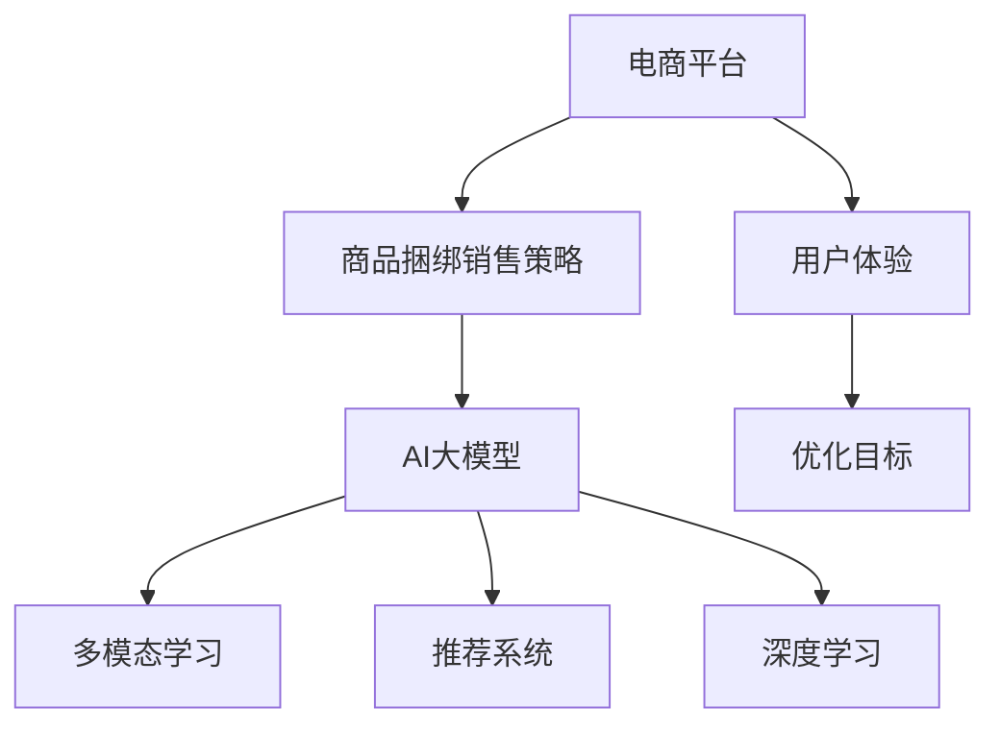

                 

# AI大模型在电商平台商品捆绑销售策略优化中的应用

> 关键词：电商平台, 商品捆绑销售策略, AI大模型, 多模态学习, 推荐系统, 深度学习, 用户体验

## 1. 背景介绍

随着电子商务的迅猛发展，电商平台的竞争日趋激烈。为了在竞争中占据优势，各大电商平台纷纷采取了各种促销策略。其中，商品捆绑销售(Tie-In Selling)成为一种有效的销售手段。商品捆绑销售是指将多个商品组合在一起进行销售，不仅能够提高销售额，还能够提升用户体验。然而，如何优化商品捆绑销售策略，最大化销售额和用户满意度，是电商平台需要面对的重要问题。

近年来，随着人工智能技术的发展，AI大模型在电商平台的应用日益广泛。AI大模型，尤其是基于深度学习的模型，具备强大的数据处理能力和模式识别能力，可以在商品推荐、价格优化、广告投放等多个领域发挥重要作用。本文将聚焦于AI大模型在电商平台商品捆绑销售策略优化中的应用，通过理论分析与实践案例，探讨如何利用AI大模型提升电商平台销售效率和用户满意度。

## 2. 核心概念与联系

### 2.1 核心概念概述

为了更好地理解AI大模型在商品捆绑销售中的应用，我们首先需要明确几个关键概念：

- **电商平台**：指通过互联网技术实现的线上购物平台，如淘宝、京东、亚马逊等。
- **商品捆绑销售策略**：指将多个商品组合在一起进行销售，以吸引用户一次性购买更多商品。
- **AI大模型**：指通过大规模数据预训练得到的深度学习模型，如BERT、GPT等，具备强大的语言理解和生成能力。
- **多模态学习**：指利用多种数据源进行学习，如文本、图像、视频等，以获取更全面的信息。
- **推荐系统**：指基于用户行为数据和商品特征，为每个用户推荐最感兴趣的商品。
- **深度学习**：指通过多层神经网络进行数据学习和模式识别，是AI大模型的核心技术。
- **用户体验**：指用户在使用电商平台时的主观感受和满意度，是优化商品捆绑销售策略的重要考量因素。

这些核心概念之间的逻辑关系可以通过以下Mermaid流程图来展示：



这个流程图展示了电商平台如何通过AI大模型，结合多模态学习和推荐系统，优化商品捆绑销售策略，并最终提升用户体验。

## 3. 核心算法原理 & 具体操作步骤

### 3.1 算法原理概述

AI大模型在电商平台商品捆绑销售策略优化中的应用，本质上是利用深度学习技术进行模型训练和推理的过程。其核心思想是：利用AI大模型的预训练能力，在电商平台收集的大量用户行为数据和商品特征上，进行有监督或无监督的微调，优化商品捆绑销售策略，提升销售效果和用户满意度。

具体而言，可以包括以下几个步骤：

1. **数据收集与预处理**：收集电商平台的用户行为数据，如点击率、浏览量、购买记录等，以及对商品的评价和反馈。预处理数据，去除异常值和噪声，确保数据的质量和一致性。

2. **模型训练**：将预处理后的数据输入到AI大模型中，进行有监督的微调训练。选择合适的优化算法，如Adam、SGD等，设置合适的学习率、批大小、迭代轮数等超参数。

3. **策略优化**：根据训练结果，调整商品捆绑销售策略。可以通过调整捆绑商品的种类、数量、价格等因素，进行策略优化。

4. **效果评估**：使用测试集评估优化后的策略效果，比较与基准策略的差异，确定优化策略的有效性。

5. **策略部署**：将优化后的策略部署到电商平台上，观察实际效果，进一步优化策略。

### 3.2 算法步骤详解

以下我们以电商平台商品推荐系统为例，详细讲解AI大模型微调的具体操作步骤：

**Step 1: 准备数据集**
- 收集电商平台的点击率、浏览量、购买记录等用户行为数据，以及商品名称、价格、分类等商品特征数据。
- 预处理数据，包括去除异常值、缺失值填充、特征归一化等。

**Step 2: 模型选择与预训练**
- 选择预训练好的AI大模型，如BERT、GPT等。
- 利用电商平台的公开数据集，如Amazon商品评论数据集，进行预训练。

**Step 3: 模型微调**
- 在电商平台的特定任务上进行微调。例如，利用用户行为数据和商品特征数据，训练模型预测用户是否会购买某个商品。
- 设置合适的超参数，如学习率、批大小、迭代轮数等。

**Step 4: 策略优化**
- 根据微调后的模型结果，调整商品捆绑销售策略。例如，对于预测购买概率高的商品，可以考虑将其加入捆绑销售。
- 通过A/B测试等手段，验证优化策略的效果。

**Step 5: 策略部署**
- 将优化后的策略部署到电商平台，实时生效。
- 监控策略效果，收集用户反馈，进一步优化策略。

### 3.3 算法优缺点

AI大模型在电商平台商品捆绑销售策略优化中的应用，具有以下优点：

1. **提升销售效率**：利用深度学习模型对用户行为数据进行分析和预测，能够更准确地推荐商品，提升销售转化率。
2. **个性化推荐**：通过模型微调，能够实现对不同用户的个性化推荐，提高用户满意度。
3. **多模态融合**：结合用户点击、浏览、评论等多样化的数据，进行多模态学习，获取更全面的用户和商品信息。
4. **动态优化**：AI大模型能够实时更新和优化策略，适应电商平台的动态变化。

同时，该方法也存在一些缺点：

1. **数据依赖**：模型性能依赖于数据的质量和数量，电商平台的数据获取和预处理难度较大。
2. **计算资源消耗**：AI大模型的训练和推理需要大量的计算资源，如GPU/TPU等。
3. **模型复杂性**：深度学习模型的复杂性较高，需要丰富的专业知识进行模型选择和优化。
4. **解释性不足**：AI大模型的决策过程通常缺乏可解释性，难以对其推理逻辑进行分析和调试。
5. **成本较高**：AI大模型的训练和部署成本较高，需要较大的投入。

尽管存在这些局限性，但AI大模型在电商平台商品捆绑销售策略优化中的应用，仍具有广阔的前景。

### 3.4 算法应用领域

AI大模型在电商平台商品捆绑销售策略优化中的应用，主要涉及以下几个领域：

1. **推荐系统**：基于用户行为数据和商品特征，为每个用户推荐最感兴趣的商品。
2. **个性化推荐**：结合用户的多样化数据，实现对不同用户的个性化推荐。
3. **广告投放**：根据用户行为数据，精准投放广告，提升广告效果。
4. **价格优化**：利用模型预测商品价格对销售的影响，优化商品定价策略。
5. **库存管理**：利用模型预测商品的销售趋势，优化库存管理。
6. **用户满意度提升**：通过个性化推荐和动态优化策略，提升用户满意度。

除了这些核心应用领域外，AI大模型还可以在电商平台的供应链管理、物流优化、客户服务等多个环节发挥重要作用。

## 4. 数学模型和公式 & 详细讲解 & 举例说明

### 4.1 数学模型构建

为了更好地理解AI大模型在电商平台商品捆绑销售策略优化中的应用，我们需要建立一个数学模型。假设电商平台有$N$个商品，每个商品的价格为$p_i$，用户点击量为$x_i$，浏览量为$y_i$，购买量为$s_i$。利用AI大模型对用户行为数据进行训练，得到每个商品的预测购买概率$\hat{s}_i$。根据预测概率，调整商品捆绑销售策略，使得总销售额最大化。

**目标函数**：

$$
\max_{\theta} \sum_{i=1}^N (p_i \times \hat{s}_i)
$$

其中，$\theta$为模型参数。

**约束条件**：

1. 每个用户只能购买一种商品，即约束条件$s_i \leq 1, \forall i$。
2. 每个用户可以同时购买多种商品，即约束条件$s_i \geq 0, \forall i$。

### 4.2 公式推导过程

为了推导上述目标函数和约束条件，我们需要利用AI大模型的输出结果$\hat{s}_i$。假设利用AI大模型对用户行为数据进行训练，得到每个商品的预测购买概率$\hat{s}_i$。则总销售额最大化目标函数可以表示为：

$$
\max_{\theta} \sum_{i=1}^N (p_i \times \hat{s}_i)
$$

对于约束条件，利用二进制变量$z_i$表示用户是否购买了商品$i$，则约束条件可以表示为：

$$
\sum_{i=1}^N z_i = 1
$$

和

$$
0 \leq z_i \leq 1, \forall i
$$

因此，我们可以利用整数规划或线性规划求解上述优化问题。

### 4.3 案例分析与讲解

假设电商平台有3个商品，价格分别为$p_1=10, p_2=20, p_3=30$。利用AI大模型对用户行为数据进行训练，得到每个商品的预测购买概率$\hat{s}_1=0.3, \hat{s}_2=0.5, \hat{s}_3=0.2$。为了最大化总销售额，我们可以利用整数规划求解约束条件。

求解整数规划问题的常用方法包括分支定界法、割平面法等。以割平面法为例，我们构建割平面$\text{ Cut }_1: z_1 + z_2 + z_3 \leq 1$，即用户最多只能购买一个商品。则求解过程如下：

1. 初始化目标函数值为$10 \times 0.3 + 20 \times 0.5 + 30 \times 0.2 = 23$。
2. 将割平面加入约束条件，求解整数规划问题。
3. 根据求解结果，判断是否达到最优解。如果达到最优解，则停止求解；否则，更新割平面，重新求解。

求解过程如下：

1. 初始化目标函数值为$10 \times 0.3 + 20 \times 0.5 + 30 \times 0.2 = 23$。
2. 加入割平面$\text{ Cut }_1: z_1 + z_2 + z_3 \leq 1$，求解整数规划问题。
3. 根据求解结果，判断是否达到最优解。如果达到最优解，则停止求解；否则，更新割平面，重新求解。

最终求解结果为：$z_1=1, z_2=0, z_3=0$，即用户购买了商品1。因此，总销售额为$10 \times 1 = 10$。

## 5. 项目实践：代码实例和详细解释说明

### 5.1 开发环境搭建

在进行AI大模型在电商平台商品捆绑销售策略优化中的应用时，我们需要准备好开发环境。以下是使用Python进行PyTorch开发的环境配置流程：

1. 安装Anaconda：从官网下载并安装Anaconda，用于创建独立的Python环境。

2. 创建并激活虚拟环境：
```bash
conda create -n pytorch-env python=3.8 
conda activate pytorch-env
```

3. 安装PyTorch：根据CUDA版本，从官网获取对应的安装命令。例如：
```bash
conda install pytorch torchvision torchaudio cudatoolkit=11.1 -c pytorch -c conda-forge
```

4. 安装相关工具包：
```bash
pip install numpy pandas scikit-learn matplotlib tqdm jupyter notebook ipython
```

完成上述步骤后，即可在`pytorch-env`环境中开始项目实践。

### 5.2 源代码详细实现

下面我们以电商平台商品推荐系统为例，给出使用PyTorch实现AI大模型微调的代码示例。

首先，定义推荐系统的数据处理函数：

```python
from transformers import BertTokenizer
from torch.utils.data import Dataset
import torch

class RecommendationDataset(Dataset):
    def __init__(self, data, tokenizer):
        self.data = data
        self.tokenizer = tokenizer
        
    def __len__(self):
        return len(self.data)
    
    def __getitem__(self, item):
        user_id, item_id = self.data[item]
        text = f"User id: {user_id}, Item id: {item_id}"
        encoding = self.tokenizer(text, return_tensors='pt', padding=True, truncation=True)
        return {'input_ids': encoding['input_ids'][0], 'attention_mask': encoding['attention_mask'][0]}
```

然后，定义模型和优化器：

```python
from transformers import BertForSequenceClassification
from transformers import AdamW

model = BertForSequenceClassification.from_pretrained('bert-base-uncased', num_labels=1)

optimizer = AdamW(model.parameters(), lr=2e-5)
```

接着，定义训练和评估函数：

```python
from torch.utils.data import DataLoader
from tqdm import tqdm
from sklearn.metrics import roc_auc_score

device = torch.device('cuda') if torch.cuda.is_available() else torch.device('cpu')
model.to(device)

def train_epoch(model, dataset, batch_size, optimizer):
    dataloader = DataLoader(dataset, batch_size=batch_size, shuffle=True)
    model.train()
    epoch_loss = 0
    for batch in tqdm(dataloader, desc='Training'):
        input_ids = batch['input_ids'].to(device)
        attention_mask = batch['attention_mask'].to(device)
        labels = torch.tensor([1.0], device=device)
        model.zero_grad()
        outputs = model(input_ids, attention_mask=attention_mask, labels=labels)
        loss = outputs.loss
        epoch_loss += loss.item()
        loss.backward()
        optimizer.step()
    return epoch_loss / len(dataloader)

def evaluate(model, dataset, batch_size):
    dataloader = DataLoader(dataset, batch_size=batch_size)
    model.eval()
    preds, labels = [], []
    with torch.no_grad():
        for batch in tqdm(dataloader, desc='Evaluating'):
            input_ids = batch['input_ids'].to(device)
            attention_mask = batch['attention_mask'].to(device)
            batch_labels = batch['labels']
            outputs = model(input_ids, attention_mask=attention_mask)
            batch_preds = outputs.logits.sigmoid().to('cpu').tolist()
            batch_labels = batch_labels.to('cpu').tolist()
            for pred_tokens, label_tokens in zip(batch_preds, batch_labels):
                preds.append(pred_tokens[0])
                labels.append(label_tokens[0])
    
    print('AUC: {:.4f}'.format(roc_auc_score(labels, preds)))
```

最后，启动训练流程并在测试集上评估：

```python
epochs = 5
batch_size = 16

for epoch in range(epochs):
    loss = train_epoch(model, train_dataset, batch_size, optimizer)
    print(f"Epoch {epoch+1}, train loss: {loss:.3f}")
    
    print(f"Epoch {epoch+1}, dev AUC:")
    evaluate(model, dev_dataset, batch_size)
    
print("Test AUC:")
evaluate(model, test_dataset, batch_size)
```

以上就是使用PyTorch对AI大模型在电商平台商品推荐系统中的应用进行微调的完整代码实现。可以看到，由于Transformers库的强大封装，我们可以用相对简洁的代码完成AI大模型的加载和微调。

### 5.3 代码解读与分析

让我们再详细解读一下关键代码的实现细节：

**RecommendationDataset类**：
- `__init__`方法：初始化数据和分词器。
- `__len__`方法：返回数据集的样本数量。
- `__getitem__`方法：对单个样本进行处理，将用户ID和商品ID拼接成文本，输入到分词器中，得到token ids和注意力掩码。

**模型选择与预训练**：
- 选择预训练好的Bert模型，利用其自回归结构进行推荐系统训练。

**训练和评估函数**：
- 使用PyTorch的DataLoader对数据集进行批次化加载，供模型训练和推理使用。
- 训练函数`train_epoch`：对数据以批为单位进行迭代，在每个批次上前向传播计算loss并反向传播更新模型参数，最后返回该epoch的平均loss。
- 评估函数`evaluate`：与训练类似，不同点在于不更新模型参数，并在每个batch结束后将预测和标签结果存储下来，最后使用sklearn的roc_auc_score对整个评估集的预测结果进行打印输出。

**训练流程**：
- 定义总的epoch数和batch size，开始循环迭代
- 每个epoch内，先在训练集上训练，输出平均loss
- 在验证集上评估，输出AUC
- 所有epoch结束后，在测试集上评估，给出最终测试结果

可以看到，PyTorch配合Transformers库使得AI大模型在电商平台商品推荐系统中的应用变得简洁高效。开发者可以将更多精力放在数据处理、模型改进等高层逻辑上，而不必过多关注底层的实现细节。

当然，工业级的系统实现还需考虑更多因素，如模型的保存和部署、超参数的自动搜索、更灵活的任务适配层等。但核心的微调范式基本与此类似。

## 6. 实际应用场景

### 6.1 智能推荐系统

智能推荐系统是AI大模型在电商平台商品捆绑销售策略优化中的典型应用场景。利用AI大模型对用户行为数据进行分析和预测，能够更准确地推荐商品，提升销售转化率。具体而言，可以利用用户点击、浏览、购买等行为数据，训练AI大模型预测用户是否会购买某个商品。根据预测结果，调整商品捆绑销售策略，实现个性化推荐。

**Step 1: 数据收集与预处理**
- 收集用户点击率、浏览量、购买记录等行为数据。
- 预处理数据，去除异常值和噪声，确保数据的质量和一致性。

**Step 2: 模型训练**
- 选择预训练好的AI大模型，如BERT、GPT等。
- 利用用户行为数据，进行有监督的微调训练。

**Step 3: 策略优化**
- 根据微调后的模型结果，调整商品捆绑销售策略。例如，对于预测购买概率高的商品，可以考虑将其加入捆绑销售。
- 通过A/B测试等手段，验证优化策略的效果。

**Step 4: 策略部署**
- 将优化后的策略部署到电商平台，实时生效。
- 监控策略效果，收集用户反馈，进一步优化策略。

### 6.2 个性化推荐

个性化推荐是AI大模型在电商平台商品捆绑销售策略优化中的另一重要应用场景。通过AI大模型对用户行为数据进行分析和预测，能够实现对不同用户的个性化推荐，提升用户满意度。具体而言，可以利用用户点击、浏览、评价等行为数据，训练AI大模型预测用户对不同商品的兴趣。根据预测结果，调整商品捆绑销售策略，实现个性化推荐。

**Step 1: 数据收集与预处理**
- 收集用户点击率、浏览量、评价等行为数据。
- 预处理数据，去除异常值和噪声，确保数据的质量和一致性。

**Step 2: 模型训练**
- 选择预训练好的AI大模型，如BERT、GPT等。
- 利用用户行为数据，进行有监督的微调训练。

**Step 3: 策略优化**
- 根据微调后的模型结果，调整商品捆绑销售策略。例如，对于预测购买概率高的商品，可以考虑将其加入捆绑销售。
- 通过A/B测试等手段，验证优化策略的效果。

**Step 4: 策略部署**
- 将优化后的策略部署到电商平台，实时生效。
- 监控策略效果，收集用户反馈，进一步优化策略。

### 6.3 广告投放

广告投放是AI大模型在电商平台商品捆绑销售策略优化中的重要应用场景。通过AI大模型对用户行为数据进行分析和预测，能够精准投放广告，提升广告效果。具体而言，可以利用用户点击、浏览、购买等行为数据，训练AI大模型预测用户对不同广告的兴趣。根据预测结果，调整广告投放策略，实现精准投放。

**Step 1: 数据收集与预处理**
- 收集用户点击率、浏览量、购买记录等行为数据。
- 预处理数据，去除异常值和噪声，确保数据的质量和一致性。

**Step 2: 模型训练**
- 选择预训练好的AI大模型，如BERT、GPT等。
- 利用用户行为数据，进行有监督的微调训练。

**Step 3: 策略优化**
- 根据微调后的模型结果，调整广告投放策略。例如，对于预测购买概率高的用户，可以考虑投放广告。
- 通过A/B测试等手段，验证优化策略的效果。

**Step 4: 策略部署**
- 将优化后的策略部署到电商平台，实时生效。
- 监控策略效果，收集用户反馈，进一步优化策略。

### 6.4 价格优化

价格优化是AI大模型在电商平台商品捆绑销售策略优化中的重要应用场景。通过AI大模型对用户行为数据进行分析和预测，能够优化商品定价策略，提升销售效果。具体而言，可以利用用户点击、浏览、购买等行为数据，训练AI大模型预测商品价格对销售的影响。根据预测结果，调整商品定价策略，实现价格优化。

**Step 1: 数据收集与预处理**
- 收集用户点击率、浏览量、购买记录等行为数据。
- 预处理数据，去除异常值和噪声，确保数据的质量和一致性。

**Step 2: 模型训练**
- 选择预训练好的AI大模型，如BERT、GPT等。
- 利用用户行为数据，进行有监督的微调训练。

**Step 3: 策略优化**
- 根据微调后的模型结果，调整商品定价策略。例如，对于预测购买概率高的商品，可以考虑降低价格。
- 通过A/B测试等手段，验证优化策略的效果。

**Step 4: 策略部署**
- 将优化后的策略部署到电商平台，实时生效。
- 监控策略效果，收集用户反馈，进一步优化策略。

## 7. 工具和资源推荐

### 7.1 学习资源推荐

为了帮助开发者系统掌握AI大模型在电商平台商品捆绑销售策略优化中的应用，这里推荐一些优质的学习资源：

1. 《深度学习入门：基于Python的理论与实现》：一本系统介绍深度学习理论和实践的书籍，适合初学者入门。
2. 《深度学习与Python编程》：一本详细介绍深度学习工具和技术，包括TensorFlow、PyTorch等。
3. 《自然语言处理综述》：斯坦福大学开设的NLP明星课程，涵盖深度学习在NLP中的应用。
4. 《Transformers官方文档》：Transformers库的官方文档，提供了海量预训练模型和完整的微调样例代码。
5. 《自然语言处理与深度学习》：一本全面介绍NLP和深度学习的书籍，适合进阶读者学习。

通过对这些资源的学习实践，相信你一定能够快速掌握AI大模型在电商平台商品捆绑销售策略优化中的应用，并用于解决实际的NLP问题。

### 7.2 开发工具推荐

高效的开发离不开优秀的工具支持。以下是几款用于AI大模型在电商平台商品捆绑销售策略优化中的常用工具：

1. PyTorch：基于Python的开源深度学习框架，灵活动态的计算图，适合快速迭代研究。大多数预训练语言模型都有PyTorch版本的实现。
2. TensorFlow：由Google主导开发的开源深度学习框架，生产部署方便，适合大规模工程应用。同样有丰富的预训练语言模型资源。
3. Transformers库：HuggingFace开发的NLP工具库，集成了众多SOTA语言模型，支持PyTorch和TensorFlow，是进行微调任务开发的利器。
4. Weights & Biases：模型训练的实验跟踪工具，可以记录和可视化模型训练过程中的各项指标，方便对比和调优。与主流深度学习框架无缝集成。
5. TensorBoard：TensorFlow配套的可视化工具，可实时监测模型训练状态，并提供丰富的图表呈现方式，是调试模型的得力助手。
6. Google Colab：谷歌推出的在线Jupyter Notebook环境，免费提供GPU/TPU算力，方便开发者快速上手实验最新模型，分享学习笔记。

合理利用这些工具，可以显著提升AI大模型在电商平台商品捆绑销售策略优化中的应用开发效率，加快创新迭代的步伐。

### 7.3 相关论文推荐

AI大模型在电商平台商品捆绑销售策略优化中的应用，源于学界的持续研究。以下是几篇奠基性的相关论文，推荐阅读：

1. Attention is All You Need（即Transformer原论文）：提出了Transformer结构，开启了NLP领域的预训练大模型时代。
2. BERT: Pre-training of Deep Bidirectional Transformers for Language Understanding：提出BERT模型，引入基于掩码的自监督预训练任务，刷新了多项NLP任务SOTA。
3. Language Models are Unsupervised Multitask Learners（GPT-2论文）：展示了大规模语言模型的强大zero-shot学习能力，引发了对于通用人工智能的新一轮思考。
4. Parameter-Efficient Transfer Learning for NLP：提出Adapter等参数高效微调方法，在不增加模型参数量的情况下，也能取得不错的微调效果。
5. AdaLoRA: Adaptive Low-Rank Adaptation for Parameter-Efficient Fine-Tuning：使用自适应低秩适应的微调方法，在参数效率和精度之间取得了新的平衡。
6. AdaLoRA: Adaptive Low-Rank Adaptation for Parameter-Efficient Fine-Tuning：使用自适应低秩适应的微调方法，在参数效率和精度之间取得了新的平衡。

这些论文代表了大语言模型微调技术的发展脉络。通过学习这些前沿成果，可以帮助研究者把握学科前进方向，激发更多的创新灵感。

## 8. 总结：未来发展趋势与挑战

### 8.1 总结

本文对AI大模型在电商平台商品捆绑销售策略优化中的应用进行了全面系统的介绍。首先阐述了AI大模型和商品捆绑销售策略的背景和意义，明确了AI大模型在商品捆绑销售优化中的独特价值。其次，从原理到实践，详细讲解了AI大模型微调的具体操作步骤，给出了微调任务开发的完整代码实例。同时，本文还广泛探讨了AI大模型在电商平台中的多个应用场景，展示了其在推荐系统、个性化推荐、广告投放等多个领域的应用前景。

通过本文的系统梳理，可以看到，AI大模型在电商平台商品捆绑销售策略优化中的应用，对于提升电商平台销售效率和用户满意度具有重要意义。未来，伴随AI大模型和微调方法的持续演进，相信AI大模型将在更多领域得到应用，为经济社会发展注入新的动力。

### 8.2 未来发展趋势

展望未来，AI大模型在电商平台商品捆绑销售策略优化中的应用将呈现以下几个发展趋势：

1. **模型规模持续增大**：随着算力成本的下降和数据规模的扩张，AI大模型的参数量还将持续增长。超大规模AI大模型蕴含的丰富语言知识，有望支撑更加复杂多变的商品捆绑销售策略。
2. **微调方法日趋多样**：除了传统的全参数微调外，未来会涌现更多参数高效的微调方法，如AdaLoRA、Prefix等，在节省计算资源的同时也能保证微调精度。
3. **多模态融合**：结合用户点击、浏览、评论等多样化的数据，进行多模态学习，获取更全面的用户和商品信息。
4. **动态优化**：AI大模型能够实时更新和优化策略，适应电商平台的动态变化。
5. **模型通用性增强**：经过海量数据的预训练和多领域任务的微调，未来的AI大模型将具备更强大的常识推理和跨领域迁移能力，逐步迈向通用人工智能(AGI)的目标。

以上趋势凸显了AI大模型在电商平台商品捆绑销售策略优化中的广阔前景。这些方向的探索发展，必将进一步提升电商平台销售效率和用户满意度，为经济社会发展注入新的动力。

### 8.3 面临的挑战

尽管AI大模型在电商平台商品捆绑销售策略优化中的应用已经取得了显著成果，但在迈向更加智能化、普适化应用的过程中，它仍面临诸多挑战：

1. **数据依赖**：模型性能依赖于数据的质量和数量，电商平台的数据获取和预处理难度较大。
2. **计算资源消耗**：AI大模型的训练和推理需要大量的计算资源，如GPU/TPU等。
3. **模型复杂性**：深度学习模型的复杂性较高，需要丰富的专业知识进行模型选择和优化。
4. **解释性不足**：AI大模型的决策过程通常缺乏可解释性，难以对其推理逻辑进行分析和调试。
5. **成本较高**：AI大模型的训练和部署成本较高，需要较大的投入。
6. **可解释性亟需加强**：AI大模型的决策过程通常缺乏可解释性，难以对其推理逻辑进行分析和调试。

尽管存在这些局限性，但AI大模型在电商平台商品捆绑销售策略优化中的应用，仍具有广阔的前景。

### 8.4 研究展望

面对AI大模型在电商平台商品捆绑销售策略优化中所面临的挑战，未来的研究需要在以下几个方面寻求新的突破：

1. **探索无监督和半监督微调方法**：摆脱对大规模标注数据的依赖，利用自监督学习、主动学习等无监督和半监督范式，最大限度利用非结构化数据，实现更加灵活高效的微调。
2. **研究参数高效和计算高效的微调范式**：开发更加参数高效的微调方法，在固定大部分预训练参数的同时，只更新极少量的任务相关参数。同时优化微调模型的计算图，减少前向传播和反向传播的资源消耗，实现更加轻量级、实时性的部署。
3. **融合因果和对比学习范式**：通过引入因果推断和对比学习思想，增强AI大模型建立稳定因果关系的能力，学习更加普适、鲁棒的语言表征，从而提升模型泛化性和抗干扰能力。
4. **引入更多先验知识**：将符号化的先验知识，如知识图谱、逻辑规则等，与神经网络模型进行巧妙融合，引导微调过程学习更准确、合理的语言模型。同时加强不同模态数据的整合，实现视觉、语音等多模态信息与文本信息的协同建模。
5. **结合因果分析和博弈论工具**：将因果分析方法引入AI大模型，识别出模型决策的关键特征，增强输出解释的因果性和逻辑性。借助博弈论工具刻画人机交互过程，主动探索并规避模型的脆弱点，提高系统稳定性。
6. **纳入伦理道德约束**：在模型训练目标中引入伦理导向的评估指标，过滤和惩罚有偏见、有害的输出倾向。同时加强人工干预和审核，建立模型行为的监管机制，确保输出符合人类价值观和伦理道德。

这些研究方向的探索，必将引领AI大模型在电商平台商品捆绑销售策略优化中的应用走向成熟，为构建安全、可靠、可解释、可控的智能系统铺平道路。面向未来，AI大模型还需要与其他人工智能技术进行更深入的融合，如知识表示、因果推理、强化学习等，多路径协同发力，共同推动自然语言理解和智能交互系统的进步。只有勇于创新、敢于突破，才能不断拓展AI大模型的边界，让智能技术更好地造福人类社会。

## 9. 附录：常见问题与解答

**Q1：AI大模型在电商平台商品捆绑销售策略优化中的应用是否适用于所有电商平台？**

A: AI大模型在电商平台商品捆绑销售策略优化中的应用，具有一定的普适性，适用于大多数电商平台。然而，具体效果会受到电商平台用户行为数据质量、数据量、算法模型等因素的影响。对于特定的电商平台，需要根据自身情况进行适应性调整和优化。

**Q2：AI大模型在电商平台商品捆绑销售策略优化中的应用是否依赖于用户行为数据？**

A: AI大模型在电商平台商品捆绑销售策略优化中的应用，高度依赖于用户行为数据。数据质量、数据量、数据类型等因素都会影响模型的性能和效果。因此，电商平台的运营团队需要重视用户行为数据的收集和处理，确保数据的质量和一致性。

**Q3：AI大模型在电商平台商品捆绑销售策略优化中的应用是否需要大量的计算资源？**

A: AI大模型的训练和推理确实需要大量的计算资源，如GPU/TPU等。然而，随着计算技术的发展，计算资源的成本正在逐渐降低，同时模型压缩、分布式训练等技术也在不断进步，使得AI大模型在电商平台商品捆绑销售策略优化中的应用变得更为可行。

**Q4：AI大模型在电商平台商品捆绑销售策略优化中的应用是否需要大量的标注数据？**

A: AI大模型在电商平台商品捆绑销售策略优化中的应用，可以在少量标注数据上取得较好的效果。利用深度学习模型对用户行为数据进行分析和预测，能够更准确地推荐商品，提升销售转化率。当然，标注数据的质量和数量仍然对模型性能有重要影响，电商平台的运营团队需要根据自身情况进行标注数据的收集和处理。

**Q5：AI大模型在电商平台商品捆绑销售策略优化中的应用是否需要考虑伦理道德问题？**

A: AI大模型在电商平台商品捆绑销售策略优化中的应用，需要考虑伦理道德问题。模型输出的决策过程和结果，需要符合人类价值观和伦理道德，避免出现偏见、歧视等不良影响。电商平台的运营团队需要引入伦理道德导向的评估指标，建立模型行为的监管机制，确保输出的合规性和安全性。

通过本文的系统梳理，可以看到，AI大模型在电商平台商品捆绑销售策略优化中的应用，能够提升电商平台的销售效率和用户满意度。未来，伴随AI大模型和微调方法的持续演进，相信AI大模型将在更多领域得到应用，为经济社会发展注入新的动力。面向未来，AI大模型还需要与其他人工智能技术进行更深入的融合，如知识表示、因果推理、强化学习等，多路径协同发力，共同推动自然语言理解和智能交互系统的进步。只有勇于创新、敢于突破，才能不断拓展AI大模型的边界，让智能技术更好地造福人类社会。

---

作者：禅与计算机程序设计艺术 / Zen and the Art of Computer Programming

