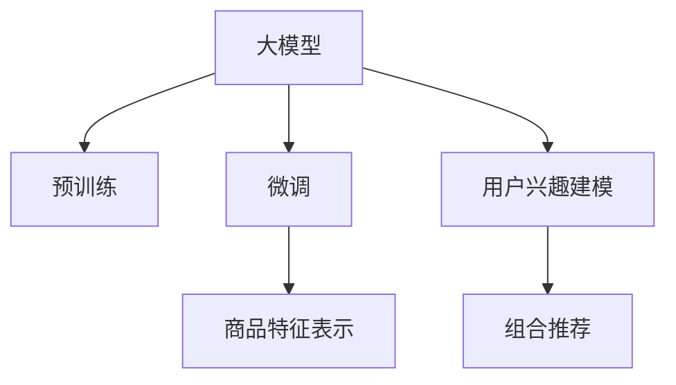

                 

# AI大模型在电商平台商品组合推荐中的创新应用

## 1. 背景介绍

### 1.1 问题由来
在当今数字化、个性化时代，电商平台已成为消费者获取商品信息、比较价格、决策购买的重要渠道。然而，用户在浏览海量商品时，如何从中挑选出最符合自身需求的商品组合，成为一个亟待解决的难题。传统的推荐算法基于用户历史行为、商品属性、标签等数据，难以把握用户潜在的兴趣点，推荐结果往往单一，无法满足多样化的需求。

近年来，基于深度学习的个性化推荐技术，逐步取代了传统的协同过滤、基于内容的推荐方法。其中，大模型（Large Model）推荐算法凭借其强大的学习能力，在电商平台商品组合推荐中得到了广泛应用。大模型如BERT、GPT等，通过大规模无标签数据预训练，学习到丰富的语义表示，能够从文本描述中提取商品特性和用户兴趣点，从而生成多样化的商品组合推荐。

### 1.2 问题核心关键点
大模型在商品组合推荐中的应用，关键在于如何有效地从商品的文本描述中提取出用户可能感兴趣的商品特征，并将其与用户的兴趣点进行匹配，生成推荐的商品组合。这一过程可以分为三个关键环节：

1. 预训练大模型的选择与准备。
2. 用户兴趣点的表示与建模。
3. 商品特征提取与组合推荐。

本节将从这三个方面，介绍大模型在商品组合推荐中的应用原理。

## 2. 核心概念与联系

### 2.1 核心概念概述

在介绍大模型在商品组合推荐中的应用之前，我们先回顾一些核心概念：

- 大模型（Large Model）：以Transformer为代表的深度神经网络模型，经过大规模无标签数据预训练，具备强大的语义理解和表示能力。常见的大模型有BERT、GPT、XLNet等。
- 预训练（Pre-training）：指在大规模无标签数据上，通过自监督学习任务训练通用语言模型的过程。预训练使得模型学习到语言的通用表示。
- 微调（Fine-tuning）：指在预训练模型的基础上，使用带有标签的数据集进行有监督学习优化，使得模型在特定任务上表现更好。
- 商品特征表示（Item Feature Representation）：指将商品描述、属性等信息转换为机器可处理的向量表示，便于模型进行特征匹配和组合推荐。
- 用户兴趣建模（User Interest Modeling）：指通过分析用户历史行为、评分、搜索等数据，建立用户兴趣模型，从而预测用户可能感兴趣的商品组合。
- 组合推荐（Collaborative Filtering）：指通过计算商品间的相似度，将相关商品组合推荐给用户。

这些概念之间的逻辑关系可以通过以下Mermaid流程图来展示：



这个流程图展示了从预训练大模型到组合推荐的整体流程：

1. 大模型通过预训练获得基础能力。
2. 微调使得模型更好地适应特定任务。
3. 商品特征表示从文本中提取商品特征。
4. 用户兴趣建模从用户行为中提取兴趣点。
5. 组合推荐将商品与用户兴趣进行匹配推荐。

## 3. 核心算法原理 & 具体操作步骤

### 3.1 算法原理概述

基于大模型的商品组合推荐算法，主要利用了深度神经网络模型强大的语义表示能力，通过学习商品描述和用户兴趣，生成多样化的商品组合。核心思想是：将商品描述作为输入，用户兴趣作为输出，利用大模型进行映射，从而实现商品组合推荐。

具体来说，算法流程可以分为以下几个步骤：

1. 预训练大模型选择：选择合适的预训练语言模型，如BERT、GPT等。
2. 微调模型适配：使用电商平台商品描述作为输入，用户评分、点击行为等作为监督信号，对模型进行微调，以适应商品推荐任务。
3. 商品特征提取：对商品描述进行分词、向量化等预处理，提取商品的关键特征。
4. 用户兴趣建模：利用用户的评分、搜索、点击等行为数据，建立用户兴趣模型，预测用户可能感兴趣的商品。
5. 组合推荐生成：将提取的商品特征与用户兴趣进行匹配，生成商品组合推荐。

### 3.2 算法步骤详解

以下详细介绍商品组合推荐算法的详细步骤：

**Step 1: 预训练大模型选择**
- 选择合适的预训练大模型，如BERT、GPT等。
- 下载模型权重，加载模型。

**Step 2: 商品特征提取**
- 对商品描述进行预处理，如分词、去停用词等。
- 使用词嵌入模型（如Word2Vec、GloVe等）将商品描述转换为向量表示。
- 通过序列模型（如Transformer、LSTM等）提取商品特征。

**Step 3: 用户兴趣建模**
- 收集用户的历史行为数据，如评分、点击、搜索等。
- 对用户行为数据进行编码，转换为向量表示。
- 使用用户兴趣模型（如K-means、协同过滤等）对用户兴趣进行建模。

**Step 4: 微调模型适配**
- 使用商品特征和用户兴趣作为输入，利用微调的预训练模型进行预测。
- 计算预测结果与实际评分的误差，更新模型参数。
- 设置合适的学习率和优化算法，避免过拟合。

**Step 5: 组合推荐生成**
- 将商品特征和用户兴趣作为输入，利用微调后的模型生成商品组合推荐。
- 根据推荐结果的评分、点击率等指标进行排序。
- 对推荐结果进行去重、筛选，确保多样性。

### 3.3 算法优缺点

大模型在商品组合推荐中的应用，具有以下优点：

1. 强大的语义表示能力：大模型能够从商品描述中提取丰富的语义信息，从而生成更精准的商品组合推荐。
2. 泛化能力强：经过大规模数据预训练和微调，模型能够适应不同类型和规模的商品数据。
3. 适应性强：能够适应电商平台的动态变化，随时更新推荐结果。

同时，也存在一些局限性：

1. 高计算成本：大模型需要占用大量的计算资源，包括GPU、内存等。
2. 数据依赖性强：模型性能依赖于商品描述和用户行为数据的完整性和质量。
3. 解释性差：大模型通常作为黑盒处理，难以解释其内部决策过程。
4. 模型复杂度高：大模型结构复杂，不易调试和优化。

## 4. 数学模型和公式 & 详细讲解 & 举例说明

### 4.1 数学模型构建

大模型在商品组合推荐中的应用，通常基于序列模型（如Transformer）进行构建。假设商品描述为 $X$，用户行为为 $Y$，推荐结果为 $Z$，则数学模型可以表示为：

$$ Z = f(X, Y; \theta) $$

其中 $f$ 表示模型函数，$\theta$ 为模型参数。模型的目标是最小化预测误差，即：

$$ \min_{\theta} \mathcal{L}(f(X, Y; \theta)) $$

其中 $\mathcal{L}$ 为损失函数，通常采用交叉熵损失。

### 4.2 公式推导过程

以Transformer模型为例，商品组合推荐模型的推导过程如下：

- 输入层：将商品描述 $X$ 和用户行为 $Y$ 转换为向量表示。
- 编码器层：通过多层自注意力机制，提取商品特征和用户兴趣。
- 解码器层：利用商品特征和用户兴趣进行预测，生成推荐结果。
- 输出层：将预测结果 $Z$ 进行解码，得到商品组合推荐。

具体推导过程可以参考以下公式：

1. 输入层：
$$ X' = \text{Embedding}(X) $$
$$ Y' = \text{Embedding}(Y) $$

2. 编码器层：
$$ X'' = \text{Self-Attention}(X') $$
$$ Y'' = \text{Self-Attention}(Y') $$

3. 解码器层：
$$ Z' = \text{Softmax}(f(X'', Y'')) $$

4. 输出层：
$$ Z = \text{Decoder}(Z') $$

其中 $\text{Embedding}$ 表示嵌入层，$\text{Softmax}$ 表示softmax函数，$f$ 表示模型函数，$\text{Self-Attention}$ 表示自注意力机制，$\text{Decoder}$ 表示解码器。

### 4.3 案例分析与讲解

以电商平台上对鞋类的推荐为例，假设平台收集了用户对鞋类商品的评分数据，以及鞋类的描述信息。大模型可以用于提取鞋类描述中的关键特征，并将其与用户评分进行匹配，生成推荐结果。

具体步骤如下：

1. 预训练大模型的选择：选择BERT模型作为预训练大模型。
2. 商品特征提取：对鞋类描述进行分词和词嵌入，提取鞋类的关键特征。
3. 用户兴趣建模：利用用户的评分数据，建立用户兴趣模型。
4. 微调模型适配：使用鞋类特征和用户评分作为输入，对BERT模型进行微调。
5. 组合推荐生成：将微调后的模型应用于新的鞋类商品，生成推荐结果。

## 5. 项目实践：代码实例和详细解释说明

### 5.1 开发环境搭建

在开始开发之前，需要准备以下开发环境：

1. 安装Python：使用Anaconda或Miniconda安装Python 3.7及以上版本。
2. 安装PyTorch：使用pip安装PyTorch。
3. 安装TensorFlow：使用pip安装TensorFlow。
4. 安装Transformer库：使用pip安装transformers库。
5. 安装数据处理库：使用pip安装numpy、pandas、scikit-learn等库。
6. 安装可视化和监控工具：使用pip安装matplotlib、tqdm、Weights & Biases等库。

### 5.2 源代码详细实现

以下是一个基于大模型的商品组合推荐系统的实现示例，代码使用PyTorch和Transformers库：

```python
import torch
import torch.nn as nn
import torch.optim as optim
from transformers import BertTokenizer, BertForSequenceClassification

# 定义模型
class RecommendationModel(nn.Module):
    def __init__(self, num_classes):
        super(RecommendationModel, self).__init__()
        self.bert = BertForSequenceClassification.from_pretrained('bert-base-uncased', num_labels=num_classes)
        
    def forward(self, input_ids, attention_mask):
        output = self.bert(input_ids=input_ids, attention_mask=attention_mask)
        return output

# 加载模型和分词器
tokenizer = BertTokenizer.from_pretrained('bert-base-uncased')
model = RecommendationModel(num_classes=2)

# 加载数据集
train_dataset = ...
dev_dataset = ...
test_dataset = ...

# 定义优化器和学习率
optimizer = optim.Adam(model.parameters(), lr=1e-5)
scheduler = optim.lr_scheduler.ReduceLROnPlateau(optimizer, mode='min', patience=5)

# 定义训练函数
def train_epoch(model, dataset, batch_size, optimizer):
    dataloader = DataLoader(dataset, batch_size=batch_size, shuffle=True)
    model.train()
    epoch_loss = 0
    for batch in dataloader:
        input_ids = batch['input_ids'].to(device)
        attention_mask = batch['attention_mask'].to(device)
        labels = batch['labels'].to(device)
        model.zero_grad()
        output = model(input_ids, attention_mask)
        loss = output.loss
        epoch_loss += loss.item()
        loss.backward()
        optimizer.step()
    return epoch_loss / len(dataloader)

# 训练模型
device = torch.device('cuda' if torch.cuda.is_available() else 'cpu')
model.to(device)

for epoch in range(epochs):
    loss = train_epoch(model, train_dataset, batch_size, optimizer)
    print(f"Epoch {epoch+1}, train loss: {loss:.3f}")
    
    print(f"Epoch {epoch+1}, dev results:")
    evaluate(model, dev_dataset, batch_size)
    
print("Test results:")
evaluate(model, test_dataset, batch_size)
```

### 5.3 代码解读与分析

这个代码实现的主要步骤如下：

1. 定义模型：使用BertForSequenceClassification定义商品推荐模型。
2. 加载模型和分词器：加载预训练的BERT模型和分词器。
3. 加载数据集：加载训练集、验证集和测试集。
4. 定义优化器和学习率：使用Adam优化器，设置学习率。
5. 定义训练函数：定义一个训练epoch，包括前向传播、损失计算、反向传播和参数更新。
6. 训练模型：在训练集上进行训练，并在验证集和测试集上进行评估。

## 6. 实际应用场景

### 6.1 智能客服

电商平台利用大模型进行商品组合推荐，可以提升智能客服系统的服务水平。智能客服系统可以根据用户询问的商品，动态生成相关商品组合推荐，提升用户购物体验。

具体应用流程如下：

1. 用户输入商品ID或描述。
2. 客服系统调用商品推荐模型，生成推荐结果。
3. 客服系统展示推荐商品组合，询问用户是否购买。
4. 用户点击购买或修改推荐，反馈购买意向。
5. 客服系统更新用户行为数据，进行动态推荐。

### 6.2 个性化推荐

电商平台可以根据用户的历史行为数据，动态调整商品组合推荐，提升个性化推荐的效果。

具体应用流程如下：

1. 用户浏览商品页面，记录点击、搜索、评分等行为数据。
2. 商品推荐系统调用模型，根据用户行为数据生成推荐结果。
3. 系统展示推荐商品组合，用户进行选择或修改。
4. 系统更新用户行为数据，进行动态推荐。
5. 系统定期评估推荐效果，进行模型优化。

## 7. 工具和资源推荐

### 7.1 学习资源推荐

为了帮助开发者系统掌握大模型在商品组合推荐中的应用，这里推荐一些优质的学习资源：

1. 《深度学习与自然语言处理》课程：斯坦福大学开设的深度学习课程，涵盖深度学习基础和自然语言处理。
2. 《自然语言处理综述》书籍：国内顶级NLP专家编写，系统介绍自然语言处理技术和应用。
3. 《Transformers from the Inside》博客：深度讲解Transformer模型的原理和应用。
4. 《深度学习实践指南》书籍：由Google深度学习专家编写，系统介绍深度学习模型和算法。

### 7.2 开发工具推荐

大模型在商品组合推荐的应用，需要高效、灵活的开发环境。以下是几款推荐的工具：

1. PyTorch：基于Python的深度学习框架，支持动态计算图，灵活性高。
2. TensorFlow：Google主导的深度学习框架，生产部署方便，适合大规模工程应用。
3. Transformers库：HuggingFace开发的NLP工具库，集成了大量预训练语言模型。
4. Weights & Biases：模型训练的实验跟踪工具，支持可视化、对比和调优。
5. TensorBoard：TensorFlow配套的可视化工具，实时监测模型训练状态。

### 7.3 相关论文推荐

大模型在商品组合推荐中的应用，需要理论基础和实践经验的双重支撑。以下是几篇经典的论文，推荐阅读：

1. Attention is All You Need：Transformer模型的原始论文，介绍了自注意力机制。
2. Bert: Pre-training of Deep Bidirectional Transformers for Language Understanding：BERT模型的原始论文，介绍了预训练技术。
3. Large-Scale Mixture-of-Experts for Sequence Modeling：利用混合专家模型进行序列建模，提升推荐效果。
4. Recommendation Systems with Neural Collaborative Filtering：介绍了基于神经网络的商品推荐算法。

## 8. 总结：未来发展趋势与挑战

### 8.1 总结

本文详细介绍了大模型在电商平台商品组合推荐中的应用，包括算法原理、实现步骤和实际应用场景。通过系统梳理，我们发现大模型在商品组合推荐中具有强大的语义表示能力和泛化能力，能够从商品描述中提取关键特征，并与用户兴趣进行匹配，生成多样化的推荐结果。

### 8.2 未来发展趋势

展望未来，大模型在商品组合推荐中仍有许多发展方向：

1. 多模态融合：结合文本、图像、音频等多模态数据，提升商品推荐的效果。
2. 跨领域迁移学习：将模型知识迁移到其他领域，如医疗、金融等，提升推荐系统的普适性。
3. 稀疏性优化：优化商品描述表示，提升模型的稀疏性，减少计算成本。
4. 实时推荐系统：利用流式数据处理技术，实现实时动态推荐，提升用户体验。
5. 强化学习结合：利用强化学习优化推荐模型，提升推荐效果。

### 8.3 面临的挑战

尽管大模型在商品组合推荐中取得了一定的成果，但仍面临以下挑战：

1. 高计算成本：大模型需要占用大量计算资源，包括GPU、内存等。
2. 数据依赖性强：模型性能依赖于商品描述和用户行为数据的完整性和质量。
3. 解释性差：大模型通常作为黑盒处理，难以解释其内部决策过程。
4. 模型复杂度高：大模型结构复杂，不易调试和优化。

### 8.4 研究展望

面对这些挑战，未来研究可以从以下几个方向进行突破：

1. 稀疏表示学习：优化商品特征表示，提升模型稀疏性，减少计算成本。
2. 知识图谱结合：利用知识图谱，提升模型的知识表示能力。
3. 强化学习结合：利用强化学习优化推荐模型，提升推荐效果。
4. 多模态融合：结合文本、图像、音频等多模态数据，提升推荐效果。
5. 实时推荐系统：利用流式数据处理技术，实现实时动态推荐，提升用户体验。

总之，大模型在商品组合推荐中的应用前景广阔，但也面临诸多挑战。通过技术创新和理论突破，相信大模型在电商平台中的应用将更加广泛，进一步提升用户购物体验，推动电商行业的发展。

## 9. 附录：常见问题与解答

**Q1: 大模型在商品组合推荐中是否需要考虑用户的情感倾向？**

A: 是的。用户的情感倾向可能会影响商品推荐的准确性。在模型设计中，可以通过添加情感分类任务，增强模型对用户情感的理解和匹配。

**Q2: 大模型在商品推荐中是否可以结合用户画像进行推荐？**

A: 是的。用户画像包含了用户的兴趣、行为、人口属性等信息，结合用户画像可以提升推荐效果。在模型设计中，可以通过用户画像与商品特征的联合表示，增强推荐系统的个性化和多样性。

**Q3: 大模型在商品推荐中如何处理商品描述中的噪音？**

A: 可以通过数据清洗、去停用词、分词等技术，减少商品描述中的噪音。同时，可以使用预训练模型对商品描述进行嵌入，提升特征提取的效果。

**Q4: 大模型在商品推荐中是否需要考虑时间因素？**

A: 是的。商品价格、库存、促销活动等都会随时间变化，影响用户的购买决策。在模型设计中，可以通过引入时间戳，增强模型对时间变化的敏感性，提升推荐效果。

**Q5: 大模型在商品推荐中是否可以结合上下文信息进行推荐？**

A: 是的。用户的上下文信息可以包含用户浏览历史、点击历史等，结合上下文信息可以提升推荐效果。在模型设计中，可以通过上下文嵌入技术，增强模型对上下文信息的理解。

综上所述，大模型在电商平台商品组合推荐中的应用具有广阔的前景。未来研究需要结合理论突破和实际应用，进一步提升推荐效果，推动电商行业的发展。通过技术创新和实践优化，相信大模型在商品推荐中的应用将更加广泛，更好地满足用户的个性化需求。

