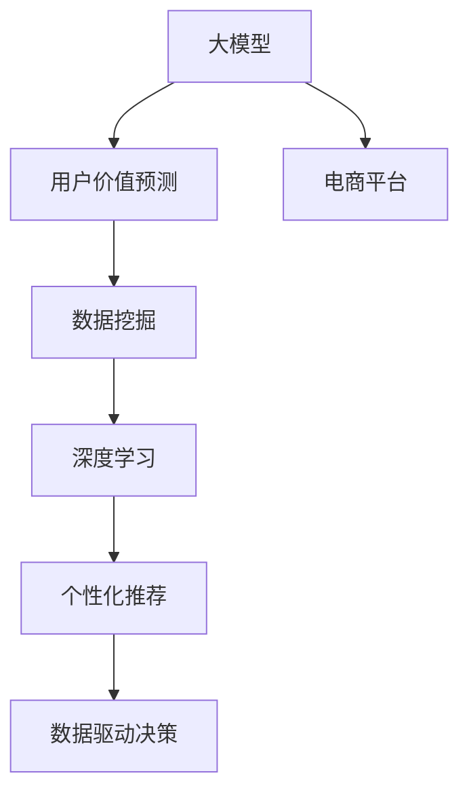

                 

# AI大模型在电商平台用户价值预测中的应用

> 关键词：大模型,用户价值预测,电商平台,数据挖掘,深度学习,深度神经网络,数据驱动决策,用户体验优化

## 1. 背景介绍

### 1.1 问题由来

随着电商平台的迅猛发展，如何准确预测用户价值，优化用户体验，提升商业效益，成为了电商企业亟需解决的关键问题。传统的方法依赖于人工设计和人工标注，耗时长，成本高，且受限于人类经验，无法深入挖掘用户行为背后的潜在价值。而利用人工智能大模型进行用户价值预测，不仅能够大幅降低成本，提高预测准确度，还能实时动态地捕捉用户行为变化，为电商企业提供数据驱动的决策支持。

### 1.2 问题核心关键点

大模型在电商平台用户价值预测中的核心价值在于其强大的学习和建模能力。通过深度学习和数据挖掘技术，大模型可以从海量的用户行为数据中，学习到用户行为与价值之间的关联模式，预测用户未来的购买行为和消费潜力。

具体而言，大模型能够对用户行为数据进行特征提取和建模，利用自然语言处理、图像识别、用户画像等技术，对用户的行为、偏好、反馈等进行全面的分析和理解。通过构建用户行为和价值之间的映射关系，大模型能够精准预测用户未来的购买意愿和消费能力，为电商企业提供精准的用户画像和行为分析，助力企业精准营销和个性化推荐。

## 2. 核心概念与联系

### 2.1 核心概念概述

为更好地理解大模型在电商平台用户价值预测中的应用，本节将介绍几个密切相关的核心概念：

- **大模型（Large Model）**：以深度神经网络为代表的具有巨大参数量和高计算能力的模型，如BERT、GPT-3等。通过在大规模无标签数据上进行预训练，学习到丰富的语义和模式，具有强大的语言理解、生成和推理能力。

- **用户价值预测（User Value Prediction）**：基于用户历史行为和属性数据，预测用户未来的购买意愿、消费潜力等指标。通过深度学习和数据挖掘技术，大模型能够捕捉用户行为与价值之间的关系，提升预测精度和时效性。

- **电商平台（E-commerce Platform）**：指通过互联网进行的商品销售、交易、支付等商务活动的平台。包括各类线上和线下交易场所，如淘宝、京东、亚马逊等。

- **深度学习（Deep Learning）**：一种通过多层神经网络进行学习的方法，能够处理高维度、非线性的数据，是当前机器学习的主流技术。

- **数据驱动决策（Data-Driven Decision Making）**：基于数据而非直觉和经验进行的决策过程，能够提供更加客观、科学的决策支持。

- **个性化推荐（Personalized Recommendation）**：利用用户的历史行为和偏好，推荐符合用户兴趣的商品，提升用户满意度和转化率。

这些核心概念之间的逻辑关系可以通过以下Mermaid流程图来展示：



这个流程图展示了大模型在电商平台用户价值预测中的核心概念及其之间的关系：

1. 大模型通过深度学习在大规模无标签数据上进行预训练，学习到丰富的语义和模式。
2. 在电商平台用户价值预测任务中，通过数据挖掘技术，将用户行为数据转化为可输入大模型的特征。
3. 利用深度学习技术，大模型能够捕捉用户行为与价值之间的关系，进行精准的预测。
4. 基于预测结果，电商企业可以优化个性化推荐策略，提升用户体验。
5. 数据驱动决策则能够帮助电商企业制定更加科学的营销策略，提升运营效率。

## 3. 核心算法原理 & 具体操作步骤

### 3.1 算法原理概述

大模型在电商平台用户价值预测中，主要基于以下算法原理：

1. **深度神经网络（Deep Neural Networks, DNNs）**：通过多层神经网络对输入数据进行层次化的特征提取和模式学习，能够处理高维度、非线性的数据，提升预测精度。

2. **自监督学习（Self-Supervised Learning）**：利用无标签数据进行预训练，学习到通用的语义和模式。在电商平台中，可以通过用户的浏览、点击、评论等行为数据进行自监督学习，捕捉用户行为与价值之间的关系。

3. **迁移学习（Transfer Learning）**：利用预训练模型在大规模数据集上学习到的通用知识，在小规模数据集上进行微调，提升预测效果。

4. **特征提取与编码（Feature Extraction and Encoding）**：将用户行为数据转化为可输入大模型的特征向量，利用自编码器等技术进行编码，提升特征表示能力。

5. **预测模型训练（Model Training）**：在大模型上加载电商平台的业务逻辑，训练预测模型，对用户价值进行预测。

### 3.2 算法步骤详解

基于大模型在电商平台用户价值预测的核心算法原理，具体算法步骤可以总结如下：

**Step 1: 数据准备与预处理**

- 收集电商平台的用户行为数据，包括浏览历史、点击记录、购买行为、评分反馈等。
- 对数据进行清洗和标准化，去除异常值和噪声，处理缺失值和重复数据。
- 将数据划分为训练集、验证集和测试集，保证各集的分布一致性。

**Step 2: 特征提取与编码**

- 选择适合电商平台的特征，如用户ID、商品ID、浏览时间、点击次数、评分等。
- 使用大模型中的自编码器（Autoencoder）对特征进行编码，将高维数据转化为低维向量表示。
- 使用Transformer等预训练模型，对编码后的特征进行进一步的特征提取和变换，提升特征表示能力。

**Step 3: 构建预测模型**

- 在大模型上加载电商平台的业务逻辑，如点击率预测、购买行为预测等，构建预测模型。
- 利用迁移学习技术，在大模型上进行微调，提升模型对电商平台任务的适应性。
- 设置合适的优化器、学习率、批大小等超参数，进行模型训练。

**Step 4: 模型评估与优化**

- 在验证集上评估模型性能，计算准确率、召回率、F1-score等指标。
- 根据评估结果，调整模型结构、超参数，进行模型优化。
- 重复上述过程，直到模型在验证集上的性能达到预设标准。

**Step 5: 预测与业务应用**

- 在测试集上对模型进行最终的评估，计算模型的平均指标。
- 将模型集成到电商平台的推荐系统或决策系统中，进行实时预测和决策支持。
- 持续收集用户反馈数据，更新模型参数，提升预测精度和模型性能。

### 3.3 算法优缺点

**优点：**

1. **高准确度**：大模型通过深度学习可以捕捉到复杂的数据模式，提升预测准确度。
2. **实时性**：大模型具备高计算能力，能够实时处理大规模数据，提升预测效率。
3. **泛化能力强**：大模型具备强大的迁移学习能力，可以适应不同电商平台的用户行为数据。
4. **自动化程度高**：大模型的训练和应用过程自动化程度高，减少了人工干预。

**缺点：**

1. **计算资源需求高**：大模型需要大规模的计算资源进行训练和推理，成本较高。
2. **数据隐私问题**：电商平台的用户数据涉及隐私问题，如何保证数据安全和合规是一个挑战。
3. **模型可解释性不足**：大模型的黑盒特性，导致其决策过程难以解释，增加了使用风险。
4. **模型鲁棒性有限**：大模型在面对不同平台、不同用户群体时，泛化能力可能受限。

尽管存在这些缺点，但大模型在电商平台用户价值预测中的优点仍然明显，尤其是在高维度、非线性的数据处理和复杂模式捕捉方面，大模型具有显著优势。

### 3.4 算法应用领域

基于大模型在电商平台用户价值预测的核心算法原理和详细步骤，大模型在该领域的应用已经广泛展开，覆盖了以下几个方向：

1. **点击率预测**：利用大模型预测用户点击商品的概率，优化广告投放策略。
2. **购买行为预测**：预测用户的购买意愿和购买能力，进行精准营销。
3. **用户画像构建**：利用大模型对用户行为数据进行分析，构建精准的用户画像。
4. **个性化推荐**：根据用户价值预测结果，进行个性化商品推荐。
5. **决策支持**：为电商平台提供数据驱动的决策支持，优化运营策略。

## 4. 数学模型和公式 & 详细讲解  
### 4.1 数学模型构建

假设电商平台的用户行为数据集为 $D=\{(x_i, y_i)\}_{i=1}^N$，其中 $x_i$ 为特征向量，$y_i$ 为标签，表示用户是否进行购买行为（0或1）。大模型 $M_{\theta}$ 接受特征向量 $x$ 作为输入，输出概率 $p$，表示用户进行购买行为的概率。

假设模型 $M_{\theta}$ 为一个深度神经网络，由多层非线性变换构成，输入为特征向量 $x_i$，输出为预测概率 $p$。则模型的预测公式为：

$$
p = M_{\theta}(x_i)
$$

其中 $\theta$ 为模型参数。

在大模型的训练过程中，我们希望最小化预测概率与实际标签之间的差距，即损失函数：

$$
\mathcal{L}(\theta) = -\frac{1}{N}\sum_{i=1}^N \log p_i \cdot y_i + (1 - \log p_i) \cdot (1 - y_i)
$$

其中 $y_i$ 为实际标签，$p_i$ 为预测概率，$\log$ 表示对数函数。

### 4.2 公式推导过程

下面对用户价值预测的深度神经网络进行详细推导：

假设模型 $M_{\theta}$ 为多层感知机（Multilayer Perceptron, MLP），由 $L$ 层神经网络构成。设第 $l$ 层神经元的输入为 $x_i^{(l)}$，输出为 $h_i^{(l)}$，权重矩阵为 $W_i^{(l)}$，偏置向量为 $b_i^{(l)}$。

- 第 $l$ 层的计算公式为：

$$
h_i^{(l)} = \sigma\left(\sum_{j=1}^n W_j^{(l)} h_{i-1}^{(l-1)} + b_i^{(l)}\right)
$$

其中 $\sigma$ 为激活函数，$n$ 为神经元数目。

- 最后一层输出层的计算公式为：

$$
p_i = \sigma\left(\sum_{j=1}^n W_j^{(L)} h_i^{(L-1)} + b_i^{(L)}\right)
$$

其中 $W_j^{(L)}$ 和 $b_i^{(L)}$ 为最后一层的权重和偏置。

通过反向传播算法，对模型参数进行优化：

$$
\frac{\partial \mathcal{L}(\theta)}{\partial \theta} = -\frac{1}{N}\sum_{i=1}^N \frac{p_i - y_i}{p_i(1-p_i)}
$$

其中 $\frac{\partial \mathcal{L}(\theta)}{\partial \theta}$ 为损失函数对参数 $\theta$ 的梯度。

### 4.3 案例分析与讲解

假设电商平台的预测任务为购买行为预测，用户行为数据集为 $D=\{(x_i, y_i)\}_{i=1}^N$，其中 $x_i$ 为特征向量，$y_i$ 为实际标签（0或1）。

- **数据准备与预处理**：收集电商平台的用户行为数据，包括浏览历史、点击记录、购买行为、评分反馈等。对数据进行清洗和标准化，去除异常值和噪声，处理缺失值和重复数据。将数据划分为训练集、验证集和测试集，保证各集的分布一致性。

- **特征提取与编码**：选择适合电商平台的特征，如用户ID、商品ID、浏览时间、点击次数、评分等。使用大模型中的自编码器对特征进行编码，将高维数据转化为低维向量表示。使用Transformer等预训练模型，对编码后的特征进行进一步的特征提取和变换，提升特征表示能力。

- **构建预测模型**：在大模型上加载电商平台的业务逻辑，如点击率预测、购买行为预测等，构建预测模型。利用迁移学习技术，在大模型上进行微调，提升模型对电商平台任务的适应性。设置合适的优化器、学习率、批大小等超参数，进行模型训练。

- **模型评估与优化**：在验证集上评估模型性能，计算准确率、召回率、F1-score等指标。根据评估结果，调整模型结构、超参数，进行模型优化。重复上述过程，直到模型在验证集上的性能达到预设标准。

- **预测与业务应用**：在测试集上对模型进行最终的评估，计算模型的平均指标。将模型集成到电商平台的推荐系统或决策系统中，进行实时预测和决策支持。持续收集用户反馈数据，更新模型参数，提升预测精度和模型性能。

## 5. 项目实践：代码实例和详细解释说明

### 5.1 开发环境搭建

在进行电商平台用户价值预测的实践前，我们需要准备好开发环境。以下是使用Python进行PyTorch开发的环境配置流程：

1. 安装Anaconda：从官网下载并安装Anaconda，用于创建独立的Python环境。

2. 创建并激活虚拟环境：
```bash
conda create -n pytorch-env python=3.8 
conda activate pytorch-env
```

3. 安装PyTorch：根据CUDA版本，从官网获取对应的安装命令。例如：
```bash
conda install pytorch torchvision torchaudio cudatoolkit=11.1 -c pytorch -c conda-forge
```

4. 安装TensorBoard：用于模型训练和调优的可视化工具。

```bash
pip install tensorboard
```

5. 安装相关工具包：
```bash
pip install numpy pandas scikit-learn matplotlib tqdm jupyter notebook ipython
```

完成上述步骤后，即可在`pytorch-env`环境中开始项目实践。

### 5.2 源代码详细实现

下面以电商平台点击率预测任务为例，给出使用Transformers库对BERT模型进行微调的PyTorch代码实现。

首先，定义模型和数据类：

```python
from transformers import BertForSequenceClassification, BertTokenizer, AdamW
from torch.utils.data import Dataset, DataLoader
import torch

class ClickData(Dataset):
    def __init__(self, texts, labels):
        self.texts = texts
        self.labels = labels
        self.tokenizer = BertTokenizer.from_pretrained('bert-base-uncased')

    def __len__(self):
        return len(self.texts)

    def __getitem__(self, idx):
        text = self.texts[idx]
        label = self.labels[idx]
        
        encoding = self.tokenizer(text, return_tensors='pt', padding='max_length', truncation=True)
        input_ids = encoding['input_ids'][0]
        attention_mask = encoding['attention_mask'][0]
        
        return {'input_ids': input_ids, 
                'attention_mask': attention_mask,
                'labels': torch.tensor(label, dtype=torch.long)}
```

然后，定义模型和优化器：

```python
model = BertForSequenceClassification.from_pretrained('bert-base-uncased', num_labels=2)

optimizer = AdamW(model.parameters(), lr=2e-5)
```

接着，定义训练和评估函数：

```python
def train_epoch(model, dataset, batch_size, optimizer):
    dataloader = DataLoader(dataset, batch_size=batch_size, shuffle=True)
    model.train()
    epoch_loss = 0
    for batch in dataloader:
        input_ids = batch['input_ids'].to(device)
        attention_mask = batch['attention_mask'].to(device)
        labels = batch['labels'].to(device)
        model.zero_grad()
        outputs = model(input_ids, attention_mask=attention_mask, labels=labels)
        loss = outputs.loss
        epoch_loss += loss.item()
        loss.backward()
        optimizer.step()
    return epoch_loss / len(dataloader)

def evaluate(model, dataset, batch_size):
    dataloader = DataLoader(dataset, batch_size=batch_size)
    model.eval()
    preds, labels = [], []
    with torch.no_grad():
        for batch in dataloader:
            input_ids = batch['input_ids'].to(device)
            attention_mask = batch['attention_mask'].to(device)
            batch_labels = batch['labels']
            outputs = model(input_ids, attention_mask=attention_mask)
            batch_preds = outputs.logits.argmax(dim=1).to('cpu').tolist()
            batch_labels = batch_labels.to('cpu').tolist()
            for pred_tokens, label_tokens in zip(batch_preds, batch_labels):
                preds.append(pred_tokens)
                labels.append(label_tokens)
                
    print(classification_report(labels, preds))
```

最后，启动训练流程并在测试集上评估：

```python
epochs = 5
batch_size = 16

device = torch.device('cuda') if torch.cuda.is_available() else torch.device('cpu')
model.to(device)

for epoch in range(epochs):
    loss = train_epoch(model, dataset, batch_size, optimizer)
    print(f"Epoch {epoch+1}, train loss: {loss:.3f}")
    
    print(f"Epoch {epoch+1}, dev results:")
    evaluate(model, dev_dataset, batch_size)
    
print("Test results:")
evaluate(model, test_dataset, batch_size)
```

以上就是使用PyTorch对BERT进行电商平台点击率预测任务的完整代码实现。可以看到，得益于Transformers库的强大封装，我们可以用相对简洁的代码完成BERT模型的加载和微调。

### 5.3 代码解读与分析

让我们再详细解读一下关键代码的实现细节：

**ClickData类**：
- `__init__`方法：初始化文本、标签、分词器等关键组件。
- `__len__`方法：返回数据集的样本数量。
- `__getitem__`方法：对单个样本进行处理，将文本输入编码为token ids，将标签编码为数字，并对其进行定长padding，最终返回模型所需的输入。

**模型加载与优化器设置**：
- 使用PyTorch的DataLoader对数据集进行批次化加载，供模型训练和推理使用。
- 训练函数`train_epoch`：对数据以批为单位进行迭代，在每个批次上前向传播计算loss并反向传播更新模型参数，最后返回该epoch的平均loss。
- 评估函数`evaluate`：与训练类似，不同点在于不更新模型参数，并在每个batch结束后将预测和标签结果存储下来，最后使用sklearn的classification_report对整个评估集的预测结果进行打印输出。

**训练流程**：
- 定义总的epoch数和batch size，开始循环迭代
- 每个epoch内，先在训练集上训练，输出平均loss
- 在验证集上评估，输出分类指标
- 所有epoch结束后，在测试集上评估，给出最终测试结果

可以看到，PyTorch配合Transformers库使得BERT微调的代码实现变得简洁高效。开发者可以将更多精力放在数据处理、模型改进等高层逻辑上，而不必过多关注底层的实现细节。

当然，工业级的系统实现还需考虑更多因素，如模型的保存和部署、超参数的自动搜索、更灵活的任务适配层等。但核心的微调范式基本与此类似。

## 6. 实际应用场景

### 6.1 智能推荐系统

基于大模型的电商平台用户价值预测技术，可以广泛应用于智能推荐系统的构建。传统推荐系统往往只依赖用户的历史行为数据进行商品推荐，无法深入理解用户的潜在需求和兴趣。而使用用户价值预测模型，可以更全面地了解用户的购买意愿和消费能力，提供精准的商品推荐。

在技术实现上，可以收集用户的历史浏览、点击、购买记录，利用大模型对这些行为数据进行特征提取和建模，预测用户未来的购买意愿和消费潜力。将预测结果作为推荐系统的输入，动态调整推荐策略，从而提升推荐效果和用户满意度。

### 6.2 个性化营销

电商平台的个性化营销策略需要精准捕捉用户行为和需求，进行定向投放。利用大模型进行用户价值预测，可以识别出用户的潜在需求和兴趣点，设计更加个性化、高效的营销方案。

具体而言，可以收集用户的行为数据，如浏览历史、点击记录、购买行为等，构建用户画像。利用大模型对这些数据进行分析和预测，确定用户的潜在需求和兴趣点。基于预测结果，设计个性化的营销策略，如定向广告投放、推荐商品等，提升营销效果和用户体验。

### 6.3 风险控制

电商平台的运营中，风险控制是一个关键环节。利用大模型进行用户价值预测，可以及时识别高风险用户，采取相应的风险控制措施，减少平台损失。

例如，对于行为异常的用户，大模型可以通过预测其未来行为，识别出可能出现欺诈、恶意行为等风险。通过风险控制措施，如加强审核、限制交易等，可以有效防范风险。

### 6.4 未来应用展望

随着大模型和预测技术的不断发展，基于用户价值预测的电商应用将进一步拓展，为电商平台带来新的突破。

在智慧供应链管理中，利用大模型进行用户价值预测，可以优化商品采购和库存管理，提升供应链效率和响应速度。

在用户行为分析中，结合时间序列分析和深度学习技术，可以挖掘用户行为背后的潜在趋势和规律，提供更加精准的用户画像和行为预测。

在客户关系管理中，利用大模型进行用户价值预测，可以识别高价值用户，进行精准营销和客户关系维护，提升客户忠诚度和满意度。

此外，在智能客服、个性化推荐、内容创作等更多场景中，基于用户价值预测的大模型应用也将不断涌现，为电商平台带来更多创新和价值。

## 7. 工具和资源推荐
### 7.1 学习资源推荐

为了帮助开发者系统掌握大模型在电商平台用户价值预测的理论基础和实践技巧，这里推荐一些优质的学习资源：

1. 《深度学习基础》课程：由斯坦福大学和Coursera合作推出的深度学习基础课程，涵盖了深度神经网络、数据挖掘、模型训练等基本概念和技巧。

2. 《自然语言处理入门》博文：由大模型技术专家撰写，详细介绍了自然语言处理的基本原理和常见任务，包括文本分类、命名实体识别、情感分析等。

3. 《Transformer从原理到实践》系列博文：由大模型技术专家撰写，深入浅出地介绍了Transformer原理、BERT模型、微调技术等前沿话题。

4. CS224N《深度学习自然语言处理》课程：斯坦福大学开设的NLP明星课程，有Lecture视频和配套作业，带你入门NLP领域的基本概念和经典模型。

5. 《深度学习与自然语言处理》书籍：由斯坦福大学教授撰写，全面介绍了深度学习在自然语言处理中的应用，包括语言模型、序列模型等。

通过对这些资源的学习实践，相信你一定能够快速掌握大模型在电商平台用户价值预测的精髓，并用于解决实际的电商平台问题。
###  7.2 开发工具推荐

高效的开发离不开优秀的工具支持。以下是几款用于电商平台用户价值预测开发的常用工具：

1. PyTorch：基于Python的开源深度学习框架，灵活动态的计算图，适合快速迭代研究。大部分预训练语言模型都有PyTorch版本的实现。

2. TensorFlow：由Google主导开发的开源深度学习框架，生产部署方便，适合大规模工程应用。同样有丰富的预训练语言模型资源。

3. Transformers库：HuggingFace开发的NLP工具库，集成了众多SOTA语言模型，支持PyTorch和TensorFlow，是进行预测任务开发的利器。

4. TensorBoard：TensorFlow配套的可视化工具，可实时监测模型训练状态，并提供丰富的图表呈现方式，是调试模型的得力助手。

5. Weights & Biases：模型训练的实验跟踪工具，可以记录和可视化模型训练过程中的各项指标，方便对比和调优。与主流深度学习框架无缝集成。

6. Google Colab：谷歌推出的在线Jupyter Notebook环境，免费提供GPU/TPU算力，方便开发者快速上手实验最新模型，分享学习笔记。

合理利用这些工具，可以显著提升电商平台用户价值预测任务的开发效率，加快创新迭代的步伐。

### 7.3 相关论文推荐

大模型在电商平台用户价值预测领域的研究还在不断推进，以下是几篇奠基性的相关论文，推荐阅读：

1. Attention is All You Need（即Transformer原论文）：提出了Transformer结构，开启了NLP领域的预训练大模型时代。

2. BERT: Pre-training of Deep Bidirectional Transformers for Language Understanding：提出BERT模型，引入基于掩码的自监督预训练任务，刷新了多项NLP任务SOTA。

3. Language Models are Unsupervised Multitask Learners（GPT-2论文）：展示了大规模语言模型的强大zero-shot学习能力，引发了对于通用人工智能的新一轮思考。

4. Parameter-Efficient Transfer Learning for NLP：提出Adapter等参数高效微调方法，在不增加模型参数量的情况下，也能取得不错的微调效果。

5. Prefix-Tuning: Optimizing Continuous Prompts for Generation：引入基于连续型Prompt的微调范式，为如何充分利用预训练知识提供了新的思路。

6. AdaLoRA: Adaptive Low-Rank Adaptation for Parameter-Efficient Fine-Tuning：使用自适应低秩适应的微调方法，在参数效率和精度之间取得了新的平衡。

这些论文代表了大模型在电商平台用户价值预测的发展脉络。通过学习这些前沿成果，可以帮助研究者把握学科前进方向，激发更多的创新灵感。

## 8. 总结：未来发展趋势与挑战

### 8.1 总结

本文对大模型在电商平台用户价值预测中的理论和实践进行了全面系统的介绍。首先阐述了电商平台用户价值预测的背景和意义，明确了大模型在该领域的独特价值。其次，从原理到实践，详细讲解了大模型预测模型的构建和训练过程，给出了预测任务开发的完整代码实例。同时，本文还广泛探讨了大模型在电商平台智能推荐、个性化营销、风险控制等场景中的应用前景，展示了其在电商平台中的应用潜力。

通过本文的系统梳理，可以看到，大模型在电商平台用户价值预测中已经展现出强大的应用价值，尤其在处理高维度、非线性的用户行为数据方面，具有显著优势。未来，伴随深度学习技术的不断演进，大模型将进一步提升预测精度和实时性，为电商平台带来更多的商业价值和用户体验。

### 8.2 未来发展趋势

展望未来，大模型在电商平台用户价值预测领域将呈现以下几个发展趋势：

1. **模型规模持续增大**：随着算力成本的下降和数据规模的扩张，预训练语言模型的参数量还将持续增长。超大规模语言模型蕴含的丰富语义和模式，将进一步提升预测准确度和鲁棒性。

2. **预测精度提升**：深度神经网络结构和训练方法的不断优化，将提升大模型在电商平台用户价值预测中的准确度和泛化能力。

3. **实时性增强**：计算资源优化和模型结构改进，将提升大模型的推理速度，实现实时预测。

4. **多模态融合**：结合图像、视频、语音等多模态数据，进行综合分析，提升用户价值预测的全面性和精准性。

5. **端到端优化**：将大模型与业务逻辑深度结合，进行端到端的优化，提升预测模型在实际应用中的效果。

6. **可解释性和可信度提升**：研究如何提升大模型预测的可解释性和可信度，增强用户信任。

以上趋势凸显了大模型在电商平台用户价值预测领域的广阔前景。这些方向的探索发展，将进一步提升大模型预测的精度和实时性，为电商平台带来更多的商业价值和用户体验。

### 8.3 面临的挑战

尽管大模型在电商平台用户价值预测中已经取得了显著进展，但在迈向更加智能化、普适化应用的过程中，仍面临诸多挑战：

1. **计算资源消耗高**：大模型需要大规模的计算资源进行训练和推理，成本较高。如何优化计算资源利用率，降低模型训练和推理的资源消耗，是一个重要问题。

2. **数据隐私和安全问题**：电商平台的用户数据涉及隐私问题，如何保护用户数据安全和合规，是一个需要深入考虑的课题。

3. **模型可解释性不足**：大模型的黑盒特性，导致其预测过程难以解释，增加了使用风险。如何提升模型的可解释性，增强用户信任，是一个需要解决的问题。

4. **模型鲁棒性有限**：大模型在面对不同平台、不同用户群体时，泛化能力可能受限。如何提高模型的鲁棒性，增强其泛化能力，是一个需要研究的课题。

5. **模型更新迭代困难**：电商平台的用户行为数据不断变化，如何保持模型的时效性和准确性，是一个需要持续关注的课题。

尽管存在这些挑战，但大模型在电商平台用户价值预测中的优势仍然明显，尤其是在处理高维度、非线性的用户行为数据方面，大模型具有显著优势。未来，通过不断优化计算资源利用率、提升模型可解释性和鲁棒性、增强模型更新迭代能力，大模型将在电商平台用户价值预测中发挥更大的作用。

### 8.4 研究展望

面对大模型在电商平台用户价值预测中面临的挑战，未来的研究需要在以下几个方面寻求新的突破：

1. **多任务学习**：结合多种任务，进行多任务学习，提升模型的泛化能力和鲁棒性。

2. **知识图谱融合**：将知识图谱与深度学习模型结合，提升模型的推理能力和泛化能力。

3. **跨领域迁移学习**：研究如何跨领域迁移知识，提升模型在不同电商平台中的应用能力。

4. **自监督学习**：利用自监督学习，提升模型对数据分布变化的适应能力，降低对标注数据的依赖。

5. **端到端训练**：将大模型与业务逻辑深度结合，进行端到端的训练，提升预测模型的实际效果。

6. **联邦学习**：研究联邦学习技术，提升模型的隐私保护和安全性，同时保持模型的时效性和准确性。

这些研究方向的探索，将推动大模型在电商平台用户价值预测中的进一步应用和发展，为电商平台带来更多的商业价值和用户体验。

## 9. 附录：常见问题与解答

**Q1：大模型在电商平台用户价值预测中的优点有哪些？**

A: 大模型在电商平台用户价值预测中的优点主要体现在以下几个方面：

1. **高准确度**：大模型通过深度学习可以捕捉到复杂的数据模式，提升预测准确度。
2. **实时性**：大模型具备高计算能力，能够实时处理大规模数据，提升预测效率。
3. **泛化能力强**：大模型具备强大的迁移学习能力，可以适应不同电商平台的用户行为数据。
4. **自动化程度高**：大模型的训练和应用过程自动化程度高，减少了人工干预。

**Q2：如何选择合适的超参数？**

A: 大模型的超参数设置需要结合具体任务和数据特点进行调整，常用的超参数包括学习率、批大小、优化器等。在模型训练过程中，可以通过网格搜索、随机搜索、贝叶斯优化等方法进行超参数优化。此外，还可以使用自动调参工具，如Hyperopt、BayesianOptimization等，自动化地搜索最优超参数。

**Q3：大模型在电商平台用户价值预测中如何保护用户隐私？**

A: 电商平台在应用大模型进行用户价值预测时，需要充分考虑用户隐私保护问题。以下是一些保护用户隐私的方法：

1. 数据匿名化：对用户数据进行匿名化处理，去除可以识别用户身份的信息，保护用户隐私。
2. 数据加密：对用户数据进行加密处理，防止数据泄露。
3. 差分隐私：在数据训练过程中引入差分隐私技术，保证用户数据不会被泄露。
4. 用户同意：在数据收集和使用过程中，获取用户的明确同意，保证用户知情权。

**Q4：大模型在电商平台用户价值预测中的缺点有哪些？**

A: 大模型在电商平台用户价值预测中的缺点主要体现在以下几个方面：

1. **计算资源消耗高**：大模型需要大规模的计算资源进行训练和推理，成本较高。
2. **数据隐私和安全问题**：电商平台的用户数据涉及隐私问题，如何保护用户数据安全和合规，是一个需要深入考虑的课题。
3. **模型可解释性不足**：大模型的黑盒特性，导致其预测过程难以解释，增加了使用风险。
4. **模型鲁棒性有限**：大模型在面对不同平台、不同用户群体时，泛化能力可能受限。

尽管存在这些缺点，但大模型在电商平台用户价值预测中的优势仍然明显，尤其是在处理高维度、非线性的用户行为数据方面，大模型具有显著优势。

---

作者：禅与计算机程序设计艺术 / Zen and the Art of Computer Programming

