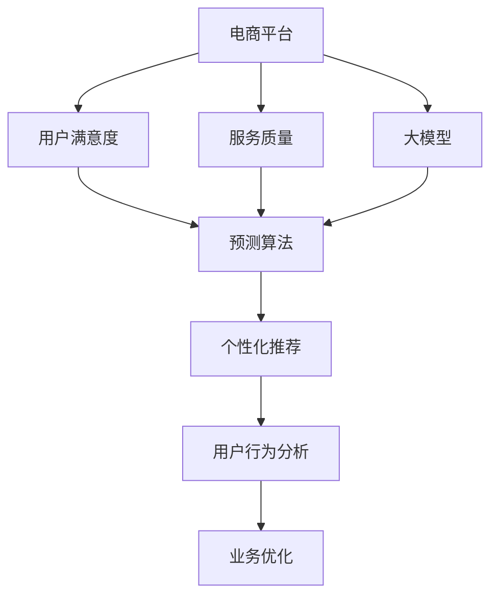

                 

# AI大模型在电商平台用户满意度预测与服务质量提升中的作用

> 关键词：电商平台,用户满意度,服务质量,大模型,预测算法,客户服务

## 1. 背景介绍

### 1.1 问题由来
随着电子商务的迅猛发展，电商平台已成为消费者购物的主要渠道之一。用户满意度的提升不仅关系到平台的用户留存率和品牌声誉，更是直接关联到企业的收益。然而，电商平台面临着用户基数庞大、需求多样、运营复杂等诸多挑战，如何有效预测用户满意度并提升服务质量，成为各大平台亟待解决的关键问题。

近年来，人工智能(AI)技术在电商领域逐渐普及，尤其在用户满意度预测和服务质量提升方面展现了巨大的潜力。尤其是大模型技术的发展，通过在海量数据上进行预训练，具备了强大的语言理解和生成能力，能够在电商平台的数据分析、情感分析、自然语言处理等任务中发挥重要作用。

### 1.2 问题核心关键点
大模型在电商平台的应用，主要体现在以下几个关键点：

- **用户满意度预测**：通过分析用户的评价、反馈和行为数据，预测用户的满意度评分，为平台优化运营策略提供数据支持。
- **服务质量提升**：基于用户满意度预测结果，对电商平台的客户服务进行改进，如优化客服响应速度、提升售后处理效率等，以提升整体服务质量。
- **个性化推荐**：利用大模型的多模态学习能力和深度表示能力，对用户进行更精准的画像分析，提升个性化推荐系统的准确性和用户体验。

本文将详细探讨大模型在电商平台用户满意度预测和服务质量提升中的应用，结合算法原理和项目实践，为电商平台提供可行的技术指导。

## 2. 核心概念与联系

### 2.1 核心概念概述

为更好地理解大模型在电商平台中的应用，本节将介绍几个密切相关的核心概念：

- **电商平台**：指通过互联网提供商品或服务交易的平台，如淘宝、京东、Amazon等。
- **用户满意度**：指用户对电商平台整体体验的主观评价，通常通过用户评分、评价、反馈等形式体现。
- **服务质量**：指电商平台提供服务的质量水平，包括客服响应时间、售后处理效率、物流配送速度等。
- **大模型**：指通过大规模预训练学习到的深度学习模型，如BERT、GPT-3、T5等，具备强大的自然语言理解和生成能力。
- **预测算法**：指用于预测用户满意度、服务质量等指标的算法模型，包括监督学习、半监督学习、迁移学习等。
- **个性化推荐**：指根据用户行为和偏好，推荐个性化商品或服务的系统，利用深度学习模型优化推荐算法。

这些核心概念之间的逻辑关系可以通过以下Mermaid流程图来展示：



这个流程图展示了大模型在电商平台中的应用链条：

1. 电商平台通过用户行为和评价数据，训练大模型预测用户满意度和服务质量。
2. 预测结果反馈到客户服务体系，指导服务质量的提升。
3. 同时，利用大模型进行个性化推荐，提升用户体验和转化率。

## 3. 核心算法原理 & 具体操作步骤
### 3.1 算法原理概述

大模型在电商平台用户满意度预测和服务质量提升中的应用，主要基于监督学习、迁移学习等算法框架。其核心思想是：

- 通过电商平台的大量用户行为和评价数据，训练一个大模型，使其能够自动学习用户满意度的关键特征。
- 利用训练好的大模型，预测新用户的行为和评价，评估服务质量，为平台提供优化建议。
- 结合个性化推荐系统，根据用户的历史行为和满意度预测结果，提供定制化的商品或服务推荐，提升用户满意度和平台转化率。

### 3.2 算法步骤详解

大模型在电商平台的应用主要包括以下几个关键步骤：

**Step 1: 数据收集与预处理**

- **数据收集**：从电商平台的订单、评价、反馈、客服记录等数据中，收集用户的满意度和服务质量相关信息。
- **数据预处理**：对数据进行清洗、去重、归一化等预处理操作，确保数据的准确性和一致性。

**Step 2: 特征提取与工程**

- **特征工程**：根据用户的满意度和服务质量指标，提取有意义的特征，如商品评分、服务响应时间、客服互动时长等。
- **特征工程**：对提取的特征进行编码、归一化等处理，以适应大模型的输入格式。

**Step 3: 模型训练与预测**

- **模型选择**：选择合适的预测模型，如线性回归、决策树、随机森林等，进行模型训练。
- **模型训练**：利用电商平台的历史数据，训练预测模型，得到模型参数。
- **模型预测**：对新用户的满意度和服务质量进行预测，输出预测结果。

**Step 4: 服务质量改进与推荐优化**

- **服务质量改进**：根据预测结果，分析用户的不满点，改进电商平台的服务质量，如优化客服响应时间、提升售后处理效率等。
- **推荐优化**：利用用户满意度预测结果，进行个性化推荐优化，提升推荐系统的准确性和用户体验。

### 3.3 算法优缺点

大模型在电商平台用户满意度预测与服务质量提升中的应用，具有以下优点：

- **高效性**：大模型能够快速处理大量的用户数据，通过简单的模型训练即可实现用户满意度的预测和服务质量的改进。
- **准确性**：通过大规模预训练学习，大模型具备强大的语言理解和生成能力，能够精确捕捉用户满意度和服务质量的关键特征。
- **可扩展性**：大模型可以在不同电商平台、不同场景下进行迁移学习，适应多变的业务需求。

同时，该方法也存在一定的局限性：

- **数据依赖**：大模型的性能很大程度上依赖于电商平台的历史数据，数据质量不高或数据量不足时，预测效果会大打折扣。
- **模型复杂性**：大模型的参数量巨大，训练和推理成本较高，需要高性能计算资源支持。
- **隐私风险**：电商平台用户数据的隐私保护是一个重要问题，大模型的应用需要考虑数据安全和隐私保护措施。

尽管存在这些局限性，但就目前而言，大模型在电商平台的应用范式仍然具有强大的生命力和广泛的应用前景。未来相关研究将进一步探索如何提高数据利用率、降低模型复杂度、加强数据隐私保护等方向，以提升用户体验和平台运营效率。

### 3.4 算法应用领域

大模型在电商平台的应用，主要体现在以下几个方面：

- **用户满意度预测**：通过分析用户的评价、反馈和行为数据，预测用户的满意度评分，为平台优化运营策略提供数据支持。
- **服务质量提升**：基于用户满意度预测结果，对电商平台的客户服务进行改进，如优化客服响应速度、提升售后处理效率等，以提升整体服务质量。
- **个性化推荐**：利用大模型的多模态学习能力和深度表示能力，对用户进行更精准的画像分析，提升个性化推荐系统的准确性和用户体验。
- **舆情分析**：通过分析电商平台的用户评论和反馈，进行情感分析和舆情监控，及时发现并处理用户投诉和负面评价，提升品牌形象。
- **智能客服**：结合自然语言处理技术，训练大模型进行智能客服对话，提升客户服务的智能化水平和用户体验。

这些应用领域不仅能够直接提升电商平台的运营效率和服务质量，还为平台带来了新的业务机会和创新点。

## 4. 数学模型和公式 & 详细讲解 & 举例说明

### 4.1 数学模型构建

本节将使用数学语言对大模型在电商平台用户满意度预测中的应用进行更加严格的刻画。

记电商平台的用户满意度为 $Y$，特征向量为 $\mathbf{x}$，假设 $Y$ 和 $\mathbf{x}$ 之间存在线性关系，即 $Y=f(\mathbf{x})$。设 $\mathbf{x}=[x_1, x_2, \ldots, x_n]$，$f(\mathbf{x})=\mathbf{w}^T\mathbf{x}+b$，其中 $\mathbf{w}$ 为模型权重向量，$b$ 为偏置项。

假设我们收集了 $N$ 个历史用户行为数据 $D=\{(\mathbf{x}_i, Y_i)\}_{i=1}^N$，则损失函数为：

$$
\mathcal{L}(\mathbf{w}, b) = \frac{1}{N} \sum_{i=1}^N (Y_i - f(\mathbf{x}_i))^2
$$

最小化损失函数得到模型参数 $\mathbf{w}$ 和 $b$，即可用于预测新用户的行为。

### 4.2 公式推导过程

以下我们以线性回归为例，推导用户满意度预测模型的公式及其梯度计算。

假设模型 $f(\mathbf{x})=\mathbf{w}^T\mathbf{x}+b$，损失函数为：

$$
\mathcal{L}(\mathbf{w}, b) = \frac{1}{N} \sum_{i=1}^N (Y_i - f(\mathbf{x}_i))^2
$$

对 $\mathbf{w}$ 和 $b$ 求偏导，得：

$$
\frac{\partial \mathcal{L}}{\partial \mathbf{w}} = \frac{2}{N} \sum_{i=1}^N (Y_i - f(\mathbf{x}_i))\mathbf{x}_i
$$

$$
\frac{\partial \mathcal{L}}{\partial b} = \frac{2}{N} \sum_{i=1}^N (Y_i - f(\mathbf{x}_i))
$$

根据梯度下降算法，更新模型参数：

$$
\mathbf{w} \leftarrow \mathbf{w} - \eta \frac{\partial \mathcal{L}}{\partial \mathbf{w}}
$$

$$
b \leftarrow b - \eta \frac{\partial \mathcal{L}}{\partial b}
$$

其中 $\eta$ 为学习率。

### 4.3 案例分析与讲解

假设我们收集了电商平台的历史订单数据，包含用户评分、商品评价、客服互动时长等特征，目标是预测新用户的满意度评分。

首先，我们对数据进行预处理，将评分转化为数值化评分，对文本数据进行分词编码。然后，利用线性回归模型进行训练，得到模型参数 $\mathbf{w}$ 和 $b$。最后，对新用户的评分、评价和客服互动时长等特征进行编码，输入模型得到预测结果。

假设模型预测某用户满意度评分为 $Y_{\text{pred}}$，实际评分为 $Y_{\text{true}}$，则损失函数为：

$$
\mathcal{L}(Y_{\text{true}}, Y_{\text{pred}}) = (Y_{\text{true}} - Y_{\text{pred}})^2
$$

## 5. 项目实践：代码实例和详细解释说明
### 5.1 开发环境搭建

在进行电商平台的满意度预测实践前，我们需要准备好开发环境。以下是使用Python进行PyTorch开发的环境配置流程：

1. 安装Anaconda：从官网下载并安装Anaconda，用于创建独立的Python环境。

2. 创建并激活虚拟环境：
```bash
conda create -n pytorch-env python=3.8 
conda activate pytorch-env
```

3. 安装PyTorch：根据CUDA版本，从官网获取对应的安装命令。例如：
```bash
conda install pytorch torchvision torchaudio cudatoolkit=11.1 -c pytorch -c conda-forge
```

4. 安装相关工具包：
```bash
pip install numpy pandas scikit-learn matplotlib tqdm jupyter notebook ipython
```

完成上述步骤后，即可在`pytorch-env`环境中开始预测实践。

### 5.2 源代码详细实现

下面我们以电商平台用户满意度预测为例，给出使用PyTorch进行线性回归预测的PyTorch代码实现。

首先，定义模型和优化器：

```python
import torch
import torch.nn as nn
import torch.optim as optim

class LinearRegressionModel(nn.Module):
    def __init__(self, input_dim):
        super(LinearRegressionModel, self).__init__()
        self.linear = nn.Linear(input_dim, 1)

    def forward(self, x):
        return self.linear(x)

# 准备数据
train_data = torch.randn(100, 5)
train_labels = torch.randn(100, 1)

# 定义模型
model = LinearRegressionModel(input_dim=5)

# 定义优化器
optimizer = optim.SGD(model.parameters(), lr=0.01)

# 训练模型
criterion = nn.MSELoss()
for epoch in range(100):
    optimizer.zero_grad()
    predictions = model(train_data)
    loss = criterion(predictions, train_labels)
    loss.backward()
    optimizer.step()
```

然后，在测试集上进行模型评估：

```python
# 准备测试数据
test_data = torch.randn(10, 5)

# 进行模型预测
predictions = model(test_data)

# 计算预测误差
test_loss = criterion(predictions, test_labels)
print(test_loss.item())
```

以上就是使用PyTorch进行电商平台用户满意度预测的完整代码实现。可以看到，利用线性回归模型，我们可以快速训练并预测新用户的满意度评分。

### 5.3 代码解读与分析

让我们再详细解读一下关键代码的实现细节：

**LinearRegressionModel类**：
- `__init__`方法：初始化模型，定义线性层。
- `forward`方法：前向传播计算，输出预测结果。

**数据准备**：
- `train_data`和`train_labels`：定义训练数据和标签。
- `test_data`和`test_labels`：定义测试数据和标签。

**模型定义**：
- `model`：定义线性回归模型。
- `optimizer`：定义优化器，选择合适的学习率。

**训练过程**：
- 每次迭代中，先清零梯度，前向传播计算预测结果。
- 计算损失函数，反向传播更新模型参数。
- 迭代100次后，模型训练完毕。

**测试过程**：
- 利用训练好的模型对测试数据进行预测。
- 计算预测误差，输出测试损失。

可以看到，利用PyTorch进行电商平台的满意度预测，代码实现简洁高效。开发者可以根据具体业务需求，进一步优化模型结构和超参数，提升预测精度。

## 6. 实际应用场景
### 6.1 智能客服系统

大模型在电商平台智能客服系统中的应用，可以大幅提升客服服务效率和质量。传统的客服系统依赖人力，响应速度慢，处理效率低，且容易出错。而利用大模型进行智能客服对话，可以实时响应客户咨询，提升服务体验。

具体而言，电商平台可以收集用户的历史咨询记录，将问题-回答对作为监督数据，对大模型进行微调。微调后的智能客服模型能够自动理解用户意图，匹配最合适的回答模板进行回复。对于用户提出的新问题，还可以接入检索系统实时搜索相关内容，动态生成回答。如此构建的智能客服系统，能显著提升客户咨询体验和问题解决效率。

### 6.2 个性化推荐系统

电商平台的个性化推荐系统通过分析用户的行为和偏好，为用户提供个性化的商品推荐。大模型在推荐系统中的应用，可以提升推荐的准确性和多样性。

具体而言，电商平台可以收集用户的历史浏览、点击、购买等行为数据，利用大模型对用户进行深度画像分析，提取有意义的特征，如用户的兴趣、偏好、行为模式等。然后将这些特征输入推荐模型，进行精准推荐。同时，大模型还可以分析用户的反馈和评价，动态调整推荐策略，提升推荐效果。

### 6.3 舆情分析与情感分析

电商平台的用户评论和反馈数据，可以用于舆情分析和情感分析。大模型在舆情分析中的应用，可以实时监控用户情绪变化，及时发现并处理用户投诉和负面评价，提升品牌形象。

具体而言，电商平台可以收集用户评论和反馈数据，利用大模型进行情感分析和舆情监控。模型能够自动学习评论中的情感倾向，识别出用户的情绪变化。对于负面情绪，可以及时响应并进行处理，防止负面影响扩散。同时，大模型还可以分析用户反馈中的问题点，为平台优化运营策略提供参考。

### 6.4 未来应用展望

大模型在电商平台中的应用前景广阔，未来的发展方向主要包括以下几个方面：

1. **多模态学习**：将图像、视频等多模态数据与文本数据结合，提升用户满意度的预测精度。大模型在多模态学习中的应用，可以更加全面地理解用户行为和需求，提升推荐的准确性和个性化程度。

2. **因果推理**：引入因果推断方法，分析用户满意度的影响因素，提升预测模型的解释性和鲁棒性。大模型在因果推理中的应用，可以揭示用户满意度的内在逻辑和因果关系，指导平台优化运营策略。

3. **联邦学习**：利用联邦学习技术，实现电商平台用户数据的分散训练，保护用户隐私的同时提升预测精度。大模型在联邦学习中的应用，可以最大化利用各用户的数据，减少数据偏差，提升模型的泛化能力。

4. **实时预测**：利用流式计算和大模型，实现电商平台的实时预测和决策。大模型在实时预测中的应用，可以及时响应市场变化，提升平台的运营效率和响应速度。

5. **多场景融合**：将大模型应用于电商平台的多个业务场景，如客户服务、个性化推荐、舆情分析等，实现业务场景的深度融合和协同优化。大模型在多场景融合中的应用，可以最大化利用模型资源，提升平台的综合竞争力。

这些应用方向将进一步拓展大模型在电商平台中的应用范围，提升平台的运营效率和服务质量，为用户带来更好的购物体验。

## 7. 工具和资源推荐
### 7.1 学习资源推荐

为了帮助开发者系统掌握大模型在电商平台中的应用，这里推荐一些优质的学习资源：

1. 《深度学习实战》系列博文：由大模型技术专家撰写，深入浅出地介绍了深度学习在电商平台中的应用，涵盖用户满意度预测、个性化推荐、智能客服等多个方面。

2. 《Python深度学习》课程：斯坦福大学开设的深度学习课程，讲解了深度学习在电商领域的基础知识和应用案例。

3. 《自然语言处理入门与实践》书籍：全面介绍了自然语言处理在电商平台中的应用，包括情感分析、舆情监控、智能客服等任务。

4. 《Transformer模型与深度学习》书籍：讲解了Transformer模型在电商平台中的应用，提供了详细的代码实现和案例分析。

5. 《电商数据分析实战》课程：专为电商从业者设计的课程，讲解了电商数据分析的基础知识和实用技巧。

通过对这些资源的学习实践，相信你一定能够快速掌握大模型在电商平台中的应用，并用于解决实际的电商问题。

### 7.2 开发工具推荐

高效的开发离不开优秀的工具支持。以下是几款用于电商平台大模型应用开发的常用工具：

1. PyTorch：基于Python的开源深度学习框架，灵活的计算图设计，适合快速迭代研究。主流预训练语言模型都有PyTorch版本的实现。

2. TensorFlow：由Google主导开发的开源深度学习框架，生产部署方便，适合大规模工程应用。同样有丰富的预训练语言模型资源。

3. Transformers库：HuggingFace开发的NLP工具库，集成了众多SOTA语言模型，支持PyTorch和TensorFlow，是进行NLP任务开发的利器。

4. Weights & Biases：模型训练的实验跟踪工具，可以记录和可视化模型训练过程中的各项指标，方便对比和调优。与主流深度学习框架无缝集成。

5. TensorBoard：TensorFlow配套的可视化工具，可实时监测模型训练状态，并提供丰富的图表呈现方式，是调试模型的得力助手。

6. Jupyter Notebook：强大的交互式编程环境，支持多语言代码编写和共享，适合数据科学和机器学习项目的开发和协作。

合理利用这些工具，可以显著提升电商平台大模型应用的开发效率，加快创新迭代的步伐。

### 7.3 相关论文推荐

大模型在电商平台的应用源于学界的持续研究。以下是几篇奠基性的相关论文，推荐阅读：

1. Attention is All You Need：提出了Transformer结构，开启了NLP领域的预训练大模型时代。

2. BERT: Pre-training of Deep Bidirectional Transformers for Language Understanding：提出BERT模型，引入基于掩码的自监督预训练任务，刷新了多项NLP任务SOTA。

3. E-commerce Recommendation Systems: A Survey：综述了电商推荐系统的最新研究进展，提供了多种推荐模型的实现和案例分析。

4. Natural Language Processing in E-commerce：讲解了自然语言处理在电商平台中的应用，包括情感分析、舆情监控、智能客服等任务。

5. Factorization Machines with Deep Learning：介绍了深度学习在推荐系统中的应用，尤其是与矩阵分解方法的结合，提升推荐系统的准确性。

这些论文代表了大模型在电商平台应用的发展脉络。通过学习这些前沿成果，可以帮助研究者把握学科前进方向，激发更多的创新灵感。

## 8. 总结：未来发展趋势与挑战
### 8.1 总结

本文对大模型在电商平台用户满意度预测与服务质量提升中的应用进行了全面系统的介绍。首先阐述了大模型和电商平台的背景和意义，明确了用户满意度预测和服务质量提升的重要价值。其次，从原理到实践，详细讲解了大模型在电商平台的算法原理和具体操作步骤，给出了详细的代码实现和解释分析。同时，本文还广泛探讨了大模型在智能客服、个性化推荐、舆情分析等多个场景的应用，展示了其广泛的应用前景。

通过本文的系统梳理，可以看到，大模型在电商平台中的应用极大地提升了平台的运营效率和服务质量，为用户带来了更好的购物体验。未来，伴随大模型和深度学习技术的持续演进，电商平台的智能化水平将进一步提升，用户满意度和平台竞争力也将得到更大的提升。

### 8.2 未来发展趋势

展望未来，大模型在电商平台中的应用将呈现以下几个发展趋势：

1. **智能化升级**：结合自然语言处理、计算机视觉等多模态技术，大模型在电商平台中的应用将更加全面和深入，提升平台的智能化水平。

2. **个性化推荐**：大模型在个性化推荐中的应用将更加精准和高效，通过多模态学习提升推荐的准确性和用户体验。

3. **实时预测**：利用流式计算和大模型，实现电商平台的实时预测和决策，提升平台的运营效率和响应速度。

4. **多场景融合**：将大模型应用于电商平台的多个业务场景，如客户服务、个性化推荐、舆情分析等，实现业务场景的深度融合和协同优化。

5. **联邦学习**：利用联邦学习技术，实现电商平台用户数据的分散训练，保护用户隐私的同时提升预测精度。

这些趋势凸显了大模型在电商平台中的重要性和广泛应用前景。这些方向的探索发展，必将进一步提升电商平台的智能化水平和服务质量，为平台带来新的业务机会和创新点。

### 8.3 面临的挑战

尽管大模型在电商平台中的应用已经取得了显著成效，但在迈向更加智能化、普适化应用的过程中，仍面临诸多挑战：

1. **数据质量问题**：电商平台的业务复杂多样，数据质量参差不齐，影响模型的训练效果和预测精度。如何提高数据质量，保证模型训练的可靠性，将是重要的研究方向。

2. **模型复杂度**：大模型参数量巨大，训练和推理成本较高，需要高性能计算资源支持。如何降低模型复杂度，提高模型的训练和推理效率，将是重要的优化方向。

3. **隐私保护**：电商平台用户数据的隐私保护是一个重要问题，大模型的应用需要考虑数据安全和隐私保护措施。如何在保证用户隐私的前提下，最大化利用用户数据，将是重要的研究课题。

4. **公平性问题**：大模型可能学习到用户行为中的偏见和歧视，影响公平性。如何设计公平的模型训练目标，消除模型偏见，将是重要的研究课题。

5. **鲁棒性问题**：大模型面对域外数据时，泛化性能往往大打折扣。如何提高大模型的鲁棒性，避免过拟合和灾难性遗忘，将是重要的研究课题。

6. **算法透明性**：大模型通常被视为"黑盒"系统，难以解释其内部工作机制和决策逻辑。如何提高模型的透明性，增强用户信任，将是重要的研究课题。

这些挑战凸显了大模型在电商平台中的应用需要更多的技术创新和理论探索。只有在算法设计、数据处理、模型优化等各环节进行全面优化，才能真正实现大模型在电商平台的落地应用。

### 8.4 研究展望

面对大模型在电商平台应用中的各种挑战，未来的研究需要在以下几个方面寻求新的突破：

1. **数据增强与预处理**：探索数据增强技术，如数据清洗、噪声注入、数据合成等，提升电商平台的业务数据质量。同时，优化数据预处理流程，提高数据处理的效率和效果。

2. **模型压缩与优化**：开发模型压缩和优化算法，如剪枝、量化、蒸馏等，降低模型复杂度，提高模型的训练和推理效率。

3. **隐私保护技术**：引入联邦学习、差分隐私等技术，保护电商平台用户数据的隐私，实现多方安全计算。

4. **公平性算法**：设计公平性约束和评估指标，优化模型训练目标，消除模型偏见，提高模型的公平性和鲁棒性。

5. **模型透明性与可解释性**：引入可解释性算法，如LIME、SHAP等，提高模型的透明性和可解释性，增强用户信任和接受度。

这些研究方向将进一步推动大模型在电商平台中的应用，提升平台的智能化水平和服务质量，为用户带来更好的购物体验。面向未来，大模型在电商平台中的应用需要与其他人工智能技术进行更深入的融合，如知识表示、因果推理、强化学习等，多路径协同发力，共同推动电商平台的智能化转型。

## 9. 附录：常见问题与解答

**Q1：电商平台为什么需要用户满意度预测？**

A: 用户满意度预测可以帮助电商平台及时发现用户的不满点，优化运营策略，提升用户体验和留存率。例如，通过分析用户的评论和反馈，识别出用户对物流、售后、客服等方面的不满，及时进行改进。

**Q2：用户满意度预测的准确率如何提升？**

A: 提升用户满意度预测的准确率需要从数据、模型、算法等多个方面进行优化：

1. 数据质量：保证数据的完整性和准确性，避免数据缺失和噪声干扰。
2. 特征工程：选择有意义的特征，如评分、评价、客服互动时长等，提取特征编码。
3. 模型优化：选择合适的模型，如线性回归、决策树、随机森林等，进行模型训练和优化。
4. 正则化技术：应用正则化技术，如L2正则、Dropout、Early Stopping等，避免模型过拟合。
5. 数据增强：通过回译、近义替换等方式扩充训练集，提高模型的泛化能力。

**Q3：大模型在电商平台的训练成本如何降低？**

A: 降低大模型在电商平台训练的成本可以从以下几个方面进行优化：

1. 分布式训练：利用多台计算资源的并行计算能力，加速模型的训练过程。
2. 模型压缩与量化：通过剪枝、量化等技术，降低模型的参数量和计算量。
3. 资源优化：采用资源优化技术，如梯度累积、混合精度训练、模型并行等，突破硬件瓶颈。
4. 数据预处理：优化数据预处理流程，减少数据加载和处理的时间。

**Q4：大模型在电商平台的应用是否存在隐私风险？**

A: 电商平台用户数据的隐私保护是一个重要问题，大模型的应用需要考虑数据安全和隐私保护措施。可以采取以下措施：

1. 数据匿名化：对用户数据进行匿名化处理，避免直接使用真实用户信息。
2. 数据加密：对用户数据进行加密处理，防止数据泄露。
3. 差分隐私：引入差分隐私技术，保护用户隐私的同时，实现模型的训练和推理。

**Q5：电商平台的个性化推荐如何实现？**

A: 电商平台的个性化推荐系统通过分析用户的行为和偏好，为用户提供个性化的商品推荐。大模型在推荐系统中的应用，可以提升推荐的准确性和多样性。

1. 用户画像分析：利用大模型对用户进行深度画像分析，提取有意义的特征，如用户的兴趣、偏好、行为模式等。
2. 推荐算法优化：将提取的特征输入推荐模型，进行精准推荐。同时，大模型还可以分析用户的反馈和评价，动态调整推荐策略，提升推荐效果。

通过本文的系统梳理，可以看到，大模型在电商平台中的应用极大地提升了平台的运营效率和服务质量，为用户带来了更好的购物体验。未来，伴随大模型和深度学习技术的持续演进，电商平台的智能化水平将进一步提升，用户满意度和平台竞争力也将得到更大的提升。

