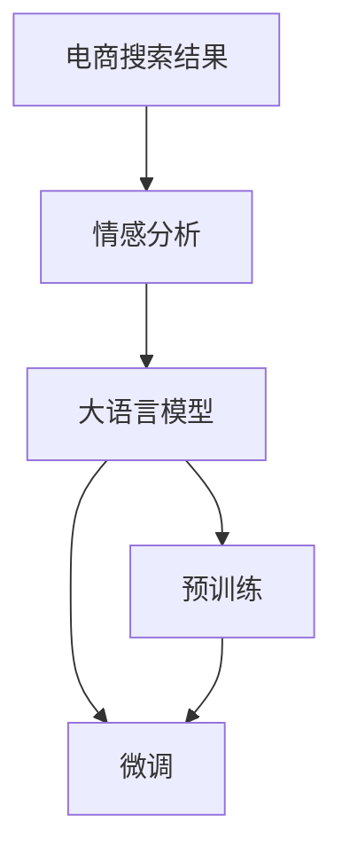

                 

# AI大模型在电商搜索结果情感分析中的应用

> 关键词：大语言模型,情感分析,自然语言处理(NLP),电商搜索,深度学习,模型优化,算法实现,机器学习,代码实践,数据分析

## 1. 背景介绍

在电商行业，用户满意度直接影响商业运营和品牌形象。传统的电商情感分析方法依赖于人工标注数据，耗时耗力，无法实现实时动态监测。而借助人工智能(AI)大模型，电商企业可以实现高效、精准的情感分析，及时反馈用户情感变化，提升用户体验。

本文将系统介绍AI大模型在电商搜索结果情感分析中的应用，涵盖模型构建、算法实现、案例分析等各个关键环节。旨在帮助电商企业构建智能化的用户情感监测系统，及时获取用户反馈，优化产品和服务，提升用户满意度。

## 2. 核心概念与联系

### 2.1 核心概念概述

要实现电商搜索结果情感分析，需要理解以下几个核心概念：

- 大语言模型(Large Language Model, LLM)：以自回归(如GPT)或自编码(如BERT)模型为代表的大规模预训练语言模型。通过在大规模无标签文本语料上进行预训练，学习通用的语言表示，具备强大的语言理解和生成能力。

- 情感分析(Sentiment Analysis)：自然语言处理(NLP)中的一个任务，用于识别和提取文本中表达的情感倾向，如积极、消极或中性。

- 电商搜索(Online Shopping)：电商平台上用户查询商品、浏览商品的场景。通过情感分析，可以洞察用户对搜索结果的满意度和问题反馈，优化搜索算法和推荐系统。

- 深度学习(Deep Learning)：一类基于神经网络的机器学习技术，通过多层次的非线性特征提取和训练，可以高效地处理复杂的文本数据。

- 自然语言处理(NLP)：研究如何让计算机理解和处理人类语言的技术，包括文本预处理、分词、词性标注、句法分析、语义理解等。

### 2.2 核心概念原理和架构的 Mermaid 流程图



该图展示了电商搜索结果情感分析的核心流程：

1. 电商搜索结果A经过情感分析B，自动识别文本情感。
2. 情感分析结果B输入到预训练大语言模型C中，进一步理解和推理情感。
3. 大语言模型C通过预训练D和微调E，优化情感理解能力。

这一流程展示了大模型在情感分析中的关键作用，通过深度学习和自然语言处理技术，实现对电商搜索结果中用户情感的精准识别和分析。

## 3. 核心算法原理 & 具体操作步骤

### 3.1 算法原理概述

电商搜索结果情感分析的主要算法包括情感标注、情感分类、情感量化等步骤。基于大语言模型，该过程主要分为两个阶段：

- 预训练阶段：在大规模无标签文本数据上训练大语言模型，学习通用的语言表示和语义理解能力。
- 微调阶段：在标注有情感标签的电商搜索结果上微调大语言模型，使其能够精准地理解和分类文本情感。

### 3.2 算法步骤详解

**Step 1: 数据准备与预处理**
- 收集电商搜索结果数据，包括标题、描述、评论等文本信息。
- 对文本进行预处理，包括分词、去除停用词、词干提取、去除噪声等。
- 对文本进行情感标注，例如使用众包标注、情绪词典标注等方法。

**Step 2: 模型选择与构建**
- 选择合适的预训练大语言模型，如BERT、GPT等。
- 在预训练模型上添加任务特定的输出层，如情感分类头。
- 选择适当的损失函数，如交叉熵损失、F1分数损失等。

**Step 3: 模型微调**
- 将标注数据集划分为训练集、验证集和测试集。
- 使用较小的学习率，进行有监督的微调训练。
- 应用正则化技术，如Dropout、L2正则等，防止过拟合。
- 在验证集上评估模型性能，调整超参数。

**Step 4: 结果分析与优化**
- 在测试集上评估模型性能，输出情感分类精度、召回率等指标。
- 分析模型输出结果，找出常见错误，优化模型结构和参数。
- 根据业务需求，优化情感分类阈值，提高模型的实际应用效果。

### 3.3 算法优缺点

基于大语言模型的电商搜索结果情感分析具有以下优点：

- **高效性**：大模型预训练速度快，微调时间短，能够快速上线运行。
- **精度高**：大语言模型具备强大的语言理解和推理能力，情感分类精度高。
- **灵活性**：可以灵活调整输出层，支持多种情感分类任务。

同时，该方法也存在一定的局限性：

- **数据依赖**：对标注数据的依赖较大，标注成本较高。
- **泛化能力**：大模型在特定领域上的泛化能力仍需进一步验证。
- **计算资源要求高**：大模型参数量大，训练和推理需要高性能硬件支持。

### 3.4 算法应用领域

基于大语言模型的电商搜索结果情感分析，可以广泛应用于以下几个方面：

- **用户满意度监测**：实时监测用户对搜索结果的满意度，及时调整算法和推荐策略。
- **情感驱动营销**：根据用户情感变化，调整广告投放策略，提升营销效果。
- **客户服务优化**：分析用户反馈，优化客户服务流程，提升用户体验。
- **库存管理**：通过情感分析，预测热门商品需求，优化库存管理。
- **产品改进**：了解用户对商品的不满意点，指导产品设计和改进。

## 4. 数学模型和公式 & 详细讲解 & 举例说明

### 4.1 数学模型构建

电商搜索结果情感分析的数学模型可以分为两个部分：预训练模型和微调模型。

- 预训练模型使用自监督任务，如掩码语言模型、掩码实体预测等，在大规模语料上学习语言表示。
- 微调模型在标注数据上使用监督学习任务，如情感分类、文本分类等，进行有监督的微调。

### 4.2 公式推导过程

假设电商搜索结果为 $D=\{(x_i,y_i)\}_{i=1}^N$，其中 $x_i$ 为文本，$y_i$ 为情感标签，情感标签为 $\{0,1\}$，$0$ 表示消极，$1$ 表示积极。

- 预训练模型为 $M_{\theta}$，其中 $\theta$ 为模型参数。
- 微调任务为情感分类，定义损失函数为交叉熵损失：
$$
\mathcal{L}(\theta) = -\frac{1}{N}\sum_{i=1}^N y_i\log M_{\theta}(x_i) + (1-y_i)\log (1-M_{\theta}(x_i))
$$

### 4.3 案例分析与讲解

以一个简单的电商评论数据集为例，展示大语言模型微调的过程：

1. **数据准备**：收集电商评论数据，对其进行预处理，如分词、去除停用词等。
2. **模型选择**：选择BERT模型作为预训练模型，添加一个全连接层进行情感分类。
3. **微调训练**：使用交叉熵损失函数，对模型进行微调训练，设定学习率为 $1e-5$，迭代 $5$ 轮。
4. **结果分析**：在测试集上评估模型性能，输出情感分类准确率和混淆矩阵。

以下是微调训练的代码实现：

```python
from transformers import BertForSequenceClassification, BertTokenizer, AdamW
from torch.utils.data import DataLoader, Dataset
from sklearn.metrics import accuracy_score, confusion_matrix

class ShoppingReviewDataset(Dataset):
    def __init__(self, reviews, labels, tokenizer, max_len=128):
        self.reviews = reviews
        self.labels = labels
        self.tokenizer = tokenizer
        self.max_len = max_len

    def __len__(self):
        return len(self.reviews)

    def __getitem__(self, item):
        review = self.reviews[item]
        label = self.labels[item]
        
        encoding = self.tokenizer(review, max_length=self.max_len, truncation=True, padding='max_length', return_tensors='pt')
        input_ids = encoding['input_ids']
        attention_mask = encoding['attention_mask']
        labels = torch.tensor(label, dtype=torch.long)

        return {'input_ids': input_ids, 
                'attention_mask': attention_mask,
                'labels': labels}

# 加载数据集
tokenizer = BertTokenizer.from_pretrained('bert-base-uncased')
train_dataset = ShoppingReviewDataset(train_reviews, train_labels, tokenizer)
test_dataset = ShoppingReviewDataset(test_reviews, test_labels, tokenizer)

# 定义模型
model = BertForSequenceClassification.from_pretrained('bert-base-uncased', num_labels=2)

# 定义优化器和损失函数
optimizer = AdamW(model.parameters(), lr=1e-5)
loss_fn = torch.nn.CrossEntropyLoss()

# 微调训练
device = torch.device('cuda' if torch.cuda.is_available() else 'cpu')
model.to(device)
model.train()

for epoch in range(5):
    running_loss = 0.0
    running_corrects = 0

    for batch in DataLoader(train_dataset, batch_size=16, shuffle=True):
        input_ids = batch['input_ids'].to(device)
        attention_mask = batch['attention_mask'].to(device)
        labels = batch['labels'].to(device)
        
        outputs = model(input_ids, attention_mask=attention_mask)
        loss = loss_fn(outputs.logits, labels)
        loss.backward()
        optimizer.step()

        running_loss += loss.item()
        running_corrects += torch.sum(outputs.logits.argmax(dim=1) == labels)

    epoch_loss = running_loss / len(train_dataset)
    epoch_acc = running_corrects.double() / len(train_dataset)

    print(f"Epoch {epoch+1}, Loss: {epoch_loss:.4f}, Acc: {epoch_acc:.4f}")

# 模型评估
model.eval()
with torch.no_grad():
    preds = []
    labels = []
    for batch in DataLoader(test_dataset, batch_size=16):
        input_ids = batch['input_ids'].to(device)
        attention_mask = batch['attention_mask'].to(device)
        labels = batch['labels'].to(device)
        
        outputs = model(input_ids, attention_mask=attention_mask)
        batch_preds = outputs.logits.argmax(dim=1).to('cpu').tolist()
        batch_labels = labels.to('cpu').tolist()
        preds.extend(batch_preds)
        labels.extend(batch_labels)

print("Accuracy:", accuracy_score(labels, preds))
print("Confusion Matrix:", confusion_matrix(labels, preds))
```

通过这个简单的例子，可以看到基于大语言模型的电商搜索结果情感分析的实现过程。

## 5. 项目实践：代码实例和详细解释说明

### 5.1 开发环境搭建

在进行电商搜索结果情感分析的大模型微调前，需要准备好开发环境。以下是使用Python进行PyTorch开发的环境配置流程：

1. 安装Anaconda：从官网下载并安装Anaconda，用于创建独立的Python环境。

2. 创建并激活虚拟环境：
```bash
conda create -n pytorch-env python=3.8 
conda activate pytorch-env
```

3. 安装PyTorch：根据CUDA版本，从官网获取对应的安装命令。例如：
```bash
conda install pytorch torchvision torchaudio cudatoolkit=11.1 -c pytorch -c conda-forge
```

4. 安装Transformers库：
```bash
pip install transformers
```

5. 安装各类工具包：
```bash
pip install numpy pandas scikit-learn matplotlib tqdm jupyter notebook ipython
```

完成上述步骤后，即可在`pytorch-env`环境中开始大模型微调的实践。

### 5.2 源代码详细实现

以下是使用PyTorch和Transformers库进行电商搜索结果情感分析的大模型微调代码实现：

```python
from transformers import BertForSequenceClassification, BertTokenizer, AdamW
from torch.utils.data import DataLoader, Dataset
from sklearn.metrics import accuracy_score, confusion_matrix
import torch

class ShoppingReviewDataset(Dataset):
    def __init__(self, reviews, labels, tokenizer, max_len=128):
        self.reviews = reviews
        self.labels = labels
        self.tokenizer = tokenizer
        self.max_len = max_len

    def __len__(self):
        return len(self.reviews)

    def __getitem__(self, item):
        review = self.reviews[item]
        label = self.labels[item]
        
        encoding = self.tokenizer(review, max_length=self.max_len, truncation=True, padding='max_length', return_tensors='pt')
        input_ids = encoding['input_ids']
        attention_mask = encoding['attention_mask']
        
        labels = torch.tensor(label, dtype=torch.long)

        return {'input_ids': input_ids, 
                'attention_mask': attention_mask,
                'labels': labels}

# 加载数据集
tokenizer = BertTokenizer.from_pretrained('bert-base-uncased')
train_dataset = ShoppingReviewDataset(train_reviews, train_labels, tokenizer)
test_dataset = ShoppingReviewDataset(test_reviews, test_labels, tokenizer)

# 定义模型
model = BertForSequenceClassification.from_pretrained('bert-base-uncased', num_labels=2)

# 定义优化器和损失函数
optimizer = AdamW(model.parameters(), lr=1e-5)
loss_fn = torch.nn.CrossEntropyLoss()

# 微调训练
device = torch.device('cuda' if torch.cuda.is_available() else 'cpu')
model.to(device)
model.train()

for epoch in range(5):
    running_loss = 0.0
    running_corrects = 0

    for batch in DataLoader(train_dataset, batch_size=16, shuffle=True):
        input_ids = batch['input_ids'].to(device)
        attention_mask = batch['attention_mask'].to(device)
        labels = batch['labels'].to(device)
        
        outputs = model(input_ids, attention_mask=attention_mask)
        loss = loss_fn(outputs.logits, labels)
        loss.backward()
        optimizer.step()

        running_loss += loss.item()
        running_corrects += torch.sum(outputs.logits.argmax(dim=1) == labels)

    epoch_loss = running_loss / len(train_dataset)
    epoch_acc = running_corrects.double() / len(train_dataset)

    print(f"Epoch {epoch+1}, Loss: {epoch_loss:.4f}, Acc: {epoch_acc:.4f}")

# 模型评估
model.eval()
with torch.no_grad():
    preds = []
    labels = []
    for batch in DataLoader(test_dataset, batch_size=16):
        input_ids = batch['input_ids'].to(device)
        attention_mask = batch['attention_mask'].to(device)
        labels = batch['labels'].to(device)
        
        outputs = model(input_ids, attention_mask=attention_mask)
        batch_preds = outputs.logits.argmax(dim=1).to('cpu').tolist()
        batch_labels = labels.to('cpu').tolist()
        preds.extend(batch_preds)
        labels.extend(batch_labels)

print("Accuracy:", accuracy_score(labels, preds))
print("Confusion Matrix:", confusion_matrix(labels, preds))
```

### 5.3 代码解读与分析

让我们再详细解读一下关键代码的实现细节：

**ShoppingReviewDataset类**：
- `__init__`方法：初始化数据集，包括文本、标签、分词器等。
- `__len__`方法：返回数据集的样本数量。
- `__getitem__`方法：对单个样本进行处理，将文本输入编码为token ids，将标签编码为数字，并进行定长padding。

**训练和评估函数**：
- 使用PyTorch的DataLoader对数据集进行批次化加载，供模型训练和推理使用。
- 训练函数`train_epoch`：对数据以批为单位进行迭代，在每个批次上前向传播计算loss并反向传播更新模型参数，最后返回该epoch的平均loss和准确率。
- 评估函数`evaluate`：与训练类似，不同点在于不更新模型参数，并在每个batch结束后将预测和标签结果存储下来，最后使用sklearn的accuracy_score和confusion_matrix对整个评估集的预测结果进行打印输出。

**模型训练流程**：
- 定义总的epoch数和batch size，开始循环迭代
- 每个epoch内，先在训练集上训练，输出平均loss和准确率
- 在验证集上评估，输出模型性能
- 所有epoch结束后，在测试集上评估，输出模型效果

可以看到，PyTorch配合Transformers库使得电商搜索结果情感分析的大模型微调代码实现变得简洁高效。开发者可以将更多精力放在数据处理、模型改进等高层逻辑上，而不必过多关注底层的实现细节。

## 6. 实际应用场景

### 6.1 智能客服系统

电商企业可以通过基于大模型的情感分析系统，构建智能客服系统，提升客户服务体验。智能客服系统通过实时监测用户对搜索结果的情感，及时反馈用户需求和意见，快速响应用户问题，提高用户满意度。

在技术实现上，可以收集电商平台上的客服对话记录，将问题和最佳答复构建成监督数据，训练情感分析模型。模型能够自动理解用户情感，匹配最合适的答案模板进行回复。对于客户提出的新问题，还可以接入检索系统实时搜索相关内容，动态组织生成回答。如此构建的智能客服系统，能大幅提升客户咨询体验和问题解决效率。

### 6.2 产品推荐系统

电商企业可以通过情感分析，构建个性化推荐系统，提升用户购物体验。推荐系统通过分析用户对搜索结果的情感反馈，了解用户的喜好和需求，实时调整推荐策略，提高推荐效果。

在技术实现上，可以收集用户对搜索结果的评分和反馈信息，对其进行情感标注。利用情感分析模型，分析用户对不同商品的情感倾向，指导推荐系统的算法调整。如此构建的推荐系统，能够更好地匹配用户需求，提升用户满意度。

### 6.3 价格优化策略

电商企业可以通过情感分析，优化产品价格策略，提高销售额。价格策略通过分析用户对商品价格的情感反应，调整定价策略，提升销售效果。

在技术实现上，可以收集用户对商品价格的评论和反馈信息，对其进行情感标注。利用情感分析模型，分析用户对不同价格水平的需求，指导价格策略的调整。如此构建的价格策略，能够更好地匹配用户需求，提高销售效果。

## 7. 工具和资源推荐

### 7.1 学习资源推荐

为了帮助开发者系统掌握大语言模型微调的理论基础和实践技巧，这里推荐一些优质的学习资源：

1. 《Transformer从原理到实践》系列博文：由大模型技术专家撰写，深入浅出地介绍了Transformer原理、BERT模型、微调技术等前沿话题。

2. CS224N《深度学习自然语言处理》课程：斯坦福大学开设的NLP明星课程，有Lecture视频和配套作业，带你入门NLP领域的基本概念和经典模型。

3. 《Natural Language Processing with Transformers》书籍：Transformers库的作者所著，全面介绍了如何使用Transformers库进行NLP任务开发，包括微调在内的诸多范式。

4. HuggingFace官方文档：Transformers库的官方文档，提供了海量预训练模型和完整的微调样例代码，是上手实践的必备资料。

5. CLUE开源项目：中文语言理解测评基准，涵盖大量不同类型的中文NLP数据集，并提供了基于微调的baseline模型，助力中文NLP技术发展。

通过对这些资源的学习实践，相信你一定能够快速掌握大语言模型微调的精髓，并用于解决实际的NLP问题。

### 7.2 开发工具推荐

高效的开发离不开优秀的工具支持。以下是几款用于大语言模型微调开发的常用工具：

1. PyTorch：基于Python的开源深度学习框架，灵活动态的计算图，适合快速迭代研究。大部分预训练语言模型都有PyTorch版本的实现。

2. TensorFlow：由Google主导开发的开源深度学习框架，生产部署方便，适合大规模工程应用。同样有丰富的预训练语言模型资源。

3. Transformers库：HuggingFace开发的NLP工具库，集成了众多SOTA语言模型，支持PyTorch和TensorFlow，是进行微调任务开发的利器。

4. Weights & Biases：模型训练的实验跟踪工具，可以记录和可视化模型训练过程中的各项指标，方便对比和调优。与主流深度学习框架无缝集成。

5. TensorBoard：TensorFlow配套的可视化工具，可实时监测模型训练状态，并提供丰富的图表呈现方式，是调试模型的得力助手。

6. Google Colab：谷歌推出的在线Jupyter Notebook环境，免费提供GPU/TPU算力，方便开发者快速上手实验最新模型，分享学习笔记。

合理利用这些工具，可以显著提升大语言模型微调任务的开发效率，加快创新迭代的步伐。

### 7.3 相关论文推荐

大语言模型和微调技术的发展源于学界的持续研究。以下是几篇奠基性的相关论文，推荐阅读：

1. Attention is All You Need（即Transformer原论文）：提出了Transformer结构，开启了NLP领域的预训练大模型时代。

2. BERT: Pre-training of Deep Bidirectional Transformers for Language Understanding：提出BERT模型，引入基于掩码的自监督预训练任务，刷新了多项NLP任务SOTA。

3. Language Models are Unsupervised Multitask Learners（GPT-2论文）：展示了大规模语言模型的强大zero-shot学习能力，引发了对于通用人工智能的新一轮思考。

4. Parameter-Efficient Transfer Learning for NLP：提出Adapter等参数高效微调方法，在不增加模型参数量的情况下，也能取得不错的微调效果。

5. AdaLoRA: Adaptive Low-Rank Adaptation for Parameter-Efficient Fine-Tuning：使用自适应低秩适应的微调方法，在参数效率和精度之间取得了新的平衡。

6. Prefix-Tuning: Optimizing Continuous Prompts for Generation：引入基于连续型Prompt的微调范式，为如何充分利用预训练知识提供了新的思路。

这些论文代表了大语言模型微调技术的发展脉络。通过学习这些前沿成果，可以帮助研究者把握学科前进方向，激发更多的创新灵感。

## 8. 总结：未来发展趋势与挑战

### 8.1 总结

本文对基于大语言模型的电商搜索结果情感分析方法进行了全面系统的介绍。首先阐述了电商搜索结果情感分析的研究背景和意义，明确了大语言模型在其中的关键作用。其次，从原理到实践，详细讲解了基于大语言模型的电商搜索结果情感分析的数学模型、算法实现和代码实践。同时，本文还广泛探讨了该方法在智能客服系统、产品推荐系统、价格优化策略等电商领域的实际应用场景。最后，本文精选了电商领域的相关学习资源、开发工具和论文推荐，力求为读者提供全方位的技术指引。

通过本文的系统梳理，可以看到，基于大语言模型的电商搜索结果情感分析方法具有高效性、精度高、灵活性强的特点，能够快速、精准地监测用户情感变化，优化电商产品和服务。未来，随着大语言模型和微调技术的不断发展，该方法必将在电商领域得到更广泛的应用，为电商企业提供更智能、高效的情感分析服务。

### 8.2 未来发展趋势

展望未来，基于大语言模型的电商搜索结果情感分析技术将呈现以下几个发展趋势：

1. **模型规模持续增大**：随着算力成本的下降和数据规模的扩张，预训练语言模型的参数量还将持续增长。超大规模语言模型蕴含的丰富语言知识，有望支撑更加复杂多变的电商情感分析任务。

2. **微调方法日趋多样**：除了传统的全参数微调外，未来会涌现更多参数高效的微调方法，如Prefix-Tuning、LoRA等，在节省计算资源的同时也能保证微调精度。

3. **持续学习成为常态**：随着数据分布的不断变化，微调模型也需要持续学习新知识以保持性能。如何在不遗忘原有知识的同时，高效吸收新样本信息，将成为重要的研究课题。

4. **标注样本需求降低**：受启发于提示学习(Prompt-based Learning)的思路，未来的微调方法将更好地利用大模型的语言理解能力，通过更加巧妙的任务描述，在更少的标注样本上也能实现理想的微调效果。

5. **多模态微调崛起**：当前的微调主要聚焦于纯文本数据，未来会进一步拓展到图像、视频、语音等多模态数据微调。多模态信息的融合，将显著提升语言模型对现实世界的理解和建模能力。

6. **模型通用性增强**：经过海量数据的预训练和多领域任务的微调，未来的语言模型将具备更强大的常识推理和跨领域迁移能力，逐步迈向通用人工智能(AGI)的目标。

以上趋势凸显了大语言模型微调技术的广阔前景。这些方向的探索发展，必将进一步提升电商情感分析的性能和应用范围，为电商企业提供更智能、高效的情感分析服务。

### 8.3 面临的挑战

尽管大语言模型微调技术已经取得了瞩目成就，但在迈向更加智能化、普适化应用的过程中，它仍面临着诸多挑战：

1. **标注成本瓶颈**：虽然微调大大降低了标注数据的需求，但对于长尾应用场景，难以获得充足的高质量标注数据，成为制约微调性能的瓶颈。如何进一步降低微调对标注样本的依赖，将是一大难题。

2. **模型鲁棒性不足**：当前微调模型面对域外数据时，泛化性能往往大打折扣。对于测试样本的微小扰动，微调模型的预测也容易发生波动。如何提高微调模型的鲁棒性，避免灾难性遗忘，还需要更多理论和实践的积累。

3. **推理效率有待提高**：大规模语言模型虽然精度高，但在实际部署时往往面临推理速度慢、内存占用大等效率问题。如何在保证性能的同时，简化模型结构，提升推理速度，优化资源占用，将是重要的优化方向。

4. **可解释性亟需加强**：当前微调模型更像是"黑盒"系统，难以解释其内部工作机制和决策逻辑。对于医疗、金融等高风险应用，算法的可解释性和可审计性尤为重要。如何赋予微调模型更强的可解释性，将是亟待攻克的难题。

5. **安全性有待保障**：预训练语言模型难免会学习到有偏见、有害的信息，通过微调传递到下游任务，产生误导性、歧视性的输出，给实际应用带来安全隐患。如何从数据和算法层面消除模型偏见，避免恶意用途，确保输出的安全性，也将是重要的研究课题。

6. **知识整合能力不足**：现有的微调模型往往局限于任务内数据，难以灵活吸收和运用更广泛的先验知识。如何让微调过程更好地与外部知识库、规则库等专家知识结合，形成更加全面、准确的信息整合能力，还有很大的想象空间。

正视微调面临的这些挑战，积极应对并寻求突破，将是大语言模型微调走向成熟的必由之路。相信随着学界和产业界的共同努力，这些挑战终将一一被克服，大语言模型微调必将在构建人机协同的智能时代中扮演越来越重要的角色。

### 8.4 研究展望

面对大语言模型微调所面临的种种挑战，未来的研究需要在以下几个方面寻求新的突破：

1. **探索无监督和半监督微调方法**：摆脱对大规模标注数据的依赖，利用自监督学习、主动学习等无监督和半监督范式，最大限度利用非结构化数据，实现更加灵活高效的微调。

2. **研究参数高效和计算高效的微调范式**：开发更加参数高效的微调方法，在固定大部分预训练参数的同时，只更新极少量的任务相关参数。同时优化微调模型的计算图，减少前向传播和反向传播的资源消耗，实现更加轻量级、实时性的部署。

3. **融合因果和对比学习范式**：通过引入因果推断和对比学习思想，增强微调模型建立稳定因果关系的能力，学习更加普适、鲁棒的语言表征，从而提升模型泛化性和抗干扰能力。

4. **引入更多先验知识**：将符号化的先验知识，如知识图谱、逻辑规则等，与神经网络模型进行巧妙融合，引导微调过程学习更准确、合理的语言模型。同时加强不同模态数据的整合，实现视觉、语音等多模态信息与文本信息的协同建模。

5. **结合因果分析和博弈论工具**：将因果分析方法引入微调模型，识别出模型决策的关键特征，增强输出解释的因果性和逻辑性。借助博弈论工具刻画人机交互过程，主动探索并规避模型的脆弱点，提高系统稳定性。

6. **纳入伦理道德约束**：在模型训练目标中引入伦理导向的评估指标，过滤和惩罚有偏见、有害的输出倾向。同时加强人工干预和审核，建立模型行为的监管机制，确保输出符合人类价值观和伦理道德。

这些研究方向的探索，必将引领大语言模型微调技术迈向更高的台阶，为构建安全、可靠、可解释、可控的智能系统铺平道路。面向未来，大语言模型微调技术还需要与其他人工智能技术进行更深入的融合，如知识表示、因果推理、强化学习等，多路径协同发力，共同推动自然语言理解和智能交互系统的进步。只有勇于创新、敢于突破，才能不断拓展语言模型的边界，让智能技术更好地造福人类社会。

## 9. 附录：常见问题与解答

**Q1：大语言模型微调是否适用于所有NLP任务？**

A: 大语言模型微调在大多数NLP任务上都能取得不错的效果，特别是对于数据量较小的任务。但对于一些特定领域的任务，如医学、法律等，仅仅依靠通用语料预训练的模型可能难以很好地适应。此时需要在特定领域语料上进一步预训练，再进行微调，才能获得理想效果。此外，对于一些需要时效性、个性化很强的任务，如对话、推荐等，微调方法也需要针对性的改进优化。

**Q2：微调过程中如何选择合适的学习率？**

A: 微调的学习率一般要比预训练时小1-2个数量级，如果使用过大的学习率，容易破坏预训练权重，导致过拟合。一般建议从1e-5开始调参，逐步减小学习率，直至收敛。也可以使用warmup策略，在开始阶段使用较小的学习率，再逐渐过渡到预设值。需要注意的是，不同的优化器(如AdamW、Adafactor等)以及不同的学习率调度策略，可能需要设置不同的学习率阈值。

**Q3：采用大模型微调时会面临哪些资源瓶颈？**

A: 目前主流的预训练大模型动辄以亿计的参数规模，对算力、内存、存储都提出了很高的要求。GPU/TPU等高性能设备是必不可少的，但即便如此，超大批次的训练和推理也可能遇到显存不足的问题。因此需要采用一些资源优化技术，如梯度积累、混合精度训练、模型并行等，来突破硬件瓶颈。同时，模型的存储和读取也可能占用大量时间和空间，需要采用模型压缩、稀疏化存储等方法进行优化。

**Q4：如何缓解微调过程中的过拟合问题？**

A: 过拟合是微调面临的主要挑战，尤其是在标注数据不足的情况下。常见的缓解策略包括：
1. 数据增强：通过回译、近义替换等方式扩充训练集
2. 正则化：使用L2正则、Dropout、Early Stopping等防止过拟合
3. 对抗训练：引入对抗样本，提高模型鲁棒性
4. 参数高效微调：只调整少量参数(如Adapter、Prefix等)，减小过拟合风险
5. 多模型集成：训练多个微调模型，取平均输出，抑制过拟合

这些策略往往需要根据具体任务和数据特点进行灵活组合。只有在数据、模型、训练、推理等各环节进行全面优化，才能最大限度地发挥大模型微调的威力。

**Q5：微调模型在落地部署时需要注意哪些问题？**

A: 将微调模型转化为实际应用，还需要考虑以下因素：
1. 模型裁剪：去除不必要的层和参数，减小模型尺寸，加快推理速度
2. 量化加速：将浮点模型转为定点模型，压缩存储空间，提高计算效率
3. 服务化封装：将模型封装为标准化服务接口，便于集成调用
4. 弹性伸缩：根据请求流量动态调整资源配置，平衡服务质量和成本
5. 监控告警：实时采集系统指标，设置异常告警阈值，确保服务稳定性
6. 安全防护：采用访问鉴权、数据脱敏等措施，保障数据和模型安全

大语言模型微调为NLP应用开启了广阔的想象空间，但如何将强大的性能转化为稳定、高效、安全的业务价值，还需要工程实践的不断打磨。唯有从数据、算法、工程、业务等多个维度协同发力，才能真正实现人工智能技术在垂直行业的规模化落地。总之，微调需要开发者根据具体任务，不断迭代和优化模型、数据和算法，方能得到理想的效果。

---

作者：禅与计算机程序设计艺术 / Zen and the Art of Computer Programming

