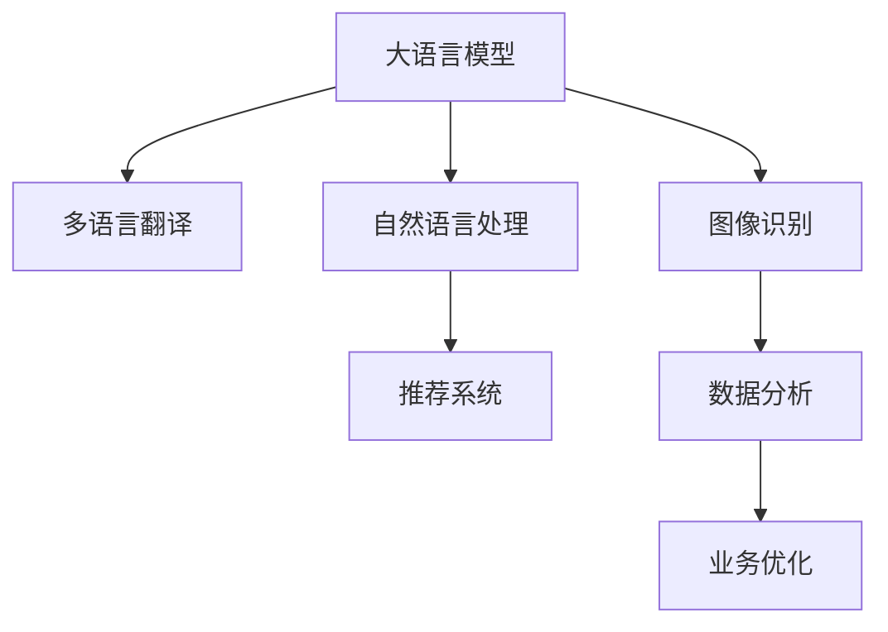

                 

# AI大模型在跨境电商中的多语言应用

> 关键词：大语言模型, 多语言翻译, 客户服务, 跨境电商, 自然语言处理, 推荐系统, 图像识别, 数据分析

## 1. 背景介绍

### 1.1 问题由来
随着全球化和互联网的普及，跨境电商市场迅速扩张，成为全球贸易的新热点。传统的电商平台往往只能支持少数语言，难以覆盖全球范围内的多语言客户。近年来，基于大语言模型的多语言应用技术迅速发展，为跨境电商提供了新的解决方案。借助大模型，电商平台能够实现快速、高效、准确的多语言翻译和自然语言处理，提升用户体验和运营效率。

### 1.2 问题核心关键点
大语言模型在跨境电商中的应用，主要集中在以下几个方面：

- 多语言翻译：通过大模型将商品描述、用户评论、客服对话等内容进行多语言翻译，支持多国语言用户交互。
- 自然语言理解：借助大模型进行商品搜索、语音输入、意图识别等，提升用户体验和搜索精度。
- 推荐系统：利用大模型的多语言知识进行商品推荐，提供个性化服务。
- 图像识别：通过大模型进行商品图片分类、标签生成等，实现智能仓储和推荐。
- 数据分析：运用大模型进行客户行为分析、市场趋势预测等，帮助商家优化运营策略。

### 1.3 问题研究意义
大语言模型在跨境电商中的应用，对于提升全球化服务能力，拓宽市场空间，降低运营成本，具有重要意义：

1. 提升用户体验：通过多语言翻译和自然语言处理，解决语言障碍，提升用户满意度。
2. 提高运营效率：通过智能推荐、库存管理等应用，提升运营自动化水平，减少人工干预。
3. 扩大市场空间：支持多语言服务，拓宽市场边界，吸引全球用户。
4. 优化运营策略：通过数据分析，精准把握客户需求和市场趋势，提高决策效率。
5. 增强竞争力：通过技术创新，形成独特的业务优势，提升企业市场竞争力。

## 2. 核心概念与联系

### 2.1 核心概念概述

为更好地理解大语言模型在跨境电商中的应用，本节将介绍几个密切相关的核心概念：

- 大语言模型(Large Language Model, LLM)：以自回归(如GPT)或自编码(如BERT)模型为代表的大规模预训练语言模型。通过在大规模无标签文本语料上进行预训练，学习通用的语言知识和常识，具备强大的语言理解和生成能力。

- 多语言翻译(Multi-language Translation)：将一种语言的内容翻译成另一种或多种语言的过程。基于大模型的多语言翻译技术能够实现高效、准确的翻译，提升跨境电商的多语言服务能力。

- 自然语言处理(Natural Language Processing, NLP)：研究计算机如何理解和生成人类语言的技术，包括文本分类、语义理解、命名实体识别等。

- 推荐系统(Recommendation System)：根据用户的历史行为和偏好，推荐个性化商品和服务。基于大模型的推荐系统能够结合多语言知识，提升推荐效果。

- 图像识别(Image Recognition)：通过算法对图像内容进行识别和分类，实现智能仓储和推荐。

- 数据分析(Analytics)：运用统计、机器学习等方法，对海量数据进行分析和挖掘，提供决策支持。

这些核心概念之间的逻辑关系可以通过以下Mermaid流程图来展示：



这个流程图展示了大语言模型在跨境电商中的核心概念及其之间的关系：

1. 大语言模型通过预训练获得基础能力。
2. 多语言翻译、自然语言处理、推荐系统、图像识别和数据分析，都是基于大模型的应用场景。
3. 数据分析结果可反馈给大模型，用于模型持续学习和优化。

## 3. 核心算法原理 & 具体操作步骤
### 3.1 算法原理概述

基于大语言模型在跨境电商中的应用，本质上是一种多语言自然语言处理(Multilingual NLP)的技术。其核心思想是：将大语言模型应用于多语言文本数据的处理，通过自然语言理解和生成技术，实现多语言翻译、自然语言处理、推荐系统、图像识别和数据分析等功能。

形式化地，假设大语言模型为 $M_{\theta}$，其中 $\theta$ 为预训练得到的模型参数。给定跨境电商场景下的多语言文本数据集 $D=\{(x_i, y_i)\}_{i=1}^N$，目标是在训练集上训练大语言模型，使得模型能够准确处理多语言文本数据，具体算法流程如下：

1. 收集跨境电商场景下的多语言文本数据，如商品描述、用户评论、客服对话等。
2. 选择合适的预训练大语言模型 $M_{\theta}$ 作为初始化参数，如BERT、GPT等。
3. 定义多语言翻译、自然语言处理、推荐系统等具体任务，设计合适的输出层和损失函数。
4. 设置微调超参数，选择合适的优化算法及其参数，如AdamW、SGD等。
5. 在多语言数据集 $D$ 上进行有监督微调，最小化损失函数 $\mathcal{L}(M_{\theta},D)$，得到优化后的模型参数 $\hat{\theta}$。

### 3.2 算法步骤详解

基于大语言模型在跨境电商中的应用，通常包括以下几个关键步骤：

**Step 1: 准备多语言数据集**
- 收集跨境电商场景下的多语言文本数据，如商品描述、用户评论、客服对话等。
- 将数据集划分为训练集、验证集和测试集，确保数据分布与实际应用场景一致。

**Step 2: 添加任务适配层**
- 根据具体任务，在预训练模型顶层设计合适的输出层和损失函数。
- 对于多语言翻译任务，通常使用序列到序列(Seq2Seq)模型，并设计交叉熵损失函数。
- 对于自然语言处理任务，如命名实体识别，可以使用分类损失函数。
- 对于推荐系统，通常使用均方误差损失函数。

**Step 3: 设置微调超参数**
- 选择合适的优化算法及其参数，如AdamW、SGD等，设置学习率、批大小、迭代轮数等。
- 设置正则化技术及强度，包括权重衰减、Dropout、Early Stopping等。
- 确定冻结预训练参数的策略，如仅微调顶层，或全部参数都参与微调。

**Step 4: 执行梯度训练**
- 将训练集数据分批次输入模型，前向传播计算损失函数。
- 反向传播计算参数梯度，根据设定的优化算法和学习率更新模型参数。
- 周期性在验证集上评估模型性能，根据性能指标决定是否触发 Early Stopping。
- 重复上述步骤直到满足预设的迭代轮数或 Early Stopping 条件。

**Step 5: 测试和部署**
- 在测试集上评估微调后模型 $M_{\hat{\theta}}$ 的性能，对比微调前后的精度提升。
- 使用微调后的模型对新样本进行推理预测，集成到实际的应用系统中。
- 持续收集新的数据，定期重新微调模型，以适应数据分布的变化。

以上是基于大语言模型在跨境电商中的应用的一般流程。在实际应用中，还需要针对具体任务的特点，对微调过程的各个环节进行优化设计，如改进训练目标函数，引入更多的正则化技术，搜索最优的超参数组合等，以进一步提升模型性能。

### 3.3 算法优缺点

基于大语言模型在跨境电商中的应用，具有以下优点：

1. 快速高效：基于大模型的多语言处理技术，能够快速实现多语言翻译、自然语言理解、推荐等应用，提升运营效率。
2. 性能优越：大语言模型具备强大的语言理解和生成能力，能够处理多种语言的复杂文本数据。
3. 覆盖广泛：大模型的多语言处理能力覆盖全球语言，能够支持跨境电商的全球化服务需求。
4. 成本低廉：相比于传统的多语言翻译技术，基于大模型的处理成本较低，易于部署和维护。

同时，该方法也存在一定的局限性：

1. 依赖标注数据：多语言翻译等任务需要大量的双语对照数据进行训练，标注数据的获取和处理成本较高。
2. 泛化能力有限：当目标语言的文本与预训练数据的分布差异较大时，模型的泛化性能可能受限。
3. 可解释性不足：大语言模型的决策过程通常缺乏可解释性，难以对其推理逻辑进行分析和调试。
4. 数据隐私问题：多语言文本数据的收集和处理可能涉及隐私保护问题，需采取相应的数据保护措施。

尽管存在这些局限性，但就目前而言，基于大语言模型的多语言处理技术仍是最主流范式。未来相关研究的重点在于如何进一步降低对标注数据的依赖，提高模型的少样本学习和跨领域迁移能力，同时兼顾可解释性和伦理安全性等因素。

### 3.4 算法应用领域

基于大语言模型在跨境电商中的应用，已经在多个领域得到了广泛的应用，例如：

- 多语言翻译：将商品描述、用户评论、客服对话等内容翻译成多种语言，提升用户体验。
- 自然语言理解：实现多语言的商品搜索、语音输入、意图识别等，提升搜索精度和用户交互体验。
- 推荐系统：根据用户的多语言行为数据，进行多语言的个性化商品推荐，提升用户满意度。
- 图像识别：对商品图片进行多语言的分类、标签生成等，实现智能仓储和推荐。
- 数据分析：运用多语言的客户行为数据，进行市场趋势预测和用户画像分析，优化运营策略。

除了上述这些经典应用外，大语言模型在跨境电商中还可以应用于广告投放、品牌建设、客户细分等环节，为电商平台提供全方位的技术支持。

## 4. 数学模型和公式 & 详细讲解  
### 4.1 数学模型构建

本节将使用数学语言对基于大语言模型在跨境电商中的应用过程进行更加严格的刻画。

记预训练语言模型为 $M_{\theta}$，其中 $\theta$ 为预训练得到的模型参数。假设跨境电商场景下的多语言文本数据集为 $D=\{(x_i,y_i)\}_{i=1}^N, x_i \in \mathcal{X}, y_i \in \mathcal{Y}$。

定义模型 $M_{\theta}$ 在输入 $x$ 上的输出为 $\hat{y}=M_{\theta}(x) \in \mathcal{Y}$，则在数据集 $D$ 上的经验风险为：

$$
\mathcal{L}(\theta) = \frac{1}{N}\sum_{i=1}^N \ell(M_{\theta}(x_i),y_i)
$$

其中 $\ell$ 为针对具体任务设计的损失函数，用于衡量模型预测输出与真实标签之间的差异。常见的损失函数包括交叉熵损失、均方误差损失等。

微调的优化目标是最小化经验风险，即找到最优参数：

$$
\theta^* = \mathop{\arg\min}_{\theta} \mathcal{L}(\theta)
$$

在实践中，我们通常使用基于梯度的优化算法（如SGD、Adam等）来近似求解上述最优化问题。设 $\eta$ 为学习率，$\lambda$ 为正则化系数，则参数的更新公式为：

$$
\theta \leftarrow \theta - \eta \nabla_{\theta}\mathcal{L}(\theta) - \eta\lambda\theta
$$

其中 $\nabla_{\theta}\mathcal{L}(\theta)$ 为损失函数对参数 $\theta$ 的梯度，可通过反向传播算法高效计算。

### 4.2 公式推导过程

以下我们以多语言翻译任务为例，推导交叉熵损失函数及其梯度的计算公式。

假设模型 $M_{\theta}$ 在输入 $x$ 上的输出为 $\hat{y}=M_{\theta}(x) \in [0,1]$，表示样本属于源语言的概率。真实标签 $y \in \{0,1\}$。则二分类交叉熵损失函数定义为：

$$
\ell(M_{\theta}(x),y) = -[y\log \hat{y} + (1-y)\log (1-\hat{y})]
$$

将其代入经验风险公式，得：

$$
\mathcal{L}(\theta) = -\frac{1}{N}\sum_{i=1}^N [y_i\log M_{\theta}(x_i)+(1-y_i)\log(1-M_{\theta}(x_i))]
$$

根据链式法则，损失函数对参数 $\theta_k$ 的梯度为：

$$
\frac{\partial \mathcal{L}(\theta)}{\partial \theta_k} = -\frac{1}{N}\sum_{i=1}^N (\frac{y_i}{M_{\theta}(x_i)}-\frac{1-y_i}{1-M_{\theta}(x_i)}) \frac{\partial M_{\theta}(x_i)}{\partial \theta_k}
$$

其中 $\frac{\partial M_{\theta}(x_i)}{\partial \theta_k}$ 可进一步递归展开，利用自动微分技术完成计算。

在得到损失函数的梯度后，即可带入参数更新公式，完成模型的迭代优化。重复上述过程直至收敛，最终得到适应跨境电商任务的最优模型参数 $\theta^*$。

## 5. 项目实践：代码实例和详细解释说明
### 5.1 开发环境搭建

在进行多语言应用实践前，我们需要准备好开发环境。以下是使用Python进行PyTorch开发的环境配置流程：

1. 安装Anaconda：从官网下载并安装Anaconda，用于创建独立的Python环境。

2. 创建并激活虚拟环境：
```bash
conda create -n pytorch-env python=3.8 
conda activate pytorch-env
```

3. 安装PyTorch：根据CUDA版本，从官网获取对应的安装命令。例如：
```bash
conda install pytorch torchvision torchaudio cudatoolkit=11.1 -c pytorch -c conda-forge
```

4. 安装Transformers库：
```bash
pip install transformers
```

5. 安装各类工具包：
```bash
pip install numpy pandas scikit-learn matplotlib tqdm jupyter notebook ipython
```

完成上述步骤后，即可在`pytorch-env`环境中开始多语言应用实践。

### 5.2 源代码详细实现

下面我们以多语言翻译任务为例，给出使用Transformers库对BERT模型进行多语言翻译的PyTorch代码实现。

首先，定义翻译任务的数据处理函数：

```python
from transformers import BertTokenizer
from torch.utils.data import Dataset
import torch

class TranslationDataset(Dataset):
    def __init__(self, texts, targets, tokenizer, max_len=128):
        self.texts = texts
        self.targets = targets
        self.tokenizer = tokenizer
        self.max_len = max_len
        
    def __len__(self):
        return len(self.texts)
    
    def __getitem__(self, item):
        text = self.texts[item]
        target = self.targets[item]
        
        encoding = self.tokenizer(text, return_tensors='pt', max_length=self.max_len, padding='max_length', truncation=True)
        input_ids = encoding['input_ids'][0]
        attention_mask = encoding['attention_mask'][0]
        target_ids = torch.tensor(target, dtype=torch.long)
        
        return {'input_ids': input_ids, 
                'attention_mask': attention_mask,
                'target_ids': target_ids}
```

然后，定义模型和优化器：

```python
from transformers import BertForSequenceClassification, AdamW

model = BertForSequenceClassification.from_pretrained('bert-base-cased', num_labels=2)

optimizer = AdamW(model.parameters(), lr=2e-5)
```

接着，定义训练和评估函数：

```python
from torch.utils.data import DataLoader
from tqdm import tqdm
from sklearn.metrics import accuracy_score

device = torch.device('cuda') if torch.cuda.is_available() else torch.device('cpu')
model.to(device)

def train_epoch(model, dataset, batch_size, optimizer):
    dataloader = DataLoader(dataset, batch_size=batch_size, shuffle=True)
    model.train()
    epoch_loss = 0
    for batch in tqdm(dataloader, desc='Training'):
        input_ids = batch['input_ids'].to(device)
        attention_mask = batch['attention_mask'].to(device)
        targets = batch['target_ids'].to(device)
        model.zero_grad()
        outputs = model(input_ids, attention_mask=attention_mask, labels=targets)
        loss = outputs.loss
        epoch_loss += loss.item()
        loss.backward()
        optimizer.step()
    return epoch_loss / len(dataloader)

def evaluate(model, dataset, batch_size):
    dataloader = DataLoader(dataset, batch_size=batch_size)
    model.eval()
    preds, labels = [], []
    with torch.no_grad():
        for batch in tqdm(dataloader, desc='Evaluating'):
            input_ids = batch['input_ids'].to(device)
            attention_mask = batch['attention_mask'].to(device)
            batch_labels = batch['target_ids']
            outputs = model(input_ids, attention_mask=attention_mask)
            batch_preds = outputs.logits.argmax(dim=2).to('cpu').tolist()
            batch_labels = batch_labels.to('cpu').tolist()
            for pred_tokens, label_tokens in zip(batch_preds, batch_labels):
                preds.append(pred_tokens)
                labels.append(label_tokens)
                
    print('Accuracy: ', accuracy_score(labels, preds))
```

最后，启动训练流程并在测试集上评估：

```python
epochs = 5
batch_size = 16

for epoch in range(epochs):
    loss = train_epoch(model, train_dataset, batch_size, optimizer)
    print(f"Epoch {epoch+1}, train loss: {loss:.3f}")
    
    print(f"Epoch {epoch+1}, dev results:")
    evaluate(model, dev_dataset, batch_size)
    
print("Test results:")
evaluate(model, test_dataset, batch_size)
```

以上就是使用PyTorch对BERT进行多语言翻译任务的完整代码实现。可以看到，得益于Transformers库的强大封装，我们可以用相对简洁的代码完成BERT模型的加载和微调。

### 5.3 代码解读与分析

让我们再详细解读一下关键代码的实现细节：

**TranslationDataset类**：
- `__init__`方法：初始化文本、标签、分词器等关键组件。
- `__len__`方法：返回数据集的样本数量。
- `__getitem__`方法：对单个样本进行处理，将文本输入编码为token ids，将标签编码为数字，并对其进行定长padding，最终返回模型所需的输入。

**训练和评估函数**：
- 使用PyTorch的DataLoader对数据集进行批次化加载，供模型训练和推理使用。
- 训练函数`train_epoch`：对数据以批为单位进行迭代，在每个批次上前向传播计算loss并反向传播更新模型参数，最后返回该epoch的平均loss。
- 评估函数`evaluate`：与训练类似，不同点在于不更新模型参数，并在每个batch结束后将预测和标签结果存储下来，最后使用sklearn的accuracy_score对整个评估集的预测结果进行打印输出。

**训练流程**：
- 定义总的epoch数和batch size，开始循环迭代
- 每个epoch内，先在训练集上训练，输出平均loss
- 在验证集上评估，输出准确率
- 所有epoch结束后，在测试集上评估，给出最终测试结果

可以看到，PyTorch配合Transformers库使得BERT微调的代码实现变得简洁高效。开发者可以将更多精力放在数据处理、模型改进等高层逻辑上，而不必过多关注底层的实现细节。

当然，工业级的系统实现还需考虑更多因素，如模型的保存和部署、超参数的自动搜索、更灵活的任务适配层等。但核心的微调范式基本与此类似。

## 6. 实际应用场景
### 6.1 智能客服系统

基于大语言模型翻译技术，智能客服系统能够提供多语言服务，提升客户满意度。传统客服系统通常只支持少数语言，无法满足全球客户的需求。而基于大语言模型的翻译技术，可以实现实时多语言翻译和语音输入，使客服系统能够支持更多语言，提升客户服务质量。

在技术实现上，可以收集企业内部的多语言客服对话记录，将问题和最佳答复构建成监督数据，在此基础上对预训练模型进行微调。微调后的模型能够自动理解客户的多语言请求，匹配最合适的答复。对于客户提出的新问题，还可以接入检索系统实时搜索相关内容，动态生成最佳答复。如此构建的智能客服系统，能大幅提升客户咨询体验和问题解决效率。

### 6.2 商品推荐系统

商品推荐系统能够根据用户的多语言行为数据，进行多语言的个性化商品推荐，提升用户满意度。在商品描述、用户评论等文本数据中，通常包含多种语言的描述信息。通过多语言翻译技术，将文本数据转化为模型可处理的格式，利用大模型的语言理解能力，提取多语言的客户兴趣点，生成个性化的推荐结果。

具体而言，可以收集用户的多语言浏览、点击、评论等行为数据，提取和商品描述、用户评论、用户画像等文本内容。将文本内容作为模型输入，使用多语言翻译技术将文本数据转化为统一的格式，然后通过微调后的模型进行推荐。如此构建的多语言推荐系统，能够提供更准确、多样化的推荐内容，提升用户购物体验。

### 6.3 多语言广告投放

广告投放平台能够根据用户的多语言特征，进行多语言广告定向投放，提高广告效果和点击率。通过多语言翻译技术，将广告文案翻译成目标语言，使广告能够覆盖更多用户。同时，利用自然语言理解技术，分析用户的多语言行为数据，识别用户兴趣点，进行精准的广告投放。

在技术实现上，可以收集广告投放平台的多语言用户行为数据，将广告文案进行多语言翻译，并利用自然语言理解技术分析用户兴趣点。根据用户的兴趣和行为特征，进行多语言的广告定向投放，提升广告效果和点击率。

### 6.4 未来应用展望

随着大语言模型翻译技术的发展，其在跨境电商中的应用将更加广泛。未来，基于大语言模型的多语言应用技术，将进一步拓展到更多的场景，如在线教育、金融服务、旅游出行等，为全球用户提供更丰富、更高效的服务体验。

1. 在线教育：利用多语言翻译和自然语言理解技术，提供多语言课程和教材，满足全球学生的需求。
2. 金融服务：通过多语言翻译技术，提供多语言的金融服务，如货币兑换、投资理财等，提升客户体验。
3. 旅游出行：利用多语言翻译技术，提供多语言的旅游信息和服务，提升客户出行体验。
4. 智能家居：通过多语言翻译技术，提供多语言的智能家居控制和交互，提升家居智能化水平。

## 7. 工具和资源推荐
### 7.1 学习资源推荐

为了帮助开发者系统掌握大语言模型在跨境电商中的应用技术，这里推荐一些优质的学习资源：

1. 《Multilingual NLP with Transformers》系列博文：由大模型技术专家撰写，深入浅出地介绍了Transformer在多语言NLP中的应用。

2. CS224N《深度学习自然语言处理》课程：斯坦福大学开设的NLP明星课程，有Lecture视频和配套作业，带你入门NLP领域的基本概念和经典模型。

3. 《Natural Language Processing with Transformers》书籍：Transformers库的作者所著，全面介绍了如何使用Transformers库进行NLP任务开发，包括多语言NLP在内的诸多范式。

4. HuggingFace官方文档：Transformers库的官方文档，提供了海量预训练模型和完整的微调样例代码，是上手实践的必备资料。

5. Multilingual NLP开源项目：如mTranslate、OpenNMT等，提供多语言的翻译工具和预训练模型，助力多语言应用开发。

通过对这些资源的学习实践，相信你一定能够快速掌握大语言模型在跨境电商中的应用精髓，并用于解决实际的NLP问题。
###  7.2 开发工具推荐

高效的开发离不开优秀的工具支持。以下是几款用于大语言模型多语言应用开发的常用工具：

1. PyTorch：基于Python的开源深度学习框架，灵活动态的计算图，适合快速迭代研究。大部分预训练语言模型都有PyTorch版本的实现。

2. TensorFlow：由Google主导开发的开源深度学习框架，生产部署方便，适合大规模工程应用。同样有丰富的预训练语言模型资源。

3. Transformers库：HuggingFace开发的NLP工具库，集成了众多SOTA语言模型，支持PyTorch和TensorFlow，是进行多语言NLP开发的利器。

4. Weights & Biases：模型训练的实验跟踪工具，可以记录和可视化模型训练过程中的各项指标，方便对比和调优。与主流深度学习框架无缝集成。

5. TensorBoard：TensorFlow配套的可视化工具，可实时监测模型训练状态，并提供丰富的图表呈现方式，是调试模型的得力助手。

6. Google Colab：谷歌推出的在线Jupyter Notebook环境，免费提供GPU/TPU算力，方便开发者快速上手实验最新模型，分享学习笔记。

合理利用这些工具，可以显著提升大语言模型多语言应用任务的开发效率，加快创新迭代的步伐。

### 7.3 相关论文推荐

大语言模型在多语言应用领域的研究源于学界的持续研究。以下是几篇奠基性的相关论文，推荐阅读：

1. Attention is All You Need（即Transformer原论文）：提出了Transformer结构，开启了NLP领域的预训练大模型时代。

2. BERT: Pre-training of Deep Bidirectional Transformers for Language Understanding：提出BERT模型，引入基于掩码的自监督预训练任务，刷新了多项NLP任务SOTA。

3. Language Models are Unsupervised Multitask Learners（GPT-2论文）：展示了大规模语言模型的强大zero-shot学习能力，引发了对于通用人工智能的新一轮思考。

4. Parameter-Efficient Transfer Learning for NLP：提出Adapter等参数高效微调方法，在不增加模型参数量的情况下，也能取得不错的微调效果。

5. Multilingual Multimodal Learning from Noisy Pre-training（mBERT论文）：提出了多语言多模态的预训练方法，利用多种数据源进行联合训练，提升了模型在多语言多模态任务上的性能。

这些论文代表了大语言模型多语言应用的研究进展。通过学习这些前沿成果，可以帮助研究者把握学科前进方向，激发更多的创新灵感。

## 8. 总结：未来发展趋势与挑战

### 8.1 总结

本文对大语言模型在跨境电商中的应用进行了全面系统的介绍。首先阐述了多语言应用的背景和意义，明确了大语言模型在多语言翻译、自然语言处理、推荐系统等领域的应用场景。其次，从原理到实践，详细讲解了多语言应用的技术流程，给出了多语言翻译任务的完整代码实例。同时，本文还广泛探讨了多语言应用在智能客服、商品推荐、广告投放等多个领域的应用前景，展示了多语言应用技术的巨大潜力。

通过本文的系统梳理，可以看到，大语言模型在多语言应用中已经取得了重要进展，并在跨境电商等多个领域得到了应用。得益于大模型的多语言处理能力，跨境电商平台能够提供多语言服务，提升用户体验，拓展市场空间，提高运营效率。未来，伴随多语言应用技术的持续演进，相信NLP技术将在更多领域大放异彩，深刻影响人类的生产生活方式。

### 8.2 未来发展趋势

展望未来，大语言模型在跨境电商中的多语言应用技术将呈现以下几个发展趋势：

1. 模型规模持续增大。随着算力成本的下降和数据规模的扩张，预训练语言模型的参数量还将持续增长。超大规模语言模型蕴含的丰富语言知识，有望支撑更加复杂多变的多语言应用场景。

2. 多语言应用范式多样化。除了传统的基于大模型的多语言应用外，未来会涌现更多多语言应用的创新方法，如零样本翻译、少样本学习等，在降低数据需求的同时，提升应用效果。

3. 多语言应用场景扩展。未来的多语言应用将覆盖更多的场景，如在线教育、金融服务、旅游出行等，为大语言模型带来更多的应用空间。

4. 多语言知识融合。未来的多语言应用将更多地融合多语言知识，实现多语言领域的跨领域迁移和协同建模，提升多语言处理的性能。

5. 跨语言语义理解。未来的多语言应用将更注重跨语言语义的理解，通过多语言的语料训练，提高模型的跨语言语义理解能力。

6. 多语言知识图谱。未来的多语言应用将结合知识图谱技术，提升模型的知识表示能力和推理能力，为多语言领域的智能决策提供支持。

以上趋势凸显了大语言模型在跨境电商中的多语言应用技术的广阔前景。这些方向的探索发展，必将进一步提升多语言应用的性能和应用范围，为跨境电商提供更强大的语言服务能力。

### 8.3 面临的挑战

尽管大语言模型在跨境电商中的多语言应用技术已经取得了重要进展，但在迈向更加智能化、普适化应用的过程中，它仍面临诸多挑战：

1. 标注数据瓶颈。尽管多语言翻译任务可以通过少量双语对照数据进行训练，但对于复杂的自然语言处理任务，如多语言命名实体识别、情感分析等，标注数据的获取和处理成本较高。如何进一步降低多语言应用对标注数据的依赖，将是一大难题。

2. 模型泛化能力不足。当目标语言的文本与预训练数据的分布差异较大时，多语言应用的泛化性能可能受限。模型难以适应新的语言环境，泛化效果不佳。

3. 可解释性不足。大语言模型在多语言应用中的决策过程通常缺乏可解释性，难以对其推理逻辑进行分析和调试。对于医疗、金融等高风险应用，算法的可解释性和可审计性尤为重要。

4. 数据隐私问题。多语言文本数据的收集和处理可能涉及隐私保护问题，需采取相应的数据保护措施，确保数据安全和隐私。

尽管存在这些挑战，但就目前而言，基于大语言模型的多语言应用技术仍是最主流范式。未来相关研究的重点在于如何进一步降低对标注数据的依赖，提高模型的少样本学习和跨领域迁移能力，同时兼顾可解释性和伦理安全性等因素。

### 8.4 研究展望

面对大语言模型在跨境电商中多语言应用所面临的挑战，未来的研究需要在以下几个方面寻求新的突破：

1. 探索无监督和半监督多语言应用方法。摆脱对大规模标注数据的依赖，利用自监督学习、主动学习等无监督和半监督范式，最大限度利用非结构化数据，实现更加灵活高效的多语言应用。

2. 研究参数高效和多语言知识融合方法。开发更加参数高效的多语言应用方法，在固定大部分预训练参数的同时，只更新极少量的任务相关参数。同时融合多语言知识，提升多语言处理的性能。

3. 引入因果和对比学习范式。通过引入因果推断和对比学习思想，增强多语言应用的建立稳定因果关系的能力，学习更加普适、鲁棒的语言表征，从而提升模型泛化性和抗干扰能力。

4. 纳入伦理道德约束。在模型训练目标中引入伦理导向的评估指标，过滤和惩罚有偏见、有害的输出倾向。同时加强人工干预和审核，建立模型行为的监管机制，确保输出符合人类价值观和伦理道德。

这些研究方向的探索，必将引领大语言模型在跨境电商中的多语言应用技术迈向更高的台阶，为跨境电商提供更强大、更安全、更高效的多语言服务能力。

## 9. 附录：常见问题与解答

**Q1：大语言模型在多语言应用中是否能够覆盖所有语言？**

A: 当前大语言模型在多语言翻译和自然语言处理方面取得了一定进展，能够覆盖多种主流语言，但对于少数边缘语言和方言，模型的翻译和理解能力可能有限。未来，通过进一步优化模型架构和训练方法，有望提升对更多语言的覆盖能力。

**Q2：多语言应用是否会对平台流量产生负面影响？**

A: 合理的多语言应用能够提升用户体验，扩大市场空间，增加平台流量。但过度复杂的多语言应用可能会增加用户的学习成本，反而对流量产生负面影响。因此，多语言应用需要适度引入，注重用户体验和平台流量平衡。

**Q3：多语言应用是否需要重新部署模型？**

A: 在跨境电商场景中，多语言应用通常需要重新部署模型，以适应目标语言的输入和输出格式。但通过模型压缩、参数优化等技术，可以降低模型大小和计算资源消耗，支持多语言应用的快速部署和更新。

**Q4：多语言应用是否会降低平台运营效率？**

A: 多语言应用初期可能需要增加资源投入，包括数据标注、模型训练等。但随着技术成熟和规模化应用，多语言应用能够大幅提升平台运营效率，减少人工干预，优化客户体验。

**Q5：多语言应用是否会带来隐私和安全问题？**

A: 多语言应用需要收集和处理大量用户数据，涉及隐私和安全问题。为此，需要采取数据加密、匿名化处理等措施，确保数据安全和隐私保护。同时，模型训练和应用过程中，需注意公平性和可解释性，避免偏见和误导性输出。

通过这些问题的解答，相信你能够更全面地理解大语言模型在跨境电商中的多语言应用技术，并针对具体场景进行应用实践。大语言模型在多语言应用中的巨大潜力，值得我们深入研究和探索。

