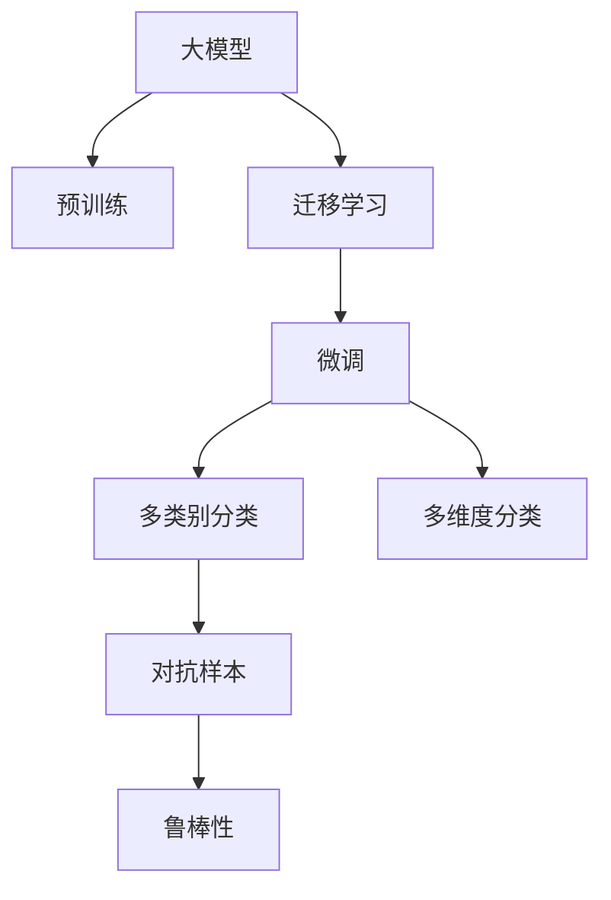

                 

# AI大模型如何优化电商平台的商品分类

在当今高速发展的电子商务市场中，商品分类是各大电商平台必须面对的重要问题。高效的分类系统不仅能提升用户体验，还能优化运营成本，促进销售增长。传统的商品分类方法往往依赖于专家知识，难以处理复杂的多类别和多维度分类任务。随着人工智能的兴起，大模型为电商平台提供了全新的解决方案，通过深度学习和自然语言处理技术，实现商品分类的自动化和智能化。本文将详细探讨AI大模型如何优化电商平台的商品分类，涵盖算法原理、操作步骤、应用场景等多个方面。

## 1. 背景介绍

### 1.1 问题由来

随着互联网和移动设备的普及，电子商务市场迎来了爆发式增长。与此同时，海量商品信息涌入电商平台，如何高效、准确地对商品进行分类，成为电商平台需要解决的重大挑战。传统的商品分类方法依赖于人工标注和专家知识，存在数据量大、成本高、易出错等问题。而通过AI大模型进行商品分类，能够实现自动化和智能化，极大地提高分类效率和准确性。

### 1.2 问题核心关键点

大模型通过预训练学习到丰富的语言和图像特征，利用这些特征进行商品分类时，通常包含以下几个关键点：

- 多类别和多维度分类：大模型能够处理复杂的多类别和多维度分类任务，如类别、尺寸、颜色等。
- 零样本和少样本学习：大模型能够在只有少量样本的情况下进行分类，实现高效的商品分类。
- 迁移学习和微调：大模型通过迁移学习和微调，能够从通用任务中学习到特定任务的分类知识，实现更准确的商品分类。
- 对抗样本和鲁棒性：大模型需要对对抗样本具有鲁棒性，以避免恶意攻击。

### 1.3 问题研究意义

通过AI大模型进行商品分类，对电商平台具有重要的研究意义：

1. 提升用户体验：快速、准确的商品分类，能显著提升用户的购物体验，增加用户满意度。
2. 优化运营成本：自动化的商品分类减少了人工标注的成本和误差，提高了运营效率。
3. 促进销售增长：准确的分类能更好地推荐相关商品，提高用户转化率，促进销售增长。
4. 增强市场竞争力：通过技术优势，电商平台能更好地满足用户需求，增强市场竞争力。
5. 拓展应用领域：大模型可以应用于多种电商场景，如搜索引擎优化、广告投放、个性化推荐等。

## 2. 核心概念与联系

### 2.1 核心概念概述

为了更好地理解大模型在电商平台中的应用，本节将介绍几个关键概念及其相互关系：

- 大模型：以BERT、GPT-3、DALL·E等为代表的深度学习模型，具有强大的语言和图像处理能力。
- 预训练：在大规模无标签数据上进行自监督学习，学习通用的语言和图像特征。
- 迁移学习：通过在大模型上微调特定任务的参数，实现从通用任务到特定任务的分类。
- 微调：在预训练模型的基础上，使用下游任务的少量标签数据进行有监督的参数优化，提升分类性能。
- 对抗样本：试图误导模型分类决策的恶意输入样本，需提高模型的鲁棒性。
- 鲁棒性：模型在对抗样本下仍能保持正确分类的能力。
- 多类别分类：将输入样本分为多个互斥类别的任务。
- 多维度分类：在多类别分类的基础上，进一步细分每个类别的特征，如颜色、尺寸等。

这些核心概念之间的逻辑关系可以通过以下Mermaid流程图展示：



这个流程图展示了大模型在电商平台中的核心概念及其相互关系：

1. 大模型通过预训练获得基础特征提取能力。
2. 迁移学习将大模型应用于特定任务，通过微调获得特定任务的分类知识。
3. 多类别和多维度分类是大模型在电商平台中的典型应用。
4. 对抗样本和鲁棒性是大模型在实际应用中需要考虑的重要问题。

## 3. 核心算法原理 & 具体操作步骤

### 3.1 算法原理概述

基于大模型的商品分类，通常采用迁移学习和微调的方法。其核心思想是：利用大模型在大规模数据上学习到的通用特征，通过微调特定任务的参数，使模型在特定任务上表现出色。

形式化地，假设大模型为 $M_{\theta}$，其中 $\theta$ 为预训练得到的模型参数。给定商品分类任务 $T$ 的标注数据集 $D=\{(x_i,y_i)\}_{i=1}^N$，其中 $x_i$ 为输入的图像或文本描述，$y_i$ 为对应的商品类别。微调的目标是找到新的模型参数 $\hat{\theta}$，使得：

$$
\hat{\theta}=\mathop{\arg\min}_{\theta} \mathcal{L}(M_{\theta},D)
$$

其中 $\mathcal{L}$ 为针对任务 $T$ 设计的损失函数，用于衡量模型预测输出与真实标签之间的差异。常见的损失函数包括交叉熵损失、均方误差损失等。

通过梯度下降等优化算法，微调过程不断更新模型参数 $\theta$，最小化损失函数 $\mathcal{L}$，使得模型输出逼近真实标签。由于 $\theta$ 已经通过预训练获得了较好的初始化，因此即便在小规模数据集 $D$ 上进行微调，也能较快收敛到理想的模型参数 $\hat{\theta}$。

### 3.2 算法步骤详解

基于大模型的商品分类通常包括以下几个关键步骤：

**Step 1: 准备预训练模型和数据集**
- 选择合适的预训练语言或图像模型 $M_{\theta}$ 作为初始化参数，如BERT、GPT、DALL·E等。
- 准备商品分类任务 $T$ 的标注数据集 $D$，划分为训练集、验证集和测试集。一般要求标注数据与预训练数据的分布不要差异过大。

**Step 2: 添加任务适配层**
- 根据任务类型，在预训练模型顶层设计合适的输出层和损失函数。
- 对于图像分类任务，通常在顶层添加线性分类器和交叉熵损失函数。
- 对于文本分类任务，通常使用语言模型的解码器输出概率分布，并以负对数似然为损失函数。

**Step 3: 设置微调超参数**
- 选择合适的优化算法及其参数，如 AdamW、SGD 等，设置学习率、批大小、迭代轮数等。
- 设置正则化技术及强度，包括权重衰减、Dropout、Early Stopping 等。
- 确定冻结预训练参数的策略，如仅微调顶层，或全部参数都参与微调。

**Step 4: 执行梯度训练**
- 将训练集数据分批次输入模型，前向传播计算损失函数。
- 反向传播计算参数梯度，根据设定的优化算法和学习率更新模型参数。
- 周期性在验证集上评估模型性能，根据性能指标决定是否触发 Early Stopping。
- 重复上述步骤直到满足预设的迭代轮数或 Early Stopping 条件。

**Step 5: 测试和部署**
- 在测试集上评估微调后模型 $M_{\hat{\theta}}$ 的性能，对比微调前后的精度提升。
- 使用微调后的模型对新样本进行推理预测，集成到实际的应用系统中。
- 持续收集新的数据，定期重新微调模型，以适应数据分布的变化。

以上是基于大模型进行商品分类的一般流程。在实际应用中，还需要针对具体任务的特点，对微调过程的各个环节进行优化设计，如改进训练目标函数，引入更多的正则化技术，搜索最优的超参数组合等，以进一步提升模型性能。

### 3.3 算法优缺点

基于大模型的商品分类方法具有以下优点：
1. 简单高效。只需准备少量标注数据，即可对预训练模型进行快速适配，获得较大的性能提升。
2. 通用适用。适用于各种电商平台的商品分类任务，设计简单的任务适配层即可实现微调。
3. 参数高效。利用参数高效微调技术，在固定大部分预训练权重不变的情况下，仍可取得不错的提升。
4. 效果显著。在学术界和工业界的诸多商品分类任务上，基于微调的方法已经刷新了最先进的性能指标。

同时，该方法也存在一定的局限性：
1. 依赖标注数据。微调的效果很大程度上取决于标注数据的质量和数量，获取高质量标注数据的成本较高。
2. 迁移能力有限。当目标任务与预训练数据的分布差异较大时，微调的性能提升有限。
3. 负面效果传递。预训练模型的固有偏见、有害信息等，可能通过微调传递到下游任务，造成负面影响。
4. 可解释性不足。微调模型的决策过程通常缺乏可解释性，难以对其推理逻辑进行分析和调试。

尽管存在这些局限性，但就目前而言，基于大模型的商品分类方法仍是目前最主流和有效的解决方案。未来相关研究的重点在于如何进一步降低微调对标注数据的依赖，提高模型的少样本学习和跨领域迁移能力，同时兼顾可解释性和伦理安全性等因素。

### 3.4 算法应用领域

基于大模型的商品分类方法在电商平台中的应用非常广泛，涉及商品搜索、推荐系统、广告投放等多个环节。以下是一些具体的应用场景：

1. 商品搜索：通过自然语言查询，大模型能够理解用户意图，从海量商品中筛选出最相关的结果，提升用户体验。

2. 推荐系统：大模型能够理解用户行为和商品特征，推荐相关商品，提高用户满意度。

3. 广告投放：大模型能够识别用户兴趣和商品特征，优化广告投放策略，提高广告效果。

4. 库存管理：通过商品分类，大模型能够帮助电商平台更好地管理库存，优化供应链。

5. 价格优化：大模型能够分析用户行为和市场趋势，优化商品定价策略，提升销售收益。

6. 风险控制：通过商品分类，大模型能够识别出恶意行为和风险商品，提升平台安全性。

这些应用场景展示了大模型在电商平台中的广泛价值，未来随着大模型的不断发展，其应用范围将进一步扩展。

## 4. 数学模型和公式 & 详细讲解 & 举例说明

### 4.1 数学模型构建

本节将使用数学语言对基于大模型的商品分类过程进行更加严格的刻画。

记大模型为 $M_{\theta}$，其中 $\theta$ 为模型参数。假设商品分类任务 $T$ 的训练集为 $D=\{(x_i,y_i)\}_{i=1}^N, x_i \in \mathcal{X}, y_i \in \mathcal{Y}$，其中 $\mathcal{X}$ 为输入空间，$\mathcal{Y}$ 为输出空间。

定义模型 $M_{\theta}$ 在输入 $x$ 上的损失函数为 $\ell(M_{\theta}(x),y)$，则在数据集 $D$ 上的经验风险为：

$$
\mathcal{L}(\theta) = \frac{1}{N} \sum_{i=1}^N \ell(M_{\theta}(x_i),y_i)
$$

微调的优化目标是最小化经验风险，即找到最优参数：

$$
\theta^* = \mathop{\arg\min}_{\theta} \mathcal{L}(\theta)
$$

在实践中，我们通常使用基于梯度的优化算法（如SGD、Adam等）来近似求解上述最优化问题。设 $\eta$ 为学习率，$\lambda$ 为正则化系数，则参数的更新公式为：

$$
\theta \leftarrow \theta - \eta \nabla_{\theta}\mathcal{L}(\theta) - \eta\lambda\theta
$$

其中 $\nabla_{\theta}\mathcal{L}(\theta)$ 为损失函数对参数 $\theta$ 的梯度，可通过反向传播算法高效计算。

### 4.2 公式推导过程

以下我们以图像分类任务为例，推导交叉熵损失函数及其梯度的计算公式。

假设模型 $M_{\theta}$ 在输入 $x$ 上的输出为 $\hat{y}=M_{\theta}(x) \in [0,1]$，表示样本属于每个类别的概率。真实标签 $y \in \{0,1\}$。则二分类交叉熵损失函数定义为：

$$
\ell(M_{\theta}(x),y) = -[y\log \hat{y} + (1-y)\log (1-\hat{y})]
$$

将其代入经验风险公式，得：

$$
\mathcal{L}(\theta) = -\frac{1}{N}\sum_{i=1}^N [y_i\log M_{\theta}(x_i)+(1-y_i)\log(1-M_{\theta}(x_i))]
$$

根据链式法则，损失函数对参数 $\theta_k$ 的梯度为：

$$
\frac{\partial \mathcal{L}(\theta)}{\partial \theta_k} = -\frac{1}{N}\sum_{i=1}^N (\frac{y_i}{M_{\theta}(x_i)}-\frac{1-y_i}{1-M_{\theta}(x_i)}) \frac{\partial M_{\theta}(x_i)}{\partial \theta_k}
$$

其中 $\frac{\partial M_{\theta}(x_i)}{\partial \theta_k}$ 可进一步递归展开，利用自动微分技术完成计算。

在得到损失函数的梯度后，即可带入参数更新公式，完成模型的迭代优化。重复上述过程直至收敛，最终得到适应商品分类任务的最优模型参数 $\theta^*$。

## 5. 项目实践：代码实例和详细解释说明

### 5.1 开发环境搭建

在进行商品分类微调实践前，我们需要准备好开发环境。以下是使用Python进行PyTorch开发的环境配置流程：

1. 安装Anaconda：从官网下载并安装Anaconda，用于创建独立的Python环境。

2. 创建并激活虚拟环境：
```bash
conda create -n pytorch-env python=3.8 
conda activate pytorch-env
```

3. 安装PyTorch：根据CUDA版本，从官网获取对应的安装命令。例如：
```bash
conda install pytorch torchvision torchaudio cudatoolkit=11.1 -c pytorch -c conda-forge
```

4. 安装各类工具包：
```bash
pip install numpy pandas scikit-learn matplotlib tqdm jupyter notebook ipython
```

完成上述步骤后，即可在`pytorch-env`环境中开始商品分类微调实践。

### 5.2 源代码详细实现

下面以图像分类任务为例，给出使用Transformers库对ResNet模型进行商品分类微调的PyTorch代码实现。

首先，定义商品分类任务的数据处理函数：

```python
from torch.utils.data import Dataset
import torch
from transformers import ResNetFeatureExtractor, ResNetForImageClassification

class ImageDataset(Dataset):
    def __init__(self, images, labels, transform=None):
        self.images = images
        self.labels = labels
        self.transform = transform
        
    def __len__(self):
        return len(self.images)
    
    def __getitem__(self, item):
        image = self.images[item]
        label = self.labels[item]
        
        if self.transform:
            image = self.transform(image)
        
        return {'image': image, 'label': label}
```

然后，定义模型和优化器：

```python
from transformers import AdamW

model = ResNetForImageClassification.from_pretrained('resnet18', num_labels=num_classes)

optimizer = AdamW(model.parameters(), lr=2e-5)
```

接着，定义训练和评估函数：

```python
from torch.utils.data import DataLoader
from tqdm import tqdm
import torch.nn.functional as F

device = torch.device('cuda') if torch.cuda.is_available() else torch.device('cpu')
model.to(device)

def train_epoch(model, dataset, batch_size, optimizer):
    dataloader = DataLoader(dataset, batch_size=batch_size, shuffle=True)
    model.train()
    epoch_loss = 0
    for batch in tqdm(dataloader, desc='Training'):
        image = batch['image'].to(device)
        label = batch['label'].to(device)
        model.zero_grad()
        outputs = model(image)
        loss = F.cross_entropy(outputs, label)
        epoch_loss += loss.item()
        loss.backward()
        optimizer.step()
    return epoch_loss / len(dataloader)

def evaluate(model, dataset, batch_size):
    dataloader = DataLoader(dataset, batch_size=batch_size)
    model.eval()
    preds, labels = [], []
    with torch.no_grad():
        for batch in tqdm(dataloader, desc='Evaluating'):
            image = batch['image'].to(device)
            label = batch['label'].to(device)
            batch_preds = model(image)
            preds.append(batch_preds.argmax(dim=1).cpu().tolist())
            labels.append(label.cpu().tolist())
                
    print(classification_report(labels, preds))
```

最后，启动训练流程并在测试集上评估：

```python
epochs = 5
batch_size = 16

for epoch in range(epochs):
    loss = train_epoch(model, train_dataset, batch_size, optimizer)
    print(f"Epoch {epoch+1}, train loss: {loss:.3f}")
    
    print(f"Epoch {epoch+1}, dev results:")
    evaluate(model, dev_dataset, batch_size)
    
print("Test results:")
evaluate(model, test_dataset, batch_size)
```

以上就是使用PyTorch对ResNet模型进行商品分类任务微调的完整代码实现。可以看到，得益于Transformers库的强大封装，我们可以用相对简洁的代码完成ResNet模型的加载和微调。

### 5.3 代码解读与分析

让我们再详细解读一下关键代码的实现细节：

**ImageDataset类**：
- `__init__`方法：初始化图像、标签等关键组件，可选参数为数据增强方式。
- `__len__`方法：返回数据集的样本数量。
- `__getitem__`方法：对单个样本进行处理，将图像和标签进行数据增强，返回模型所需的输入。

**ResNetForImageClassification模型**：
- `from_pretrained`方法：加载预训练的ResNet模型，并设置输出类别数。

**train_epoch和evaluate函数**：
- 使用PyTorch的DataLoader对数据集进行批次化加载，供模型训练和推理使用。
- 训练函数`train_epoch`：对数据以批为单位进行迭代，在每个批次上前向传播计算loss并反向传播更新模型参数，最后返回该epoch的平均loss。
- 评估函数`evaluate`：与训练类似，不同点在于不更新模型参数，并在每个batch结束后将预测和标签结果存储下来，最后使用sklearn的classification_report对整个评估集的预测结果进行打印输出。

**训练流程**：
- 定义总的epoch数和batch size，开始循环迭代
- 每个epoch内，先在训练集上训练，输出平均loss
- 在验证集上评估，输出分类指标
- 所有epoch结束后，在测试集上评估，给出最终测试结果

可以看到，PyTorch配合Transformers库使得商品分类微调的代码实现变得简洁高效。开发者可以将更多精力放在数据处理、模型改进等高层逻辑上，而不必过多关注底层的实现细节。

当然，工业级的系统实现还需考虑更多因素，如模型的保存和部署、超参数的自动搜索、更灵活的任务适配层等。但核心的微调范式基本与此类似。

## 6. 实际应用场景

### 6.1 智能搜索

通过大模型的商品分类，电商平台可以实现更高效的智能搜索。用户输入查询词后，大模型能够理解查询意图，从海量商品中筛选出最相关的结果，提升用户体验。

具体而言，可以使用微调后的模型对用户查询进行分词、编码，然后通过查询-商品对的匹配度进行排序，输出最相关的商品。此外，大模型还可以通过多轮对话，理解用户的复杂需求，提供更精准的商品推荐。

### 6.2 推荐系统

电商平台的推荐系统通过大模型的商品分类，可以实现更个性化的商品推荐。大模型能够理解用户行为和商品特征，推荐相关商品，提高用户满意度。

推荐系统通常使用用户行为数据和商品分类结果作为输入，通过协同过滤、内容推荐等多种算法，输出个性化的商品推荐列表。微调后的模型可以显著提升推荐系统的准确性和个性化程度。

### 6.3 广告投放

大模型的商品分类技术可以用于电商平台的广告投放优化。通过分析用户行为和商品特征，大模型能够识别出用户兴趣和潜在需求，优化广告投放策略，提高广告效果。

广告投放系统可以使用用户行为数据、商品分类结果等作为输入，通过多目标优化算法，自动调整广告投放位置、时间、频率等参数，实现最优的广告效果。

### 6.4 风险控制

电商平台的商品分类技术可以用于风险控制。通过大模型的商品分类，平台可以识别出恶意行为和风险商品，提升平台安全性。

例如，电商平台可以通过分析用户的购买行为和商品分类结果，识别出疑似恶意交易或虚假商品，进行风险预警和处理。这不仅能减少平台的经济损失，还能提升用户信任度，增强平台竞争力。

### 6.5 库存管理

大模型的商品分类技术可以用于电商平台的库存管理。通过分析商品分类结果和销售数据，平台可以更好地管理库存，优化供应链。

库存管理系统可以使用商品分类结果预测未来销售趋势，优化库存量和补货计划，避免库存积压和断货。同时，通过商品分类结果优化物流配送路径，提升配送效率，降低运营成本。

### 6.6 个性化推荐

大模型的商品分类技术可以用于个性化推荐。通过分析用户行为和商品特征，大模型能够推荐相关商品，提升用户满意度。

个性化推荐系统可以使用用户行为数据、商品分类结果等作为输入，通过协同过滤、内容推荐等多种算法，输出个性化的商品推荐列表。微调后的模型可以显著提升推荐系统的准确性和个性化程度。

## 7. 工具和资源推荐

### 7.1 学习资源推荐

为了帮助开发者系统掌握大模型在商品分类中的应用，这里推荐一些优质的学习资源：

1. 《Transformer from Scratch》系列博文：由大模型技术专家撰写，深入浅出地介绍了Transformer原理、ResNet模型、微调技术等前沿话题。

2. CS231n《Convolutional Neural Networks for Visual Recognition》课程：斯坦福大学开设的计算机视觉经典课程，有Lecture视频和配套作业，帮助你深入理解图像分类和商品分类的技术细节。

3. 《Natural Language Processing with Transformers》书籍：Transformers库的作者所著，全面介绍了如何使用Transformers库进行NLP任务开发，包括商品分类在内的多个范式。

4. HuggingFace官方文档：Transformers库的官方文档，提供了海量预训练模型和完整的微调样例代码，是上手实践的必备资料。

5. ImageNet dataset：最常用的图像分类数据集之一，包含了大量的标注图像和类别信息，是商品分类微调的重要数据源。

通过对这些资源的学习实践，相信你一定能够快速掌握大模型在电商平台中的应用，并用于解决实际的商品分类问题。

### 7.2 开发工具推荐

高效的开发离不开优秀的工具支持。以下是几款用于商品分类微调开发的常用工具：

1. PyTorch：基于Python的开源深度学习框架，灵活动态的计算图，适合快速迭代研究。大部分预训练语言或图像模型都有PyTorch版本的实现。

2. TensorFlow：由Google主导开发的开源深度学习框架，生产部署方便，适合大规模工程应用。同样有丰富的预训练语言或图像模型资源。

3. Transformers库：HuggingFace开发的NLP工具库，集成了众多SOTA语言或图像模型，支持PyTorch和TensorFlow，是进行微调任务开发的利器。

4. Weights & Biases：模型训练的实验跟踪工具，可以记录和可视化模型训练过程中的各项指标，方便对比和调优。与主流深度学习框架无缝集成。

5. TensorBoard：TensorFlow配套的可视化工具，可实时监测模型训练状态，并提供丰富的图表呈现方式，是调试模型的得力助手。

6. Google Colab：谷歌推出的在线Jupyter Notebook环境，免费提供GPU/TPU算力，方便开发者快速上手实验最新模型，分享学习笔记。

合理利用这些工具，可以显著提升商品分类微调任务的开发效率，加快创新迭代的步伐。

### 7.3 相关论文推荐

大模型在商品分类中的应用源于学界的持续研究。以下是几篇奠基性的相关论文，推荐阅读：

1. Bottleneck Design of ResNet：提出ResNet的瓶颈结构，大幅提升了模型性能和训练效率，奠定了ResNet在图像分类中的应用基础。

2. Pretrained Image Models are Transferable to Natural Language Processing：证明预训练的图像模型可以迁移到自然语言处理任务，为跨模态学习提供了理论支持。

3. Understanding the Difficulties of Transfer Learning for Computer Vision：分析了在自然语言处理任务中使用预训练图像模型的困难，提出了多种改进方法。

4. A Simple Baseline for Transfer Learning on Natural Language Processing Tasks：提出了一种简单的迁移学习方法，展示了预训练模型在自然语言处理任务上的强大能力。

5. Attention is All You Need：提出了Transformer结构，开启了NLP领域的预训练大模型时代，为商品分类等任务提供了新思路。

这些论文代表了大模型在商品分类中的应用和发展脉络。通过学习这些前沿成果，可以帮助研究者把握学科前进方向，激发更多的创新灵感。

## 8. 总结：未来发展趋势与挑战

### 8.1 总结

本文对基于大模型的商品分类方法进行了全面系统的介绍。首先阐述了商品分类的背景和意义，明确了大模型在商品分类中的重要作用。其次，从原理到实践，详细讲解了商品分类过程的数学模型和关键步骤，给出了微调任务开发的完整代码实例。同时，本文还广泛探讨了商品分类技术在智能搜索、推荐系统、广告投放等多个电商场景中的应用前景，展示了大模型的广泛价值。此外，本文精选了微调技术的各类学习资源，力求为读者提供全方位的技术指引。

通过本文的系统梳理，可以看到，基于大模型的商品分类方法正在成为电商平台的重要范式，极大地提升了商品分类的自动化和智能化水平，为电商平台带来了显著的业务价值。未来随着大模型的不断发展，商品分类的应用范围将进一步扩展，在更多电商场景中发挥重要作用。

### 8.2 未来发展趋势

展望未来，大模型在商品分类中的应用将呈现以下几个发展趋势：

1. 模型规模持续增大。随着算力成本的下降和数据规模的扩张，预训练模型和微调模型的参数量还将持续增长。超大规模模型蕴含的丰富特征，将大幅提升商品分类的准确性和鲁棒性。

2. 微调方法日趋多样。除了传统的全参数微调外，未来会涌现更多参数高效的微调方法，如LoRA等，在节省计算资源的同时也能保证微调精度。

3. 数据增强和对抗训练成为常态。数据增强和对抗训练将进一步提升模型的泛化能力和鲁棒性，减少对抗样本的影响。

4. 多模态分类崛起。未来的商品分类不仅依赖于图像和文本，还将融合语音、视频等多种模态信息，实现更加全面和深入的商品分类。

5. 知识增强和上下文建模成为重要方向。未来的商品分类将更加注重知识增强和上下文建模，将先验知识和上下文信息与神经网络模型结合，提升分类性能。

6. 可解释性和公平性成为研究热点。未来的商品分类模型需要更高的可解释性和公平性，避免算法偏见和歧视，确保分类的公平和透明。

这些趋势凸显了大模型在商品分类中的广阔前景。这些方向的探索发展，必将进一步提升商品分类的准确性和智能化水平，为电商平台带来更大的商业价值。

### 8.3 面临的挑战

尽管大模型在商品分类中的应用已经取得了显著成效，但在迈向更加智能化、普适化应用的过程中，它仍面临着诸多挑战：

1. 标注成本瓶颈。尽管微调大大降低了标注数据的需求，但对于长尾商品或特殊场景，获取高质量标注数据的成本仍然较高。如何进一步降低微调对标注样本的依赖，将是一大难题。

2. 模型鲁棒性不足。当前商品分类模型面对域外数据时，泛化性能往往大打折扣。对于测试样本的微小扰动，模型的预测也容易发生波动。如何提高模型的鲁棒性，避免灾难性遗忘，还需要更多理论和实践的积累。

3. 推理效率有待提高。超大批次的训练和推理可能遇到显存不足的问题。如何在保证性能的同时，简化模型结构，提升推理速度，优化资源占用，将是重要的优化方向。

4. 可解释性亟需加强。当前商品分类模型通常缺乏可解释性，难以解释其内部工作机制和决策逻辑。对于医疗、金融等高风险应用，算法的可解释性和可审计性尤为重要。

5. 安全性有待保障。预训练模型难免会学习到有偏见、有害的信息，通过微调传递到商品分类中，可能产生误导性、歧视性的输出。如何从数据和算法层面消除模型偏见，避免恶意用途，确保输出的安全性，也将是重要的研究课题。

6. 知识整合能力不足。现有的商品分类模型往往局限于任务内数据，难以灵活吸收和运用更广泛的先验知识。如何让微调过程更好地与外部知识库、规则库等专家知识结合，形成更加全面、准确的信息整合能力，还有很大的想象空间。

正视商品分类面临的这些挑战，积极应对并寻求突破，将是大模型在商品分类中走向成熟的必由之路。相信随着学界和产业界的共同努力，这些挑战终将一一被克服，大模型在商品分类中将发挥更大的作用。

### 8.4 研究展望

面向未来，商品分类技术需要从以下几个方面进行突破：

1. 探索无监督和半监督微调方法。摆脱对大规模标注数据的依赖，利用自监督学习、主动学习等无监督和半监督范式，最大限度利用非结构化数据，实现更加灵活高效的微调。

2. 研究参数高效和计算高效的微调范式。开发更加参数高效的微调方法，在固定大部分预训练参数的情况下，只更新极少量的任务相关参数。同时优化微调模型的计算图，减少前向传播和反向传播的资源消耗，实现更加轻量级、实时性的部署。

3. 融合因果和对比学习范式。通过引入因果推断和对比学习思想，增强商品分类模型建立稳定因果关系的能力，学习更加普适、鲁棒的语言表征，从而提升模型泛化性和抗干扰能力。

4. 引入更多先验知识。将符号化的先验知识，如知识图谱、逻辑规则等，与神经网络模型进行巧妙融合，引导微调过程学习更准确、合理的语言模型。同时加强不同模态数据的整合，实现视觉、语音等多模态信息与文本信息的协同建模。

5. 结合因果分析和博弈论工具。将因果分析方法引入商品分类模型，识别出模型决策的关键特征，增强输出解释的因果性和逻辑性。借助博弈论工具刻画人机交互过程，主动探索并规避模型的脆弱点，提高系统稳定性。

6. 纳入伦理道德约束。在模型训练目标中引入伦理导向的评估指标，过滤和惩罚有偏见、有害的输出倾向。同时加强人工干预和审核，建立模型行为的监管机制，确保输出符合人类价值观和伦理道德。

这些研究方向的探索，必将引领商品分类技术迈向更高的台阶，为电商平台带来更大的商业价值。面向未来，商品分类技术还需要与其他人工智能技术进行更深入的融合，如知识表示、因果推理、强化学习等，多路径协同发力，共同推动商品分类系统的进步。只有勇于创新、敢于突破，才能不断拓展大模型的应用边界，让智能技术更好地造福电商平台。

## 9. 附录：常见问题与解答

**Q1：商品分类任务中，数据增强有哪些方法？**

A: 商品分类任务中，数据增强方法主要包括以下几种：

1. 随机裁剪：随机裁剪图像，生成不同尺寸和角度的裁剪图像，增加数据多样性。

2. 随机旋转：随机旋转图像，生成不同角度的图像，增加数据多样性。

3. 随机翻转：随机水平或垂直翻转图像，生成不同方向的图像，增加数据多样性。

4. 随机缩放：随机缩放图像，生成不同尺寸的图像，增加数据多样性。

5. 随机噪声：在图像上添加随机噪声，生成不同的噪声图像，增加数据多样性。

6. 随机颜色变换：随机改变图像的颜色通道、亮度、对比度等，生成不同的颜色图像，增加数据多样性。

这些数据增强方法可以帮助模型学习到更丰富的特征，提升商品分类的准确性。

**Q2：商品分类任务中，如何选择预训练模型？**

A: 商品分类任务中，选择预训练模型的关键在于其特征提取能力。以下是几种常用的预训练模型及其特点：

1. ResNet：用于图像分类任务，具有强大的特征提取能力，适用于高分辨率图像分类。

2. BERT：用于文本分类任务，具有强大的语言理解能力，适用于自然语言处理任务。

3. GPT-3：用于生成任务，具有强大的自然语言生成能力，适用于文本摘要、对话系统等任务。

4. DALL·E：用于图像生成任务，具有强大的图像生成能力，适用于生成式商品推荐等任务。

根据任务类型选择合适的预训练模型，可以有效提升商品分类的性能。

**Q3：商品分类任务中，微调模型的超参数如何设置？**

A: 商品分类任务中，微调模型的超参数设置需要根据具体任务进行优化，以下是一些常用的超参数设置方法：

1. 学习率：微调学习率一般要比预训练时小1-2个数量级，建议使用warmup策略，在开始阶段使用较小的学习率，再逐渐过渡到预设值。

2. 批大小：批大小通常设置为32或64，过小的批大小可能导致过拟合，过大的批大小可能导致内存不足。

3. 迭代轮数：迭代轮数通常设置为10-100次，过少的迭代轮数可能导致未收敛，过多的迭代轮数可能导致过拟合。

4. 正则化：正则化技术如L2正则、Dropout、Early Stopping等，可以有效防止过拟合。

5. 数据增强：数据增强技术如随机裁剪、随机旋转等，可以增加数据多样性，提升模型泛化能力。

这些超参数需要根据具体任务进行灵活调整，通过实验寻找最优超参数组合。

**Q4：商品分类任务中，如何处理长尾商品？**

A: 商品分类任务中，处理长尾商品的方法主要包括以下几种：

1. 多标签分类：长尾商品通常属于多个类别，可以使用多标签分类方法，将每个商品标记为多个类别，提升分类准确性。

2. 数据增强：长尾商品数量较少，可以使用数据增强技术，如随机裁剪、随机旋转等，生成更多的长尾商品样本。

3. 迁移学习：将大模型在通用数据集上预训练的特征提取能力应用到长尾商品分类中，提升长尾商品的分类能力。

4. 对抗样本训练：使用对抗样本训练技术，生成对抗样本，增强模型对长尾商品的分类能力。

5. 知识增强：引入先验知识，如知识图谱、逻辑规则等，提升长尾商品的分类能力。

这些方法可以有效处理长尾商品，提升商品分类的全面性和准确性。

**Q5：商品分类任务中，如何提升模型的鲁棒性？**

A: 商品分类任务中，提升模型的鲁棒性需要从多个方面进行优化，以下是一些常用的方法：

1. 对抗样本训练：使用对抗样本训练技术，生成对抗样本，增强模型对噪声和干扰的鲁棒性。

2. 正则化：使用L2正则、Dropout等正则化技术，防止模型过拟合，提升模型的泛化能力。

3. 数据增强：使用数据增强技术，如随机裁剪、随机旋转等，生成更多的数据，提升模型的鲁棒性。

4. 多模型集成：训练多个微调模型，取平均输出，抑制过拟合，提升模型的鲁棒性。

5. 对抗训练：使用对抗训练技术，生成对抗样本，增强模型对噪声和干扰的鲁棒性。

这些方法可以有效提升模型的鲁棒性，防止模型在实际应用中产生错误分类。

---

作者：禅与计算机程序设计艺术 / Zen and the Art of Computer Programming

