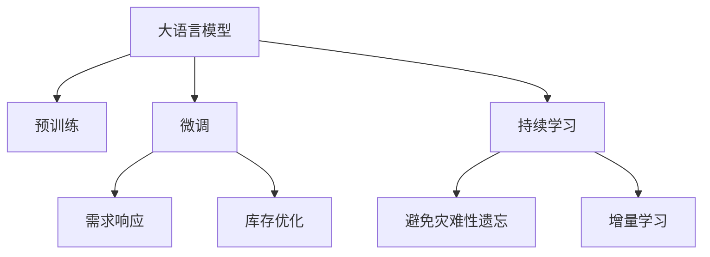

                 

# AI大模型如何优化电商平台的库存管理

> 关键词：大语言模型,库存管理,电商平台,预测算法,需求响应,优化策略

## 1. 背景介绍

### 1.1 问题由来

在当今电商行业，库存管理成为商家运营成功的关键因素之一。过高的库存会增加资金占用和仓储成本，而过低的库存则可能导致客户订单无法满足，影响销售和客户满意度。此外，库存的准确性直接影响商家的财务状况和盈利能力。因此，如何优化库存管理，成为一个亟待解决的问题。

### 1.2 问题核心关键点

库存管理的核心在于实现对库存量的精确预测，并及时响应市场需求。传统方法往往依赖历史数据和专家经验，难以准确把握未来的市场需求和库存变化。而人工智能技术，尤其是大语言模型和大数据算法，为库存管理带来了新的可能性。

大语言模型通过大规模无标签数据的预训练，学习到丰富的语言知识和常识，可以处理和理解自然语言文本，从而在电商平台上实现智能化的库存预测和优化。本文将系统介绍如何利用大语言模型优化电商平台库存管理的全流程，涵盖数据准备、模型训练、策略优化和部署实施等环节。

## 2. 核心概念与联系

### 2.1 核心概念概述

为更好地理解大语言模型如何优化库存管理，本节将介绍几个密切相关的核心概念：

- 大语言模型(Large Language Model, LLM)：以自回归(如GPT)或自编码(如BERT)模型为代表的大规模预训练语言模型。通过在大规模无标签文本语料上进行预训练，学习通用的语言表示，具备强大的语言理解和生成能力。

- 预训练(Pre-training)：指在大规模无标签文本语料上，通过自监督学习任务训练通用语言模型的过程。常见的预训练任务包括言语建模、遮挡语言模型等。

- 微调(Fine-tuning)：指在预训练模型的基础上，使用下游任务的少量标注数据，通过有监督学习优化模型在特定任务上的性能。通常只需要调整顶层分类器或解码器，并以较小的学习率更新全部或部分的模型参数。

- 需求响应(Demand Response)：指通过模型预测实时市场需求变化，及时调整库存策略，实现库存量与市场需求之间的动态平衡。

- 库存优化(Optimization)：指基于预测结果，制定合理的库存补货、出库、促销等策略，最小化库存成本，最大化销售收益。

- 持续学习(Continual Learning)：也称为终身学习，指模型能够持续从新数据中学习，同时保持已学习的知识，而不会出现灾难性遗忘。这对于保持大语言模型的时效性和适应性至关重要。

这些核心概念之间的逻辑关系可以通过以下Mermaid流程图来展示：



这个流程图展示了大语言模型的核心概念及其之间的关系：

1. 大语言模型通过预训练获得基础能力。
2. 微调是对预训练模型进行任务特定的优化，优化模型在特定任务上的性能。
3. 需求响应模型基于微调后的模型，实时预测市场需求变化。
4. 库存优化策略通过需求响应结果，调整库存量，优化库存管理。
5. 持续学习确保模型能够不断学习新知识，保持时效性。

这些概念共同构成了大语言模型优化库存管理的框架，使其能够实现智能化、动态化的库存管理。

## 3. 核心算法原理 & 具体操作步骤
### 3.1 算法原理概述

基于大语言模型优化电商平台库存管理，本质上是一个有监督的细粒度迁移学习过程。其核心思想是：将预训练的大语言模型视作一个强大的"特征提取器"，通过在电商平台上标注的销售数据上进行有监督的微调，使得模型输出能够匹配市场需求变化，从而实现精确的库存预测和优化。

形式化地，假设预训练模型为 $M_{\theta}$，其中 $\theta$ 为预训练得到的模型参数。给定电商平台的销售历史数据集 $D=\{(t_i, s_i)\}_{i=1}^N, t_i$ 表示时间点，$s_i$ 表示在该时间点的销售量。微调的目标是找到新的模型参数 $\hat{\theta}$，使得：

$$
\hat{\theta}=\mathop{\arg\min}_{\theta} \mathcal{L}(M_{\theta},D)
$$

其中 $\mathcal{L}$ 为针对需求预测任务设计的损失函数，用于衡量模型预测销售量与真实销售量之间的差异。常见的损失函数包括均方误差损失、绝对误差损失等。

通过梯度下降等优化算法，微调过程不断更新模型参数 $\theta$，最小化损失函数 $\mathcal{L}$，使得模型输出逼近真实销售量。由于 $\theta$ 已经通过预训练获得了较好的初始化，因此即便在电商平台的销售数据上仅进行微调，也能较快收敛到理想的模型参数 $\hat{\theta}$。

### 3.2 算法步骤详解

基于大语言模型优化电商平台库存管理的一般流程包括以下几个关键步骤：

**Step 1: 准备预训练模型和数据集**
- 选择合适的预训练语言模型 $M_{\theta}$ 作为初始化参数，如 BERT、GPT 等。
- 收集电商平台的销售历史数据集 $D$，划分为训练集、验证集和测试集。一般要求销售数据的分布不要差异过大，以避免模型过拟合。

**Step 2: 添加任务适配层**
- 根据销售数据的特点，在预训练模型顶层设计合适的输出层和损失函数。
- 对于销售量预测任务，通常在顶层添加线性回归层和均方误差损失函数。
- 对于销售趋势预测任务，可以加入时间序列预测的损失函数。

**Step 3: 设置微调超参数**
- 选择合适的优化算法及其参数，如 AdamW、SGD 等，设置学习率、批大小、迭代轮数等。
- 设置正则化技术及强度，包括权重衰减、Dropout、Early Stopping等，防止模型过度适应小规模训练集。
- 确定冻结预训练参数的策略，如仅微调顶层，或全部参数都参与微调。

**Step 4: 执行梯度训练**
- 将训练集数据分批次输入模型，前向传播计算损失函数。
- 反向传播计算参数梯度，根据设定的优化算法和学习率更新模型参数。
- 周期性在验证集上评估模型性能，根据性能指标决定是否触发 Early Stopping。
- 重复上述步骤直到满足预设的迭代轮数或 Early Stopping 条件。

**Step 5: 测试和部署**
- 在测试集上评估微调后模型 $M_{\hat{\theta}}$ 的性能，对比微调前后的精度提升。
- 使用微调后的模型对新时间点的销售量进行预测，集成到实际的应用系统中。
- 持续收集新的销售数据，定期重新微调模型，以适应数据分布的变化。

以上是基于大语言模型优化库存管理的一般流程。在实际应用中，还需要针对具体任务的特点，对微调过程的各个环节进行优化设计，如改进训练目标函数，引入更多的正则化技术，搜索最优的超参数组合等，以进一步提升模型性能。

### 3.3 算法优缺点

基于大语言模型优化库存管理的方法具有以下优点：
1. 数据需求小。相比从头训练模型，微调方法只需要少量标注数据，减少对历史销售数据的依赖。
2. 精度高。预训练大模型拥有丰富的语言知识，能够更好地理解自然语言，提升预测准确性。
3. 动态更新。通过持续学习机制，模型能够及时反映市场需求的变化，保持预测结果的时效性。
4. 易于部署。微调模型通常比从头训练的模型更加轻量级，适合实时部署和在线推理。

同时，该方法也存在一定的局限性：
1. 依赖数据质量。微调模型对输入数据的噪声和异常值敏感，需要高质量的标注数据和清洗步骤。
2. 泛化能力有限。当目标任务与预训练数据的分布差异较大时，微调的性能提升有限。
3. 计算资源要求高。预训练大模型的参数量庞大，对硬件和算力要求较高，增加了成本。
4. 过拟合风险。当数据集较小或模型参数较多时，可能出现模型过拟合的问题。
5. 可解释性不足。微调模型决策过程的复杂性，使得其可解释性较差。

尽管存在这些局限性，但就目前而言，基于大语言模型的微调方法仍是最主流的库存管理优化范式。未来相关研究的重点在于如何进一步降低对标注数据的依赖，提高模型的泛化能力和可解释性，同时兼顾动态性和实时性。

### 3.4 算法应用领域

基于大语言模型优化库存管理的方法，在电商平台的应用领域已经得到了广泛的应用，例如：

- 库存预测：根据历史销售数据预测未来销售量，优化库存水平。
- 需求分析：分析客户购买行为和趋势，调整库存策略。
- 销售趋势预测：预测未来销售趋势，提前调整库存和营销策略。
- 促销优化：根据预测结果，合理制定促销活动的时间和范围，提升销售效果。
- 库存动态调整：实时响应市场需求变化，动态调整库存补货计划。

除了上述这些经典应用外，大语言模型在电商平台的库存管理中还可以用于供应链优化、物流调度、商品推荐等诸多场景，为电商平台的运营效率和客户满意度提升带来新的突破。

## 4. 数学模型和公式 & 详细讲解 & 举例说明
### 4.1 数学模型构建

本节将使用数学语言对基于大语言模型优化库存管理的预测过程进行更加严格的刻画。

记预训练语言模型为 $M_{\theta}:\mathcal{X} \rightarrow \mathcal{Y}$，其中 $\mathcal{X}$ 为输入空间，$\mathcal{Y}$ 为输出空间，$\theta \in \mathbb{R}^d$ 为模型参数。假设电商平台的历史销售数据集为 $D=\{(t_i, s_i)\}_{i=1}^N, t_i \in \mathbb{R}, s_i \in \mathbb{R}^+$，其中 $t_i$ 表示时间点，$s_i$ 表示在该时间点的销售量。

定义模型 $M_{\theta}$ 在时间点 $t_i$ 上的预测输出为 $\hat{s}_i=M_{\theta}(t_i)$，则在数据集 $D$ 上的经验风险为：

$$
\mathcal{L}(\theta) = \frac{1}{N}\sum_{i=1}^N (s_i - \hat{s}_i)^2
$$

微调的优化目标是最小化经验风险，即找到最优参数：

$$
\theta^* = \mathop{\arg\min}_{\theta} \mathcal{L}(\theta)
$$

在实践中，我们通常使用基于梯度的优化算法（如SGD、Adam等）来近似求解上述最优化问题。设 $\eta$ 为学习率，$\lambda$ 为正则化系数，则参数的更新公式为：

$$
\theta \leftarrow \theta - \eta \nabla_{\theta}\mathcal{L}(\theta) - \eta\lambda\theta
$$

其中 $\nabla_{\theta}\mathcal{L}(\theta)$ 为损失函数对参数 $\theta$ 的梯度，可通过反向传播算法高效计算。

### 4.2 公式推导过程

以下我们以销售量预测任务为例，推导均方误差损失函数及其梯度的计算公式。

假设模型 $M_{\theta}$ 在时间点 $t_i$ 上的预测输出为 $\hat{s}_i$，真实销售量为 $s_i$。则均方误差损失函数定义为：

$$
\ell(s_i, \hat{s}_i) = \frac{1}{2}(s_i - \hat{s}_i)^2
$$

将其代入经验风险公式，得：

$$
\mathcal{L}(\theta) = \frac{1}{N}\sum_{i=1}^N \frac{1}{2}(s_i - \hat{s}_i)^2
$$

根据链式法则，损失函数对参数 $\theta_k$ 的梯度为：

$$
\frac{\partial \mathcal{L}(\theta)}{\partial \theta_k} = \frac{1}{N}\sum_{i=1}^N \frac{1}{2}(s_i - \hat{s}_i)(-\frac{\partial \hat{s}_i}{\partial \theta_k})
$$

其中 $\frac{\partial \hat{s}_i}{\partial \theta_k}$ 可进一步递归展开，利用自动微分技术完成计算。

在得到损失函数的梯度后，即可带入参数更新公式，完成模型的迭代优化。重复上述过程直至收敛，最终得到适应电商平台的销售预测模型参数 $\theta^*$。

## 5. 项目实践：代码实例和详细解释说明
### 5.1 开发环境搭建

在进行库存管理优化实践前，我们需要准备好开发环境。以下是使用Python进行PyTorch开发的环境配置流程：

1. 安装Anaconda：从官网下载并安装Anaconda，用于创建独立的Python环境。

2. 创建并激活虚拟环境：
```bash
conda create -n pytorch-env python=3.8 
conda activate pytorch-env
```

3. 安装PyTorch：根据CUDA版本，从官网获取对应的安装命令。例如：
```bash
conda install pytorch torchvision torchaudio cudatoolkit=11.1 -c pytorch -c conda-forge
```

4. 安装Transformers库：
```bash
pip install transformers
```

5. 安装各类工具包：
```bash
pip install numpy pandas scikit-learn matplotlib tqdm jupyter notebook ipython
```

完成上述步骤后，即可在`pytorch-env`环境中开始库存管理优化的实践。

### 5.2 源代码详细实现

下面我们以库存预测任务为例，给出使用Transformers库对BERT模型进行库存优化的PyTorch代码实现。

首先，定义销售预测的数据处理函数：

```python
from transformers import BertTokenizer
from torch.utils.data import Dataset
import torch

class SalesDataset(Dataset):
    def __init__(self, dates, sales, tokenizer, max_len=128):
        self.dates = dates
        self.sales = sales
        self.tokenizer = tokenizer
        self.max_len = max_len
        
    def __len__(self):
        return len(self.dates)
    
    def __getitem__(self, item):
        date = self.dates[item]
        sale = self.sales[item]
        
        encoding = self.tokenizer(date, return_tensors='pt', max_length=self.max_len, padding='max_length', truncation=True)
        input_ids = encoding['input_ids'][0]
        attention_mask = encoding['attention_mask'][0]
        
        # 对日期进行token-wise编码
        encoded_date = [tokenizer.get_vocab()[date]] 
        encoded_date.extend([tokenizer.get_vocab()['[PAD]']] * (self.max_len - len(encoded_date)))
        encoded_date = torch.tensor(encoded_date, dtype=torch.long)
        
        return {'input_ids': input_ids, 
                'attention_mask': attention_mask,
                'labels': encoded_date}

# 创建dataset
tokenizer = BertTokenizer.from_pretrained('bert-base-cased')

train_dataset = SalesDataset(train_dates, train_sales, tokenizer)
dev_dataset = SalesDataset(dev_dates, dev_sales, tokenizer)
test_dataset = SalesDataset(test_dates, test_sales, tokenizer)
```

然后，定义模型和优化器：

```python
from transformers import BertForRegression
from torch.optim import AdamW

model = BertForRegression.from_pretrained('bert-base-cased', num_labels=1)

optimizer = AdamW(model.parameters(), lr=2e-5)
```

接着，定义训练和评估函数：

```python
from torch.utils.data import DataLoader
from tqdm import tqdm
from sklearn.metrics import mean_squared_error

device = torch.device('cuda') if torch.cuda.is_available() else torch.device('cpu')
model.to(device)

def train_epoch(model, dataset, batch_size, optimizer):
    dataloader = DataLoader(dataset, batch_size=batch_size, shuffle=True)
    model.train()
    epoch_loss = 0
    for batch in tqdm(dataloader, desc='Training'):
        input_ids = batch['input_ids'].to(device)
        attention_mask = batch['attention_mask'].to(device)
        labels = batch['labels'].to(device)
        model.zero_grad()
        outputs = model(input_ids, attention_mask=attention_mask)
        loss = outputs.loss
        epoch_loss += loss.item()
        loss.backward()
        optimizer.step()
    return epoch_loss / len(dataloader)

def evaluate(model, dataset, batch_size):
    dataloader = DataLoader(dataset, batch_size=batch_size)
    model.eval()
    mse = 0
    with torch.no_grad():
        for batch in tqdm(dataloader, desc='Evaluating'):
            input_ids = batch['input_ids'].to(device)
            attention_mask = batch['attention_mask'].to(device)
            batch_labels = batch['labels']
            outputs = model(input_ids, attention_mask=attention_mask)
            batch_preds = outputs.predictions
            batch_mse = mean_squared_error(batch_labels, batch_preds)
            mse += batch_mse
    return mse / len(dataloader)

```

最后，启动训练流程并在测试集上评估：

```python
epochs = 5
batch_size = 16

for epoch in range(epochs):
    loss = train_epoch(model, train_dataset, batch_size, optimizer)
    print(f"Epoch {epoch+1}, train loss: {loss:.3f}")
    
    print(f"Epoch {epoch+1}, dev mse: {evaluate(model, dev_dataset, batch_size):.3f}")
    
print("Epoch {epoch+1}, test mse: {evaluate(model, test_dataset, batch_size):.3f}")
```

以上就是使用PyTorch对BERT进行库存预测的完整代码实现。可以看到，得益于Transformers库的强大封装，我们可以用相对简洁的代码完成BERT模型的加载和微调。

### 5.3 代码解读与分析

让我们再详细解读一下关键代码的实现细节：

**SalesDataset类**：
- `__init__`方法：初始化日期、销售数据、分词器等关键组件。
- `__len__`方法：返回数据集的样本数量。
- `__getitem__`方法：对单个样本进行处理，将日期输入编码为token ids，将销售数据编码为数字，并对其进行定长padding，最终返回模型所需的输入。

**预测模型BertForRegression**：
- 基于Bert模型，设计了单标签回归任务的适配层，包括线性回归头和均方误差损失函数。

**模型训练函数train_epoch**：
- 使用PyTorch的DataLoader对数据集进行批次化加载，供模型训练和推理使用。
- 在每个epoch中，对数据以批为单位进行迭代，在每个批次上前向传播计算loss并反向传播更新模型参数。

**模型评估函数evaluate**：
- 与训练类似，不同点在于不更新模型参数，并在每个batch结束后将预测和标签结果存储下来，最后使用sklearn的mse对整个评估集的预测结果进行打印输出。

**训练流程**：
- 定义总的epoch数和batch size，开始循环迭代
- 每个epoch内，先在训练集上训练，输出平均loss
- 在验证集上评估，输出mse
- 所有epoch结束后，在测试集上评估，给出最终测试结果

可以看到，PyTorch配合Transformers库使得BERT微调的代码实现变得简洁高效。开发者可以将更多精力放在数据处理、模型改进等高层逻辑上，而不必过多关注底层的实现细节。

当然，工业级的系统实现还需考虑更多因素，如模型的保存和部署、超参数的自动搜索、更灵活的任务适配层等。但核心的微调范式基本与此类似。

## 6. 实际应用场景
### 6.1 智能库存预警

基于大语言模型优化的库存管理方法，可以用于构建智能库存预警系统。传统的库存管理依赖于历史数据的分析和专家经验，难以捕捉实时市场需求的变化。而通过大语言模型，可以实时预测未来销售趋势，提前预警库存风险，保障运营稳定。

在技术实现上，可以定期收集电商平台的历史销售数据，利用微调后的销售预测模型进行实时预测，一旦预测到未来销售趋势出现异常波动，系统便会自动发出预警，帮助管理人员及时调整库存策略。

### 6.2 动态补货优化

大语言模型优化的库存管理，还可以用于动态补货优化。传统的库存补货策略往往过于保守或激进，导致库存水平过高或过低，造成资源浪费或客户满意度下降。通过大语言模型的预测，可以精准把握未来需求，动态调整补货量和补货时间，提升库存利用率。

在实践中，可以结合历史销售数据和季节性因素，设计合适的预测模型。利用预测结果，制定动态的补货计划，实时调整库存量，避免缺货和积压。

### 6.3 促销策略优化

电商平台在促销活动中，往往需要耗费大量人力物力进行策略设计和执行，但效果难以预测。通过大语言模型优化的库存管理，可以实时预测促销活动对销售的影响，优化促销策略，提升营销效果。

具体而言，可以基于历史销售数据和促销活动数据，设计预测模型。利用预测结果，制定合理的促销时间、范围和力度，最大化促销投入的回报。

### 6.4 未来应用展望

随着大语言模型和库存管理优化方法的不断发展，未来在电商平台的库存管理中，将呈现以下几个趋势：

1. 实时动态预测：实时动态的销售预测和库存优化，能够更好地适应市场波动和突发事件。

2. 跨模态融合：结合时间序列数据和图像、视频等多模态信息，提升预测精度和稳定性。

3. 知识增强：将专家知识、规则库等与神经网络模型进行融合，提高预测的准确性和可解释性。

4. 个性化推荐：结合用户行为数据和预测结果，制定个性化的库存和促销策略，提升用户体验。

5. 自动化决策：构建自动化的决策系统，根据预测结果和业务规则，自动调整库存和促销策略。

以上趋势凸显了大语言模型优化库存管理技术的广阔前景。这些方向的探索发展，将进一步提升电商平台的运营效率和客户满意度，推动电子商务的智能化升级。

## 7. 工具和资源推荐
### 7.1 学习资源推荐

为了帮助开发者系统掌握大语言模型优化库存管理的理论基础和实践技巧，这里推荐一些优质的学习资源：

1. 《Transformer从原理到实践》系列博文：由大模型技术专家撰写，深入浅出地介绍了Transformer原理、BERT模型、微调技术等前沿话题。

2. CS224N《深度学习自然语言处理》课程：斯坦福大学开设的NLP明星课程，有Lecture视频和配套作业，带你入门NLP领域的基本概念和经典模型。

3. 《Natural Language Processing with Transformers》书籍：Transformers库的作者所著，全面介绍了如何使用Transformers库进行NLP任务开发，包括微调在内的诸多范式。

4. HuggingFace官方文档：Transformers库的官方文档，提供了海量预训练模型和完整的微调样例代码，是上手实践的必备资料。

5. Weights & Biases：模型训练的实验跟踪工具，可以记录和可视化模型训练过程中的各项指标，方便对比和调优。与主流深度学习框架无缝集成。

6. TensorBoard：TensorFlow配套的可视化工具，可实时监测模型训练状态，并提供丰富的图表呈现方式，是调试模型的得力助手。

通过对这些资源的学习实践，相信你一定能够快速掌握大语言模型优化库存管理的精髓，并用于解决实际的库存管理问题。

### 7.2 开发工具推荐

高效的开发离不开优秀的工具支持。以下是几款用于大语言模型库存优化开发的常用工具：

1. PyTorch：基于Python的开源深度学习框架，灵活动态的计算图，适合快速迭代研究。大部分预训练语言模型都有PyTorch版本的实现。

2. TensorFlow：由Google主导开发的开源深度学习框架，生产部署方便，适合大规模工程应用。同样有丰富的预训练语言模型资源。

3. Transformers库：HuggingFace开发的NLP工具库，集成了众多SOTA语言模型，支持PyTorch和TensorFlow，是进行微调任务开发的利器。

4. Weights & Biases：模型训练的实验跟踪工具，可以记录和可视化模型训练过程中的各项指标，方便对比和调优。与主流深度学习框架无缝集成。

5. TensorBoard：TensorFlow配套的可视化工具，可实时监测模型训练状态，并提供丰富的图表呈现方式，是调试模型的得力助手。

6. Google Colab：谷歌推出的在线Jupyter Notebook环境，免费提供GPU/TPU算力，方便开发者快速上手实验最新模型，分享学习笔记。

合理利用这些工具，可以显著提升大语言模型优化库存管理的开发效率，加快创新迭代的步伐。

### 7.3 相关论文推荐

大语言模型和库存管理优化技术的发展源于学界的持续研究。以下是几篇奠基性的相关论文，推荐阅读：

1. Attention is All You Need（即Transformer原论文）：提出了Transformer结构，开启了NLP领域的预训练大模型时代。

2. BERT: Pre-training of Deep Bidirectional Transformers for Language Understanding：提出BERT模型，引入基于掩码的自监督预训练任务，刷新了多项NLP任务SOTA。

3. Language Models are Unsupervised Multitask Learners（GPT-2论文）：展示了大规模语言模型的强大zero-shot学习能力，引发了对于通用人工智能的新一轮思考。

4. Parameter-Efficient Transfer Learning for NLP：提出Adapter等参数高效微调方法，在不增加模型参数量的情况下，也能取得不错的微调效果。

5. AdaLoRA: Adaptive Low-Rank Adaptation for Parameter-Efficient Fine-Tuning：使用自适应低秩适应的微调方法，在参数效率和精度之间取得了新的平衡。

这些论文代表了大语言模型优化库存管理的发展脉络。通过学习这些前沿成果，可以帮助研究者把握学科前进方向，激发更多的创新灵感。

## 8. 总结：未来发展趋势与挑战
### 8.1 总结

本文对基于大语言模型优化电商平台库存管理的全流程进行了全面系统的介绍。首先阐述了库存管理的重要性及其当前面临的问题，明确了大语言模型优化的核心思想和目标。其次，从原理到实践，详细讲解了基于大语言模型的库存优化方法，并给出了完整的代码实现和性能评估。同时，本文还广泛探讨了库存管理优化在电商平台的实际应用场景，展示了其巨大潜力。

通过本文的系统梳理，可以看到，基于大语言模型的库存管理优化方法，通过预训练大模型和微调技术，实现了对库存量的精确预测和动态优化，大大提升了电商平台的运营效率和客户满意度。未来，伴随预训练语言模型和微调方法的持续演进，库存管理技术必将在更广泛的行业领域得到应用，为各行业带来变革性影响。

### 8.2 未来发展趋势

展望未来，大语言模型优化库存管理技术将呈现以下几个发展趋势：

1. 模型规模持续增大。随着算力成本的下降和数据规模的扩张，预训练语言模型的参数量还将持续增长。超大规模语言模型蕴含的丰富语言知识，有望支撑更加复杂多变的库存管理优化。

2. 微调方法日趋多样。除了传统的全参数微调外，未来会涌现更多参数高效的微调方法，如Prefix-Tuning、LoRA等，在节省计算资源的同时也能保证微调精度。

3. 持续学习成为常态。随着数据分布的不断变化，微调模型也需要持续学习新知识以保持性能。如何在不遗忘原有知识的同时，高效吸收新样本信息，将成为重要的研究课题。

4. 标注样本需求降低。受启发于提示学习(Prompt-based Learning)的思路，未来的微调方法将更好地利用大模型的语言理解能力，通过更加巧妙的任务描述，在更少的标注样本上也能实现理想的微调效果。

5. 计算资源要求降低。随着深度学习硬件设备的进步和优化算法的发展，预训练大模型的计算资源需求将逐步降低，使得更多规模较小的电商平台也能应用该技术。

6. 跨模态微调崛起。当前的微调主要聚焦于纯文本数据，未来会进一步拓展到图像、视频、语音等多模态数据微调。多模态信息的融合，将显著提升语言模型对现实世界的理解和建模能力。

以上趋势凸显了大语言模型优化库存管理技术的广阔前景。这些方向的探索发展，将进一步提升电商平台的运营效率和客户满意度，推动电子商务的智能化升级。

### 8.3 面临的挑战

尽管大语言模型优化库存管理技术已经取得了瞩目成就，但在迈向更加智能化、普适化应用的过程中，它仍面临着诸多挑战：

1. 标注成本瓶颈。虽然微调方法大大降低了标注数据的需求，但对于长尾应用场景，难以获得充足的高质量标注数据，成为制约微调性能的瓶颈。如何进一步降低微调对标注样本的依赖，将是一大难题。

2. 模型鲁棒性不足。当目标任务与预训练数据的分布差异较大时，微调的性能提升有限。对于测试样本的微小扰动，微调模型的预测也容易发生波动。如何提高微调模型的鲁棒性，避免灾难性遗忘，还需要更多理论和实践的积累。

3. 计算资源要求高。预训练大模型的参数量庞大，对硬件和算力要求较高，增加了成本。如何通过硬件优化和算法改进，降低计算资源需求，是未来的一个重要研究方向。

4. 数据隐私保护。电商平台的销售数据往往包含大量敏感信息，如何在数据处理和模型训练过程中保护用户隐私，是值得关注的问题。

5. 知识整合能力不足。现有的微调模型往往局限于任务内数据，难以灵活吸收和运用更广泛的先验知识。如何让微调过程更好地与外部知识库、规则库等专家知识结合，形成更加全面、准确的信息整合能力，还有很大的想象空间。

6. 模型可解释性不足。大语言模型优化库存管理的方法往往缺乏可解释性，难以对其决策逻辑进行分析和调试。如何赋予模型更强的可解释性，将是亟待攻克的难题。

尽管存在这些挑战，但大语言模型优化库存管理技术仍展现出强大的生命力和应用潜力。未来，研究者需要在上述方向上不断探索和突破，推动技术进步，确保大语言模型在电商平台的广泛应用。

### 8.4 研究展望

面对大语言模型优化库存管理所面临的种种挑战，未来的研究需要在以下几个方面寻求新的突破：

1. 探索无监督和半监督微调方法。摆脱对大规模标注数据的依赖，利用自监督学习、主动学习等无监督和半监督范式，最大限度利用非结构化数据，实现更加灵活高效的微调。

2. 研究参数高效和计算高效的微调范式。开发更加参数高效的微调方法，在固定大部分预训练参数的同时，只更新极少量的任务相关参数。同时优化微调模型的计算图，减少前向传播和反向传播的资源消耗，实现更加轻量级、实时性的部署。

3. 融合因果和对比学习范式。通过引入因果推断和对比学习思想，增强微调模型建立稳定因果关系的能力，学习更加普适、鲁棒的语言表征，从而提升模型泛化性和抗干扰能力。

4. 引入更多先验知识。将符号化的先验知识，如知识图谱、逻辑规则等，与神经网络模型进行巧妙融合，引导微调过程学习更准确、合理的语言模型。同时加强不同模态数据的整合，实现视觉、语音等多模态信息与文本信息的协同建模。

5. 结合因果分析和博弈论工具。将因果分析方法引入微调模型，识别出模型决策的关键特征，增强输出解释的因果性和逻辑性。借助博弈论工具刻画人机交互过程，主动探索并规避模型的脆弱点，提高系统稳定性。

6. 纳入伦理道德约束。在模型训练目标中引入伦理导向的评估指标，过滤和惩罚有偏见、有害的输出倾向。同时加强人工干预和审核，建立模型行为的监管机制，确保输出符合人类价值观和伦理道德。

这些研究方向的探索，必将引领大语言模型优化库存管理技术迈向更高的台阶，为构建安全、可靠、可解释、可控的智能系统铺平道路。面向未来，大语言模型优化库存管理技术还需要与其他人工智能技术进行更深入的融合，如知识表示、因果推理、强化学习等，多路径协同发力，共同推动自然语言理解和智能交互系统的进步。只有勇于创新、敢于突破，才能不断拓展语言模型的边界，让智能技术更好地造福人类社会。

## 9. 附录：常见问题与解答
----------------------------------------------------------------
**Q1：大语言模型优化库存管理是否适用于所有电商平台？**

A: 大语言模型优化库存管理的方法在大多数电商平台中都能取得不错的效果，特别是对于数据量较大的平台。但对于一些规模较小、数据量较少的平台，可能由于标注样本不足，模型性能难以达到理想效果。此时可以考虑使用其他替代方法，如基于规则的库存管理系统。

**Q2：微调过程中如何选择合适的学习率？**

A: 微调的学习率一般要比预训练时小1-2个数量级，如果使用过大的学习率，容易破坏预训练权重，导致过拟合。一般建议从1e-5开始调参，逐步减小学习率，直至收敛。也可以使用warmup策略，在开始阶段使用较小的学习率，再逐渐过渡到预设值。需要注意的是，不同的优化器(如AdamW、Adafactor等)以及不同的学习率调度策略，可能需要设置不同的学习率阈值。

**Q3：如何缓解微调过程中的过拟合问题？**

A: 过拟合是微调面临的主要挑战，尤其是在标注数据较少的情况下。常见的缓解策略包括：
1. 数据增强：通过回译、近义替换等方式扩充训练集
2. 正则化：使用L2正则、Dropout、Early Stopping等避免过拟合
3. 对抗训练：引入对抗样本，提高模型鲁棒性
4. 参数高效微调：只调整少量参数(如Adapter、Prefix等)，减小过拟合风险
5. 多模型集成：训练多个微调模型，取平均输出，抑制过拟合

这些策略往往需要根据具体任务和数据特点进行灵活组合。只有在数据、模型、训练、推理等各环节进行全面优化，才能最大限度地发挥大语言模型优化库存管理的威力。

**Q4：如何构建智能库存预警系统？**

A: 构建智能库存预警系统，需要结合历史销售数据和实时数据，设计预测模型。利用预测模型，实时预测未来销售趋势，一旦预测到未来销售趋势出现异常波动，系统便会自动发出预警，帮助管理人员及时调整库存策略。具体的技术实现可以基于上述提到的SalesDataset和BertForRegression模型，结合实时数据进行实时预测和预警。

**Q5：如何优化动态补货策略？**

A: 优化动态补货策略，需要结合历史销售数据和实时需求数据，设计预测模型。利用预测模型，实时预测未来需求量，制定动态的补货计划，实时调整库存量。具体的技术实现可以基于上述提到的SalesDataset和BertForRegression模型，结合实时数据进行实时预测和补货策略调整。

**Q6：如何优化促销策略？**

A: 优化促销策略，需要结合历史销售数据和促销活动数据，设计预测模型。利用预测模型，实时预测促销活动对销售的影响，优化促销策略，提升营销效果。具体的技术实现可以基于上述提到的SalesDataset和BertForRegression模型，结合促销活动数据进行实时预测和促销策略调整。

**Q7：如何保护用户隐私？**

A: 在数据处理和模型训练过程中，需要采取一系列措施保护用户隐私。例如，可以使用数据匿名化技术，去除可能识别用户的敏感信息；在模型训练时，限制模型访问敏感数据；在数据传输和存储过程中，采用加密和安全传输技术。具体的技术实现可以参考数据隐私保护领域的最佳实践。

**Q8：如何提高模型可解释性？**

A: 提高模型可解释性，可以从以下几个方面入手：
1. 使用可解释性更高的模型，如决策树、逻辑回归等。
2. 引入可解释性技术，如LIME、SHAP等，对模型输出进行解释。
3. 设计更易于理解的模型结构，减少复杂的神经网络层数。
4. 提供模型行为监控和异常检测机制，及时发现和纠正模型的异常行为。
5. 结合专家知识和领域规则，提升模型的决策可解释性。
具体的技术实现可以参考可解释人工智能领域的最佳实践。

通过以上问题的详细解答，相信你能够更好地理解和应用大语言模型优化库存管理的实践。

