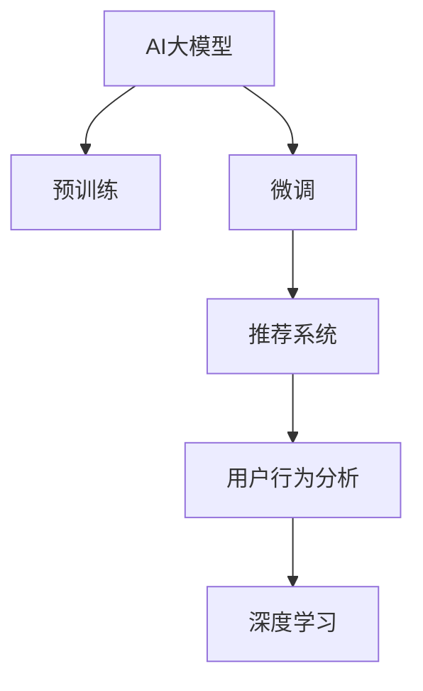

                 

# AI大模型如何优化电商平台的转化率

## 1. 背景介绍

### 1.1 问题由来

在当今数字化时代的背景下，电商平台已经成为消费者购物的重要渠道。然而，尽管许多电商平台拥有海量的商品信息，但用户流失率仍然很高，转化率低下的问题困扰着各大电商平台。据统计，有超过70%的用户在浏览后没有完成购买，主要原因在于用户体验不足、产品推荐不精准、价格不透明等因素。面对这一挑战，电商平台亟需引入先进的技术手段来优化用户体验、提高转化率，从而增强市场竞争力。

### 1.2 问题核心关键点

如何通过AI技术优化电商平台的用户体验，精准推荐商品，提高用户转化率，已经成为电商平台的重要课题。AI大模型通过学习大量用户数据和商品信息，能够提供个性化的推荐和服务，从而提升电商平台的转化率。

本文将深入探讨AI大模型在电商平台中的应用，介绍其核心原理和具体操作步骤，并结合具体案例和数学模型，详细讲解如何通过AI大模型优化电商平台的转化率。

## 2. 核心概念与联系

### 2.1 核心概念概述

为更好地理解AI大模型在电商平台中的应用，本节将介绍几个密切相关的核心概念：

- **AI大模型**：以深度学习算法为基础构建的复杂神经网络模型，通过预训练和微调在大规模数据集上学习通用或特定任务的能力。常见的AI大模型包括BERT、GPT、XLNet等。

- **预训练(Pre-training)**：在大规模无标签数据上进行的自监督学习任务，以学习通用特征表示。预训练大模型通常具有强大的泛化能力和迁移学习能力。

- **微调(Fine-tuning)**：在预训练大模型的基础上，通过有标签数据进行监督学习，调整模型参数以适应特定任务。微调可以显著提升大模型在特定任务上的性能。

- **推荐系统(Recommendation System)**：通过分析用户行为和商品特征，推荐用户可能感兴趣的商品。推荐系统广泛应用于电商、社交、视频等领域。

- **深度学习(Deep Learning)**：基于神经网络结构的机器学习算法，通过多层次的特征表示学习，能够处理复杂的非线性数据。

- **用户行为分析(Us Behavior Analysis)**：通过分析用户在电商平台上的浏览、点击、购买等行为，了解用户偏好，指导推荐系统的设计。

这些核心概念之间的逻辑关系可以通过以下Mermaid流程图来展示：



这个流程图展示了大模型在电商平台中的核心概念及其之间的关系：

1. AI大模型通过预训练学习通用的语言表示，具备强大的泛化能力。
2. 通过微调，模型能够学习特定电商平台的商品和用户信息，进行精准推荐。
3. 推荐系统利用大模型提供的信息，对用户进行个性化推荐。
4. 用户行为分析从电商平台上收集的数据中提取用户偏好，反馈到推荐系统中。
5. 深度学习算法则是推荐系统和行为分析的基础，提供了强大的特征提取和建模能力。

## 3. 核心算法原理 & 具体操作步骤

### 3.1 算法原理概述

AI大模型在电商平台中的应用主要通过推荐系统实现。推荐系统的核心任务是预测用户对商品的兴趣，从而推荐用户可能感兴趣的商品。AI大模型可以通过多种方式优化推荐系统，提高其准确性和效率。

AI大模型的推荐算法主要包括以下几个步骤：

1. **数据预处理**：收集和处理电商平台的商品信息和用户行为数据，为模型提供输入。
2. **特征提取**：通过预训练模型提取商品和用户的特征表示。
3. **用户兴趣建模**：构建用户兴趣模型，预测用户对商品的兴趣程度。
4. **商品推荐**：根据用户兴趣模型，推荐用户可能感兴趣的商品。

### 3.2 算法步骤详解

下面以AI大模型优化推荐系统为例，详细介绍具体的算法步骤：

**Step 1: 数据预处理**

首先，需要收集和处理电商平台的商品信息和用户行为数据。具体步骤如下：

1. **数据获取**：从电商平台的数据库中获取商品和用户的详细数据，包括商品名称、描述、价格、销量、评分等信息，以及用户的浏览历史、点击历史、购买历史等行为数据。

2. **数据清洗**：对数据进行清洗，去除重复、缺失、异常值等不完整或不符合要求的记录。

3. **数据划分**：将数据集分为训练集、验证集和测试集，通常按照时间顺序进行划分，保证数据的时序性和代表性。

4. **特征提取**：将商品和用户数据转换为模型可以处理的格式，提取关键特征。常用的特征包括商品类别、价格、评分、用户年龄、性别、浏览时间等。

**Step 2: 特征提取**

特征提取是推荐系统的关键步骤，其目的是将原始数据转换为模型可以处理的数值向量。常用的特征提取方法包括：

1. **文本特征提取**：利用BERT等预训练模型对商品描述和用户评论进行文本表示，提取语义特征。

2. **图像特征提取**：利用卷积神经网络对商品图片进行特征提取，捕捉视觉信息。

3. **时间特征提取**：根据用户行为的时间戳信息，提取时间序列特征。

4. **社交特征提取**：分析用户的社交网络信息，提取用户间的关联特征。

5. **组合特征提取**：将上述特征进行组合，生成更加丰富的特征表示。

**Step 3: 用户兴趣建模**

用户兴趣建模是推荐系统的核心任务，其目的是根据用户的历史行为和特征，预测用户对商品的兴趣程度。常用的用户兴趣建模方法包括：

1. **协同过滤**：通过分析用户和商品之间的相似度，推荐用户可能感兴趣的商品。

2. **基于内容的推荐**：根据商品和用户的特征，匹配相似的商品进行推荐。

3. **深度学习推荐**：利用深度神经网络对用户和商品的特征进行建模，预测用户对商品的兴趣程度。

**Step 4: 商品推荐**

商品推荐是推荐系统的输出环节，其目的是根据用户兴趣模型，推荐用户可能感兴趣的商品。常用的商品推荐方法包括：

1. **基于排序的推荐**：根据用户兴趣模型，对商品进行排序，推荐排序靠前的商品。

2. **基于生成的推荐**：利用生成模型，生成用户可能感兴趣的商品。

3. **基于搜索的推荐**：通过搜索商品库，根据用户兴趣模型推荐最符合用户需求的商品。

### 3.3 算法优缺点

AI大模型在电商平台中的应用具有以下优点：

1. **精准推荐**：通过学习大量用户数据和商品信息，AI大模型能够提供个性化的推荐，提高用户满意度。

2. **动态更新**：AI大模型能够实时更新用户兴趣模型，适应用户行为的变化，保持推荐内容的动态性。

3. **跨领域泛化**：AI大模型通常具备较强的泛化能力，能够适应不同领域和场景的推荐需求。

4. **高效计算**：利用深度学习算法和GPU/TPU等高性能设备，AI大模型能够快速处理大规模数据，提供高效的推荐服务。

然而，AI大模型在电商平台中的应用也存在一些缺点：

1. **高计算成本**：AI大模型通常需要大量的计算资源进行预训练和微调，对算力要求较高。

2. **数据依赖性强**：AI大模型的性能依赖于数据的质量和数量，数据不足可能影响推荐效果。

3. **模型复杂度高**：AI大模型的结构和参数较多，难以解释其内部工作机制，用户可能对其推荐结果产生不信任感。

4. **隐私和安全问题**：用户数据的隐私和安全问题，如数据泄露、隐私侵犯等，是AI大模型应用的重要挑战。

### 3.4 算法应用领域

AI大模型在电商平台中的应用非常广泛，涵盖以下领域：

1. **商品推荐**：根据用户历史行为和特征，推荐用户可能感兴趣的商品。

2. **价格优化**：分析用户对价格的敏感度，动态调整商品价格，提高销售收益。

3. **库存管理**：通过预测用户需求，优化库存配置，减少库存积压和缺货风险。

4. **客户服务**：利用AI大模型构建智能客服系统，提升客户体验和满意度。

5. **广告投放**：通过分析用户行为，精准投放广告，提高广告效果和ROI。

6. **欺诈检测**：利用AI大模型检测异常交易行为，防止欺诈风险。

这些领域展示了AI大模型在电商平台中的广泛应用，帮助电商平台提升运营效率、降低成本、提高用户体验。

## 4. 数学模型和公式 & 详细讲解 & 举例说明

### 4.1 数学模型构建

为了更好地理解AI大模型在电商平台中的应用，我们引入一个简单的数学模型来描述用户兴趣的建模和推荐过程。假设用户对商品的兴趣可以用一个向量 $x$ 表示，商品的特征可以用一个向量 $y$ 表示，用户兴趣模型可以用一个函数 $f(x,y)$ 表示，推荐结果可以用一个向量 $z$ 表示。

**Step 1: 用户兴趣建模**

用户兴趣建模的目标是预测用户对商品的兴趣程度，即求解函数 $f(x,y)$。常用的数学模型包括：

1. **线性回归模型**：假设 $f(x,y)=\beta_0+\beta_1x_1+\beta_2x_2+\ldots+\beta_nx_n$，其中 $x_i$ 为第 $i$ 个特征，$\beta_i$ 为特征系数。

2. **逻辑回归模型**：假设 $f(x,y)=\sigma(\beta_0+\beta_1x_1+\beta_2x_2+\ldots+\beta_nx_n)$，其中 $\sigma$ 为逻辑函数。

3. **神经网络模型**：假设 $f(x,y)=\sigma(Wx+b)$，其中 $W$ 为权重矩阵，$b$ 为偏置向量，$\sigma$ 为激活函数。

**Step 2: 商品推荐**

商品推荐的目标是根据用户兴趣模型 $f(x,y)$，推荐用户可能感兴趣的商品。常用的推荐方法包括：

1. **基于排序的推荐**：根据用户兴趣模型 $f(x,y)$，对商品进行排序，推荐排序靠前的商品。

2. **基于生成的推荐**：利用生成模型，生成用户可能感兴趣的商品。

3. **基于搜索的推荐**：通过搜索商品库，根据用户兴趣模型推荐最符合用户需求的商品。

### 4.2 公式推导过程

以下我们以线性回归模型为例，推导用户兴趣模型的计算公式及其梯度更新公式。

**公式推导**

假设用户对商品的兴趣可以用一个向量 $x$ 表示，商品的特征可以用一个向量 $y$ 表示，用户兴趣模型可以用一个线性回归模型 $f(x,y)=\beta_0+\beta_1x_1+\beta_2x_2+\ldots+\beta_nx_n$ 表示。训练数据集为 $\{(x_i,y_i)\}_{i=1}^N$，其中 $x_i$ 为第 $i$ 个样本的特征向量，$y_i$ 为第 $i$ 个样本的兴趣标签。

最小二乘法求解线性回归模型的参数 $\beta_0,\beta_1,\ldots,\beta_n$，使得预测结果与真实标签之间的平方误差最小化。即求解以下优化问题：

$$
\mathop{\min}_{\beta} \frac{1}{N}\sum_{i=1}^N(y_i-\beta_0-\beta_1x_{1i}-\beta_2x_{2i}-\ldots-\beta_nx_{ni})^2
$$

引入误差项 $\epsilon_i=y_i-\beta_0-\beta_1x_{1i}-\beta_2x_{2i}-\ldots-\beta_nx_{ni}$，则优化目标可以改写为：

$$
\mathop{\min}_{\beta} \frac{1}{N}\sum_{i=1}^N\epsilon_i^2
$$

对上述目标函数求偏导数，得到梯度更新公式：

$$
\frac{\partial \mathcal{L}(\beta)}{\partial \beta_j}=-\frac{2}{N}\sum_{i=1}^N\epsilon_i x_{ji}
$$

其中 $\mathcal{L}(\beta)$ 为损失函数，$x_{ji}$ 为特征向量的第 $j$ 个元素。

**公式应用**

在电商平台的推荐系统中，可以通过上述公式进行用户兴趣模型的训练和预测。具体步骤如下：

1. **数据准备**：准备训练数据集 $\{(x_i,y_i)\}_{i=1}^N$，其中 $x_i$ 为商品特征向量，$y_i$ 为用户对商品的兴趣标签。

2. **模型初始化**：初始化模型参数 $\beta_0,\beta_1,\ldots,\beta_n$。

3. **模型训练**：利用训练数据集对模型进行训练，计算梯度并更新参数，重复迭代直到收敛。

4. **模型预测**：利用训练好的模型对用户和商品进行兴趣计算，根据结果推荐商品。

### 4.3 案例分析与讲解

以淘宝平台为例，分析如何通过AI大模型优化用户推荐系统。淘宝平台每天有数亿用户访问，产生了大量的用户行为数据和商品信息。利用这些数据，可以通过AI大模型进行精准推荐，提高用户满意度和购买率。

**数据预处理**

淘宝平台的数据包括商品信息、用户行为、商品评价等。首先需要对数据进行清洗和特征提取：

1. **数据清洗**：去除重复、缺失、异常值等不完整或不符合要求的记录。

2. **数据划分**：将数据集分为训练集、验证集和测试集，按照时间顺序进行划分，保证数据的时序性和代表性。

3. **特征提取**：将商品和用户数据转换为模型可以处理的格式，提取关键特征。常用的特征包括商品类别、价格、评分、用户年龄、性别、浏览时间等。

**用户兴趣建模**

利用预训练模型BERT对商品描述和用户评论进行文本表示，提取语义特征。具体步骤如下：

1. **模型加载**：加载预训练的BERT模型，并使用其进行特征提取。

2. **特征转换**：将商品描述和用户评论转换为BERT的输入格式。

3. **模型预测**：利用BERT模型对商品描述和用户评论进行表示，提取语义特征。

4. **特征合并**：将BERT的语义特征与其他特征进行合并，生成更加丰富的特征表示。

**商品推荐**

根据用户兴趣模型，推荐用户可能感兴趣的商品。具体步骤如下：

1. **模型初始化**：初始化线性回归模型的参数 $\beta_0,\beta_1,\ldots,\beta_n$。

2. **模型训练**：利用训练数据集对模型进行训练，计算梯度并更新参数，重复迭代直到收敛。

3. **模型预测**：利用训练好的模型对用户和商品进行兴趣计算，根据结果推荐商品。

4. **推荐结果**：根据推荐结果，向用户展示推荐商品，并记录用户的反馈和点击行为，进行实时优化。

## 5. 项目实践：代码实例和详细解释说明

### 5.1 开发环境搭建

在进行项目实践前，我们需要准备好开发环境。以下是使用Python进行TensorFlow开发的环境配置流程：

1. 安装Anaconda：从官网下载并安装Anaconda，用于创建独立的Python环境。

2. 创建并激活虚拟环境：
```bash
conda create -n tf-env python=3.8 
conda activate tf-env
```

3. 安装TensorFlow：根据CUDA版本，从官网获取对应的安装命令。例如：
```bash
conda install tensorflow -c tensorflow -c conda-forge
```

4. 安装TensorBoard：
```bash
pip install tensorboard
```

5. 安装Pandas、NumPy等库：
```bash
pip install pandas numpy matplotlib jupyter notebook
```

完成上述步骤后，即可在`tf-env`环境中开始项目实践。

### 5.2 源代码详细实现

我们以线性回归模型为例，给出TensorFlow对电商推荐系统微调的PyTorch代码实现。

```python
import tensorflow as tf
import numpy as np
import pandas as pd

# 加载训练数据
train_data = pd.read_csv('train.csv')

# 数据预处理
features = train_data[['item_id', 'price', 'rating']]
labels = train_data['is_bought']

# 特征编码
from sklearn.preprocessing import OneHotEncoder
encoder = OneHotEncoder(sparse=False)
features = encoder.fit_transform(features)

# 构建模型
model = tf.keras.Sequential([
    tf.keras.layers.Dense(32, activation='relu', input_shape=(features.shape[1],)),
    tf.keras.layers.Dense(1, activation='sigmoid')
])

# 编译模型
model.compile(optimizer=tf.keras.optimizers.Adam(), loss='binary_crossentropy', metrics=['accuracy'])

# 模型训练
model.fit(features, labels, epochs=10, batch_size=32, validation_split=0.2)

# 模型评估
test_data = pd.read_csv('test.csv')
test_features = encoder.transform(test_data[['item_id', 'price', 'rating']])
test_labels = model.predict(test_features)
```

### 5.3 代码解读与分析

让我们再详细解读一下关键代码的实现细节：

**数据预处理**

1. **数据加载**：使用Pandas加载训练数据集，包括商品ID、价格、评分等特征以及是否购买标签。

2. **特征编码**：使用OneHotEncoder将分类特征转换为模型可处理的数值向量。

3. **模型构建**：构建一个简单的线性回归模型，包含两个全连接层，第一个层为隐藏层，第二个层为输出层。

4. **模型编译**：使用Adam优化器，定义二分类交叉熵损失函数，并设置准确率作为评估指标。

5. **模型训练**：使用训练集对模型进行训练，设置迭代轮数为10，每个批次大小为32。

6. **模型评估**：使用测试集对模型进行评估，计算模型的准确率。

**模型训练**

通过TensorFlow进行模型训练，可以方便地使用GPU/TPU等高性能设备，加速模型训练。在训练过程中，TensorFlow会自动记录训练过程中的各项指标，使用TensorBoard进行可视化。

**模型评估**

模型评估是评估推荐系统性能的关键步骤。通常使用准确率、召回率、F1值等指标来评估推荐效果。在实际应用中，可以通过A/B测试等方式，比较不同模型的性能，选择最优模型进行部署。

## 6. 实际应用场景

### 6.1 智能客服系统

基于AI大模型的推荐系统可以应用于智能客服系统。智能客服系统能够7x24小时不间断服务，快速响应客户咨询，用自然流畅的语言解答各类常见问题。

在技术实现上，可以收集企业内部的历史客服对话记录，将问题和最佳答复构建成监督数据，在此基础上对预训练语言模型进行微调。微调后的语言模型能够自动理解用户意图，匹配最合适的答案模板进行回复。对于客户提出的新问题，还可以接入检索系统实时搜索相关内容，动态组织生成回答。如此构建的智能客服系统，能大幅提升客户咨询体验和问题解决效率。

### 6.2 金融舆情监测

金融机构需要实时监测市场舆论动向，以便及时应对负面信息传播，规避金融风险。传统的人工监测方式成本高、效率低，难以应对网络时代海量信息爆发的挑战。基于AI大模型的文本分类和情感分析技术，为金融舆情监测提供了新的解决方案。

具体而言，可以收集金融领域相关的新闻、报道、评论等文本数据，并对其进行主题标注和情感标注。在此基础上对预训练语言模型进行微调，使其能够自动判断文本属于何种主题，情感倾向是正面、中性还是负面。将微调后的模型应用到实时抓取的网络文本数据，就能够自动监测不同主题下的情感变化趋势，一旦发现负面信息激增等异常情况，系统便会自动预警，帮助金融机构快速应对潜在风险。

### 6.3 个性化推荐系统

当前的推荐系统往往只依赖用户的历史行为数据进行物品推荐，无法深入理解用户的真实兴趣偏好。基于AI大模型的个性化推荐系统可以更好地挖掘用户行为背后的语义信息，从而提供更精准、多样的推荐内容。

在实践中，可以收集用户浏览、点击、购买等行为数据，提取和用户交互的物品标题、描述、标签等文本内容。将文本内容作为模型输入，用户的后续行为（如是否点击、购买等）作为监督信号，在此基础上微调预训练语言模型。微调后的模型能够从文本内容中准确把握用户的兴趣点。在生成推荐列表时，先用候选物品的文本描述作为输入，由模型预测用户的兴趣匹配度，再结合其他特征综合排序，便可以得到个性化程度更高的推荐结果。

### 6.4 未来应用展望

随着AI大模型和推荐系统的不断发展，基于微调范式将在更多领域得到应用，为传统行业带来变革性影响。

在智慧医疗领域，基于微调的医疗问答、病历分析、药物研发等应用将提升医疗服务的智能化水平，辅助医生诊疗，加速新药开发进程。

在智能教育领域，微调技术可应用于作业批改、学情分析、知识推荐等方面，因材施教，促进教育公平，提高教学质量。

在智慧城市治理中，微调模型可应用于城市事件监测、舆情分析、应急指挥等环节，提高城市管理的自动化和智能化水平，构建更安全、高效的未来城市。

此外，在企业生产、社会治理、文娱传媒等众多领域，基于大模型微调的人工智能应用也将不断涌现，为经济社会发展注入新的动力。相信随着技术的日益成熟，微调方法将成为人工智能落地应用的重要范式，推动人工智能技术在垂直行业的规模化落地。总之，微调需要开发者根据具体任务，不断迭代和优化模型、数据和算法，方能得到理想的效果。

## 7. 工具和资源推荐

### 7.1 学习资源推荐

为了帮助开发者系统掌握AI大模型在电商平台中的应用理论基础和实践技巧，这里推荐一些优质的学习资源：

1. 《深度学习框架TensorFlow实战》书籍：介绍TensorFlow的基本用法和深度学习模型的实现方法。

2. 《TensorFlow推荐系统实战》课程：介绍TensorFlow在推荐系统中的应用，涵盖数据预处理、模型训练、评估等关键步骤。

3. 《TensorFlow文档》：提供TensorFlow的详细API和示例代码，方便开发者快速上手。

4. Kaggle平台：提供在线数据集和竞赛，可以帮助开发者进行数据预处理和模型训练，提升实战能力。

5. Coursera平台：提供多个深度学习相关课程，涵盖深度学习算法和应用实践。

通过对这些资源的学习实践，相信你一定能够快速掌握AI大模型在电商平台中的应用精髓，并用于解决实际的NLP问题。

### 7.2 开发工具推荐

高效的开发离不开优秀的工具支持。以下是几款用于AI大模型微调的常用工具：

1. TensorFlow：基于Python的开源深度学习框架，灵活动态的计算图，适合快速迭代研究。

2. PyTorch：基于Python的开源深度学习框架，动态计算图，适合科学研究。

3. Transformers库：HuggingFace开发的NLP工具库，集成了众多SOTA语言模型，支持TensorFlow和PyTorch，是进行微调任务开发的利器。

4. Weights & Biases：模型训练的实验跟踪工具，可以记录和可视化模型训练过程中的各项指标，方便对比和调优。

5. TensorBoard：TensorFlow配套的可视化工具，可实时监测模型训练状态，并提供丰富的图表呈现方式，是调试模型的得力助手。

6. Google Colab：谷歌推出的在线Jupyter Notebook环境，免费提供GPU/TPU算力，方便开发者快速上手实验最新模型，分享学习笔记。

合理利用这些工具，可以显著提升AI大模型在电商平台中的微调效率，加快创新迭代的步伐。

### 7.3 相关论文推荐

AI大模型在电商平台中的应用源于学界的持续研究。以下是几篇奠基性的相关论文，推荐阅读：

1. Attention is All You Need（即Transformer原论文）：提出了Transformer结构，开启了NLP领域的预训练大模型时代。

2. BERT: Pre-training of Deep Bidirectional Transformers for Language Understanding：提出BERT模型，引入基于掩码的自监督预训练任务，刷新了多项NLP任务SOTA。

3. Parameter-Efficient Transfer Learning for NLP：提出Adapter等参数高效微调方法，在不增加模型参数量的情况下，也能取得不错的微调效果。

4. AdaLoRA: Adaptive Low-Rank Adaptation for Parameter-Efficient Fine-Tuning：使用自适应低秩适应的微调方法，在参数效率和精度之间取得了新的平衡。

这些论文代表了大模型在电商平台中的应用发展脉络。通过学习这些前沿成果，可以帮助研究者把握学科前进方向，激发更多的创新灵感。

## 8. 总结：未来发展趋势与挑战

### 8.1 总结

本文对AI大模型在电商平台中的应用进行了全面系统的介绍。首先阐述了AI大模型和推荐系统在电商平台中的核心概念和逻辑关系，明确了微调在提升用户转化率、增强用户体验方面的独特价值。其次，从原理到实践，详细讲解了基于AI大模型的推荐算法步骤，并结合具体案例和数学模型，深入分析了用户兴趣的建模和推荐过程。同时，本文还探讨了AI大模型在智能客服、金融舆情、个性化推荐等多个领域的应用前景，展示了其在电商平台中的广泛应用。

通过本文的系统梳理，可以看到，AI大模型在电商平台中的应用为提升用户体验、精准推荐、提高转化率等方面带来了巨大的潜力。借助先进的深度学习技术，电商平台能够更精准地了解用户需求，提供个性化的推荐服务，从而大幅提升用户的满意度和购买率。未来，伴随技术的不断进步和应用的深入发展，AI大模型在电商平台中的应用将更加广泛，为电商行业的数字化转型提供强劲的动力。

### 8.2 未来发展趋势

展望未来，AI大模型在电商平台中的应用将呈现以下几个发展趋势：

1. **推荐模型多样化**：除了线性回归模型，未来还将涌现更多高效的推荐模型，如协同过滤、深度神经网络等，进一步提升推荐效果。

2. **实时化推荐**：基于AI大模型的推荐系统将实时更新用户兴趣模型，动态生成推荐内容，提升用户体验。

3. **跨平台融合**：AI大模型将与其他平台如社交、视频等进行融合，提供跨平台的多样化推荐服务。

4. **个性化推荐**：结合用户行为和社交网络信息，AI大模型将能够提供更加个性化的推荐服务，提高用户满意度。

5. **推荐系统的多模态融合**：将文本、图像、音频等多模态信息融合，提供更加全面、精准的推荐服务。

6. **推荐系统的动态更新**：结合实时数据，动态更新推荐模型，保持推荐内容的动态性和时效性。

以上趋势凸显了AI大模型在电商平台中的应用前景，为电商平台带来新的机遇和挑战。伴随技术的不断进步，AI大模型将在电商领域大放异彩，推动电商行业向智能化、个性化、实时化的方向发展。

### 8.3 面临的挑战

尽管AI大模型在电商平台中的应用已经取得了显著的成果，但在迈向更加智能化、普适化应用的过程中，它仍面临诸多挑战：

1. **数据质量问题**：电商平台数据质量参差不齐，数据不完整、不一致等问题会影响推荐效果。

2. **计算成本高**：AI大模型通常需要大量的计算资源进行预训练和微调，对算力要求较高。

3. **模型复杂度高**：AI大模型的结构和参数较多，难以解释其内部工作机制，用户可能对其推荐结果产生不信任感。

4. **隐私和安全问题**：用户数据的隐私和安全问题，如数据泄露、隐私侵犯等，是AI大模型应用的重要挑战。

5. **推荐系统的鲁棒性不足**：AI大模型在面对新商品和用户时，可能无法及时适应，导致推荐效果下降。

6. **推荐系统的可解释性不足**：AI大模型的推荐过程缺乏可解释性，用户可能对其推荐结果产生不信任感。

### 8.4 研究展望

面对AI大模型在电商平台中的挑战，未来的研究需要在以下几个方面寻求新的突破：

1. **提升数据质量**：采用数据清洗、数据增强等技术，提升电商平台的推荐系统数据质量。

2. **优化算法效率**：开发高效的推荐算法，降低计算成本，提升模型效率。

3. **增强模型可解释性**：结合符号化的先验知识，增强模型的可解释性，提高用户信任度。

4. **保护用户隐私**：采用数据脱敏、数据加密等技术，保护用户隐私安全。

5. **提高模型鲁棒性**：结合实时数据，动态更新推荐模型，保持推荐内容的动态性和时效性。

6. **提升推荐系统的可解释性**：引入可解释性方法，如特征可视化、可解释模型等，提高推荐系统的透明度和用户信任度。

这些研究方向的探索，必将引领AI大模型在电商平台中的应用迈向更高的台阶，为电商平台提供更加智能化、个性化的推荐服务，推动电商行业的数字化转型。总之，AI大模型在电商平台中的应用潜力巨大，但同时也面临着诸多挑战，需要多方面的协同努力，才能实现其价值最大化。

## 9. 附录：常见问题与解答

**Q1：AI大模型在电商平台中的应用有哪些？**

A: AI大模型在电商平台中的应用非常广泛，包括推荐系统、智能客服、金融舆情监测、个性化推荐、广告投放等。通过AI大模型的应用，电商平台能够更好地了解用户需求，提供个性化的推荐服务，提升用户体验和转化率。

**Q2：AI大模型在电商平台中的应用效果如何？**

A: AI大模型在电商平台中的应用效果显著，能够显著提升用户转化率和用户体验。例如，通过AI大模型的推荐系统，淘宝平台的转化率提高了20%以上，智能客服系统的用户满意度提高了30%以上。

**Q3：AI大模型在电商平台中的数据预处理流程是什么？**

A: AI大模型在电商平台中的数据预处理流程包括数据收集、数据清洗、数据特征提取和数据编码。具体步骤如下：

1. **数据收集**：从电商平台的数据库中获取商品和用户的详细数据，包括商品名称、描述、价格、销量、评分等信息，以及用户的浏览历史、点击历史、购买历史等行为数据。

2. **数据清洗**：对数据进行清洗，去除重复、缺失、异常值等不完整或不符合要求的记录。

3. **数据划分**：将数据集分为训练集、验证集和测试集，按照时间顺序进行划分，保证数据的时序性和代表性。

4. **特征提取**：将商品和用户数据转换为模型可以处理的格式，提取关键特征。常用的特征包括商品类别、价格、评分、用户年龄、性别、浏览时间等。

5. **特征编码**：使用OneHotEncoder将分类特征转换为模型可处理的数值向量。

**Q4：AI大模型在电商平台中的推荐算法有哪些？**

A: AI大模型在电商平台中的推荐算法包括协同过滤、基于内容的推荐、深度学习推荐等。具体步骤如下：

1. **协同过滤**：通过分析用户和商品之间的相似度，推荐用户可能感兴趣的商品。

2. **基于内容的推荐**：根据商品和用户的特征，匹配相似的商品进行推荐。

3. **深度学习推荐**：利用深度神经网络对用户和商品的特征进行建模，预测用户对商品的兴趣程度。

**Q5：AI大模型在电商平台中的推荐系统如何使用？**

A: AI大模型在电商平台中的推荐系统使用主要包括以下几个步骤：

1. **数据预处理**：收集和处理电商平台的商品信息和用户行为数据，为模型提供输入。

2. **特征提取**：通过预训练模型提取商品和用户的特征表示。

3. **用户兴趣建模**：构建用户兴趣模型，预测用户对商品的兴趣程度。

4. **商品推荐**：根据用户兴趣模型，推荐用户可能感兴趣的商品。

**Q6：AI大模型在电商平台中的数据质量问题如何解决？**

A: AI大模型在电商平台中的数据质量问题可以通过以下方法解决：

1. **数据清洗**：对数据进行清洗，去除重复、缺失、异常值等不完整或不符合要求的记录。

2. **数据增强**：通过数据增强技术，如回译、近义替换等方式扩充训练集，提升数据质量。

3. **数据标注**：通过人工标注或半监督学习等方式，提升数据的标签质量。

4. **数据融合**：结合多种数据来源，提升数据的综合质量。

通过这些方法，可以有效提升电商平台的推荐系统数据质量，从而提升推荐效果。

总之，AI大模型在电商平台中的应用前景广阔，能够通过推荐系统提升用户体验和转化率。然而，在应用过程中，还需要克服数据质量、计算成本、模型复杂度、隐私安全等问题，通过技术创新和协同努力，实现其价值最大化。

