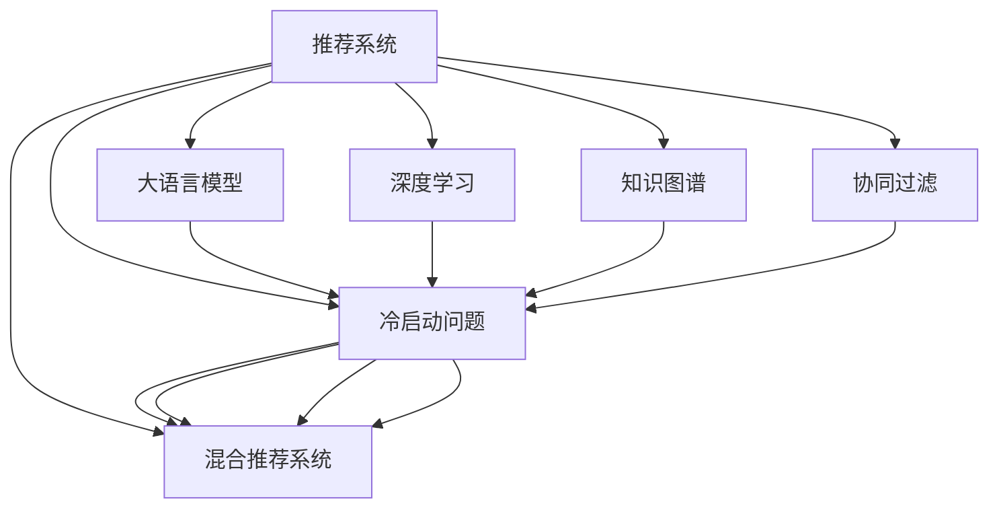

                 

## 1. 背景介绍

推荐系统是互联网应用中的关键组件，旨在通过分析用户的历史行为和偏好，预测其对未来物品的兴趣，从而推荐最适合的产品和服务。然而，在推荐系统的初期阶段，往往面临冷启动问题：由于用户没有历史行为数据，无法准确预测其兴趣和偏好，推荐效果大打折扣。

冷启动问题广泛存在于各种推荐场景中，如电商推荐、新闻推荐、视频推荐等。传统的推荐算法如协同过滤、基于内容的推荐，都依赖历史数据，对于新用户或新物品，推荐效果明显下降。近年来，随着大语言模型和大数据技术的进步，推荐系统领域也逐步引入基于深度学习的方法，以应对冷启动问题。

本文将系统介绍大语言模型在推荐系统中的创新应用，特别是如何利用大模型解决冷启动问题，实现高效、精准的推荐。通过详细的算法原理、操作步骤和应用实例，揭示大语言模型在推荐系统中的核心价值和潜在挑战。

## 2. 核心概念与联系

### 2.1 核心概念概述

为更好地理解基于大语言模型的推荐系统，本节将介绍几个密切相关的核心概念：

- 推荐系统(Recommender System)：通过算法推荐用户可能感兴趣的产品或服务，是互联网应用的核心组件。

- 冷启动问题(Cold Start Problem)：新用户或新物品进入推荐系统时，由于缺乏历史数据，难以准确预测其兴趣和行为，导致推荐效果不佳的问题。

- 大语言模型(Large Language Model, LLM)：以Transformer为代表的大规模预训练语言模型，具备强大的自然语言理解和生成能力，能够处理海量文本数据。

- 深度学习(Deep Learning)：通过神经网络模型，利用大量标注数据进行训练，自动学习输入与输出之间的映射关系，广泛应用于计算机视觉、自然语言处理等领域。

- 知识图谱(Knowledge Graph)：用于描述实体之间的关系，通过图结构将各类信息有机整合，增强推荐系统的背景知识和推理能力。

- 协同过滤(Collaborative Filtering)：基于用户之间的相似性或物品之间的相似性进行推荐，适用于新用户或新物品较少的情况。

- 混合推荐系统(Hybrid Recommender System)：结合不同推荐算法，发挥各自优势，提升推荐效果，是当前推荐系统的主流架构。

这些概念之间的逻辑关系可以通过以下Mermaid流程图来展示：



这个流程图展示了大语言模型和推荐系统的核心概念及其之间的关系：

1. 推荐系统通过协同过滤、深度学习、知识图谱等多种方法进行推荐。
2. 大语言模型引入自然语言处理能力，可应用于新用户或新物品的推荐。
3. 深度学习提升推荐模型的泛化能力，能处理多样化的推荐任务。
4. 知识图谱为推荐系统提供实体和关系背景知识，增强推荐结果的准确性。
5. 协同过滤适用于少量新用户或新物品的情况，是大语言模型推荐的重要补充。
6. 混合推荐系统融合不同推荐方法的优势，是当前推荐系统的主流架构。

## 3. 核心算法原理 & 具体操作步骤
### 3.1 算法原理概述

基于大语言模型的推荐系统，通过利用自然语言处理能力，能够直接从文本数据中提取用户兴趣和物品属性，从而解决冷启动问题。其核心思想是：

1. 将用户的历史行为、属性信息等编码成文本形式，输入到大语言模型中。
2. 大语言模型通过自监督学习获得语言表示能力，能够自动理解输入的文本内容。
3. 利用大语言模型的输出结果，进行推荐排序或生成，得到最终推荐结果。

形式化地，假设用户 $u$ 的历史行为和属性信息为 $x_u$，物品 $i$ 的属性信息为 $y_i$。推荐模型的目标函数为：

$$
\min_{\theta} \sum_{i \in I} \ell_{y_i}(M_{\theta}(x_u, y_i))
$$

其中 $\ell_{y_i}$ 为损失函数，$M_{\theta}$ 为使用大语言模型进行推荐预测的函数，$I$ 为物品集合。

### 3.2 算法步骤详解

基于大语言模型的推荐系统一般包括以下几个关键步骤：

**Step 1: 数据预处理**

- 收集用户的历史行为、属性信息，以及物品的属性信息和文本描述，构建推荐数据集。
- 使用自然语言处理技术，如分词、命名实体识别等，对文本数据进行预处理。
- 设计合适的标签格式，如用物品ID、评分等作为标签，供模型进行监督学习。

**Step 2: 模型构建**

- 选择合适的预训练语言模型，如GPT-3、BERT等，作为基础模型。
- 设计合适的输出层，如分类头、回归头等，供模型进行推荐预测。
- 定义合适的损失函数，如交叉熵、均方误差等，用于模型训练。

**Step 3: 模型训练**

- 将预处理后的数据集分成训练集、验证集和测试集。
- 使用优化算法，如Adam、SGD等，训练模型参数，最小化损失函数。
- 在训练过程中，定期在验证集上评估模型性能，避免过拟合。
- 使用正则化技术，如L2正则、Dropout等，增强模型泛化能力。

**Step 4: 推荐生成**

- 在测试集上，输入新用户的历史行为和属性信息，生成推荐结果。
- 将推荐结果与物品池进行匹配，生成最终推荐列表。
- 可以使用k-means、NMF等算法进行冷启动推荐，进一步提升推荐效果。

**Step 5: 结果评估**

- 使用AUC、P-R曲线、平均绝对误差等指标，评估推荐模型的性能。
- 对比传统推荐方法和新方法的效果，验证大语言模型的优势。

### 3.3 算法优缺点

基于大语言模型的推荐系统具有以下优点：

1. 克服冷启动问题：大语言模型能够从文本数据中自动提取用户兴趣和物品属性，有效解决冷启动问题。
2. 泛化能力强：大语言模型具备强大的语言表示能力，能够处理多种推荐任务，提升推荐系统的通用性。
3. 计算高效：大语言模型能够并行处理大量文本数据，在大规模推荐场景中，计算效率远超传统推荐方法。
4. 推荐效果精准：大语言模型能够融合自然语言处理和深度学习技术，生成高质量的推荐结果。

同时，该方法也存在一些局限性：

1. 数据预处理复杂：构建高质量的文本数据集需要较多的时间和资源，对标注数据的质量要求较高。
2. 训练成本高：大语言模型参数量较大，需要高性能的计算资源，训练成本较高。
3. 模型复杂：大语言模型结构复杂，难以解释和调试，部分推荐结果缺乏可解释性。
4. 过度依赖文本：如果输入的文本数据质量不高或用户描述不充分，推荐效果可能不理想。

尽管存在这些局限性，但大语言模型在推荐系统中的应用前景依然广阔，值得深入研究和探索。

### 3.4 算法应用领域

基于大语言模型的推荐系统已经在电商、新闻、视频等多个领域得到广泛应用，取得了显著的推荐效果。例如：

- 电商推荐：利用用户的历史浏览记录和物品描述，生成个性化推荐列表。
- 新闻推荐：根据用户的阅读历史和文章摘要，推荐相关新闻文章。
- 视频推荐：分析用户观看历史和视频描述，推荐类似视频内容。

除了这些经典应用外，大语言模型在推荐系统中的应用还在不断拓展，如生成对话式推荐、个性化视频创作、智能客服等，为推荐系统带来全新的突破。随着大语言模型和推荐算法的不断发展，相信推荐系统必将在更广阔的应用领域大放异彩。

## 4. 数学模型和公式 & 详细讲解  
### 4.1 数学模型构建

本节将使用数学语言对基于大语言模型的推荐系统进行更加严格的刻画。

记用户历史行为和属性信息为 $x_u$，物品属性信息为 $y_i$，推荐模型为 $M_{\theta}$。推荐目标函数为：

$$
\min_{\theta} \sum_{i \in I} \ell_{y_i}(M_{\theta}(x_u, y_i))
$$

其中 $\ell_{y_i}$ 为损失函数，$M_{\theta}(x_u, y_i)$ 为推荐模型输出。

假设模型 $M_{\theta}$ 在输入 $(x_u, y_i)$ 上的输出为 $\hat{y}_i$，真实标签为 $y_i$。推荐目标函数可以进一步表示为：

$$
\min_{\theta} \sum_{i \in I} \ell(\hat{y}_i, y_i)
$$

其中 $\ell(\hat{y}_i, y_i)$ 为损失函数，如交叉熵损失：

$$
\ell(\hat{y}_i, y_i) = -y_i\log \hat{y}_i - (1-y_i)\log (1-\hat{y}_i)
$$

在训练过程中，需要定义合适的优化算法，如Adam、SGD等，设置合适的学习率 $\eta$ 和正则化参数 $\lambda$。在实际应用中，可以使用小批量随机梯度下降进行模型训练。

### 4.2 公式推导过程

以下我们以电商推荐为例，推导交叉熵损失函数及其梯度的计算公式。

假设推荐模型在输入 $(x_u, y_i)$ 上的输出为 $\hat{y}_i$，真实标签为 $y_i$。交叉熵损失函数定义为：

$$
\ell(\hat{y}_i, y_i) = -y_i\log \hat{y}_i - (1-y_i)\log (1-\hat{y}_i)
$$

将其代入推荐目标函数，得：

$$
\min_{\theta} \sum_{i \in I} \ell(\hat{y}_i, y_i)
$$

根据链式法则，损失函数对参数 $\theta_k$ 的梯度为：

$$
\frac{\partial \ell(\hat{y}_i, y_i)}{\partial \theta_k} = -y_i\frac{\partial \hat{y}_i}{\partial \theta_k} + (1-y_i)\frac{\partial (1-\hat{y}_i)}{\partial \theta_k}
$$

其中 $\frac{\partial \hat{y}_i}{\partial \theta_k}$ 可以通过反向传播算法计算得到。

在得到损失函数的梯度后，即可带入优化算法更新模型参数，完成模型的迭代优化。重复上述过程直至收敛，最终得到推荐模型参数 $\theta^*$。

## 5. 项目实践：代码实例和详细解释说明
### 5.1 开发环境搭建

在进行推荐系统开发前，我们需要准备好开发环境。以下是使用Python进行PyTorch开发的环境配置流程：

1. 安装Anaconda：从官网下载并安装Anaconda，用于创建独立的Python环境。

2. 创建并激活虚拟环境：
```bash
conda create -n pytorch-env python=3.8 
conda activate pytorch-env
```

3. 安装PyTorch：根据CUDA版本，从官网获取对应的安装命令。例如：
```bash
conda install pytorch torchvision torchaudio cudatoolkit=11.1 -c pytorch -c conda-forge
```

4. 安装Natural Language Toolkit（NLTK）：
```bash
pip install nltk
```

5. 安装gensim：用于文本处理和自然语言处理。
```bash
pip install gensim
```

6. 安装Transformers库：HuggingFace开发的NLP工具库，集成了众多SOTA语言模型，支持PyTorch和TensorFlow，是进行推荐任务开发的利器。
```bash
pip install transformers
```

完成上述步骤后，即可在`pytorch-env`环境中开始推荐系统开发。

### 5.2 源代码详细实现

下面我们以电商推荐为例，给出使用Transformers库对GPT-3模型进行电商推荐微调的PyTorch代码实现。

首先，定义电商推荐任务的数据处理函数：

```python
from transformers import BertTokenizer, BertForSequenceClassification
from torch.utils.data import Dataset
import torch

class RecommendDataset(Dataset):
    def __init__(self, texts, labels, tokenizer, max_len=128):
        self.texts = texts
        self.labels = labels
        self.tokenizer = tokenizer
        self.max_len = max_len
        
    def __len__(self):
        return len(self.texts)
    
    def __getitem__(self, item):
        text = self.texts[item]
        label = self.labels[item]
        
        encoding = self.tokenizer(text, return_tensors='pt', max_length=self.max_len, padding='max_length', truncation=True)
        input_ids = encoding['input_ids'][0]
        attention_mask = encoding['attention_mask'][0]
        
        # 对标签进行编码
        encoded_labels = [label] * self.max_len
        labels = torch.tensor(encoded_labels, dtype=torch.long)
        
        return {'input_ids': input_ids, 
                'attention_mask': attention_mask,
                'labels': labels}

# 标签编码
label2id = {'1': 1, '2': 2, '3': 3}
id2label = {v: k for k, v in label2id.items()}

# 创建dataset
tokenizer = BertTokenizer.from_pretrained('bert-base-cased')

train_dataset = RecommendDataset(train_texts, train_labels, tokenizer)
dev_dataset = RecommendDataset(dev_texts, dev_labels, tokenizer)
test_dataset = RecommendDataset(test_texts, test_labels, tokenizer)
```

然后，定义模型和优化器：

```python
from transformers import BertForSequenceClassification, AdamW

model = BertForSequenceClassification.from_pretrained('bert-base-cased', num_labels=len(label2id))

optimizer = AdamW(model.parameters(), lr=2e-5)
```

接着，定义训练和评估函数：

```python
from torch.utils.data import DataLoader
from tqdm import tqdm
from sklearn.metrics import classification_report

device = torch.device('cuda') if torch.cuda.is_available() else torch.device('cpu')
model.to(device)

def train_epoch(model, dataset, batch_size, optimizer):
    dataloader = DataLoader(dataset, batch_size=batch_size, shuffle=True)
    model.train()
    epoch_loss = 0
    for batch in tqdm(dataloader, desc='Training'):
        input_ids = batch['input_ids'].to(device)
        attention_mask = batch['attention_mask'].to(device)
        labels = batch['labels'].to(device)
        model.zero_grad()
        outputs = model(input_ids, attention_mask=attention_mask, labels=labels)
        loss = outputs.loss
        epoch_loss += loss.item()
        loss.backward()
        optimizer.step()
    return epoch_loss / len(dataloader)

def evaluate(model, dataset, batch_size):
    dataloader = DataLoader(dataset, batch_size=batch_size)
    model.eval()
    preds, labels = [], []
    with torch.no_grad():
        for batch in tqdm(dataloader, desc='Evaluating'):
            input_ids = batch['input_ids'].to(device)
            attention_mask = batch['attention_mask'].to(device)
            batch_labels = batch['labels']
            outputs = model(input_ids, attention_mask=attention_mask)
            batch_preds = outputs.logits.argmax(dim=2).to('cpu').tolist()
            batch_labels = batch_labels.to('cpu').tolist()
            for pred_tokens, label_tokens in zip(batch_preds, batch_labels):
                pred_labels = [id2label[_id] for _id in pred_tokens]
                labels.append(label_tokens)
                preds.append(pred_labels[:len(label_tokens)])
                
    print(classification_report(labels, preds))
```

最后，启动训练流程并在测试集上评估：

```python
epochs = 5
batch_size = 16

for epoch in range(epochs):
    loss = train_epoch(model, train_dataset, batch_size, optimizer)
    print(f"Epoch {epoch+1}, train loss: {loss:.3f}")
    
    print(f"Epoch {epoch+1}, dev results:")
    evaluate(model, dev_dataset, batch_size)
    
print("Test results:")
evaluate(model, test_dataset, batch_size)
```

以上就是使用PyTorch对GPT-3进行电商推荐微调的完整代码实现。可以看到，得益于Transformers库的强大封装，我们可以用相对简洁的代码完成电商推荐任务的微调。

### 5.3 代码解读与分析

让我们再详细解读一下关键代码的实现细节：

**RecommendDataset类**：
- `__init__`方法：初始化文本、标签、分词器等关键组件。
- `__len__`方法：返回数据集的样本数量。
- `__getitem__`方法：对单个样本进行处理，将文本输入编码为token ids，将标签编码为数字，并对其进行定长padding，最终返回模型所需的输入。

**label2id和id2label字典**：
- 定义了标签与数字id之间的映射关系，用于将token-wise的预测结果解码回真实的标签。

**训练和评估函数**：
- 使用PyTorch的DataLoader对数据集进行批次化加载，供模型训练和推理使用。
- 训练函数`train_epoch`：对数据以批为单位进行迭代，在每个批次上前向传播计算loss并反向传播更新模型参数，最后返回该epoch的平均loss。
- 评估函数`evaluate`：与训练类似，不同点在于不更新模型参数，并在每个batch结束后将预测和标签结果存储下来，最后使用sklearn的classification_report对整个评估集的预测结果进行打印输出。

**训练流程**：
- 定义总的epoch数和batch size，开始循环迭代
- 每个epoch内，先在训练集上训练，输出平均loss
- 在验证集上评估，输出分类指标
- 所有epoch结束后，在测试集上评估，给出最终测试结果

可以看到，PyTorch配合Transformers库使得电商推荐微调的代码实现变得简洁高效。开发者可以将更多精力放在数据处理、模型改进等高层逻辑上，而不必过多关注底层的实现细节。

当然，工业级的系统实现还需考虑更多因素，如模型的保存和部署、超参数的自动搜索、更灵活的任务适配层等。但核心的推荐范式基本与此类似。

## 6. 实际应用场景
### 6.1 智能客服系统

基于大语言模型的推荐技术，可以广泛应用于智能客服系统的构建。传统客服往往需要配备大量人力，高峰期响应缓慢，且一致性和专业性难以保证。而使用推荐模型进行对话生成，可以有效解决这些问题。

在技术实现上，可以收集企业内部的历史客服对话记录，将问题和最佳答复构建成监督数据，在此基础上对预训练语言模型进行微调。微调后的对话模型能够自动理解用户意图，匹配最合适的答复，生成高质量的对话内容。对于用户提出的新问题，还可以接入检索系统实时搜索相关内容，动态组织生成回答。如此构建的智能客服系统，能大幅提升客户咨询体验和问题解决效率。

### 6.2 金融舆情监测

金融机构需要实时监测市场舆论动向，以便及时应对负面信息传播，规避金融风险。传统的人工监测方式成本高、效率低，难以应对网络时代海量信息爆发的挑战。基于大语言模型的文本分类和情感分析技术，为金融舆情监测提供了新的解决方案。

具体而言，可以收集金融领域相关的新闻、报道、评论等文本数据，并对其进行主题标注和情感标注。在此基础上对预训练语言模型进行微调，使其能够自动判断文本属于何种主题，情感倾向是正面、中性还是负面。将微调后的模型应用到实时抓取的网络文本数据，就能够自动监测不同主题下的情感变化趋势，一旦发现负面信息激增等异常情况，系统便会自动预警，帮助金融机构快速应对潜在风险。

### 6.3 个性化推荐系统

当前的推荐系统往往只依赖用户的历史行为数据进行物品推荐，无法深入理解用户的真实兴趣偏好。基于大语言模型推荐系统可以更好地挖掘用户行为背后的语义信息，从而提供更精准、多样的推荐内容。

在实践中，可以收集用户浏览、点击、评论、分享等行为数据，提取和用户交互的物品标题、描述、标签等文本内容。将文本内容作为模型输入，用户的后续行为（如是否点击、购买等）作为监督信号，在此基础上微调预训练语言模型。微调后的模型能够从文本内容中准确把握用户的兴趣点。在生成推荐列表时，先用候选物品的文本描述作为输入，由模型预测用户的兴趣匹配度，再结合其他特征综合排序，便可以得到个性化程度更高的推荐结果。

### 6.4 未来应用展望

随着大语言模型和推荐算法的不断发展，基于大语言模型的推荐系统将在更广泛的应用领域得到应用，为推荐系统带来新的突破。

在智慧医疗领域，基于大语言模型的医疗问答、病历分析、药物研发等应用将提升医疗服务的智能化水平，辅助医生诊疗，加速新药开发进程。

在智能教育领域，基于大语言模型的作业批改、学情分析、知识推荐等应用，因材施教，促进教育公平，提高教学质量。

在智慧城市治理中，基于大语言模型的城市事件监测、舆情分析、应急指挥等应用，提高城市管理的自动化和智能化水平，构建更安全、高效的未来城市。

此外，在企业生产、社会治理、文娱传媒等众多领域，基于大语言模型的推荐系统也将不断涌现，为各行各业带来变革性影响。相信随着技术的日益成熟，大语言模型推荐必将在推荐系统领域大放异彩，深刻影响人类的生产生活方式。

## 7. 工具和资源推荐
### 7.1 学习资源推荐

为了帮助开发者系统掌握大语言模型在推荐系统中的应用，这里推荐一些优质的学习资源：

1. 《推荐系统基础》系列书籍：介绍推荐系统的基本概念和经典算法，包括协同过滤、基于内容的推荐、矩阵分解等。

2. 《深度学习推荐系统》课程：斯坦福大学开设的深度学习推荐系统课程，涵盖深度学习在推荐系统中的应用，以及推荐算法的优化策略。

3. 《自然语言处理入门》书籍：介绍自然语言处理的基本概念和常用技术，如分词、命名实体识别等。

4. 《Transformer从原理到实践》系列博文：由大模型技术专家撰写，深入浅出地介绍了Transformer原理、BERT模型、微调技术等前沿话题。

5. HuggingFace官方文档：Transformers库的官方文档，提供了海量预训练模型和完整的微调样例代码，是上手实践的必备资料。

通过对这些资源的学习实践，相信你一定能够快速掌握大语言模型在推荐系统中的应用精髓，并用于解决实际的推荐问题。

### 7.2 开发工具推荐

高效的开发离不开优秀的工具支持。以下是几款用于大语言模型推荐系统开发的常用工具：

1. PyTorch：基于Python的开源深度学习框架，灵活动态的计算图，适合快速迭代研究。大部分预训练语言模型都有PyTorch版本的实现。

2. TensorFlow：由Google主导开发的开源深度学习框架，生产部署方便，适合大规模工程应用。同样有丰富的预训练语言模型资源。

3. Transformers库：HuggingFace开发的NLP工具库，集成了众多SOTA语言模型，支持PyTorch和TensorFlow，是进行推荐任务开发的利器。

4. Weights & Biases：模型训练的实验跟踪工具，可以记录和可视化模型训练过程中的各项指标，方便对比和调优。与主流深度学习框架无缝集成。

5. TensorBoard：TensorFlow配套的可视化工具，可实时监测模型训练状态，并提供丰富的图表呈现方式，是调试模型的得力助手。

6. Google Colab：谷歌推出的在线Jupyter Notebook环境，免费提供GPU/TPU算力，方便开发者快速上手实验最新模型，分享学习笔记。

合理利用这些工具，可以显著提升大语言模型推荐系统的开发效率，加快创新迭代的步伐。

### 7.3 相关论文推荐

大语言模型和推荐系统的发展源于学界的持续研究。以下是几篇奠基性的相关论文，推荐阅读：

1. Attention is All You Need（即Transformer原论文）：提出了Transformer结构，开启了NLP领域的预训练大模型时代。

2. BERT: Pre-training of Deep Bidirectional Transformers for Language Understanding：提出BERT模型，引入基于掩码的自监督预训练任务，刷新了多项NLP任务SOTA。

3. Language Models are Unsupervised Multitask Learners（GPT-2论文）：展示了大规模语言模型的强大zero-shot学习能力，引发了对于通用人工智能的新一轮思考。

4. Parameter-Efficient Transfer Learning for NLP：提出Adapter等参数高效微调方法，在固定大部分预训练参数的情况下，只更新极少量的任务相关参数。

5. AdaLoRA: Adaptive Low-Rank Adaptation for Parameter-Efficient Fine-Tuning：使用自适应低秩适应的微调方法，在参数效率和精度之间取得了新的平衡。

6. Factorization Machines for Recommender Systems：提出FM模型，利用矩阵分解技术，提升推荐系统的表现。

这些论文代表了大语言模型推荐系统的发展脉络。通过学习这些前沿成果，可以帮助研究者把握学科前进方向，激发更多的创新灵感。

## 8. 总结：未来发展趋势与挑战

### 8.1 总结

本文对基于大语言模型的推荐系统进行了全面系统的介绍。首先阐述了大语言模型和推荐系统的研究背景和意义，明确了大语言模型在推荐系统中的核心价值。其次，从原理到实践，详细讲解了基于大语言模型的推荐算法原理和操作步骤，给出了推荐任务开发的完整代码实例。同时，本文还广泛探讨了推荐系统在大规模电商、智能客服、金融舆情等多个领域的应用前景，展示了大语言模型推荐系统的巨大潜力。

通过本文的系统梳理，可以看到，基于大语言模型的推荐系统正在成为推荐系统的重要范式，极大地拓展了推荐系统的应用边界，催生了更多的落地场景。受益于大规模语料的预训练，大语言模型推荐系统能够克服冷启动问题，实现高效、精准的推荐。未来，伴随大语言模型和推荐算法的不断发展，基于大语言模型的推荐系统必将带来新的突破，成为推荐系统领域的重要驱动力。

### 8.2 未来发展趋势

展望未来，大语言模型推荐系统将呈现以下几个发展趋势：

1. 模型规模持续增大。随着算力成本的下降和数据规模的扩张，大语言模型参数量还将持续增长。超大规模语言模型蕴含的丰富知识，有望支撑更加复杂多变的推荐任务。

2. 推荐方法日趋多样化。除了基于大语言模型的推荐外，未来会涌现更多推荐算法，如图神经网络、协同过滤等，融合不同方法的优点，提升推荐效果。

3. 模型复杂性增加。随着模型结构的复杂化，大语言模型推荐系统的训练和部署成本将进一步增加，需要更高效的学习算法和更灵活的分布式训练框架。

4. 推荐结果可解释性增强。大语言模型推荐系统能够生成自然语言形式的推荐结果，增强了推荐结果的可解释性，有利于用户的理解和信任。

5. 跨领域推荐扩展。大语言模型具备强大的多领域适应能力，未来推荐系统将在更多领域得到应用，如医疗、教育、城市治理等，为不同领域提供个性化推荐。

6. 实时推荐加速。大语言模型推荐系统能够并行处理大量文本数据，具有高效实时推荐的能力，未来将进一步提升推荐系统的响应速度。

以上趋势凸显了大语言模型推荐系统的广阔前景。这些方向的探索发展，必将进一步提升推荐系统的性能和应用范围，为各行各业带来变革性影响。

### 8.3 面临的挑战

尽管大语言模型推荐系统已经取得了显著的推荐效果，但在迈向更加智能化、普适化应用的过程中，它仍面临诸多挑战：

1. 数据预处理复杂。构建高质量的文本数据集需要较多的时间和资源，对标注数据的质量要求较高。

2. 训练成本高。大语言模型参数量较大，需要高性能的计算资源，训练成本较高。

3. 模型复杂度高。大语言模型结构复杂，难以解释和调试，部分推荐结果缺乏可解释性。

4. 过度依赖文本。如果输入的文本数据质量不高或用户描述不充分，推荐效果可能不理想。

5. 推荐效果不稳定性。大语言模型推荐系统可能受到输入文本的影响，导致推荐结果不稳定。

6. 冷启动问题尚未解决。虽然能够处理部分冷启动问题，但对于部分新用户或新物品，推荐效果仍需改进。

尽管存在这些挑战，但大语言模型在推荐系统中的应用前景依然广阔，值得深入研究和探索。

### 8.4 研究展望

面对大语言模型推荐系统所面临的挑战，未来的研究需要在以下几个方面寻求新的突破：

1. 探索无监督和半监督推荐方法。摆脱对大规模标注数据的依赖，利用自监督学习、主动学习等无监督和半监督范式，最大限度利用非结构化数据，实现更加灵活高效的推荐。

2. 研究参数高效和计算高效的推荐范式。开发更加参数高效的推荐方法，在固定大部分预训练参数的同时，只更新极少量的任务相关参数。同时优化推荐模型的计算图，减少前向传播和反向传播的资源消耗，实现更加轻量级、实时性的部署。

3. 融合因果和对比学习范式。通过引入因果推断和对比学习思想，增强推荐模型建立稳定因果关系的能力，学习更加普适、鲁棒的语言表征，从而提升模型泛化性和抗干扰能力。

4. 引入更多先验知识。将符号化的先验知识，如知识图谱、逻辑规则等，与神经网络模型进行巧妙融合，引导推荐过程学习更准确、合理的语言模型。同时加强不同模态数据的整合，实现视觉、语音等多模态信息与文本信息的协同建模。

5. 结合因果分析和博弈论工具。将因果分析方法引入推荐模型，识别出模型决策的关键特征，增强输出解释的因果性和逻辑性。借助博弈论工具刻画人机交互过程，主动探索并规避模型的脆弱点，提高系统稳定性。

6. 纳入伦理道德约束。在模型训练目标中引入伦理导向的评估指标，过滤和惩罚有偏见、有害的输出倾向。同时加强人工干预和审核，建立模型行为的监管机制，确保输出符合人类价值观和伦理道德。

这些研究方向的探索，必将引领大语言模型推荐系统迈向更高的台阶，为构建安全、可靠、可解释、可控的智能推荐系统铺平道路。面向未来，大语言模型推荐系统还需要与其他人工智能技术进行更深入的融合，如知识表示、因果推理、强化学习等，多路径协同发力，共同推动自然语言推荐系统的进步。只有勇于创新、敢于突破，才能不断拓展大语言模型推荐系统的边界，让智能技术更好地造福人类社会。

## 9. 附录：常见问题与解答

**Q1：大语言模型推荐系统是否适用于所有推荐场景？**

A: 大语言模型推荐系统在大多数推荐场景上都能取得不错的效果，特别是对于数据量较小的场景。但对于一些特定领域的推荐，如医疗、法律等，仅仅依靠通用语料预训练的模型可能难以很好地适应。此时需要在特定领域语料上进一步预训练，再进行微调，才能获得理想效果。此外，对于一些需要时效性、个性化很强的任务，如对话、推荐等，大语言模型推荐系统也需要针对性的改进优化。

**Q2：大语言模型推荐系统如何克服冷启动问题？**

A: 大语言模型推荐系统能够从文本数据中自动提取用户兴趣和物品属性，有效解决冷启动问题。具体步骤如下：
1. 收集用户的历史行为、属性信息，以及物品的属性信息和文本描述，构建推荐数据集。
2. 使用自然语言处理技术，如分词、命名实体识别等，对文本数据进行预处理。
3. 设计合适的标签格式，如用物品ID、评分等作为标签，供模型进行监督学习。
4. 选择合适的预训练语言模型，如GPT-3、BERT等，作为基础模型。
5. 设计合适的输出层，如分类头、回归头等，供模型进行推荐预测。
6. 定义合适的损失函数，如交叉熵、均方误差等，用于模型训练。

**Q3：大语言模型推荐系统如何提高推荐效果？**

A: 提高大语言模型推荐系统的推荐效果可以从以下几个方面入手：
1. 数据预处理：构建高质量的文本数据集，包含丰富的背景知识和语义信息。
2. 模型选择：选择合适的预训练语言模型，如BERT、GPT-3等，作为基础模型。
3. 任务适配层设计：设计合适的输出层，如分类头、回归头等，供模型进行推荐预测。
4. 损失函数选择：选择合适的损失函数，如交叉熵、均方误差等，用于模型训练。
5. 正则化技术：使用L2正则、Dropout等技术，防止模型过拟合。
6. 知识图谱融合：将知识图谱与大语言模型结合，增强推荐系统的背景知识和推理能力。

**Q4：大语言模型推荐系统在实际应用中面临哪些问题？**

A: 大语言模型推荐系统在实际应用中面临以下问题：
1. 数据预处理复杂：构建高质量的文本数据集需要较多的时间和资源，对标注数据的质量要求较高。
2. 训练成本高：大语言模型参数量较大，需要高性能的计算资源，训练成本较高。
3. 模型复杂度高：大语言模型结构复杂，难以解释和调试，部分推荐结果缺乏可解释性。
4. 推荐效果不稳定性：大语言模型推荐系统可能受到输入文本的影响，导致推荐结果不稳定。
5. 冷启动问题尚未解决：虽然能够处理部分冷启动问题，但对于部分新用户或新物品，推荐效果仍需改进。

**Q5：大语言模型推荐系统的未来发展方向是什么？**

A: 大语言模型推荐系统的未来发展方向包括：
1. 无监督和半监督推荐方法：利用自监督学习、主动学习等无监督和半监督范式，最大限度利用非结构化数据，实现更加灵活高效的推荐。
2. 参数高效和计算高效的推荐范式：开发更加参数高效的推荐方法，在固定大部分预训练参数的同时，只更新极少量的任务相关参数。同时优化推荐模型的计算图，减少前向传播和反向传播的资源消耗，实现更加轻量级、实时性的部署。
3. 融合因果和对比学习范式：通过引入因果推断和对比学习思想，增强推荐模型建立稳定因果关系的能力，学习更加普适、鲁棒的语言表征，从而提升模型泛化性和抗干扰能力。
4. 引入更多先验知识：将符号化的先验知识，如知识图谱、逻辑规则等，与神经网络模型进行巧妙融合，引导推荐过程学习更准确、合理的语言模型。同时加强不同模态数据的整合，实现视觉、语音等多模态信息与文本信息的协同建模。
5. 结合因果分析和博弈论工具：将因果分析方法引入推荐模型，识别出模型决策的关键特征，增强输出解释的因果性和逻辑性。借助博弈论工具刻画人机交互过程，主动探索并规避模型的脆弱点，提高系统稳定性。
6. 纳入伦理道德约束：在模型训练目标中引入伦理导向的评估指标，过滤和惩罚有偏见、有害的输出倾向。同时加强人工干预和审核，建立模型行为的监管机制，确保输出符合人类价值观和伦理道德。

---

作者：禅与计算机程序设计艺术 / Zen and the Art of Computer Programming

