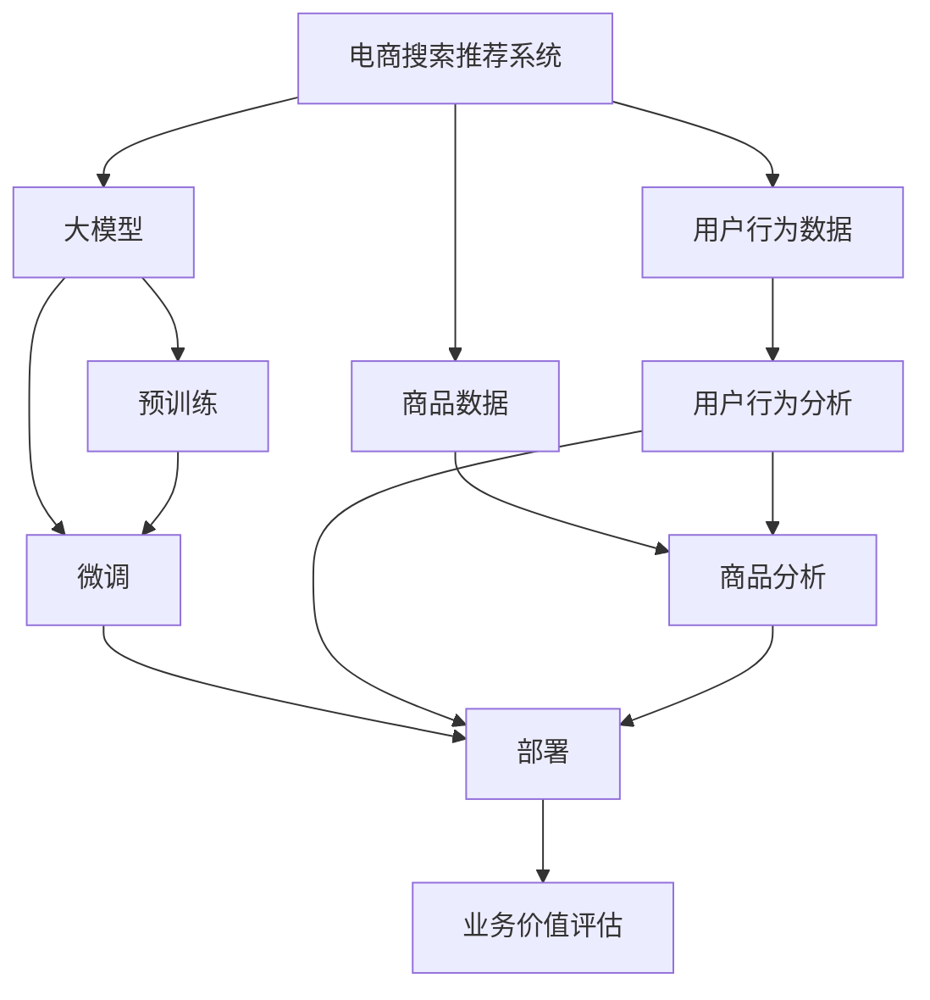
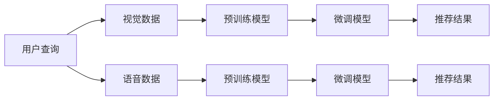

                 

# AI大模型视角下电商搜索推荐的业务价值评估方法

## 1. 背景介绍

在快速发展的电商环境中，如何通过先进的AI技术优化搜索推荐系统，提升用户购物体验、增加平台销售额、提高客户满意度等业务指标，是各大电商平台都在积极探索的课题。AI大模型凭借其强大的学习能力和泛化能力，在电商搜索推荐领域展现出巨大的潜力。然而，构建高质量的电商搜索推荐系统，不仅需要强大的模型，更需要一套科学合理的业务价值评估方法，以便从模型的各个层面进行优化与调整。

### 1.1 问题由来

随着电商行业的发展，传统的基于规则或特征工程的搜索推荐系统已经难以满足用户的多样化需求和市场的动态变化。越来越多的电商平台开始尝试应用AI技术，特别是大模型，来构建智能搜索推荐系统，以期提高推荐效果，增加用户粘性，促进转化率。

目前，AI大模型在电商搜索推荐中的主流应用包括：
- 基于深度学习模型的个性化推荐
- 基于强化学习的在线推荐系统
- 结合自然语言处理技术的搜索推荐

尽管这些方法在提升推荐效果方面取得了显著进展，但仍然存在诸多挑战。例如，如何设计合理的指标体系评估模型的效果，如何通过超参数调优、模型训练、模型部署等环节提升推荐系统的业务价值，以及如何通过数据驱动的方式不断优化推荐模型等。这些问题，在某种程度上，决定了AI大模型在电商搜索推荐系统中的实际应用效果。

### 1.2 问题核心关键点

大模型在电商搜索推荐中的应用，主要体现在以下几个方面：
- 预训练：通过大规模语料库预训练模型，获取丰富的语言表示能力。
- 微调：根据电商平台的特定需求，在预训练基础上进行微调，以适应电商环境。
- 部署：将微调后的模型部署到电商搜索推荐系统，实现高效推荐。
- 业务评估：通过科学合理的指标体系，评估模型的实际业务价值，指导模型优化。

本文将详细探讨如何从AI大模型的视角出发，构建一个高效、智能、可控的电商搜索推荐系统，并通过业务价值评估方法，指导模型的优化与部署。

## 2. 核心概念与联系

### 2.1 核心概念概述

为了更好地理解电商搜索推荐系统中AI大模型的应用与优化，首先需要明确几个核心概念：

- **大模型(Large Model)**：指具有亿级参数规模的深度学习模型，如BERT、GPT-3、Transformer等。这些模型通过在大规模语料库上进行预训练，具备强大的学习能力和泛化能力。
- **电商搜索推荐系统(E-Commerce Search Recommendation System)**：指结合电商特色，为用户提供个性化搜索和推荐服务的系统。系统通常包含商品信息展示、搜索推荐、交易转化等关键环节。
- **业务价值评估(Business Value Assessment)**：指通过设计合理的指标体系，全面、客观地评估电商搜索推荐系统的实际业务效果，包括用户满意度、推荐效果、销售额等。

这些核心概念之间的联系可以通过以下Mermaid流程图来展示：



这个流程图展示了电商搜索推荐系统、大模型、用户行为数据、商品数据等关键组件之间的关系，以及预训练、微调、部署、业务价值评估等主要环节。

### 2.2 核心概念原理和架构的 Mermaid 流程图

在Mermaid中绘制一个大模型在电商搜索推荐系统中的应用流程图：


这个流程图详细展示了大模型在电商搜索推荐系统中的应用路径，从预训练、微调、部署到实际应用，再到用户反馈和模型优化，形成了一个闭环的系统。

## 3. 核心算法原理 & 具体操作步骤

### 3.1 算法原理概述

电商搜索推荐系统的核心目标是通过精准推荐，提高用户满意度，增加销售额。大模型在电商搜索推荐中的应用，主要体现在以下几个方面：

- **预训练**：通过大规模语料库进行预训练，获取丰富的语言表示能力。
- **微调**：根据电商平台的特定需求，在预训练基础上进行微调，以适应电商环境。
- **部署**：将微调后的模型部署到电商搜索推荐系统，实现高效推荐。
- **业务价值评估**：通过设计合理的指标体系，全面、客观地评估电商搜索推荐系统的实际业务效果。

### 3.2 算法步骤详解

#### 3.2.1 预训练

电商搜索推荐系统的预训练主要包括以下几个步骤：
1. **数据收集**：从电商平台收集商品信息、用户行为数据等，构建大规模语料库。
2. **数据清洗**：对收集到的数据进行清洗、去重、补全等处理，确保数据质量。
3. **模型构建**：选择合适的预训练模型（如BERT、GPT-3、Transformer等），并在大规模语料库上进行预训练。
4. **模型评估**：通过预训练损失函数、验证集评估等手段，评估预训练模型的效果，确保模型泛化能力。

#### 3.2.2 微调

电商搜索推荐系统的微调主要包括以下几个步骤：
1. **任务适配**：根据电商平台的特定需求，设计合适的任务适配层，如分类、排序、生成等。
2. **数据准备**：准备电商平台的标注数据集，并进行分批次加载。
3. **模型训练**：使用微调后的模型，在标注数据集上进行训练，优化模型参数。
4. **模型评估**：通过测试集评估微调模型的效果，如精度、召回率、AUC等指标。
5. **模型优化**：根据评估结果，调整模型参数、超参数等，进一步优化模型性能。

#### 3.2.3 部署

电商搜索推荐系统的部署主要包括以下几个步骤：
1. **模型保存**：将微调后的模型保存到指定路径，如硬盘、云存储等。
2. **模型加载**：在电商推荐系统中加载保存好的模型，进行实时推荐。
3. **接口设计**：设计高效的推荐接口，确保模型与电商系统的无缝对接。
4. **性能监控**：实时监控推荐系统的性能，确保推荐效果稳定。

#### 3.2.4 业务价值评估

电商搜索推荐系统的业务价值评估主要包括以下几个步骤：
1. **指标设计**：根据电商平台的业务需求，设计合适的评估指标，如点击率、转化率、用户满意度等。
2. **数据采集**：通过电商平台的数据采集接口，获取推荐系统的关键数据。
3. **模型评估**：根据设计好的指标体系，对推荐系统的实际业务效果进行评估，确保模型效果。
4. **模型优化**：根据评估结果，调整模型参数、超参数等，进一步优化模型性能。

### 3.3 算法优缺点

电商搜索推荐系统中使用大模型进行预训练和微调，具有以下优点：
- **泛化能力强**：大模型能够从大规模语料库中学习到丰富的语言表示能力，具有良好的泛化能力，适应多种场景。
- **推荐效果高**：大模型通过复杂的特征提取和表示学习，能够精准地捕捉用户偏好和商品特性，提升推荐效果。
- **自动化程度高**：大模型能够自动学习和优化，减少人工干预，提高模型优化效率。

然而，大模型在电商搜索推荐系统中的应用也存在以下缺点：
- **数据依赖大**：大模型的预训练和微调需要大量的标注数据，数据依赖较大。
- **计算资源需求高**：大模型的计算资源需求高，需要高性能计算设备和充足的计算资源。
- **部署复杂**：大模型的部署需要考虑模型压缩、推理加速等问题，部署复杂度较高。
- **业务价值评估难**：电商搜索推荐系统的业务价值评估涉及多个环节，评估复杂度较高。

### 3.4 算法应用领域

大模型在电商搜索推荐系统中的应用，主要包括以下几个领域：
- **个性化推荐**：通过大模型学习用户行为数据和商品特征，提供个性化推荐。
- **搜索排序**：通过大模型学习搜索结果排序的策略，提升搜索效果。
- **广告投放**：通过大模型学习广告投放的策略，提升广告转化率。
- **用户行为分析**：通过大模型学习用户行为数据，分析用户需求和偏好，提供精准营销。

## 4. 数学模型和公式 & 详细讲解 & 举例说明

### 4.1 数学模型构建

在电商搜索推荐系统中，大模型的应用主要涉及以下几个数学模型：

1. **预训练模型**：通过大规模语料库进行预训练，获取丰富的语言表示能力。常用的预训练模型包括BERT、GPT-3、Transformer等。

2. **微调模型**：在预训练基础上，根据电商平台的特定需求进行微调。常用的微调任务包括分类、排序、生成等。

3. **推荐模型**：通过微调后的模型，进行实时推荐。常用的推荐模型包括协同过滤、基于内容的推荐等。

### 4.2 公式推导过程

#### 4.2.1 预训练模型

预训练模型的公式推导主要基于深度学习中的自监督学习任务。以BERT为例，其预训练目标函数为：

$$
\mathcal{L}(\theta) = \frac{1}{N}\sum_{i=1}^N \ell(\theta, x_i)
$$

其中，$\theta$ 表示预训练模型参数，$x_i$ 表示预训练语料库中的文本数据，$\ell$ 表示预训练损失函数，如掩码语言模型、下一句预测等。

#### 4.2.2 微调模型

微调模型的公式推导主要基于监督学习任务。以分类任务为例，其微调目标函数为：

$$
\mathcal{L}(\theta) = \frac{1}{N}\sum_{i=1}^N [\ell(\theta, x_i, y_i)]
$$

其中，$\theta$ 表示微调模型参数，$x_i$ 表示标注数据集中的输入数据，$y_i$ 表示标注数据集中的标签数据，$\ell$ 表示分类损失函数，如交叉熵损失、Hinge损失等。

#### 4.2.3 推荐模型

推荐模型的公式推导主要基于深度学习中的推荐系统。以协同过滤推荐为例，其推荐目标函数为：

$$
\mathcal{L}(\theta) = \frac{1}{N}\sum_{i=1}^N \sum_{j=1}^M [\ell(\theta, x_i, x_j, y_j)]
$$

其中，$\theta$ 表示推荐模型参数，$x_i$ 表示用户行为数据，$x_j$ 表示商品数据，$y_j$ 表示用户对商品的真实评分，$\ell$ 表示推荐损失函数，如均方误差损失、KL散度等。

### 4.3 案例分析与讲解

以电商搜索推荐系统中的个性化推荐为例，介绍大模型的应用和业务价值评估方法。

假设某电商平台有一个个性化推荐系统，目标是推荐用户可能感兴趣的商品。该系统使用了大模型进行预训练和微调，其模型结构如图：


在实际应用中，该推荐系统的业务价值评估主要包括以下几个步骤：
1. **指标设计**：设计合适的评估指标，如点击率、转化率、用户满意度等。
2. **数据采集**：通过电商平台的数据采集接口，获取推荐系统的关键数据。
3. **模型评估**：根据设计好的指标体系，对推荐系统的实际业务效果进行评估，确保模型效果。
4. **模型优化**：根据评估结果，调整模型参数、超参数等，进一步优化模型性能。

## 5. 项目实践：代码实例和详细解释说明

### 5.1 开发环境搭建

为了进行电商搜索推荐系统的开发，需要准备以下开发环境：
1. **编程语言**：Python是电商搜索推荐系统开发的主流语言，需要安装Python 3.7及以上版本。
2. **深度学习框架**：TensorFlow和PyTorch是目前电商搜索推荐系统开发中最常用的深度学习框架，需要安装对应的版本。
3. **大模型库**：HuggingFace和TensorFlow Hub提供了丰富的预训练模型库，需要安装对应的库。
4. **电商API**：需要安装电商平台的API库，以便获取用户行为数据和商品数据。

### 5.2 源代码详细实现

以下是一个使用大模型进行电商搜索推荐系统的示例代码：

```python
import tensorflow as tf
from transformers import TFBertForSequenceClassification, BertTokenizer
from tensorflow_hub import load_tensorflow_hub_module
from tf_keras.layers import Input, Embedding, Dense, Dropout, Concatenate

# 加载预训练模型
bert_pretrain = load_tensorflow_hub_module("https://tfhub.dev/google/nnlm-en-dim128/1")
bert_pretrain = TFBertForSequenceClassification.from_pretrained(bert_pretrain)

# 加载用户行为数据和商品数据
user_data = load_user_data()
item_data = load_item_data()

# 准备数据集
tokenizer = BertTokenizer.from_pretrained("bert-base-uncased")
max_len = 128
input_ids = []
attention_mask = []
labels = []
for user, item in zip(user_data, item_data):
    inputs = tokenizer(user, item, max_len=max_len, padding="max_length", truncation=True)
    input_ids.append(inputs["input_ids"])
    attention_mask.append(inputs["attention_mask"])
    labels.append(1 if item == "buy" else 0)

# 构建微调模型
input_ids = tf.keras.layers.Input(shape=(max_len,), name="input_ids")
attention_mask = tf.keras.layers.Input(shape=(max_len,), name="attention_mask")
labels = tf.keras.layers.Input(shape=(), name="labels")

# 嵌入层
bert_embeddings = bert_pretrain(input_ids, attention_mask=attention_mask)[0]

# 隐藏层
hidden_layer = Dense(128, activation="relu")(bert_embeddings)

# 输出层
output_layer = Dense(1, activation="sigmoid")(hidden_layer)

# 模型
model = tf.keras.Model(inputs=[input_ids, attention_mask, labels], outputs=[output_layer])
model.compile(optimizer="adam", loss="binary_crossentropy", metrics=["accuracy"])

# 训练模型
model.fit([input_ids, attention_mask], labels, epochs=5, batch_size=32)

# 预测推荐结果
test_data = load_test_data()
test_input_ids = tokenizer(test_data["user"], test_data["item"], max_len=max_len, padding="max_length", truncation=True)["input_ids"]
test_attention_mask = tokenizer(test_data["user"], test_data["item"], max_len=max_len, padding="max_length", truncation=True)["attention_mask"]
test_labels = model.predict([test_input_ids, test_attention_mask])
print(test_labels)
```

### 5.3 代码解读与分析

在上述代码中，我们使用了BERT模型进行电商搜索推荐系统的开发，主要分为以下几个步骤：
1. **加载预训练模型**：通过TensorFlow Hub加载预训练的BERT模型。
2. **加载用户行为数据和商品数据**：从电商平台上获取用户行为数据和商品数据。
3. **准备数据集**：将用户行为数据和商品数据转换为模型所需格式的输入数据和标签数据。
4. **构建微调模型**：使用预训练模型作为嵌入层，添加隐藏层和输出层，构建微调模型。
5. **训练模型**：在准备好的数据集上训练微调模型，优化模型参数。
6. **预测推荐结果**：使用训练好的模型对新数据进行预测，输出推荐结果。

## 6. 实际应用场景

### 6.1 智能客服系统

智能客服系统通过结合大模型进行微调，可以实现自动回答用户查询，提升客户满意度，减少人工客服的工作量。例如，某电商平台智能客服系统使用了大模型进行预训练和微调，其系统结构如图：


在实际应用中，该智能客服系统的业务价值评估主要包括以下几个步骤：
1. **指标设计**：设计合适的评估指标，如响应时间、回答准确率、用户满意度等。
2. **数据采集**：通过电商平台的数据采集接口，获取智能客服系统的关键数据。
3. **模型评估**：根据设计好的指标体系，对智能客服系统的实际业务效果进行评估，确保系统效果。
4. **模型优化**：根据评估结果，调整模型参数、超参数等，进一步优化模型性能。

### 6.2 金融理财服务

金融理财服务通过结合大模型进行微调，可以实现精准理财建议，提升用户体验，增加理财收益。例如，某金融理财服务平台使用了大模型进行预训练和微调，其系统结构如图：


在实际应用中，该金融理财服务平台的业务价值评估主要包括以下几个步骤：
1. **指标设计**：设计合适的评估指标，如用户理财收益、理财建议的精准度等。
2. **数据采集**：通过金融理财服务平台的数据采集接口，获取理财系统的关键数据。
3. **模型评估**：根据设计好的指标体系，对理财系统的实际业务效果进行评估，确保系统效果。
4. **模型优化**：根据评估结果，调整模型参数、超参数等，进一步优化模型性能。

## 7. 工具和资源推荐

### 7.1 学习资源推荐

为了帮助开发者系统掌握大模型在电商搜索推荐系统中的应用，这里推荐一些优质的学习资源：
1. **《深度学习入门：基于TensorFlow》**：由深度学习专家李沐所著，介绍了深度学习的基本概念和TensorFlow的使用方法。
2. **《NLP实战》**：由自然语言处理专家吴恩达所著，介绍了自然语言处理的基本概念和PyTorch的使用方法。
3. **《机器学习实战》**：由机器学习专家Tom Mitchell所著，介绍了机器学习的基本概念和Python的使用方法。
4. **HuggingFace官方文档**：提供了丰富的预训练模型和代码示例，是电商搜索推荐系统开发的重要资源。
5. **TensorFlow Hub官方文档**：提供了丰富的TensorFlow Hub模块，方便电商搜索推荐系统开发。

通过对这些资源的学习实践，相信你一定能够快速掌握大模型在电商搜索推荐系统中的应用，并用于解决实际的NLP问题。

### 7.2 开发工具推荐

高效的开发离不开优秀的工具支持。以下是几款用于电商搜索推荐系统开发的工具：
1. **TensorFlow**：由Google主导开发的深度学习框架，适用于大规模工程应用。
2. **PyTorch**：由Facebook主导开发的深度学习框架，适用于灵活的研究和实验。
3. **Jupyter Notebook**：用于编写和运行Python代码，支持数据可视化和模型训练。
4. **TensorBoard**：TensorFlow配套的可视化工具，可实时监测模型训练状态，提供丰富的图表呈现方式。
5. **Weights & Biases**：模型训练的实验跟踪工具，记录和可视化模型训练过程中的各项指标，方便对比和调优。

合理利用这些工具，可以显著提升电商搜索推荐系统的开发效率，加快创新迭代的步伐。

### 7.3 相关论文推荐

大模型在电商搜索推荐系统中的应用涉及多个领域，相关论文代表了最新的研究进展，值得阅读：
1. **《Bidirectional Encoder Representations from Transformers》（BERT）**：提出BERT模型，引入掩码语言模型预训练任务，刷新了多项NLP任务SOTA。
2. **《Scalable Wide & Deep Neural Networks for Ad Ranking》**：提出Wide & Deep模型，通过线性层和深度神经网络结合，提升了广告点击率预测效果。
3. **《Recurrent Neural Network Architectures for Recommender Systems》**：提出RNN架构，通过时间序列建模，提升了推荐系统的效果。
4. **《Gated Attention Variational Autoencoders for Sequential Recommendations》**：提出变分自编码器，通过序列建模，提升了推荐系统的泛化能力。
5. **《Personalized Sequential Recommendations with Multilevel Transformer Architectures》**：提出Transformer架构，通过多层结构，提升了推荐系统的效果。

这些论文代表了大模型在电商搜索推荐系统中的最新研究进展，值得深入阅读和理解。

## 8. 总结：未来发展趋势与挑战

### 8.1 研究成果总结

本文对大模型在电商搜索推荐系统中的应用进行了详细探讨，主要包括以下几个方面：
1. **预训练模型**：通过大规模语料库进行预训练，获取丰富的语言表示能力。
2. **微调模型**：在预训练基础上，根据电商平台的特定需求进行微调，以适应电商环境。
3. **推荐模型**：通过微调后的模型，进行实时推荐。
4. **业务价值评估**：通过设计合理的指标体系，全面、客观地评估电商搜索推荐系统的实际业务效果。

### 8.2 未来发展趋势

展望未来，大模型在电商搜索推荐系统中的应用将呈现以下几个发展趋势：
1. **模型规模持续增大**：随着算力成本的下降和数据规模的扩张，预训练语言模型的参数量还将持续增长。超大规模语言模型蕴含的丰富语言知识，有望支撑更加复杂多变的电商搜索推荐系统。
2. **微调方法日趋多样**：未来将涌现更多参数高效的微调方法，如Prompt-Tuning、LoRA等，在节省计算资源的同时也能保证微调精度。
3. **持续学习成为常态**：随着数据分布的不断变化，微调模型也需要持续学习新知识以保持性能。如何在不遗忘原有知识的同时，高效吸收新样本信息，将成为重要的研究课题。
4. **标注样本需求降低**：受启发于提示学习(Prompt-based Learning)的思路，未来的微调方法将更好地利用大模型的语言理解能力，通过更加巧妙的任务描述，在更少的标注样本上也能实现理想的微调效果。
5. **多模态微调崛起**：未来的电商搜索推荐系统将融合视觉、语音等多模态数据，提升模型的泛化能力和用户满意度。
6. **知识整合能力增强**：未来的电商搜索推荐系统将结合专家知识库、规则库等，形成更加全面、准确的信息整合能力，提升推荐效果。

以上趋势凸显了大模型在电商搜索推荐系统中的广阔前景，这些方向的探索发展，必将进一步提升推荐系统的性能和应用范围，为电商平台的智能化转型提供新的动力。

### 8.3 面临的挑战

尽管大模型在电商搜索推荐系统中的应用已经取得了显著进展，但仍面临诸多挑战：
1. **数据依赖大**：大模型的预训练和微调需要大量的标注数据，数据依赖较大。
2. **计算资源需求高**：大模型的计算资源需求高，需要高性能计算设备和充足的计算资源。
3. **部署复杂**：大模型的部署需要考虑模型压缩、推理加速等问题，部署复杂度较高。
4. **业务价值评估难**：电商搜索推荐系统的业务价值评估涉及多个环节，评估复杂度较高。
5. **模型鲁棒性不足**：当前微调模型面对域外数据时，泛化性能往往大打折扣。
6. **模型偏见和有害信息**：预训练模型难免会学习到有偏见、有害的信息，通过微调传递到下游任务，产生误导性、歧视性的输出。

### 8.4 研究展望

面对电商搜索推荐系统中的大模型应用所面临的诸多挑战，未来的研究需要在以下几个方面寻求新的突破：
1. **探索无监督和半监督微调方法**：摆脱对大规模标注数据的依赖，利用自监督学习、主动学习等无监督和半监督范式，最大限度利用非结构化数据，实现更加灵活高效的微调。
2. **研究参数高效和计算高效的微调范式**：开发更加参数高效的微调方法，在固定大部分预训练参数的同时，只更新极少量的任务相关参数。同时优化微调模型的计算图，减少前向传播和反向传播的资源消耗，实现更加轻量级、实时性的部署。
3. **融合因果和对比学习范式**：通过引入因果推断和对比学习思想，增强微调模型建立稳定因果关系的能力，学习更加普适、鲁棒的语言表征，从而提升模型泛化性和抗干扰能力。
4. **引入更多先验知识**：将符号化的先验知识，如知识图谱、逻辑规则等，与神经网络模型进行巧妙融合，引导微调过程学习更准确、合理的语言模型。同时加强不同模态数据的整合，实现视觉、语音等多模态信息与文本信息的协同建模。
5. **结合因果分析和博弈论工具**：将因果分析方法引入微调模型，识别出模型决策的关键特征，增强输出解释的因果性和逻辑性。借助博弈论工具刻画人机交互过程，主动探索并规避模型的脆弱点，提高系统稳定性。
6. **纳入伦理道德约束**：在模型训练目标中引入伦理导向的评估指标，过滤和惩罚有偏见、有害的输出倾向。同时加强人工干预和审核，建立模型行为的监管机制，确保输出符合人类价值观和伦理道德。

通过这些研究方向的探索，必将引领大模型在电商搜索推荐系统中的应用迈向更高的台阶，为构建安全、可靠、可解释、可控的智能系统铺平道路。面向未来，大模型在电商搜索推荐系统中的应用还需要与其他人工智能技术进行更深入的融合，如知识表示、因果推理、强化学习等，多路径协同发力，共同推动电商搜索推荐系统的进步。只有勇于创新、敢于突破，才能不断拓展大模型在电商搜索推荐系统中的边界，让智能技术更好地造福电商平台和用户。

## 9. 附录：常见问题与解答

**Q1：大模型在电商搜索推荐系统中能否高效地处理多模态数据？**

A: 大模型在电商搜索推荐系统中可以高效地处理多模态数据。通过引入视觉、语音等多模态信息，大模型可以更加全面地理解用户需求和商品特性，提升推荐效果。例如，某电商平台智能客服系统使用了多模态大模型进行预训练和微调，系统结构如图：



在实际应用中，该智能客服系统的业务价值评估主要包括以下几个步骤：
1. **指标设计**：设计合适的评估指标，如响应时间、回答准确率、用户满意度等。
2. **数据采集**：通过电商平台的数据采集接口，获取智能客服系统的关键数据。
3. **模型评估**：根据设计好的指标体系，对智能客服系统的实际业务效果进行评估，确保系统效果。
4. **模型优化**：根据评估结果，调整模型参数、超参数等，进一步优化模型性能。

**Q2：如何避免电商搜索推荐系统中的推荐过拟合现象？**

A: 电商搜索推荐系统中的推荐过拟合现象可以通过以下几种方法进行避免：
1. **数据增强**：通过回译、近义替换等方式扩充训练集，增加数据的多样性。
2. **正则化**：使用L2正则、Dropout等方法，减少模型的复杂度，防止过拟合。
3. **对抗训练**：引入对抗样本，提高模型的鲁棒性，防止模型对特定样本产生过拟合。
4. **参数高效微调**：只调整少量模型参数，固定大部分预训练权重，减少过拟合风险。
5. **多模型集成**：训练多个微调模型，取平均输出，抑制过拟合现象。

这些方法需要在电商搜索推荐系统的各个环节进行综合应用，才能最大限度地避免推荐过拟合现象。

**Q3：电商搜索推荐系统中的业务价值评估指标有哪些？**

A: 电商搜索推荐系统中的业务价值评估指标主要包括以下几个方面：
1. **用户满意度**：通过用户反馈、用户行为数据等，评估用户对推荐系统的满意度。
2. **推荐效果**：通过点击率、转化率、销售额等指标，评估推荐系统的实际效果。
3. **用户体验**：通过页面停留时间、点击次数等指标，评估用户的点击体验和浏览体验。
4. **技术指标**：通过模型参数、推理速度等指标，评估推荐系统的技术指标。

这些指标需要根据电商平台的特定需求进行综合设计，并定期进行评估和优化，确保推荐系统能够达到最佳的业务效果。

**Q4：电商搜索推荐系统中的大模型压缩技术有哪些？**

A: 电商搜索推荐系统中的大模型压缩技术主要包括：
1. **知识蒸馏**：通过知识蒸馏技术，将大模型的知识传递给压缩后的模型，保持推荐效果。
2. **剪枝**：通过剪枝技术，去除冗余参数，减小模型尺寸。
3. **量化**：通过量化技术，将浮点模型转为定点模型，压缩存储空间，提高计算效率。
4. **知识图谱**：通过知识图谱技术，提取模型中的关键知识，压缩模型参数。
5. **混合精度训练**：通过混合精度训练技术，降低计算资源需求，提升训练速度。

这些技术需要根据电商搜索推荐系统的特定需求进行综合应用，才能达到最佳的模型压缩效果。

**Q5：电商搜索推荐系统中的大模型部署技术有哪些？**

A: 电商搜索推荐系统中的大模型部署技术主要包括：
1. **模型裁剪**：去除不必要的层和参数，减小模型尺寸，加快推理速度。
2. **量化加速**：将浮点模型转为定点模型，压缩存储空间，提高计算效率。
3. **服务化封装**：将模型封装为标准化服务接口，便于集成调用。
4. **弹性伸缩**：根据请求流量动态调整资源配置，平衡服务质量和成本。
5. **监控告警**：实时采集系统指标，设置异常告警阈值，确保服务稳定性。

这些技术需要根据电商搜索推荐系统的特定需求进行综合应用，才能达到最佳的模型部署效果。

---

作者：禅与计算机程序设计艺术 / Zen and the Art of Computer Programming

