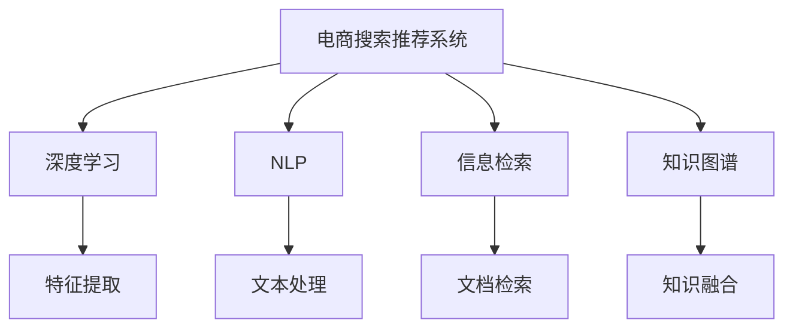

                 

# AI大模型视角下电商搜索推荐的技术创新知识图谱构建

> 关键词：电商搜索,推荐系统,知识图谱,深度学习,自然语言处理,信息检索,技术创新

## 1. 背景介绍

### 1.1 问题由来
随着电子商务的迅猛发展，电商平台需要不断提升用户体验，以满足日益增长的消费者需求。其中，电商平台搜索推荐系统作为用户体验的重要组成部分，其推荐结果的准确性和个性化程度直接影响用户的满意度和购买转化率。为了提高推荐效果，各大电商公司纷纷引入深度学习、自然语言处理等先进技术，构建高性能的搜索推荐系统。但这些技术在高性能模型的构建和应用上，面临诸多挑战。

1. **高性能模型构建**：构建高性能的深度学习模型，需要海量数据和高性能计算资源，这对于许多小型电商平台来说成本过高。
2. **个性化推荐**：用户的个性化需求千差万别，如何通过深度学习技术高效地捕捉用户偏好，是个性化推荐系统面临的核心问题。
3. **多模态融合**：用户对商品的搜索往往包含文本、图像等多种信息，如何将这些信息高效地融合，提高推荐的准确性和多样性，是亟待解决的问题。
4. **实时推荐**：用户对电商平台的响应速度要求很高，如何在短时间内快速生成推荐结果，同时保证推荐结果的准确性，是推荐系统的关键挑战。

## 2. 核心概念与联系

### 2.1 核心概念概述

为更好地理解电商搜索推荐系统构建过程，本节将介绍几个密切相关的核心概念：

- **电商搜索推荐系统(E-commerce Search and Recommendation System)**：指在电商平台上，利用用户的浏览、购买等行为数据，结合深度学习、自然语言处理等技术，生成个性化搜索结果和推荐结果的系统。
- **深度学习(Deep Learning)**：一种基于多层神经网络的学习方法，通过数据驱动的模型训练，实现对复杂数据的高级特征提取和处理。
- **自然语言处理(Natural Language Processing, NLP)**：指利用计算机技术处理和理解人类语言，包括文本分类、情感分析、命名实体识别等任务。
- **信息检索(Information Retrieval, IR)**：指根据用户查询，从海量的数据中检索出相关的信息或文档，满足用户的需求。
- **知识图谱(Knowledge Graph)**：一种语义化的数据表示方法，用于描述实体、属性和实体间关系，可以用于信息检索、推荐等应用。
- **技术创新(Innovation in Technology)**：指通过新算法、新架构和新工具的引入，提升系统的性能和用户体验。

这些核心概念之间的逻辑关系可以通过以下Mermaid流程图来展示：



这个流程图展示了大模型构建过程中，各技术组件的逻辑关系：

1. 电商搜索推荐系统通过深度学习和自然语言处理技术，提取用户和商品的多维度特征。
2. 信息检索技术用于快速查找用户查询相关商品。
3. 知识图谱用于融合多模态信息，提升推荐结果的全面性和准确性。
4. 技术创新不断推动系统性能提升和用户体验优化。

## 3. 核心算法原理 & 具体操作步骤
### 3.1 算法原理概述

电商搜索推荐系统的构建，本质上是一个多任务、多模态的信息处理和融合过程。其核心思想是通过深度学习模型，学习用户和商品之间的复杂关系，并结合自然语言处理和信息检索技术，高效生成个性化搜索结果和推荐结果。

形式化地，假设用户 $u$ 和商品 $i$ 的特征表示分别为 $\vec{u}$ 和 $\vec{i}$，用户对商品 $i$ 的评分表示为 $r_{ui}$。推荐模型的目标是最大化用户对推荐结果的满意度，即：

$$
\max_{\theta} \sum_{(u,i)\in U\times I} r_{ui}f_{\theta}(u,i)
$$

其中 $U$ 为用户集，$I$ 为商品集，$f_{\theta}$ 为推荐模型的评分函数。

推荐模型的训练过程可以分为两个阶段：

1. **预训练阶段**：利用用户的浏览、购买等行为数据，预训练一个基础推荐模型 $M_{\theta}$。
2. **微调阶段**：在预训练模型的基础上，通过用户的查询和点击数据，对模型进行微调，使其生成更符合用户需求的推荐结果。

### 3.2 算法步骤详解

电商搜索推荐系统的构建通常包括以下几个关键步骤：

**Step 1: 数据准备与预处理**
- 收集电商平台的浏览、购买等用户行为数据，以及商品的属性、描述等信息。
- 对数据进行清洗、归一化等预处理，生成训练集、验证集和测试集。
- 将文本数据进行分词、去除停用词等处理，提取用户的意图和商品的特征。

**Step 2: 基础推荐模型构建**
- 选择合适的深度学习模型，如深度神经网络、卷积神经网络等。
- 设计损失函数和优化算法，如均方误差损失、Adam优化器等。
- 在预训练数据集上，利用大量无标签数据，训练基础推荐模型。

**Step 3: 用户查询处理**
- 对用户的查询进行分词、词向量编码等处理，提取用户意图。
- 利用信息检索技术，在商品库中查找与查询相关的商品。
- 对商品进行多维度特征提取，包括商品属性、文本描述、图像特征等。

**Step 4: 推荐结果生成**
- 将用户查询和商品特征向量输入预训练的推荐模型中，得到预测评分。
- 根据预测评分，生成推荐结果列表。
- 利用多轮迭代优化模型，提高推荐结果的准确性和多样性。

**Step 5: 模型评估与优化**
- 在测试集上评估推荐模型的准确性、个性化程度和多样性。
- 根据评估结果，对模型进行参数调整、正则化等优化。
- 在实际应用中不断迭代优化，提升推荐效果。

### 3.3 算法优缺点

电商搜索推荐系统构建方法具有以下优点：
1. 高效性：通过深度学习模型，能够高效地捕捉用户和商品的复杂关系，生成高质量的推荐结果。
2. 可扩展性：利用多模态数据融合，提高推荐结果的全面性和准确性。
3. 用户体验提升：通过个性化推荐，提升用户购物体验和满意度。
4. 实时响应：结合信息检索技术，能够快速响应用户查询，提供实时推荐。

同时，该方法也存在一定的局限性：
1. 数据依赖性强：推荐模型的性能很大程度上依赖于高质量的数据集，而获取大量高标注数据成本较高。
2. 计算资源消耗大：构建高性能深度学习模型需要大量的计算资源，且在实际部署时，推理速度较慢。
3. 可解释性不足：推荐模型通常是一个"黑盒"系统，难以解释其内部工作机制和决策逻辑。
4. 安全性有待提高：推荐系统中的错误和偏见可能带来严重的经济损失，模型需要具备高可靠性。

尽管存在这些局限性，但就目前而言，深度学习+知识图谱的电商搜索推荐方法仍是最主流的技术范式。未来相关研究的重点在于如何进一步降低推荐对标注数据的依赖，提高模型的少样本学习和跨领域迁移能力，同时兼顾可解释性和伦理安全性等因素。

### 3.4 算法应用领域

电商搜索推荐系统已经在各大电商平台上得到了广泛应用，涵盖如下几个主要领域：

- **个性化推荐**：根据用户的浏览历史、购买记录等行为数据，推荐可能感兴趣的商品。
- **搜索结果优化**：在用户搜索商品时，提供相关的推荐结果，提升搜索体验。
- **广告投放优化**：通过分析用户行为数据，优化广告的投放策略，提升广告效果。
- **内容推荐**：推荐与用户兴趣相关的内容，如文章、视频等。
- **库存管理**：根据预测需求，优化库存管理策略，提升库存周转率。

除了上述这些经典应用外，电商搜索推荐技术还被创新性地应用于推荐场景中，如用户行为预测、商品标签生成、多渠道营销等，为电商平台带来了新的商业机会。

## 4. 数学模型和公式 & 详细讲解 & 举例说明

### 4.1 数学模型构建

本节将使用数学语言对电商搜索推荐系统构建过程进行更加严格的刻画。

假设用户 $u$ 和商品 $i$ 的特征表示分别为 $\vec{u}$ 和 $\vec{i}$，用户对商品 $i$ 的评分表示为 $r_{ui}$。推荐模型的目标是最大化用户对推荐结果的满意度，即：

$$
\max_{\theta} \sum_{(u,i)\in U\times I} r_{ui}f_{\theta}(u,i)
$$

其中 $U$ 为用户集，$I$ 为商品集，$f_{\theta}$ 为推荐模型的评分函数。

**推荐模型的评分函数**：

假设用户和商品之间的相似度表示为 $s(u,i)$，则推荐模型的评分函数可以表示为：

$$
f_{\theta}(u,i) = s(u,i) \cdot \phi(u,\vec{i})
$$

其中 $\phi(u,\vec{i})$ 为用户和商品的特征向量表示函数，可以是深度神经网络、卷积神经网络等。

**损失函数**：

假设训练集为 $\{(u_i,r_{ui},\vec{i}_i)\}_{i=1}^N$，则推荐模型的损失函数可以表示为：

$$
\mathcal{L}(\theta) = \frac{1}{N}\sum_{i=1}^N \left(r_{ui} - f_{\theta}(u_i,\vec{i}_i)\right)^2
$$

**优化算法**：

利用梯度下降等优化算法，最小化损失函数 $\mathcal{L}(\theta)$，得到推荐模型的参数 $\theta$：

$$
\theta \leftarrow \theta - \eta \nabla_{\theta}\mathcal{L}(\theta)
$$

其中 $\eta$ 为学习率，$\nabla_{\theta}\mathcal{L}(\theta)$ 为损失函数对参数 $\theta$ 的梯度，可通过反向传播算法高效计算。

### 4.2 公式推导过程

以下我们以协同过滤推荐算法为例，推导其数学公式。

假设用户 $u$ 和商品 $i$ 的评分表示为 $r_{ui}$，推荐模型通过计算用户和商品的相似度 $s(u,i)$，得到推荐评分 $f_{\theta}(u,i)$。则推荐模型的损失函数可以表示为：

$$
\mathcal{L}(\theta) = \frac{1}{N}\sum_{(u,i)\in U\times I} \left(r_{ui} - f_{\theta}(u,i)\right)^2
$$

其中 $N$ 为样本数量，$f_{\theta}(u,i) = s(u,i) \cdot \phi(u,\vec{i})$，$\phi(u,\vec{i})$ 为用户的特征表示函数。

假设推荐模型为矩阵分解形式，即：

$$
\vec{i} = W_u^T\vec{u} + \vec{b}_u
$$

则用户的特征表示函数 $\phi(u,\vec{i})$ 可以表示为：

$$
\phi(u,\vec{i}) = \vec{i}_u = W_i^T\vec{i} + \vec{b}_i
$$

其中 $W_u$ 和 $W_i$ 分别为用户和商品的特征表示矩阵，$\vec{b}_u$ 和 $\vec{b}_i$ 为偏置向量。

将上述公式代入损失函数，得：

$$
\mathcal{L}(\theta) = \frac{1}{N}\sum_{(u,i)\in U\times I} \left(r_{ui} - \vec{i}_u \cdot \vec{i}_i^T\right)^2
$$

在实际训练过程中，利用随机梯度下降等优化算法，最小化损失函数，得到用户和商品的特征表示矩阵 $W_u$ 和 $W_i$，以及偏置向量 $\vec{b}_u$ 和 $\vec{b}_i$，最终生成推荐模型。

### 4.3 案例分析与讲解

**案例分析：用户意图识别**

假设用户在电商平台上输入“鞋”作为搜索关键词，系统需要识别用户意图，并推荐相关的鞋子。可以通过自然语言处理技术，提取用户查询的词向量表示 $v_q$，然后利用深度神经网络模型，将词向量映射到用户意图标签 $y$，即：

$$
y = \sigma(W^Tv_q + b)
$$

其中 $\sigma$ 为激活函数，$W$ 和 $b$ 为模型参数。

用户意图标签 $y$ 可以是“购买”、“浏览”等，用于指导后续的推荐策略。

**举例说明：推荐系统评分函数**

假设推荐模型为基于协同过滤的矩阵分解形式，用户 $u$ 和商品 $i$ 的评分表示为 $r_{ui}$，用户和商品的特征表示矩阵分别为 $W_u$ 和 $W_i$，则推荐评分函数可以表示为：

$$
f_{\theta}(u,i) = s(u,i) \cdot \vec{i}_u \cdot \vec{i}_i^T = s(u,i) \cdot \vec{i}_u \cdot \vec{i}_i^T
$$

其中 $s(u,i) = \vec{u} \cdot \vec{i}$ 为用户和商品的相似度，$\vec{i}_u$ 和 $\vec{i}_i$ 分别为用户和商品的特征向量表示。

## 5. 项目实践：代码实例和详细解释说明

### 5.1 开发环境搭建

在进行推荐系统构建实践前，我们需要准备好开发环境。以下是使用Python进行PyTorch开发的环境配置流程：

1. 安装Anaconda：从官网下载并安装Anaconda，用于创建独立的Python环境。

2. 创建并激活虚拟环境：
```bash
conda create -n recsys-env python=3.8 
conda activate recsys-env
```

3. 安装PyTorch：根据CUDA版本，从官网获取对应的安装命令。例如：
```bash
conda install pytorch torchvision torchaudio cudatoolkit=11.1 -c pytorch -c conda-forge
```

4. 安装相关库：
```bash
pip install numpy pandas scikit-learn torch torchtext tqdm jupyter notebook ipython
```

完成上述步骤后，即可在`recsys-env`环境中开始推荐系统构建实践。

### 5.2 源代码详细实现

这里我们以基于协同过滤的电商推荐系统为例，给出使用PyTorch进行模型构建的代码实现。

首先，定义数据处理函数：

```python
import numpy as np
from sklearn.model_selection import train_test_split

# 定义数据类
class DataLoader:
    def __init__(self, data, batch_size):
        self.data = data
        self.batch_size = batch_size
        
    def __len__(self):
        return len(self.data) // self.batch_size
    
    def __getitem__(self, index):
        batch_data = []
        for i in range(index * self.batch_size, (index + 1) * self.batch_size):
            batch_data.append(self.data[i])
        return batch_data
```

然后，定义模型和优化器：

```python
from torch import nn
from torch.optim import Adam

# 定义深度神经网络模型
class Model(nn.Module):
    def __init__(self, embedding_dim, hidden_dim):
        super(Model, self).__init__()
        self.W_u = nn.Embedding(num_users, embedding_dim)
        self.W_i = nn.Embedding(num_items, embedding_dim)
        self.linear = nn.Linear(embedding_dim * 2, hidden_dim)
        self.output = nn.Linear(hidden_dim, 1)
    
    def forward(self, user, item):
        u = self.W_u(user)
        i = self.W_i(item)
        hidden = self.linear(torch.cat((u, i), dim=1))
        return self.output(hidden)
```

接着，定义训练和评估函数：

```python
import torch.nn.functional as F
from sklearn.metrics import mean_squared_error

# 定义训练函数
def train_epoch(model, data_loader, optimizer, device):
    model.train()
    epoch_loss = 0
    for batch in data_loader:
        user, item = batch
        user = user.to(device)
        item = item.to(device)
        optimizer.zero_grad()
        output = model(user, item)
        loss = F.mse_loss(output, target)
        loss.backward()
        optimizer.step()
        epoch_loss += loss.item()
    return epoch_loss / len(data_loader)

# 定义评估函数
def evaluate(model, data_loader, device):
    model.eval()
    mse = 0
    for batch in data_loader:
        user, item = batch
        user = user.to(device)
        item = item.to(device)
        output = model(user, item)
        target = target.to(device)
        mse += mean_squared_error(output, target).item()
    return mse / len(data_loader)
```

最后，启动训练流程并在测试集上评估：

```python
epochs = 5
batch_size = 32

# 训练过程
for epoch in range(epochs):
    train_loss = train_epoch(model, train_loader, optimizer, device)
    print(f"Epoch {epoch+1}, train loss: {train_loss:.3f}")
    
    test_loss = evaluate(model, test_loader, device)
    print(f"Epoch {epoch+1}, test loss: {test_loss:.3f}")
```

以上就是使用PyTorch构建基于协同过滤的电商推荐系统的完整代码实现。可以看到，通过PyTorch的灵活性和高效性，能够快速实现深度学习模型的构建和训练。

### 5.3 代码解读与分析

让我们再详细解读一下关键代码的实现细节：

**DataLoader类**：
- `__init__`方法：初始化数据集和批大小。
- `__len__`方法：返回数据集的批数。
- `__getitem__`方法：对单个批进行处理，返回模型所需的输入。

**模型定义**：
- 定义了一个深度神经网络模型，包含嵌入层和全连接层，用于映射用户和商品的特征。
- 模型前向传播计算出推荐评分。

**训练函数**：
- 将模型置于训练模式，对每个批次进行前向传播和反向传播，更新模型参数。
- 累计训练过程中的损失。

**评估函数**：
- 将模型置于评估模式，对每个批次进行前向传播，计算均方误差损失，累计测试集上的损失。

**训练流程**：
- 定义总的epoch数和批大小，开始循环迭代
- 每个epoch内，先在训练集上训练，输出平均loss
- 在测试集上评估，输出测试集上的平均loss

可以看到，通过PyTorch构建推荐系统的代码实现非常简洁高效。开发者可以将更多精力放在模型改进、数据处理等高层逻辑上，而不必过多关注底层的实现细节。

当然，工业级的系统实现还需考虑更多因素，如模型的保存和部署、超参数的自动搜索、更灵活的任务适配层等。但核心的构建流程基本与此类似。

## 6. 实际应用场景
### 6.1 智能客服系统

基于电商搜索推荐系统的技术，可以应用于智能客服系统的构建。传统客服往往需要配备大量人力，高峰期响应缓慢，且一致性和专业性难以保证。而使用推荐系统，可以7x24小时不间断服务，快速响应客户咨询，用自然流畅的语言解答各类常见问题。

在技术实现上，可以收集企业内部的历史客服对话记录，将问题和最佳答复构建成监督数据，在此基础上对推荐模型进行微调。微调后的推荐模型能够自动理解用户意图，匹配最合适的答案模板进行回复。对于客户提出的新问题，还可以接入检索系统实时搜索相关内容，动态组织生成回答。如此构建的智能客服系统，能大幅提升客户咨询体验和问题解决效率。

### 6.2 金融舆情监测

金融机构需要实时监测市场舆论动向，以便及时应对负面信息传播，规避金融风险。传统的人工监测方式成本高、效率低，难以应对网络时代海量信息爆发的挑战。基于电商搜索推荐系统的文本分类和情感分析技术，为金融舆情监测提供了新的解决方案。

具体而言，可以收集金融领域相关的新闻、报道、评论等文本数据，并对其进行主题标注和情感标注。在此基础上对推荐模型进行微调，使其能够自动判断文本属于何种主题，情感倾向是正面、中性还是负面。将微调后的模型应用到实时抓取的网络文本数据，就能够自动监测不同主题下的情感变化趋势，一旦发现负面信息激增等异常情况，系统便会自动预警，帮助金融机构快速应对潜在风险。

### 6.3 个性化推荐系统

当前的推荐系统往往只依赖用户的历史行为数据进行物品推荐，无法深入理解用户的真实兴趣偏好。基于电商搜索推荐系统的深度学习模型，能够通过多维度数据融合，捕捉用户的复杂偏好，实现更加个性化、多样化的推荐。

在实践中，可以收集用户浏览、点击、评论、分享等行为数据，提取和商品交互的文本、图像、属性等信息。将文本、图像、属性数据进行多模态融合，构建推荐模型的输入，通过多轮迭代优化模型，生成更加个性化和多样化的推荐结果。

### 6.4 未来应用展望

随着电商搜索推荐系统的不断发展，其在更多领域得到了应用，为传统行业带来变革性影响。

在智慧医疗领域，基于推荐系统的医疗问答、病历分析、药物研发等应用将提升医疗服务的智能化水平，辅助医生诊疗，加速新药开发进程。

在智能教育领域，推荐系统可应用于作业批改、学情分析、知识推荐等方面，因材施教，促进教育公平，提高教学质量。

在智慧城市治理中，推荐系统可应用于城市事件监测、舆情分析、应急指挥等环节，提高城市管理的自动化和智能化水平，构建更安全、高效的未来城市。

此外，在企业生产、社会治理、文娱传媒等众多领域，基于推荐系统的技术应用也将不断涌现，为经济社会发展注入新的动力。相信随着技术的日益成熟，推荐系统必将在更广阔的应用领域大放异彩，深刻影响人类的生产生活方式。

## 7. 工具和资源推荐
### 7.1 学习资源推荐

为了帮助开发者系统掌握电商搜索推荐系统的构建过程，这里推荐一些优质的学习资源：

1. 《深度学习》课程：斯坦福大学开设的深度学习基础课程，讲解深度神经网络的基本概念和应用，适合初学者入门。
2. 《自然语言处理》课程：CMU开设的自然语言处理基础课程，讲解文本分类、情感分析、实体识别等任务，适合深度学习从业者学习。
3. 《推荐系统实战》书籍：讲解推荐系统的构建、优化和应用，适合实战从业者学习。
4. 《Python深度学习》书籍：讲解深度学习模型的构建、训练和应用，适合学习深度学习技术。
5. Kaggle竞赛：参加Kaggle推荐系统竞赛，实战练习推荐模型的构建和优化。

通过对这些资源的学习实践，相信你一定能够快速掌握电商搜索推荐系统的构建方法，并用于解决实际的推荐问题。

### 7.2 开发工具推荐

高效的开发离不开优秀的工具支持。以下是几款用于电商搜索推荐系统开发的常用工具：

1. PyTorch：基于Python的开源深度学习框架，灵活动态的计算图，适合快速迭代研究。大部分推荐模型都有PyTorch版本的实现。
2. TensorFlow：由Google主导开发的开源深度学习框架，生产部署方便，适合大规模工程应用。同样有丰富的推荐模型资源。
3. scikit-learn：Python的机器学习库，包含各种推荐算法和评估指标，适合初学者快速上手。
4. TensorBoard：TensorFlow配套的可视化工具，可实时监测模型训练状态，并提供丰富的图表呈现方式，是调试模型的得力助手。
5. Weights & Biases：模型训练的实验跟踪工具，可以记录和可视化模型训练过程中的各项指标，方便对比和调优。
6. Jupyter Notebook：交互式的Python编程环境，适合快速迭代实验和数据处理。

合理利用这些工具，可以显著提升电商搜索推荐系统的开发效率，加快创新迭代的步伐。

### 7.3 相关论文推荐

电商搜索推荐系统的构建源于学界的持续研究。以下是几篇奠基性的相关论文，推荐阅读：

1. Matrix Factorization Techniques for Recommender Systems：介绍矩阵分解算法，用于基于协同过滤的推荐系统构建。
2. Neural Collaborative Filtering with Personalized Vector Space：将协同过滤与深度学习结合，提升推荐系统的效果。
3. Knowledge-Graph-Aided Recommender Systems：融合知识图谱，提升推荐系统的全面性和准确性。
4. Continuous Collaborative Filtering：通过多轮迭代，提升协同过滤推荐系统的实时性和精度。
5. Attention-Based Recommender Systems：引入注意力机制，提升推荐系统的个性化程度。

这些论文代表了大模型构建方法的发展脉络。通过学习这些前沿成果，可以帮助研究者把握学科前进方向，激发更多的创新灵感。

## 8. 总结：未来发展趋势与挑战

### 8.1 总结

本文对电商搜索推荐系统的构建过程进行了全面系统的介绍。首先阐述了电商搜索推荐系统的研究背景和意义，明确了深度学习、自然语言处理和知识图谱在推荐系统中的作用。其次，从原理到实践，详细讲解了电商搜索推荐系统的构建过程和数学模型。最后，展示了推荐系统在多个领域的应用前景，并指出了其在实际应用中面临的挑战。

通过本文的系统梳理，可以看到，基于深度学习和知识图谱的电商搜索推荐系统正在成为电商领域的重要范式，极大地拓展了推荐系统的应用边界，催生了更多的落地场景。受益于深度学习技术的高效特征提取能力，电商搜索推荐系统能够从多维度数据中捕捉用户偏好，提升个性化推荐效果。结合自然语言处理技术和知识图谱，系统能够更好地理解用户意图，提供更加全面、多样和准确的推荐结果。

### 8.2 未来发展趋势

展望未来，电商搜索推荐系统的构建将呈现以下几个发展趋势：

1. **多模态融合**：用户对商品的搜索往往包含文本、图像等多种信息，如何将这些信息高效地融合，提高推荐的准确性和多样性，是未来研究的重要方向。
2. **个性化推荐**：深度学习模型能够高效地捕捉用户复杂偏好，但如何进一步提升个性化程度，需要更多数据的支持和算法的优化。
3. **实时推荐**：推荐系统的实时性需求越来越强，如何在大规模数据和复杂模型中实现高效推理，是未来研究的关键。
4. **知识融合**：将符号化的先验知识与神经网络模型进行融合，提高推荐系统的全面性和准确性。
5. **跨领域迁移**：将推荐系统从电商领域拓展到其他领域，如金融、医疗、教育等，需要更多的数据和算法的支持。
6. **用户隐私保护**：推荐系统涉及大量用户数据，如何保护用户隐私，避免数据泄露和滥用，是未来研究的重要课题。

以上趋势凸显了电商搜索推荐系统的广阔前景。这些方向的探索发展，必将进一步提升推荐系统的性能和用户体验，推动人工智能技术在更多领域的落地应用。

### 8.3 面临的挑战

尽管电商搜索推荐系统已经取得了瞩目成就，但在迈向更加智能化、普适化应用的过程中，它仍面临诸多挑战：

1. **数据依赖性强**：推荐系统的性能很大程度上依赖于高质量的数据集，而获取大量高标注数据成本较高。如何降低数据依赖性，利用无监督学习和半监督学习技术，是未来的研究方向。
2. **计算资源消耗大**：构建高性能深度学习模型需要大量的计算资源，且在实际部署时，推理速度较慢。如何优化模型结构，提高推理效率，是推荐系统面临的关键问题。
3. **可解释性不足**：推荐系统通常是一个"黑盒"系统，难以解释其内部工作机制和决策逻辑。如何增强模型的可解释性，提供更好的用户体验，是未来的研究重点。
4. **安全性有待提高**：推荐系统中的错误和偏见可能带来严重的经济损失，模型需要具备高可靠性。如何从数据和算法层面消除模型偏见，避免恶意用途，确保输出的安全性，也将是重要的研究课题。
5. **跨领域迁移能力不足**：现有的推荐模型往往局限于特定领域，难以跨领域迁移。如何构建跨领域适应的推荐模型，是未来的研究方向。

尽管存在这些挑战，但未来电商搜索推荐系统仍然有巨大的发展潜力。通过对算法、模型和技术的不断创新，将推动推荐系统向更高性能和更广泛应用迈进。

### 8.4 研究展望

面对电商搜索推荐系统面临的诸多挑战，未来的研究需要在以下几个方面寻求新的突破：

1. **无监督学习和半监督学习**：探索利用无监督学习和半监督学习技术，降低推荐系统对标注数据的依赖，提高模型的泛化能力和迁移能力。
2. **知识图谱与推荐系统的融合**：融合知识图谱，提高推荐系统的全面性和准确性，增强系统对先验知识的利用。
3. **跨领域推荐系统**：构建跨领域适应的推荐模型，提升系统在多个领域的应用能力。
4. **深度学习与强化学习的结合**：将深度学习和强化学习结合，提升推荐系统的实时性和个性化程度。
5. **模型压缩与优化**：优化模型结构，压缩存储空间，提高推理效率，优化资源占用。
6. **用户隐私保护**：在推荐系统中加入隐私保护机制，保障用户数据的安全。

这些研究方向的探索，必将引领电商搜索推荐系统迈向更高的台阶，为电商行业带来更广阔的应用前景。面向未来，电商搜索推荐系统需要在数据、算法、工程、业务等多个维度协同发力，才能真正实现人工智能技术在电商领域的落地应用。

## 9. 附录：常见问题与解答

**Q1：电商搜索推荐系统为何需要构建基础推荐模型？**

A: 电商搜索推荐系统需要高效地捕捉用户和商品的复杂关系，从而生成准确的推荐结果。基础推荐模型通过深度学习技术，能够从大规模数据中学习到用户的复杂偏好和商品的多种属性，为推荐结果提供基础支撑。

**Q2：电商搜索推荐系统如何进行多模态融合？**

A: 电商搜索推荐系统可以通过融合文本、图像、属性等多种信息，提升推荐结果的全面性和准确性。具体方法包括：
1. 将文本数据转换为词向量表示，进行文本特征提取。
2. 对图像数据进行卷积神经网络特征提取。
3. 将属性数据进行嵌入表示，与文本、图像数据进行融合。
4. 将多模态数据进行拼接或融合，输入深度神经网络模型进行推荐评分计算。

**Q3：电商搜索推荐系统如何提高个性化推荐效果？**

A: 电商搜索推荐系统可以通过多维度数据融合，捕捉用户的复杂偏好，实现更加个性化、多样化的推荐。具体方法包括：
1. 收集用户的浏览、点击、评论等行为数据，提取和商品交互的文本、图像、属性等信息。
2. 将文本、图像、属性数据进行多模态融合，构建推荐模型的输入。
3. 通过多轮迭代优化模型，生成更加个性化和多样化的推荐结果。

**Q4：电商搜索推荐系统如何在实际应用中优化模型？**

A: 电商搜索推荐系统可以在实际应用中不断迭代优化模型，提升推荐效果。具体方法包括：
1. 收集用户反馈，评估推荐结果的准确性和满意度。
2. 根据用户反馈，调整推荐模型参数，优化模型。
3. 引入在线学习算法，实时更新模型参数，提升推荐效果。
4. 定期进行模型再训练，保持模型的更新和优化。

---

作者：禅与计算机程序设计艺术 / Zen and the Art of Computer Programming

