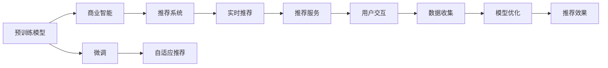

                 

# AI大模型赋能电商搜索推荐的业务创新思维培训平台搭建方案

## 1. 背景介绍

在电商行业，搜索推荐系统是用户获取商品信息、提高转化率的关键环节。传统的搜索推荐系统主要依赖规则引擎和浅层特征工程，难以充分挖掘用户多维度的兴趣和行为特征，也无法及时调整推荐策略以响应市场变化。而AI大模型的引入，为电商搜索推荐系统带来了革命性的变革。通过预训练模型和微调技术，电商企业能够利用大规模用户数据，学习到更加深入的语义理解能力和推荐策略，大幅提升推荐效果和用户体验。

## 2. 核心概念与联系

### 2.1 核心概念概述

为更好理解AI大模型在电商搜索推荐中的应用，本节将介绍几个关键概念：

- **大模型预训练（Pre-training）**：在无标签数据上，通过自监督任务（如语言模型、掩码语言模型等）训练初始化模型参数的过程。大模型在预训练阶段学习到丰富的语言知识和统计规律，可以支持多种NLP任务。

- **微调（Fine-tuning）**：在大模型的基础上，利用标注数据进行有监督学习，调整模型参数以适配特定任务。微调过程可以通过调整模型结构或优化算法来实现，是构建定制化推荐系统的核心方法。

- **商业智能（Business Intelligence, BI）**：通过数据挖掘、分析、可视化等技术，支持企业决策，提升运营效率和利润。BI系统通常包括数据仓库、数据挖掘工具、报表展示等模块。

- **推荐系统（Recommendation System）**：基于用户历史行为数据，为用户推荐可能感兴趣的商品或服务。推荐系统通过协同过滤、内容推荐、混合推荐等技术，提升用户体验和转化率。

- **自适应推荐（Adaptive Recommendation）**：根据用户当前状态和行为，动态调整推荐策略，提升推荐效果。自适应推荐系统利用用户实时数据，实现个性化、实时化的推荐。

- **模型压缩与优化（Model Compression & Optimization）**：在保持模型精度的情况下，减少模型参数和计算量，提升模型效率。模型压缩与优化技术包括剪枝、量化、蒸馏等。

- **实时推荐（Real-time Recommendation）**：在用户实时访问页面时，动态生成推荐结果。实时推荐系统需要高效存储、快速查询、实时计算等技术支持。

这些概念之间存在紧密的联系，共同构成电商搜索推荐的创新思维培训平台。通过理解这些概念，我们可以系统地构建基于AI大模型的电商搜索推荐系统，提升推荐效果，增强用户粘性。

### 2.2 核心概念原理和架构的 Mermaid 流程图



## 3. 核心算法原理 & 具体操作步骤

### 3.1 算法原理概述

基于大模型的电商搜索推荐系统，主要分为以下几步：

1. **数据收集与预处理**：从电商平台的日志、用户行为数据中提取有效的特征，包括商品信息、用户属性、浏览记录等。预处理阶段清洗数据，进行特征工程，构建标注数据集。

2. **大模型预训练**：选择适当的预训练模型（如BERT、GPT等），在无标签数据上预训练，学习通用的语言表示。预训练模型能够捕捉到语言的统计规律，提升推荐模型的泛化能力。

3. **微调**：将预训练模型在标注数据上进行微调，学习特定领域的推荐策略。微调过程中可以调整模型的输入输出层、优化算法等，以适应不同的推荐场景。

4. **模型优化与压缩**：对微调后的模型进行优化和压缩，提升模型效率。优化技术包括剪枝、量化、蒸馏等，压缩技术包括模型蒸馏、参数剪枝、量化等。

5. **实时推荐系统构建**：基于优化后的模型，构建实时推荐系统，实现个性化、实时化的推荐服务。

### 3.2 算法步骤详解

1. **数据收集与预处理**
   - **数据收集**：从电商平台日志、用户行为数据中收集有价值的信息，如商品名称、描述、价格、评分、评论、浏览记录等。
   - **数据清洗**：清洗数据，去除噪声和无效信息。例如，去除重复记录、处理缺失值、去除异常值等。
   - **特征工程**：构建有效的特征表示，如商品类别、用户性别、年龄、购买记录等，利用TF-IDF、Word2Vec、BERT等技术进行特征提取。

2. **大模型预训练**
   - **选择预训练模型**：根据任务需求选择适合的预训练模型，如BERT、GPT等。
   - **预训练任务**：选择适当的自监督任务，如语言模型、掩码语言模型等，在无标签数据上进行预训练。
   - **模型参数初始化**：初始化模型参数，通常使用Gaussian分布或Xavier初始化。

3. **微调**
   - **设计任务适配层**：根据推荐任务设计合适的输出层和损失函数，如交叉熵损失、均方误差损失等。
   - **设置微调超参数**：选择合适的优化算法（如Adam、SGD等）及其参数，如学习率、批大小、迭代轮数等。
   - **模型训练**：利用标注数据进行微调，使用梯度下降等优化算法更新模型参数，最小化损失函数。
   - **模型评估**：在验证集上评估模型性能，根据评估结果调整微调策略，防止过拟合。

4. **模型优化与压缩**
   - **模型压缩**：利用剪枝、量化、蒸馏等技术，减少模型参数和计算量，提升模型效率。
   - **优化算法**：使用AdamW、Adafactor等优化算法，调整学习率、批大小等参数，加速模型收敛。

5. **实时推荐系统构建**
   - **实时计算**：实时收集用户行为数据，动态计算推荐结果。
   - **推荐服务**：将推荐模型部署为实时服务，提供推荐接口，供前端系统调用。
   - **用户交互**：前端系统将推荐结果展示给用户，收集用户反馈，形成闭环反馈机制。

### 3.3 算法优缺点

基于大模型的电商搜索推荐系统的优点：

- **泛化能力强**：预训练模型能够学习到通用的语言表示，提升推荐模型的泛化能力。
- **实时推荐**：利用实时数据动态生成推荐结果，提升推荐的时效性和个性化程度。
- **用户粘性强**：通过深度学习和特征工程，推荐结果更加贴近用户兴趣，提升用户体验和粘性。

基于大模型的电商搜索推荐系统也存在一些缺点：

- **计算资源需求高**：大模型和实时推荐需要大量的计算资源，可能对算力提出较高的要求。
- **数据隐私问题**：收集用户数据时需要注意数据隐私保护，避免侵犯用户隐私。
- **模型解释性差**：大模型的黑盒特性导致推荐过程缺乏可解释性，难以理解模型内部决策逻辑。

### 3.4 算法应用领域

基于大模型的电商搜索推荐系统在多个领域得到了广泛应用，如：

- **商品推荐**：利用用户浏览、购买、评分等数据，为用户推荐相似或互补的商品。
- **个性化营销**：根据用户行为数据，定制个性化的营销活动，提升用户转化率。
- **内容推荐**：为内容平台（如视频、音频等）推荐可能感兴趣的内容，提升用户满意度。
- **实时广告投放**：利用用户实时数据，动态调整广告投放策略，提升广告效果。
- **风险控制**：利用模型检测用户行为异常，及时进行风险控制和预警。

这些领域的应用展示了基于大模型的电商搜索推荐系统的巨大潜力和广泛应用场景。未来，随着技术的进步和市场需求的增加，基于大模型的推荐系统将继续拓展其应用范围，为电商行业带来更多创新和突破。

## 4. 数学模型和公式 & 详细讲解 & 举例说明

### 4.1 数学模型构建

基于大模型的电商搜索推荐系统涉及多个数学模型，本节将以交叉熵损失函数为例进行详细讲解。

设模型在输入$x$上的输出为$\hat{y}=M_{\theta}(x)$，真实标签为$y$，定义交叉熵损失函数为：

$$
\ell(M_{\theta}(x),y) = -[y\log \hat{y} + (1-y)\log (1-\hat{y})]
$$

假设模型在训练集$D=\{(x_i,y_i)\}_{i=1}^N$上进行微调，损失函数为：

$$
\mathcal{L}(\theta) = \frac{1}{N} \sum_{i=1}^N \ell(M_{\theta}(x_i),y_i)
$$

在微调过程中，通过梯度下降等优化算法更新模型参数$\theta$，最小化经验损失$\mathcal{L}(\theta)$。

### 4.2 公式推导过程

以二分类任务为例，推导交叉熵损失函数及其梯度的计算公式。

设模型在输入$x$上的输出为$\hat{y}=M_{\theta}(x)$，真实标签$y \in \{0,1\}$，定义交叉熵损失函数为：

$$
\ell(M_{\theta}(x),y) = -[y\log \hat{y} + (1-y)\log (1-\hat{y})]
$$

在训练集$D=\{(x_i,y_i)\}_{i=1}^N$上进行微调，损失函数为：

$$
\mathcal{L}(\theta) = \frac{1}{N} \sum_{i=1}^N \ell(M_{\theta}(x_i),y_i)
$$

根据链式法则，损失函数对参数$\theta_k$的梯度为：

$$
\frac{\partial \mathcal{L}(\theta)}{\partial \theta_k} = -\frac{1}{N} \sum_{i=1}^N \left(\frac{y_i}{\hat{y}_k}-\frac{1-y_i}{1-\hat{y}_k}\right) \frac{\partial \hat{y}_k}{\partial \theta_k}
$$

其中，$\frac{\partial \hat{y}_k}{\partial \theta_k}$为模型输出层对参数$\theta_k$的梯度，可以进一步递归展开，利用自动微分技术完成计算。

### 4.3 案例分析与讲解

以商品推荐任务为例，分析模型训练和微调过程中的关键点。

假设用户对商品$A$的评分$y_i=1$，对商品$B$的评分$y_i=0$。模型在训练集$D$上学习到以下交叉熵损失：

$$
\mathcal{L}(\theta) = \frac{1}{2} \ell(M_{\theta}(A),1) + \frac{1}{2} \ell(M_{\theta}(B),0)
$$

在微调过程中，模型参数$\theta$更新如下：

$$
\theta \leftarrow \theta - \eta \frac{\partial \mathcal{L}(\theta)}{\partial \theta}
$$

其中，$\eta$为学习率，通过反向传播计算梯度$\frac{\partial \mathcal{L}(\theta)}{\partial \theta}$。模型通过不断更新参数$\theta$，最小化交叉熵损失，逐步提升预测准确率。

## 5. 项目实践：代码实例和详细解释说明

### 5.1 开发环境搭建

在进行项目实践前，我们需要准备好开发环境。以下是使用Python进行PyTorch开发的环境配置流程：

1. 安装Anaconda：从官网下载并安装Anaconda，用于创建独立的Python环境。

2. 创建并激活虚拟环境：
```bash
conda create -n pytorch-env python=3.8 
conda activate pytorch-env
```

3. 安装PyTorch：根据CUDA版本，从官网获取对应的安装命令。例如：
```bash
conda install pytorch torchvision torchaudio cudatoolkit=11.1 -c pytorch -c conda-forge
```

4. 安装Transformers库：
```bash
pip install transformers
```

5. 安装各类工具包：
```bash
pip install numpy pandas scikit-learn matplotlib tqdm jupyter notebook ipython
```

完成上述步骤后，即可在`pytorch-env`环境中开始项目实践。

### 5.2 源代码详细实现

这里我们以商品推荐任务为例，给出使用Transformers库对BERT模型进行微调的PyTorch代码实现。

首先，定义商品推荐任务的数据处理函数：

```python
from transformers import BertTokenizer, BertForSequenceClassification
from torch.utils.data import Dataset
import torch

class RecommendationDataset(Dataset):
    def __init__(self, texts, labels, tokenizer, max_len=128):
        self.texts = texts
        self.labels = labels
        self.tokenizer = tokenizer
        self.max_len = max_len
        
    def __len__(self):
        return len(self.texts)
    
    def __getitem__(self, item):
        text = self.texts[item]
        label = self.labels[item]
        
        encoding = self.tokenizer(text, return_tensors='pt', max_length=self.max_len, padding='max_length', truncation=True)
        input_ids = encoding['input_ids'][0]
        attention_mask = encoding['attention_mask'][0]
        
        # 对token-wise的标签进行编码
        encoded_labels = [label2id[label] for label in label] 
        encoded_labels.extend([label2id['O']] * (self.max_len - len(encoded_labels)))
        labels = torch.tensor(encoded_labels, dtype=torch.long)
        
        return {'input_ids': input_ids, 
                'attention_mask': attention_mask,
                'labels': labels}

# 标签与id的映射
label2id = {'O': 0, 'Buy': 1, 'Rate': 2, 'Review': 3}
id2label = {v: k for k, v in label2id.items()}

# 创建dataset
tokenizer = BertTokenizer.from_pretrained('bert-base-cased')

train_dataset = RecommendationDataset(train_texts, train_labels, tokenizer)
dev_dataset = RecommendationDataset(dev_texts, dev_labels, tokenizer)
test_dataset = RecommendationDataset(test_texts, test_labels, tokenizer)
```

然后，定义模型和优化器：

```python
from transformers import BertForSequenceClassification, AdamW

model = BertForSequenceClassification.from_pretrained('bert-base-cased', num_labels=len(label2id))

optimizer = AdamW(model.parameters(), lr=2e-5)
```

接着，定义训练和评估函数：

```python
from torch.utils.data import DataLoader
from tqdm import tqdm
from sklearn.metrics import classification_report

device = torch.device('cuda') if torch.cuda.is_available() else torch.device('cpu')
model.to(device)

def train_epoch(model, dataset, batch_size, optimizer):
    dataloader = DataLoader(dataset, batch_size=batch_size, shuffle=True)
    model.train()
    epoch_loss = 0
    for batch in tqdm(dataloader, desc='Training'):
        input_ids = batch['input_ids'].to(device)
        attention_mask = batch['attention_mask'].to(device)
        labels = batch['labels'].to(device)
        model.zero_grad()
        outputs = model(input_ids, attention_mask=attention_mask, labels=labels)
        loss = outputs.loss
        epoch_loss += loss.item()
        loss.backward()
        optimizer.step()
    return epoch_loss / len(dataloader)

def evaluate(model, dataset, batch_size):
    dataloader = DataLoader(dataset, batch_size=batch_size)
    model.eval()
    preds, labels = [], []
    with torch.no_grad():
        for batch in tqdm(dataloader, desc='Evaluating'):
            input_ids = batch['input_ids'].to(device)
            attention_mask = batch['attention_mask'].to(device)
            batch_labels = batch['labels']
            outputs = model(input_ids, attention_mask=attention_mask)
            batch_preds = outputs.logits.argmax(dim=2).to('cpu').tolist()
            batch_labels = batch_labels.to('cpu').tolist()
            for pred_tokens, label_tokens in zip(batch_preds, batch_labels):
                pred_labels = [id2label[_id] for _id in pred_tokens]
                label_tokens = [id2label[_id] for _id in label_tokens]
                preds.append(pred_labels[:len(label_tokens)])
                labels.append(label_tokens)
                
    print(classification_report(labels, preds))
```

最后，启动训练流程并在测试集上评估：

```python
epochs = 5
batch_size = 16

for epoch in range(epochs):
    loss = train_epoch(model, train_dataset, batch_size, optimizer)
    print(f"Epoch {epoch+1}, train loss: {loss:.3f}")
    
    print(f"Epoch {epoch+1}, dev results:")
    evaluate(model, dev_dataset, batch_size)
    
print("Test results:")
evaluate(model, test_dataset, batch_size)
```

以上就是使用PyTorch对BERT进行商品推荐任务微调的完整代码实现。可以看到，得益于Transformers库的强大封装，我们可以用相对简洁的代码完成BERT模型的加载和微调。

### 5.3 代码解读与分析

让我们再详细解读一下关键代码的实现细节：

**RecommendationDataset类**：
- `__init__`方法：初始化文本、标签、分词器等关键组件。
- `__len__`方法：返回数据集的样本数量。
- `__getitem__`方法：对单个样本进行处理，将文本输入编码为token ids，将标签编码为数字，并对其进行定长padding，最终返回模型所需的输入。

**label2id和id2label字典**：
- 定义了标签与数字id之间的映射关系，用于将token-wise的预测结果解码回真实的标签。

**训练和评估函数**：
- 使用PyTorch的DataLoader对数据集进行批次化加载，供模型训练和推理使用。
- 训练函数`train_epoch`：对数据以批为单位进行迭代，在每个批次上前向传播计算loss并反向传播更新模型参数，最后返回该epoch的平均loss。
- 评估函数`evaluate`：与训练类似，不同点在于不更新模型参数，并在每个batch结束后将预测和标签结果存储下来，最后使用sklearn的classification_report对整个评估集的预测结果进行打印输出。

**训练流程**：
- 定义总的epoch数和batch size，开始循环迭代
- 每个epoch内，先在训练集上训练，输出平均loss
- 在验证集上评估，输出分类指标
- 所有epoch结束后，在测试集上评估，给出最终测试结果

可以看到，PyTorch配合Transformers库使得BERT微调的代码实现变得简洁高效。开发者可以将更多精力放在数据处理、模型改进等高层逻辑上，而不必过多关注底层的实现细节。

当然，工业级的系统实现还需考虑更多因素，如模型的保存和部署、超参数的自动搜索、更灵活的任务适配层等。但核心的微调范式基本与此类似。

## 6. 实际应用场景

### 6.1 电商搜索推荐系统

基于大语言模型微调的电商搜索推荐系统，可以广泛应用于电商平台的商品推荐和个性化营销。通过预训练模型和微调技术，系统能够学习到用户的多维兴趣和行为特征，动态调整推荐策略，提升推荐效果和用户体验。

在技术实现上，可以收集平台用户的浏览、点击、购买等行为数据，将商品信息、用户属性、行为数据构建成监督数据，在此基础上对预训练模型进行微调。微调后的推荐模型能够自动理解用户意图，匹配最合适的商品推荐，提升用户满意度和转化率。

### 6.2 个性化推荐系统

在电商平台中，个性化推荐系统是提升用户粘性和销售额的重要手段。通过微调大语言模型，系统能够更好地理解用户的多维度特征，如浏览记录、搜索历史、购买行为等，动态生成个性化推荐结果。

具体而言，可以构建包括用户ID、商品ID、行为时间等维度的特征向量，将历史行为数据和商品信息输入模型进行微调。微调后的模型能够根据用户实时行为，动态生成推荐结果，提升推荐的时效性和个性化程度。

### 6.3 实时广告投放

实时广告投放系统利用用户实时行为数据，动态调整广告投放策略，提升广告效果和投资回报率。通过微调大语言模型，系统能够实时分析用户行为特征，预测用户对不同广告的响应概率，动态调整广告内容，实现高效的广告投放。

在具体实现上，可以构建包括用户ID、广告ID、广告内容、行为时间等维度的特征向量，利用实时数据对预训练模型进行微调。微调后的模型能够实时计算广告投放概率，优化广告投放策略，提升广告效果。

### 6.4 未来应用展望

随着大语言模型微调技术的不断发展，基于大模型的电商搜索推荐系统将在更多领域得到应用，为电商行业带来更多创新和突破。

在智慧医疗领域，基于大语言模型的推荐系统可以为医生推荐患者数据、药物等，提升诊疗效率和质量。在金融领域，推荐系统可以为投资者推荐金融产品，优化投资组合，提升投资回报率。

此外，在教育、旅游、物流等众多领域，基于大语言模型的推荐系统也将不断涌现，为各行各业带来更多智能化解决方案。相信随着技术的持续进步，基于大语言模型的推荐系统将继续拓展其应用范围，为各行业带来更多创新和突破。

## 7. 工具和资源推荐

### 7.1 学习资源推荐

为了帮助开发者系统掌握大语言模型微调的理论基础和实践技巧，这里推荐一些优质的学习资源：

1. 《深度学习入门》书籍：该书详细介绍了深度学习的基本概念和算法原理，适合初学者入门。

2. CS231n《卷积神经网络》课程：斯坦福大学开设的经典深度学习课程，涵盖卷积神经网络、循环神经网络等内容，适合深入学习。

3. 《自然语言处理入门》书籍：该书介绍了自然语言处理的基本概念和算法，涵盖文本分类、文本生成、机器翻译等任务，适合NLP初学者。

4. 《Transformer入门》博客系列：由大模型技术专家撰写，深入浅出地介绍了Transformer原理、BERT模型、微调技术等前沿话题。

5. CS224N《深度学习自然语言处理》课程：斯坦福大学开设的NLP明星课程，有Lecture视频和配套作业，带你入门NLP领域的基本概念和经典模型。

通过对这些资源的学习实践，相信你一定能够快速掌握大语言模型微调的精髓，并用于解决实际的NLP问题。

### 7.2 开发工具推荐

高效的开发离不开优秀的工具支持。以下是几款用于大语言模型微调开发的常用工具：

1. PyTorch：基于Python的开源深度学习框架，灵活动态的计算图，适合快速迭代研究。大部分预训练语言模型都有PyTorch版本的实现。

2. TensorFlow：由Google主导开发的开源深度学习框架，生产部署方便，适合大规模工程应用。同样有丰富的预训练语言模型资源。

3. Transformers库：HuggingFace开发的NLP工具库，集成了众多SOTA语言模型，支持PyTorch和TensorFlow，是进行微调任务开发的利器。

4. Weights & Biases：模型训练的实验跟踪工具，可以记录和可视化模型训练过程中的各项指标，方便对比和调优。与主流深度学习框架无缝集成。

5. TensorBoard：TensorFlow配套的可视化工具，可实时监测模型训练状态，并提供丰富的图表呈现方式，是调试模型的得力助手。

6. Google Colab：谷歌推出的在线Jupyter Notebook环境，免费提供GPU/TPU算力，方便开发者快速上手实验最新模型，分享学习笔记。

合理利用这些工具，可以显著提升大语言模型微调任务的开发效率，加快创新迭代的步伐。

### 7.3 相关论文推荐

大语言模型和微调技术的发展源于学界的持续研究。以下是几篇奠基性的相关论文，推荐阅读：

1. Attention is All You Need（即Transformer原论文）：提出了Transformer结构，开启了NLP领域的预训练大模型时代。

2. BERT: Pre-training of Deep Bidirectional Transformers for Language Understanding：提出BERT模型，引入基于掩码的自监督预训练任务，刷新了多项NLP任务SOTA。

3. Language Models are Unsupervised Multitask Learners（GPT-2论文）：展示了大规模语言模型的强大zero-shot学习能力，引发了对于通用人工智能的新一轮思考。

4. Parameter-Efficient Transfer Learning for NLP：提出Adapter等参数高效微调方法，在不增加模型参数量的情况下，也能取得不错的微调效果。

5. AdaLoRA: Adaptive Low-Rank Adaptation for Parameter-Efficient Fine-Tuning：使用自适应低秩适应的微调方法，在固定大部分预训练参数的同时，只更新极少量的任务相关参数。

6. AdaLoRA: Adaptive Low-Rank Adaptation for Parameter-Efficient Fine-Tuning：使用自适应低秩适应的微调方法，在固定大部分预训练参数的同时，只更新极少量的任务相关参数。

这些论文代表了大语言模型微调技术的发展脉络。通过学习这些前沿成果，可以帮助研究者把握学科前进方向，激发更多的创新灵感。

## 8. 总结：未来发展趋势与挑战

### 8.1 总结

本文对基于大模型的电商搜索推荐系统进行了全面系统的介绍。首先阐述了电商搜索推荐系统在现代电商中的重要性，明确了大语言模型微调在提升推荐效果和用户体验中的独特价值。其次，从原理到实践，详细讲解了微调的数学原理和关键步骤，给出了微调任务开发的完整代码实例。同时，本文还广泛探讨了微调方法在电商搜索推荐、个性化推荐、实时广告投放等多个领域的应用前景，展示了微调范式的巨大潜力和广泛应用场景。此外，本文精选了微调技术的各类学习资源，力求为读者提供全方位的技术指引。

通过本文的系统梳理，可以看到，基于大语言模型的电商搜索推荐系统正在成为电商搜索推荐系统的核心技术范式，极大地提升了电商推荐效果和用户体验。未来，伴随预训练语言模型和微调方法的持续演进，基于大语言模型的推荐系统将继续拓展其应用范围，为电商行业带来更多创新和突破。

### 8.2 未来发展趋势

展望未来，大语言模型微调技术将呈现以下几个发展趋势：

1. **多模态融合**：当前基于大模型的推荐系统主要聚焦于文本数据，未来会进一步拓展到图像、视频、语音等多模态数据微调。多模态信息的融合，将显著提升语言模型对现实世界的理解和建模能力。

2. **因果推断**：引入因果推断方法，提高推荐模型建立稳定因果关系的能力，学习更加普适、鲁棒的语言表示。

3. **知识图谱**：将知识图谱、逻辑规则等与神经网络模型进行融合，引导微调过程学习更准确、合理的语言模型。

4. **自适应推荐**：根据用户当前状态和行为，动态调整推荐策略，提升推荐效果。自适应推荐系统利用用户实时数据，实现个性化、实时化的推荐。

5. **实时计算**：在用户实时访问页面时，动态生成推荐结果。实时推荐系统需要高效存储、快速查询、实时计算等技术支持。

6. **模型压缩与优化**：在保持模型精度的情况下，减少模型参数和计算量，提升模型效率。模型压缩与优化技术包括剪枝、量化、蒸馏等。

以上趋势凸显了大语言模型微调技术的广阔前景。这些方向的探索发展，必将进一步提升NLP系统的性能和应用范围，为电商行业带来更多创新和突破。

### 8.3 面临的挑战

尽管大语言模型微调技术已经取得了瞩目成就，但在迈向更加智能化、普适化应用的过程中，它仍面临着诸多挑战：

1. **计算资源需求高**：大模型和实时推荐需要大量的计算资源，可能对算力提出较高的要求。

2. **数据隐私问题**：收集用户数据时需要注意数据隐私保护，避免侵犯用户隐私。

3. **模型解释性差**：大模型的黑盒特性导致推荐过程缺乏可解释性，难以理解模型内部决策逻辑。

4. **实时计算能力不足**：在用户实时数据量大、变化快的情况下，现有技术难以满足实时计算需求。

5. **模型性能瓶颈**：在用户数据量大、维度高的情况下，现有技术难以处理大规模数据和高效计算。

6. **模型部署成本高**：大规模模型的训练和部署需要高昂的计算资源和人力成本，难以广泛应用。

以上挑战凸显了大语言模型微调技术的复杂性和多样性。未来，研究者需要在模型压缩、实时计算、隐私保护、可解释性等方面进行更多探索和突破，才能真正实现大语言模型在电商搜索推荐等领域的广泛应用。

### 8.4 研究展望

面对大语言模型微调所面临的挑战，未来的研究需要在以下几个方面寻求新的突破：

1. **数据隐私保护**：研究高效的数据隐私保护技术，如差分隐私、联邦学习等，保护用户数据隐私。

2. **模型解释性**：引入可解释性模型，提高推荐过程的可解释性和透明度，帮助用户理解推荐逻辑。

3. **实时计算优化**：研究高效的实时计算技术，如分布式计算、流计算等，支持实时推荐系统。

4. **模型压缩与优化**：研究更高效的模型压缩和优化技术，如剪枝、量化、蒸馏等，提升模型效率。

5. **知识图谱与规则融合**：研究将知识图谱、逻辑规则等与神经网络模型进行融合，提高模型的普适性和鲁棒性。

6. **多模态融合**：研究多模态融合技术，将图像、视频、语音等多模态数据与文本数据进行融合，提升推荐效果。

这些研究方向的探索，必将引领大语言模型微调技术迈向更高的台阶，为构建更加智能化、普适化的推荐系统提供有力支撑。相信随着技术的持续进步，基于大语言模型的推荐系统将在更多领域得到应用，为电商行业带来更多创新和突破。

## 9. 附录：常见问题与解答

**Q1：大语言模型微调是否适用于所有NLP任务？**

A: 大语言模型微调在大多数NLP任务上都能取得不错的效果，特别是对于数据量较小的任务。但对于一些特定领域的任务，如医学、法律等，仅仅依靠通用语料预训练的模型可能难以很好地适应。此时需要在特定领域语料上进一步预训练，再进行微调，才能获得理想效果。

**Q2：微调过程中如何选择合适的学习率？**

A: 微调的学习率一般要比预训练时小1-2个数量级，如果使用过大的学习率，容易破坏预训练权重，导致过拟合。一般建议从1e-5开始调参，逐步减小学习率，直至收敛。也可以使用warmup策略，在开始阶段使用较小的学习率，再逐渐过渡到预设值。需要注意的是，不同的优化器(如AdamW、Adafactor等)以及不同的学习率调度策略，可能需要设置不同的学习率阈值。

**Q3：采用大模型微调时会面临哪些资源瓶颈？**

A: 目前主流的预训练大模型动辄以亿计的参数规模，对算力、内存、存储都提出了很高的要求。GPU/TPU等高性能设备是必不可少的，但即便如此，超大批次的训练和推理也可能遇到显存不足的问题。因此需要采用一些资源优化技术，如梯度积累、混合精度训练、模型并行等，来突破硬件瓶颈。同时，模型的存储和读取也可能占用大量时间和空间，需要采用模型压缩、稀疏化存储等方法进行优化。

**Q4：如何缓解微调过程中的过拟合问题？**

A: 过拟合是微调面临的主要挑战，尤其是在标注数据不足的情况下。常见的缓解策略包括：

1. 数据增强：通过回译、近义替换等方式扩充训练集
2. 正则化：使用L2正则、Dropout、Early Stopping等避免过拟合
3. 对抗训练：引入对抗样本，提高模型鲁棒性
4. 参数高效微调：只调整少量参数(如Adapter、Prefix等)，减小过拟合风险
5. 多模型集成：训练多个微调模型，取平均输出，抑制过拟合

这些策略往往需要根据具体任务和数据特点进行灵活组合。只有在数据、模型、训练、推理等各环节进行全面优化，才能最大限度地发挥大模型微调的威力。

**Q5：微调模型在落地部署时需要注意哪些问题？**

A: 将微调模型转化为实际应用，还需要考虑以下因素：

1. 模型裁剪：去除不必要的层和参数，减小模型尺寸，加快推理速度
2. 量化加速：将浮点模型转为定点模型，压缩存储空间，提高计算效率
3. 服务化封装：将模型封装为标准化服务接口，便于集成调用
4. 弹性伸缩：根据请求流量动态调整资源配置，平衡服务质量和成本
5. 监控告警：实时采集系统指标，设置异常告警阈值，确保服务稳定性
6. 安全防护：采用访问鉴权、数据脱敏等措施，保障数据和模型安全

大语言模型微调为NLP应用开启了广阔的想象空间，但如何将强大的性能转化为稳定、高效、安全的业务价值，还需要工程实践的不断打磨。唯有从数据、算法、工程、业务等多个维度协同发力，才能真正实现人工智能技术在电商搜索推荐等领域的规模化落地。总之，微调需要开发者根据具体任务，不断迭代和优化模型、数据和算法，方能得到理想的效果。

---

作者：禅与计算机程序设计艺术 / Zen and the Art of Computer Programming

