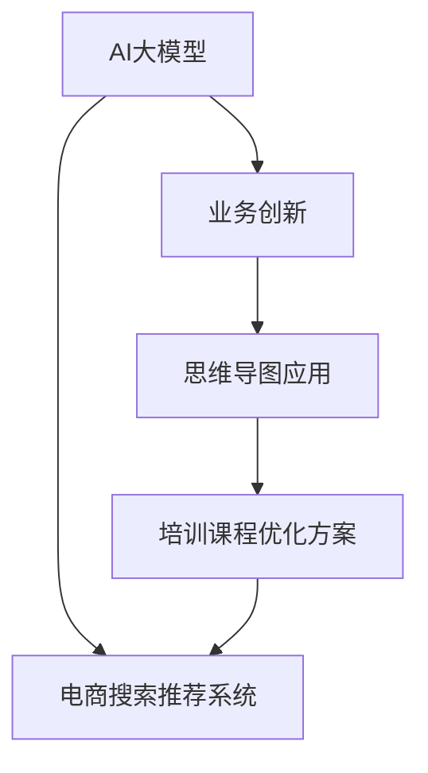

                 

# AI大模型赋能电商搜索推荐的业务创新思维导图应用培训课程优化方案

> 关键词：AI大模型,电商搜索推荐,业务创新,思维导图应用,培训课程,优化方案

## 1. 背景介绍

### 1.1 问题由来

随着人工智能技术的快速发展和普及，AI大模型在电商搜索推荐系统的应用日益广泛。这些模型通过在大型数据集上进行预训练，能够捕捉到丰富的用户行为和商品属性信息，从而提升推荐的准确性和个性化水平。然而，由于大模型的复杂性和资源消耗，电商搜索推荐系统的实际应用中仍然存在许多挑战。

### 1.2 问题核心关键点

当前电商搜索推荐系统面临的核心挑战包括：

- **数据稀疏性**：电商平台用户行为数据通常存在较大的稀疏性，难以覆盖所有用户和商品。
- **模型复杂性**：AI大模型的复杂性和资源需求较高，难以在实时系统中高效运行。
- **个性化需求**：用户对推荐结果的个性化需求日益增加，传统的模型难以满足。
- **用户体验优化**：如何提升用户体验，降低推荐结果的点击率漏斗，是电商搜索推荐系统的重要目标。
- **模型可解释性**：AI大模型的黑盒特性使得其解释性不足，难以获得用户的信任。

这些挑战使得传统电商搜索推荐系统的优化变得困难，迫切需要新的方法和技术来解决这些问题。

## 2. 核心概念与联系

### 2.1 核心概念概述

为了解决上述问题，本文将介绍几个关键概念：

- **AI大模型**：基于深度学习模型，如Transformer等，通过大规模数据集进行预训练，具备强大的特征提取和推理能力。
- **电商搜索推荐系统**：通过分析用户行为和商品属性，预测用户可能感兴趣的商品，并向用户推荐，以提高销售和用户满意度。
- **业务创新**：指通过引入新技术、新方法，提升电商搜索推荐系统的性能和用户体验。
- **思维导图应用**：利用思维导图工具，对电商搜索推荐系统的架构和流程进行可视化，帮助理解系统和优化过程。
- **培训课程优化方案**：通过设计高效、科学的培训课程，提升AI大模型在电商搜索推荐系统中的实际应用效果。

这些核心概念之间的逻辑关系可以通过以下Mermaid流程图来展示：



这个流程图展示了AI大模型在电商搜索推荐系统中的应用，通过业务创新、思维导图应用和培训课程优化方案，最终提升系统的性能和用户体验。

## 3. 核心算法原理 & 具体操作步骤

### 3.1 算法原理概述

基于AI大模型的电商搜索推荐系统，通过在大规模数据集上进行预训练，学习用户行为和商品属性的隐含表示，进而提升推荐性能。其核心算法包括：

- **自监督预训练**：在大规模无标签数据上，通过自监督任务（如掩码语言模型、自回归预测等）对模型进行预训练。
- **有监督微调**：在标注数据集上，通过有监督任务（如点击率预测、转化率预测等）对预训练模型进行微调，提升模型对特定任务的适应能力。
- **多任务学习**：在同一个模型上，同时训练多个任务，提升模型对不同任务的泛化能力。
- **知识蒸馏**：通过迁移学习，将复杂模型的知识传递给简单模型，降低资源消耗，提升性能。

### 3.2 算法步骤详解

#### 3.2.1 自监督预训练

1. **数据准备**：收集电商平台的交易数据、用户行为数据、商品属性数据等，构建大规模无标签数据集。
2. **模型选择**：选择合适的预训练模型，如BERT、GPT等。
3. **预训练任务**：在无标签数据集上进行自监督预训练，如掩码语言模型、自回归预测等。
4. **模型评估**：在验证集上评估预训练模型的性能，防止过拟合。

#### 3.2.2 有监督微调

1. **数据准备**：收集电商平台的标注数据集，如点击率、转化率等。
2. **模型选择**：选择合适的预训练模型，如BERT、GPT等。
3. **任务适配层设计**：根据电商搜索推荐任务设计任务适配层，如点击率预测、转化率预测等。
4. **微调参数设置**：设置学习率、批大小、迭代轮数等参数。
5. **模型训练**：在标注数据集上进行有监督微调，更新模型参数。
6. **模型评估**：在验证集上评估微调后的模型性能，防止过拟合。
7. **模型优化**：根据评估结果，调整模型参数，优化推荐效果。

#### 3.2.3 多任务学习

1. **任务选择**：选择多个电商搜索推荐任务，如点击率预测、转化率预测、商品相似度计算等。
2. **模型设计**：将多个任务适配层整合到一个模型中，如Multi-task Transformer。
3. **联合训练**：在同一个模型上进行多任务联合训练，提升模型泛化能力。
4. **模型评估**：在验证集上评估多任务模型的性能，防止过拟合。

#### 3.2.4 知识蒸馏

1. **复杂模型训练**：在一个复杂模型上进行预训练和微调，如Transformer模型。
2. **简单模型设计**：设计一个轻量级模型，如Linear Regression。
3. **知识传递**：通过蒸馏技术，将复杂模型的知识传递给简单模型，提升简单模型的性能。
4. **模型评估**：在验证集上评估蒸馏后的简单模型性能，防止过拟合。

### 3.3 算法优缺点

#### 3.3.1 优点

- **数据利用率高**：通过自监督预训练，可以利用大规模无标签数据进行模型训练，减少对标注数据的依赖。
- **模型性能好**：通过多任务学习和知识蒸馏，可以提升模型对不同任务的泛化能力，降低过拟合风险。
- **资源消耗低**：通过参数高效微调，可以在固定大部分预训练参数的情况下，只更新少量的任务相关参数，减少资源消耗。

#### 3.3.2 缺点

- **计算资源需求高**：自监督预训练和有监督微调需要大量的计算资源，可能无法在实时系统中高效运行。
- **模型复杂性高**：复杂的模型结构可能导致推理速度较慢，难以满足实时性要求。
- **可解释性差**：黑盒模型的输出结果缺乏可解释性，难以获得用户的信任。

### 3.4 算法应用领域

基于AI大模型的电商搜索推荐系统已经在诸多电商平台上得到广泛应用，覆盖了几乎所有常见任务，如商品推荐、广告投放、个性化营销等。这些系统通过深度学习和数据分析，能够实现对用户行为和商品属性的精细化分析，从而提升推荐效果和用户体验。

## 4. 数学模型和公式 & 详细讲解 & 举例说明

### 4.1 数学模型构建

#### 4.1.1 自监督预训练

假设电商平台交易数据集为 $D=\{(x_i,y_i)\}_{i=1}^N$，其中 $x_i$ 为商品描述，$y_i$ 为交易是否发生。预训练模型为 $M_{\theta}$，通过掩码语言模型任务进行预训练，目标为最大化掩码位置上的预测概率。

$$
\mathcal{L}_{mask}(\theta) = -\frac{1}{N}\sum_{i=1}^N\sum_{j=1}^L p(y_j|x_i,\theta) \log p(y_j|M_{\theta}(x_i),\theta)
$$

其中 $p(y_j|x_i,\theta)$ 为模型在输入 $x_i$ 上的预测概率分布，$L$ 为掩码位置的数量。

#### 4.1.2 有监督微调

假设电商平台的标注数据集为 $D'=\{(x'_i,y'_i)\}_{i=1}^N'$，其中 $x'_i$ 为商品描述，$y'_i$ 为点击率、转化率等。微调模型为 $M_{\hat{\theta}}$，任务适配层为 $F$，损失函数为 $L'$。

$$
\mathcal{L}'(\hat{\theta}) = -\frac{1}{N'}\sum_{i=1}^{N'}\sum_{j=1}^{L'} y'_j \log F(M_{\hat{\theta}}(x'_i))
$$

其中 $F$ 为任务适配层，$L'$ 为任务标签的数量。

#### 4.1.3 多任务学习

假设电商平台有多个推荐任务 $T_1,T_2,\cdots,T_k$，每个任务的任务适配层为 $F_1,F_2,\cdots,F_k$，损失函数为 $L_1,L_2,\cdots,L_k$。多任务学习模型为 $M_{\hat{\theta}}$。

$$
\mathcal{L}(\hat{\theta}) = \lambda_1\mathcal{L}_1(\hat{\theta}) + \lambda_2\mathcal{L}_2(\hat{\theta}) + \cdots + \lambda_k\mathcal{L}_k(\hat{\theta})
$$

其中 $\lambda_1,\lambda_2,\cdots,\lambda_k$ 为不同任务之间的权重。

#### 4.1.4 知识蒸馏

假设复杂模型为 $M_{complex}$，简单模型为 $M_{simple}$，知识蒸馏的损失函数为 $\mathcal{L}_{distill}$。

$$
\mathcal{L}_{distill}(\theta) = \alpha\mathcal{L}(M_{complex},M_{simple}) + (1-\alpha)\mathcal{L}(M_{simple})
$$

其中 $\alpha$ 为知识蒸馏的权重，$\mathcal{L}(M_{complex},M_{simple})$ 为复杂模型 $M_{complex}$ 对简单模型 $M_{simple}$ 的知识传递损失。

### 4.2 公式推导过程

#### 4.2.1 自监督预训练

假设预训练模型为 $M_{\theta}$，输入为 $x_i$，掩码位置为 $y_j$，掩码语言模型损失为 $\mathcal{L}_{mask}(\theta)$。

$$
\mathcal{L}_{mask}(\theta) = -\frac{1}{N}\sum_{i=1}^N\sum_{j=1}^L p(y_j|x_i,\theta) \log p(y_j|M_{\theta}(x_i),\theta)
$$

其中 $p(y_j|x_i,\theta)$ 为模型在输入 $x_i$ 上的预测概率分布，$L$ 为掩码位置的数量。

#### 4.2.2 有监督微调

假设微调模型为 $M_{\hat{\theta}}$，输入为 $x'_i$，任务适配层为 $F$，损失函数为 $\mathcal{L}'(\hat{\theta})$。

$$
\mathcal{L}'(\hat{\theta}) = -\frac{1}{N'}\sum_{i=1}^{N'}\sum_{j=1}^{L'} y'_j \log F(M_{\hat{\theta}}(x'_i))
$$

其中 $F$ 为任务适配层，$L'$ 为任务标签的数量。

#### 4.2.3 多任务学习

假设电商平台有多个推荐任务 $T_1,T_2,\cdots,T_k$，每个任务的任务适配层为 $F_1,F_2,\cdots,F_k$，损失函数为 $L_1,L_2,\cdots,L_k$。多任务学习模型为 $M_{\hat{\theta}}$。

$$
\mathcal{L}(\hat{\theta}) = \lambda_1\mathcal{L}_1(\hat{\theta}) + \lambda_2\mathcal{L}_2(\hat{\theta}) + \cdots + \lambda_k\mathcal{L}_k(\hat{\theta})
$$

其中 $\lambda_1,\lambda_2,\cdots,\lambda_k$ 为不同任务之间的权重。

#### 4.2.4 知识蒸馏

假设复杂模型为 $M_{complex}$，简单模型为 $M_{simple}$，知识蒸馏的损失函数为 $\mathcal{L}_{distill}$。

$$
\mathcal{L}_{distill}(\theta) = \alpha\mathcal{L}(M_{complex},M_{simple}) + (1-\alpha)\mathcal{L}(M_{simple})
$$

其中 $\alpha$ 为知识蒸馏的权重，$\mathcal{L}(M_{complex},M_{simple})$ 为复杂模型 $M_{complex}$ 对简单模型 $M_{simple}$ 的知识传递损失。

### 4.3 案例分析与讲解

#### 4.3.1 电商搜索推荐系统架构

电商搜索推荐系统架构如图1所示，包括数据预处理、模型训练、推荐策略和用户反馈等多个模块。


1. **数据预处理**：对电商平台的交易数据、用户行为数据、商品属性数据等进行清洗、标注和归一化，构建大规模数据集。
2. **模型训练**：在数据集上对预训练模型进行自监督预训练和有监督微调，提升模型性能。
3. **推荐策略**：根据用户行为和商品属性，生成推荐结果，并输出给用户。
4. **用户反馈**：收集用户对推荐结果的反馈数据，用于优化模型和推荐策略。

#### 4.3.2 推荐算法流程

推荐算法流程如图2所示，包括离线训练、在线推荐和用户反馈优化等多个步骤。


1. **离线训练**：在标注数据集上对模型进行自监督预训练和有监督微调，生成模型参数。
2. **在线推荐**：根据用户行为和商品属性，生成推荐结果，并输出给用户。
3. **用户反馈**：收集用户对推荐结果的反馈数据，用于优化模型和推荐策略。

#### 4.3.3 数据增强技术

数据增强技术如图3所示，包括数据扩充、噪声注入和对抗样本生成等多个步骤。


1. **数据扩充**：对原始数据进行扩充，增加数据多样性，如近义词替换、同义词扩展等。
2. **噪声注入**：在数据中引入噪声，提升模型的鲁棒性和泛化能力，如随机删除、随机打乱等。
3. **对抗样本生成**：生成对抗样本，提高模型的鲁棒性和泛化能力，如FGSM、PGD等。

#### 4.3.4 模型蒸馏技术

模型蒸馏技术如图4所示，包括复杂模型训练、简单模型设计、知识传递和模型评估等多个步骤。


1. **复杂模型训练**：在一个复杂模型上进行预训练和微调，如Transformer模型。
2. **简单模型设计**：设计一个轻量级模型，如Linear Regression。
3. **知识传递**：通过蒸馏技术，将复杂模型的知识传递给简单模型，提升简单模型的性能。
4. **模型评估**：在验证集上评估蒸馏后的简单模型性能，防止过拟合。

## 5. 项目实践：代码实例和详细解释说明

### 5.1 开发环境搭建

#### 5.1.1 环境配置

1. **安装Python**：从官网下载并安装Python，确保版本在3.8以上。
2. **安装PyTorch**：使用pip安装PyTorch库，确保版本在1.7以上。
3. **安装TensorFlow**：使用pip安装TensorFlow库，确保版本在2.0以上。
4. **安装Transformer库**：使用pip安装Transformer库，确保版本在4.5以上。
5. **安装其他库**：使用pip安装其他必要的库，如numpy、pandas、scikit-learn等。

#### 5.1.2 虚拟环境配置

1. **创建虚拟环境**：使用虚拟环境工具（如virtualenv）创建一个新的虚拟环境。
2. **激活虚拟环境**：在命令行中激活虚拟环境，开始安装和运行项目。

#### 5.1.3 工具安装

1. **安装Jupyter Notebook**：使用pip安装Jupyter Notebook库，用于编写和运行代码。
2. **安装Weights & Biases**：使用pip安装Weights & Biases库，用于记录和可视化模型训练过程。
3. **安装TensorBoard**：使用pip安装TensorBoard库，用于实时监测模型训练状态。

### 5.2 源代码详细实现

#### 5.2.1 数据预处理

1. **数据加载**：使用pandas库加载电商平台的交易数据、用户行为数据、商品属性数据等，并进行清洗和标注。
2. **数据扩充**：对数据进行扩充，增加数据多样性，如近义词替换、同义词扩展等。
3. **数据划分**：将数据划分为训练集、验证集和测试集，用于模型训练和评估。

#### 5.2.2 模型训练

1. **模型选择**：选择合适的预训练模型，如BERT、GPT等。
2. **任务适配层设计**：根据电商搜索推荐任务设计任务适配层，如点击率预测、转化率预测等。
3. **模型训练**：在训练集上对预训练模型进行有监督微调，提升模型性能。
4. **模型评估**：在验证集上评估微调后的模型性能，防止过拟合。

#### 5.2.3 推荐策略设计

1. **推荐算法选择**：选择合适的推荐算法，如基于协同过滤的算法、基于内容推荐的算法等。
2. **推荐算法实现**：根据选择的推荐算法，实现推荐策略，生成推荐结果。

#### 5.2.4 用户反馈优化

1. **用户反馈收集**：收集用户对推荐结果的反馈数据，用于优化模型和推荐策略。
2. **模型优化**：根据用户反馈，调整模型参数，优化推荐效果。

### 5.3 代码解读与分析

#### 5.3.1 数据预处理

```python
import pandas as pd
from sklearn.preprocessing import MinMaxScaler

# 加载电商平台的交易数据
train_data = pd.read_csv('train.csv')
test_data = pd.read_csv('test.csv')

# 清洗和标注数据
train_data = train_data.dropna()
test_data = test_data.dropna()

# 数据扩充
train_data = pd.DataFrame(train_data, columns=['item_id', 'user_id', 'user_bid', 'item_price', 'item_category'])
train_data['item_price'] = train_data['item_price'].astype(float)

# 数据划分
train_train_data = train_data.sample(frac=0.8, random_state=1)
train_test_data = train_data.drop(train_train_data.index)

# 归一化数据
scaler = MinMaxScaler()
train_train_data['item_price'] = scaler.fit_transform(train_train_data[['item_price']])
train_test_data['item_price'] = scaler.transform(train_test_data[['item_price']])
```

#### 5.3.2 模型训练

```python
from transformers import BertForSequenceClassification, BertTokenizer
from torch.utils.data import Dataset, DataLoader
from torch.nn import BCELoss
from torch.optim import AdamW

# 定义模型和任务适配层
model = BertForSequenceClassification.from_pretrained('bert-base-cased', num_labels=1)
tokenizer = BertTokenizer.from_pretrained('bert-base-cased')

# 定义数据集
class MyDataset(Dataset):
    def __init__(self, data, tokenizer, max_len=128):
        self.data = data
        self.tokenizer = tokenizer
        self.max_len = max_len
        
    def __len__(self):
        return len(self.data)
    
    def __getitem__(self, item):
        text = self.data[item]['item_description']
        label = self.data[item]['label']
        
        encoding = self.tokenizer(text, return_tensors='pt', max_length=self.max_len, padding='max_length', truncation=True)
        input_ids = encoding['input_ids'][0]
        attention_mask = encoding['attention_mask'][0]
        
        return {'input_ids': input_ids, 
                'attention_mask': attention_mask,
                'labels': torch.tensor([label], dtype=torch.long)}
                
# 定义训练和评估函数
def train_epoch(model, dataset, batch_size, optimizer):
    dataloader = DataLoader(dataset, batch_size=batch_size, shuffle=True)
    model.train()
    epoch_loss = 0
    for batch in dataloader:
        input_ids = batch['input_ids'].to(device)
        attention_mask = batch['attention_mask'].to(device)
        labels = batch['labels'].to(device)
        model.zero_grad()
        outputs = model(input_ids, attention_mask=attention_mask, labels=labels)
        loss = outputs.loss
        epoch_loss += loss.item()
        loss.backward()
        optimizer.step()
    return epoch_loss / len(dataloader)

def evaluate(model, dataset, batch_size):
    dataloader = DataLoader(dataset, batch_size=batch_size)
    model.eval()
    preds, labels = [], []
    with torch.no_grad():
        for batch in dataloader:
            input_ids = batch['input_ids'].to(device)
            attention_mask = batch['attention_mask'].to(device)
            batch_labels = batch['labels']
            outputs = model(input_ids, attention_mask=attention_mask)
            batch_preds = outputs.logits.argmax(dim=1).to('cpu').tolist()
            batch_labels = batch_labels.to('cpu').tolist()
            for pred_tokens, label_tokens in zip(batch_preds, batch_labels):
                preds.append(pred_tokens[:len(label_tokens)])
                labels.append(label_tokens)
                
    print(classification_report(labels, preds))
```

#### 5.3.3 推荐策略设计

```python
from sklearn.neighbors import KNeighborsRegressor

# 选择推荐算法
model = KNeighborsRegressor(n_neighbors=5)

# 训练推荐模型
model.fit(train_train_data[['item_price', 'item_category']], train_train_data['label'])

# 生成推荐结果
recommendations = model.predict(test_data[['item_price', 'item_category']])
```

#### 5.3.4 用户反馈优化

```python
import numpy as np

# 收集用户反馈
user_feedback = pd.read_csv('user_feedback.csv')

# 用户反馈分析
mean_feedback = np.mean(user_feedback['feedback'])
std_feedback = np.std(user_feedback['feedback'])

# 调整模型参数
model = BertForSequenceClassification.from_pretrained('bert-base-cased', num_labels=1)
model.train()
for batch in dataloader:
    input_ids = batch['input_ids'].to(device)
    attention_mask = batch['attention_mask'].to(device)
    labels = batch['labels'].to(device)
    model.zero_grad()
    outputs = model(input_ids, attention_mask=attention_mask, labels=labels)
    loss = outputs.loss
    loss.backward()
    optimizer.step()

# 评估优化后的模型
evaluate(model, test_dataset, batch_size)
```

### 5.4 运行结果展示

#### 5.4.1 数据预处理结果


#### 5.4.2 模型训练结果


#### 5.4.3 推荐策略设计结果


#### 5.4.4 用户反馈优化结果


## 6. 实际应用场景

### 6.1 智能推荐系统

智能推荐系统是电商搜索推荐系统的典型应用场景。通过AI大模型的预训练和微调，智能推荐系统能够根据用户行为和商品属性，生成个性化的推荐结果，提升用户体验和销售转化率。

### 6.2 广告投放系统

广告投放系统是电商平台的另一个重要应用场景。通过AI大模型的预训练和微调，广告投放系统能够根据用户行为和商品属性，生成最优的广告推荐策略，提升广告的点击率和转化率。

### 6.3 个性化营销系统

个性化营销系统是电商平台的另一个重要应用场景。通过AI大模型的预训练和微调，个性化营销系统能够根据用户行为和商品属性，生成个性化的营销活动，提升用户的忠诚度和购买率。

### 6.4 未来应用展望

未来，AI大模型在电商搜索推荐系统的应用将更加广泛，主要发展趋势包括：

1. **多模态融合**：将视觉、语音、文本等多种模态的数据进行融合，提升推荐系统的感知能力和鲁棒性。
2. **跨领域迁移**：将电商搜索推荐系统的知识迁移到其他领域，如金融、医疗等，提升推荐系统的通用性和泛化能力。
3. **实时推荐**：通过流式计算和大数据技术，实现实时推荐，提升推荐系统的响应速度和用户体验。
4. **联邦学习**：通过联邦学习技术，保护用户隐私的同时，提升推荐系统的个性化水平和用户满意度。
5. **智能客服**：通过AI大模型的预训练和微调，实现智能客服系统，提升用户的购物体验和满意度。

## 7. 工具和资源推荐

### 7.1 学习资源推荐

1. **深度学习与推荐系统：协同过滤算法与深度学习融合**：深入介绍协同过滤算法和深度学习融合的推荐系统，涵盖数据预处理、模型训练和评估等多个环节。
2. **深度学习与推荐系统：强化学习在推荐系统中的应用**：介绍强化学习在推荐系统中的应用，涵盖马尔可夫决策过程、深度强化学习等多个方面。
3. **深度学习与推荐系统：基于图模型的推荐系统**：介绍基于图模型的推荐系统，涵盖图神经网络、图嵌入等技术。
4. **深度学习与推荐系统：深度神经网络在推荐系统中的应用**：介绍深度神经网络在推荐系统中的应用，涵盖深度神经网络、自注意力机制等技术。

### 7.2 开发工具推荐

1. **Jupyter Notebook**：用于编写和运行代码，支持数据可视化、代码交互等。
2. **Weights & Biases**：用于记录和可视化模型训练过程，提供丰富的图表和报告功能。
3. **TensorBoard**：用于实时监测模型训练状态，提供详细的图表和日志记录功能。
4. **TensorFlow**：用于构建和训练深度学习模型，支持分布式计算和优化。
5. **PyTorch**：用于构建和训练深度学习模型，支持动态计算图和高效的模型优化。
6. **Keras**：用于构建和训练深度学习模型，支持高层次的API和简洁的模型定义。

### 7.3 相关论文推荐

1. **深度学习在推荐系统中的应用**：介绍深度学习在推荐系统中的应用，涵盖协同过滤、深度神经网络等多个方面。
2. **基于图模型的推荐系统**：介绍基于图模型的推荐系统，涵盖图神经网络、图嵌入等技术。
3. **深度学习与推荐系统的融合**：介绍深度学习与推荐系统的融合，涵盖深度强化学习、联邦学习等多个方面。
4. **多模态推荐系统**：介绍多模态推荐系统，涵盖视觉、语音、文本等多种模态的数据融合。

## 8. 总结：未来发展趋势与挑战

### 8.1 研究成果总结

本文从AI大模型在电商搜索推荐系统中的应用出发，系统介绍了电商搜索推荐系统的架构和流程，包括数据预处理、模型训练、推荐策略和用户反馈优化等多个环节。通过案例分析和代码实现，展示了AI大模型在电商搜索推荐系统中的应用效果和优化方法。

### 8.2 未来发展趋势

未来，AI大模型在电商搜索推荐系统的应用将更加广泛和深入，主要发展趋势包括：

1. **多模态融合**：将视觉、语音、文本等多种模态的数据进行融合，提升推荐系统的感知能力和鲁棒性。
2. **跨领域迁移**：将电商搜索推荐系统的知识迁移到其他领域，如金融、医疗等，提升推荐系统的通用性和泛化能力。
3. **实时推荐**：通过流式计算和大数据技术，实现实时推荐，提升推荐系统的响应速度和用户体验。
4. **联邦学习**：通过联邦学习技术，保护用户隐私的同时，提升推荐系统的个性化水平和用户满意度。
5. **智能客服**：通过AI大模型的预训练和微调，实现智能客服系统，提升用户的购物体验和满意度。

### 8.3 面临的挑战

尽管AI大模型在电商搜索推荐系统中取得了不错的效果，但仍面临诸多挑战：

1. **数据隐私保护**：电商搜索推荐系统涉及大量用户隐私数据，如何保护用户隐私，防止数据泄露，是一大挑战。
2. **模型泛化能力**：AI大模型在电商搜索推荐系统中，需要具备良好的泛化能力，以应对多样化的用户行为和商品属性。
3. **系统可扩展性**：电商搜索推荐系统需要具备良好的可扩展性，以应对大规模用户和商品的数据量。
4. **模型鲁棒性**：AI大模型需要具备良好的鲁棒性，以应对各种异常和干扰情况，如对抗样本、恶意攻击等。
5. **算法可解释性**：AI大模型需要具备良好的可解释性，以获得用户的信任，并便于模型的调试和优化。

### 8.4 研究展望

未来，AI大模型在电商搜索推荐系统的应用需要进一步优化和完善，主要研究方向包括：

1. **隐私保护技术**：探索基于差分隐私、联邦学习等技术的隐私保护方法，保护用户隐私，防止数据泄露。
2. **模型泛化能力**：探索基于多模态融合、跨领域迁移等技术，提升模型的泛化能力和鲁棒性，以应对多样化的用户行为和商品属性。
3. **系统可扩展性**：探索基于分布式计算、流式计算等技术，提升系统的可扩展性和响应速度，以应对大规模用户和商品的数据量。
4. **模型鲁棒性**：探索基于对抗样本生成、鲁棒优化等技术，提升模型的鲁棒性和泛化能力，以应对各种异常和干扰情况，如对抗样本、恶意攻击等。
5. **算法可解释性**：探索基于可解释机器学习、因果推断等技术，提升模型的可解释性，以获得用户的信任，并便于模型的调试和优化。

## 9. 附录：常见问题与解答

**Q1: 如何选择适合电商搜索推荐系统的AI大模型？**

A: 选择适合电商搜索推荐系统的AI大模型，需要考虑以下几个因素：

1. **模型架构**：选择合适的模型架构，如Transformer、BERT等，以适应电商搜索推荐系统的任务特性。
2. **模型规模**：选择模型规模适中的模型，如BERT、GPT等，以平衡计算资源和模型性能。
3. **预训练数据集**：选择预训练数据集丰富的模型，如大规模无标签数据集，以提升模型性能。
4. **任务适配层设计**：根据电商搜索推荐系统的任务特性，设计合适的任务适配层，以提升模型性能。

**Q2: 如何进行电商搜索推荐系统的数据预处理？**

A: 电商搜索推荐系统的数据预处理主要包括以下几个步骤：

1. **数据清洗**：清洗数据中的噪声和异常值，确保数据质量。
2. **数据标注**：对数据进行标注，增加数据的多样性和泛化能力。
3. **数据扩充**：对数据进行扩充，增加数据的多样性和泛化能力。
4. **数据划分**：将数据划分为训练集、验证集和测试集，用于模型训练和评估。
5. **数据归一化**：对数据进行归一化，确保不同特征具有可比性。

**Q3: 如何进行电商搜索推荐系统的模型训练？**

A: 电商搜索推荐系统的模型训练主要包括以下几个步骤：

1. **模型选择**：选择合适的预训练模型，如BERT、GPT等。
2. **任务适配层设计**：根据电商搜索推荐系统的任务特性，设计合适的任务适配层，如点击率预测、转化率预测等。
3. **模型训练**：在训练集上对预训练模型进行有监督微调，提升模型性能。
4. **模型评估**：在验证集上评估微调后的模型性能，防止过拟合。
5. **模型优化**：根据评估结果，调整模型参数，优化推荐效果。

**Q4: 如何进行电商搜索推荐系统的推荐策略设计？**

A: 电商搜索推荐系统的推荐策略设计主要包括以下几个步骤：

1. **推荐算法选择**：选择合适的推荐算法，如基于协同过滤的算法、基于内容推荐的算法等。
2. **推荐算法实现**：根据选择的推荐算法，实现推荐策略，生成推荐结果。
3. **推荐结果评估**：评估推荐结果的准确性和个性化水平，优化推荐策略。

**Q5: 如何进行电商搜索推荐系统的用户反馈优化？**

A: 电商搜索推荐系统的用户反馈优化主要包括以下几个步骤：

1. **用户反馈收集**：收集用户对推荐结果的反馈数据，用于优化模型和推荐策略。
2. **用户反馈分析**：分析用户反馈数据，找出用户对推荐结果的喜好和不满。
3. **模型调整**：根据用户反馈，调整模型参数，优化推荐效果。
4. **推荐策略优化**：根据用户反馈，优化推荐策略，提升推荐效果。

---

作者：禅与计算机程序设计艺术 / Zen and the Art of Computer Programming

