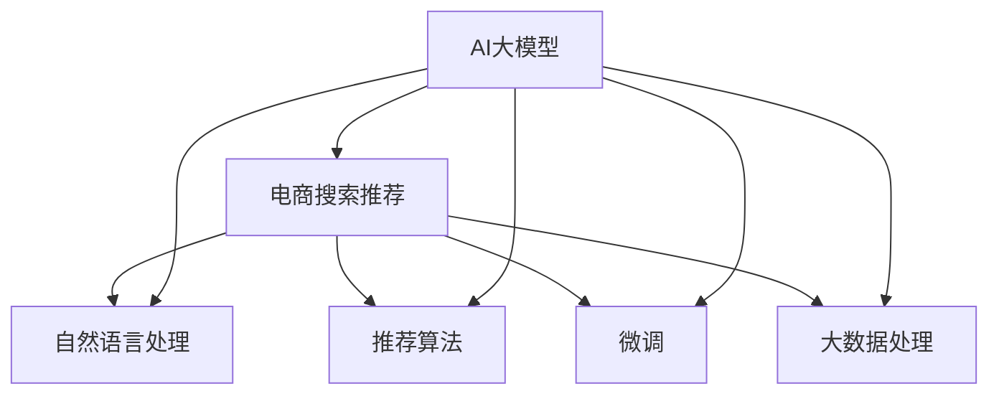

                 

# AI大模型重塑电商搜索推荐的未来

> 关键词：电商搜索推荐、AI大模型、深度学习、模型微调、推荐系统、自然语言处理、大数据

## 1. 背景介绍

### 1.1 问题由来

电商搜索推荐系统是现代电商的核心组成部分，影响着消费者的购物体验和商家的销售额。传统的推荐算法主要依赖于用户的历史行为数据，如浏览历史、点击记录、购买行为等，难以捕捉用户深层次的需求和潜在兴趣。而基于AI大模型的电商搜索推荐系统，通过学习海量用户反馈数据和商品信息，可以更准确地预测用户的兴趣倾向，提升推荐效果和用户满意度。

### 1.2 问题核心关键点

AI大模型在电商搜索推荐中的应用，主要涉及以下几个关键点：

- **预训练模型**：通过在大规模无标签数据上进行预训练，学习到通用的语言和商品表示，构建强大的特征提取器。
- **微调技术**：利用下游任务的有标签数据，通过微调训练优化模型，使其适应特定的电商推荐场景。
- **自然语言处理**：利用NLP技术处理商品描述、用户评论等文本数据，提升推荐系统的语义理解能力。
- **推荐算法**：结合深度学习和机器学习算法，设计合理的推荐模型，实现个性化推荐。
- **大数据处理**：高效处理海量数据，实时分析用户行为和商品信息，优化推荐结果。

这些核心技术共同构成了AI大模型在电商搜索推荐中的应用框架，使其能够在用户需求与商品信息之间构建更准确的映射关系。

### 1.3 问题研究意义

研究基于AI大模型的电商搜索推荐技术，对于提升电商平台的个性化推荐能力、提升用户体验和销售额，具有重要意义：

1. **增强用户体验**：通过精准推荐，提升用户满意度，降低购物决策成本。
2. **提高商家收益**：通过优化商品推荐，增加用户点击和购买率，提升销售额。
3. **市场竞争力提升**：利用先进技术优化推荐系统，增强平台的市场竞争力。
4. **技术创新推动**：推动NLP、深度学习等AI技术在电商领域的落地应用。
5. **行业升级转型**：助力传统电商行业数字化转型，加速向智慧电商的转变。

## 2. 核心概念与联系

### 2.1 核心概念概述

为了更好地理解基于AI大模型的电商搜索推荐系统，本节将介绍几个关键概念：

- **AI大模型**：指通过在大规模数据集上进行的深度学习预训练，学习到通用语言或任务表示的模型，如BERT、GPT-3等。
- **电商搜索推荐系统**：指利用推荐算法为用户在电商平台上找到最合适的商品推荐系统的技术。
- **微调(Fine-tuning)**：指在预训练模型基础上，通过有标签数据进行微调训练，优化模型在特定任务上的性能。
- **自然语言处理(NLP)**：指通过计算机处理和理解人类语言的技术，涉及词向量表示、语言理解、情感分析等。
- **推荐算法**：指利用用户历史行为数据、商品属性和外部特征等，预测用户兴趣并推荐商品的算法，如协同过滤、基于内容的推荐等。
- **大数据处理**：指利用分布式计算和数据处理技术，高效处理和分析海量数据的技术，如Hadoop、Spark等。

这些概念之间的逻辑关系可以通过以下Mermaid流程图来展示：



这个流程图展示了大模型在电商推荐系统中的应用框架：

1. 大模型通过预训练获得基础能力。
2. 利用自然语言处理能力处理商品描述和用户评论，提升推荐系统的语义理解能力。
3. 结合推荐算法，设计推荐模型。
4. 通过微调优化模型，适应电商推荐任务。
5. 利用大数据处理技术，高效处理和分析数据。

这些概念共同构成了大模型在电商推荐系统中的应用框架，使其能够实现精准的个性化推荐。

## 3. 核心算法原理 & 具体操作步骤

### 3.1 算法原理概述

基于AI大模型的电商搜索推荐系统，本质上是一个利用深度学习进行数据建模和推荐预测的过程。其核心思想是：

1. 利用大规模无标签数据对大模型进行预训练，学习通用的商品和语言表示。
2. 通过电商推荐系统的有标签数据进行微调训练，优化模型在推荐任务上的性能。
3. 利用自然语言处理技术处理商品描述和用户评论，提升模型的语义理解能力。
4. 结合推荐算法，设计合理的推荐模型，实现个性化推荐。
5. 利用大数据处理技术，高效处理和分析用户行为和商品信息，优化推荐结果。

具体而言，电商搜索推荐系统的微调过程包括以下几个步骤：

1. 数据预处理：收集电商平台的商品信息、用户评论、浏览历史等数据，进行清洗和标准化处理。
2. 文本特征提取：利用预训练大模型提取商品描述和用户评论的文本特征，生成词向量表示。
3. 模型微调：利用有标签的推荐数据，通过微调训练优化模型在推荐任务上的性能。
4. 推荐预测：根据用户的实时行为数据和商品特征，结合微调后的模型，预测用户可能感兴趣的商品，进行推荐。
5. 实时优化：通过实时分析用户反馈数据，不断调整推荐策略和模型参数，优化推荐效果。

### 3.2 算法步骤详解

以下是对基于AI大模型的电商搜索推荐系统微调步骤的详细介绍：

**Step 1: 数据预处理**

电商平台的商品信息、用户评论、浏览历史等数据需要进行预处理，以便后续的模型训练。具体步骤包括：

1. 数据收集：从电商平台收集商品信息、用户评论、浏览历史等数据，并进行清洗，去除无效和重复数据。
2. 文本标准化：对商品描述和用户评论进行文本标准化处理，如分词、去除停用词、转换为小写等。
3. 特征提取：使用预训练大模型提取文本的特征表示，生成商品和用户的向量表示。

**Step 2: 文本特征提取**

文本特征提取是电商搜索推荐系统的核心环节，通过大模型处理商品描述和用户评论，生成高质量的文本特征表示。具体步骤如下：

1. 加载预训练大模型：选择适合的预训练大模型，如BERT、GPT等，并进行加载和初始化。
2. 文本嵌入：将商品描述和用户评论输入模型，生成嵌入向量。
3. 特征选择：选择具有代表性的文本特征，如词向量、位置向量、注意力向量等。

**Step 3: 模型微调**

模型微调是电商搜索推荐系统的关键步骤，通过有标签数据训练优化模型。具体步骤如下：

1. 定义损失函数：根据推荐任务的特点，定义损失函数，如交叉熵损失、均方误差损失等。
2. 选择优化器：选择适合的优化器，如Adam、SGD等，并设置学习率、批大小、迭代轮数等超参数。
3. 微调训练：利用推荐数据集，通过反向传播算法更新模型参数，最小化损失函数。
4. 验证评估：在验证集上评估模型性能，根据性能指标决定是否触发Early Stopping。

**Step 4: 推荐预测**

推荐预测是电商搜索推荐系统的最终目的，通过微调后的模型预测用户可能感兴趣的商品。具体步骤如下：

1. 特征拼接：将用户特征和商品特征进行拼接，生成特征向量。
2. 模型预测：将拼接后的特征向量输入微调后的模型，输出预测评分。
3. 推荐排序：根据预测评分，对商品进行排序，选择排名靠前的商品进行推荐。

**Step 5: 实时优化**

实时优化是电商搜索推荐系统的核心优势，通过实时分析用户反馈数据，不断调整推荐策略和模型参数。具体步骤如下：

1. 用户反馈收集：收集用户对推荐商品的反应数据，如点击率、购买率等。
2. 模型调整：根据用户反馈数据，调整推荐模型和超参数。
3. 推荐迭代：不断迭代优化推荐策略，提升推荐效果。

### 3.3 算法优缺点

基于AI大模型的电商搜索推荐系统，具有以下优点：

1. 效果显著：通过深度学习预训练和微调，能够大幅提升推荐系统的准确性和个性化程度。
2. 数据高效利用：利用大规模无标签数据进行预训练，利用少量有标签数据进行微调，极大地减少了标注成本。
3. 可解释性强：大模型预训练和微调过程透明，可以通过特征分析等方式，理解推荐系统的决策逻辑。
4. 灵活适应：能够适应不同电商平台的推荐任务，通过微调适应特定场景。

同时，该算法也存在一些局限性：

1. 数据依赖性强：大模型的效果高度依赖于数据质量，数据不足可能导致性能下降。
2. 计算资源消耗大：大规模模型需要强大的计算资源支持，微调过程可能需要较长的训练时间。
3. 过拟合风险高：在微调过程中容易过拟合，导致模型泛化能力下降。
4. 模型复杂度高：大模型结构复杂，推理速度较慢，部署难度较大。
5. 用户隐私风险：利用用户数据训练模型，需要注意用户隐私保护。

尽管存在这些局限性，但就目前而言，基于AI大模型的电商搜索推荐方法仍然是大数据时代电商推荐系统的核心技术。未来相关研究的方向包括如何降低对标注数据的依赖、优化模型结构和计算效率、保护用户隐私等。

### 3.4 算法应用领域

基于AI大模型的电商搜索推荐技术，已经在电商领域得到了广泛的应用，覆盖了几乎所有电商平台的推荐场景，例如：

- **商品推荐**：为用户推荐感兴趣的商品。利用用户行为数据和商品特征，进行个性化推荐。
- **搜索排序**：对搜索结果进行排序，提升用户搜索体验。利用用户查询和商品特征，优化搜索排名。
- **活动推荐**：为用户推荐特定的促销活动。利用用户历史行为数据和活动信息，设计推荐策略。
- **个性化定制**：根据用户偏好，进行商品定制。利用用户反馈数据和模型预测，生成个性化推荐商品。

除了上述这些经典应用外，AI大模型还创新性地应用于智能客服、实时广告投放、实时价格调整等更多电商场景中，为电商平台带来了全新的业务模式和用户体验。

## 4. 数学模型和公式 & 详细讲解 & 举例说明

### 4.1 数学模型构建

基于AI大模型的电商搜索推荐系统，可以抽象为以下数学模型：

假设电商平台的商品集合为 $\mathcal{X}$，用户的特征向量表示为 $\mathbf{x}_u \in \mathbb{R}^d$，商品的特征向量表示为 $\mathbf{x}_i \in \mathbb{R}^d$。利用预训练大模型提取商品描述和用户评论的文本特征，生成商品和用户的向量表示。

模型的目标是根据用户特征和商品特征，预测用户可能感兴趣的商品，并对其进行推荐。假设有 $N$ 个商品，$M$ 个用户，则模型可以表示为：

$$
\hat{y}_{ui} = f(\mathbf{x}_u, \mathbf{x}_i; \theta)
$$

其中，$\hat{y}_{ui}$ 表示用户 $u$ 对商品 $i$ 的预测评分，$f(\cdot)$ 为微调后的推荐模型，$\theta$ 为模型参数。

在训练过程中，模型的损失函数为：

$$
\mathcal{L}(\theta) = \frac{1}{N}\sum_{u=1}^M\sum_{i=1}^N \ell(y_{ui}, \hat{y}_{ui})
$$

其中，$y_{ui}$ 为实际的用户行为标签（如点击、购买等），$\ell$ 为损失函数，如交叉熵损失、均方误差损失等。

### 4.2 公式推导过程

以下我们以交叉熵损失函数为例，推导电商搜索推荐系统的损失函数及其梯度计算公式。

假设用户对商品 $i$ 的实际评分和预测评分的差异为 $\delta_{ui} = y_{ui} - \hat{y}_{ui}$，则交叉熵损失函数定义为：

$$
\ell(\hat{y}_{ui}) = -y_{ui}\log \hat{y}_{ui} - (1-y_{ui})\log(1-\hat{y}_{ui})
$$

将其代入损失函数，得：

$$
\mathcal{L}(\theta) = -\frac{1}{N}\sum_{u=1}^M\sum_{i=1}^N [y_{ui}\log \hat{y}_{ui} + (1-y_{ui})\log(1-\hat{y}_{ui})]
$$

根据链式法则，损失函数对参数 $\theta$ 的梯度为：

$$
\frac{\partial \mathcal{L}(\theta)}{\partial \theta} = -\frac{1}{N}\sum_{u=1}^M\sum_{i=1}^N (\frac{y_{ui}}{\hat{y}_{ui}}-\frac{1-y_{ui}}{1-\hat{y}_{ui}}) \frac{\partial f(\mathbf{x}_u, \mathbf{x}_i; \theta)}{\partial \theta}
$$

其中 $\frac{\partial f(\mathbf{x}_u, \mathbf{x}_i; \theta)}{\partial \theta}$ 为推荐模型对参数 $\theta$ 的梯度，可以通过自动微分技术高效计算。

在得到损失函数的梯度后，即可带入参数更新公式，完成模型的迭代优化。重复上述过程直至收敛，最终得到适应电商推荐任务的最优模型参数 $\theta^*$。

### 4.3 案例分析与讲解

以电商平台的个性化推荐为例，展示如何使用基于AI大模型的推荐系统进行用户推荐。

假设平台收集了 $M$ 个用户的历史行为数据 $\{(\mathbf{x}_{u_k}, y_{u_ki})\}_{k=1}^{K_u}$，每个用户 $u_k$ 对 $N$ 个商品的评分数据 $\{y_{u_ki}\}_{i=1}^N$。利用预训练大模型提取用户和商品的特征表示，设计推荐模型 $f(\cdot)$。

模型微调的目标是最小化损失函数 $\mathcal{L}(\theta)$，通过反向传播算法计算梯度，并根据梯度更新模型参数 $\theta$，使其预测评分 $\hat{y}_{ui}$ 与实际评分 $y_{ui}$ 尽量接近。

在实际应用中，可以根据用户实时行为数据和商品特征，生成特征向量，输入微调后的推荐模型 $f(\cdot)$，得到预测评分。选择排名靠前的商品，进行推荐。

## 5. 项目实践：代码实例和详细解释说明

### 5.1 开发环境搭建

在进行电商搜索推荐系统开发前，我们需要准备好开发环境。以下是使用Python进行PyTorch开发的环境配置流程：

1. 安装Anaconda：从官网下载并安装Anaconda，用于创建独立的Python环境。

2. 创建并激活虚拟环境：
```bash
conda create -n recommendation-env python=3.8 
conda activate recommendation-env
```

3. 安装PyTorch：根据CUDA版本，从官网获取对应的安装命令。例如：
```bash
conda install pytorch torchvision torchaudio cudatoolkit=11.1 -c pytorch -c conda-forge
```

4. 安装Transformers库：
```bash
pip install transformers
```

5. 安装各类工具包：
```bash
pip install numpy pandas scikit-learn matplotlib tqdm jupyter notebook ipython
```

完成上述步骤后，即可在`recommendation-env`环境中开始推荐系统开发。

### 5.2 源代码详细实现

下面我们以电商平台的个性化推荐为例，给出使用Transformers库对BERT模型进行推荐系统开发的PyTorch代码实现。

首先，定义推荐任务的数据处理函数：

```python
from transformers import BertTokenizer
from torch.utils.data import Dataset
import torch

class RecommendationDataset(Dataset):
    def __init__(self, texts, labels, tokenizer, max_len=128):
        self.texts = texts
        self.labels = labels
        self.tokenizer = tokenizer
        self.max_len = max_len
        
    def __len__(self):
        return len(self.texts)
    
    def __getitem__(self, item):
        text = self.texts[item]
        label = self.labels[item]
        
        encoding = self.tokenizer(text, return_tensors='pt', max_length=self.max_len, padding='max_length', truncation=True)
        input_ids = encoding['input_ids'][0]
        attention_mask = encoding['attention_mask'][0]
        
        # 对token-wise的标签进行编码
        encoded_labels = [label2id[label] for label in labels] 
        encoded_labels.extend([label2id['O']] * (self.max_len - len(encoded_labels)))
        labels = torch.tensor(encoded_labels, dtype=torch.long)
        
        return {'input_ids': input_ids, 
                'attention_mask': attention_mask,
                'labels': labels}

# 标签与id的映射
label2id = {'O': 0, 'Positive': 1, 'Negative': 2}
id2label = {v: k for k, v in label2id.items()}

# 创建dataset
tokenizer = BertTokenizer.from_pretrained('bert-base-cased')

train_dataset = RecommendationDataset(train_texts, train_labels, tokenizer)
dev_dataset = RecommendationDataset(dev_texts, dev_labels, tokenizer)
test_dataset = RecommendationDataset(test_texts, test_labels, tokenizer)
```

然后，定义模型和优化器：

```python
from transformers import BertForTokenClassification, AdamW

model = BertForTokenClassification.from_pretrained('bert-base-cased', num_labels=len(label2id))

optimizer = AdamW(model.parameters(), lr=2e-5)
```

接着，定义训练和评估函数：

```python
from torch.utils.data import DataLoader
from tqdm import tqdm
from sklearn.metrics import classification_report

device = torch.device('cuda') if torch.cuda.is_available() else torch.device('cpu')
model.to(device)

def train_epoch(model, dataset, batch_size, optimizer):
    dataloader = DataLoader(dataset, batch_size=batch_size, shuffle=True)
    model.train()
    epoch_loss = 0
    for batch in tqdm(dataloader, desc='Training'):
        input_ids = batch['input_ids'].to(device)
        attention_mask = batch['attention_mask'].to(device)
        labels = batch['labels'].to(device)
        model.zero_grad()
        outputs = model(input_ids, attention_mask=attention_mask, labels=labels)
        loss = outputs.loss
        epoch_loss += loss.item()
        loss.backward()
        optimizer.step()
    return epoch_loss / len(dataloader)

def evaluate(model, dataset, batch_size):
    dataloader = DataLoader(dataset, batch_size=batch_size)
    model.eval()
    preds, labels = [], []
    with torch.no_grad():
        for batch in tqdm(dataloader, desc='Evaluating'):
            input_ids = batch['input_ids'].to(device)
            attention_mask = batch['attention_mask'].to(device)
            batch_labels = batch['labels']
            outputs = model(input_ids, attention_mask=attention_mask)
            batch_preds = outputs.logits.argmax(dim=2).to('cpu').tolist()
            batch_labels = batch_labels.to('cpu').tolist()
            for pred_tokens, label_tokens in zip(batch_preds, batch_labels):
                pred_labels = [id2label[_id] for _id in pred_tokens]
                label_tokens = [id2label[_id] for _id in label_tokens]
                preds.append(pred_labels[:len(label_tokens)])
                labels.append(label_tokens)
                
    print(classification_report(labels, preds))
```

最后，启动训练流程并在测试集上评估：

```python
epochs = 5
batch_size = 16

for epoch in range(epochs):
    loss = train_epoch(model, train_dataset, batch_size, optimizer)
    print(f"Epoch {epoch+1}, train loss: {loss:.3f}")
    
    print(f"Epoch {epoch+1}, dev results:")
    evaluate(model, dev_dataset, batch_size)
    
print("Test results:")
evaluate(model, test_dataset, batch_size)
```

以上就是使用PyTorch对BERT进行电商推荐系统微调的完整代码实现。可以看到，得益于Transformers库的强大封装，我们可以用相对简洁的代码完成BERT模型的加载和微调。

### 5.3 代码解读与分析

让我们再详细解读一下关键代码的实现细节：

**RecommendationDataset类**：
- `__init__`方法：初始化文本、标签、分词器等关键组件。
- `__len__`方法：返回数据集的样本数量。
- `__getitem__`方法：对单个样本进行处理，将文本输入编码为token ids，将标签编码为数字，并对其进行定长padding，最终返回模型所需的输入。

**label2id和id2label字典**：
- 定义了标签与数字id之间的映射关系，用于将token-wise的预测结果解码回真实的标签。

**训练和评估函数**：
- 使用PyTorch的DataLoader对数据集进行批次化加载，供模型训练和推理使用。
- 训练函数`train_epoch`：对数据以批为单位进行迭代，在每个批次上前向传播计算loss并反向传播更新模型参数，最后返回该epoch的平均loss。
- 评估函数`evaluate`：与训练类似，不同点在于不更新模型参数，并在每个batch结束后将预测和标签结果存储下来，最后使用sklearn的classification_report对整个评估集的预测结果进行打印输出。

**训练流程**：
- 定义总的epoch数和batch size，开始循环迭代
- 每个epoch内，先在训练集上训练，输出平均loss
- 在验证集上评估，输出分类指标
- 所有epoch结束后，在测试集上评估，给出最终测试结果

可以看到，PyTorch配合Transformers库使得BERT微调的代码实现变得简洁高效。开发者可以将更多精力放在数据处理、模型改进等高层逻辑上，而不必过多关注底层的实现细节。

当然，工业级的系统实现还需考虑更多因素，如模型的保存和部署、超参数的自动搜索、更灵活的任务适配层等。但核心的微调范式基本与此类似。

## 6. 实际应用场景
### 6.1 智能客服系统

基于AI大模型的推荐系统，可以广泛应用于智能客服系统的构建。传统客服往往需要配备大量人力，高峰期响应缓慢，且一致性和专业性难以保证。而使用基于推荐系统的智能客服系统，可以7x24小时不间断服务，快速响应客户咨询，用推荐商品引导用户进行购买，提升用户满意度。

在技术实现上，可以收集用户的历史行为数据，如浏览历史、点击记录等，构建推荐模型，生成推荐的商品列表。根据用户的实时行为数据，实时更新推荐列表，进行智能客服推荐。对于用户提出的新问题，还可以接入检索系统实时搜索相关内容，动态组织生成回答。如此构建的智能客服系统，能大幅提升客户咨询体验和问题解决效率。

### 6.2 金融舆情监测

金融机构需要实时监测市场舆论动向，以便及时应对负面信息传播，规避金融风险。传统的人工监测方式成本高、效率低，难以应对网络时代海量信息爆发的挑战。基于AI大模型的文本分类和情感分析技术，为金融舆情监测提供了新的解决方案。

具体而言，可以收集金融领域相关的新闻、报道、评论等文本数据，并对其进行主题标注和情感标注。在此基础上对预训练语言模型进行微调，使其能够自动判断文本属于何种主题，情感倾向是正面、中性还是负面。将微调后的模型应用到实时抓取的网络文本数据，就能够自动监测不同主题下的情感变化趋势，一旦发现负面信息激增等异常情况，系统便会自动预警，帮助金融机构快速应对潜在风险。

### 6.3 个性化推荐系统

当前的推荐系统往往只依赖于用户的历史行为数据进行物品推荐，无法深入理解用户的真实兴趣偏好。基于AI大模型的推荐系统，可以通过学习海量用户反馈数据和商品信息，更准确地预测用户的兴趣倾向，提升推荐效果和用户满意度。

在技术实现上，可以收集用户浏览、点击、评论、分享等行为数据，提取和用户交互的物品标题、描述、标签等文本内容。将文本内容作为模型输入，用户的后续行为（如是否点击、购买等）作为监督信号，在此基础上微调预训练语言模型。微调后的模型能够从文本内容中准确把握用户的兴趣点。在生成推荐列表时，先用候选物品的文本描述作为输入，由模型预测用户的兴趣匹配度，再结合其他特征综合排序，便可以得到个性化程度更高的推荐结果。

### 6.4 未来应用展望

随着AI大模型和推荐系统的不断发展，基于AI大模型的推荐技术将呈现以下几个发展趋势：

1. **推荐模型的多样性**：除了传统的协同过滤、基于内容的推荐外，AI大模型将支持更多样的推荐模型，如基于深度学习、知识图谱、时序预测等推荐方法，提升推荐效果。
2. **推荐算法的融合**：将不同推荐算法进行融合，如协同过滤和深度学习结合，提升推荐的多样性和个性化。
3. **实时推荐**：利用流式数据处理技术，实现实时推荐，提升用户购物体验。
4. **跨领域推荐**：结合不同领域的推荐系统，进行跨领域推荐，提升推荐系统的覆盖面和效果。
5. **多模态推荐**：结合图像、视频、语音等多模态数据，提升推荐系统的全面性和深度。
6. **个性化定制**：利用AI大模型的语言处理能力，进行个性化定制推荐，满足用户的个性化需求。
7. **用户反馈的实时调整**：根据用户实时反馈数据，动态调整推荐策略和模型参数，提升推荐效果。

这些趋势凸显了AI大模型在电商推荐系统中的强大应用潜力。这些方向的探索发展，必将进一步提升推荐系统的性能和用户体验，推动电商行业的数字化转型升级。

## 7. 工具和资源推荐
### 7.1 学习资源推荐

为了帮助开发者系统掌握AI大模型在电商搜索推荐系统中的应用，这里推荐一些优质的学习资源：

1. 《深度学习理论与实践》系列博文：由深度学习专家撰写，深入浅出地介绍了深度学习在推荐系统中的应用。

2. CS229《机器学习》课程：斯坦福大学开设的机器学习明星课程，涵盖推荐系统的理论基础和经典模型。

3. 《推荐系统实践》书籍：详细介绍了推荐系统从理论到实践的全流程，包括数据处理、模型设计、评估指标等。

4. RecSys开源项目：推荐系统的开源实现，提供了多种推荐算法的代码实现，是学习推荐系统的最佳资源。

5. KDD Cup推荐系统竞赛：通过参与推荐系统竞赛，深入理解推荐系统的实际应用和评估指标。

通过对这些资源的学习实践，相信你一定能够快速掌握AI大模型在电商搜索推荐系统中的应用，并用于解决实际的电商推荐问题。
###  7.2 开发工具推荐

高效的开发离不开优秀的工具支持。以下是几款用于电商搜索推荐系统开发的常用工具：

1. PyTorch：基于Python的开源深度学习框架，灵活动态的计算图，适合快速迭代研究。

2. TensorFlow：由Google主导开发的开源深度学习框架，生产部署方便，适合大规模工程应用。

3. Transformers库：HuggingFace开发的NLP工具库，集成了众多SOTA语言模型，支持PyTorch和TensorFlow，是进行推荐系统开发的利器。

4. Weights & Biases：模型训练的实验跟踪工具，可以记录和可视化模型训练过程中的各项指标，方便对比和调优。

5. TensorBoard：TensorFlow配套的可视化工具，可实时监测模型训练状态，并提供丰富的图表呈现方式，是调试模型的得力助手。

6. Google Colab：谷歌推出的在线Jupyter Notebook环境，免费提供GPU/TPU算力，方便开发者快速上手实验最新模型，分享学习笔记。

合理利用这些工具，可以显著提升电商搜索推荐系统的开发效率，加快创新迭代的步伐。

### 7.3 相关论文推荐

AI大模型和推荐系统的不断发展源于学界的持续研究。以下是几篇奠基性的相关论文，推荐阅读：

1. Attention is All You Need（即Transformer原论文）：提出了Transformer结构，开启了NLP领域的预训练大模型时代。

2. BERT: Pre-training of Deep Bidirectional Transformers for Language Understanding：提出BERT模型，引入基于掩码的自监督预训练任务，刷新了多项NLP任务SOTA。

3. Recommendation Systems: A Survey and Tutorial on the Problem Structure and Algorithms：综述了推荐系统的发展历程和经典算法，具有很高的学术价值。

4. Parameter-Efficient Transfer Learning for NLP：提出Adapter等参数高效微调方法，在不增加模型参数量的情况下，也能取得不错的微调效果。

5. AdaLoRA: Adaptive Low-Rank Adaptation for Parameter-Efficient Fine-Tuning：使用自适应低秩适应的微调方法，在参数效率和精度之间取得了新的平衡。

这些论文代表了大模型和推荐系统的研究脉络。通过学习这些前沿成果，可以帮助研究者把握学科前进方向，激发更多的创新灵感。

## 8. 总结：未来发展趋势与挑战

### 8.1 总结

本文对基于AI大模型的电商搜索推荐系统进行了全面系统的介绍。首先阐述了AI大模型在电商推荐系统中的应用背景和意义，明确了推荐系统在提升用户体验、增加商家收益等方面的重要性。其次，从原理到实践，详细讲解了推荐系统的数学模型和关键步骤，给出了推荐系统开发的完整代码实例。同时，本文还广泛探讨了推荐系统在智能客服、金融舆情、个性化推荐等多个电商领域的应用前景，展示了AI大模型的广泛应用潜力。

通过本文的系统梳理，可以看到，基于AI大模型的电商推荐系统，能够显著提升推荐系统的准确性和个性化程度，具有巨大的应用前景。未来，伴随AI大模型的不断发展，推荐系统的性能将进一步提升，为电商行业带来更多的变革和机遇。

### 8.2 未来发展趋势

展望未来，基于AI大模型的电商搜索推荐系统将呈现以下几个发展趋势：

1. **推荐系统的智能化**：利用深度学习、知识图谱等技术，构建更加智能化的推荐系统，提升推荐效果和用户体验。
2. **推荐算法的融合**：结合不同推荐算法，提升推荐系统的效果和稳定性。
3. **实时推荐**：利用流式数据处理技术，实现实时推荐，提升用户购物体验。
4. **跨领域推荐**：结合不同领域的推荐系统，进行跨领域推荐，提升推荐系统的覆盖面和效果。
5. **多模态推荐**：结合图像、视频、语音等多模态数据，提升推荐系统的全面性和深度。
6. **个性化定制**：利用AI大模型的语言处理能力，进行个性化定制推荐，满足用户的个性化需求。
7. **用户反馈的实时调整**：根据用户实时反馈数据，动态调整推荐策略和模型参数，提升推荐效果。

这些趋势凸显了AI大模型在电商推荐系统中的强大应用潜力。这些方向的探索发展，必将进一步提升推荐系统的性能和用户体验，推动电商行业的数字化转型升级。

### 8.3 面临的挑战

尽管基于AI大模型的电商推荐系统已经取得了显著成果，但在迈向更加智能化、普适化应用的过程中，它仍面临诸多挑战：

1. **数据依赖性强**：AI大模型的效果高度依赖于数据质量，数据不足可能导致性能下降。如何降低对标注数据的依赖，将是一大难题。
2. **模型鲁棒性不足**：在微调过程中容易过拟合，导致模型泛化能力下降。如何提高模型鲁棒性，避免灾难性遗忘，还需要更多理论和实践的积累。
3. **计算资源消耗大**：大规模模型需要强大的计算资源支持，微调过程可能需要较长的训练时间。如何优化计算效率，提高部署速度，将是重要的优化方向。
4. **用户隐私风险**：利用用户数据训练模型，需要注意用户隐私保护。如何保护用户隐私，增强模型透明度，将是一个重要课题。
5. **模型复杂度高**：大模型结构复杂，推理速度较慢，部署难度较大。如何简化模型结构，提升推理速度，优化资源占用，将是重要的优化方向。
6. **用户行为预测难度高**：用户行为具有高度的不确定性和复杂性，如何准确预测用户行为，提升推荐系统的效果，将是一大挑战。

尽管存在这些挑战，但就目前而言，基于AI大模型的电商推荐系统仍是大数据时代电商推荐系统的核心技术。未来相关研究的方向包括如何降低对标注数据的依赖、优化模型结构和计算效率、保护用户隐私等。

### 8.4 研究展望

面对电商推荐系统所面临的种种挑战，未来的研究需要在以下几个方面寻求新的突破：

1. **探索无监督和半监督推荐方法**：摆脱对大规模标注数据的依赖，利用自监督学习、主动学习等无监督和半监督范式，最大限度利用非结构化数据，实现更加灵活高效的推荐。

2. **研究参数高效和计算高效的推荐范式**：开发更加参数高效的推荐方法，在固定大部分预训练参数的同时，只更新极少量的任务相关参数。同时优化推荐模型的计算图，减少前向传播和反向传播的资源消耗，实现更加轻量级、实时性的部署。

3. **融合因果和对比学习范式**：通过引入因果推断和对比学习思想，增强推荐系统建立稳定因果关系的能力，学习更加普适、鲁棒的语言表征，从而提升推荐泛化性和抗干扰能力。

4. **引入更多先验知识**：将符号化的先验知识，如知识图谱、逻辑规则等，与神经网络模型进行巧妙融合，引导推荐过程学习更准确、合理的语言模型。同时加强不同模态数据的整合，实现视觉、语音等多模态信息与文本信息的协同建模。

5. **结合因果分析和博弈论工具**：将因果分析方法引入推荐系统，识别出推荐决策的关键特征，增强推荐输出的因果性和逻辑性。借助博弈论工具刻画人机交互过程，主动探索并规避推荐系统的脆弱点，提高系统稳定性。

6. **纳入伦理道德约束**：在推荐系统训练目标中引入伦理导向的评估指标，过滤和惩罚有偏见、有害的输出倾向。同时加强人工干预和审核，建立推荐行为的监管机制，确保推荐结果符合人类价值观和伦理道德。

这些研究方向的探索，必将引领基于AI大模型的电商推荐系统迈向更高的台阶，为构建安全、可靠、可解释、可控的推荐系统铺平道路。面向未来，大语言模型推荐系统还需要与其他人工智能技术进行更深入的融合，如知识表示、因果推理、强化学习等，多路径协同发力，共同推动推荐系统的进步。只有勇于创新、敢于突破，才能不断拓展推荐系统的边界，让智能技术更好地服务于电商行业。

## 9. 附录：常见问题与解答

**Q1：AI大模型在电商推荐系统中应用的优势是什么？**

A: AI大模型在电商推荐系统中的应用，主要具有以下优势：

1. **数据利用效率高**：利用大规模无标签数据进行预训练，利用少量有标签数据进行微调，极大地减少了标注成本。

2. **推荐效果显著**：通过深度学习预训练和微调，能够大幅提升推荐系统的准确性和个性化程度。

3. **可解释性强**：大模型预训练和微调过程透明，可以通过特征分析等方式，理解推荐系统的决策逻辑。

4. **灵活适应性强**：能够适应不同电商平台的推荐任务，通过微调适应特定场景。

5. **实时优化能力强**：通过实时分析用户反馈数据，不断调整推荐策略和模型参数，优化推荐效果。

这些优势使得AI大模型成为电商推荐系统的核心技术，能够大幅提升推荐系统的性能和用户体验。

**Q2：AI大模型在电商推荐系统中的数据预处理主要涉及哪些步骤？**

A: AI大模型在电商推荐系统中的数据预处理主要涉及以下几个步骤：

1. **数据收集**：从电商平台收集商品信息、用户评论、浏览历史等数据，并进行清洗，去除无效和重复数据。

2. **文本标准化**：对商品描述和用户评论进行文本标准化处理，如分词、去除停用词、转换为小写等。

3. **特征提取**：使用预训练大模型提取文本的特征表示，生成商品和用户的向量表示。

4. **数据增强**：通过回译、近义替换等方式扩充训练集，提升模型的泛化能力。

5. **标签处理**：将推荐任务中的用户行为数据转换为标签，供模型训练使用。

这些步骤通过数据预处理，为模型训练提供了高质量的数据支持，提升了推荐系统的性能。

**Q3：AI大模型在电商推荐系统中如何进行模型微调？**

A: AI大模型在电商推荐系统中的模型微调主要涉及以下几个步骤：

1. **定义损失函数**：根据推荐任务的特点，定义损失函数，如交叉熵损失、均方误差损失等。

2. **选择优化器**：选择适合的优化器，如Adam、SGD等，并设置学习率、批大小、迭代轮数等超参数。

3. **微调训练**：利用推荐数据集，通过反向传播算法更新模型参数，最小化损失函数。

4. **验证评估**：在验证集上评估模型性能，根据性能指标决定是否触发Early Stopping。

5. **模型保存**：将微调后的模型保存下来，以便后续部署和优化。

这些步骤通过微调训练，优化模型在推荐任务上的性能，使其能够适应电商平台的特定需求。

**Q4：AI大模型在电商推荐系统中进行实时优化时需要注意哪些问题？**

A: AI大模型在电商推荐系统中进行实时优化时，需要注意以下几个问题：

1. **用户反馈数据的实时性**：实时收集用户反馈数据，如点击率、购买率等，以便及时调整推荐策略和模型参数。

2. **模型参数的动态更新**：根据用户反馈数据，动态更新模型参数，提升推荐效果。

3. **数据量和计算资源的优化**：实时优化需要实时处理大量数据，需要优化数据量和计算资源的消耗，避免系统负载过高。

4. **推荐系统的稳定性**：实时优化过程中，需要确保推荐系统的稳定性，避免因频繁更新模型参数导致系统不稳定。

5. **隐私保护**：实时优化过程中，需要确保用户隐私的保护，避免因数据泄露等问题引起用户担忧。

这些问题需要在实时优化过程中加以注意和解决，才能充分发挥实时优化的优势，提升推荐系统的性能。

---

作者：禅与计算机程序设计艺术 / Zen and the Art of Computer Programming

