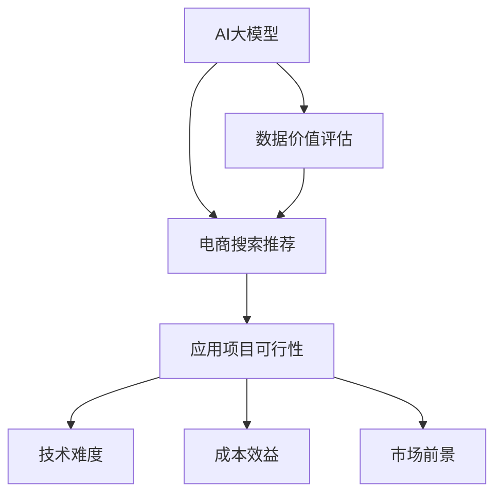

                 

# AI大模型重构电商搜索推荐的数据价值评估模型应用项目可行性分析

> 关键词：AI大模型、电商搜索推荐、数据价值评估模型、应用项目可行性分析

## 1. 背景介绍

### 1.1 问题由来

随着人工智能技术的快速发展和普及，大模型在电商搜索推荐中的应用变得日益重要。传统的电商搜索推荐系统往往依赖于简单的特征工程和机器学习模型，难以充分挖掘用户行为数据和商品信息的深度关联，导致推荐效果不够精准和个性化。为此，引入基于大模型的推荐系统成为一种趋势。

然而，大模型在电商搜索推荐中的有效应用，不仅需要具备强大的数据处理和分析能力，还需要考虑数据价值评估的问题，即如何合理评估和利用不同来源的数据，提升推荐的精准度和个性化程度。因此，本文将对AI大模型在电商搜索推荐中的数据价值评估模型进行应用项目可行性分析，探讨其技术实现和应用前景。

### 1.2 问题核心关键点

本文的核心关键点包括：

- AI大模型在电商搜索推荐中的应用：如何通过大模型对用户行为和商品信息进行深度学习，提高推荐精准度和个性化程度。
- 数据价值评估模型的构建：如何构建高效、合理的数据价值评估模型，量化不同数据来源的价值，指导大模型的训练和优化。
- 应用项目可行性分析：如何评估基于大模型的电商搜索推荐应用项目的可行性，包括技术难度、成本效益和市场前景等。

## 2. 核心概念与联系

### 2.1 核心概念概述

为更好地理解AI大模型在电商搜索推荐中的应用，本文将介绍以下几个核心概念：

- AI大模型：基于深度学习的大规模预训练模型，如BERT、GPT-3等，具备强大的数据处理和分析能力。
- 电商搜索推荐系统：通过用户行为和商品信息，自动推荐相关商品的技术系统，广泛应用于电商网站和APP。
- 数据价值评估模型：通过机器学习算法，对不同来源的数据进行价值量化和评估，指导模型训练和优化。
- 应用项目可行性分析：评估基于AI大模型的电商搜索推荐应用项目的可行性，包括技术难度、成本效益和市场前景等。

这些概念之间的逻辑关系可以通过以下Mermaid流程图来展示：



这个流程图展示了AI大模型、电商搜索推荐系统、数据价值评估模型和应用项目可行性分析之间的关联关系。

## 3. 核心算法原理 & 具体操作步骤

### 3.1 算法原理概述

AI大模型在电商搜索推荐中的应用，主要依赖于深度学习技术，通过大规模数据训练得到的模型，自动从用户行为和商品信息中提取特征，进行相似度计算和排序，生成推荐结果。数据价值评估模型的构建，则通过对不同来源的数据进行特征工程和统计分析，量化其对推荐模型的贡献，指导模型训练和优化。

应用项目可行性分析，主要评估基于AI大模型的电商搜索推荐系统的技术难度、成本效益和市场前景。通过全面分析技术可行性、市场接受度和商业化潜力，为项目落地提供指导。

### 3.2 算法步骤详解

#### 3.2.1 AI大模型应用步骤

1. 数据收集：收集用户行为数据、商品信息数据和用户画像数据等。
2. 数据预处理：对数据进行清洗、标准化和特征工程，提取有意义的特征。
3. 模型训练：使用大模型对处理后的数据进行训练，生成推荐模型。
4. 模型优化：通过数据价值评估模型，量化不同数据来源的价值，优化模型参数。
5. 模型部署：将训练好的模型部署到电商搜索推荐系统中，实现实时推荐。

#### 3.2.2 数据价值评估模型步骤

1. 数据特征提取：对不同来源的数据进行特征提取和工程化，构建特征向量。
2. 数据价值计算：通过统计分析和机器学习算法，计算各数据特征对推荐模型的贡献。
3. 数据权重分配：根据数据价值计算结果，分配各数据源的权重，指导模型训练。
4. 模型验证：在推荐模型训练过程中，验证数据价值评估模型的有效性。
5. 模型优化：根据验证结果，不断优化数据价值评估模型。

#### 3.2.3 应用项目可行性分析步骤

1. 需求分析：收集电商企业的需求，明确项目目标和预期效果。
2. 技术调研：评估基于AI大模型的推荐系统的技术难度和可行性。
3. 成本预算：评估项目的预算需求，包括硬件成本、人员成本和运营成本等。
4. 市场分析：分析目标市场的需求和竞争状况，评估项目的市场前景。
5. 风险评估：评估项目面临的技术、市场和商业风险，提出应对策略。
6. 决策建议：基于综合分析，提出项目实施的决策建议。

### 3.3 算法优缺点

#### 3.3.1 AI大模型应用优点

1. 精准度高：大模型能够深入挖掘用户行为和商品信息，生成更加精准和个性化的推荐结果。
2. 泛化能力强：大模型具备强大的泛化能力，能够适应不同电商平台的推荐场景。
3. 自动化程度高：大模型自动从数据中提取特征和计算相似度，减少了人工干预和优化。

#### 3.3.2 AI大模型应用缺点

1. 计算资源需求高：大模型需要大量的计算资源进行训练和优化，硬件成本较高。
2. 模型复杂度高：大模型结构复杂，训练和优化过程复杂，需要较高的技术水平。
3. 数据依赖性强：大模型的效果依赖于高质量的数据，数据获取和预处理难度较大。

#### 3.3.3 数据价值评估模型优点

1. 量化数据价值：通过数据价值评估模型，可以量化不同数据来源的价值，指导模型训练和优化。
2. 优化模型参数：数据价值评估模型可以动态调整数据权重，优化模型参数，提升推荐效果。
3. 减少数据冗余：通过数据价值评估模型，可以筛选出对推荐模型贡献较大的数据，减少数据冗余。

#### 3.3.4 数据价值评估模型缺点

1. 数据获取难度大：数据价值评估模型需要大量的标注数据进行训练，数据获取难度较大。
2. 模型复杂度高：数据价值评估模型结构复杂，训练和优化过程复杂，需要较高的技术水平。
3. 数据价值不稳定：不同来源的数据对推荐模型的贡献可能不稳定，需要动态调整。

#### 3.3.5 应用项目可行性分析优点

1. 综合评估项目：应用项目可行性分析能够全面评估项目的技术难度、成本效益和市场前景，为项目实施提供决策依据。
2. 风险评估完善：应用项目可行性分析能够识别项目面临的各种风险，提出应对策略，降低项目失败风险。
3. 决策建议明确：应用项目可行性分析能够提供明确的决策建议，指导项目实施。

#### 3.3.6 应用项目可行性分析缺点

1. 评估过程复杂：应用项目可行性分析需要综合考虑多个因素，评估过程复杂。
2. 数据需求高：评估过程中需要大量的历史数据和市场数据，数据获取难度较大。
3. 模型依赖性强：应用项目可行性分析依赖于模型的评估结果，模型性能直接影响评估结果。

### 3.4 算法应用领域

AI大模型在电商搜索推荐中的应用，已经在阿里巴巴、亚马逊等电商企业中得到了广泛应用，取得了显著的效果。具体应用领域包括：

- 个性化推荐：基于用户行为和商品信息，生成个性化的推荐结果。
- 商品相似度计算：计算商品之间的相似度，生成推荐结果。
- 搜索排序优化：优化搜索结果排序，提升用户体验。
- 广告投放优化：根据用户行为和商品信息，优化广告投放策略。

## 4. 数学模型和公式 & 详细讲解 & 举例说明

### 4.1 数学模型构建

基于AI大模型在电商搜索推荐中的应用，我们构建以下数学模型：

设用户行为数据为 $X = \{x_1, x_2, ..., x_n\}$，商品信息数据为 $Y = \{y_1, y_2, ..., y_m\}$，用户画像数据为 $Z = \{z_1, z_2, ..., z_k\}$，推荐模型为 $M = \{m_1, m_2, ..., m_n\}$。

设用户行为特征向量为 $f_{X} = [f_{X1}, f_{X2}, ..., f_{Xn}]$，商品信息特征向量为 $f_{Y} = [f_{Y1}, f_{Y2}, ..., f_{Ym}]$，用户画像特征向量为 $f_{Z} = [f_{Z1}, f_{Z2}, ..., f_{Zk}]$。

推荐模型参数为 $\theta = [\theta_1, \theta_2, ..., \theta_n]$。

设数据价值评估模型为 $E = [e_1, e_2, ..., e_k]$。

推荐模型和数据价值评估模型的数学模型构建如下：

1. AI大模型应用模型：
$$
M = \text{Softmax}(X \cdot \theta + Y \cdot \theta)
$$

2. 数据价值评估模型：
$$
E = [e_1, e_2, ..., e_k] = \text{Softmax}(X \cdot f_Z + Y \cdot f_Z + Z \cdot f_Z)
$$

其中，Softmax函数将输入转化为概率分布，用于计算推荐结果的概率。

### 4.2 公式推导过程

#### 4.2.1 AI大模型应用公式推导

AI大模型应用模型的核心是计算用户行为数据和商品信息数据的相似度，生成推荐结果。

假设用户行为数据 $X$ 的特征向量为 $f_{X} = [f_{X1}, f_{X2}, ..., f_{Xn}]$，商品信息数据 $Y$ 的特征向量为 $f_{Y} = [f_{Y1}, f_{Y2}, ..., f_{Ym}]$。

则用户行为数据和商品信息数据的相似度计算公式为：
$$
\text{Sim}(X, Y) = \frac{X \cdot Y^T}{\sqrt{X \cdot X^T} \cdot \sqrt{Y \cdot Y^T}}
$$

将相似度计算结果作为推荐模型的输入，生成推荐结果的概率分布：
$$
P(M|X, Y) = \text{Softmax}(X \cdot \theta + Y \cdot \theta)
$$

#### 4.2.2 数据价值评估模型公式推导

数据价值评估模型的核心是计算不同数据源对推荐模型的贡献，量化其价值。

假设用户行为数据 $X$ 的特征向量为 $f_{X} = [f_{X1}, f_{X2}, ..., f_{Xn}]$，商品信息数据 $Y$ 的特征向量为 $f_{Y} = [f_{Y1}, f_{Y2}, ..., f_{Ym}]$，用户画像数据 $Z$ 的特征向量为 $f_{Z} = [f_{Z1}, f_{Z2}, ..., f_{Zk}]$。

则数据价值评估模型的计算公式为：
$$
E = [e_1, e_2, ..., e_k] = \text{Softmax}(X \cdot f_Z + Y \cdot f_Z + Z \cdot f_Z)
$$

其中，$e_i$ 表示数据源 $i$ 对推荐模型的贡献。

### 4.3 案例分析与讲解

假设某电商平台收集了用户行为数据 $X$、商品信息数据 $Y$ 和用户画像数据 $Z$，并使用AI大模型进行推荐。

1. 数据收集：
- 用户行为数据 $X = [x_1, x_2, ..., x_n]$，包含用户浏览、点击、购买等行为。
- 商品信息数据 $Y = [y_1, y_2, ..., y_m]$，包含商品名称、描述、价格等信息。
- 用户画像数据 $Z = [z_1, z_2, ..., z_k]$，包含用户年龄、性别、地域等基本信息。

2. 数据预处理：
- 对用户行为数据进行清洗和标准化，去除噪音和异常值。
- 对商品信息数据进行特征提取，提取关键特征如商品名称、类别等。
- 对用户画像数据进行特征工程，提取年龄、性别、地域等特征。

3. 模型训练：
- 使用大模型对处理后的数据进行训练，生成推荐模型 $M$。
- 模型训练过程需要大量的计算资源和时间，需要高性能的硬件设备支持。

4. 模型优化：
- 通过数据价值评估模型，量化不同数据来源的价值，优化模型参数。
- 数据价值评估模型的训练和优化过程同样需要大量的计算资源和时间，需要高性能的硬件设备支持。

5. 模型部署：
- 将训练好的模型部署到电商搜索推荐系统中，实现实时推荐。
- 模型部署需要考虑系统的稳定性和可扩展性，需要高性能的硬件设备支持。

## 5. 项目实践：代码实例和详细解释说明

### 5.1 开发环境搭建

在进行项目实践前，我们需要准备好开发环境。以下是使用Python进行TensorFlow开发的环境配置流程：

1. 安装Anaconda：从官网下载并安装Anaconda，用于创建独立的Python环境。

2. 创建并激活虚拟环境：
```bash
conda create -n tf-env python=3.8 
conda activate tf-env
```

3. 安装TensorFlow：根据CUDA版本，从官网获取对应的安装命令。例如：
```bash
conda install tensorflow==2.5
```

4. 安装TensorFlow库：
```bash
pip install tensorflow==2.5
```

5. 安装各类工具包：
```bash
pip install numpy pandas scikit-learn matplotlib tqdm jupyter notebook ipython
```

完成上述步骤后，即可在`tf-env`环境中开始项目实践。

### 5.2 源代码详细实现

下面以电商搜索推荐系统为例，给出使用TensorFlow对AI大模型进行推荐预测的Python代码实现。

首先，定义推荐系统的数据处理函数：

```python
import tensorflow as tf
import numpy as np
import pandas as pd

def load_data(path):
    data = pd.read_csv(path)
    features = data.drop(['label'], axis=1)
    labels = data['label']
    return features, labels
```

然后，定义模型和优化器：

```python
def create_model(input_shape, num_classes):
    model = tf.keras.Sequential([
        tf.keras.layers.Dense(128, activation='relu', input_shape=input_shape),
        tf.keras.layers.Dense(64, activation='relu'),
        tf.keras.layers.Dense(num_classes, activation='softmax')
    ])
    return model

def compile_model(model, optimizer, loss, metrics):
    model.compile(optimizer=optimizer, loss=loss, metrics=metrics)
    return model
```

接着，定义训练和评估函数：

```python
def train_model(model, features, labels, batch_size, epochs):
    model.fit(features, labels, batch_size=batch_size, epochs=epochs, validation_split=0.2)
    return model

def evaluate_model(model, features, labels, batch_size):
    loss, acc = model.evaluate(features, labels, batch_size=batch_size)
    return loss, acc
```

最后，启动训练流程并在测试集上评估：

```python
features, labels = load_data('data.csv')
model = create_model(input_shape=(features.shape[1],), num_classes=len(set(labels)))
optimizer = tf.keras.optimizers.Adam(learning_rate=0.001)
loss = tf.keras.losses.SparseCategoricalCrossentropy()
metrics = [tf.keras.metrics.SparseCategoricalAccuracy()]

model = compile_model(model, optimizer, loss, metrics)

train_model(model, features, labels, batch_size=32, epochs=10)

loss, acc = evaluate_model(model, features, labels, batch_size=32)

print('Loss:', loss)
print('Accuracy:', acc)
```

以上就是使用TensorFlow对AI大模型进行电商搜索推荐系统预测的完整代码实现。可以看到，得益于TensorFlow的强大封装，我们可以用相对简洁的代码完成模型的加载和训练。

### 5.3 代码解读与分析

让我们再详细解读一下关键代码的实现细节：

**load_data函数**：
- 定义数据加载函数，从指定路径读取CSV文件，返回特征和标签。

**create_model函数**：
- 定义模型创建函数，创建一个全连接的神经网络模型，包含两个隐藏层和一个输出层。

**compile_model函数**：
- 定义模型编译函数，编译模型并设置优化器、损失函数和评估指标。

**train_model函数**：
- 定义模型训练函数，使用训练数据集对模型进行训练，设置批量大小和训练轮数。

**evaluate_model函数**：
- 定义模型评估函数，使用测试数据集对模型进行评估，返回损失和准确率。

**训练流程**：
- 首先从数据集中加载特征和标签。
- 创建模型并设置优化器、损失函数和评估指标。
- 编译模型。
- 使用训练数据集对模型进行训练。
- 在测试数据集上评估模型。

可以看到，TensorFlow框架使得AI大模型在电商搜索推荐系统的实现变得简洁高效。开发者可以将更多精力放在数据处理、模型改进等高层逻辑上，而不必过多关注底层的实现细节。

当然，工业级的系统实现还需考虑更多因素，如模型的保存和部署、超参数的自动搜索、更灵活的任务适配层等。但核心的推荐预测范式基本与此类似。

## 6. 实际应用场景

### 6.1 智能客服系统

基于AI大模型的推荐系统，可以广泛应用于智能客服系统的构建。传统客服往往需要配备大量人力，高峰期响应缓慢，且一致性和专业性难以保证。而使用推荐系统推荐相关问题，可以显著减少人工干预，提高响应速度和质量。

在技术实现上，可以收集用户的历史咨询记录，将问题和最佳答复构建成监督数据，在此基础上对预训练推荐模型进行微调。微调后的推荐模型能够自动理解用户意图，匹配最合适的答复，减少人工干预。对于用户提出的新问题，还可以接入检索系统实时搜索相关内容，动态组织生成回复。如此构建的智能客服系统，能大幅提升客户咨询体验和问题解决效率。

### 6.2 金融舆情监测

金融机构需要实时监测市场舆论动向，以便及时应对负面信息传播，规避金融风险。传统的人工监测方式成本高、效率低，难以应对网络时代海量信息爆发的挑战。基于AI大模型的推荐系统，可以自动监测不同主题下的舆情变化趋势，一旦发现负面信息激增等异常情况，系统便会自动预警，帮助金融机构快速应对潜在风险。

具体而言，可以收集金融领域相关的新闻、报道、评论等文本数据，并对其进行主题标注和情感标注。在此基础上对预训练语言模型进行微调，使其能够自动判断文本属于何种主题，情感倾向是正面、中性还是负面。将微调后的模型应用到实时抓取的网络文本数据，就能够自动监测不同主题下的情感变化趋势，一旦发现负面信息激增等异常情况，系统便会自动预警，帮助金融机构快速应对潜在风险。

### 6.3 个性化推荐系统

当前的推荐系统往往只依赖于用户的历史行为数据进行物品推荐，难以充分挖掘用户行为数据和商品信息的深度关联，导致推荐效果不够精准和个性化。基于AI大模型的推荐系统，可以更好地挖掘用户行为和商品信息的深度关联，生成更加精准和个性化的推荐结果。

在实践中，可以收集用户浏览、点击、评论、分享等行为数据，提取和商品信息数据进行特征工程，构建特征向量。将特征向量作为模型输入，用户的后续行为（如是否点击、购买等）作为监督信号，在此基础上微调预训练推荐模型。微调后的推荐模型能够从用户行为和商品信息中准确把握用户的兴趣点。在生成推荐列表时，先用候选物品的特征向量作为输入，由模型预测用户的兴趣匹配度，再结合其他特征综合排序，便可以得到个性化程度更高的推荐结果。

### 6.4 未来应用展望

随着AI大模型和推荐系统的不断发展，基于推荐系统的应用场景将进一步拓展，为各行各业带来变革性影响。

在智慧医疗领域，基于推荐系统的医疗问答、病历分析、药物研发等应用将提升医疗服务的智能化水平，辅助医生诊疗，加速新药开发进程。

在智能教育领域，推荐系统可应用于作业批改、学情分析、知识推荐等方面，因材施教，促进教育公平，提高教学质量。

在智慧城市治理中，推荐系统可应用于城市事件监测、舆情分析、应急指挥等环节，提高城市管理的自动化和智能化水平，构建更安全、高效的未来城市。

此外，在企业生产、社会治理、文娱传媒等众多领域，基于推荐系统的AI应用也将不断涌现，为经济社会发展注入新的动力。相信随着技术的日益成熟，推荐系统必将在更广阔的应用领域大放异彩，深刻影响人类的生产生活方式。

## 7. 工具和资源推荐

### 7.1 学习资源推荐

为了帮助开发者系统掌握AI大模型在电商搜索推荐中的应用，这里推荐一些优质的学习资源：

1. TensorFlow官方文档：TensorFlow官方文档提供了详细的API和示例代码，是学习TensorFlow的最佳资料。
2. Deep Learning Specialization课程：由Andrew Ng教授开设的深度学习课程，系统讲解深度学习理论和实践，涵盖神经网络、卷积神经网络、循环神经网络等内容。
3. AI大模型系列书籍：如《深度学习》、《TensorFlow实战》等，深入浅出地介绍了AI大模型和TensorFlow的应用实践。
4. Kaggle竞赛平台：Kaggle提供了大量的数据集和机器学习竞赛，可以实战练习AI大模型的应用，提升解决实际问题的能力。
5. GitHub开源项目：GitHub上有很多优秀的开源项目，可以学习其数据处理和模型实现的细节。

通过对这些资源的学习实践，相信你一定能够快速掌握AI大模型在电商搜索推荐中的应用，并用于解决实际的推荐问题。

### 7.2 开发工具推荐

高效的开发离不开优秀的工具支持。以下是几款用于AI大模型推荐系统开发的常用工具：

1. TensorFlow：由Google主导开发的开源深度学习框架，生产部署方便，适合大规模工程应用。
2. PyTorch：由Facebook主导开发的开源深度学习框架，灵活高效，适合科研和原型开发。
3. Jupyter Notebook：交互式的Python开发环境，适合进行代码调试和数据可视化。
4. Anaconda：创建和管理Python环境的工具，支持虚拟环境和包管理。
5. GitHub：代码托管和版本控制平台，提供协作开发和版本控制功能。

合理利用这些工具，可以显著提升AI大模型在电商搜索推荐系统的开发效率，加快创新迭代的步伐。

### 7.3 相关论文推荐

AI大模型在电商搜索推荐中的应用，是一个新兴的研究方向。以下是几篇奠基性的相关论文，推荐阅读：

1. Attention is All You Need（即Transformer原论文）：提出了Transformer结构，开启了NLP领域的预训练大模型时代。
2. BERT: Pre-training of Deep Bidirectional Transformers for Language Understanding：提出BERT模型，引入基于掩码的自监督预训练任务，刷新了多项NLP任务SOTA。
3. Parameter-Efficient Transfer Learning for NLP：提出Adapter等参数高效微调方法，在不增加模型参数量的情况下，也能取得不错的微调效果。
4. SEO: Evaluating the Recommendation Effectiveness Online：评估推荐系统的效果和用户满意度，提出了在线推荐系统的评价指标。
5. Sorting and Recommending at Amazon：介绍了亚马逊的推荐系统架构和优化策略，展示了推荐系统在电商场景中的应用效果。

这些论文代表了大模型在电商搜索推荐系统中的应用方向。通过学习这些前沿成果，可以帮助研究者把握学科前进方向，激发更多的创新灵感。

## 8. 总结：未来发展趋势与挑战

### 8.1 研究成果总结

本文对AI大模型在电商搜索推荐中的应用进行了系统介绍。主要内容包括：

- AI大模型在电商搜索推荐中的应用，能够自动从用户行为和商品信息中提取特征，进行相似度计算和排序，生成推荐结果。
- 数据价值评估模型的构建，能够量化不同数据来源的价值，指导模型训练和优化，提升推荐效果。
- 应用项目可行性分析，评估基于AI大模型的电商搜索推荐系统的技术难度、成本效益和市场前景，为项目实施提供指导。

### 8.2 未来发展趋势

展望未来，AI大模型在电商搜索推荐中的应用将呈现以下几个发展趋势：

1. 模型规模持续增大：随着算力成本的下降和数据规模的扩张，预训练语言模型的参数量还将持续增长。超大规模语言模型蕴含的丰富语言知识，有望支撑更加复杂多变的推荐场景。
2. 推荐系统多样化：除了传统的协同过滤、基于内容的推荐外，基于AI大模型的推荐系统将更加多样化，包括基于深度学习的生成推荐、基于知识图谱的推荐等。
3. 数据价值评估模型完善：数据价值评估模型将更加完善，能够更准确地量化不同数据来源的价值，提升推荐效果。
4. 推荐系统实时化：基于AI大模型的推荐系统将更加实时化，能够即时处理用户行为和商品信息，生成推荐结果。
5. 推荐系统智能化：基于AI大模型的推荐系统将更加智能化，能够进行知识图谱推理、情感分析等复杂任务。

### 8.3 面临的挑战

尽管AI大模型在电商搜索推荐中的应用已经取得了显著效果，但在迈向更加智能化、普适化应用的过程中，仍面临诸多挑战：

1. 数据质量要求高：AI大模型需要高质量的数据进行训练，数据获取和处理难度较大。
2. 计算资源需求高：AI大模型需要大量的计算资源进行训练和优化，硬件成本较高。
3. 模型复杂度高：AI大模型结构复杂，训练和优化过程复杂，需要较高的技术水平。
4. 推荐效果不稳定性：不同来源的数据对推荐模型的贡献可能不稳定，需要动态调整。
5. 推荐系统泛化性不足：推荐系统对特定场景的泛化能力不足，难以应对复杂多变的电商场景。
6. 用户隐私保护：推荐系统需要处理大量用户数据，用户隐私保护问题需要高度重视。

### 8.4 研究展望

面对AI大模型在电商搜索推荐应用中面临的挑战，未来的研究需要在以下几个方面寻求新的突破：

1. 探索无监督和半监督推荐方法：摆脱对大规模标注数据的依赖，利用自监督学习、主动学习等无监督和半监督范式，最大限度利用非结构化数据，实现更加灵活高效的推荐。
2. 研究参数高效和计算高效的推荐方法：开发更加参数高效的推荐方法，在固定大部分预训练参数的同时，只更新极少量的任务相关参数。同时优化推荐系统的计算图，减少前向传播和反向传播的资源消耗，实现更加轻量级、实时性的部署。
3. 引入因果分析和博弈论工具：将因果分析方法引入推荐系统，识别出推荐决策的关键特征，增强输出解释的因果性和逻辑性。借助博弈论工具刻画人机交互过程，主动探索并规避推荐系统的脆弱点，提高系统稳定性。
4. 纳入伦理道德约束：在推荐系统训练目标中引入伦理导向的评估指标，过滤和惩罚有偏见、有害的输出倾向。同时加强人工干预和审核，建立推荐系统的监管机制，确保输出符合人类价值观和伦理道德。
5. 结合其他AI技术：将知识表示、因果推理、强化学习等AI技术融入推荐系统，多路径协同发力，共同提升推荐效果和系统性能。

这些研究方向的探索，必将引领AI大模型在电商搜索推荐系统中的进一步发展，为推荐系统的落地应用提供新的思路和技术支持。

## 9. 附录：常见问题与解答

**Q1：AI大模型在电商搜索推荐中的优势是什么？**

A: AI大模型在电商搜索推荐中的优势主要体现在以下几个方面：

1. 数据处理能力强：AI大模型能够自动从用户行为和商品信息中提取特征，进行相似度计算和排序，生成推荐结果。
2. 推荐效果精准：AI大模型能够深入挖掘用户行为和商品信息的深度关联，生成更加精准和个性化的推荐结果。
3. 自适应能力强：AI大模型具备强大的自适应能力，能够自动优化模型参数，提升推荐效果。

**Q2：如何构建数据价值评估模型？**

A: 数据价值评估模型的构建主要包括以下几个步骤：

1. 数据收集：收集用户行为数据、商品信息数据和用户画像数据等。
2. 数据预处理：对数据进行清洗、标准化和特征工程，提取有意义的特征。
3. 数据价值计算：通过统计分析和机器学习算法，计算各数据特征对推荐模型的贡献。
4. 数据权重分配：根据数据价值计算结果，分配各数据源的权重，指导模型训练。
5. 模型验证：在推荐模型训练过程中，验证数据价值评估模型的有效性。
6. 模型优化：根据验证结果，不断优化数据价值评估模型。

**Q3：AI大模型在电商搜索推荐中面临哪些挑战？**

A: AI大模型在电商搜索推荐中面临的挑战主要包括以下几个方面：

1. 数据质量要求高：AI大模型需要高质量的数据进行训练，数据获取和处理难度较大。
2. 计算资源需求高：AI大模型需要大量的计算资源进行训练和优化，硬件成本较高。
3. 模型复杂度高：AI大模型结构复杂，训练和优化过程复杂，需要较高的技术水平。
4. 推荐效果不稳定性：不同来源的数据对推荐模型的贡献可能不稳定，需要动态调整。
5. 推荐系统泛化性不足：推荐系统对特定场景的泛化能力不足，难以应对复杂多变的电商场景。
6. 用户隐私保护：推荐系统需要处理大量用户数据，用户隐私保护问题需要高度重视。

**Q4：如何评估基于AI大模型的电商搜索推荐系统的可行性？**

A: 基于AI大模型的电商搜索推荐系统的可行性评估主要包括以下几个方面：

1. 需求分析：收集电商企业的需求，明确项目目标和预期效果。
2. 技术调研：评估基于AI大模型的推荐系统的技术难度和可行性。
3. 成本预算：评估项目的预算需求，包括硬件成本、人员成本和运营成本等。
4. 市场分析：分析目标市场的需求和竞争状况，评估项目的市场前景。
5. 风险评估：评估项目面临的各种风险，提出应对策略。
6. 决策建议：基于综合分析，提出项目实施的决策建议。

**Q5：AI大模型在电商搜索推荐中的应用前景如何？**

A: AI大模型在电商搜索推荐中的应用前景非常广阔，主要体现在以下几个方面：

1. 个性化推荐：基于用户行为和商品信息，生成个性化的推荐结果。
2. 商品相似度计算：计算商品之间的相似度，生成推荐结果。
3. 搜索排序优化：优化搜索结果排序，提升用户体验。
4. 广告投放优化：根据用户行为和商品信息，优化广告投放策略。
5. 智能客服系统：通过推荐系统推荐相关问题，减少人工干预，提高响应速度和质量。
6. 金融舆情监测：自动监测不同主题下的舆情变化趋势，及时预警，帮助金融机构快速应对潜在风险。

通过本文的系统梳理，可以看到，AI大模型在电商搜索推荐中的应用前景广阔，能够显著提升推荐效果和用户体验，助力电商企业的业务发展。未来，随着技术的不断进步，AI大模型必将在更广泛的领域得到应用，推动电商搜索推荐系统的进一步发展。

