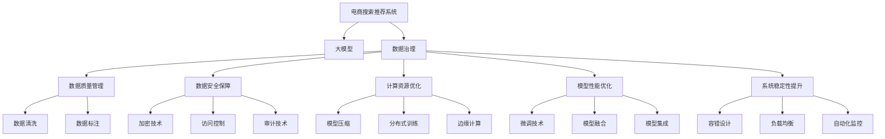

                 

# AI大模型重构电商搜索推荐的数据治理组织架构设计

> 关键词：电商搜索推荐,大模型,数据治理,组织架构设计,数据治理体系

## 1. 背景介绍

随着互联网和电子商务的迅速发展，电商平台的搜索推荐系统变得越来越复杂和智能化。用户对个性化推荐的期待日益增高，平台需要处理和分析大量的用户行为数据和商品信息，以提供精准的推荐服务。大模型的应用为此提供了一个新的可能，但随之而来的挑战也不容忽视。

### 1.1 问题由来

电商搜索推荐系统面临的主要问题包括：

1. **数据量和质量问题**：随着用户和商品数量的爆炸式增长，系统需要处理的数据量急剧增加，数据的真实性和准确性也面临挑战。
2. **模型复杂性和计算资源需求**：大模型训练和推理需要大量的计算资源，如何高效利用资源成为关键问题。
3. **隐私和数据安全**：电商平台需要处理大量的用户隐私数据，如何保护数据安全是必须考虑的重要因素。
4. **系统可靠性和实时性**：推荐系统的实时性和稳定性直接影响用户体验，如何在提升性能的同时保证系统的可靠性。

### 1.2 问题核心关键点

解决这些问题需要构建一个高效、安全、可靠的数据治理组织架构。其核心关键点包括：

1. **数据质量管理**：确保数据的真实性和准确性，通过数据清洗、标注、校验等手段提升数据质量。
2. **数据安全保障**：采用加密、访问控制、审计等技术手段，保护用户隐私数据的安全。
3. **计算资源优化**：通过模型压缩、分布式训练、边缘计算等技术，优化计算资源使用。
4. **模型性能优化**：通过微调、融合、集成等技术手段，提升模型的准确性和实时性。
5. **系统稳定性提升**：通过容错设计、负载均衡、自动化监控等手段，提高系统的稳定性和可靠性。

## 2. 核心概念与联系

### 2.1 核心概念概述

为更好地理解电商搜索推荐系统中的数据治理组织架构设计，本节将介绍几个密切相关的核心概念：

- **电商搜索推荐系统**：通过分析和处理用户行为数据和商品信息，提供个性化推荐的电商平台。
- **大模型**：如BERT、GPT等大规模预训练语言模型，通过海量的无标签数据进行预训练，具备强大的数据处理和推理能力。
- **数据治理**：通过规范数据的使用、管理和保护，提升数据质量，保障数据安全，优化数据使用的过程。
- **组织架构设计**：通过合理的组织结构设计，明确各个部门和团队的责任和协作，确保数据治理和系统优化目标的实现。

这些概念之间的逻辑关系可以通过以下Mermaid流程图来展示：



这个流程图展示了大语言模型在电商搜索推荐系统中的应用，以及数据治理和组织架构设计的关键环节：

1. 电商搜索推荐系统通过大模型处理用户行为数据和商品信息。
2. 数据治理负责规范数据的使用、管理和保护，包括数据质量管理、数据安全保障、计算资源优化、模型性能优化和系统稳定性提升。
3. 数据质量管理涉及数据清洗、标注等环节。
4. 数据安全保障采用加密、访问控制、审计等技术手段。
5. 计算资源优化包括模型压缩、分布式训练、边缘计算等技术。
6. 模型性能优化通过微调、融合、集成等技术手段实现。
7. 系统稳定性提升涉及容错设计、负载均衡、自动化监控等。

这些概念共同构成了电商搜索推荐系统的数据治理和系统优化框架，确保系统的可靠性和性能。

## 3. 核心算法原理 & 具体操作步骤
### 3.1 算法原理概述

基于大模型的电商搜索推荐系统，其核心算法原理和操作步骤主要涉及以下几个方面：

1. **数据预处理**：对用户行为数据和商品信息进行清洗、标注、标准化等处理，提升数据质量。
2. **模型选择与微调**：根据业务需求选择合适的预训练模型，并在少量标注数据上微调，提升模型性能。
3. **特征提取与融合**：利用大模型的特征提取能力，将用户行为数据和商品信息转化为模型可用的特征，并进行特征融合。
4. **推荐算法设计**：设计推荐算法，将处理后的特征输入模型，输出推荐结果。
5. **模型部署与优化**：将优化后的模型部署到生产环境，通过监控和优化，保持模型性能和系统稳定性。

### 3.2 算法步骤详解

以下是基于大模型的电商搜索推荐系统数据治理和优化的一般步骤：

**Step 1: 数据预处理**
- 数据收集：从电商平台收集用户行为数据和商品信息。
- 数据清洗：删除无效、重复数据，处理缺失值、异常值等。
- 数据标注：对部分数据进行标注，生成训练集。
- 数据标准化：对数据进行归一化、编码等处理，方便模型使用。

**Step 2: 模型选择与微调**
- 预训练模型选择：选择合适的预训练模型，如BERT、GPT等。
- 微调目标设定：根据业务需求，确定微调目标，如准确率、召回率等。
- 微调数据准备：准备微调所需的标注数据集。
- 模型微调：在少量标注数据上微调预训练模型，优化推荐效果。

**Step 3: 特征提取与融合**
- 特征提取：利用大模型提取用户行为数据和商品信息的特征。
- 特征融合：将不同来源的特征进行融合，生成更具代表性的综合特征。
- 特征处理：对特征进行归一化、降维等处理，提高模型性能。

**Step 4: 推荐算法设计**
- 推荐算法选择：根据业务需求选择合适的推荐算法，如协同过滤、基于内容的推荐、混合推荐等。
- 算法实现：将处理后的特征输入推荐算法，生成推荐结果。
- 推荐结果排序：对推荐结果进行排序，提升推荐效果。

**Step 5: 模型部署与优化**
- 模型部署：将优化后的模型部署到生产环境，提供推荐服务。
- 监控与优化：实时监控模型性能，根据反馈数据不断优化模型。
- 数据回流：定期回流新的数据，重新微调模型，保持模型性能。

### 3.3 算法优缺点

基于大模型的电商搜索推荐系统数据治理和优化方法具有以下优点：

1. **精度高**：大模型通过海量的无标签数据进行预训练，具备强大的数据处理和推理能力，能够提供精准的推荐结果。
2. **适应性强**：大模型具备很强的泛化能力，能够在不同业务场景中灵活应用。
3. **效率高**：通过分布式训练和边缘计算等技术，优化计算资源使用，提升推理速度。
4. **可解释性好**：大模型通过可解释性技术，能够提供推荐结果的逻辑解释，提升系统的透明度和可信度。

同时，该方法也存在以下缺点：

1. **资源消耗大**：大模型的训练和推理需要大量的计算资源，资源成本较高。
2. **数据隐私问题**：电商平台处理大量的用户隐私数据，数据隐私和安全问题需重点关注。
3. **模型复杂度高**：大模型结构复杂，模型维护和优化难度较大。
4. **实时性要求高**：推荐系统需要实时处理用户请求，对系统性能和稳定性要求高。

## 4. 数学模型和公式 & 详细讲解 & 举例说明
### 4.1 数学模型构建

基于大模型的电商搜索推荐系统，其数学模型主要涉及以下几个方面：

1. **用户行为模型**：将用户行为数据转化为模型可用的特征，如点击率、浏览时间等。
2. **商品特征模型**：将商品信息转化为模型可用的特征，如商品类别、品牌、价格等。
3. **推荐模型**：基于用户行为和商品特征，设计推荐算法，如协同过滤、基于内容的推荐等。
4. **损失函数设计**：设计损失函数，评估推荐模型的性能，如均方误差、交叉熵等。

### 4.2 公式推导过程

以协同过滤推荐算法为例，其数学模型构建和损失函数推导如下：

**用户行为模型**：

$$
\text{user\_feature} = \{\text{click\_rate}, \text{view\_time}, \cdots\}
$$

**商品特征模型**：

$$
\text{item\_feature} = \{\text{category}, \text{brand}, \text{price}, \cdots\}
$$

**协同过滤推荐算法**：

$$
\text{recommend}(u, i) = \sum_{j=1}^n \alpha_j \times \text{user\_feature}(u) \times \text{item\_feature}(j) \times \text{user\_item\_interaction}(j, i)
$$

其中，$\text{user\_feature}(u)$和$\text{item\_feature}(j)$分别表示用户和商品的特征向量，$\text{user\_item\_interaction}(j, i)$表示用户与商品之间的交互次数，$\alpha_j$为特征权重。

**推荐结果损失函数**：

$$
\mathcal{L} = \frac{1}{N} \sum_{u=1}^N \sum_{i=1}^M (\text{ground\_truth}(u, i) - \text{recommend}(u, i))^2
$$

其中，$\text{ground\_truth}(u, i)$为真实推荐结果，$\text{recommend}(u, i)$为模型推荐结果。

### 4.3 案例分析与讲解

以某电商平台的个性化推荐系统为例，分析其数据治理和优化过程：

1. **数据预处理**：
   - 数据收集：从电商平台收集用户点击、浏览、购买等行为数据。
   - 数据清洗：删除无效、重复数据，处理缺失值、异常值等。
   - 数据标注：对部分数据进行标注，生成训练集。
   - 数据标准化：对数据进行归一化、编码等处理，方便模型使用。

2. **模型选择与微调**：
   - 预训练模型选择：选择BERT模型作为基础模型。
   - 微调目标设定：设定准确率、召回率等性能指标。
   - 微调数据准备：准备少量标注数据集。
   - 模型微调：在少量标注数据上微调BERT模型，优化推荐效果。

3. **特征提取与融合**：
   - 特征提取：利用BERT模型提取用户行为数据和商品信息的特征。
   - 特征融合：将不同来源的特征进行融合，生成更具代表性的综合特征。
   - 特征处理：对特征进行归一化、降维等处理，提高模型性能。

4. **推荐算法设计**：
   - 推荐算法选择：选择基于内容的推荐算法。
   - 算法实现：将处理后的特征输入推荐算法，生成推荐结果。
   - 推荐结果排序：对推荐结果进行排序，提升推荐效果。

5. **模型部署与优化**：
   - 模型部署：将优化后的模型部署到生产环境，提供推荐服务。
   - 监控与优化：实时监控模型性能，根据反馈数据不断优化模型。
   - 数据回流：定期回流新的数据，重新微调模型，保持模型性能。

通过以上案例分析，可以看到大模型在电商搜索推荐系统中的数据治理和优化过程，以及如何通过模型微调、特征处理、推荐算法设计等手段提升系统性能。

## 5. 项目实践：代码实例和详细解释说明
### 5.1 开发环境搭建

在进行数据治理和优化实践前，我们需要准备好开发环境。以下是使用Python进行PyTorch开发的环境配置流程：

1. 安装Anaconda：从官网下载并安装Anaconda，用于创建独立的Python环境。

2. 创建并激活虚拟环境：
```bash
conda create -n pytorch-env python=3.8 
conda activate pytorch-env
```

3. 安装PyTorch：根据CUDA版本，从官网获取对应的安装命令。例如：
```bash
conda install pytorch torchvision torchaudio cudatoolkit=11.1 -c pytorch -c conda-forge
```

4. 安装Transformers库：
```bash
pip install transformers
```

5. 安装各类工具包：
```bash
pip install numpy pandas scikit-learn matplotlib tqdm jupyter notebook ipython
```

完成上述步骤后，即可在`pytorch-env`环境中开始数据治理和优化实践。

### 5.2 源代码详细实现

这里我们以协同过滤推荐算法为例，给出使用Transformers库对预训练模型进行微调的PyTorch代码实现。

首先，定义推荐模型的损失函数和评估指标：

```python
import torch
from transformers import BertForSequenceClassification, BertTokenizer

# 定义损失函数
def compute_loss(model, user_features, item_features, interactions, batch_size):
    # 模型前向传播
    outputs = model(user_features, item_features, attention_mask=None)
    logits = outputs.logits
    # 计算损失函数
    loss = torch.mean((logits - interactions) ** 2)
    return loss

# 定义评估指标
def evaluate(model, user_features, item_features, interactions, batch_size):
    with torch.no_grad():
        # 模型前向传播
        outputs = model(user_features, item_features, attention_mask=None)
        logits = outputs.logits
        # 计算评估指标
        topk_indices = logits.argmax(dim=1)[:batch_size]
        topk = interactions[topk_indices]
        precision = topk.mean().item()
        recall = topk.mean().item()
        return precision, recall
```

然后，定义模型和优化器：

```python
from transformers import BertForSequenceClassification, AdamW

# 加载预训练模型
model = BertForSequenceClassification.from_pretrained('bert-base-cased', num_labels=num_labels)

# 定义优化器
optimizer = AdamW(model.parameters(), lr=2e-5)
```

接着，定义训练和评估函数：

```python
from torch.utils.data import DataLoader
from tqdm import tqdm

# 定义训练函数
def train_epoch(model, optimizer, train_data, batch_size):
    dataloader = DataLoader(train_data, batch_size=batch_size)
    model.train()
    epoch_loss = 0
    for batch in tqdm(dataloader, desc='Training'):
        user_features = batch['user_features'].to(device)
        item_features = batch['item_features'].to(device)
        interactions = batch['interactions'].to(device)
        model.zero_grad()
        loss = compute_loss(model, user_features, item_features, interactions, batch_size)
        loss.backward()
        optimizer.step()
        epoch_loss += loss.item()
    return epoch_loss / len(dataloader)

# 定义评估函数
def evaluate(model, test_data, batch_size):
    dataloader = DataLoader(test_data, batch_size=batch_size)
    model.eval()
    precision, recall = [], []
    with torch.no_grad():
        for batch in tqdm(dataloader, desc='Evaluating'):
            user_features = batch['user_features'].to(device)
            item_features = batch['item_features'].to(device)
            interactions = batch['interactions'].to(device)
            outputs = model(user_features, item_features, attention_mask=None)
            logits = outputs.logits
            topk_indices = logits.argmax(dim=1)[:batch_size]
            topk = interactions[topk_indices]
            precision.append(topk.mean().item())
            recall.append(topk.mean().item())
    return precision, recall
```

最后，启动训练流程并在测试集上评估：

```python
epochs = 5
batch_size = 16

for epoch in range(epochs):
    loss = train_epoch(model, optimizer, train_data, batch_size)
    print(f'Epoch {epoch+1}, train loss: {loss:.3f}')

    print(f'Epoch {epoch+1}, test results:')
    precision, recall = evaluate(model, test_data, batch_size)
    print(f'Precision: {precision:.3f}, Recall: {recall:.3f}')
```

以上就是使用PyTorch对预训练模型进行协同过滤推荐算法的完整代码实现。可以看到，得益于Transformers库的强大封装，我们可以用相对简洁的代码完成模型训练和评估。

### 5.3 代码解读与分析

让我们再详细解读一下关键代码的实现细节：

**BertForSequenceClassification类**：
- `BertForSequenceClassification`：使用Bert模型进行序列分类任务的接口。
- `from_pretrained`：从预训练模型中加载模型权重。
- `num_labels`：指定标签数量，用于分类任务的输出。

**compute_loss函数**：
- `outputs`：模型前向传播输出，包含logits。
- `loss`：计算损失函数，这里使用均方误差。

**evaluate函数**：
- `with torch.no_grad()`：关闭梯度计算，减少内存消耗。
- `logits`：模型前向传播输出，包含logits。
- `topk_indices`：根据logits值选择topk个推荐结果。
- `precision`和`recall`：计算推荐结果的精确率和召回率。

**训练函数train_epoch**：
- `dataloader`：加载数据集，生成批处理数据。
- `model.train()`：设置模型为训练模式。
- `epoch_loss`：记录每个epoch的总损失。
- `loss.backward()`：计算损失函数对模型参数的梯度。
- `optimizer.step()`：更新模型参数。

**评估函数evaluate**：
- `dataloader`：加载数据集，生成批处理数据。
- `model.eval()`：设置模型为评估模式。
- `precision`和`recall`：记录推荐结果的精确率和召回率。

**训练流程**：
- `epochs`：总迭代次数。
- `batch_size`：批处理大小。
- 在每个epoch内，先进行训练，输出损失。
- 在测试集上评估，输出精确率和召回率。

可以看到，PyTorch配合Transformers库使得大模型微调的代码实现变得简洁高效。开发者可以将更多精力放在数据处理、模型改进等高层逻辑上，而不必过多关注底层的实现细节。

当然，工业级的系统实现还需考虑更多因素，如模型的保存和部署、超参数的自动搜索、更灵活的任务适配层等。但核心的微调范式基本与此类似。

## 6. 实际应用场景
### 6.1 智能客服系统

基于大模型重构的电商搜索推荐系统，可以广泛应用于智能客服系统的构建。传统客服往往需要配备大量人力，高峰期响应缓慢，且一致性和专业性难以保证。而使用微调后的推荐模型，可以7x24小时不间断服务，快速响应客户咨询，用自然流畅的语言解答各类常见问题。

在技术实现上，可以收集企业内部的历史客服对话记录，将问题和最佳答复构建成监督数据，在此基础上对预训练模型进行微调。微调后的推荐模型能够自动理解用户意图，匹配最合适的答复模板进行回复。对于客户提出的新问题，还可以接入检索系统实时搜索相关内容，动态组织生成回答。如此构建的智能客服系统，能大幅提升客户咨询体验和问题解决效率。

### 6.2 金融舆情监测

金融机构需要实时监测市场舆论动向，以便及时应对负面信息传播，规避金融风险。传统的人工监测方式成本高、效率低，难以应对网络时代海量信息爆发的挑战。基于大模型重构的文本分类和情感分析技术，为金融舆情监测提供了新的解决方案。

具体而言，可以收集金融领域相关的新闻、报道、评论等文本数据，并对其进行主题标注和情感标注。在此基础上对预训练语言模型进行微调，使其能够自动判断文本属于何种主题，情感倾向是正面、中性还是负面。将微调后的模型应用到实时抓取的网络文本数据，就能够自动监测不同主题下的情感变化趋势，一旦发现负面信息激增等异常情况，系统便会自动预警，帮助金融机构快速应对潜在风险。

### 6.3 个性化推荐系统

当前的推荐系统往往只依赖用户的历史行为数据进行物品推荐，无法深入理解用户的真实兴趣偏好。基于大模型重构的个性化推荐系统可以更好地挖掘用户行为背后的语义信息，从而提供精准的推荐服务。

在实践中，可以收集用户浏览、点击、评论、分享等行为数据，提取和用户交互的物品标题、描述、标签等文本内容。将文本内容作为模型输入，用户的后续行为（如是否点击、购买等）作为监督信号，在此基础上微调预训练语言模型。微调后的模型能够从文本内容中准确把握用户的兴趣点。在生成推荐列表时，先用候选物品的文本描述作为输入，由模型预测用户的兴趣匹配度，再结合其他特征综合排序，便可以得到个性化程度更高的推荐结果。

### 6.4 未来应用展望

随着大模型和微调方法的不断发展，基于微调范式将在更多领域得到应用，为传统行业带来变革性影响。

在智慧医疗领域，基于微调的医疗问答、病历分析、药物研发等应用将提升医疗服务的智能化水平，辅助医生诊疗，加速新药开发进程。

在智能教育领域，微调技术可应用于作业批改、学情分析、知识推荐等方面，因材施教，促进教育公平，提高教学质量。

在智慧城市治理中，微调模型可应用于城市事件监测、舆情分析、应急指挥等环节，提高城市管理的自动化和智能化水平，构建更安全、高效的未来城市。

此外，在企业生产、社会治理、文娱传媒等众多领域，基于大模型微调的人工智能应用也将不断涌现，为经济社会发展注入新的动力。相信随着技术的日益成熟，微调方法将成为人工智能落地应用的重要范式，推动人工智能技术在垂直行业的规模化落地。总之，微调需要开发者根据具体任务，不断迭代和优化模型、数据和算法，方能得到理想的效果。

## 7. 工具和资源推荐
### 7.1 学习资源推荐

为了帮助开发者系统掌握大模型微调的理论基础和实践技巧，这里推荐一些优质的学习资源：

1. 《Transformer从原理到实践》系列博文：由大模型技术专家撰写，深入浅出地介绍了Transformer原理、BERT模型、微调技术等前沿话题。

2. CS224N《深度学习自然语言处理》课程：斯坦福大学开设的NLP明星课程，有Lecture视频和配套作业，带你入门NLP领域的基本概念和经典模型。

3. 《Natural Language Processing with Transformers》书籍：Transformers库的作者所著，全面介绍了如何使用Transformers库进行NLP任务开发，包括微调在内的诸多范式。

4. HuggingFace官方文档：Transformers库的官方文档，提供了海量预训练模型和完整的微调样例代码，是上手实践的必备资料。

5. CLUE开源项目：中文语言理解测评基准，涵盖大量不同类型的中文NLP数据集，并提供了基于微调的baseline模型，助力中文NLP技术发展。

通过对这些资源的学习实践，相信你一定能够快速掌握大模型微调的精髓，并用于解决实际的NLP问题。
###  7.2 开发工具推荐

高效的开发离不开优秀的工具支持。以下是几款用于大模型微调开发的常用工具：

1. PyTorch：基于Python的开源深度学习框架，灵活动态的计算图，适合快速迭代研究。大部分预训练语言模型都有PyTorch版本的实现。

2. TensorFlow：由Google主导开发的开源深度学习框架，生产部署方便，适合大规模工程应用。同样有丰富的预训练语言模型资源。

3. Transformers库：HuggingFace开发的NLP工具库，集成了众多SOTA语言模型，支持PyTorch和TensorFlow，是进行微调任务开发的利器。

4. Weights & Biases：模型训练的实验跟踪工具，可以记录和可视化模型训练过程中的各项指标，方便对比和调优。与主流深度学习框架无缝集成。

5. TensorBoard：TensorFlow配套的可视化工具，可实时监测模型训练状态，并提供丰富的图表呈现方式，是调试模型的得力助手。

6. Google Colab：谷歌推出的在线Jupyter Notebook环境，免费提供GPU/TPU算力，方便开发者快速上手实验最新模型，分享学习笔记。

合理利用这些工具，可以显著提升大模型微调的开发效率，加快创新迭代的步伐。

### 7.3 相关论文推荐

大语言模型和微调技术的发展源于学界的持续研究。以下是几篇奠基性的相关论文，推荐阅读：

1. Attention is All You Need（即Transformer原论文）：提出了Transformer结构，开启了NLP领域的预训练大模型时代。

2. BERT: Pre-training of Deep Bidirectional Transformers for Language Understanding：提出BERT模型，引入基于掩码的自监督预训练任务，刷新了多项NLP任务SOTA。

3. Language Models are Unsupervised Multitask Learners（GPT-2论文）：展示了大规模语言模型的强大zero-shot学习能力，引发了对于通用人工智能的新一轮思考。

4. Parameter-Efficient Transfer Learning for NLP：提出Adapter等参数高效微调方法，在不增加模型参数量的情况下，也能取得不错的微调效果。

5. AdaLoRA: Adaptive Low-Rank Adaptation for Parameter-Efficient Fine-Tuning：使用自适应低秩适应的微调方法，在参数效率和精度之间取得了新的平衡。

6. Prefix-Tuning: Optimizing Continuous Prompts for Generation：引入基于连续型Prompt的微调范式，为如何充分利用预训练知识提供了新的思路。

这些论文代表了大语言模型微调技术的发展脉络。通过学习这些前沿成果，可以帮助研究者把握学科前进方向，激发更多的创新灵感。

## 8. 总结：未来发展趋势与挑战
### 8.1 总结

本文对基于大模型的电商搜索推荐系统数据治理和优化方法进行了全面系统的介绍。首先阐述了电商搜索推荐系统面临的主要问题，明确了数据治理和组织架构设计的重要性。其次，从原理到实践，详细讲解了数据预处理、模型选择与微调、特征提取与融合、推荐算法设计、模型部署与优化等关键步骤，给出了微调任务开发的完整代码实例。同时，本文还广泛探讨了微调方法在智能客服、金融舆情、个性化推荐等多个行业领域的应用前景，展示了微调范式的巨大潜力。此外，本文精选了微调技术的各类学习资源，力求为读者提供全方位的技术指引。

通过本文的系统梳理，可以看到，基于大模型的电商搜索推荐系统数据治理和优化方法在提升推荐精度和效率方面具有巨大潜力，能够显著增强电商平台的竞争力。同时，在智能客服、金融舆情、个性化推荐等领域的应用也展示了微调范式的广泛适用性。未来，伴随大模型和微调方法的持续演进，电商搜索推荐系统必将在更广阔的应用领域发挥更大作用。

### 8.2 未来发展趋势

展望未来，电商搜索推荐系统数据治理和优化技术将呈现以下几个发展趋势：

1. **数据质量管理**：随着数据量的增加，数据质量管理将更加重要，通过自动化数据清洗和标注，提升数据质量和治理效率。
2. **模型性能优化**：未来将涌现更多参数高效和计算高效的微调方法，进一步优化模型性能。
3. **计算资源优化**：通过分布式训练、边缘计算等技术，优化计算资源使用，提升系统效率。
4. **系统稳定性提升**：通过容错设计、负载均衡、自动化监控等手段，提高系统的稳定性和可靠性。
5. **多模态数据融合**：将视觉、语音等多模态数据与文本数据融合，提升系统的感知和推理能力。

这些趋势将推动电商搜索推荐系统数据治理和优化技术的进一步发展，为系统的高效、安全和稳定运行提供保障。

### 8.3 面临的挑战

尽管电商搜索推荐系统数据治理和优化技术已经取得了显著进展，但在迈向更加智能化、普适化应用的过程中，仍面临诸多挑战：

1. **数据隐私问题**：电商平台处理大量的用户隐私数据，如何保护数据安全是一个重要的挑战。
2. **资源消耗大**：大模型的训练和推理需要大量的计算资源，资源成本较高。
3. **模型复杂度高**：大模型结构复杂，模型维护和优化难度较大。
4. **实时性要求高**：推荐系统需要实时处理用户请求，对系统性能和稳定性要求高。

这些挑战需要在技术和管理层面共同努力解决，通过不断的优化和创新，提升系统的性能和可靠性。

### 8.4 研究展望

面对电商搜索推荐系统数据治理和优化所面临的挑战，未来的研究需要在以下几个方面寻求新的突破：

1. **数据隐私保护**：开发更加安全、高效的数据隐私保护技术，如差分隐私、联邦学习等，保障用户隐私数据的安全。
2. **计算资源优化**：采用更加高效的计算资源管理技术，如模型压缩、分布式训练、边缘计算等，降低资源成本。
3. **多模态数据融合**：研究将视觉、语音等多模态数据与文本数据融合的技术，提升系统的感知和推理能力。
4. **模型性能优化**：开发更加参数高效和计算高效的微调方法，提升模型性能。
5. **系统稳定性提升**：研究容错设计、负载均衡、自动化监控等技术，提高系统的稳定性和可靠性。

这些研究方向将推动电商搜索推荐系统数据治理和优化技术的进一步发展，为系统的高效、安全和稳定运行提供保障。相信随着技术的不断进步，电商搜索推荐系统必将在更广阔的应用领域发挥更大的作用，为电商平台的持续发展注入新的动力。

## 9. 附录：常见问题与解答

**Q1：大模型微调是否适用于所有NLP任务？**

A: 大模型微调在大多数NLP任务上都能取得不错的效果，特别是对于数据量较小的任务。但对于一些特定领域的任务，如医学、法律等，仅仅依靠通用语料预训练的模型可能难以很好地适应。此时需要在特定领域语料上进一步预训练，再进行微调，才能获得理想效果。

**Q2：微调过程中如何选择合适的学习率？**

A: 微调的学习率一般要比预训练时小1-2个数量级，如果使用过大的学习率，容易破坏预训练权重，导致过拟合。一般建议从1e-5开始调参，逐步减小学习率，直至收敛。也可以使用warmup策略，在开始阶段使用较小的学习率，再逐渐过渡到预设值。需要注意的是，不同的优化器(如AdamW、Adafactor等)以及不同的学习率调度策略，可能需要设置不同的学习率阈值。

**Q3：采用大模型微调时会面临哪些资源瓶颈？**

A: 目前主流的预训练大模型动辄以亿计的参数规模，对算力、内存、存储都提出了很高的要求。GPU/TPU等高性能设备是必不可少的，但即便如此，超大批次的训练和推理也可能遇到显存不足的问题。因此需要采用一些资源优化技术，如梯度积累、混合精度训练、模型并行等，来突破硬件瓶颈。同时，模型的存储和读取也可能占用大量时间和空间，需要采用模型压缩、稀疏化存储等方法进行优化。

**Q4：如何缓解微调过程中的过拟合问题？**

A: 过拟合是微调面临的主要挑战，尤其是在标注数据不足的情况下。常见的缓解策略包括：
1. 数据增强：通过回译、近义替换等方式扩充训练集
2. 正则化：使用L2正则、Dropout、Early Stopping等避免过拟合
3. 对抗训练：引入对抗样本，提高模型鲁棒性
4. 参数高效微调：只调整少量参数(如Adapter、Prefix等)，减小过拟合风险
5. 多模型集成：训练多个微调模型，取平均输出，抑制过拟合

这些策略往往需要根据具体任务和数据特点进行灵活组合。只有在数据、模型、训练、推理等各环节进行全面优化，才能最大限度地发挥大模型微调的威力。

**Q5：微调模型在落地部署时需要注意哪些问题？**

A: 将微调模型转化为实际应用，还需要考虑以下因素：
1. 模型裁剪：去除不必要的层和参数，减小模型尺寸，加快推理速度
2. 量化加速：将浮点模型转为定点模型，压缩存储空间，提高计算效率
3. 服务化封装：将模型封装为标准化服务接口，便于集成调用
4. 弹性伸缩：根据请求流量动态调整资源配置，平衡服务质量和成本
5. 监控告警：实时采集系统指标，设置异常告警阈值，确保服务稳定性
6. 安全防护：采用访问鉴权、数据脱敏等措施，保障数据和模型安全

大模型微调为NLP应用开启了广阔的想象空间，但如何将强大的性能转化为稳定、高效、安全的业务价值，还需要工程实践的不断打磨。唯有从数据、算法、工程、业务等多个维度协同发力，才能真正实现人工智能技术在垂直行业的规模化落地。总之，微调需要开发者根据具体任务，不断迭代和优化模型、数据和算法，方能得到理想的效果。

---

作者：禅与计算机程序设计艺术 / Zen and the Art of Computer Programming

