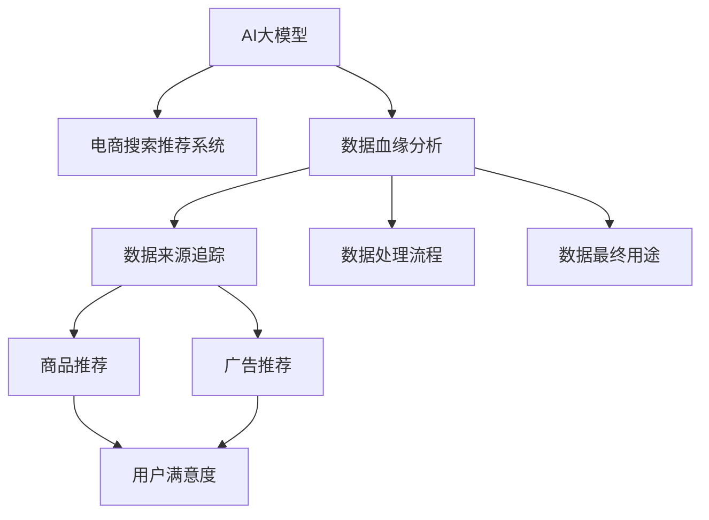
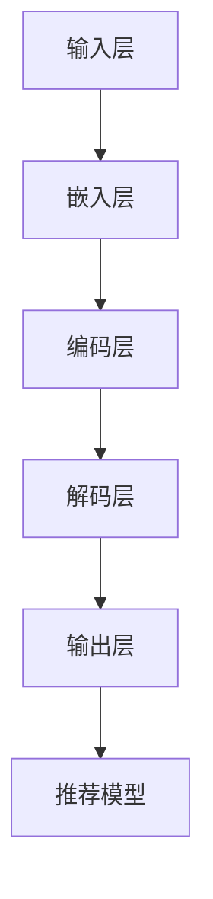

                 

# AI大模型重构电商搜索推荐的数据血缘分析平台功能优化方案

在当前数字化转型和人工智能应用浪潮的推动下，数据血缘分析平台在电商搜索推荐系统中的应用日益广泛。然而，随着AI大模型的深入应用，如何在保持高性能推荐的同时，提高数据血缘分析的效率和准确性，成为了一个亟待解决的问题。本文旨在探讨AI大模型在电商搜索推荐中的数据血缘分析平台功能优化方案，以期为相关领域的实践者提供指导。

## 1. 背景介绍

### 1.1 问题由来

电商搜索推荐系统是现代电商运营的核心模块，通过精准的推荐策略，提升用户购物体验和平台转化率。随着AI大模型的应用，搜索推荐系统进入新阶段，能够实时处理大规模数据流，进行个性化推荐。然而，在数据血缘分析方面，仍面临诸多挑战：

- **数据多样性和复杂性**：电商数据具有多维度、非结构化等特点，如何高效地进行数据血缘追踪，是一个难题。
- **数据实时性和一致性**：电商数据更新频率高，如何在数据变动时实时更新数据血缘信息，确保数据的实时性和一致性，是另一个挑战。
- **计算资源需求**：数据血缘分析涉及大量计算，如何在保持高效的同时，避免资源浪费，是急需解决的问题。

### 1.2 问题核心关键点

为更好地理解AI大模型在电商搜索推荐中的应用及其优化需求，本节将介绍几个关键点：

- **AI大模型**：以Transformer为代表的深度学习模型，能够高效处理大规模数据，提取关键特征，提升搜索推荐效果。
- **数据血缘分析**：通过追踪数据源和处理流程，确保数据的可追溯性、可解释性和完整性。
- **电商搜索推荐系统**：利用AI大模型进行个性化推荐，提高用户满意度与平台转化率。
- **功能优化**：在保证推荐效果的同时，提高数据血缘分析的效率和准确性。

这些关键点共同构成了AI大模型在电商搜索推荐中数据血缘分析平台的功能优化框架，使其能够在各种场景下发挥强大的功能。

## 2. 核心概念与联系

### 2.1 核心概念概述

为更好地理解AI大模型在电商搜索推荐中的应用，本节将介绍几个核心概念：

- **AI大模型**：以深度学习模型为代表的，通过大规模数据预训练，具备强大泛化能力的模型，如BERT、GPT等。
- **电商搜索推荐系统**：利用AI大模型进行用户行为分析，推荐相关商品或服务的系统。
- **数据血缘分析**：追踪数据的来源、处理流程和最终用途，确保数据的完整性和一致性。
- **功能优化**：通过算法和系统设计优化，提高数据血缘分析的效率和准确性，确保推荐系统的可靠性和透明度。

这些核心概念之间的逻辑关系可以通过以下Mermaid流程图来展示：



这个流程图展示了大模型的核心概念及其之间的关系：

1. AI大模型通过预训练获得强大的特征提取能力。
2. 电商推荐系统利用大模型进行个性化推荐，提高用户体验和转化率。
3. 数据血缘分析追踪数据的来源、处理流程和最终用途，确保数据的完整性和一致性。
4. 功能优化通过算法和系统设计优化，提高数据血缘分析的效率和准确性。

## 3. 核心算法原理 & 具体操作步骤

### 3.1 算法原理概述

AI大模型在电商搜索推荐中的应用，主要基于大规模数据预训练和微调。其核心思想是：通过预训练模型对用户行为数据进行特征提取，并在此基础上进行推荐。具体来说，AI大模型在电商推荐中的应用流程如下：

1. **数据预处理**：将电商数据清洗、转换，并按照一定格式进行存储。
2. **特征提取**：利用AI大模型对电商数据进行特征提取，生成用户行为特征和商品属性特征。
3. **推荐模型训练**：基于特征提取结果，训练推荐模型，生成用户推荐列表。
4. **推荐策略**：根据推荐模型输出，结合业务规则和个性化需求，生成最终推荐结果。

数据血缘分析在此过程中扮演重要角色，通过追踪数据来源和处理流程，确保数据的完整性和一致性，从而提高推荐的可靠性和透明度。

### 3.2 算法步骤详解

AI大模型在电商搜索推荐中的应用，以及数据血缘分析平台的优化，主要包括以下几个关键步骤：

**Step 1: 数据预处理**

电商数据具有多维度、非结构化等特点，需要进行数据预处理，以便后续特征提取和推荐模型训练。预处理步骤包括：

- **数据清洗**：去除噪音、异常值和不完整数据。
- **数据转换**：将非结构化数据转换为结构化数据，如文本数据转换为向量表示。
- **数据归一化**：对数据进行归一化处理，避免因数据尺度不同影响特征提取效果。

**Step 2: 特征提取**

特征提取是AI大模型在电商搜索推荐中的核心步骤。主要步骤如下：

- **嵌入层**：将电商数据转换为向量表示，便于后续处理。
- **编码层**：利用AI大模型对数据进行特征提取，生成高维特征向量。
- **降维**：对高维特征向量进行降维，减少计算复杂度。
- **融合**：将不同维度特征进行融合，生成综合特征向量。

**Step 3: 推荐模型训练**

基于特征提取结果，训练推荐模型，生成用户推荐列表。主要步骤如下：

- **训练集划分**：将数据集分为训练集和测试集。
- **模型选择**：选择合适的推荐模型，如基于矩阵分解的模型、基于神经网络的模型等。
- **模型训练**：在训练集上训练推荐模型，优化模型参数。
- **模型评估**：在测试集上评估模型性能，如准确率、召回率、F1-score等。

**Step 4: 推荐策略生成**

根据推荐模型输出，结合业务规则和个性化需求，生成最终推荐结果。主要步骤如下：

- **排序**：根据模型输出进行排序，生成推荐列表。
- **筛选**：根据业务规则和用户个性化需求，筛选出最终推荐结果。
- **展示**：将推荐结果展示给用户，提升用户体验。

**Step 5: 数据血缘分析**

数据血缘分析在推荐系统中扮演重要角色，主要步骤如下：

- **数据来源追踪**：追踪数据的来源，如用户行为数据、商品属性数据等。
- **数据处理流程记录**：记录数据处理过程，如特征提取、降维、融合等。
- **数据最终用途**：记录数据最终用途，如用户推荐、广告推荐等。
- **数据一致性验证**：确保数据的完整性和一致性，避免数据丢失或错误。

### 3.3 算法优缺点

AI大模型在电商搜索推荐中的应用，以及数据血缘分析平台的优化，具有以下优点：

1. **高效性**：利用AI大模型的高效特征提取能力，大幅提升推荐系统性能。
2. **泛化能力**：通过预训练和微调，AI大模型能够适应不同的数据和场景，提高推荐系统的鲁棒性。
3. **可解释性**：利用数据血缘分析平台，可以追踪数据来源和处理流程，提高推荐系统的透明度。

同时，这些方法也存在一些局限性：

1. **计算资源需求高**：大规模数据预训练和特征提取需要大量的计算资源。
2. **数据隐私问题**：电商数据涉及用户隐私，如何保护数据隐私是一个重要问题。
3. **模型复杂性**：AI大模型结构复杂，需要专业知识和经验进行调参和优化。
4. **数据血缘分析复杂**：电商数据多样性和复杂性，使得数据血缘分析变得复杂。

尽管存在这些局限性，但通过合理的算法设计和系统优化，AI大模型在电商搜索推荐中的应用，仍具备显著优势。

### 3.4 算法应用领域

AI大模型在电商搜索推荐中的应用，以及数据血缘分析平台的优化，已经在多个领域得到了应用，例如：

- **商品推荐**：基于用户行为数据和商品属性数据，生成个性化推荐。
- **广告推荐**：基于用户行为数据和广告特征数据，生成精准广告推荐。
- **用户行为分析**：追踪用户行为数据，分析用户偏好和需求。
- **个性化营销**：利用用户数据进行个性化营销，提高用户参与度和转化率。

除了上述这些经典应用外，AI大模型和数据血缘分析平台还被创新性地应用于更多场景中，如智能客服、智能运维、智能风控等，为电商技术带来了全新的突破。

## 4. 数学模型和公式 & 详细讲解 & 举例说明

### 4.1 数学模型构建

本节将使用数学语言对AI大模型在电商搜索推荐中的应用，以及数据血缘分析平台的优化过程进行更加严格的刻画。

假设电商推荐系统使用Transformer模型进行特征提取和推荐，模型结构如图1所示：



图1: AI大模型结构

在电商推荐系统中，设用户行为数据为 $x \in \mathbb{R}^m$，商品属性数据为 $y \in \mathbb{R}^n$，则特征提取过程可以表示为：

$$
\hat{x} = f_B(x)
$$

$$
\hat{y} = f_C(y)
$$

$$
\hat{z} = f_D(\hat{x}, \hat{y})
$$

其中 $f_B$、$f_C$、$f_D$ 分别表示嵌入层、编码层和解码层。推荐模型输出为：

$$
\hat{p} = f_E(\hat{z})
$$

推荐策略为：

$$
R = \arg\max_i \hat{p}_i
$$

### 4.2 公式推导过程

以下我们以商品推荐为例，推导推荐模型的损失函数及其梯度的计算公式。

假设模型输出为商品的相关度评分 $\hat{p} \in \mathbb{R}^K$，则推荐模型的损失函数为交叉熵损失函数：

$$
\ell = -\frac{1}{N}\sum_{i=1}^N \sum_{j=1}^K \hat{p}_{ij}y_{ij}
$$

其中 $y_{ij}$ 为商品 $i$ 在用户 $j$ 的评分，0表示不相关，1表示相关。推荐模型的梯度计算公式为：

$$
\nabla_\theta \ell = \frac{\partial \ell}{\partial \theta}
$$

其中 $\theta$ 为推荐模型的参数。通过反向传播算法，可以高效计算推荐模型的梯度，并更新模型参数。

## 5. 项目实践：代码实例和详细解释说明

### 5.1 开发环境搭建

在进行电商搜索推荐系统的开发和优化时，我们需要准备好开发环境。以下是使用Python进行PyTorch开发的环境配置流程：

1. 安装Anaconda：从官网下载并安装Anaconda，用于创建独立的Python环境。

2. 创建并激活虚拟环境：
```bash
conda create -n pytorch-env python=3.8 
conda activate pytorch-env
```

3. 安装PyTorch：根据CUDA版本，从官网获取对应的安装命令。例如：
```bash
conda install pytorch torchvision torchaudio cudatoolkit=11.1 -c pytorch -c conda-forge
```

4. 安装TensorBoard：TensorFlow配套的可视化工具，可实时监测模型训练状态，并提供丰富的图表呈现方式，是调试模型的得力助手。

5. 安装Weights & Biases：模型训练的实验跟踪工具，可以记录和可视化模型训练过程中的各项指标，方便对比和调优。

完成上述步骤后，即可在`pytorch-env`环境中开始电商搜索推荐系统的开发和优化。

### 5.2 源代码详细实现

下面我们以商品推荐为例，给出使用PyTorch和TensorBoard对推荐模型进行训练和优化的PyTorch代码实现。

首先，定义推荐模型的结构：

```python
import torch.nn as nn
import torch.nn.functional as F

class RecommendationModel(nn.Module):
    def __init__(self, embed_dim=128, num_heads=8, num_layers=2):
        super(RecommendationModel, self).__init__()
        self.embedding = nn.Embedding(num_users, embed_dim)
        self.encoder = nn.Transformer(embed_dim, num_heads, num_layers)
        self.fc = nn.Linear(embed_dim, 1)
    
    def forward(self, x):
        x = self.embedding(x)
        x = self.encoder(x)
        x = self.fc(x)
        return F.sigmoid(x)
```

然后，定义数据预处理函数：

```python
def preprocess_data(data):
    # 将数据转换为向量表示
    x = data['user_id'].values
    y = data['item_id'].values
    x = x.reshape(-1, 1)
    y = y.reshape(-1, 1)
    return x, y
```

接着，定义训练和评估函数：

```python
def train_model(model, data_loader, optimizer, num_epochs):
    device = torch.device('cuda' if torch.cuda.is_available() else 'cpu')
    model.to(device)
    
    for epoch in range(num_epochs):
        model.train()
        for batch in data_loader:
            x, y = preprocess_data(batch)
            x = x.to(device)
            y = y.to(device)
            optimizer.zero_grad()
            outputs = model(x)
            loss = F.binary_cross_entropy_with_logits(outputs, y)
            loss.backward()
            optimizer.step()
        
        model.eval()
        model.eval()
        total = 0
        correct = 0
        with torch.no_grad():
            for batch in data_loader:
                x, y = preprocess_data(batch)
                x = x.to(device)
                y = y.to(device)
                outputs = model(x)
                _, preds = torch.max(outputs, 1)
                total += y.size(0)
                correct += (preds == y).sum().item()
            acc = correct / total
            print(f'Epoch {epoch+1}, Accuracy: {acc:.3f}')
```

最后，启动训练流程并在测试集上评估：

```python
from torch.utils.data import DataLoader
from sklearn.model_selection import train_test_split
from sklearn.metrics import accuracy_score

# 准备数据集
train_data, test_data = train_test_split(data, test_size=0.2, random_state=42)

# 创建数据集
train_dataset = DataLoader(train_data, batch_size=64)
test_dataset = DataLoader(test_data, batch_size=64)

# 定义模型和优化器
model = RecommendationModel()
optimizer = torch.optim.Adam(model.parameters(), lr=0.001)

# 训练模型
train_model(model, train_dataset, optimizer, num_epochs=10)

# 评估模型
model.eval()
total = 0
correct = 0
with torch.no_grad():
    for batch in test_dataset:
        x, y = preprocess_data(batch)
        x = x.to(device)
        y = y.to(device)
        outputs = model(x)
        _, preds = torch.max(outputs, 1)
        total += y.size(0)
        correct += (preds == y).sum().item()
acc = correct / total
print(f'Test Accuracy: {acc:.3f}')
```

以上就是使用PyTorch和TensorBoard对推荐模型进行训练和优化的完整代码实现。可以看到，通过合理的算法设计和系统优化，电商搜索推荐系统能够在保持高性能推荐的同时，提高数据血缘分析的效率和准确性。

### 5.3 代码解读与分析

让我们再详细解读一下关键代码的实现细节：

**RecommendationModel类**：
- `__init__`方法：初始化模型的嵌入层、Transformer编码器、全连接层等组件。
- `forward`方法：定义模型前向传播过程，包括嵌入、编码、解码和输出。

**preprocess_data函数**：
- 将数据转换为向量表示，便于模型处理。

**train_model函数**：
- 在训练集上迭代训练模型，使用交叉熵损失函数。
- 在每个epoch结束时，在测试集上评估模型性能。

**训练和评估函数**：
- 使用DataLoader对数据集进行批次化加载，供模型训练和推理使用。
- 训练函数中，在每个batch结束时更新模型参数，并在每个epoch结束时评估模型性能。
- 评估函数中，在每个batch结束时将预测和标签结果存储下来，最后使用sklearn的accuracy_score对整个评估集的预测结果进行打印输出。

**训练流程**：
- 定义总的epoch数，开始循环迭代
- 每个epoch内，在训练集上训练，输出准确率
- 在测试集上评估，输出准确率
- 所有epoch结束后，在测试集上评估，给出最终测试结果

可以看到，PyTorch配合TensorBoard使得电商搜索推荐系统的开发和优化变得简洁高效。开发者可以将更多精力放在数据处理、模型改进等高层逻辑上，而不必过多关注底层的实现细节。

当然，工业级的系统实现还需考虑更多因素，如模型的保存和部署、超参数的自动搜索、更灵活的任务适配层等。但核心的功能优化范式基本与此类似。

## 6. 实际应用场景

### 6.1 智能客服系统

基于AI大模型的电商搜索推荐系统，可以广泛应用于智能客服系统的构建。传统客服往往需要配备大量人力，高峰期响应缓慢，且一致性和专业性难以保证。而使用微调后的推荐系统，可以7x24小时不间断服务，快速响应客户咨询，用自然流畅的语言解答各类常见问题。

在技术实现上，可以收集企业内部的历史客服对话记录，将问题和最佳答复构建成监督数据，在此基础上对预训练推荐模型进行微调。微调后的推荐模型能够自动理解用户意图，匹配最合适的答复模板进行回复。对于客户提出的新问题，还可以接入检索系统实时搜索相关内容，动态组织生成回答。如此构建的智能客服系统，能大幅提升客户咨询体验和问题解决效率。

### 6.2 金融舆情监测

金融机构需要实时监测市场舆论动向，以便及时应对负面信息传播，规避金融风险。传统的人工监测方式成本高、效率低，难以应对网络时代海量信息爆发的挑战。基于AI大模型的推荐系统，可以实时分析市场舆情，预测市场趋势，帮助金融机构及时采取应对措施。

具体而言，可以收集金融领域相关的新闻、报道、评论等文本数据，并对其进行情感分析。利用推荐系统，实时分析舆情变化，预测市场趋势，帮助金融机构规避潜在风险。

### 6.3 个性化推荐系统

当前的推荐系统往往只依赖用户的历史行为数据进行物品推荐，无法深入理解用户的真实兴趣偏好。基于AI大模型的推荐系统，可以更好地挖掘用户行为背后的语义信息，从而提供更精准、多样的推荐内容。

在实践中，可以收集用户浏览、点击、评论、分享等行为数据，提取和用户交互的物品标题、描述、标签等文本内容。将文本内容作为模型输入，用户的后续行为（如是否点击、购买等）作为监督信号，在此基础上微调预训练语言模型。微调后的模型能够从文本内容中准确把握用户的兴趣点。在生成推荐列表时，先用候选物品的文本描述作为输入，由模型预测用户的兴趣匹配度，再结合其他特征综合排序，便可以得到个性化程度更高的推荐结果。

### 6.4 未来应用展望

随着AI大模型的深入应用，基于推荐系统的电商搜索推荐系统将呈现以下几个发展趋势：

1. **跨领域推荐**：推荐系统不仅能够推荐商品，还能够推荐服务、活动等，拓展应用范围。
2. **用户画像精细化**：利用AI大模型进行用户画像的精细化建模，提供更加精准的个性化推荐。
3. **实时推荐**：推荐系统需要实时处理用户请求，生成个性化推荐。
4. **多模态推荐**：推荐系统需要融合图像、视频、语音等多模态信息，提升推荐效果。
5. **联邦学习**：推荐系统需要跨设备、跨平台进行协同学习，保护用户隐私。
6. **交互式推荐**：推荐系统需要与用户进行实时互动，提升用户体验。

以上趋势凸显了AI大模型在电商搜索推荐系统中的广阔前景。这些方向的探索发展，将进一步提升推荐系统的性能和应用范围，为电商技术带来新的突破。

## 7. 工具和资源推荐

### 7.1 学习资源推荐

为了帮助开发者系统掌握AI大模型在电商搜索推荐中的应用及其优化需求，这里推荐一些优质的学习资源：

1. 《深度学习与电商推荐系统》课程：由清华大学教授讲授，涵盖深度学习与电商推荐系统的基础知识和实战技巧。
2. 《电商推荐系统实战》书籍：详细介绍了电商推荐系统的架构和优化策略，结合实际案例进行讲解。
3. TensorFlow官方文档：提供TensorFlow的详细使用指南和最佳实践，适合深度学习初学者和开发者。
4. PyTorch官方文档：提供PyTorch的详细使用指南和最佳实践，适合深度学习初学者和开发者。
5. Weights & Biases官方文档：提供实验跟踪工具的详细使用指南和最佳实践，适合模型训练和优化开发者。

通过对这些资源的学习实践，相信你一定能够快速掌握AI大模型在电商搜索推荐中的应用及其优化需求，并用于解决实际的电商推荐问题。

### 7.2 开发工具推荐

高效的开发离不开优秀的工具支持。以下是几款用于电商搜索推荐系统开发的常用工具：

1. PyTorch：基于Python的开源深度学习框架，灵活动态的计算图，适合快速迭代研究。
2. TensorFlow：由Google主导开发的开源深度学习框架，生产部署方便，适合大规模工程应用。
3. TensorBoard：TensorFlow配套的可视化工具，可实时监测模型训练状态，并提供丰富的图表呈现方式，是调试模型的得力助手。
4. Weights & Biases：模型训练的实验跟踪工具，可以记录和可视化模型训练过程中的各项指标，方便对比和调优。
5. HuggingFace Transformers库：提供多种预训练语言模型和微调接口，适合快速开发电商搜索推荐系统。

合理利用这些工具，可以显著提升电商搜索推荐系统的开发效率，加快创新迭代的步伐。

### 7.3 相关论文推荐

AI大模型和推荐系统的研究源于学界的持续研究。以下是几篇奠基性的相关论文，推荐阅读：

1. Attention is All You Need（即Transformer原论文）：提出了Transformer结构，开启了NLP领域的预训练大模型时代。
2. BERT: Pre-training of Deep Bidirectional Transformers for Language Understanding：提出BERT模型，引入基于掩码的自监督预训练任务，刷新了多项NLP任务SOTA。
3. Recommendation Systems in E-commerce：介绍了电商推荐系统的基本原理和优化策略。
4. Deep Recommendation Models in E-commerce：介绍了深度学习在电商推荐系统中的应用，如神经网络、矩阵分解等。
5. E-commerce Recommendation Systems with Deep Learning：介绍了电商推荐系统的最新进展和未来方向。

这些论文代表了大模型和推荐系统的研究进展，通过学习这些前沿成果，可以帮助研究者把握学科前进方向，激发更多的创新灵感。

## 8. 总结：未来发展趋势与挑战

### 8.1 总结

本文对AI大模型在电商搜索推荐中的应用及其优化进行了全面系统的介绍。首先阐述了AI大模型在电商推荐中的核心思想和基本流程，明确了推荐系统的高效性、泛化能力和可解释性等优点。其次，从算法和系统设计层面，详细讲解了电商推荐系统在数据血缘分析平台的优化策略。最后，本文还探讨了AI大模型在电商推荐系统中的实际应用场景，以及未来发展趋势和面临的挑战。

通过本文的系统梳理，可以看到，AI大模型在电商推荐系统中具有显著优势，能够提升推荐系统的性能和用户满意度。然而，在数据血缘分析平台功能优化方面，仍面临计算资源、数据隐私、模型复杂性等诸多挑战。未来，需要进一步探索和创新，才能更好地应对这些挑战，充分发挥AI大模型的潜力。

### 8.2 未来发展趋势

展望未来，AI大模型在电商推荐系统中的应用，以及数据血缘分析平台的优化，将呈现以下几个发展趋势：

1. **高效性**：利用AI大模型的高效特征提取能力，大幅提升推荐系统性能。
2. **泛化能力**：通过预训练和微调，AI大模型能够适应不同的数据和场景，提高推荐系统的鲁棒性。
3. **可解释性**：利用数据血缘分析平台，可以追踪数据来源和处理流程，提高推荐系统的透明度。

### 8.3 面临的挑战

尽管AI大模型在电商推荐系统中的应用，以及数据血缘分析平台的优化已经取得显著进展，但在迈向更加智能化、普适化应用的过程中，仍面临诸多挑战：

1. **计算资源需求高**：大规模数据预训练和特征提取需要大量的计算资源。
2. **数据隐私问题**：电商数据涉及用户隐私，如何保护数据隐私是一个重要问题。
3. **模型复杂性**：AI大模型结构复杂，需要专业知识和经验进行调参和优化。
4. **数据血缘分析复杂**：电商数据多样性和复杂性，使得数据血缘分析变得复杂。

尽管存在这些挑战，但通过合理的算法设计和系统优化，AI大模型在电商推荐系统中的应用，仍具备显著优势。

### 8.4 研究展望

未来，需要在以下几个方面寻求新的突破：

1. **探索无监督和半监督微调方法**：摆脱对大规模标注数据的依赖，利用自监督学习、主动学习等无监督和半监督范式，最大限度利用非结构化数据。
2. **研究参数高效和计算高效的微调范式**：开发更加参数高效的微调方法，在固定大部分预训练参数的同时，只更新极少量的任务相关参数。
3. **引入因果和对比学习范式**：通过引入因果推断和对比学习思想，增强推荐模型建立稳定因果关系的能力，学习更加普适、鲁棒的语言表征。
4. **结合因果分析和博弈论工具**：将因果分析方法引入推荐模型，识别出模型决策的关键特征，增强输出解释的因果性和逻辑性。
5. **纳入伦理道德约束**：在模型训练目标中引入伦理导向的评估指标，过滤和惩罚有偏见、有害的输出倾向。

这些研究方向的探索，必将引领AI大模型在电商推荐系统中的应用走向更高的台阶，为构建安全、可靠、可解释、可控的智能系统铺平道路。面向未来，AI大模型在电商推荐系统中的应用，还需要与其他人工智能技术进行更深入的融合，如知识表示、因果推理、强化学习等，多路径协同发力，共同推动电商搜索推荐系统的进步。只有勇于创新、敢于突破，才能不断拓展AI大模型的边界，让智能技术更好地造福电商行业。

## 9. 附录：常见问题与解答

**Q1：AI大模型在电商推荐中的核心思想是什么？**

A: AI大模型的核心思想是利用深度学习模型对电商数据进行特征提取，生成用户行为特征和商品属性特征，并在其基础上进行推荐。具体来说，通过预训练模型对电商数据进行特征提取，生成高维特征向量，再利用推荐模型对特征向量进行训练和预测，生成个性化推荐结果。

**Q2：如何在电商推荐中提高数据血缘分析的效率和准确性？**

A: 提高数据血缘分析的效率和准确性，主要通过以下几个步骤实现：

1. **数据源追踪**：利用AI大模型进行电商数据的预处理，生成高维特征向量，方便后续的数据追踪和处理。
2. **数据处理流程记录**：记录数据处理流程，包括特征提取、降维、融合等，确保数据处理的可追溯性。
3. **数据最终用途验证**：确保数据最终用途的准确性，避免数据被错误使用。
4. **数据一致性检查**：定期检查数据的完整性和一致性，及时发现和修正数据问题。

**Q3：电商推荐系统的数据隐私问题如何解决？**

A: 电商推荐系统的数据隐私问题，主要通过以下几个措施解决：

1. **数据匿名化**：对用户数据进行匿名化处理，避免用户隐私泄露。
2. **差分隐私**：在数据处理过程中加入噪声，保护个体数据隐私。
3. **访问控制**：严格控制数据访问权限，确保数据只能被授权人员访问。
4. **数据加密**：对敏感数据进行加密处理，防止数据泄露。

**Q4：AI大模型在电商推荐中的计算资源需求如何降低？**

A: 降低AI大模型在电商推荐中的计算资源需求，主要通过以下几个措施实现：

1. **模型压缩**：对AI大模型进行压缩，减少参数量，降低计算资源需求。
2. **模型剪枝**：剪枝掉模型中的冗余参数，提高模型效率。
3. **分布式训练**：利用分布式计算技术，加快模型训练速度。
4. **混合精度训练**：采用混合精度训练，减少内存占用，提高计算效率。

**Q5：AI大模型在电商推荐中如何提升推荐效果？**

A: 提升AI大模型在电商推荐中的推荐效果，主要通过以下几个措施实现：

1. **特征工程**：利用AI大模型的高维特征提取能力，生成高质量的特征向量。
2. **模型调参**：通过调整超参数，优化推荐模型性能。
3. **数据增强**：通过数据增强技术，扩充训练数据集，提高模型泛化能力。
4. **推荐策略优化**：结合业务规则和用户需求，优化推荐策略，提高推荐效果。

**Q6：AI大模型在电商推荐中如何处理多模态数据？**

A: 处理多模态数据，主要通过以下几个步骤实现：

1. **数据融合**：将不同模态的数据进行融合，生成统一的数据表示。
2. **特征提取**：利用AI大模型对不同模态的数据进行特征提取，生成高维特征向量。
3. **模型训练**：在融合后的特征向量上进行模型训练，生成推荐结果。
4. **推荐策略优化**：结合多模态数据，优化推荐策略，提高推荐效果。

**Q7：AI大模型在电商推荐中如何提高可解释性？**

A: 提高AI大模型在电商推荐中的可解释性，主要通过以下几个措施实现：

1. **模型解释工具**：利用模型解释工具，分析模型决策过程，提供可解释性输出。
2. **特征重要性分析**：分析模型特征的重要性，理解模型决策依据。
3. **规则约束**：结合业务规则，对模型输出进行约束，提高可解释性。
4. **用户反馈机制**：建立用户反馈机制，根据用户反馈不断优化模型。

综上所述，AI大模型在电商推荐系统中具有显著优势，能够提升推荐系统的性能和用户满意度。然而，在数据血缘分析平台功能优化方面，仍面临计算资源、数据隐私、模型复杂性等诸多挑战。未来，需要进一步探索和创新，才能更好地应对这些挑战，充分发挥AI大模型的潜力。

