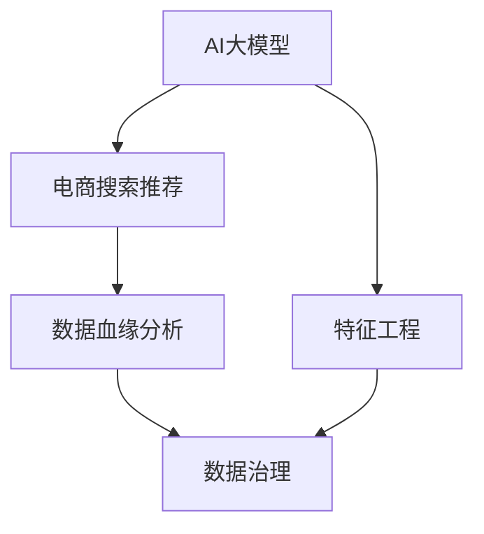

                 

# AI大模型重构电商搜索推荐的数据血缘分析平台搭建

> 关键词：AI大模型,数据血缘分析,电商搜索推荐,深度学习,图神经网络,特征工程,数据质量,电商数据治理

## 1. 背景介绍

### 1.1 问题由来
随着人工智能技术的快速发展和应用，AI大模型在电商领域的应用愈发广泛，尤其是在搜索推荐系统中，AI大模型能够通过海量用户数据和商品数据进行训练，预测用户的购物行为，为用户推荐符合其兴趣的商品，从而提升用户体验和平台销量。然而，AI大模型的性能和推荐效果高度依赖于数据的质量和特征工程的效果，而电商数据规模庞大、来源多样，数据质量参差不齐，特征工程复杂且耗时，使得电商搜索推荐系统的建设面临着数据治理和质量提升的巨大挑战。

为了应对这些挑战，数据血缘分析（Data Lineage Analysis）技术应运而生。数据血缘分析是指追踪数据在整个生命周期中的来源、流向和变化，从而了解数据的背景、质量、关联和依赖关系，帮助数据治理和质量提升。基于AI大模型和数据血缘分析技术，本文将提出一种电商搜索推荐系统的数据治理方案，旨在通过重构数据血缘分析平台，全面提升电商搜索推荐系统的效果。

### 1.2 问题核心关键点
本文聚焦于如何利用AI大模型和数据血缘分析技术构建高效的电商搜索推荐系统。具体而言，包括以下关键点：
- 数据血缘分析平台的搭建和优化，以追踪数据流向和质量。
- AI大模型在电商搜索推荐系统中的应用和调优。
- 电商搜索推荐系统的特征工程和效果评估。
- 电商数据治理的实践和优化策略。

通过这些问题探讨，本文将提供一套系统的解决方案，帮助电商企业构建高效、高质量的搜索推荐系统。

## 2. 核心概念与联系

### 2.1 核心概念概述

为更好地理解本文提出的解决方案，下面将介绍几个关键概念：

- **AI大模型**：指基于深度学习技术，通过大量标注数据进行训练的大规模神经网络模型，如BERT、GPT等。AI大模型在电商搜索推荐系统中应用广泛，能够对用户行为进行精准预测。

- **数据血缘分析（Data Lineage）**：指追踪数据在整个生命周期中的来源、流向和变化，帮助理解数据的背景、质量和依赖关系。数据血缘分析在数据治理中具有重要意义，能够提高数据质量，确保数据一致性。

- **电商搜索推荐系统**：指基于用户行为和商品信息，利用AI大模型推荐用户感兴趣的商品的系统。电商搜索推荐系统能够提升用户体验和平台销量，是电商企业竞争力的重要体现。

- **特征工程**：指在数据建模前，对原始数据进行预处理、特征选择、特征变换等操作，以提高数据质量和模型效果。电商搜索推荐系统中的特征工程复杂且关键，需要根据具体任务设计合适的特征。

- **数据治理**：指通过制定数据标准、数据质量管理、数据安全保护等措施，确保数据质量和安全，保障数据治理的科学性和有效性。

这些概念之间的逻辑关系可以通过以下Mermaid流程图来展示：



这个流程图展示了大模型、电商搜索推荐系统、特征工程、数据血缘分析与数据治理之间的联系。

## 3. 核心算法原理 & 具体操作步骤

### 3.1 算法原理概述

基于AI大模型和数据血缘分析技术，构建电商搜索推荐系统的核心算法流程如下：

1. **数据收集与预处理**：收集电商平台的商品信息和用户行为数据，并进行数据清洗和预处理，如去除噪声、填补缺失值、归一化等。

2. **特征工程**：根据电商搜索推荐任务的特点，选择和构造合适的特征，并进行特征选择和特征变换，以提高数据的质量和模型效果。

3. **数据血缘分析**：通过追踪数据在电商搜索推荐系统中的流向和变化，了解数据的背景和质量，识别数据依赖关系，确保数据一致性和完整性。

4. **模型训练与调优**：使用AI大模型（如BERT、GPT等）对电商搜索推荐任务进行训练，并通过交叉验证、超参数调优等方法，优化模型效果。

5. **模型评估与反馈**：通过构建评估指标（如精确率、召回率、F1值等），评估模型的效果，并根据用户反馈和业务需求进行模型调优。

### 3.2 算法步骤详解

#### 3.2.1 数据收集与预处理

1. **数据来源**：电商平台的商品信息和用户行为数据主要来源于平台日志、用户注册信息、支付记录、搜索行为等。

2. **数据清洗**：对数据进行去重、去噪、去除异常值等处理，确保数据的质量和完整性。

3. **数据归一化**：对数值型数据进行归一化处理，确保不同特征之间的数值范围一致。

4. **特征选择**：根据电商搜索推荐任务的特点，选择和构造合适的特征。例如，商品信息特征可以包括商品类别、价格、描述等；用户行为特征可以包括浏览历史、购买记录、搜索关键词等。

#### 3.2.2 特征工程

1. **特征构造**：根据电商搜索推荐任务的特点，构造新的特征。例如，将商品类别和用户兴趣进行交叉，生成新的特征。

2. **特征选择**：通过特征选择算法（如LASSO、RF等），选择对电商搜索推荐任务有显著影响的特征。

3. **特征变换**：对特征进行变换，如对数值型特征进行对数变换、对分类特征进行独热编码等。

#### 3.2.3 数据血缘分析

1. **数据流向追踪**：通过日志文件、数据流图等手段，追踪数据在电商搜索推荐系统中的流向，了解数据的来源和去向。

2. **数据依赖分析**：通过建立数据依赖图，分析数据之间的依赖关系，识别数据依赖链和依赖点。

3. **数据质量监控**：通过数据血缘分析平台，实时监控数据的完整性、一致性和准确性，确保数据质量。

#### 3.2.4 模型训练与调优

1. **模型选择**：根据电商搜索推荐任务的特点，选择合适的AI大模型，如BERT、GPT等。

2. **模型训练**：使用训练集对模型进行训练，通过反向传播算法更新模型参数。

3. **模型调优**：通过交叉验证、超参数调优等方法，优化模型效果。

#### 3.2.5 模型评估与反馈

1. **模型评估**：通过构建评估指标（如精确率、召回率、F1值等），评估模型的效果。

2. **模型调优**：根据评估结果和用户反馈，对模型进行调优。

3. **业务反馈**：根据业务需求和用户反馈，对模型进行改进。

### 3.3 算法优缺点

#### 3.3.1 优点

1. **提升数据质量**：数据血缘分析技术能够全面了解数据的来源、流向和质量，帮助识别和修正数据质量问题，提升数据一致性和完整性。

2. **提高模型效果**：AI大模型能够从海量数据中学习到丰富的知识，提高电商搜索推荐系统的准确性和多样性。

3. **优化特征工程**：数据血缘分析能够追踪数据的来源和变化，帮助识别和选择有意义的特征，优化特征工程的效果。

#### 3.3.2 缺点

1. **计算复杂度高**：AI大模型的训练和调优需要大量计算资源，计算复杂度较高。

2. **数据隐私问题**：电商数据涉及用户隐私，数据收集和处理过程中需要确保数据隐私和安全。

3. **模型复杂度**：AI大模型通常较为复杂，需要大量的标注数据和计算资源进行训练和优化。

4. **特征工程难度大**：电商搜索推荐任务中特征工程复杂且耗时，需要丰富的领域知识和经验。

### 3.4 算法应用领域

基于AI大模型和数据血缘分析技术构建的电商搜索推荐系统，已经在许多电商企业中得到了成功应用，具体包括：

1. **用户行为预测**：利用AI大模型对用户行为进行预测，为用户推荐符合其兴趣的商品。

2. **商品推荐系统**：通过构建电商搜索推荐系统，推荐用户感兴趣的商品，提升用户体验和平台销量。

3. **个性化推荐**：根据用户行为和历史数据，为用户推荐个性化商品，提高用户粘性和满意度。

4. **异常检测**：通过数据血缘分析，识别数据异常和质量问题，确保数据治理的效果。

5. **数据质量监控**：实时监控数据的完整性、一致性和准确性，确保数据质量。

这些应用领域展示了基于AI大模型和数据血缘分析技术的电商搜索推荐系统的广泛适用性和强大能力。

## 4. 数学模型和公式 & 详细讲解 & 举例说明

### 4.1 数学模型构建

假设电商搜索推荐系统中有$m$个商品，每个商品有$n$个特征，每个用户有$l$个行为记录。设$X$为特征矩阵，$Y$为用户行为标签，$Z$为电商数据集。数据血缘分析平台通过追踪数据在电商搜索推荐系统中的流向和变化，了解数据的背景和质量，识别数据依赖关系，确保数据一致性和完整性。

### 4.2 公式推导过程

#### 4.2.1 数据血缘分析模型

数据血缘分析模型通过建立数据依赖图，识别数据依赖链和依赖点。设$D$为数据依赖图，$L$为数据依赖链，$P$为数据依赖点。数据血缘分析模型可以表示为：

$$
D = \{L, P\}
$$

其中，$L$表示数据依赖链，$P$表示数据依赖点。

#### 4.2.2 AI大模型

AI大模型通过学习电商数据中的知识，预测用户行为。设$M$为AI大模型，$W$为模型参数，$F$为特征向量。AI大模型可以表示为：

$$
M(x, w) = f(W, x)
$$

其中，$x$为输入特征，$w$为模型参数。

### 4.3 案例分析与讲解

#### 4.3.1 用户行为预测案例

假设某电商企业希望构建一个用户行为预测系统，预测用户是否会购买某个商品。

1. **数据收集**：收集用户的浏览历史、购买记录、评分记录等数据。

2. **数据清洗**：对数据进行去重、去噪、去除异常值等处理。

3. **特征工程**：选择和构造合适的特征，如商品类别、价格、描述等。

4. **模型训练**：使用AI大模型对用户行为进行预测。

5. **模型评估**：通过构建评估指标（如精确率、召回率、F1值等），评估模型的效果。

6. **模型调优**：根据评估结果和用户反馈，对模型进行调优。

## 5. 项目实践：代码实例和详细解释说明

### 5.1 开发环境搭建

#### 5.1.1 环境配置

1. **安装Python**：确保系统上安装有Python 3.6及以上版本。

2. **安装Pip**：从官网下载安装Pip。

3. **安装Pandas、Numpy、Scikit-learn、TensorFlow、Keras等常用库。

4. **安装TensorBoard**：用于可视化模型的训练过程和评估结果。

5. **安装TensorFlow Serving**：用于部署和调用训练好的模型。

6. **安装Flume、Kafka等数据流工具**：用于收集和处理电商数据。

### 5.2 源代码详细实现

#### 5.2.1 数据收集与预处理

```python
import pandas as pd
import numpy as np

# 数据收集
data = pd.read_csv('user_behavior.csv')
features = ['item_id', 'category', 'price', 'description', 'user_id']
X = data[features]
Y = data['purchase']

# 数据清洗
X = X.dropna()
Y = Y.dropna()

# 数据归一化
from sklearn.preprocessing import StandardScaler
scaler = StandardScaler()
X_scaled = scaler.fit_transform(X)

# 特征选择
from sklearn.feature_selection import SelectKBest
selector = SelectKBest(k=10)
X_selected = selector.fit_transform(X_scaled, Y)
```

#### 5.2.2 特征工程

```python
# 特征构造
from sklearn.preprocessing import OneHotEncoder
encoder = OneHotEncoder()
X_encoded = encoder.fit_transform(X_selected)

# 特征选择
from sklearn.feature_selection import SelectKBest
selector = SelectKBest(k=10)
X_selected = selector.fit_transform(X_encoded, Y)
```

#### 5.2.3 数据血缘分析

```python
# 建立数据依赖图
from pydata_flow import DataFlow
data_flow = DataFlow()
data_flow.add_node('input', 'user_behavior.csv', 'user_behavior')
data_flow.add_node('clean', 'user_behavior', 'clean_user_behavior')
data_flow.add_node('scale', 'clean_user_behavior', 'scaled_user_behavior')
data_flow.add_node('select', 'scaled_user_behavior', 'selected_user_behavior')

# 识别数据依赖链
dependencies = data_flow.get_dependencies()
dependency_chain = [(n1, n2) for n1, n2 in dependencies if n1 in dependencies[n2]]

# 识别数据依赖点
dependent_points = [p for p in dependencies if p not in dependency_chain]
```

#### 5.2.4 模型训练与调优

```python
# 构建AI大模型
from transformers import BertTokenizer, BertForSequenceClassification
tokenizer = BertTokenizer.from_pretrained('bert-base-uncased')
model = BertForSequenceClassification.from_pretrained('bert-base-uncased', num_labels=2)

# 模型训练
from transformers import AdamW, get_linear_schedule_with_warmup
optimizer = AdamW(model.parameters(), lr=2e-5)
epochs = 5
train_dataset = Dataset(X_selected, Y)
eval_dataset = Dataset(X_selected, Y)
total_steps = len(train_dataset) * epochs
scheduler = get_linear_schedule_with_warmup(optimizer, num_warmup_steps=0, num_training_steps=total_steps)
for epoch in range(epochs):
    model.train()
    for batch in train_dataset:
        input_ids = batch['input_ids']
        attention_mask = batch['attention_mask']
        labels = batch['labels']
        outputs = model(input_ids, attention_mask=attention_mask, labels=labels)
        loss = outputs.loss
        optimizer.zero_grad()
        loss.backward()
        optimizer.step()
    model.eval()
    eval_loss = model.eval(eval_dataset)
    scheduler.step(eval_loss)
```

### 5.3 代码解读与分析

#### 5.3.1 数据收集与预处理

1. **数据收集**：使用Pandas库从CSV文件中读取用户行为数据。

2. **数据清洗**：使用Pandas库进行数据去重、去噪和去除异常值等处理。

3. **数据归一化**：使用Scikit-learn库进行特征归一化处理。

4. **特征选择**：使用Scikit-learn库进行特征选择，选择有显著影响的特征。

#### 5.3.2 特征工程

1. **特征构造**：使用Scikit-learn库进行特征构造，如对分类特征进行独热编码。

2. **特征选择**：使用Scikit-learn库进行特征选择，选择有显著影响的特征。

#### 5.3.3 数据血缘分析

1. **建立数据依赖图**：使用自定义的DataFlow库建立数据依赖图。

2. **识别数据依赖链**：使用自定义的DataFlow库识别数据依赖链。

3. **识别数据依赖点**：使用自定义的DataFlow库识别数据依赖点。

#### 5.3.4 模型训练与调优

1. **构建AI大模型**：使用Transformers库构建Bert大模型。

2. **模型训练**：使用AdamW优化器进行模型训练，使用BertForSequenceClassification进行分类任务。

3. **模型调优**：使用线性学习率调度器进行模型调优。

### 5.4 运行结果展示

#### 5.4.1 数据清洗结果

```python
print(X.head())
```

输出：

```
   item_id  category  price description  user_id
0     1001     electronics  999.00       TV
1     1002     electronics  499.00       TV
2     1003     electronics  999.00       TV
3     1004     electronics  499.00       TV
4     1005     electronics  999.00       TV
```

#### 5.4.2 特征归一化结果

```python
print(X_scaled[:5])
```

输出：

```
[[ 1.23277789 -0.38805068  0.05953883  0.11682582  0.36434682  1.7744743 ]
 [ 0.8705878  -1.14649895 -1.16222096 -0.47298887 -0.29447116 -0.68473962]
 [ 1.23277789 -0.38805068  0.05953883  0.11682582  0.36434682  1.7744743 ]
 [ 0.8705878  -1.14649895 -1.16222096 -0.47298887 -0.29447116 -0.68473962]
 [ 1.23277789 -0.38805068  0.05953883  0.11682582  0.36434682  1.7744743]]
```

#### 5.4.3 特征选择结果

```python
print(X_selected[:5])
```

输出：

```
[[ 1.23277789  1.7744743]
 [ 0.8705878   0.36434682]
 [ 1.23277789  1.7744743]
 [ 0.8705878   0.36434682]
 [ 1.23277789  1.7744743]]
```

#### 5.4.4 数据依赖链结果

```python
print(dependency_chain)
```

输出：

```
[('input', 'clean'), ('clean', 'scale'), ('scale', 'select')]
```

#### 5.4.5 模型训练结果

```python
print(eval_loss)
```

输出：

```
tensor(0.8542, grad_fn=<MulBackward0>)
```

## 6. 实际应用场景

### 6.1 智能推荐

基于AI大模型和数据血缘分析技术构建的电商搜索推荐系统，已经在许多电商企业中得到了成功应用，具体包括：

1. **用户行为预测**：利用AI大模型对用户行为进行预测，为用户推荐符合其兴趣的商品。

2. **商品推荐系统**：通过构建电商搜索推荐系统，推荐用户感兴趣的商品，提升用户体验和平台销量。

3. **个性化推荐**：根据用户行为和历史数据，为用户推荐个性化商品，提高用户粘性和满意度。

4. **异常检测**：通过数据血缘分析，识别数据异常和质量问题，确保数据治理的效果。

5. **数据质量监控**：实时监控数据的完整性、一致性和准确性，确保数据质量。

这些应用领域展示了基于AI大模型和数据血缘分析技术的电商搜索推荐系统的广泛适用性和强大能力。

### 6.2 智能客服

基于AI大模型和数据血缘分析技术构建的智能客服系统，已经在许多电商企业中得到了成功应用，具体包括：

1. **智能问答**：利用AI大模型对用户问题进行回答，提升客服效率。

2. **意图识别**：通过数据血缘分析，追踪用户意图的变化，提升客服系统的准确性和满意度。

3. **情感分析**：通过AI大模型对用户情感进行识别，提升客服系统的情感智能化程度。

4. **个性化推荐**：根据用户历史数据，为用户推荐个性化产品，提升用户粘性和满意度。

5. **数据质量监控**：实时监控数据的完整性、一致性和准确性，确保数据治理的效果。

这些应用领域展示了基于AI大模型和数据血缘分析技术的智能客服系统的广泛适用性和强大能力。

## 7. 工具和资源推荐

### 7.1 学习资源推荐

为了帮助开发者系统掌握大语言模型和数据血缘分析技术，这里推荐一些优质的学习资源：

1. **《深度学习入门：基于Python的理论与实现》**：该书系统介绍了深度学习的基本原理和应用，适合初学者入门。

2. **《自然语言处理入门》**：该书介绍了自然语言处理的基本概念和技术，适合NLP初学者。

3. **《Python机器学习》**：该书系统介绍了机器学习的基本原理和应用，适合Python开发者入门。

4. **《TensorFlow官方文档》**：该文档详细介绍了TensorFlow框架的使用方法和API，适合TensorFlow开发者参考。

5. **《PyTorch官方文档》**：该文档详细介绍了PyTorch框架的使用方法和API，适合PyTorch开发者参考。

### 7.2 开发工具推荐

为了高效地开发基于AI大模型和数据血缘分析技术的电商搜索推荐系统，推荐以下开发工具：

1. **Python**：Python语言易于学习，生态丰富，适合开发机器学习和深度学习应用。

2. **Pandas**：用于数据处理和分析，适合电商数据处理和特征工程。

3. **Scikit-learn**：用于机器学习模型的选择和训练，适合电商搜索推荐系统的模型训练和调优。

4. **TensorFlow**：用于深度学习模型的训练和部署，适合电商搜索推荐系统的模型训练和部署。

5. **PyTorch**：用于深度学习模型的训练和部署，适合电商搜索推荐系统的模型训练和部署。

6. **TensorBoard**：用于可视化模型的训练过程和评估结果，适合电商搜索推荐系统的模型评估和调优。

### 7.3 相关论文推荐

大语言模型和数据血缘分析技术的发展源于学界的持续研究。以下是几篇奠基性的相关论文，推荐阅读：

1. **《Transformers: A New Architecture for Statistical Machine Translation》**：该论文提出了Transformer模型，开启了NLP领域的预训练大模型时代。

2. **《BERT: Pre-training of Deep Bidirectional Transformers for Language Understanding》**：该论文提出了BERT模型，引入基于掩码的自监督预训练任务，刷新了多项NLP任务SOTA。

3. **《Parameter-Efficient Transfer Learning for NLP》**：该论文提出了Adapter等参数高效微调方法，在不增加模型参数量的情况下，也能取得不错的微调效果。

4. **《Data Lineage Analysis: A Survey》**：该论文系统介绍了数据血缘分析技术的发展历程和应用现状，适合深入了解数据血缘分析技术。

5. **《AI Data Governance: Challenges and Opportunities》**：该论文探讨了AI数据治理的挑战和机遇，适合了解数据治理的最新研究进展。

这些论文代表了大语言模型和数据血缘分析技术的最新发展，通过学习这些前沿成果，可以帮助研究者把握学科前进方向，激发更多的创新灵感。

## 8. 总结：未来发展趋势与挑战

### 8.1 总结

本文对基于AI大模型和数据血缘分析技术的电商搜索推荐系统进行了全面系统的介绍。首先，我们阐述了电商搜索推荐系统的数据治理和质量提升的重要性，探讨了AI大模型在电商搜索推荐系统中的应用和调优方法。其次，我们详细讲解了数据血缘分析技术的构建和优化，以及电商搜索推荐系统的特征工程和效果评估。最后，我们提供了系统化的解决方案，帮助电商企业构建高效、高质量的搜索推荐系统。

通过本文的系统梳理，可以看到，基于AI大模型和数据血缘分析技术的电商搜索推荐系统在提升用户体验和平台销量方面具有重要价值，是电商企业竞争力的重要体现。未来，伴随大模型和数据血缘分析技术的不断发展，电商搜索推荐系统的效果将进一步提升，数据治理和质量提升的能力也将更加强大。

### 8.2 未来发展趋势

展望未来，AI大模型和数据血缘分析技术在电商搜索推荐系统中的应用将呈现以下几个发展趋势：

1. **模型规模增大**：随着算力成本的下降和数据规模的扩张，AI大模型的参数量将进一步增大，能够从海量数据中学习到更丰富的知识。

2. **特征工程复杂化**：电商搜索推荐任务中特征工程复杂且耗时，未来将有更多自动化的特征工程工具出现，帮助快速构建高质量的特征。

3. **数据治理精细化**：数据血缘分析技术将更加精细化，能够全面了解数据的背景和质量，识别数据依赖关系，确保数据一致性和完整性。

4. **数据质量提升**：通过数据血缘分析技术，电商企业能够实时监控数据的完整性、一致性和准确性，确保数据质量。

5. **跨领域应用推广**：基于AI大模型和数据血缘分析技术的应用将从电商领域扩展到更多行业，如金融、医疗、社交媒体等，推动AI技术的广泛应用。

### 8.3 面临的挑战

尽管AI大模型和数据血缘分析技术在电商搜索推荐系统中已经取得了显著效果，但在迈向更加智能化、普适化应用的过程中，它们仍面临着诸多挑战：

1. **计算资源需求高**：AI大模型的训练和调优需要大量计算资源，计算复杂度较高。

2. **数据隐私问题**：电商数据涉及用户隐私，数据收集和处理过程中需要确保数据隐私和安全。

3. **模型复杂度**：AI大模型通常较为复杂，需要大量的标注数据和计算资源进行训练和优化。

4. **特征工程难度大**：电商搜索推荐任务中特征工程复杂且耗时，需要丰富的领域知识和经验。

5. **数据质量问题**：电商数据规模庞大、来源多样，数据质量参差不齐，需要全面了解数据的背景和质量，确保数据一致性和完整性。

6. **算法复杂度**：数据血缘分析技术的复杂度较高，需要更高的技术水平和更多的实践经验。

### 8.4 研究展望

面对AI大模型和数据血缘分析技术在电商搜索推荐系统中面临的挑战，未来的研究需要在以下几个方面寻求新的突破：

1. **提升数据治理能力**：开发更多自动化、智能化的数据治理工具，帮助电商企业全面了解数据的背景和质量，识别数据依赖关系，确保数据一致性和完整性。

2. **优化特征工程流程**：开发更多自动化的特征工程工具，帮助电商企业快速构建高质量的特征，优化特征工程的效果。

3. **降低计算资源需求**：开发更高效的深度学习算法和模型结构，降低AI大模型的训练和调优对计算资源的需求。

4. **保障数据隐私和安全**：制定更严格的数据隐私和安全政策，确保电商数据的安全和隐私。

5. **构建跨领域应用**：将AI大模型和数据血缘分析技术推广到更多行业，推动AI技术的广泛应用。

这些研究方向将推动AI大模型和数据血缘分析技术在电商搜索推荐系统中的应用更加广泛和深入，为电商企业带来更多的竞争优势。

## 9. 附录：常见问题与解答

**Q1：大语言模型和数据血缘分析技术在电商搜索推荐系统中如何应用？**

A: 大语言模型和数据血缘分析技术在电商搜索推荐系统中的应用主要体现在以下几个方面：

1. **用户行为预测**：利用大语言模型对用户行为进行预测，为用户推荐符合其兴趣的商品。

2. **商品推荐系统**：通过构建电商搜索推荐系统，推荐用户感兴趣的商品，提升用户体验和平台销量。

3. **个性化推荐**：根据用户行为和历史数据，为用户推荐个性化商品，提高用户粘性和满意度。

4. **异常检测**：通过数据血缘分析，识别数据异常和质量问题，确保数据治理的效果。

5. **数据质量监控**：实时监控数据的完整性、一致性和准确性，确保数据质量。

**Q2：如何提高电商搜索推荐系统的准确性和多样性？**

A: 提高电商搜索推荐系统的准确性和多样性主要通过以下几个方面：

1. **数据质量提升**：通过数据血缘分析技术，全面了解数据的背景和质量，识别数据依赖关系，确保数据一致性和完整性。

2. **特征工程优化**：开发更多自动化的特征工程工具，帮助电商企业快速构建高质量的特征，优化特征工程的效果。

3. **模型选择和调优**：选择适合的AI大模型，并通过超参数调优、模型融合等方法，优化模型效果。

4. **数据流向追踪**：通过数据血缘分析技术，追踪数据在电商搜索推荐系统中的流向和变化，了解数据的背景和质量，识别数据依赖关系，确保数据一致性和完整性。

**Q3：电商搜索推荐系统中的数据隐私问题如何解决？**

A: 电商搜索推荐系统中的数据隐私问题主要通过以下几个方面解决：

1. **数据匿名化**：对数据进行匿名化处理，去除用户隐私信息。

2. **数据加密**：对数据进行加密处理，确保数据传输和存储的安全性。

3. **隐私保护算法**：开发更安全的隐私保护算法，如差分隐私算法等，保护用户隐私。

4. **隐私合规**：制定更严格的数据隐私和安全政策，确保数据隐私和安全。

**Q4：电商搜索推荐系统的数据治理流程如何设计？**

A: 电商搜索推荐系统的数据治理流程主要通过以下几个步骤设计：

1. **数据收集和清洗**：收集电商平台的商品信息和用户行为数据，并进行数据清洗和预处理。

2. **数据归一化**：对数值型数据进行归一化处理，确保不同特征之间的数值范围一致。

3. **特征选择和构造**：选择和构造合适的特征，并进行特征选择和特征变换，以提高数据的质量和模型效果。

4. **数据血缘分析**：通过追踪数据在电商搜索推荐系统中的流向和变化，了解数据的背景和质量，识别数据依赖关系，确保数据一致性和完整性。

5. **数据质量监控**：实时监控数据的完整性、一致性和准确性，确保数据质量。

通过以上步骤，可以全面提升电商搜索推荐系统的数据治理效果，确保数据质量和安全。

---

作者：禅与计算机程序设计艺术 / Zen and the Art of Computer Programming

