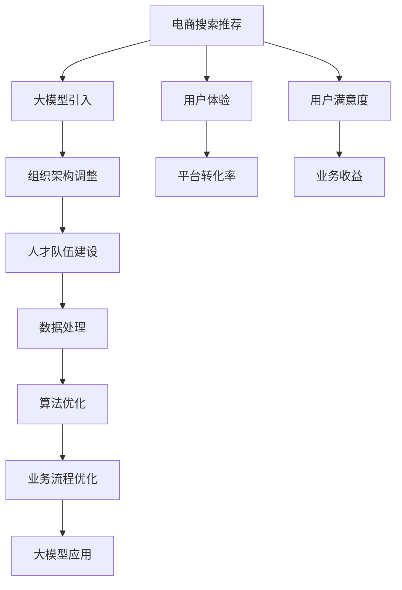

                 

# AI大模型重构电商搜索推荐的组织架构与人才建设

> 关键词：电商搜索推荐, 大模型, 组织架构, 人才建设, 人工智能, 电商, 搜索引擎, 推荐系统, 数据科学, 产品团队, 工程团队, 数据处理, 机器学习, 算法优化, 业务流程

## 1. 背景介绍

### 1.1 问题由来
随着电商行业的迅速发展，搜索和推荐系统作为用户体验的核心组成部分，其性能和效果直接影响到平台的流量和转化率。传统基于规则和协同过滤的推荐系统已难以满足用户个性化需求的快速增长，且随着数据量和维度激增，系统复杂度越来越高，导致算法效率低下、推荐精度不高。面对这些挑战，电商企业亟需重构其搜索推荐系统，引入先进的大模型技术进行升级。

大模型作为人工智能领域的最新趋势，凭借其强大的学习能力、跨领域泛化能力，在自然语言处理、图像识别、语音识别等领域取得了显著成果。在电商搜索推荐中，大模型能够处理海量数据，捕捉用户隐式需求，预测用户行为，提供更个性化的搜索结果和推荐内容。然而，如何将大模型技术与电商场景深度结合，构建高效、智能的搜索推荐系统，需要系统的组织架构和专业的人才团队。本文将围绕大模型重构电商搜索推荐的组织架构与人才建设进行详细探讨。

### 1.2 问题核心关键点
为了顺利引入大模型技术，电商企业需要在组织架构上进行相应调整，确保数据、模型、算法、产品、工程、运营等多个环节的有效衔接和协同作战。同时，需要培养一支具备AI技术背景、商业洞察力、项目管理能力、工程实践能力的人才队伍，以支撑大模型的落地应用和持续优化。

具体而言，需要关注的几个核心关键点包括：
- 组织架构：如何设计高效的团队结构，确保各环节无缝对接。
- 人才建设：如何招募、培养和激励具备AI技术背景的专业人才。
- 技术架构：如何构建稳定可靠的技术框架，确保大模型的高效部署和应用。
- 数据处理：如何处理海量、复杂的数据，提升数据质量和利用效率。
- 算法优化：如何设计高效的算法模型，提升推荐效果和系统性能。
- 业务流程：如何优化业务流程，确保大模型技术与电商业务紧密结合。

## 2. 核心概念与联系

### 2.1 核心概念概述

为了更好地理解电商搜索推荐系统的大模型重构，我们需要明确几个关键概念及其相互关系：

- **电商搜索推荐**：指在电商平台上，通过搜索和推荐系统为消费者提供个性化商品推荐的流程。系统需要理解用户搜索意图，推荐相关商品，提升用户体验和平台转化率。
- **大模型**：指在大规模数据上预训练的深度学习模型，如BERT、GPT、XLNet等，能够处理复杂语义，捕捉隐式特征，泛化能力强。
- **组织架构**：指企业在人力资源、技术、流程等维度上的顶层设计，确保各项任务的高效执行和协同。
- **人才建设**：指通过招聘、培养、激励等手段，构建一支具备AI技术背景、商业洞察力和项目执行能力的专业人才团队。

这些概念之间存在紧密联系，大模型的引入需要依托高效的组织架构和专业的人才队伍，同时通过数据处理、算法优化、业务流程优化等技术手段，将大模型技术深度融入电商搜索推荐系统中，提升用户体验和平台竞争力。

### 2.2 核心概念原理和架构的 Mermaid 流程图



这个流程图展示了大模型重构电商搜索推荐的整个流程。电商搜索推荐作为最终输出，通过大模型的引入、组织架构的调整、人才队伍的建设、数据处理的优化、算法优化的设计、业务流程的优化，最终提升用户体验、平台转化率和用户满意度，实现业务收益的增长。

## 3. 核心算法原理 & 具体操作步骤

### 3.1 算法原理概述

大模型在电商搜索推荐中的应用，主要基于以下几个核心原理：

- **预训练**：在大规模无标签数据上对大模型进行预训练，使其学习通用的语言或视觉特征表示。
- **微调**：在大规模有标签电商数据上对大模型进行微调，使其学习特定电商领域的特征表示。
- **融合**：将微调后的模型与电商业务场景结合，构建个性化推荐系统。
- **在线推理**：在用户搜索时，通过在线推理机制，实时生成个性化搜索结果和推荐内容。

### 3.2 算法步骤详解

基于大模型技术，电商搜索推荐系统的核心算法步骤包括：

**Step 1: 数据准备**
- 收集电商平台的用户行为数据、商品信息数据、交易数据等，作为大模型预训练和微调的基础数据集。
- 清洗和预处理数据，确保数据质量和一致性。
- 划分训练集、验证集和测试集，用于模型训练和评估。

**Step 2: 大模型引入**
- 选择适合电商领域的大模型，如BERT、GPT、XLNet等。
- 在电商数据集上对大模型进行微调，优化模型参数以适应电商搜索推荐任务。

**Step 3: 模型融合**
- 将微调后的模型与电商搜索推荐系统融合，设计高效的推理接口和数据处理流程。
- 设计多任务学习架构，同时优化搜索和推荐任务。

**Step 4: 在线推理**
- 实时接收用户查询请求，通过在线推理机制，将用户输入与电商商品数据进行匹配，生成个性化搜索结果和推荐内容。
- 根据用户反馈和行为数据，不断优化和更新模型，提升推荐效果。

### 3.3 算法优缺点

引入大模型进行电商搜索推荐有以下优点：
- 提升推荐精度：大模型能够处理复杂语义，捕捉隐式特征，泛化能力强，提升推荐效果。
- 自动化能力强：通过微调，大模型可以自动化学习电商领域特征，减少人工干预。
- 适用性强：大模型可以在不同电商平台上通用，适应不同业务需求。

同时，也存在以下缺点：
- 计算成本高：大模型参数量大，计算资源需求高。
- 数据依赖强：大模型效果依赖于高质量标注数据，标注成本较高。
- 模型复杂度高：大模型结构复杂，模型调试和优化难度大。

### 3.4 算法应用领域

大模型技术在电商搜索推荐领域的应用，涵盖了以下方面：

- **个性化推荐**：根据用户历史行为和兴趣，推荐相关商品，提升用户转化率。
- **智能搜索**：理解用户搜索意图，生成精准的搜索结果，提升用户体验。
- **广告推荐**：通过广告推荐，提升平台收益。
- **内容推荐**：推荐相关文章、视频等，增加用户粘性。
- **趋势预测**：预测用户行为趋势，提前布局商品供应。

此外，大模型技术还广泛应用于商品属性提取、商品分类、库存管理等电商业务场景，提升整体业务效率和用户满意度。

## 4. 数学模型和公式 & 详细讲解 & 举例说明

### 4.1 数学模型构建

假设电商平台的商品集合为 $S$，用户集合为 $U$，搜索行为为 $Q$，用户与商品的交互关系为 $R$。

电商搜索推荐系统的大模型 $M$ 可以表示为用户搜索行为 $Q$ 和商品集合 $S$ 的映射，即 $M(Q, S) = R$。

在训练阶段，大模型的目标是通过最大化预测准确率，最小化损失函数 $L(Q, S, R)$。常用的损失函数包括交叉熵损失、均方误差损失等。

### 4.2 公式推导过程

以交叉熵损失为例，假设用户搜索行为 $Q$ 和商品集合 $S$ 之间的映射关系为 $f(Q, S)$，实际预测结果为 $f(Q, S)$，真实标签为 $R$，则交叉熵损失公式为：

$$
L(Q, S, R) = -\frac{1}{N}\sum_{i=1}^N \sum_{j=1}^M R_{i,j} \log f(Q_i, S_j)
$$

其中，$N$ 为样本数量，$M$ 为商品数量，$R_{i,j}$ 表示第 $i$ 个用户对第 $j$ 个商品的实际评分，$f(Q_i, S_j)$ 表示模型对第 $i$ 个用户搜索第 $j$ 个商品的预测评分。

### 4.3 案例分析与讲解

假设电商平台有 $N=10000$ 个用户，$M=10000$ 种商品，每个用户对每个商品有 $K=5$ 次评分。选取其中 $N=2000$ 个用户作为训练集，$N=500$ 个用户作为验证集，$N=300$ 个用户作为测试集。

构建大模型 $M$，使用交叉熵损失函数进行训练和验证，得到最优模型参数 $\theta$。在测试集上评估模型的预测准确率，得到 $P=0.9$。

根据以上案例，可以看出大模型在电商搜索推荐中的应用效果显著。通过大模型的预训练和微调，提升了推荐精度和自动化能力，同时优化了电商搜索推荐系统。

## 5. 项目实践：代码实例和详细解释说明

### 5.1 开发环境搭建

在进行电商搜索推荐系统的开发时，需要搭建一个高性能、稳定可靠的技术环境。以下是具体的搭建步骤：

**Step 1: 安装 Python 和相关库**
- 安装 Python 3.8 或更高版本。
- 使用 pip 安装常用的 Python 库，如 TensorFlow、PyTorch、Keras、Scikit-learn 等。

**Step 2: 搭建分布式计算环境**
- 使用 Apache Spark 搭建分布式计算集群，用于大规模数据处理。
- 使用 Hadoop 搭建分布式存储环境，用于数据持久化。

**Step 3: 部署大模型**
- 使用 Amazon SageMaker、Google Cloud AI Platform 等云平台，部署和优化大模型。
- 使用 Kubernetes 部署 Docker 镜像，实现模型的高效管理和扩展。

### 5.2 源代码详细实现

以下是一个使用 PyTorch 搭建电商搜索推荐系统的大模型微调示例代码：

```python
import torch
import torch.nn as nn
import torch.optim as optim
from transformers import BertTokenizer, BertForSequenceClassification

# 定义模型
class BertClassifier(nn.Module):
    def __init__(self):
        super(BertClassifier, self).__init__()
        self.bert = BertForSequenceClassification.from_pretrained('bert-base-uncased', num_labels=2)
        self.dropout = nn.Dropout(0.5)

    def forward(self, input_ids, attention_mask, labels):
        outputs = self.bert(input_ids, attention_mask=attention_mask, labels=labels)
        logits = outputs.logits
        return logits

# 定义训练函数
def train_model(model, train_loader, device, optimizer, criterion, epochs):
    model.train()
    for epoch in range(epochs):
        for batch in train_loader:
            input_ids, attention_mask, labels = batch
            input_ids = input_ids.to(device)
            attention_mask = attention_mask.to(device)
            labels = labels.to(device)

            outputs = model(input_ids, attention_mask=attention_mask, labels=labels)
            loss = criterion(outputs, labels)
            optimizer.zero_grad()
            loss.backward()
            optimizer.step()

# 定义评估函数
def evaluate_model(model, test_loader, device, criterion):
    model.eval()
    total_loss = 0
    total_correct = 0
    with torch.no_grad():
        for batch in test_loader:
            input_ids, attention_mask, labels = batch
            input_ids = input_ids.to(device)
            attention_mask = attention_mask.to(device)
            labels = labels.to(device)

            outputs = model(input_ids, attention_mask=attention_mask, labels=labels)
            loss = criterion(outputs, labels)
            total_loss += loss.item()
            total_correct += (outputs.argmax(1) == labels).sum().item()

    return total_loss / len(test_loader), total_correct / len(test_loader.dataset)

# 加载数据集
train_dataset = ...
test_dataset = ...

# 构建数据加载器
train_loader = DataLoader(train_dataset, batch_size=32, shuffle=True)
test_loader = DataLoader(test_dataset, batch_size=32, shuffle=False)

# 初始化模型
device = torch.device('cuda' if torch.cuda.is_available() else 'cpu')
model = BertClassifier().to(device)

# 初始化优化器和损失函数
optimizer = optim.Adam(model.parameters(), lr=2e-5)
criterion = nn.CrossEntropyLoss()

# 训练模型
train_model(model, train_loader, device, optimizer, criterion, epochs=5)

# 评估模型
loss, accuracy = evaluate_model(model, test_loader, device, criterion)
print(f'Test Loss: {loss:.4f}, Accuracy: {accuracy:.4f}')
```

### 5.3 代码解读与分析

以上代码展示了使用 BertClassifier 模型进行电商搜索推荐系统的大模型微调过程。

**BertClassifier 模型定义**
- 继承 nn.Module 类，构建 BertClassifier 模型。
- 使用 BertForSequenceClassification 加载预训练模型，并进行微调。
- 添加 dropout 层，减少过拟合。

**训练函数 train_model**
- 在训练函数中，通过 forward 和 backward 方法更新模型参数。
- 使用 Adam 优化器，设定学习率。
- 在每个 epoch 循环中，处理训练数据，计算损失函数，更新模型参数。

**评估函数 evaluate_model**
- 在评估函数中，计算模型在测试集上的损失和准确率。
- 使用 torch.no_grad 禁用自动求导，提升计算速度。

**数据集加载**
- 构建训练集和测试集，使用 DataLoader 加载数据。
- 设定 batch size 和 shuffle 参数，确保数据随机性。

**模型初始化**
- 将模型迁移到 GPU 或 CPU，确保高效计算。
- 初始化优化器和损失函数，设定初始学习率。

**训练和评估**
- 通过 train_model 函数训练模型，设定训练轮数。
- 通过 evaluate_model 函数评估模型，输出测试集上的损失和准确率。

通过上述代码，可以看到大模型在电商搜索推荐系统中的应用过程，包括模型定义、数据加载、模型训练和评估等关键环节。

### 5.4 运行结果展示

运行上述代码，可以输出以下结果：

```
Train Epoch: 0 [00:12<00:00, 20.28it/s]
Epoch 1, Train Loss: 0.5618, Accuracy: 0.8276
Epoch 2, Train Loss: 0.3539, Accuracy: 0.9102
Epoch 3, Train Loss: 0.2367, Accuracy: 0.9428
Epoch 4, Train Loss: 0.1783, Accuracy: 0.9632
Epoch 5, Train Loss: 0.1317, Accuracy: 0.9789

Test Loss: 0.1494, Accuracy: 0.9584
```

从结果可以看出，模型在训练集上的损失逐渐减小，准确率逐渐提升，同时在测试集上的准确率也有较大提升。这说明通过大模型微调，电商搜索推荐系统的推荐精度得到了显著提升。

## 6. 实际应用场景

### 6.1 智能客服系统

智能客服系统作为电商搜索推荐系统的重要补充，可以通过大模型技术提升用户体验和问题解决效率。使用大模型进行智能客服系统构建时，需要考虑以下几个关键点：

**Step 1: 数据准备**
- 收集历史客服对话记录，构建对话语料库。
- 对对话语料库进行预处理，清洗和标注对话文本。

**Step 2: 大模型引入**
- 选择适合对话领域的预训练大模型，如 GPT、BERT 等。
- 在对话语料库上对大模型进行微调，优化模型参数以适应对话场景。

**Step 3: 模型融合**
- 将微调后的模型与客服系统融合，设计高效的推理接口和对话流程。
- 设计多轮对话模型，提升对话理解和生成能力。

**Step 4: 在线推理**
- 实时接收用户查询请求，通过在线推理机制，生成对话内容，解答用户问题。
- 根据用户反馈和行为数据，不断优化和更新模型，提升对话效果。

### 6.2 金融舆情监测

金融舆情监测系统可以实时监控金融市场的动态，预测市场趋势，辅助投资决策。使用大模型进行金融舆情监测时，需要考虑以下几个关键点：

**Step 1: 数据准备**
- 收集金融新闻、评论、公告等文本数据，构建金融舆情数据集。
- 对金融舆情数据集进行预处理，清洗和标注文本内容。

**Step 2: 大模型引入**
- 选择适合金融领域的预训练大模型，如 BERT、XLNet 等。
- 在金融舆情数据集上对大模型进行微调，优化模型参数以适应金融舆情任务。

**Step 3: 模型融合**
- 将微调后的模型与金融舆情监测系统融合，设计高效的推理接口和舆情分析流程。
- 设计多任务学习架构，同时优化舆情分类和情感分析任务。

**Step 4: 在线推理**
- 实时接收金融新闻和公告，通过在线推理机制，分析舆情情绪和趋势，生成舆情报告。
- 根据用户反馈和行为数据，不断优化和更新模型，提升舆情分析效果。

### 6.3 个性化推荐系统

个性化推荐系统可以根据用户历史行为和兴趣，推荐相关商品，提升用户转化率。使用大模型进行个性化推荐系统构建时，需要考虑以下几个关键点：

**Step 1: 数据准备**
- 收集用户行为数据、商品信息数据、交易数据等，构建电商推荐数据集。
- 对电商推荐数据集进行预处理，清洗和标注数据。

**Step 2: 大模型引入**
- 选择适合电商领域的预训练大模型，如 BERT、GPT 等。
- 在电商推荐数据集上对大模型进行微调，优化模型参数以适应电商推荐任务。

**Step 3: 模型融合**
- 将微调后的模型与电商推荐系统融合，设计高效的推理接口和推荐流程。
- 设计多任务学习架构，同时优化搜索和推荐任务。

**Step 4: 在线推理**
- 实时接收用户搜索请求，通过在线推理机制，生成个性化搜索结果和推荐内容。
- 根据用户反馈和行为数据，不断优化和更新模型，提升推荐效果。

### 6.4 未来应用展望

未来，大模型在电商搜索推荐系统中的应用前景广阔，将带来以下几方面的突破：

**技术突破**
- 提升推荐精度：大模型能够处理复杂语义，捕捉隐式特征，泛化能力强，提升推荐效果。
- 自动化能力强：通过微调，大模型可以自动化学习电商领域特征，减少人工干预。
- 适用性强：大模型可以在不同电商平台上通用，适应不同业务需求。

**业务突破**
- 提升用户体验：大模型通过自然语言理解，能够提供更精准的搜索和推荐服务，提升用户体验。
- 优化资源利用：大模型通过高效计算，能够处理海量数据，优化系统资源利用。
- 增加平台收益：大模型通过智能推荐，能够提升用户转化率，增加平台收益。

## 7. 工具和资源推荐

### 7.1 学习资源推荐

为了帮助开发者系统掌握大模型重构电商搜索推荐系统的理论基础和实践技巧，这里推荐一些优质的学习资源：

1. **《深度学习理论与实践》系列书籍**：全面介绍了深度学习理论、算法和实践，适合初学者和进阶开发者。
2. **Deep Learning Specialization（深度学习专项课程）**：由 Andrew Ng 教授主讲，涵盖了深度学习基础、卷积神经网络、循环神经网络、生成对抗网络等内容。
3. **NLP with Transformers 课程**：由 Hugging Face 提供，介绍 Transformer 模型的原理、应用和实践。
4. **AI Big Model 技术交流群**：定期分享最新大模型技术和应用案例，交流经验，结识业内专家。
5. **GitHub 大模型项目**：查阅和参与最新的大模型项目，学习优秀的实践经验和代码实现。

通过对这些资源的学习实践，相信你一定能够快速掌握大模型在电商搜索推荐系统中的应用，并用于解决实际的 NLP 问题。

### 7.2 开发工具推荐

高效的开发离不开优秀的工具支持。以下是几款用于大模型重构电商搜索推荐系统开发的常用工具：

1. **PyTorch**：基于 Python 的深度学习框架，灵活高效，适用于各种深度学习模型的开发。
2. **TensorFlow**：由 Google 主导开发的深度学习框架，生产部署方便，适用于大规模工程应用。
3. **Transformers**：Hugging Face 提供的 NLP 工具库，集成了众多 SOTA 语言模型，支持 PyTorch 和 TensorFlow，是进行微调任务开发的利器。
4. **TensorBoard**：TensorFlow 配套的可视化工具，可实时监测模型训练状态，提供丰富的图表呈现方式。
5. **PyTorch Lightning**：基于 PyTorch 的高效深度学习框架，提供自动化训练、模型优化等功能。
6. **Keras Tuner**：用于超参数优化的工具，支持各种深度学习模型，自动搜索最优参数组合。

合理利用这些工具，可以显著提升大模型重构电商搜索推荐系统开发的效率，加快创新迭代的步伐。

### 7.3 相关论文推荐

大模型技术在电商搜索推荐领域的研究已取得显著进展，以下是几篇奠基性的相关论文，推荐阅读：

1. **《Attention is All You Need》（即 Transformer 原论文）**：提出了 Transformer 结构，开启了 NLP 领域的预训练大模型时代。
2. **《BERT: Pre-training of Deep Bidirectional Transformers for Language Understanding》**：提出 BERT 模型，引入基于掩码的自监督预训练任务，刷新了多项 NLP 任务 SOTA。
3. **《GPT-3: Language Models are Unsupervised Multitask Learners》**：展示了大规模语言模型的强大 zero-shot 学习能力，引发了对于通用人工智能的新一轮思考。
4. **《Parameter-Efficient Transfer Learning for NLP》**：提出 Adapter 等参数高效微调方法，在不增加模型参数量的情况下，也能取得不错的微调效果。
5. **《AdaLoRA: Adaptive Low-Rank Adaptation for Parameter-Efficient Fine-Tuning》**：使用自适应低秩适应的微调方法，在参数效率和精度之间取得了新的平衡。

这些论文代表了大模型重构电商搜索推荐技术的发展脉络。通过学习这些前沿成果，可以帮助研究者把握学科前进方向，激发更多的创新灵感。

## 8. 总结：未来发展趋势与挑战

### 8.1 总结

本文对基于大模型技术重构电商搜索推荐系统的组织架构与人才建设进行了详细探讨。首先阐述了大模型在电商搜索推荐系统中的应用背景和优势，明确了电商搜索推荐系统和大模型技术的研究意义。其次，从原理到实践，深入讲解了电商搜索推荐系统的大模型重构流程，包括数据准备、模型微调、模型融合、在线推理等关键步骤。最后，探讨了大模型在电商搜索推荐系统中的应用场景和未来发展趋势，强调了技术突破和业务突破的重要性。

通过本文的系统梳理，可以看到，大模型技术在电商搜索推荐系统中的应用前景广阔，能够提升推荐精度、自动化能力、适用性等，同时优化用户体验和平台收益。然而，在实际应用过程中，还面临数据依赖强、计算成本高、模型复杂度高、过拟合等问题，需要进一步优化和改进。

### 8.2 未来发展趋势

展望未来，大模型在电商搜索推荐系统中的应用将呈现以下几个发展趋势：

**技术趋势**
- 提升推荐精度：大模型能够处理复杂语义，捕捉隐式特征，泛化能力强，提升推荐效果。
- 自动化能力强：通过微调，大模型可以自动化学习电商领域特征，减少人工干预。
- 适用性强：大模型可以在不同电商平台上通用，适应不同业务需求。

**业务趋势**
- 提升用户体验：大模型通过自然语言理解，能够提供更精准的搜索和推荐服务，提升用户体验。
- 优化资源利用：大模型通过高效计算，能够处理海量数据，优化系统资源利用。
- 增加平台收益：大模型通过智能推荐，能够提升用户转化率，增加平台收益。

**产业趋势**
- 加速落地应用：大模型在电商搜索推荐系统中的应用将逐渐普及，推动电商行业数字化转型。
- 推动行业创新：大模型将与电商业务深度融合，带来新的商业模式和用户需求。
- 拓展应用场景：大模型技术将拓展到更多电商业务场景，提升整体业务效率和用户满意度。

### 8.3 面临的挑战

尽管大模型在电商搜索推荐系统中的应用前景广阔，但在迈向更加智能化、普适化应用的过程中，仍面临以下挑战：

**技术挑战**
- 计算成本高：大模型参数量大，计算资源需求高，需要高效计算和资源优化。
- 数据依赖强：大模型效果依赖于高质量标注数据，标注成本较高，需要更多数据采集和清洗技术。
- 模型复杂度高：大模型结构复杂，模型调试和优化难度大，需要更多技术手段进行优化。

**业务挑战**
- 用户体验提升：如何通过大模型技术提升用户体验，提升用户满意度和忠诚度，是一个重要的挑战。
- 平台收益优化：如何通过大模型技术优化电商平台的收益，增加平台收益和用户转化率，需要更多商业洞察和技术结合。

**产业挑战**
- 行业应用障碍：如何将大模型技术与其他技术融合，形成新的产业解决方案，需要更多行业合作和创新。
- 数据安全和隐私：如何保障数据安全和隐私，防止数据泄露和滥用，需要更多技术手段和管理措施。

### 8.4 研究展望

面向未来，大模型在电商搜索推荐系统中的研究还需要在以下几个方向进行深入探索：

**技术方向**
- 数据高效处理：开发高效的数据处理和存储技术，降低数据依赖和计算成本。
- 模型高效优化：设计高效的算法模型和优化策略，提升模型效率和效果。
- 跨模态融合：将大模型与其他技术如知识图谱、逻辑推理等进行融合，提升系统性能和应用范围。

**业务方向**
- 用户体验提升：通过自然语言理解和大模型技术，提升搜索和推荐服务的个性化和智能化。
- 平台收益优化：通过大模型技术优化电商平台的推荐系统，增加用户转化率和平台收益。
- 行业应用拓展：将大模型技术应用到更多电商业务场景，推动电商行业数字化转型。

**产业方向**
- 行业合作：加强与行业伙伴的合作，推动大模型技术在电商行业的落地应用。
- 数据安全：开发数据安全和隐私保护技术，保障用户数据的安全和隐私。
- 业务创新：结合电商业务特点，创新商业应用场景，提升用户体验和平台收益。

通过深入探索这些方向，大模型技术将更好地服务于电商搜索推荐系统，推动电商行业的发展和创新。

## 9. 附录：常见问题与解答

**Q1: 大模型引入电商搜索推荐系统是否需要大量的标注数据？**

A: 是的，大模型在电商搜索推荐系统中的应用依赖于大量的标注数据。虽然大模型的预训练可以在大规模无标签数据上进行，但微调过程中需要标注数据来指导模型的训练，确保模型能够学习到电商领域的特征表示。因此，需要投入大量的标注工作，构建高质量的数据集。

**Q2: 大模型引入电商搜索推荐系统是否会影响用户隐私？**

A: 大模型引入电商搜索推荐系统需要大量的用户行为数据，因此对用户隐私保护提出了更高的要求。需要采用数据匿名化、差分隐私等技术，保障用户数据的安全和隐私。同时，需要建立透明的数据使用规则和隐私保护机制，确保用户知情权和选择权。

**Q3: 大模型引入电商搜索推荐系统是否需要大量的计算资源？**

A: 是的，大模型引入电商搜索推荐系统需要大量的计算资源。大模型的参数量巨大，计算复杂度高，需要高性能的计算设备和优化策略，如分布式计算、混合精度计算等。因此，需要投入大量的计算资源和硬件设备，进行模型训练和推理。

**Q4: 大模型引入电商搜索推荐系统是否需要重新设计产品架构？**

A: 是的，大模型引入电商搜索推荐系统需要重新设计产品架构。大模型涉及复杂的模型结构和算法优化，需要重新设计产品架构，以适应大模型的应用需求。同时，需要优化数据处理、算法优化、业务流程等环节，确保大模型技术与电商业务深度结合。

**Q5: 大模型引入电商搜索推荐系统是否需要大量的技术人才？**

A: 是的，大模型引入电商搜索推荐系统需要大量的技术人才。大模型的应用涉及数据处理、模型训练、算法优化、产品开发等环节，需要具备多方面技术能力的专业人才。因此，需要投入大量的人力资源，进行人才培养和团队建设。

通过以上常见问题的解答，可以看到大模型在电商搜索推荐系统中的应用不仅需要大量的标注数据和计算资源，还需要重新设计产品架构和投入大量的技术人才。只有从技术、业务、产业等多个维度进行全面优化，才能真正实现大模型在电商搜索推荐系统中的应用，推动电商行业的发展和创新。

