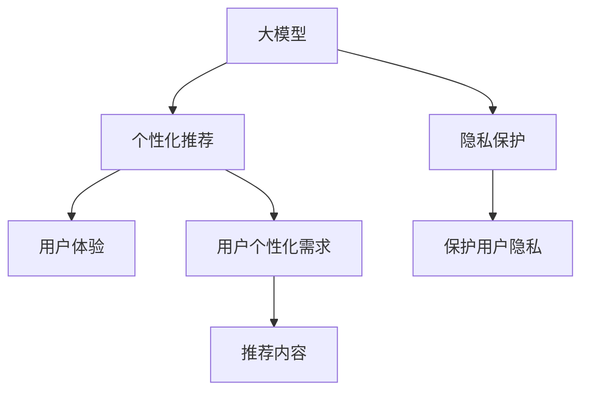

                 

# AI大模型：优化电商平台用户体验个性化与隐私保护平衡的新方法

> 关键词：大模型, 个性化推荐, 用户体验, 隐私保护, 深度学习, 电商平台

## 1. 背景介绍

### 1.1 问题由来
随着电商平台的兴起，个性化推荐已成为用户购物体验提升的关键。传统的推荐算法基于用户的显式行为数据（如浏览、点击、购买等）进行推荐，但这些数据通常覆盖面有限，且难以捕捉用户深层次的兴趣和需求。

为解决这一问题，近年来大模型技术被引入电商推荐领域。大模型通过大量无标签文本数据进行预训练，学习到丰富的语言知识，能够在一定程度上弥补传统算法在用户兴趣挖掘方面的不足。同时，大模型还可以应用于自然语言处理（NLP）任务，如智能客服、情感分析等，进一步提升用户体验。

然而，大模型对数据的依赖使其在处理用户隐私方面存在一定的风险。如何在个性化推荐中平衡用户体验与隐私保护，成为当前电商行业亟需解决的难题。

### 1.2 问题核心关键点
为优化电商平台的用户体验，同时兼顾隐私保护，本文将探讨如何在大模型技术的基础上，设计一种有效的推荐系统，既能利用大模型的强大语言理解能力，又能保护用户隐私，实现个性化推荐。

具体而言，本研究聚焦于以下几个核心问题：
1. **如何设计隐私友好的推荐算法**：避免直接收集用户的显式行为数据，尽量从文本数据中提取用户兴趣，以保护用户隐私。
2. **如何优化大模型的性能**：在保护用户隐私的前提下，提高推荐系统的个性化和精准性。
3. **如何在实际应用中平衡个性化与隐私保护**：结合实际需求和法律法规，找到最佳平衡点。

## 2. 核心概念与联系

### 2.1 核心概念概述

为更好地理解如何在电商平台中应用大模型技术，并平衡用户体验与隐私保护，本节将介绍几个关键概念：

- **大模型（Large Models）**：指通过大规模数据预训练得到的神经网络模型，如BERT、GPT等。这些模型通常具有强大的语言理解和生成能力，能够处理复杂的自然语言任务。

- **个性化推荐系统（Personalized Recommendation System）**：根据用户的个性化需求，推荐合适的商品或内容。个性化推荐系统已经成为电商平台提升用户体验的重要手段。

- **隐私保护（Privacy Protection）**：在数据处理过程中，采取措施保护用户隐私，防止个人信息被滥用或泄露。

- **深度学习（Deep Learning）**：一种通过多层神经网络进行数据处理和学习的技术。深度学习在大模型中得到了广泛应用，能够有效提取文本中的高层次语义信息。

- **电商平台（E-commerce Platform）**：提供在线商品展示、交易和服务的平台，如淘宝、京东等。个性化推荐在电商平台上应用广泛，是提升用户体验的重要手段。

这些核心概念之间的逻辑关系可以通过以下Mermaid流程图来展示：



这个流程图展示了大模型、个性化推荐、隐私保护、用户体验之间的关系：

1. 大模型通过预训练学习丰富的语言知识，能够用于个性化推荐。
2. 个性化推荐系统根据用户需求推荐商品，提升用户体验。
3. 隐私保护确保在推荐过程中保护用户隐私，防止数据泄露。
4. 用户体验和隐私保护是推荐系统的重要目标，需要在设计过程中加以平衡。

## 3. 核心算法原理 & 具体操作步骤
### 3.1 算法原理概述

在电商平台中，基于大模型的个性化推荐系统主要由以下几个步骤组成：

1. **数据预处理**：收集电商平台的商品评论、描述等文本数据，对其进行预处理，包括分词、去除停用词、构建词汇表等。
2. **模型预训练**：使用大规模无标签文本数据对大模型进行预训练，学习语言知识。
3. **任务适配**：将预训练模型应用于电商平台的个性化推荐任务，通过微调或fine-tuning进行任务适配。
4. **推荐生成**：将用户的输入（如搜索词、浏览记录）作为输入，利用模型输出推荐结果。

### 3.2 算法步骤详解

接下来，我们将详细介绍每个步骤的详细步骤：

**Step 1: 数据预处理**
- 收集电商平台商品评论、描述等文本数据，进行预处理。包括分词、去除停用词、构建词汇表等。
- 将文本数据转换为模型可接受的格式，如Word2Vec、BERT等。

**Step 2: 模型预训练**
- 使用大规模无标签文本数据（如维基百科、新闻等）对大模型进行预训练。
- 通常使用自监督学习任务，如语言建模、掩码语言模型等。

**Step 3: 任务适配**
- 根据电商平台推荐任务的需求，对预训练模型进行微调或fine-tuning。
- 设计合适的损失函数，如交叉熵、均方误差等。
- 选择适用的优化算法，如Adam、SGD等。

**Step 4: 推荐生成**
- 将用户的输入（如搜索词、浏览记录）作为输入，利用模型输出推荐结果。
- 可以使用多轮交互的方式，不断调整推荐结果，直到用户满意。

### 3.3 算法优缺点

基于大模型的个性化推荐系统具有以下优点：
1. **高效性**：大模型能够快速处理大量的文本数据，生成推荐结果。
2. **广泛性**：能够处理多种类型的文本数据，涵盖商品描述、评论、用户反馈等。
3. **个性化**：利用大模型的语言理解能力，能够更精准地捕捉用户兴趣。

同时，该方法也存在一定的局限性：
1. **依赖数据**：需要大量的文本数据进行预训练，数据获取和处理成本较高。
2. **隐私风险**：用户输入的搜索词等可能包含隐私信息，需要采取措施保护用户隐私。
3. **资源消耗**：大模型通常具有较大的参数量，对计算资源的要求较高。
4. **模型复杂性**：大模型的训练和优化过程较为复杂，需要丰富的经验和专业知识。

### 3.4 算法应用领域

基于大模型的个性化推荐系统在电商平台中有着广泛的应用前景，如商品推荐、个性化搜索、内容推荐等。具体应用场景包括：

- **商品推荐**：根据用户的历史浏览、购买记录，推荐合适的商品。
- **个性化搜索**：在用户搜索时，根据搜索词推荐相关商品。
- **内容推荐**：根据用户的阅读历史、评价等，推荐相关商品。

此外，大模型技术还可以应用于智能客服、情感分析等任务，进一步提升电商平台的综合竞争力。

## 4. 数学模型和公式 & 详细讲解 & 举例说明

### 4.1 数学模型构建

本节将使用数学语言对基于大模型的个性化推荐系统进行更加严格的刻画。

假设电商平台的推荐任务为商品推荐，其中商品为$X$，用户的输入为$Y$，推荐结果为$Z$。定义模型$f$为：

$$
f(Y; \theta) = Z
$$

其中$\theta$为模型参数，$f(Y; \theta)$为模型输出，即推荐结果。

### 4.2 公式推导过程

在推荐系统中，通常使用交叉熵损失函数进行训练。假设模型的预测结果为$\hat{Z}$，真实结果为$Z$，则交叉熵损失函数为：

$$
\ell(Y, \hat{Z}) = -\frac{1}{N} \sum_{i=1}^N [y_i\log \hat{z_i} + (1-y_i)\log (1-\hat{z_i})]
$$

其中$N$为样本数量，$y_i$为真实标签（0或1），$\hat{z_i}$为模型预测结果。

目标是最小化交叉熵损失函数，即：

$$
\theta^* = \mathop{\arg\min}_{\theta} \ell(Y, f(Y; \theta))
$$

在得到损失函数的梯度后，即可带入参数更新公式，完成模型的迭代优化。重复上述过程直至收敛，最终得到适应电商推荐任务的最优模型参数$\theta^*$。

### 4.3 案例分析与讲解

以电商平台商品推荐为例，假设用户输入的搜索词为“电子书”，推荐系统需要输出相关的商品。具体步骤包括：

1. 预处理输入数据：将搜索词“电子书”转换为模型可接受的格式。
2. 使用预训练的大模型对输入进行编码。
3. 使用交叉熵损失函数计算模型的预测结果与真实结果之间的差异。
4. 根据损失函数的梯度更新模型参数，生成推荐结果。
5. 将推荐结果呈现给用户，用户反馈满意度后，模型进一步调整。

## 5. 项目实践：代码实例和详细解释说明
### 5.1 开发环境搭建

在进行个性化推荐系统的开发前，我们需要准备好开发环境。以下是使用Python进行PyTorch开发的环境配置流程：

1. 安装Anaconda：从官网下载并安装Anaconda，用于创建独立的Python环境。

2. 创建并激活虚拟环境：
```bash
conda create -n pytorch-env python=3.8 
conda activate pytorch-env
```

3. 安装PyTorch：根据CUDA版本，从官网获取对应的安装命令。例如：
```bash
conda install pytorch torchvision torchaudio cudatoolkit=11.1 -c pytorch -c conda-forge
```

4. 安装HuggingFace库：
```bash
pip install transformers
```

5. 安装各类工具包：
```bash
pip install numpy pandas scikit-learn matplotlib tqdm jupyter notebook ipython
```

完成上述步骤后，即可在`pytorch-env`环境中开始推荐系统的开发。

### 5.2 源代码详细实现

下面我们以商品推荐系统为例，给出使用Transformers库对BERT模型进行微调的PyTorch代码实现。

首先，定义推荐任务的数据处理函数：

```python
from transformers import BertTokenizer
from torch.utils.data import Dataset
import torch

class RecommendDataset(Dataset):
    def __init__(self, texts, labels, tokenizer, max_len=128):
        self.texts = texts
        self.labels = labels
        self.tokenizer = tokenizer
        self.max_len = max_len
        
    def __len__(self):
        return len(self.texts)
    
    def __getitem__(self, item):
        text = self.texts[item]
        label = self.labels[item]
        
        encoding = self.tokenizer(text, return_tensors='pt', max_length=self.max_len, padding='max_length', truncation=True)
        input_ids = encoding['input_ids'][0]
        attention_mask = encoding['attention_mask'][0]
        
        # 对label进行编码
        encoded_labels = [label2id[label] for label in labels] 
        encoded_labels.extend([label2id['0']] * (self.max_len - len(encoded_labels)))
        labels = torch.tensor(encoded_labels, dtype=torch.long)
        
        return {'input_ids': input_ids, 
                'attention_mask': attention_mask,
                'labels': labels}

# 标签与id的映射
label2id = {'0': 0, '1': 1}
id2label = {v: k for k, v in label2id.items()}

# 创建dataset
tokenizer = BertTokenizer.from_pretrained('bert-base-cased')

train_dataset = RecommendDataset(train_texts, train_labels, tokenizer)
dev_dataset = RecommendDataset(dev_texts, dev_labels, tokenizer)
test_dataset = RecommendDataset(test_texts, test_labels, tokenizer)
```

然后，定义模型和优化器：

```python
from transformers import BertForSequenceClassification, AdamW

model = BertForSequenceClassification.from_pretrained('bert-base-cased', num_labels=2)

optimizer = AdamW(model.parameters(), lr=2e-5)
```

接着，定义训练和评估函数：

```python
from torch.utils.data import DataLoader
from tqdm import tqdm
from sklearn.metrics import accuracy_score

device = torch.device('cuda') if torch.cuda.is_available() else torch.device('cpu')
model.to(device)

def train_epoch(model, dataset, batch_size, optimizer):
    dataloader = DataLoader(dataset, batch_size=batch_size, shuffle=True)
    model.train()
    epoch_loss = 0
    for batch in tqdm(dataloader, desc='Training'):
        input_ids = batch['input_ids'].to(device)
        attention_mask = batch['attention_mask'].to(device)
        labels = batch['labels'].to(device)
        model.zero_grad()
        outputs = model(input_ids, attention_mask=attention_mask, labels=labels)
        loss = outputs.loss
        epoch_loss += loss.item()
        loss.backward()
        optimizer.step()
    return epoch_loss / len(dataloader)

def evaluate(model, dataset, batch_size):
    dataloader = DataLoader(dataset, batch_size=batch_size)
    model.eval()
    preds, labels = [], []
    with torch.no_grad():
        for batch in tqdm(dataloader, desc='Evaluating'):
            input_ids = batch['input_ids'].to(device)
            attention_mask = batch['attention_mask'].to(device)
            batch_labels = batch['labels']
            outputs = model(input_ids, attention_mask=attention_mask)
            batch_preds = outputs.logits.argmax(dim=2).to('cpu').tolist()
            batch_labels = batch_labels.to('cpu').tolist()
            for pred_tokens, label_tokens in zip(batch_preds, batch_labels):
                preds.append(pred_tokens[:len(label_tokens)])
                labels.append(label_tokens)
                
    print(accuracy_score(labels, preds))
```

最后，启动训练流程并在测试集上评估：

```python
epochs = 5
batch_size = 16

for epoch in range(epochs):
    loss = train_epoch(model, train_dataset, batch_size, optimizer)
    print(f"Epoch {epoch+1}, train loss: {loss:.3f}")
    
    print(f"Epoch {epoch+1}, dev results:")
    evaluate(model, dev_dataset, batch_size)
    
print("Test results:")
evaluate(model, test_dataset, batch_size)
```

以上就是使用PyTorch对BERT进行商品推荐任务微调的完整代码实现。可以看到，得益于Transformers库的强大封装，我们可以用相对简洁的代码完成BERT模型的加载和微调。

### 5.3 代码解读与分析

让我们再详细解读一下关键代码的实现细节：

**RecommendDataset类**：
- `__init__`方法：初始化文本、标签、分词器等关键组件。
- `__len__`方法：返回数据集的样本数量。
- `__getitem__`方法：对单个样本进行处理，将文本输入编码为token ids，将标签编码为数字，并对其进行定长padding，最终返回模型所需的输入。

**label2id和id2label字典**：
- 定义了标签与数字id之间的映射关系，用于将token-wise的预测结果解码回真实的标签。

**训练和评估函数**：
- 使用PyTorch的DataLoader对数据集进行批次化加载，供模型训练和推理使用。
- 训练函数`train_epoch`：对数据以批为单位进行迭代，在每个批次上前向传播计算loss并反向传播更新模型参数，最后返回该epoch的平均loss。
- 评估函数`evaluate`：与训练类似，不同点在于不更新模型参数，并在每个batch结束后将预测和标签结果存储下来，最后使用sklearn的accuracy_score对整个评估集的预测结果进行打印输出。

**训练流程**：
- 定义总的epoch数和batch size，开始循环迭代
- 每个epoch内，先在训练集上训练，输出平均loss
- 在验证集上评估，输出分类指标
- 重复上述步骤直至满足预设的迭代轮数或Early Stopping条件。

可以看到，PyTorch配合Transformers库使得BERT微调的代码实现变得简洁高效。开发者可以将更多精力放在数据处理、模型改进等高层逻辑上，而不必过多关注底层的实现细节。

当然，工业级的系统实现还需考虑更多因素，如模型的保存和部署、超参数的自动搜索、更灵活的任务适配层等。但核心的微调范式基本与此类似。

## 6. 实际应用场景
### 6.1 智能客服系统

在电商平台中，智能客服系统能够24小时在线，提供即时咨询服务，大大提升了用户体验。使用微调后的BERT模型，可以自动理解用户的查询意图，匹配最佳答案模板，从而实现智能客服。

在技术实现上，可以收集用户的历史咨询记录，将问题-答案对作为微调数据，训练模型学习匹配答案。对于新问题，可以通过检索系统实时搜索相关内容，动态组织生成回答。如此构建的智能客服系统，能大幅提升客户咨询体验和问题解决效率。

### 6.2 个性化推荐系统

电商平台通常拥有大量的商品和用户数据，如何根据用户行为推荐合适商品，提升用户购买转化率，是电商推荐系统的核心目标。

在微调中，可以使用商品评论、用户评论等文本数据作为输入，通过BERT模型学习用户对商品的情感倾向。同时，还可以结合用户的浏览、点击等行为数据，进行联合建模，生成更加个性化的推荐结果。

### 6.3 个性化搜索

电商平台搜索功能已经成为用户获取商品的重要途径。使用微调后的BERT模型，可以实时分析用户的输入搜索词，提取关键信息，生成推荐商品列表。

在搜索过程中，系统可以不断优化输入处理方式和模型参数，提升搜索结果的准确性和相关性，提升用户体验。

### 6.4 未来应用展望

随着大模型和微调方法的不断发展，基于微调范式将在更多领域得到应用，为电商平台带来变革性影响。

在智慧物流领域，基于微调的路径规划、库存管理等应用将提升物流效率，降低运营成本。

在智能广告投放中，基于微调的广告推荐系统将提升广告点击率和转化率，优化广告投放效果。

在智慧营销中，基于微调的客户分析、品牌推荐等应用将提高营销活动的精准度和ROI。

此外，在金融、医疗、旅游等众多领域，基于大模型微调的人工智能应用也将不断涌现，为电商平台带来新的商业机会。相信随着技术的日益成熟，微调方法将成为电商平台应用的重要范式，推动电商平台的智能化进程。

## 7. 工具和资源推荐
### 7.1 学习资源推荐

为了帮助开发者系统掌握大模型技术在电商平台中的应用，这里推荐一些优质的学习资源：

1. **《Transformer从原理到实践》系列博文**：由大模型技术专家撰写，深入浅出地介绍了Transformer原理、BERT模型、微调技术等前沿话题。

2. **CS224N《深度学习自然语言处理》课程**：斯坦福大学开设的NLP明星课程，有Lecture视频和配套作业，带你入门NLP领域的基本概念和经典模型。

3. **《Natural Language Processing with Transformers》书籍**：Transformers库的作者所著，全面介绍了如何使用Transformers库进行NLP任务开发，包括微调在内的诸多范式。

4. **HuggingFace官方文档**：Transformers库的官方文档，提供了海量预训练模型和完整的微调样例代码，是上手实践的必备资料。

5. **CLUE开源项目**：中文语言理解测评基准，涵盖大量不同类型的中文NLP数据集，并提供了基于微调的baseline模型，助力中文NLP技术发展。

通过对这些资源的学习实践，相信你一定能够快速掌握大模型技术在电商平台中的应用，并用于解决实际的NLP问题。

### 7.2 开发工具推荐

高效的开发离不开优秀的工具支持。以下是几款用于大模型微调开发的常用工具：

1. **PyTorch**：基于Python的开源深度学习框架，灵活动态的计算图，适合快速迭代研究。大部分预训练语言模型都有PyTorch版本的实现。

2. **TensorFlow**：由Google主导开发的开源深度学习框架，生产部署方便，适合大规模工程应用。同样有丰富的预训练语言模型资源。

3. **Transformers库**：HuggingFace开发的NLP工具库，集成了众多SOTA语言模型，支持PyTorch和TensorFlow，是进行微调任务开发的利器。

4. **Weights & Biases**：模型训练的实验跟踪工具，可以记录和可视化模型训练过程中的各项指标，方便对比和调优。与主流深度学习框架无缝集成。

5. **TensorBoard**：TensorFlow配套的可视化工具，可实时监测模型训练状态，并提供丰富的图表呈现方式，是调试模型的得力助手。

6. **Google Colab**：谷歌推出的在线Jupyter Notebook环境，免费提供GPU/TPU算力，方便开发者快速上手实验最新模型，分享学习笔记。

合理利用这些工具，可以显著提升大模型微调的开发效率，加快创新迭代的步伐。

### 7.3 相关论文推荐

大模型和微调技术的发展源于学界的持续研究。以下是几篇奠基性的相关论文，推荐阅读：

1. **Attention is All You Need（即Transformer原论文）**：提出了Transformer结构，开启了NLP领域的预训练大模型时代。

2. **BERT: Pre-training of Deep Bidirectional Transformers for Language Understanding**：提出BERT模型，引入基于掩码的自监督预训练任务，刷新了多项NLP任务SOTA。

3. **Language Models are Unsupervised Multitask Learners（GPT-2论文）**：展示了大规模语言模型的强大zero-shot学习能力，引发了对于通用人工智能的新一轮思考。

4. **Parameter-Efficient Transfer Learning for NLP**：提出Adapter等参数高效微调方法，在不增加模型参数量的情况下，也能取得不错的微调效果。

5. **Fine-tune Pre-trained Embeddings for Sequence Labeling**：介绍使用预训练嵌入进行序列标注任务的微调方法，提供了详细的实验和代码实现。

这些论文代表了大模型微调技术的发展脉络。通过学习这些前沿成果，可以帮助研究者把握学科前进方向，激发更多的创新灵感。

## 8. 总结：未来发展趋势与挑战

### 8.1 总结

本文对基于大模型的个性化推荐系统进行了全面系统的介绍。首先阐述了在电商平台中应用大模型的背景和意义，明确了微调在提升用户体验、保护用户隐私方面的独特价值。其次，从原理到实践，详细讲解了微调的数学原理和关键步骤，给出了微调任务开发的完整代码实例。同时，本文还广泛探讨了微调方法在智能客服、个性化推荐、个性化搜索等多个电商应用场景中的应用前景，展示了微调范式的巨大潜力。

通过本文的系统梳理，可以看到，基于大模型的个性化推荐系统已经成为电商平台提升用户体验的重要手段，极大地丰富了电商平台的业务功能和用户价值。未来，伴随大模型和微调方法的持续演进，相信基于微调范式的电商推荐系统将在更多的电商应用场景中得到广泛应用，为电商平台的智能化转型提供新的动力。

### 8.2 未来发展趋势

展望未来，大模型微调技术在电商平台中的应用将呈现以下几个发展趋势：

1. **模型规模不断增大**：随着算力成本的下降和数据规模的扩张，预训练语言模型的参数量还将持续增长。超大规模语言模型蕴含的丰富语言知识，有望支撑更加复杂多变的电商推荐场景。

2. **算法多样性增强**：除了传统的全参数微调外，未来会涌现更多参数高效的微调方法，如Adapter、Prefix等，在节省计算资源的同时也能保证微调精度。

3. **多模态融合**：当前的电商推荐主要聚焦于文本数据，未来会进一步拓展到图像、视频、语音等多模态数据微调。多模态信息的融合，将显著提升推荐系统的性能和灵活性。

4. **隐私保护成为常态**：在数据处理过程中，越来越多的法律法规要求保护用户隐私。如何在推荐系统中更好地保护用户隐私，将成为未来的重要研究方向。

5. **实时推荐系统**：为了提升用户体验，未来的电商推荐系统将更加注重实时性。如何设计高效的实时推荐算法，是未来的一个重要研究方向。

6. **跨平台推荐**：未来的电商推荐系统将不仅限于单一平台，而是跨平台、跨渠道的综合推荐系统。如何在不同平台间实现无缝对接和数据融合，是未来的重要研究方向。

以上趋势凸显了大模型微调技术在电商平台中的广阔前景。这些方向的探索发展，必将进一步提升电商推荐系统的性能和用户体验，为电商平台的智能化转型提供新的动力。

### 8.3 面临的挑战

尽管大模型微调技术在电商平台中取得了显著成效，但在迈向更加智能化、普适化应用的过程中，仍面临以下挑战：

1. **数据隐私问题**：电商平台的推荐系统依赖于用户的数据，如何保护用户隐私，防止数据泄露，是当前的主要挑战。

2. **模型复杂性**：大模型通常具有较大的参数量，对计算资源的要求较高，如何提高模型训练和推理的效率，是未来的重要研究方向。

3. **多场景适配**：电商推荐系统需要适应多种电商场景，如何设计通用的推荐模型，适配不同平台和渠道，是未来的重要研究方向。

4. **用户个性化需求多样性**：不同用户的个性化需求千差万别，如何设计更灵活的推荐模型，适应多变的用户需求，是未来的重要研究方向。

5. **推荐系统透明度**：如何提升推荐系统的透明度，增强用户对推荐结果的信任度，是未来的重要研究方向。

6. **推荐效果评估**：如何设计更科学的推荐效果评估指标，全面评估推荐系统的性能，是未来的重要研究方向。

### 8.4 研究展望

面对大模型微调技术在电商平台中面临的挑战，未来的研究需要在以下几个方面寻求新的突破：

1. **隐私保护技术**：开发更高效、更安全的隐私保护技术，如差分隐私、联邦学习等，保护用户隐私。

2. **模型压缩与优化**：研究模型压缩与优化技术，如剪枝、量化等，提高模型训练和推理效率。

3. **跨平台推荐系统**：设计通用的跨平台推荐系统，实现不同平台间的无缝对接和数据融合。

4. **个性化推荐算法**：开发更灵活、更高效的个性化推荐算法，满足用户多样化的需求。

5. **推荐系统透明度**：提升推荐系统的透明度，增强用户对推荐结果的信任度。

6. **推荐效果评估**：设计更科学的推荐效果评估指标，全面评估推荐系统的性能。

这些研究方向的探索，必将引领大模型微调技术在电商平台中的进一步发展，为电商平台带来更智能、更高效、更安全的推荐系统。

## 9. 附录：常见问题与解答

**Q1：如何选择合适的预训练语言模型？**

A: 在电商平台中，选择合适的预训练语言模型需要考虑多个因素，如数据类型、任务需求、计算资源等。通常情况下，可以选择BERT、GPT等通用的预训练模型，或者根据特定任务需求选择针对性较强的预训练模型，如E-commerceBERT、DialogBERT等。

**Q2：如何在电商推荐中避免过拟合？**

A: 在电商推荐中，为了避免过拟合，可以采取以下措施：
1. 数据增强：通过对训练数据进行扩充，如回译、近义词替换等，增加训练数据的多样性。
2. 正则化：使用L2正则、Dropout等技术，防止模型过拟合。
3. 早停机制：在验证集上监控模型性能，一旦性能不再提升，立即停止训练，避免过拟合。

**Q3：如何在电商推荐中平衡个性化和隐私保护？**

A: 在电商推荐中平衡个性化和隐私保护，可以从以下几个方面入手：
1. 数据匿名化：对用户数据进行匿名化处理，去除敏感信息。
2. 差分隐私：在模型训练过程中，使用差分隐私技术，保护用户隐私。
3. 联邦学习：将模型训练任务分布到多个设备上，减少对中心服务器的依赖，保护用户数据隐私。

**Q4：如何在电商推荐中提高推荐系统的实时性？**

A: 在电商推荐中提高推荐系统的实时性，可以从以下几个方面入手：
1. 缓存推荐结果：对高频查询进行缓存，减少重复计算。
2. 异步更新模型：将模型更新任务异步执行，减少对实时推理的影响。
3. 分布式计算：使用分布式计算框架，提升模型训练和推理效率。

**Q5：如何在电商推荐中设计通用的推荐模型？**

A: 在电商推荐中设计通用的推荐模型，可以从以下几个方面入手：
1. 模块化设计：将推荐模型设计为多个模块，分别处理不同类型的推荐任务。
2. 多模态融合：将多种类型的数据进行融合，提升推荐系统的性能和灵活性。
3. 用户画像建模：建立用户画像模型，捕捉用户的兴趣和需求。

这些问题的探讨，将帮助电商推荐系统设计更加智能、安全、高效的推荐模型，提升用户体验，保护用户隐私，优化电商平台运营。

---

作者：禅与计算机程序设计艺术 / Zen and the Art of Computer Programming

