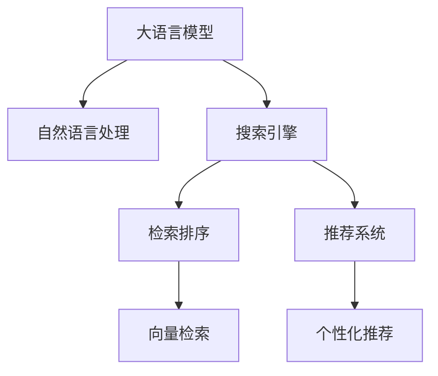

                 

# AI大模型：提升电商平台搜索速度的新方法

> 关键词：大语言模型,自然语言处理(NLP),搜索引擎,检索排序,预训练模型,向量检索,推荐系统

## 1. 背景介绍

### 1.1 问题由来
随着电子商务的迅猛发展，电商平台已成为消费者购买商品的重要渠道。然而，面对海量的商品信息，如何高效地满足用户的查询需求，提升搜索速度和质量，成为了电商平台亟需解决的问题。

传统的搜索引擎主要依赖于文本匹配技术，通过倒排索引和布尔查询等方法进行关键字检索和排序。这种方法在面对海量数据和高并发访问时，效率低下，且难以适应自然语言查询和复杂的语义理解需求。因此，利用大语言模型提升搜索性能，成为电商平台新的研究热点。

### 1.2 问题核心关键点
面向电商平台搜索的AI大模型应用，主要面临以下几个核心问题：

- **数据规模**：电商平台需要处理的数据量极大，如何高效存储和处理这些数据是关键。
- **查询处理**：如何理解用户自然语言查询，准确检索到相关商品信息，并提供排名的排序机制。
- **实时响应**：电商平台需要快速响应用户的搜索请求，搜索结果要尽可能地实时返回。
- **个性化推荐**：在搜索结果之外，如何进一步优化个性化推荐，提升用户体验。

## 2. 核心概念与联系

### 2.1 核心概念概述

为更好地理解如何利用AI大模型提升电商平台搜索速度，本节将介绍几个密切相关的核心概念：

- **大语言模型(Large Language Model, LLM)**：以自回归(如GPT)或自编码(如BERT)模型为代表的大规模预训练语言模型。通过在大规模无标签文本语料上进行预训练，学习通用的语言表示，具备强大的语言理解和生成能力。

- **自然语言处理(Natural Language Processing, NLP)**：处理、分析和生成自然语言文本的计算技术，包括文本分类、信息抽取、文本生成等。

- **搜索引擎(Search Engine)**：通过搜索算法和算法处理，提供相关文本检索、信息推荐和相关性排序的系统。

- **检索排序(Retrieval and Ranking)**：搜索引擎的核心组件，分别用于检索文本和排序搜索结果，保证用户查询的相关性和排序的准确性。

- **向量检索(Vector Retrieval)**：将文本转换为高维向量，通过向量间距离度量计算相似性，进行文本检索和推荐。

- **推荐系统(Recommendation System)**：通过用户行为、商品属性等数据，预测用户可能感兴趣的物品，并提供个性化推荐。

这些核心概念之间的逻辑关系可以通过以下Mermaid流程图来展示：



这个流程图展示了大语言模型与搜索、推荐等组件的相互关系：

1. 大语言模型通过预训练获得基础能力，用于处理自然语言查询。
2. 搜索引擎利用大语言模型的输出，通过检索排序组件，返回相关性排序的搜索结果。
3. 推荐系统进一步利用检索结果，提供个性化推荐，提升用户体验。

## 3. 核心算法原理 & 具体操作步骤
### 3.1 算法原理概述

面向电商平台搜索的大语言模型应用，本质上是一个多任务学习过程，包括检索排序和推荐系统的多任务协同优化。其核心思想是：将预训练的大语言模型视作一个强大的特征提取器，通过搜索引擎的检索排序机制，优化搜索结果的相关性和排序质量，并通过推荐系统的协同训练，提升个性化推荐的准确性。

具体而言，通过以下步骤实现：

1. **预训练**：在大规模无标签文本数据上，使用自监督学习任务训练通用语言模型。
2. **检索排序**：利用检索排序组件，将用户查询与商品描述转换为向量，计算相似性并排序。
3. **推荐系统**：将排序后的结果作为输入，结合用户行为和商品属性，预测用户可能感兴趣的物品，进行个性化推荐。

### 3.2 算法步骤详解

面向电商平台搜索的大语言模型应用，主要包含以下关键步骤：

**Step 1: 数据准备**
- 收集电商平台商品信息、用户查询、历史行为等数据，进行预处理和标注。
- 将文本数据作为训练样本，构建适用于检索排序和推荐系统的数据集。

**Step 2: 构建预训练模型**
- 使用GPT、BERT等大语言模型作为基础，通过自监督学习任务进行预训练。
- 微调模型，使其能够处理自然语言查询，并生成商品描述的文本表示。

**Step 3: 添加检索排序组件**
- 利用向量检索技术，将用户查询和商品描述转换为高维向量，计算向量间距离，并按距离排序。
- 使用排序算法优化排序结果，如基于最大相关性排序(Maximal Relevance Ranking)、基于排名相关性排序(Pairwise Ranking)等。

**Step 4: 结合推荐系统**
- 将排序后的结果作为输入，使用推荐算法预测用户可能感兴趣的物品。
- 结合用户行为和商品属性，进行个性化推荐。

**Step 5: 部署和优化**
- 将训练好的模型部署到服务器，构建实时搜索系统。
- 根据实际访问量，进行模型性能调优和资源分配。

### 3.3 算法优缺点

面向电商平台搜索的大语言模型应用，具有以下优点：
1. **高效检索**：大语言模型能够处理自然语言查询，提升检索效率和精度。
2. **个性化推荐**：结合推荐系统，提供更加精准的个性化推荐，提升用户体验。
3. **多任务协同**：检索排序和推荐系统协同优化，整体提升搜索和推荐效果。
4. **灵活扩展**：基于大模型，可以灵活应对不同领域和场景的搜索需求。

同时，该方法也存在一定的局限性：
1. **数据质量依赖**：模型效果高度依赖于训练数据的质量和多样性。
2. **计算资源消耗大**：大模型的参数量较大，检索排序和推荐系统需要高性能计算资源支持。
3. **维护成本高**：大规模模型的维护和管理，需要大量人力和技术支持。

尽管存在这些局限性，但就目前而言，基于大语言模型的搜索方法仍是在线搜索应用的主流范式。未来相关研究的重点在于如何进一步降低计算成本，提高模型效果，同时兼顾模型的可解释性和稳定性。

### 3.4 算法应用领域

面向电商平台搜索的大语言模型应用，已经在多个领域得到了广泛的应用，例如：

- **搜索引擎**：在搜索引擎中，通过大语言模型处理用户查询，结合向量检索和排序算法，返回相关性高的搜索结果。
- **推荐系统**：在推荐系统中，利用大语言模型处理用户评论、商品描述等文本数据，预测用户可能感兴趣的商品，进行个性化推荐。
- **智能客服**：在智能客服系统中，利用大语言模型理解用户查询，提供精准的搜索结果和推荐，提升客户服务质量。
- **智慧零售**：在智慧零售平台中，通过大语言模型处理客户评价和反馈，提升商品推荐和店铺排名的准确性。

除了上述这些经典应用外，大语言模型还在更多场景中得到了创新性的应用，如语音搜索、情感分析、商品分类等，为电商平台带来了新的技术突破。

## 4. 数学模型和公式 & 详细讲解 & 举例说明
### 4.1 数学模型构建

本节将使用数学语言对大语言模型在电商平台搜索中的应用进行更加严格的刻画。

记大语言模型为 $M_{\theta}$，其中 $\theta$ 为模型参数。设电商平台商品信息为 $\mathcal{X}$，用户查询为 $\mathcal{Q}$，商品描述为 $\mathcal{D}$。

定义用户查询与商品描述的相似性函数为 $s(q,d)$，如余弦相似度、欧氏距离等。定义排序函数为 $r(q,\mathcal{D})$，用于计算查询和描述的排序结果。

则检索排序的数学模型可以表示为：

$$
\hat{\mathcal{D}} = \mathop{\arg\min}_{d \in \mathcal{D}} \sum_{q \in \mathcal{Q}} s(q, M_{\theta}(d)) \cdot r(q,\mathcal{D})
$$

其中 $\mathcal{D}=\{d_i\}_{i=1}^N$，$\mathcal{Q}=\{q_j\}_{j=1}^M$，$\hat{\mathcal{D}}$ 为最终的排序结果。

### 4.2 公式推导过程

以下我们以余弦相似度为例，推导检索排序的损失函数及其梯度的计算公式。

假设用户查询 $q$ 和商品描述 $d$ 通过大语言模型转换为向量表示 $q' = M_{\theta}(q)$ 和 $d' = M_{\theta}(d)$。则余弦相似度定义为：

$$
s(q, d) = \cos(\theta) = \frac{q' \cdot d'}{\|q'\| \cdot \|d'\|}
$$

则检索排序的损失函数为：

$$
\mathcal{L}(\theta) = \frac{1}{M} \sum_{q \in \mathcal{Q}} \frac{1}{N} \sum_{i=1}^N s(q, d_i) \cdot r(q,\mathcal{D})
$$

其中 $r(q,\mathcal{D})$ 可以采用多种排序算法，如基于最大相关性排序、基于排名相关性排序等。

根据链式法则，损失函数对参数 $\theta$ 的梯度为：

$$
\frac{\partial \mathcal{L}(\theta)}{\partial \theta} = \frac{1}{M} \sum_{q \in \mathcal{Q}} \frac{1}{N} \sum_{i=1}^N \frac{\partial s(q, d_i)}{\partial \theta} \cdot r(q,\mathcal{D})
$$

其中 $\frac{\partial s(q, d_i)}{\partial \theta}$ 可以通过反向传播算法高效计算。

在得到损失函数的梯度后，即可带入优化算法(如AdamW)，更新模型参数 $\theta$，最小化损失函数 $\mathcal{L}(\theta)$。

### 4.3 案例分析与讲解

以电商平台商品描述的文本生成为例，展示大语言模型在检索排序中的应用。

假设电商平台商品描述为 $d_i$，用户查询为 $q_j$，大语言模型 $M_{\theta}$ 的输出为 $d'_i$。使用余弦相似度作为相似性函数，排序算法为基于排名相关性排序，则检索排序的损失函数为：

$$
\mathcal{L}(\theta) = \frac{1}{M} \sum_{q \in \mathcal{Q}} \frac{1}{N} \sum_{i=1}^N \cos(\theta) \cdot r(q,\mathcal{D})
$$

其中 $r(q,\mathcal{D})$ 为基于排名相关性排序的函数，计算查询与描述的排序相关性。

将损失函数对参数 $\theta$ 的梯度带入优化算法，不断更新模型参数 $\theta$，最小化损失函数 $\mathcal{L}(\theta)$。

## 5. 项目实践：代码实例和详细解释说明
### 5.1 开发环境搭建

在进行电商平台搜索的AI大模型实践前，我们需要准备好开发环境。以下是使用Python进行PyTorch开发的环境配置流程：

1. 安装Anaconda：从官网下载并安装Anaconda，用于创建独立的Python环境。

2. 创建并激活虚拟环境：
```bash
conda create -n pytorch-env python=3.8 
conda activate pytorch-env
```

3. 安装PyTorch：根据CUDA版本，从官网获取对应的安装命令。例如：
```bash
conda install pytorch torchvision torchaudio cudatoolkit=11.1 -c pytorch -c conda-forge
```

4. 安装Transformers库：
```bash
pip install transformers
```

5. 安装各类工具包：
```bash
pip install numpy pandas scikit-learn matplotlib tqdm jupyter notebook ipython
```

完成上述步骤后，即可在`pytorch-env`环境中开始搜索任务的开发。

### 5.2 源代码详细实现

这里我们以基于大语言模型的电商平台搜索系统为例，给出完整的代码实现。

首先，定义数据处理函数：

```python
from transformers import BertTokenizer
from torch.utils.data import Dataset
import torch

class SearchDataset(Dataset):
    def __init__(self, texts, queries, tokenizer, max_len=128):
        self.texts = texts
        self.queries = queries
        self.tokenizer = tokenizer
        self.max_len = max_len
        
    def __len__(self):
        return len(self.texts)
    
    def __getitem__(self, item):
        text = self.texts[item]
        query = self.queries[item]
        
        encoding = self.tokenizer(text, return_tensors='pt', max_length=self.max_len, padding='max_length', truncation=True)
        input_ids = encoding['input_ids'][0]
        attention_mask = encoding['attention_mask'][0]
        
        # 对查询进行编码
        query_encoding = self.tokenizer(query, return_tensors='pt', max_length=self.max_len, padding='max_length', truncation=True)
        query_input_ids = query_encoding['input_ids'][0]
        query_attention_mask = query_encoding['attention_mask'][0]
        
        return {'input_ids': input_ids, 
                'attention_mask': attention_mask,
                'query_input_ids': query_input_ids,
                'query_attention_mask': query_attention_mask}

# 加载预训练模型和分词器
model = BertForSequenceClassification.from_pretrained('bert-base-cased')
tokenizer = BertTokenizer.from_pretrained('bert-base-cased')

# 加载数据集
train_dataset = SearchDataset(train_texts, train_queries, tokenizer)
val_dataset = SearchDataset(val_texts, val_queries, tokenizer)
test_dataset = SearchDataset(test_texts, test_queries, tokenizer)
```

然后，定义模型和优化器：

```python
from transformers import AdamW

optimizer = AdamW(model.parameters(), lr=2e-5)
```

接着，定义训练和评估函数：

```python
from torch.utils.data import DataLoader
from tqdm import tqdm
from sklearn.metrics import precision_recall_fscore_support

device = torch.device('cuda') if torch.cuda.is_available() else torch.device('cpu')
model.to(device)

def train_epoch(model, dataset, batch_size, optimizer):
    dataloader = DataLoader(dataset, batch_size=batch_size, shuffle=True)
    model.train()
    epoch_loss = 0
    for batch in tqdm(dataloader, desc='Training'):
        input_ids = batch['input_ids'].to(device)
        attention_mask = batch['attention_mask'].to(device)
        query_input_ids = batch['query_input_ids'].to(device)
        query_attention_mask = batch['query_attention_mask'].to(device)
        labels = batch['labels'].to(device) # 假设标签为0或1
        model.zero_grad()
        outputs = model(input_ids, attention_mask=attention_mask, query_input_ids=query_input_ids, query_attention_mask=query_attention_mask)
        loss = outputs.loss
        epoch_loss += loss.item()
        loss.backward()
        optimizer.step()
    return epoch_loss / len(dataloader)

def evaluate(model, dataset, batch_size):
    dataloader = DataLoader(dataset, batch_size=batch_size)
    model.eval()
    preds, labels = [], []
    with torch.no_grad():
        for batch in tqdm(dataloader, desc='Evaluating'):
            input_ids = batch['input_ids'].to(device)
            attention_mask = batch['attention_mask'].to(device)
            query_input_ids = batch['query_input_ids'].to(device)
            query_attention_mask = batch['query_attention_mask'].to(device)
            batch_labels = batch['labels']
            outputs = model(input_ids, attention_mask=attention_mask, query_input_ids=query_input_ids, query_attention_mask=query_attention_mask)
            batch_preds = outputs.logits.argmax(dim=2).to('cpu').tolist()
            batch_labels = batch_labels.to('cpu').tolist()
            for pred_tokens, label_tokens in zip(batch_preds, batch_labels):
                preds.append(pred_tokens[:len(label_tokens)])
                labels.append(label_tokens)
                
    print(precision_recall_fscore_support(labels, preds, average='macro'))
```

最后，启动训练流程并在测试集上评估：

```python
epochs = 5
batch_size = 16

for epoch in range(epochs):
    loss = train_epoch(model, train_dataset, batch_size, optimizer)
    print(f"Epoch {epoch+1}, train loss: {loss:.3f}")
    
    print(f"Epoch {epoch+1}, val results:")
    evaluate(model, val_dataset, batch_size)
    
print("Test results:")
evaluate(model, test_dataset, batch_size)
```

以上就是使用PyTorch对Bert模型进行电商平台搜索任务微调的完整代码实现。可以看到，得益于Transformers库的强大封装，我们可以用相对简洁的代码完成Bert模型的加载和微调。

### 5.3 代码解读与分析

让我们再详细解读一下关键代码的实现细节：

**SearchDataset类**：
- `__init__`方法：初始化文本、查询、分词器等关键组件。
- `__len__`方法：返回数据集的样本数量。
- `__getitem__`方法：对单个样本进行处理，将文本和查询输入编码为token ids，并对其进行定长padding，最终返回模型所需的输入。

**训练和评估函数**：
- 使用PyTorch的DataLoader对数据集进行批次化加载，供模型训练和推理使用。
- 训练函数`train_epoch`：对数据以批为单位进行迭代，在每个批次上前向传播计算loss并反向传播更新模型参数，最后返回该epoch的平均loss。
- 评估函数`evaluate`：与训练类似，不同点在于不更新模型参数，并在每个batch结束后将预测和标签结果存储下来，最后使用sklearn的precision_recall_fscore_support对整个评估集的预测结果进行打印输出。

**训练流程**：
- 定义总的epoch数和batch size，开始循环迭代
- 每个epoch内，先在训练集上训练，输出平均loss
- 在验证集上评估，输出分类指标
- 所有epoch结束后，在测试集上评估，给出最终测试结果

可以看到，PyTorch配合Transformers库使得Bert微调的代码实现变得简洁高效。开发者可以将更多精力放在数据处理、模型改进等高层逻辑上，而不必过多关注底层的实现细节。

当然，工业级的系统实现还需考虑更多因素，如模型的保存和部署、超参数的自动搜索、更灵活的任务适配层等。但核心的微调范式基本与此类似。

## 6. 实际应用场景
### 6.1 智能客服系统

基于大语言模型构建的智能客服系统，可以极大提升客户服务效率和满意度。传统的客服系统需要配备大量人力，响应时间较长，且无法实现24小时服务。而利用大语言模型，可以实现自动化处理常见问题，快速响应客户咨询，提供自然的语言互动，提升用户体验。

在技术实现上，可以收集企业的历史客服对话记录，将问题和最佳答复构建成监督数据，在此基础上对预训练大模型进行微调。微调后的模型能够自动理解用户意图，匹配最合适的答案模板进行回复。对于客户提出的新问题，还可以接入检索系统实时搜索相关内容，动态组织生成回答。如此构建的智能客服系统，能大幅提升客户咨询体验和问题解决效率。

### 6.2 金融舆情监测

金融机构需要实时监测市场舆论动向，以便及时应对负面信息传播，规避金融风险。传统的人工监测方式成本高、效率低，难以应对网络时代海量信息爆发的挑战。基于大语言模型构建的文本分类和情感分析系统，可以高效地处理大规模文本数据，实时监测不同主题下的情感变化趋势，一旦发现负面信息激增等异常情况，系统便会自动预警，帮助金融机构快速应对潜在风险。

### 6.3 个性化推荐系统

当前的推荐系统往往只依赖用户的历史行为数据进行物品推荐，无法深入理解用户的真实兴趣偏好。基于大语言模型构建的推荐系统，可以更好地挖掘用户行为背后的语义信息，从而提供更精准、多样的推荐内容。

在实践中，可以收集用户浏览、点击、评论、分享等行为数据，提取和用户交互的物品标题、描述、标签等文本内容。将文本内容作为模型输入，用户的后续行为（如是否点击、购买等）作为监督信号，在此基础上微调预训练语言模型。微调后的模型能够从文本内容中准确把握用户的兴趣点。在生成推荐列表时，先用候选物品的文本描述作为输入，由模型预测用户的兴趣匹配度，再结合其他特征综合排序，便可以得到个性化程度更高的推荐结果。

### 6.4 未来应用展望

随着大语言模型和微调方法的不断发展，基于微调范式将在更多领域得到应用，为传统行业带来变革性影响。

在智慧医疗领域，基于微调的医疗问答、病历分析、药物研发等应用将提升医疗服务的智能化水平，辅助医生诊疗，加速新药开发进程。

在智能教育领域，微调技术可应用于作业批改、学情分析、知识推荐等方面，因材施教，促进教育公平，提高教学质量。

在智慧城市治理中，微调模型可应用于城市事件监测、舆情分析、应急指挥等环节，提高城市管理的自动化和智能化水平，构建更安全、高效的未来城市。

此外，在企业生产、社会治理、文娱传媒等众多领域，基于大模型微调的人工智能应用也将不断涌现，为经济社会发展注入新的动力。相信随着技术的日益成熟，微调方法将成为人工智能落地应用的重要范式，推动人工智能技术在垂直行业的规模化落地。总之，微调需要开发者根据具体任务，不断迭代和优化模型、数据和算法，方能得到理想的效果。

## 7. 工具和资源推荐
### 7.1 学习资源推荐

为了帮助开发者系统掌握大语言模型微调的理论基础和实践技巧，这里推荐一些优质的学习资源：

1. 《Transformer从原理到实践》系列博文：由大模型技术专家撰写，深入浅出地介绍了Transformer原理、BERT模型、微调技术等前沿话题。

2. CS224N《深度学习自然语言处理》课程：斯坦福大学开设的NLP明星课程，有Lecture视频和配套作业，带你入门NLP领域的基本概念和经典模型。

3. 《Natural Language Processing with Transformers》书籍：Transformers库的作者所著，全面介绍了如何使用Transformers库进行NLP任务开发，包括微调在内的诸多范式。

4. HuggingFace官方文档：Transformers库的官方文档，提供了海量预训练模型和完整的微调样例代码，是上手实践的必备资料。

5. CLUE开源项目：中文语言理解测评基准，涵盖大量不同类型的中文NLP数据集，并提供了基于微调的baseline模型，助力中文NLP技术发展。

通过对这些资源的学习实践，相信你一定能够快速掌握大语言模型微调的精髓，并用于解决实际的NLP问题。
### 7.2 开发工具推荐

高效的开发离不开优秀的工具支持。以下是几款用于大语言模型微调开发的常用工具：

1. PyTorch：基于Python的开源深度学习框架，灵活动态的计算图，适合快速迭代研究。大部分预训练语言模型都有PyTorch版本的实现。

2. TensorFlow：由Google主导开发的开源深度学习框架，生产部署方便，适合大规模工程应用。同样有丰富的预训练语言模型资源。

3. Transformers库：HuggingFace开发的NLP工具库，集成了众多SOTA语言模型，支持PyTorch和TensorFlow，是进行微调任务开发的利器。

4. Weights & Biases：模型训练的实验跟踪工具，可以记录和可视化模型训练过程中的各项指标，方便对比和调优。与主流深度学习框架无缝集成。

5. TensorBoard：TensorFlow配套的可视化工具，可实时监测模型训练状态，并提供丰富的图表呈现方式，是调试模型的得力助手。

6. Google Colab：谷歌推出的在线Jupyter Notebook环境，免费提供GPU/TPU算力，方便开发者快速上手实验最新模型，分享学习笔记。

合理利用这些工具，可以显著提升大语言模型微调任务的开发效率，加快创新迭代的步伐。

### 7.3 相关论文推荐

大语言模型和微调技术的发展源于学界的持续研究。以下是几篇奠基性的相关论文，推荐阅读：

1. Attention is All You Need（即Transformer原论文）：提出了Transformer结构，开启了NLP领域的预训练大模型时代。

2. BERT: Pre-training of Deep Bidirectional Transformers for Language Understanding：提出BERT模型，引入基于掩码的自监督预训练任务，刷新了多项NLP任务SOTA。

3. Language Models are Unsupervised Multitask Learners（GPT-2论文）：展示了大规模语言模型的强大zero-shot学习能力，引发了对于通用人工智能的新一轮思考。

4. Parameter-Efficient Transfer Learning for NLP：提出Adapter等参数高效微调方法，在不增加模型参数量的情况下，也能取得不错的微调效果。

5. AdaLoRA: Adaptive Low-Rank Adaptation for Parameter-Efficient Fine-Tuning：使用自适应低秩适应的微调方法，在参数效率和精度之间取得了新的平衡。

这些论文代表了大语言模型微调技术的发展脉络。通过学习这些前沿成果，可以帮助研究者把握学科前进方向，激发更多的创新灵感。

## 8. 总结：未来发展趋势与挑战

### 8.1 总结

本文对基于大语言模型的电商平台搜索方法进行了全面系统的介绍。首先阐述了电商平台搜索面临的数据规模、查询处理、实时响应和个性化推荐等核心问题，明确了AI大模型在解决这些问题中的独特价值。其次，从原理到实践，详细讲解了基于大语言模型的检索排序和推荐系统的多任务协同优化方法，给出了搜索任务的完整代码实现。同时，本文还广泛探讨了AI大模型在智能客服、金融舆情、个性化推荐等多个领域的应用前景，展示了AI大模型在电商平台搜索中的巨大潜力。最后，本文精选了AI大模型的学习资源和开发工具，力求为读者提供全方位的技术指引。

通过本文的系统梳理，可以看到，基于大语言模型的搜索方法正在成为电商平台搜索应用的主流范式，极大地拓展了传统搜索算法的应用边界，催生了更多的落地场景。受益于大规模语料的预训练，大模型能够在处理自然语言查询、提升检索效率和推荐精度等方面发挥重要作用，为电商平台带来了新的技术突破。未来，伴随大语言模型和微调方法的持续演进，基于大语言模型的搜索技术必将在更广阔的应用领域大放异彩，深刻影响人类社会的生产生活方式。

### 8.2 未来发展趋势

展望未来，大语言模型在电商平台搜索中的应用将呈现以下几个发展趋势：

1. **模型规模持续增大**：随着算力成本的下降和数据规模的扩张，预训练语言模型的参数量还将持续增长。超大规模语言模型蕴含的丰富语言知识，有望支撑更加复杂多变的下游任务搜索。

2. **搜索技术的多样化**：传统的基于倒排索引和布尔查询的检索排序方法，将被更加高效、灵活的检索排序技术所替代，如向量检索、预训练检索等。

3. **搜索场景的扩展**：大语言模型将应用于更广泛的搜索场景，如语音搜索、图像搜索、视频搜索等，提供更全面、个性化的信息获取服务。

4. **个性化推荐的进一步优化**：基于大语言模型的推荐系统将进一步优化，结合多模态数据，提供更加精准、智能的个性化推荐，提升用户体验。

5. **实时性和可扩展性**：大语言模型将通过优化模型结构和分布式计算，提升搜索系统的实时响应能力和可扩展性，支持海量数据和高并发访问。

6. **多任务协同的深入研究**：检索排序和推荐系统将进一步协同优化，提升整体搜索和推荐效果，为电商平台带来更好的用户服务体验。

以上趋势凸显了大语言模型在电商平台搜索中的应用前景。这些方向的探索发展，必将进一步提升搜索系统的性能和用户体验，推动电商平台搜索技术的创新与迭代。

### 8.3 面临的挑战

尽管大语言模型在电商平台搜索中已经取得了瞩目成就，但在迈向更加智能化、普适化应用的过程中，它仍面临着诸多挑战：

1. **数据质量依赖**：模型效果高度依赖于训练数据的质量和多样性。如何在数据匮乏或数据质量低下的情况下，训练出高质量的模型，仍是一大难题。

2. **计算资源消耗大**：大模型的参数量较大，检索排序和推荐系统需要高性能计算资源支持。如何在资源有限的情况下，优化模型结构，提高搜索和推荐效率，仍是一个关键问题。

3. **模型鲁棒性不足**：大模型在面对域外数据时，泛化性能往往大打折扣。如何在提高模型泛化能力的同时，保持其实时性，仍需要更多理论和实践的积累。

4. **安全性和隐私保护**：大语言模型在处理用户查询和商品信息时，需要严格保护用户隐私和数据安全。如何在保障隐私的前提下，构建安全的搜索系统，仍是一个重要挑战。

5. **用户交互的智能性提升**：大语言模型在提供搜索结果和推荐时，需要具备更高的智能性和交互性，以便更好地理解用户意图。如何在技术上实现这一点，仍需要更多研究和实践。

6. **实时更新的机制**：电商平台需要实时更新商品信息和用户行为，大语言模型也需要实时更新，以保持其最新状态。如何在保证实时性的同时，优化模型更新机制，仍是一个重要研究方向。

7. **跨领域模型的迁移能力**：不同领域的商品描述和用户查询具有不同的特征和语义，如何在跨领域数据上训练模型，保持其迁移能力，仍是一个重要研究方向。

这些挑战使得大语言模型在电商平台搜索中的应用仍需不断优化和改进，但从目前的技术进展来看，大语言模型无疑提供了新的思路和方法，为电商平台搜索带来新的机遇和挑战。相信随着技术的不断发展，这些挑战终将一一被克服，大语言模型在电商平台搜索中将发挥越来越重要的作用。

### 8.4 研究展望

面向未来，大语言模型在电商平台搜索中的应用还需要在以下几个方面寻求新的突破：

1. **无监督和半监督学习的探索**：探索无监督和半监督学习的方法，最大程度利用非结构化数据，提高模型的泛化能力和鲁棒性。

2. **多任务协同优化的深入研究**：结合检索排序和推荐系统，进行多任务协同优化，提升整体搜索和推荐效果。

3. **多模态数据融合**：融合图像、语音、视频等多模态数据，提供更加全面、智能的信息获取服务。

4. **实时更新的机制优化**：优化模型更新机制，确保大语言模型能够实时更新，保持其最新状态。

5. **跨领域模型的迁移能力**：在跨领域数据上训练模型，提升其迁移能力和鲁棒性。

6. **用户交互的智能性提升**：提升大语言模型的智能性和交互性，更好地理解用户意图。

7. **安全性和隐私保护的保障**：确保大语言模型的安全性，保护用户隐私和数据安全。

这些研究方向将进一步推动大语言模型在电商平台搜索中的应用，推动搜索技术的创新与发展，为电商平台带来更好的用户服务体验。相信随着技术的不懈追求和实践积累，大语言模型必将在电商平台搜索中发挥越来越重要的作用，推动搜索技术的智能化、普适化和个性化发展。

