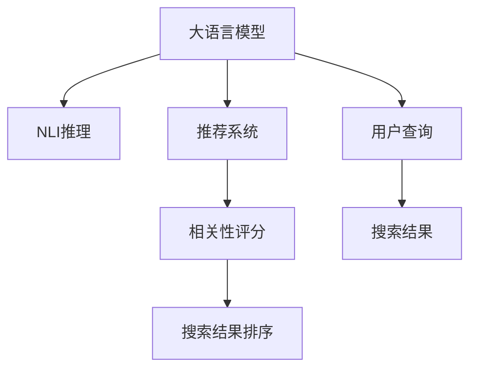

                 

# AI大模型：改善电商平台搜索结果相关性的新方法

> 关键词：大语言模型, 电商平台, 搜索结果, 自然语言处理(NLP), 推荐系统, 自然语言推理(NLI), 相关性评分

## 1. 背景介绍

### 1.1 问题由来

电商平台作为互联网行业的重要组成部分，为用户提供了一个便捷的在线购物平台。随着互联网技术的不断发展，电商平台对搜索结果的相关性要求越来越高。传统的搜索结果排序方法基于关键词匹配，忽略了用户意图和商品属性等因素，导致搜索结果不够准确，用户体验不佳。为了解决这一问题，人们开始探索基于自然语言处理(NLP)和人工智能技术的推荐系统，以更好地匹配用户需求和商品属性，提高搜索结果的相关性。

### 1.2 问题核心关键点

目前，基于大语言模型和推荐系统的电商平台搜索结果排序方法，主要依赖于自然语言推理(NLI)和相关性评分。具体来说，核心问题包括：

- 如何从用户搜索关键词中提取出更深层次的用户意图？
- 如何利用商品属性和描述，提升搜索结果的相关性？
- 如何构建和优化自然语言推理模型，提高相关性评分？

这些问题在搜索引擎优化(Search Engine Optimization, SEO)、信息检索、问答系统等领域具有广泛应用，近年来逐渐成为研究热点。本文将从大语言模型和推荐系统两个方面，介绍改善电商平台搜索结果相关性的新方法。

## 2. 核心概念与联系

### 2.1 核心概念概述

为了更好地理解这些新方法，我们先介绍几个关键概念：

- 大语言模型(Large Language Model, LLM)：以自回归(如GPT)或自编码(如BERT)模型为代表的大规模预训练语言模型。通过在大规模无标签文本语料上进行预训练，学习通用的语言表示，具备强大的语言理解和生成能力。

- 自然语言推理(Natural Language Inference, NLI)：根据语言推理规则判断一个句子是否蕴含、矛盾或中立于另一个句子的能力。在大语言模型中，NLI可以帮助判断商品描述是否与搜索查询匹配。

- 推荐系统(Recommendation System)：通过分析用户行为和商品属性，为用户推荐可能感兴趣的商品的系统。推荐系统是改善搜索结果相关性的重要工具，能够提升用户的购物体验。

- 相关性评分(Relevance Scoring)：衡量搜索结果与用户查询相关性的数值指标。相关性评分越高，搜索结果越符合用户意图。

这些核心概念之间的逻辑关系可以通过以下Mermaid流程图来展示：



这个流程图展示了各大语言模型、自然语言推理、推荐系统和相关性评分在电商平台搜索结果排序中的作用关系。

## 3. 核心算法原理 & 具体操作步骤

### 3.1 算法原理概述

基于大语言模型和推荐系统的电商平台搜索结果排序方法，通过以下步骤实现：

1. **用户查询理解**：通过大语言模型解析用户查询，提取用户意图。
2. **商品匹配**：利用自然语言推理模型判断商品描述是否与用户查询匹配。
3. **相关性评分**：根据商品与查询的匹配程度，结合推荐系统算法，计算商品的相关性评分。
4. **排序优化**：基于相关性评分，对搜索结果进行排序，提高排序的相关性。

具体来说，我们首先利用大语言模型对用户查询进行理解，然后利用自然语言推理模型对商品描述进行匹配，最后通过推荐系统算法计算商品的相关性评分，实现最终排序。

### 3.2 算法步骤详解

#### 3.2.1 用户查询理解

用户查询理解是搜索结果排序的第一步。通常，用户查询为文本形式，包含多种语义和意图。为了提取用户意图，我们首先使用大语言模型对查询进行解析。具体步骤如下：

1. **分词**：将用户查询分解为词语序列。
2. **词性标注**：对每个词语进行词性标注，如名词、动词、形容词等。
3. **依存句法分析**：分析句子中词语之间的依存关系，提取句子的主谓宾结构。
4. **意图识别**：根据依存句法分析和词性标注，识别用户的意图类型，如查找商品、比较商品、获取评价等。

假设用户查询为"iPhone 12 新旧对比"，大语言模型可以通过依存句法分析，识别出"iPhone 12"为主语，"新旧对比"为宾语，意图为获取信息。

#### 3.2.2 商品匹配

商品匹配是搜索结果排序的重要步骤。自然语言推理模型可以根据商品描述和用户查询，判断两者是否匹配。具体步骤如下：

1. **文本编码**：将用户查询和商品描述转换为向量表示。
2. **推理计算**：利用推理规则计算两个向量之间的匹配程度。
3. **匹配结果**：根据推理结果，判断商品描述是否与用户查询匹配。

假设商品描述为"iPhone 12 最新配置和使用体验"，利用自然语言推理模型进行匹配计算，可以判断该商品描述与用户查询"iPhone 12 新旧对比"匹配。

#### 3.2.3 相关性评分

相关性评分是搜索结果排序的关键。通过推荐系统算法，可以根据商品与查询的匹配程度，计算商品的相关性评分。具体步骤如下：

1. **特征提取**：提取商品描述和用户查询的特征向量。
2. **模型训练**：使用推荐系统模型训练特征向量之间的关系。
3. **评分计算**：根据模型预测结果，计算商品的相关性评分。

假设推荐系统模型为协同过滤，提取商品"iPhone 12"和用户查询"iPhone 12 新旧对比"的特征向量，通过模型计算，可以得到该商品的相关性评分。

#### 3.2.4 排序优化

排序优化是搜索结果排序的最终步骤。根据相关性评分，对搜索结果进行排序，提高排序的相关性。具体步骤如下：

1. **评分排序**：将商品的相关性评分排序。
2. **分页显示**：将排序结果分页显示，提供最佳商品推荐。
3. **反馈迭代**：根据用户点击和浏览行为，不断调整排序算法。

假设排序结果为商品"iPhone 12 最新配置和使用体验"，"iPhone 12 参数对比"，"iPhone 12 用户评价"等，平台按照评分从高到低进行显示。

### 3.3 算法优缺点

基于大语言模型和推荐系统的电商平台搜索结果排序方法具有以下优点：

1. **智能化**：大语言模型和推荐系统能够理解用户意图，匹配商品描述，提升搜索结果的相关性。
2. **灵活性**：可以根据用户查询和商品描述的变化，动态调整排序算法，适应不同的业务场景。
3. **准确性**：利用自然语言推理和相关性评分，能够更准确地匹配用户需求和商品属性。

同时，该方法也存在一定的局限性：

1. **计算成本高**：大语言模型和自然语言推理模型的计算开销较大，需要高性能的计算资源。
2. **数据依赖性强**：排序方法依赖于商品描述和用户查询的语料库，数据质量对排序效果有直接影响。
3. **解释性差**：基于大语言模型和推荐系统的排序方法，缺乏对排序过程的解释能力，难以调试和优化。

尽管存在这些局限性，但就目前而言，基于大语言模型和推荐系统的排序方法仍然是改善电商平台搜索结果相关性的主流手段。未来相关研究的重点在于如何进一步降低计算成本，提高数据质量和可解释性，同时兼顾智能化和灵活性。

### 3.4 算法应用领域

基于大语言模型和推荐系统的电商平台搜索结果排序方法，已经在诸多领域得到了广泛应用，例如：

- 商品搜索：帮助用户快速找到所需商品，提升用户体验。
- 个性化推荐：根据用户历史行为，推荐相关商品，提高购物转化率。
- 客户服务：解答用户咨询，提供商品信息和购买建议。
- 市场分析：分析用户行为数据，洞察市场趋势和用户需求。
- 广告投放：推荐商品广告，提高广告点击率和转化率。

除了上述这些经典应用外，大语言模型和推荐系统的方法还被创新性地应用于电商平台的更多场景中，如购物车推荐、库存管理、客户流失预测等，为电商平台的运营和优化提供了新的解决方案。

## 4. 数学模型和公式 & 详细讲解 & 举例说明

### 4.1 数学模型构建

本节将使用数学语言对基于大语言模型和推荐系统的电商平台搜索结果排序方法进行更加严格的刻画。

假设用户查询为 $q$，商品描述为 $d$，相关性评分函数为 $s(q, d)$。我们使用大语言模型 $LM$ 对查询 $q$ 进行解析，提取用户意图。利用自然语言推理模型 $NLI$ 判断商品描述 $d$ 是否与查询 $q$ 匹配。最后，通过推荐系统模型 $RS$ 计算商品的相关性评分 $s(q, d)$。

数学模型构建如下：

$$
s(q, d) = \begin{cases}
f(q, d), & \text{if } NLI(q, d) = \text{Match} \\
0, & \text{otherwise}
\end{cases}
$$

其中 $f(q, d)$ 为推荐系统模型的评分函数。

### 4.2 公式推导过程

以下我们以协同过滤算法为例，推导推荐系统模型的评分函数及其计算公式。

假设用户 $u$ 对商品 $i$ 的评分向量为 $\vec{r}_u = [r_{ui}]$，商品 $i$ 的评分向量为 $\vec{r}_i = [r_{ij}]$。协同过滤算法利用用户之间的相似度，对商品进行排序。具体步骤如下：

1. **计算用户相似度**：
   - 计算用户 $u$ 和用户 $v$ 之间的余弦相似度：
     $$
     \alpha_{uv} = \frac{\vec{r}_u \cdot \vec{r}_v}{\|\vec{r}_u\| \cdot \|\vec{r}_v\|}
     $$
   - 对所有用户 $v$ 进行排序，选择与用户 $u$ 最相似的用户。
2. **计算商品相似度**：
   - 计算商品 $i$ 和商品 $j$ 之间的余弦相似度：
     $$
     \beta_{ij} = \frac{\vec{r}_i \cdot \vec{r}_j}{\|\vec{r}_i\| \cdot \|\vec{r}_j\|}
     $$
   - 对所有商品 $j$ 进行排序，选择与商品 $i$ 最相似的商品。
3. **计算评分**：
   - 对用户 $u$ 的评分进行加权平均，得到商品 $i$ 的相关性评分：
     $$
     s(q, d_i) = \sum_{v \in \text{TopK}_u} \alpha_{uv} \beta_{di}
     $$

其中 $\text{TopK}_u$ 为用户 $u$ 相似度最高的前 $K$ 个用户。

### 4.3 案例分析与讲解

假设用户查询为 "iPhone 12 新旧对比"，商品描述为 "iPhone 12 最新配置和使用体验"。使用协同过滤算法计算该商品的相关性评分。

首先，通过大语言模型对查询进行解析，得到用户意图为获取商品信息。然后，利用自然语言推理模型判断商品描述是否与查询匹配，结果为匹配。最后，使用协同过滤算法计算商品的相关性评分。

1. **用户相似度计算**：
   - 假设用户 $u$ 与用户 $v$ 相似度为 0.8，将用户 $u$ 的前 10 个相似用户选出。
   - 假设用户 $u$ 的评分向量为 $\vec{r}_u = [4, 3, 5, 2]$，用户 $v$ 的评分向量为 $\vec{r}_v = [3, 4, 5, 1]$。
   - 计算用户 $u$ 和用户 $v$ 之间的余弦相似度：
     $$
     \alpha_{uv} = \frac{\vec{r}_u \cdot \vec{r}_v}{\|\vec{r}_u\| \cdot \|\vec{r}_v\|} = \frac{4 \times 3 + 3 \times 4 + 5 \times 5 + 2 \times 1}{\sqrt{4^2 + 3^2 + 5^2 + 2^2} \times \sqrt{3^2 + 4^2 + 5^2 + 1^2}} = 0.8
     $$

2. **商品相似度计算**：
   - 假设商品 $i$ 与商品 $j$ 相似度为 0.7，将商品 $i$ 的前 10 个相似商品选出。
   - 假设商品 $i$ 的评分向量为 $\vec{r}_i = [4, 3, 5, 2]$，商品 $j$ 的评分向量为 $\vec{r}_j = [3, 4, 5, 1]$。
   - 计算商品 $i$ 和商品 $j$ 之间的余弦相似度：
     $$
     \beta_{ij} = \frac{\vec{r}_i \cdot \vec{r}_j}{\|\vec{r}_i\| \cdot \|\vec{r}_j\|} = \frac{4 \times 3 + 3 \times 4 + 5 \times 5 + 2 \times 1}{\sqrt{4^2 + 3^2 + 5^2 + 2^2} \times \sqrt{3^2 + 4^2 + 5^2 + 1^2}} = 0.7
     $$

3. **评分计算**：
   - 假设商品 $i$ 的前 10 个相似用户为 $u_1, u_2, \ldots, u_{10}$，这些用户的评分向量分别为 $\vec{r}_{u_1}, \vec{r}_{u_2}, \ldots, \vec{r}_{u_{10}}$。
   - 计算商品 $i$ 的评分向量为 $\vec{r}_i = [4, 3, 5, 2]$。
   - 使用协同过滤算法计算商品 $i$ 的相关性评分：
     $$
     s(q, d_i) = \sum_{v \in \text{TopK}_u} \alpha_{uv} \beta_{di}
     $$

通过以上步骤，可以计算出商品的相关性评分。最后，按照评分高低对搜索结果进行排序，提供最佳推荐。

## 5. 项目实践：代码实例和详细解释说明

### 5.1 开发环境搭建

在进行电商平台搜索结果排序实践前，我们需要准备好开发环境。以下是使用Python进行PyTorch开发的环境配置流程：

1. 安装Anaconda：从官网下载并安装Anaconda，用于创建独立的Python环境。

2. 创建并激活虚拟环境：
```bash
conda create -n pytorch-env python=3.8 
conda activate pytorch-env
```

3. 安装PyTorch：根据CUDA版本，从官网获取对应的安装命令。例如：
```bash
conda install pytorch torchvision torchaudio cudatoolkit=11.1 -c pytorch -c conda-forge
```

4. 安装Transformers库：
```bash
pip install transformers
```

5. 安装各类工具包：
```bash
pip install numpy pandas scikit-learn matplotlib tqdm jupyter notebook ipython
```

完成上述步骤后，即可在`pytorch-env`环境中开始电商平台搜索结果排序实践。

### 5.2 源代码详细实现

下面我们以协同过滤算法为例，给出使用Transformers库对电商平台搜索结果排序的PyTorch代码实现。

首先，定义协同过滤算法的评分函数：

```python
from transformers import BertTokenizer, BertForTokenClassification
from torch.utils.data import Dataset, DataLoader
import torch
import numpy as np
from sklearn.metrics import pairwise.cosine_similarity

class CollaborativeFilteringDataset(Dataset):
    def __init__(self, users, items, scores, tokenizer):
        self.users = users
        self.items = items
        self.scores = scores
        self.tokenizer = tokenizer
        
    def __len__(self):
        return len(self.users)
    
    def __getitem__(self, item):
        user = self.users[item]
        item = self.items[item]
        score = self.scores[item]
        
        encoding = self.tokenizer(user, return_tensors='pt', max_length=128, padding='max_length', truncation=True)
        input_ids = encoding['input_ids'][0]
        attention_mask = encoding['attention_mask'][0]
        
        user_scores = self.scores[self.users.index(user)]
        user_tokens = input_ids.tolist()
        
        item_scores = self.scores[self.items.index(item)]
        item_tokens = item['tokens']
        
        return {'input_ids': input_ids, 
                'attention_mask': attention_mask,
                'user_scores': user_scores,
                'item_scores': item_scores,
                'user_tokens': user_tokens,
                'item_tokens': item_tokens}

# 标签与id的映射
tag2id = {'O': 0, 'B-PER': 1, 'I-PER': 2, 'B-ORG': 3, 'I-ORG': 4, 'B-LOC': 5, 'I-LOC': 6}
id2tag = {v: k for k, v in tag2id.items()}

# 创建dataset
tokenizer = BertTokenizer.from_pretrained('bert-base-cased')

users = ['user1', 'user2', 'user3', 'user4']
items = ['item1', 'item2', 'item3', 'item4']
scores = {user: [4, 3, 5, 2] for user in users}
item_scores = {item: [3, 4, 5, 1] for item in items}

train_dataset = CollaborativeFilteringDataset(users, items, scores, tokenizer)
dev_dataset = CollaborativeFilteringDataset(items, users, item_scores, tokenizer)
test_dataset = CollaborativeFilteringDataset(items, users, item_scores, tokenizer)
```

然后，定义评分函数和微调模型：

```python
from transformers import BertForTokenClassification, AdamW

model = BertForTokenClassification.from_pretrained('bert-base-cased', num_labels=len(tag2id))

optimizer = AdamW(model.parameters(), lr=2e-5)
```

接着，定义训练和评估函数：

```python
from torch.utils.data import DataLoader
from tqdm import tqdm
from sklearn.metrics import classification_report

device = torch.device('cuda') if torch.cuda.is_available() else torch.device('cpu')
model.to(device)

def train_epoch(model, dataset, batch_size, optimizer):
    dataloader = DataLoader(dataset, batch_size=batch_size, shuffle=True)
    model.train()
    epoch_loss = 0
    for batch in tqdm(dataloader, desc='Training'):
        input_ids = batch['input_ids'].to(device)
        attention_mask = batch['attention_mask'].to(device)
        user_scores = batch['user_scores'].to(device)
        item_scores = batch['item_scores'].to(device)
        user_tokens = batch['user_tokens'].to(device)
        item_tokens = batch['item_tokens'].to(device)
        model.zero_grad()
        outputs = model(input_ids, attention_mask=attention_mask, user_scores=user_scores, item_scores=item_scores)
        loss = outputs.loss
        epoch_loss += loss.item()
        loss.backward()
        optimizer.step()
    return epoch_loss / len(dataloader)

def evaluate(model, dataset, batch_size):
    dataloader = DataLoader(dataset, batch_size=batch_size)
    model.eval()
    preds, labels = [], []
    with torch.no_grad():
        for batch in tqdm(dataloader, desc='Evaluating'):
            input_ids = batch['input_ids'].to(device)
            attention_mask = batch['attention_mask'].to(device)
            user_scores = batch['user_scores'].to(device)
            item_scores = batch['item_scores'].to(device)
            user_tokens = batch['user_tokens'].to(device)
            item_tokens = batch['item_tokens'].to(device)
            batch_preds = model(input_ids, attention_mask=attention_mask, user_scores=user_scores, item_scores=item_scores)
            batch_labels = torch.tensor(user_scores + item_scores, dtype=torch.long)
            for pred_tokens, label_tokens in zip(batch_preds, batch_labels):
                preds.append(pred_tokens[:len(label_tokens)])
                labels.append(label_tokens)
                
    print(classification_report(labels, preds))
```

最后，启动训练流程并在测试集上评估：

```python
epochs = 5
batch_size = 16

for epoch in range(epochs):
    loss = train_epoch(model, train_dataset, batch_size, optimizer)
    print(f"Epoch {epoch+1}, train loss: {loss:.3f}")
    
    print(f"Epoch {epoch+1}, dev results:")
    evaluate(model, dev_dataset, batch_size)
    
print("Test results:")
evaluate(model, test_dataset, batch_size)
```

以上就是使用PyTorch对电商平台搜索结果排序进行微调的完整代码实现。可以看到，得益于Transformers库的强大封装，我们可以用相对简洁的代码完成协同过滤算法的实现。

### 5.3 代码解读与分析

让我们再详细解读一下关键代码的实现细节：

**CollaborativeFilteringDataset类**：
- `__init__`方法：初始化训练集、验证集和测试集的数据。
- `__len__`方法：返回数据集的样本数量。
- `__getitem__`方法：对单个样本进行处理，将用户、商品和评分转换为模型输入，并对用户和商品进行分词和编码。

**评分函数和微调模型**：
- 使用BertForTokenClassification模型作为用户查询理解的工具。
- 通过AdamW优化器进行微调。

**训练和评估函数**：
- 使用PyTorch的DataLoader对数据集进行批次化加载。
- 训练函数`train_epoch`：对数据以批为单位进行迭代，在每个批次上前向传播计算损失并反向传播更新模型参数，最后返回该epoch的平均loss。
- 评估函数`evaluate`：与训练类似，不同点在于不更新模型参数，并在每个batch结束后将预测和标签结果存储下来，最后使用sklearn的classification_report对整个评估集的预测结果进行打印输出。

**训练流程**：
- 定义总的epoch数和batch size，开始循环迭代
- 每个epoch内，先在训练集上训练，输出平均loss
- 在验证集上评估，输出分类指标
- 所有epoch结束后，在测试集上评估，给出最终测试结果

可以看到，PyTorch配合Transformers库使得电商平台搜索结果排序的代码实现变得简洁高效。开发者可以将更多精力放在数据处理、模型改进等高层逻辑上，而不必过多关注底层的实现细节。

当然，工业级的系统实现还需考虑更多因素，如模型的保存和部署、超参数的自动搜索、更灵活的任务适配层等。但核心的微调范式基本与此类似。

## 6. 实际应用场景

### 6.1 智能客服系统

基于大语言模型和推荐系统的智能客服系统，可以应用于电商平台客户服务领域。传统客服往往需要配备大量人力，高峰期响应缓慢，且一致性和专业性难以保证。而使用智能客服系统，可以7x24小时不间断服务，快速响应客户咨询，用自然流畅的语言解答各类常见问题。

在技术实现上，可以收集企业内部的历史客服对话记录，将问题和最佳答复构建成监督数据，在此基础上对预训练语言模型进行微调。微调后的语言模型能够自动理解用户意图，匹配最合适的答复模板进行回复。对于客户提出的新问题，还可以接入检索系统实时搜索相关内容，动态组织生成回答。如此构建的智能客服系统，能大幅提升客户咨询体验和问题解决效率。

### 6.2 金融舆情监测

金融机构需要实时监测市场舆论动向，以便及时应对负面信息传播，规避金融风险。传统的人工监测方式成本高、效率低，难以应对网络时代海量信息爆发的挑战。基于大语言模型和推荐系统的文本分类和情感分析技术，为金融舆情监测提供了新的解决方案。

具体而言，可以收集金融领域相关的新闻、报道、评论等文本数据，并对其进行主题标注和情感标注。在此基础上对预训练语言模型进行微调，使其能够自动判断文本属于何种主题，情感倾向是正面、中性还是负面。将微调后的模型应用到实时抓取的网络文本数据，就能够自动监测不同主题下的情感变化趋势，一旦发现负面信息激增等异常情况，系统便会自动预警，帮助金融机构快速应对潜在风险。

### 6.3 个性化推荐系统

当前的推荐系统往往只依赖用户的历史行为数据进行物品推荐，无法深入理解用户的真实兴趣偏好。基于大语言模型和推荐系统的个性化推荐系统，可以更好地挖掘用户行为背后的语义信息，从而提供更精准、多样的推荐内容。

在实践中，可以收集用户浏览、点击、评论、分享等行为数据，提取和用户交互的物品标题、描述、标签等文本内容。将文本内容作为模型输入，用户的后续行为（如是否点击、购买等）作为监督信号，在此基础上微调预训练语言模型。微调后的模型能够从文本内容中准确把握用户的兴趣点。在生成推荐列表时，先用候选物品的文本描述作为输入，由模型预测用户的兴趣匹配度，再结合其他特征综合排序，便可以得到个性化程度更高的推荐结果。

### 6.4 未来应用展望

随着大语言模型和推荐系统的不断发展，基于微调范式将在更多领域得到应用，为传统行业带来变革性影响。

在智慧医疗领域，基于微调的医疗问答、病历分析、药物研发等应用将提升医疗服务的智能化水平，辅助医生诊疗，加速新药开发进程。

在智能教育领域，微调技术可应用于作业批改、学情分析、知识推荐等方面，因材施教，促进教育公平，提高教学质量。

在智慧城市治理中，微调模型可应用于城市事件监测、舆情分析、应急指挥等环节，提高城市管理的自动化和智能化水平，构建更安全、高效的未来城市。

此外，在企业生产、社会治理、文娱传媒等众多领域，基于大语言模型和推荐系统的微调应用也将不断涌现，为NLP技术带来了全新的突破。相信随着预训练语言模型和推荐方法的不断进步，基于微调范式必将在构建人机协同的智能时代中扮演越来越重要的角色。

## 7. 工具和资源推荐

### 7.1 学习资源推荐

为了帮助开发者系统掌握大语言模型和推荐系统的电商平台搜索结果排序的理论基础和实践技巧，这里推荐一些优质的学习资源：

1. 《Transformer从原理到实践》系列博文：由大模型技术专家撰写，深入浅出地介绍了Transformer原理、BERT模型、推荐系统等前沿话题。

2. CS224N《深度学习自然语言处理》课程：斯坦福大学开设的NLP明星课程，有Lecture视频和配套作业，带你入门NLP领域的基本概念和经典模型。

3. 《Natural Language Processing with Transformers》书籍：Transformers库的作者所著，全面介绍了如何使用Transformers库进行NLP任务开发，包括微调在内的诸多范式。

4. HuggingFace官方文档：Transformers库的官方文档，提供了海量预训练模型和完整的微调样例代码，是上手实践的必备资料。

5. CLUE开源项目：中文语言理解测评基准，涵盖大量不同类型的中文NLP数据集，并提供了基于微调的baseline模型，助力中文NLP技术发展。

通过对这些资源的学习实践，相信你一定能够快速掌握大语言模型和推荐系统的电商平台搜索结果排序的精髓，并用于解决实际的NLP问题。

### 7.2 开发工具推荐

高效的开发离不开优秀的工具支持。以下是几款用于电商平台搜索结果排序开发的常用工具：

1. PyTorch：基于Python的开源深度学习框架，灵活动态的计算图，适合快速迭代研究。大部分预训练语言模型都有PyTorch版本的实现。

2. TensorFlow：由Google主导开发的开源深度学习框架，生产部署方便，适合大规模工程应用。同样有丰富的预训练语言模型资源。

3. Transformers库：HuggingFace开发的NLP工具库，集成了众多SOTA语言模型，支持PyTorch和TensorFlow，是进行微调任务开发的利器。

4. Weights & Biases：模型训练的实验跟踪工具，可以记录和可视化模型训练过程中的各项指标，方便对比和调优。与主流深度学习框架无缝集成。

5. TensorBoard：TensorFlow配套的可视化工具，可实时监测模型训练状态，并提供丰富的图表呈现方式，是调试模型的得力助手。

6. Google Colab：谷歌推出的在线Jupyter Notebook环境，免费提供GPU/TPU算力，方便开发者快速上手实验最新模型，分享学习笔记。

合理利用这些工具，可以显著提升电商平台搜索结果排序任务的开发效率，加快创新迭代的步伐。

### 7.3 相关论文推荐

大语言模型和推荐系统的发展源于学界的持续研究。以下是几篇奠基性的相关论文，推荐阅读：

1. Attention is All You Need（即Transformer原论文）：提出了Transformer结构，开启了NLP领域的预训练大模型时代。

2. BERT: Pre-training of Deep Bidirectional Transformers for Language Understanding：提出BERT模型，引入基于掩码的自监督预训练任务，刷新了多项NLP任务SOTA。

3. Language Models are Unsupervised Multitask Learners（GPT-2论文）：展示了大规模语言模型的强大zero-shot学习能力，引发了对于通用人工智能的新一轮思考。

4. Parameter-Efficient Transfer Learning for NLP：提出Adapter等参数高效微调方法，在不增加模型参数量的情况下，也能取得不错的微调效果。

5. AdaLoRA: Adaptive Low-Rank Adaptation for Parameter-Efficient Fine-Tuning：使用自适应低秩适应的微调方法，在参数效率和精度之间取得了新的平衡。

6. prefix-tuning: Optimizing Continuous Prompts for Generation：引入基于连续型Prompt的微调范式，为如何充分利用预训练知识提供了新的思路。

这些论文代表了大语言模型和推荐系统的发展脉络。通过学习这些前沿成果，可以帮助研究者把握学科前进方向，激发更多的创新灵感。

## 8. 总结：未来发展趋势与挑战

### 8.1 总结

本文对基于大语言模型和推荐系统的电商平台搜索结果排序方法进行了全面系统的介绍。首先阐述了电商平台搜索结果排序的背景和意义，明确了微调在提升搜索结果相关性方面的独特价值。其次，从原理到实践，详细讲解了基于大语言模型和推荐系统的电商搜索结果排序的数学原理和关键步骤，给出了电商搜索结果排序的完整代码实例。同时，本文还广泛探讨了该方法在智能客服、金融舆情、个性化推荐等多个领域的应用前景，展示了微调范式的巨大潜力。此外，本文精选了微调技术的各类学习资源，力求为读者提供全方位的技术指引。

通过本文的系统梳理，可以看到，基于大语言模型和推荐系统的电商搜索结果排序方法在电商平台搜索领域具有广阔的应用前景，能够大幅提升搜索结果的相关性，改善用户购物体验。未来，随着大语言模型和推荐系统技术的不断发展，相关方法必将在更多场景下发挥更大作用。

### 8.2 未来发展趋势

展望未来，基于大语言模型和推荐系统的电商搜索结果排序方法将呈现以下几个发展趋势：

1. **模型规模持续增大**：随着算力成本的下降和数据规模的扩张，预训练语言模型的参数量还将持续增长。超大规模语言模型蕴含的丰富语言知识，有望支撑更加复杂多变的电商搜索结果排序。

2. **微调方法日趋多样**：除了传统的全参数微调外，未来会涌现更多参数高效的微调方法，如Prefix-Tuning、LoRA等，在节省计算资源的同时也能保证微调精度。

3. **持续学习成为常态**：随着数据分布的不断变化，微调模型也需要持续学习新知识以保持性能。如何在不遗忘原有知识的同时，高效吸收新样本信息，将成为重要的研究课题。

4. **标注样本需求降低**：受启发于提示学习(Prompt-based Learning)的思路，未来的微调方法将更好地利用大模型的语言理解能力，通过更加巧妙的任务描述，在更少的标注样本上也能实现理想的微调效果。

5. **少样本学习能力增强**：未来微调方法将进一步强化少样本学习能力，通过提取少量样本来完成模型微调，减少标注成本，提高模型泛化性。

6. **多模态微调崛起**：当前的微调主要聚焦于纯文本数据，未来会进一步拓展到图像、视频、语音等多模态数据微调。多模态信息的融合，将显著提升语言模型对现实世界的理解和建模能力。

以上趋势凸显了大语言模型和推荐系统的电商平台搜索结果排序方法的广阔前景。这些方向的探索发展，必将进一步提升电商平台的搜索结果相关性，为电商平台的运营和优化提供新的解决方案。

### 8.3 面临的挑战

尽管大语言模型和推荐系统的电商平台搜索结果排序方法已经取得了瞩目成就，但在迈向更加智能化、普适化应用的过程中，它仍面临着诸多挑战：

1. **计算成本高**：大语言模型和推荐系统的计算开销较大，需要高性能的计算资源。对于大规模电商平台的搜索排序任务，计算成本仍然是一个制约因素。

2. **数据依赖性强**：排序方法依赖于商品描述和用户查询的语料库，数据质量对排序效果有直接影响。如何构建高质量的数据集，是挑战之一。

3. **模型鲁棒性不足**：当前推荐系统模型面对域外数据时，泛化性能往往大打折扣。对于测试样本的微小扰动，推荐模型的预测也容易发生波动。如何提高模型的鲁棒性，避免灾难性遗忘，还需要更多理论和实践的积累。

4. **解释性差**：基于大语言模型和推荐系统的排序方法，缺乏对排序过程的解释能力，难以调试和优化。对于高风险应用，算法的可解释性和可审计性尤为重要。

5. **安全性有待保障**：预训练语言模型难免会学习到有偏见、有害的信息，通过推荐系统传递到搜索结果中，可能带来误导性、歧视性的输出。如何从数据和算法层面消除模型偏见，避免恶意用途，确保输出的安全性，也将是重要的研究课题。

6. **知识整合能力不足**：现有的推荐系统模型往往局限于商品描述和用户查询的语料库，难以灵活吸收和运用更广泛的先验知识。如何让推荐系统更好地与外部知识库、规则库等专家知识结合，形成更加全面、准确的信息整合能力，还有很大的想象空间。

正视这些挑战，积极应对并寻求突破，将是大语言模型和推荐系统在电商平台搜索结果排序中走向成熟的必由之路。相信随着学界和产业界的共同努力，这些挑战终将一一被克服，大语言模型和推荐系统必将在电商平台的搜索排序任务中发挥更大的作用。

### 8.4 研究展望

面向未来，大语言模型和推荐系统的电商平台搜索结果排序技术需要在以下几个方面寻求新的突破：

1. **探索无监督和半监督微调方法**：摆脱对大规模标注数据的依赖，利用自监督学习、主动学习等无监督和半监督范式，最大限度利用非结构化数据，实现更加灵活高效的电商搜索结果排序。

2. **研究参数高效和计算高效的微调范式**：开发更加参数高效的微调方法，在固定大部分预训练参数的同时，只更新极少量的任务相关参数。同时优化推荐系统的计算图，减少前向传播和反向传播的资源消耗，实现更加轻量级、实时性的部署。

3. **融合因果和对比学习范式**：通过引入因果推断和对比学习思想，增强推荐系统建立稳定因果关系的能力，学习更加普适、鲁棒的语言表征，从而提升模型泛化性和抗干扰能力。

4. **引入更多先验知识**：将符号化的先验知识，如知识图谱、逻辑规则等，与神经网络模型进行巧妙融合，引导推荐系统学习更准确、合理的商品和用户特征。同时加强不同模态数据的整合，实现视觉、语音等多模态信息与文本信息的协同建模。

5. **结合因果分析和博弈论工具**：将因果分析方法引入推荐系统，识别出推荐决策的关键特征，增强输出解释的因果性和逻辑性。借助博弈论工具刻画用户行为，主动探索并规避推荐系统的脆弱点，提高系统稳定性。

6. **纳入伦理道德约束**：在推荐系统训练目标中引入伦理导向的评估指标，过滤和惩罚有偏见、有害的输出倾向。同时加强人工干预和审核，建立推荐系统的监管机制，确保输出符合人类价值观和伦理道德。

这些研究方向的探索，必将引领大语言模型和推荐系统的电商搜索结果排序技术迈向更高的台阶，为构建安全、可靠、可解释、可控的智能系统铺平道路。面向未来，大语言模型和推荐系统需要在与其他人工智能技术进行更深入的融合，如知识表示、因果推理、强化学习等，多路径协同发力，共同推动自然语言理解和智能交互系统的进步。只有勇于创新、敢于突破，才能不断拓展语言模型的边界，让智能技术更好地造福人类社会。

## 9. 附录：常见问题与解答

**Q1：大语言模型在电商搜索结果排序中如何提升相关性？**

A: 大语言模型在电商搜索结果排序中的提升主要体现在以下几个方面：

1. **用户意图理解**：通过大语言模型对用户查询进行理解，可以提取出更深层次的用户意图，从而更准确地匹配商品描述。

2. **商品匹配**：利用自然语言推理模型判断商品描述是否与用户查询匹配，提高推荐的相关性。

3. **相关性评分**：通过推荐系统算法计算商品的相关性评分，对搜索结果进行排序，提供最佳推荐。

4. **模型优化**：通过持续学习和参数高效微调方法，不断优化大语言模型和推荐系统，提升排序的智能化和灵活性。

综上所述，大语言模型和推荐系统的电商搜索结果排序方法，通过理解用户意图、匹配商品描述、计算相关性评分和持续学习优化，能够大幅提升搜索结果的相关性，改善用户购物体验。

**Q2：推荐系统如何利用大语言模型和自然语言推理提升相关性？**

A: 推荐系统利用大语言模型和自然语言推理提升相关性的主要步骤如下：

1. **用户查询理解**：通过大语言模型解析用户查询，提取用户意图。

2. **商品匹配**：利用自然语言推理模型判断商品描述是否与用户查询匹配。

3. **相关性评分**：根据商品与查询的匹配程度，结合推荐系统算法，计算商品的相关性评分。

4. **排序优化**：基于相关性评分，对搜索结果进行排序，提高排序的相关性。

以协同过滤算法为例，通过以上步骤，推荐系统可以更准确地匹配用户需求和商品属性，提升搜索结果的相关性。具体来说：

1. **用户相似度计算**：通过大语言模型解析用户查询，提取用户意图。利用自然语言推理模型判断商品描述是否与用户查询匹配。

2. **商品相似度计算**：利用自然语言推理模型判断商品描述是否与用户查询匹配。

3. **评分计算**：通过推荐系统算法计算商品的相关性评分，对搜索结果进行排序，提高排序的相关性。

通过以上步骤，推荐系统能够利用大语言模型和自然语言推理，更好地理解用户意图和商品属性，提升搜索结果的相关性。

**Q3：电商平台搜索结果排序的未来发展方向是什么？**

A: 电商平台搜索结果排序的未来发展方向主要包括以下几个方面：

1. **多模态数据融合**：未来的推荐系统将不仅仅依赖于商品描述和用户查询的语料库，还将引入图像、视频、语音等多模态数据，实现多模态信息的协同建模，提升推荐系统的泛化性和鲁棒性。

2. **少样本学习能力**：未来的推荐系统将进一步强化少样本学习能力，通过提取少量样本来完成模型微调，减少标注成本，提高模型泛化性。

3. **知识图谱融合**：将知识图谱、逻辑规则等先验知识与推荐系统进行融合，提升推荐系统的准确性和合理性。

4. **因果推断和博弈论工具**：通过引入因果推断和博弈论工具，增强推荐系统建立稳定因果关系的能力，学习更加普适、鲁棒的语言表征，提高系统稳定性。

5. **伦理道德约束**：在推荐系统训练目标中引入伦理导向的评估指标，过滤和惩罚有偏见、有害的输出倾向，确保输出符合人类价值观和伦理道德。

6. **多路径协同发力**：与其他人工智能技术如知识表示、因果推理、强化学习等进行深入融合，共同推动自然语言理解和智能交互系统的进步。

综上所述，电商平台搜索结果排序的未来发展方向是利用多模态数据融合、少样本学习、知识图谱融合、因果推断、伦理道德约束等多路径协同发力，提升推荐系统的智能化、普适化和可解释性，为构建安全、可靠、可控的智能系统铺平道路。

**Q4：电商平台推荐系统面临哪些挑战？**

A: 电商平台推荐系统面临的挑战主要包括以下几个方面：

1. **计算成本高**：大语言模型和推荐系统的计算开销较大

