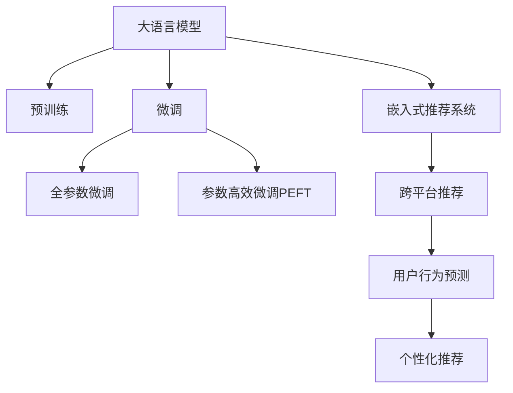

                 

# AI大模型：改善电商平台跨平台推荐的新方法

> 关键词：大模型推荐, 电商平台, 跨平台推荐, 用户行为预测, 个性化推荐

## 1. 背景介绍

### 1.1 问题由来

随着电商平台的迅速发展，用户数量和交易额不断攀升，个性化推荐成为提升用户体验和交易转化率的重要手段。传统的推荐系统多采用基于协同过滤、内容相似度、基于规则等方法，其核心依赖于历史用户行为数据的关联性分析。然而，随着用户群体和产品种类的不断扩大，这种基于历史数据的方法逐渐显得捉襟见肘，难以捕捉新的用户兴趣和产品特性。

大模型推荐技术应运而生。大模型如BERT、GPT-3、DALL-E等，以其强大的语言理解和生成能力，能够从海量无标签文本数据中学习到丰富的语言表示，进而应用于个性化推荐场景。通过将大模型作为推荐系统的核心，不仅能够处理结构化、半结构化数据，还能利用非结构化文本数据，捕捉更加隐晦和复杂的用户行为特征和产品特性，从而提高推荐的精准度和覆盖度。

### 1.2 问题核心关键点

大模型在电商平台推荐系统中的应用，主要包括两大关键点：

1. **预训练-微调范式**：通过在大规模语料上进行预训练，大模型可以学习到通用的语言表示。然后，根据特定电商平台的商品和用户数据，对模型进行微调，以适应平台的特点和需求。

2. **参数高效微调**：由于大模型通常具有庞大的参数量，全参数微调不仅耗时耗力，还会过拟合。因此，需要引入参数高效微调方法，如Adapter、Prompt-based Learning等，只更新少量参数，既节省资源，又避免过拟合。

## 2. 核心概念与联系

### 2.1 核心概念概述

为更好地理解大模型在电商平台推荐系统中的应用，本节将介绍几个密切相关的核心概念：

- **大语言模型(Large Language Model, LLM)**：如BERT、GPT-3等，以自回归或自编码模型为代表，通过在大规模无标签文本数据上进行预训练，学习到通用的语言表示。

- **预训练(Pre-training)**：在大规模无标签文本数据上，通过自监督学习任务训练通用语言模型的过程。常见的预训练任务包括掩码语言模型、预测下一个单词等。

- **微调(Fine-tuning)**：在预训练模型的基础上，使用特定电商平台的数据集进行有监督学习，优化模型以适应电商平台的特点和需求。

- **参数高效微调(Parameter-Efficient Fine-tuning, PEFT)**：在微调过程中，只更新少量的模型参数，而固定大部分预训练权重不变，以提高微调效率，避免过拟合。

- **迁移学习(Transfer Learning)**：通过在大规模语料上预训练，然后针对特定任务进行微调，实现知识迁移。

- **嵌入式推荐系统(Embedded Recommendation System)**：将大模型嵌入推荐系统，通过模型预测和推理来实现个性化推荐。

- **跨平台推荐(Cross-platform Recommendation)**：在多平台数据中，通过大模型的预训练和微调，实现平台间的知识共享和推荐结果的协同。

- **用户行为预测(User Behavior Prediction)**：通过分析用户历史行为数据，预测用户未来的行为，如购买、浏览、评价等。

- **个性化推荐(Personalized Recommendation)**：根据用户的行为预测，推荐最适合用户的商品或内容。

这些核心概念之间的逻辑关系可以通过以下Mermaid流程图来展示：



这个流程图展示了大语言模型与推荐系统各组件之间的联系：

1. 大语言模型通过预训练获得基础能力。
2. 微调使模型适配电商平台需求。
3. 参数高效微调提高微调效率。
4. 嵌入式推荐系统实现个性化推荐。
5. 跨平台推荐实现知识共享。
6. 用户行为预测指导推荐策略。
7. 个性化推荐实现精准推荐。

这些概念共同构成了大模型在电商平台推荐系统中的应用框架，使其能够高效地捕捉用户行为，实现精准推荐。

## 3. 核心算法原理 & 具体操作步骤
### 3.1 算法原理概述

大模型在电商平台推荐系统中的应用，本质上是一个有监督的细粒度迁移学习过程。其核心思想是：将大模型视作一个强大的"特征提取器"，通过在电商平台上的数据集上进行有监督微调，使得模型能够预测用户的未来行为，从而生成个性化推荐。

形式化地，假设预训练模型为 $M_{\theta}$，其中 $\theta$ 为预训练得到的模型参数。给定电商平台 $P$ 的用户行为数据集 $D=\{(x_i,y_i)\}_{i=1}^N$，其中 $x_i$ 为用户的浏览记录、评价、购买记录等，$y_i$ 为用户的未来行为（如是否购买某商品）。微调的目标是找到新的模型参数 $\hat{\theta}$，使得：

$$
\hat{\theta}=\mathop{\arg\min}_{\theta} \mathcal{L}(M_{\theta},D)
$$

其中 $\mathcal{L}$ 为针对电商平台设计的损失函数，用于衡量模型预测与真实标签之间的差异。常见的损失函数包括交叉熵损失、均方误差损失等。

通过梯度下降等优化算法，微调过程不断更新模型参数 $\theta$，最小化损失函数 $\mathcal{L}$，使得模型输出逼近真实标签。由于 $\theta$ 已经通过预训练获得了较好的初始化，因此即便在少样本条件下，也能较快收敛到理想的模型参数 $\hat{\theta}$。

### 3.2 算法步骤详解

基于大模型在电商平台推荐系统中的应用，一般包括以下几个关键步骤：

**Step 1: 准备预训练模型和数据集**
- 选择合适的预训练语言模型 $M_{\theta}$ 作为初始化参数，如 BERT、GPT-3等。
- 准备电商平台 $P$ 的用户行为数据集 $D$，划分为训练集、验证集和测试集。一般要求数据集与预训练数据的分布不要差异过大。

**Step 2: 添加任务适配层**
- 根据电商平台的特点，在预训练模型顶层设计合适的输出层和损失函数。
- 对于分类任务，通常在顶层添加线性分类器和交叉熵损失函数。
- 对于回归任务，通常使用均方误差损失函数。

**Step 3: 设置微调超参数**
- 选择合适的优化算法及其参数，如 AdamW、SGD 等，设置学习率、批大小、迭代轮数等。
- 设置正则化技术及强度，包括权重衰减、Dropout、Early Stopping等。
- 确定冻结预训练参数的策略，如仅微调顶层，或全部参数都参与微调。

**Step 4: 执行梯度训练**
- 将训练集数据分批次输入模型，前向传播计算损失函数。
- 反向传播计算参数梯度，根据设定的优化算法和学习率更新模型参数。
- 周期性在验证集上评估模型性能，根据性能指标决定是否触发 Early Stopping。
- 重复上述步骤直到满足预设的迭代轮数或 Early Stopping 条件。

**Step 5: 测试和部署**
- 在测试集上评估微调后模型 $M_{\hat{\theta}}$ 的性能，对比微调前后的精度提升。
- 使用微调后的模型对新样本进行推理预测，集成到实际的应用系统中。
- 持续收集新的数据，定期重新微调模型，以适应数据分布的变化。

以上是基于大模型在电商平台推荐系统中的应用的一般流程。在实际应用中，还需要针对具体电商平台的特点，对微调过程的各个环节进行优化设计，如改进训练目标函数，引入更多的正则化技术，搜索最优的超参数组合等，以进一步提升模型性能。

### 3.3 算法优缺点

大模型在电商平台推荐系统中的应用具有以下优点：

1. **数据处理能力强**：大模型能够处理结构化、半结构化、非结构化等多种格式的数据，从多维度捕捉用户行为特征。

2. **泛化能力强**：基于大规模语料预训练的大模型，能够学习到通用的语言表示，具有良好的泛化能力，适用于不同平台和用户群体。

3. **推荐精准度高**：通过微调，大模型能够准确预测用户行为，生成精准的个性化推荐。

4. **实时更新**：大模型可以不断接收新的数据，进行实时微调，保持推荐结果的时效性。

5. **跨平台协同**：通过跨平台推荐，实现知识共享，提升整体推荐效果。

同时，该方法也存在一定的局限性：

1. **计算资源消耗大**：大模型参数量庞大，微调需要大量计算资源。

2. **对标注数据依赖**：微调依赖标注数据，标注成本较高。

3. **模型复杂度高**：大模型结构复杂，推理速度较慢。

4. **模型解释性差**：大模型的决策过程复杂，难以解释。

尽管存在这些局限性，但就目前而言，大模型在电商平台推荐系统中的应用仍是最主流范式。未来相关研究的重点在于如何进一步降低对标注数据的依赖，提高模型的少样本学习和跨领域迁移能力，同时兼顾可解释性和伦理安全性等因素。

### 3.4 算法应用领域

大模型在电商平台推荐系统中的应用已经广泛应用于多个领域，例如：

- **商品推荐**：根据用户浏览和购买记录，推荐最适合的商品。
- **内容推荐**：根据用户浏览和评价历史，推荐相关的内容。
- **跨平台推荐**：在多个电商平台之间，实现知识共享，提供一致的推荐体验。
- **个性化搜索**：根据用户搜索习惯，推荐可能感兴趣的查询。
- **用户画像**：根据用户行为数据，生成详细的用户画像。
- **异常检测**：检测用户行为中的异常，如欺诈行为、虚假交易等。

除了上述这些经典应用外，大模型在电商平台的创新应用也将不断涌现，如联合推荐、混合推荐、兴趣转移等，为电商平台推荐系统带来新的突破。

## 4. 数学模型和公式 & 详细讲解 & 举例说明
### 4.1 数学模型构建

本节将使用数学语言对基于大模型在电商平台推荐系统中的应用进行更加严格的刻画。

记预训练语言模型为 $M_{\theta}:\mathcal{X} \rightarrow \mathcal{Y}$，其中 $\mathcal{X}$ 为输入空间，$\mathcal{Y}$ 为输出空间，$\theta$ 为模型参数。假设电商平台 $P$ 的用户行为数据集为 $D=\{(x_i,y_i)\}_{i=1}^N, x_i \in \mathcal{X}, y_i \in \mathcal{Y}$。

定义模型 $M_{\theta}$ 在数据样本 $(x,y)$ 上的损失函数为 $\ell(M_{\theta}(x),y)$，则在数据集 $D$ 上的经验风险为：

$$
\mathcal{L}(\theta) = \frac{1}{N} \sum_{i=1}^N \ell(M_{\theta}(x_i),y_i)
$$

微调的优化目标是最小化经验风险，即找到最优参数：

$$
\theta^* = \mathop{\arg\min}_{\theta} \mathcal{L}(\theta)
$$

在实践中，我们通常使用基于梯度的优化算法（如SGD、Adam等）来近似求解上述最优化问题。设 $\eta$ 为学习率，$\lambda$ 为正则化系数，则参数的更新公式为：

$$
\theta \leftarrow \theta - \eta \nabla_{\theta}\mathcal{L}(\theta) - \eta\lambda\theta
$$

其中 $\nabla_{\theta}\mathcal{L}(\theta)$ 为损失函数对参数 $\theta$ 的梯度，可通过反向传播算法高效计算。

### 4.2 公式推导过程

以下我们以电商平台的商品推荐任务为例，推导交叉熵损失函数及其梯度的计算公式。

假设模型 $M_{\theta}$ 在输入 $x$ 上的输出为 $\hat{y}=M_{\theta}(x) \in [0,1]$，表示用户购买某商品的预测概率。真实标签 $y \in \{0,1\}$。则二分类交叉熵损失函数定义为：

$$
\ell(M_{\theta}(x),y) = -[y\log \hat{y} + (1-y)\log (1-\hat{y})]
$$

将其代入经验风险公式，得：

$$
\mathcal{L}(\theta) = -\frac{1}{N}\sum_{i=1}^N [y_i\log M_{\theta}(x_i)+(1-y_i)\log(1-M_{\theta}(x_i))]
$$

根据链式法则，损失函数对参数 $\theta_k$ 的梯度为：

$$
\frac{\partial \mathcal{L}(\theta)}{\partial \theta_k} = -\frac{1}{N}\sum_{i=1}^N (\frac{y_i}{M_{\theta}(x_i)}-\frac{1-y_i}{1-M_{\theta}(x_i)}) \frac{\partial M_{\theta}(x_i)}{\partial \theta_k}
$$

其中 $\frac{\partial M_{\theta}(x_i)}{\partial \theta_k}$ 可进一步递归展开，利用自动微分技术完成计算。

在得到损失函数的梯度后，即可带入参数更新公式，完成模型的迭代优化。重复上述过程直至收敛，最终得到适应电商平台需求的最优模型参数 $\theta^*$。

## 5. 项目实践：代码实例和详细解释说明
### 5.1 开发环境搭建

在进行推荐系统开发前，我们需要准备好开发环境。以下是使用Python进行PyTorch开发的环境配置流程：

1. 安装Anaconda：从官网下载并安装Anaconda，用于创建独立的Python环境。

2. 创建并激活虚拟环境：
```bash
conda create -n pytorch-env python=3.8 
conda activate pytorch-env
```

3. 安装PyTorch：根据CUDA版本，从官网获取对应的安装命令。例如：
```bash
conda install pytorch torchvision torchaudio cudatoolkit=11.1 -c pytorch -c conda-forge
```

4. 安装Transformers库：
```bash
pip install transformers
```

5. 安装各类工具包：
```bash
pip install numpy pandas scikit-learn matplotlib tqdm jupyter notebook ipython
```

完成上述步骤后，即可在`pytorch-env`环境中开始推荐系统实践。

### 5.2 源代码详细实现

这里我们以电商平台商品推荐任务为例，给出使用Transformers库对BERT模型进行推荐系统开发的PyTorch代码实现。

首先，定义商品推荐任务的数据处理函数：

```python
from transformers import BertTokenizer
from torch.utils.data import Dataset
import torch

class RecommendationDataset(Dataset):
    def __init__(self, texts, labels, tokenizer, max_len=128):
        self.texts = texts
        self.labels = labels
        self.tokenizer = tokenizer
        self.max_len = max_len
        
    def __len__(self):
        return len(self.texts)
    
    def __getitem__(self, item):
        text = self.texts[item]
        label = self.labels[item]
        
        encoding = self.tokenizer(text, return_tensors='pt', max_length=self.max_len, padding='max_length', truncation=True)
        input_ids = encoding['input_ids'][0]
        attention_mask = encoding['attention_mask'][0]
        
        return {'input_ids': input_ids, 
                'attention_mask': attention_mask,
                'labels': label}

# 标签与id的映射
tag2id = {'buy': 1, 'not_buy': 0}
id2tag = {v: k for k, v in tag2id.items()}

# 创建dataset
tokenizer = BertTokenizer.from_pretrained('bert-base-cased')

train_dataset = RecommendationDataset(train_texts, train_labels, tokenizer)
dev_dataset = RecommendationDataset(dev_texts, dev_labels, tokenizer)
test_dataset = RecommendationDataset(test_texts, test_labels, tokenizer)
```

然后，定义模型和优化器：

```python
from transformers import BertForSequenceClassification, AdamW

model = BertForSequenceClassification.from_pretrained('bert-base-cased', num_labels=2)

optimizer = AdamW(model.parameters(), lr=2e-5)
```

接着，定义训练和评估函数：

```python
from torch.utils.data import DataLoader
from tqdm import tqdm
from sklearn.metrics import classification_report

device = torch.device('cuda') if torch.cuda.is_available() else torch.device('cpu')
model.to(device)

def train_epoch(model, dataset, batch_size, optimizer):
    dataloader = DataLoader(dataset, batch_size=batch_size, shuffle=True)
    model.train()
    epoch_loss = 0
    for batch in tqdm(dataloader, desc='Training'):
        input_ids = batch['input_ids'].to(device)
        attention_mask = batch['attention_mask'].to(device)
        labels = batch['labels'].to(device)
        model.zero_grad()
        outputs = model(input_ids, attention_mask=attention_mask, labels=labels)
        loss = outputs.loss
        epoch_loss += loss.item()
        loss.backward()
        optimizer.step()
    return epoch_loss / len(dataloader)

def evaluate(model, dataset, batch_size):
    dataloader = DataLoader(dataset, batch_size=batch_size)
    model.eval()
    preds, labels = [], []
    with torch.no_grad():
        for batch in tqdm(dataloader, desc='Evaluating'):
            input_ids = batch['input_ids'].to(device)
            attention_mask = batch['attention_mask'].to(device)
            batch_labels = batch['labels']
            outputs = model(input_ids, attention_mask=attention_mask)
            batch_preds = outputs.logits.argmax(dim=2).to('cpu').tolist()
            batch_labels = batch_labels.to('cpu').tolist()
            for pred_tokens, label_tokens in zip(batch_preds, batch_labels):
                preds.append(pred_tokens[:len(label_tokens)])
                labels.append(label_tokens)
                
    print(classification_report(labels, preds))
```

最后，启动训练流程并在测试集上评估：

```python
epochs = 5
batch_size = 16

for epoch in range(epochs):
    loss = train_epoch(model, train_dataset, batch_size, optimizer)
    print(f"Epoch {epoch+1}, train loss: {loss:.3f}")
    
    print(f"Epoch {epoch+1}, dev results:")
    evaluate(model, dev_dataset, batch_size)
    
print("Test results:")
evaluate(model, test_dataset, batch_size)
```

以上就是使用PyTorch对BERT进行电商平台商品推荐任务微调的完整代码实现。可以看到，得益于Transformers库的强大封装，我们可以用相对简洁的代码完成BERT模型的加载和微调。

### 5.3 代码解读与分析

让我们再详细解读一下关键代码的实现细节：

**RecommendationDataset类**：
- `__init__`方法：初始化文本、标签、分词器等关键组件。
- `__len__`方法：返回数据集的样本数量。
- `__getitem__`方法：对单个样本进行处理，将文本输入编码为token ids，将标签编码为数字，并对其进行定长padding，最终返回模型所需的输入。

**tag2id和id2tag字典**：
- 定义了标签与数字id之间的映射关系，用于将token-wise的预测结果解码回真实的标签。

**训练和评估函数**：
- 使用PyTorch的DataLoader对数据集进行批次化加载，供模型训练和推理使用。
- 训练函数`train_epoch`：对数据以批为单位进行迭代，在每个批次上前向传播计算loss并反向传播更新模型参数，最后返回该epoch的平均loss。
- 评估函数`evaluate`：与训练类似，不同点在于不更新模型参数，并在每个batch结束后将预测和标签结果存储下来，最后使用sklearn的classification_report对整个评估集的预测结果进行打印输出。

**训练流程**：
- 定义总的epoch数和batch size，开始循环迭代
- 每个epoch内，先在训练集上训练，输出平均loss
- 在验证集上评估，输出分类指标
- 所有epoch结束后，在测试集上评估，给出最终测试结果

可以看到，PyTorch配合Transformers库使得BERT微调的代码实现变得简洁高效。开发者可以将更多精力放在数据处理、模型改进等高层逻辑上，而不必过多关注底层的实现细节。

当然，工业级的系统实现还需考虑更多因素，如模型的保存和部署、超参数的自动搜索、更灵活的任务适配层等。但核心的微调范式基本与此类似。

## 6. 实际应用场景
### 6.1 智能客服系统

基于大模型推荐技术的智能客服系统，可以通过分析用户的历史咨询记录，生成个性化的应答策略，提升客户服务体验。具体实现如下：

1. 收集客服历史对话记录，将问题和最佳答复构建成监督数据。
2. 使用大模型对模型进行预训练。
3. 在大模型上进行微调，以适配特定客服系统。
4. 根据用户当前咨询问题，输入到微调后的模型中，生成最佳答复。

通过这种方法，智能客服系统能够在较短时间内提供与人工客服相媲美的服务，提升客户满意度和平台运营效率。

### 6.2 个性化广告投放

在个性化广告投放中，推荐系统可以根据用户的历史行为数据，预测其未来的兴趣，生成精准的广告推荐。具体实现如下：

1. 收集用户浏览、点击、购买等行为数据。
2. 将数据预处理后，输入到预训练模型中。
3. 在大模型上进行微调，以适配特定广告投放需求。
4. 根据用户兴趣预测，生成个性化广告推荐。

通过这种方法，广告主能够高效地实现广告精准投放，提高点击率和转化率。

### 6.3 金融风控

在金融领域，推荐系统可以通过分析用户的交易行为，预测其信用风险，生成风控策略。具体实现如下：

1. 收集用户的交易记录、历史信用评分等数据。
2. 将数据预处理后，输入到预训练模型中。
3. 在大模型上进行微调，以适配金融风控需求。
4. 根据用户信用风险预测，生成风控策略。

通过这种方法，金融机构能够及时识别和防范风险，保障金融安全。

### 6.4 未来应用展望

随着大模型推荐技术的发展，其在更多领域的应用将不断拓展。未来，大模型推荐技术有望在以下几个方面实现突破：

1. **多模态推荐**：融合文本、图像、视频等多模态信息，提升推荐效果。
2. **实时推荐**：实现实时数据接收和处理，提供即时的个性化推荐。
3. **跨平台协同**：实现不同平台之间的知识共享和推荐协同，提升整体推荐效果。
4. **用户行为分析**：深度挖掘用户行为数据，生成全面的用户画像。
5. **异常检测**：检测用户行为中的异常，如欺诈行为、虚假交易等。
6. **混合推荐**：结合传统协同过滤和基于内容的推荐，提升推荐效果。

大模型推荐技术在电商平台的成功应用，将为更多行业带来新的变革，进一步推动人工智能技术的发展。

## 7. 工具和资源推荐
### 7.1 学习资源推荐

为了帮助开发者系统掌握大模型推荐技术的理论基础和实践技巧，这里推荐一些优质的学习资源：

1. 《Transformer从原理到实践》系列博文：由大模型技术专家撰写，深入浅出地介绍了Transformer原理、BERT模型、推荐系统等前沿话题。

2. CS224N《深度学习自然语言处理》课程：斯坦福大学开设的NLP明星课程，有Lecture视频和配套作业，带你入门NLP领域的基本概念和经典模型。

3. 《Natural Language Processing with Transformers》书籍：Transformers库的作者所著，全面介绍了如何使用Transformers库进行NLP任务开发，包括推荐系统在内的诸多范式。

4. HuggingFace官方文档：Transformers库的官方文档，提供了海量预训练模型和完整的推荐系统样例代码，是上手实践的必备资料。

5. CLUE开源项目：中文语言理解测评基准，涵盖大量不同类型的中文NLP数据集，并提供了基于大模型的baseline推荐模型，助力中文NLP技术发展。

通过对这些资源的学习实践，相信你一定能够快速掌握大模型推荐技术的精髓，并用于解决实际的推荐问题。
###  7.2 开发工具推荐

高效的开发离不开优秀的工具支持。以下是几款用于大模型推荐系统开发的常用工具：

1. PyTorch：基于Python的开源深度学习框架，灵活动态的计算图，适合快速迭代研究。大部分预训练语言模型都有PyTorch版本的实现。

2. TensorFlow：由Google主导开发的开源深度学习框架，生产部署方便，适合大规模工程应用。同样有丰富的预训练语言模型资源。

3. Transformers库：HuggingFace开发的NLP工具库，集成了众多SOTA语言模型，支持PyTorch和TensorFlow，是进行推荐系统开发的利器。

4. Weights & Biases：模型训练的实验跟踪工具，可以记录和可视化模型训练过程中的各项指标，方便对比和调优。与主流深度学习框架无缝集成。

5. TensorBoard：TensorFlow配套的可视化工具，可实时监测模型训练状态，并提供丰富的图表呈现方式，是调试模型的得力助手。

6. Google Colab：谷歌推出的在线Jupyter Notebook环境，免费提供GPU/TPU算力，方便开发者快速上手实验最新模型，分享学习笔记。

合理利用这些工具，可以显著提升大模型推荐系统的开发效率，加快创新迭代的步伐。

### 7.3 相关论文推荐

大模型推荐技术的发展源于学界的持续研究。以下是几篇奠基性的相关论文，推荐阅读：

1. Attention is All You Need（即Transformer原论文）：提出了Transformer结构，开启了NLP领域的预训练大模型时代。

2. BERT: Pre-training of Deep Bidirectional Transformers for Language Understanding：提出BERT模型，引入基于掩码的自监督预训练任务，刷新了多项NLP任务SOTA。

3. Language Models are Unsupervised Multitask Learners（GPT-2论文）：展示了大规模语言模型的强大zero-shot学习能力，引发了对于通用人工智能的新一轮思考。

4. Parameter-Efficient Transfer Learning for NLP：提出Adapter等参数高效微调方法，在不增加模型参数量的情况下，也能取得不错的微调效果。

5. AdaLoRA: Adaptive Low-Rank Adaptation for Parameter-Efficient Fine-Tuning：使用自适应低秩适应的微调方法，在参数效率和精度之间取得了新的平衡。

这些论文代表了大模型推荐技术的发展脉络。通过学习这些前沿成果，可以帮助研究者把握学科前进方向，激发更多的创新灵感。

## 8. 总结：未来发展趋势与挑战
### 8.1 总结

本文对基于大模型的电商平台推荐系统进行了全面系统的介绍。首先阐述了大模型推荐技术的研究背景和意义，明确了预训练-微调范式在大模型推荐中的应用价值。其次，从原理到实践，详细讲解了大模型在推荐系统中的应用，包括模型的构建、超参数设置、训练和评估等关键步骤，给出了推荐系统开发的完整代码实例。同时，本文还探讨了基于大模型推荐技术的实际应用场景，展示了其在智能客服、个性化广告投放、金融风控等领域的广泛应用前景。此外，本文精选了推荐技术的各类学习资源，力求为读者提供全方位的技术指引。

通过本文的系统梳理，可以看到，基于大模型的推荐系统正在成为电商平台推荐系统的重要范式，极大地拓展了推荐系统的应用边界，带来了更多的业务价值。未来，伴随预训练语言模型和推荐系统方法的持续演进，相信推荐技术将在更广阔的领域得到应用，为电商平台的智能化转型提供新的助力。

### 8.2 未来发展趋势

展望未来，基于大模型的推荐系统将呈现以下几个发展趋势：

1. **推荐效果提升**：随着预训练模型和推荐算法的发展，推荐效果将持续提升，为用户带来更精准、个性化的推荐服务。

2. **推荐系统实时化**：通过引入实时数据流和低延迟技术，推荐系统将实现实时推荐，提高用户满意度和平台运营效率。

3. **多模态融合**：融合文本、图像、视频等多模态信息，提升推荐系统的综合能力，为用户提供更全面的推荐服务。

4. **跨平台协同**：实现不同平台之间的知识共享和推荐协同，提升整体推荐效果。

5. **用户行为分析**：深度挖掘用户行为数据，生成全面的用户画像，提供更精准的推荐服务。

6. **推荐系统的自动化**：通过自动化推荐策略优化和超参数搜索，提高推荐系统的性能和效率。

7. **推荐系统的可解释性**：提高推荐系统的可解释性，使用户能够理解推荐结果的生成过程，增强用户信任度。

这些趋势凸显了基于大模型的推荐系统在电商平台推荐系统中的应用前景。这些方向的探索发展，必将进一步提升推荐系统的性能和应用范围，为电商平台推荐系统带来新的突破。

### 8.3 面临的挑战

尽管基于大模型的推荐系统已经取得了瞩目成就，但在迈向更加智能化、普适化应用的过程中，它仍面临诸多挑战：

1. **数据质量问题**：推荐系统依赖于用户行为数据，数据质量直接影响推荐效果。数据不完整、不真实、不平衡等问题需要进一步解决。

2. **计算资源消耗大**：大模型参数量庞大，推荐系统训练和推理需要大量计算资源。如何优化计算资源消耗，提升系统的处理能力，仍是重要课题。

3. **用户隐私保护**：推荐系统需要收集和处理大量用户数据，如何保护用户隐私，避免数据泄露，是必须面对的问题。

4. **模型复杂度高**：大模型推荐系统复杂度较高，难以解释，用户难以理解和信任推荐结果。

5. **跨平台一致性**：不同平台的数据格式、用户行为差异较大，如何实现跨平台一致性，是推荐系统面临的重要挑战。

6. **推荐结果公平性**：推荐系统容易引入偏见，如何保证推荐结果的公平性，避免对特定群体的不公平待遇，是必须解决的问题。

尽管存在这些挑战，但伴随预训练语言模型和推荐系统方法的不断进步，基于大模型的推荐系统将逐步克服这些难题，实现更广泛的应用。

### 8.4 研究展望

面对基于大模型的推荐系统所面临的挑战，未来的研究需要在以下几个方面寻求新的突破：

1. **推荐算法优化**：进一步优化推荐算法，提高推荐效果，引入更多元化的推荐方式，提升用户体验。

2. **推荐系统可解释性**：提高推荐系统的可解释性，使用户能够理解推荐结果的生成过程，增强用户信任度。

3. **数据质量提升**：提高数据质量，解决数据不完整、不真实、不平衡等问题，提升推荐系统性能。

4. **推荐系统自动化**：通过自动化推荐策略优化和超参数搜索，提高推荐系统的性能和效率。

5. **用户隐私保护**：引入隐私保护技术，保护用户隐私，防止数据泄露。

6. **跨平台协同**：实现不同平台之间的知识共享和推荐协同，提升整体推荐效果。

7. **推荐结果公平性**：引入公平性算法，保证推荐结果的公平性，避免对特定群体的不公平待遇。

这些研究方向的探索，必将引领基于大模型的推荐系统迈向更高的台阶，为电商平台推荐系统带来新的突破，推动推荐技术的持续发展和应用。

## 9. 附录：常见问题与解答

**Q1：大模型推荐系统是否适用于所有电商推荐场景？**

A: 大模型推荐系统在大多数电商推荐场景中都能取得不错的效果，特别是对于数据量较小的平台。但对于一些特定领域的电商推荐，如个性化、娱乐、社交等，需要结合具体场景进行优化。

**Q2：推荐系统是否需要大量标注数据？**

A: 大模型推荐系统需要大量标注数据，但可以通过半监督学习、弱监督学习等方式，减少对标注数据的依赖。此外，还可以通过用户行为数据进行无监督学习，提高推荐效果。

**Q3：推荐系统是否会引入数据偏差？**

A: 大模型推荐系统容易引入数据偏差，需要引入公平性算法和隐私保护技术，避免对特定群体的不公平待遇和数据泄露。

**Q4：推荐系统是否需要实时更新？**

A: 推荐系统需要实时更新，以适应不断变化的用户行为和市场环境。可以通过在线学习、增量学习等方式，实现推荐系统的实时更新。

**Q5：推荐系统是否需要用户交互反馈？**

A: 推荐系统可以通过用户交互反馈进行迭代优化，提高推荐效果。用户反馈可以是点击、购买、评价等多种形式，可以通过AB测试等方法进行收集和分析。

通过本文的系统梳理，可以看到，基于大模型的推荐系统正在成为电商平台推荐系统的重要范式，极大地拓展了推荐系统的应用边界，带来了更多的业务价值。未来，伴随预训练语言模型和推荐系统方法的持续演进，相信推荐技术将在更广阔的领域得到应用，为电商平台的智能化转型提供新的助力。

---

作者：禅与计算机程序设计艺术 / Zen and the Art of Computer Programming

